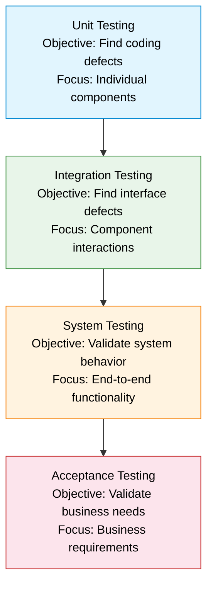
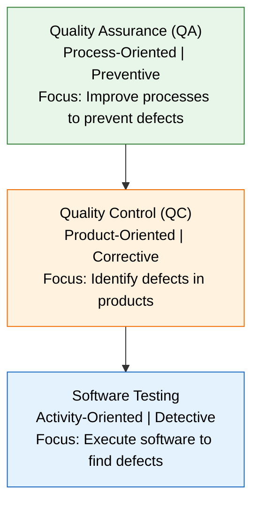
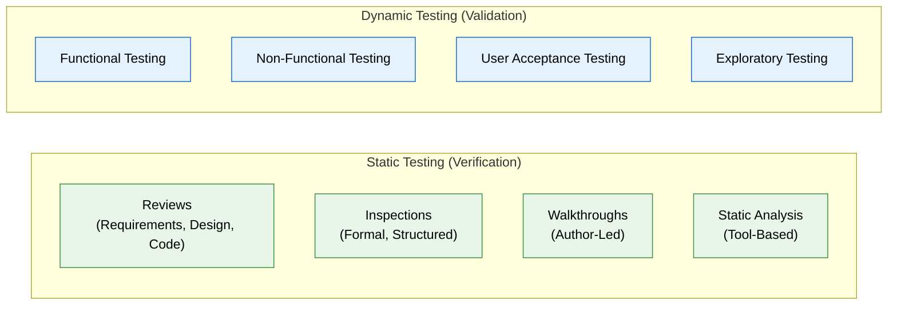
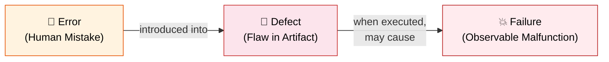
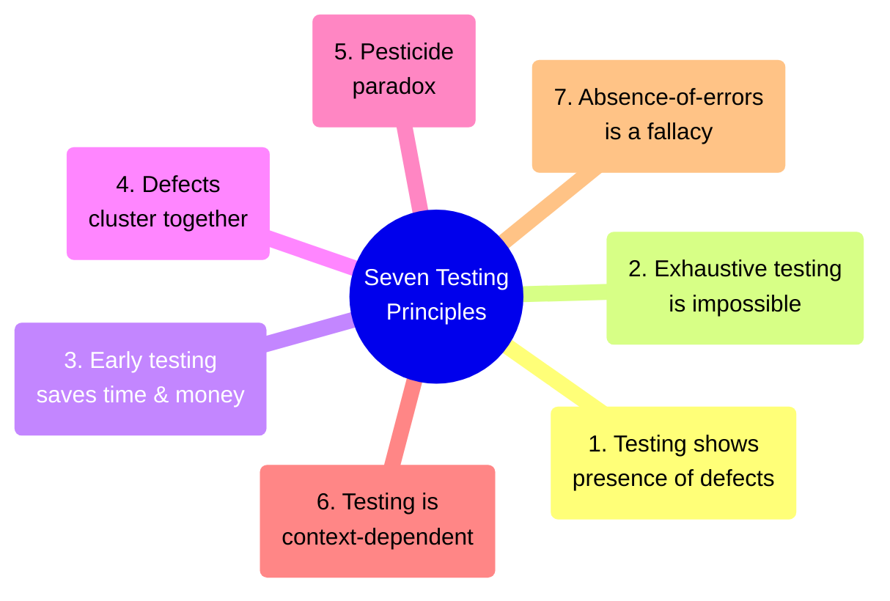

# Part 1: Software Testing Fundamentals

> **Study Guide for Manual Testing Professionals**
> Difficulty Level: Intermediate to Advanced | Estimated Reading Time: 60 minutes

---

## Table of Contents

1. [1.1 Definition of Software Testing](#11-definition-of-software-testing)
2. [1.2 Objectives of Testing](#12-objectives-of-testing)
3. [1.3 Testing vs. Quality Assurance vs. Quality Control](#13-testing-vs-quality-assurance-vs-quality-control)
4. [1.4 Verification vs. Validation](#14-verification-vs-validation)
5. [1.5 Error, Defect, Bug, Failure — Definitions with Examples](#15-error-defect-bug-failure--definitions-with-examples)
6. [1.6 Seven Testing Principles (ISTQB)](#16-seven-testing-principles-istqb)
7. [1.7 Psychology of Testing](#17-psychology-of-testing)
8. [Common Interview Questions](#common-interview-questions)

---

## 1.1 Definition of Software Testing

### What Is Software Testing?

Software testing is far more than simply "clicking around an application to find bugs." It is a systematic, disciplined process that sits at the heart of software quality engineering. Understanding its formal and practical definitions is the first step to mastering the discipline.

#### IEEE Definition (IEEE 610.12-1990)

> **"The process of operating a system or component under specified conditions, observing or recording the results, and making an evaluation of some aspect of the system or component."**

This formal definition emphasizes three critical activities:

1. **Operating the system** — Executing the software under controlled, specified conditions.
2. **Observing and recording** — Documenting what actually happens during execution.
3. **Evaluating** — Comparing observed behavior against expected behavior.

#### ISTQB Definition (v4.0 Syllabus)

> **"Software testing is a set of activities to discover defects and evaluate the quality of software artifacts. These artifacts, when being tested, are known as test objects."**

The ISTQB definition broadens the scope to include not just running code, but also reviewing requirements, design documents, and other artifacts.

#### Practical / Industry Definition

In day-to-day practice, software testing can be defined as:

> **The process of verifying and validating that a software application meets business and technical requirements, works as expected, and can be implemented with the same characteristics — all while identifying defects before the product reaches end users.**

This practical definition captures what testers actually do: they act as the last line of defense between a flawed product and a frustrated customer.

#### The Full Scope of Software Testing

Many people mistakenly believe testing is limited to running test cases against a finished product. In reality, modern testing encompasses:

| Activity | When It Happens | Example |
|----------|----------------|---------|
| Requirements Review | Requirements Phase | Reviewing a banking app's requirements to check if "transfer limits" are clearly defined |
| Test Planning | After requirements are finalized | Creating a test plan for an e-commerce checkout module |
| Test Design | During or after development | Designing test cases for a payment gateway integration |
| Test Execution | After a build is deployed | Running 200 test cases on a staging environment |
| Defect Reporting | During test execution | Logging a bug where discount coupons apply twice |
| Test Closure | End of a test cycle | Generating a test summary report with metrics |
| Static Analysis | Throughout the SDLC | Using SonarQube to scan code for vulnerabilities |

### Why Is Software Testing Necessary?

Software testing is not optional — it is a business-critical necessity. Here are the key reasons, each with a concrete example:

#### 1. To Prevent Financial Loss

**Real-World Example — Knight Capital Group (2012):**
A software defect in Knight Capital's trading algorithm caused the firm to lose **$440 million in just 45 minutes**. A deployment error activated obsolete code that executed millions of unintended trades. Adequate testing of the deployment process and the trading logic could have prevented this catastrophic loss.

#### 2. To Ensure User Safety

**Real-World Example — Therac-25 Radiation Machine (1985-1987):**
A software race condition in the Therac-25 medical radiation therapy machine delivered lethal doses of radiation to patients, resulting in at least **six deaths**. The software was not tested for concurrent input scenarios. This remains one of the most cited examples of why software testing is literally a matter of life and death.

#### 3. To Maintain Brand Reputation

**Real-World Example — Samsung Galaxy Note 7 (2016):**
While primarily a hardware issue, the software battery management system failed to detect and prevent overheating. Samsung recalled 2.5 million phones, costing the company an estimated **$5.3 billion**. The brand damage took years to repair.

#### 4. To Meet Legal and Regulatory Requirements

**Real-World Example — Healthcare (HIPAA):**
A healthcare application that leaks patient data due to a security vulnerability violates HIPAA regulations, resulting in fines of up to **$1.5 million per violation category per year**. Security testing is not a luxury — it is a legal requirement.

#### 5. To Deliver a Quality User Experience

**Real-World Example — Healthcare.gov Launch (2013):**
The U.S. government's healthcare marketplace website crashed on launch day, unable to handle the traffic. Only **6 out of 248 people** who attempted enrollment on day one were successful. Insufficient load testing and integration testing were key contributing factors.

### The Cost of Defects: The 1-10-100 Rule

One of the most important economic principles in software testing is the exponential growth of defect costs across the SDLC. This is known as the **1-10-100 Rule** (also called the **Cost of Quality** or **Boehm's Curve**).

```
Cost to Fix a Defect at Each Stage
═══════════════════════════════════════════════════════════════

Requirements:    █ $1 (1x)
                 ↓
Design:          ██████ $5-6 (5-6x)
                 ↓
Coding:          ██████████ $10 (10x)
                 ↓
Unit Testing:    ███████████████ $15 (15x)
                 ↓
Integration:     ██████████████████████ $22 (22x)
                 ↓
System Testing:  ██████████████████████████████████████ $50 (50x)
                 ↓
Production:      ██████████████████████████████████████████████████████████████ $100+ (100x+)
```

#### The Rule Explained

| Phase | Relative Cost | Why? | Example |
|-------|:------------:|------|---------|
| **Requirements** | **1x** | Fixing a misunderstood requirement is as simple as editing a document | Changing "password must be 6 characters" to "8 characters" in a spec document |
| **Design** | **5-6x** | Design documents, architecture diagrams, and prototypes may need rework | Redesigning a database schema because a requirement was misinterpreted |
| **Coding** | **10x** | Code must be rewritten, reviewed, and unit tested again | Recoding an entire authentication module due to a flawed design |
| **Testing** | **15-50x** | Requires regression testing, re-deployment, and re-validation | A critical defect found during system testing forces code changes, regression testing of 500+ test cases, and a new build |
| **Production** | **100x+** | Customer impact, hotfixes, emergency patches, brand damage, potential lawsuits | A security vulnerability discovered after launch requires an emergency patch, customer notifications, PR response, and potential legal action |

> [!IMPORTANT]
> **The key takeaway is not the exact numbers — it's the exponential curve.** Whether the ratio is 1:10:100 or 1:5:50, the principle holds: **finding defects early is dramatically cheaper than finding them late.**

#### Real-World Cost Example: E-Commerce Checkout Bug

Consider a bug where the tax calculation is incorrect for orders shipped to Canada:

| Discovery Phase | Estimated Cost | What's Involved |
|----------------|:--------------:|-----------------|
| Requirements Review | **$100** | Update the requirements document to specify Canadian tax rules |
| Design Phase | **$500** | Revise the tax calculation module design |
| Coding Phase | **$1,000** | Rewrite tax calculation logic, update unit tests |
| QA Testing | **$5,000** | Fix code, regression test checkout flow, re-deploy to staging |
| Production (Day 1) | **$15,000** | Emergency hotfix, refund affected customers, test and deploy |
| Production (Month 3) | **$100,000+** | Thousands of incorrect orders, mass refunds, CRA audit, customer trust eroded |

### The Testing Paradox

The testing paradox reveals a fundamental contradiction in the nature of software testing:

> **"Testing can prove the presence of defects, but it can never prove their absence."**
> — Edsger W. Dijkstra

This paradox has several important implications:

1. **You can never say software is "bug-free."** Even after thousands of test cases pass, there may be untested paths, edge cases, or environmental conditions that harbor defects.

2. **Testing provides confidence, not certainty.** When a QA team signs off on a release, they are saying: "Based on our test coverage and risk analysis, we believe the software is fit for release." They are **not** saying: "This software has zero defects."

3. **More testing does not always mean better testing.** A thousand poorly designed test cases may miss critical defects that ten well-designed, risk-based test cases would catch.

4. **The paradox justifies risk-based testing.** Since we cannot test everything, we must prioritize testing based on risk — focusing on areas with the highest probability of defects and the highest impact if defects are found.

#### Practical Implications of the Testing Paradox

| Implication | What It Means in Practice | Example |
|------------|--------------------------|---------|
| Cannot prove absence of defects | Release decisions are risk-based, not proof-based | A banking app releases after 95% test coverage, knowing edge cases may still exist |
| Diminishing returns | After a point, additional testing yields fewer new defects | After 3 rounds of regression, new bugs slow to a trickle |
| Context matters | "Enough testing" varies by project risk | A pacemaker's software needs far more testing than a blog app |
| Continuous improvement | Use production defect data to improve future test coverage | Post-release bugs in the payment module lead to expanded payment test cases next sprint |

### Key Takeaways — Section 1.1

> [!TIP]
> - Software testing is a **systematic process**, not just ad hoc exploration.
> - Testing spans the **entire SDLC**, not just the execution phase.
> - The **1-10-100 rule** demonstrates why early testing saves money and time.
> - The **testing paradox** reminds us that testing reduces risk but never eliminates it.
> - Real-world failures (Knight Capital, Therac-25, Healthcare.gov) prove why testing is critical.

---

## 1.2 Objectives of Testing

Testing objectives define the "why" behind testing activities. Without clear objectives, testing becomes aimless and wasteful. Objectives guide test planning, test design, and test prioritization.

### Primary Objectives of Testing

#### 1. Finding Defects (Detection)

The most commonly understood objective. Testers systematically execute the software to uncover defects before they reach production.

**Real-World Example — E-Commerce Product Search:**
A tester discovers that searching for "women's shoes" with an apostrophe causes a SQL injection vulnerability. The apostrophe is not sanitized, allowing an attacker to inject malicious SQL commands. Finding this defect before release prevents a potential data breach.

**What "Finding Defects" Looks Like in Practice:**
- Executing test cases and comparing actual results to expected results
- Performing exploratory testing to uncover unexpected behavior
- Running boundary value tests to check edge cases
- Testing error handling and negative scenarios

#### 2. Gaining Confidence in the Level of Quality

Testing provides stakeholders with evidence-based confidence that the software meets quality standards.

**Real-World Example — Banking Application Release:**
Before releasing a new mobile banking app version, the QA team:
- Executes **1,200 regression test cases** (98% pass rate)
- Performs **performance testing** (response time < 2 seconds under 10,000 concurrent users)
- Conducts **security testing** (no critical or high vulnerabilities found)
- Completes **UAT** with 15 business users (all sign off)

This evidence gives the CTO confidence to approve the release. Without it, the release would be a gamble.

#### 3. Providing Information for Decision-Making

Testing generates data that stakeholders use to make informed decisions about the software.

**Types of Information Testing Provides:**

| Information | Decision It Supports | Example |
|-------------|---------------------|---------|
| Defect density (defects per module) | Where to focus development effort | "The payment module has 3x more defects than other modules — it needs refactoring" |
| Test pass/fail ratio | Release readiness | "92% of critical test cases pass — we are GO for release" |
| Performance metrics | Infrastructure decisions | "Response time exceeds SLA under 5,000 users — we need to scale" |
| Test coverage percentage | Risk assessment | "Only 60% of the API endpoints are covered — we need more API tests" |
| Defect trend analysis | Process improvement | "Defect injection rate is declining sprint over sprint — our reviews are working" |

#### 4. Preventing Defects (Prevention)

Modern testing doesn't just detect defects — it actively prevents them through early involvement.

**How Testers Prevent Defects:**

1. **Requirements Reviews:** Testers review requirements for ambiguity, incompleteness, and testability. A tester asking "What happens if the user enters a negative quantity?" during a requirements review can prevent a coding defect.

2. **Test-Driven Development (TDD) Support:** Even manual testers contribute by writing test cases before development, clarifying expected behavior upfront.

3. **Shift-Left Testing:** Testers participate in design sessions, story grooming, and sprint planning to catch issues before code is written.

**Real-World Example — Preventing a Defect Through Requirements Review:**
A requirements document for a flight booking system states: "Users can book up to 9 passengers." A tester asks:
- "Does this include infants?"
- "What happens if a user tries to book 10?"
- "Can a single booking have passengers from different loyalty programs?"

These questions uncover ambiguities that, if left unresolved, would lead to coding defects.

### Secondary Objectives of Testing

| Objective | Description | Example |
|-----------|-------------|---------|
| **Compliance verification** | Ensuring the software meets regulatory, legal, or contractual standards | Testing a healthcare app against HIPAA requirements |
| **Risk mitigation** | Identifying and reducing the risk associated with software quality | Prioritizing security testing for a fintech application |
| **Process improvement** | Using test results and metrics to improve the development process | Analyzing root causes of defects to improve coding standards |
| **Customer satisfaction** | Ensuring the software meets user expectations for usability and functionality | Conducting usability testing with real users before launch |
| **Documentation validation** | Verifying that user manuals, help files, and API documentation are accurate | Executing steps from the user guide to confirm they match the application |

### How Objectives Differ Across Testing Levels

Testing objectives are **not uniform** across all testing levels. Each level has its own primary focus:



| Testing Level | Primary Objective | Secondary Objective | Who Drives It |
|---------------|-------------------|---------------------|---------------|
| **Unit Testing** | Find defects in individual functions/methods | Verify code logic works as designed | Developers |
| **Integration Testing** | Find defects in component interfaces | Verify data flow between modules | Developers / Testers |
| **System Testing** | Validate complete system against requirements | Assess non-functional qualities (performance, security) | QA Team |
| **Acceptance Testing** | Validate business requirements are met | Gain customer/stakeholder confidence | Business Users / Product Owners |

**Real-World Example — Testing Objectives for an Online Food Delivery App:**

| Level | What's Being Tested | Objective |
|-------|-------------------|-----------|
| Unit | `calculateDeliveryFee(distance, time)` function | Verify the function returns the correct fee for given distance and time inputs |
| Integration | Order Service → Payment Gateway → Notification Service | Verify that placing an order triggers payment and sends a confirmation notification |
| System | Complete order flow: browse → add to cart → checkout → payment → delivery tracking | Validate the entire ordering experience works end-to-end |
| UAT | Real restaurant partners place and fulfill test orders | Confirm the system meets business needs from the restaurant's perspective |

### Key Takeaways — Section 1.2

> [!TIP]
> - Testing has **four primary objectives**: finding defects, gaining confidence, providing information, and preventing defects.
> - **Prevention** is often more valuable than detection — catching a requirements error saves 100x the cost of finding it in production.
> - Testing objectives **vary by testing level** — unit testing focuses on code defects, while UAT focuses on business validation.
> - Testing produces **data for decision-making**, not just pass/fail results.

---

## 1.3 Testing vs. Quality Assurance vs. Quality Control

These three terms are among the most frequently confused in the software industry. Even experienced professionals sometimes use them interchangeably, but they represent fundamentally different concepts.

### Definitions

#### Software Testing

> **Software Testing** is the process of evaluating a software product by executing it with the intent of finding defects. It is a **subset of Quality Control**.

Testing is about **doing** — running test cases, exploring the application, and reporting defects. It is a **reactive** activity that focuses on the product itself.

#### Quality Control (QC)

> **Quality Control** is a **product-oriented** process that focuses on identifying defects in the actual deliverables. It includes testing, code reviews, inspections, and walkthroughs.

QC asks: "Does this specific product meet the required quality standards?" It involves **examining the output** of the development process.

#### Quality Assurance (QA)

> **Quality Assurance** is a **process-oriented** approach that focuses on preventing defects by improving the development and testing processes. It is proactive and preventive.

QA asks: "Are our processes designed to produce quality products?" It involves **defining standards, methodologies, and best practices** that the team follows.

### The Relationship Hierarchy



> [!NOTE]
> **Testing ⊂ QC ⊂ QA** — Testing is a subset of Quality Control, and Quality Control is a subset of Quality Assurance. However, in many organizations, the "QA team" actually performs QC activities (testing). This is a common misnomer.

### Comprehensive Comparison Table

| Aspect | Quality Assurance (QA) | Quality Control (QC) | Software Testing |
|--------|----------------------|---------------------|-----------------|
| **Focus** | Processes | Products | Software application |
| **Approach** | Preventive (proactive) | Corrective (reactive) | Detective (reactive) |
| **Orientation** | Process-oriented | Product-oriented | Activity-oriented |
| **Goal** | Prevent defects from occurring | Identify defects in deliverables | Find defects in software |
| **Scope** | Entire organization/project | Specific deliverables | Specific software product |
| **Responsibility** | Everyone in the organization | QC team / reviewers | Test team |
| **Timing** | Throughout the project lifecycle | During/after development | During/after build deployment |
| **Examples** | Defining coding standards, establishing review processes, implementing CI/CD | Code reviews, inspections, walkthroughs, testing | Executing test cases, exploratory testing, automation |
| **Output** | Process standards, checklists, audit reports | Defect reports, review comments, test results | Test results, defect reports, test metrics |
| **Verification/Validation** | Primarily verification | Both verification and validation | Primarily validation |
| **Analogy** | Writing a recipe book to ensure all chefs cook consistently | Tasting the dish before serving it to the customer | Checking if a specific ingredient is fresh |

### Process-Oriented vs. Product-Oriented

#### Process-Oriented (QA) — The Assembly Line Inspector

QA focuses on improving the **process** so that defects are less likely to occur. Think of it as improving the factory assembly line rather than inspecting individual products.

**QA Activities:**
- Defining test strategy and test processes
- Establishing coding standards (e.g., "All functions must have error handling")
- Implementing code review checklists
- Setting up CI/CD pipelines with automated quality gates
- Conducting process audits (e.g., "Are developers following the branching strategy?")
- Defining and tracking quality metrics (defect density, defect leakage rate)
- Training team members on best practices

#### Product-Oriented (QC/Testing) — The Product Inspector

QC and testing focus on the **product** itself — examining specific deliverables to find defects.

**QC Activities:**
- Code reviews (examining source code for defects)
- Testing (executing software to find defects)
- Inspections (formal examination of documents or code)
- Walkthroughs (author-led review of a deliverable)

### Proactive vs. Reactive Approaches

```
PROACTIVE (QA)                          REACTIVE (QC/Testing)
════════════════                        ═══════════════════════
                                        
Before defects exist:                   After defects may exist:
                                        
✓ Define processes                      ✓ Execute test cases
✓ Establish standards                   ✓ Review code for defects
✓ Train the team                        ✓ Inspect deliverables
✓ Implement quality gates               ✓ Report defects found
✓ Set up prevention mechanisms          ✓ Verify defect fixes
                                        
Goal: PREVENT defects                   Goal: DETECT defects
from being introduced                   before release
```

### Real-World Examples Showing the Difference

#### Example 1: E-Commerce Platform

| Role | Activity | Category |
|------|----------|----------|
| QA Manager | Defines a process: "All API endpoints must have automated tests before merging to main" | **QA** (process definition) |
| QA Manager | Creates a code review checklist: "Check for SQL injection in all database queries" | **QA** (process definition) |
| Code Reviewer | Reviews a pull request and finds that the `getOrderHistory()` function doesn't handle null customer IDs | **QC** (product inspection) |
| Tester | Executes a test case: "Verify that applying a 50% coupon reduces the cart total by half" and finds it doesn't | **Testing** (product testing) |
| Tester | Performs exploratory testing and discovers that adding 10,000 items to the cart crashes the browser | **Testing** (product testing) |
| QA Manager | Analyzes defect data and recommends: "Add input validation to all form fields as a coding standard" | **QA** (process improvement) |

#### Example 2: Mobile Banking Application

| Scenario | Category | Why |
|----------|----------|-----|
| The QA lead establishes a requirement that all financial calculations must be peer-reviewed | **QA** | Defines a process to prevent calculation errors |
| A developer reviews a colleague's interest rate calculation code and finds a rounding error | **QC** | Inspects a product artifact (code) for defects |
| A tester verifies that transferring $500 from savings to checking correctly updates both balances | **Testing** | Executes the software to verify correctness |
| After three production incidents related to session timeouts, the QA team implements a mandatory session management testing checklist | **QA** | Uses defect data to improve the process |

#### Example 3: Hospital Management System

| Scenario | Category | Why |
|----------|----------|-----|
| Mandating that all patient data modules undergo security testing before release | **QA** | Establishes a process requirement |
| Reviewing the database schema design to ensure patient records are properly encrypted | **QC** | Inspecting a product artifact (design) |
| Testing that a nurse can access patient records for their assigned ward but not for other wards | **Testing** | Executing the software to verify access control |
| Introducing pair programming for all modules handling controlled substance prescriptions | **QA** | Implementing a process improvement for high-risk areas |

### The Common Misnomer: "QA Tester"

> [!WARNING]
> In the industry, the title "QA Tester" or "QA Engineer" is extremely common, but it is technically a misnomer. Most people with this title perform **QC activities** (testing and reviewing), not QA activities (process definition and improvement). True QA is a management function. However, this usage is so widespread that it has become accepted industry terminology. In interviews, demonstrate that you understand the distinction even if you use the common title.

### Key Takeaways — Section 1.3

> [!TIP]
> - **QA** is proactive and process-oriented — it prevents defects by improving processes.
> - **QC** is reactive and product-oriented — it detects defects in deliverables.
> - **Testing** is a subset of QC — it detects defects by executing software.
> - The relationship is: **Testing ⊂ QC ⊂ QA**.
> - Most "QA Engineers" actually perform QC/Testing activities — know the distinction for interviews.

---

## 1.4 Verification vs. Validation

Verification and Validation (often abbreviated as **V&V**) are two fundamental pillars of software quality. Though they sound similar, they address entirely different questions.

### The Core Distinction

| | Verification | Validation |
|---|---|---|
| **The Question** | **"Are we building the product RIGHT?"** | **"Are we building the RIGHT product?"** |
| **Focus** | Conformance to specifications | Meeting user needs |
| **Nature** | Static (no code execution required) | Dynamic (requires code execution) |
| **Timing** | Can happen at any phase | Primarily during and after testing |
| **Activities** | Reviews, inspections, walkthroughs, static analysis | Testing (functional, non-functional, UAT) |

### Verification: "Are We Building the Product Right?"

Verification ensures that the product is being **built correctly** according to its specifications. It checks that the output of each development phase meets the input criteria from the previous phase.

**Verification Activities:**

| Activity | Description | Example |
|----------|-------------|---------|
| **Requirements Review** | Reviewing requirements for clarity, completeness, and consistency | Checking if all user stories have acceptance criteria |
| **Design Review** | Reviewing system design against requirements | Verifying that the database schema supports all required queries |
| **Code Review** | Reviewing source code for defects, standards compliance | A peer reviewer finds that error handling is missing in the payment module |
| **Walkthrough** | Author-led, informal review of a document or code | A developer walks the team through the API design |
| **Inspection** | Formal, structured review with defined roles (moderator, reader, recorder) | A Fagan inspection of the authentication module's design |
| **Static Analysis** | Automated tool-based analysis of code without execution | SonarQube flags a potential null pointer dereference |
| **Desk Check** | Developer manually traces through code logic | A developer hand-traces the interest calculation with sample values |

#### Real-World Verification Example — Banking App

A banking application has a requirement: *"The system shall prevent transfers exceeding the daily transfer limit of $10,000."*

**Verification Activities:**

1. **Requirements Review:** A tester asks: "Is the $10,000 limit per transaction or per day cumulative? Does it include pending transfers? Does it apply to all account types?"

2. **Design Review:** The reviewer checks that the transfer service design includes a `DailyLimitChecker` component that queries the daily transfer history before processing a new transfer.

3. **Code Review:** A reviewer examines the `checkDailyLimit()` function and discovers that it only checks completed transfers, not pending ones. This is a defect found through verification — without executing any code.

4. **Static Analysis:** SonarQube identifies that the `transferAmount` variable is a `float` instead of `BigDecimal`, which could cause rounding errors in financial calculations.

### Validation: "Are We Building the Right Product?"

Validation ensures that the product **meets the user's actual needs**. It confirms that what was built is what the user actually wanted.

**Validation Activities:**

| Activity | Description | Example |
|----------|-------------|---------|
| **Functional Testing** | Testing the software's functions against requirements | Verifying that a user can complete a purchase with a credit card |
| **Non-Functional Testing** | Testing performance, security, usability, etc. | Verifying that the checkout page loads within 2 seconds |
| **User Acceptance Testing** | End users test the software in a realistic environment | Business users verify that the monthly report shows correct financial data |
| **Beta Testing** | Real users test the software in their own environments | 500 beta users test a new mobile banking app for 4 weeks |
| **Prototyping** | Building and demonstrating prototypes to users for feedback | Showing a clickable prototype of the dashboard to stakeholders |
| **Alpha Testing** | Testing at the developer's site by internal users | The internal QA team tests the software in a simulated production environment |

#### Real-World Validation Example — E-Commerce Platform

An e-commerce platform has a requirement: *"Users shall be able to filter products by size, color, and price range."*

**Validation Activities:**

1. **Functional Testing:** A tester selects size "M", color "Blue", and price range "$20-$50" and verifies that only matching products are displayed.

2. **Usability Testing:** Users struggle to find the filter options because they are hidden behind a "More Options" dropdown. The feature works correctly but doesn't meet user expectations for discoverability.

3. **UAT:** A business user discovers that the "price range" filter doesn't account for sale prices — a product originally $60 on sale for $40 doesn't appear in the "$20-$50" range. The feature was built to spec, but the spec didn't capture this business need.

### Static vs. Dynamic Testing

The distinction between verification and validation closely aligns with static vs. dynamic testing:



| Aspect | Static Testing | Dynamic Testing |
|--------|---------------|-----------------|
| **Code Execution** | No | Yes |
| **When** | Early in SDLC (requirements, design, code) | After code is deployable |
| **What It Finds** | Ambiguities, deviations from standards, logical errors | Functional failures, performance issues, security vulnerabilities |
| **Tools** | Review tools (Crucible, Gerrit), static analyzers (SonarQube, FindBugs) | Test execution tools (Selenium, JMeter, Postman) |
| **Cost** | Lower (no test environment needed) | Higher (requires test environments, data, builds) |
| **Coverage** | Can cover unreachable code and documentation | Only covers executable paths |

### Comprehensive V&V Mapping to Project Phases

**Example Project: Online Flight Booking System**

| Phase | Verification Activity | Validation Activity |
|-------|----------------------|---------------------|
| **Requirements** | Review: "Is the requirement 'Users can book multi-city flights' clear and testable?" | N/A (no product to validate yet) |
| **Design** | Review: "Does the database design support storing multi-city itineraries?" | Prototype: Show the multi-city booking wireframe to users for feedback |
| **Coding** | Code Review: "Does the `MultiCityBookingService` correctly handle overlapping dates?" | N/A (code not yet testable) |
| **Unit Testing** | N/A | Validate: "Does `calculateMultiCityPrice()` return the correct total?" |
| **Integration Testing** | N/A | Validate: "Does the booking service correctly integrate with the payment gateway?" |
| **System Testing** | N/A | Validate: "Can a user book a NYC→London→Tokyo→NYC trip end-to-end?" |
| **UAT** | N/A | Validate: "Does the multi-city booking meet travel agents' needs?" |

### The V-Model Connection

The V-Model explicitly shows the relationship between verification and validation:

```
Requirements ─────────────────────────────────── Acceptance Testing
     │            Verification ←─→ Validation              │
     │                                                      │
  System Design ──────────────────────────── System Testing  │
       │                                          │          │
       │                                          │          │
    Architecture ──────────────────── Integration Testing    │
         │                                  │               │
         │                                  │               │
      Module Design ──────────── Unit Testing               │
              │                      │                      │
              └──── CODING ──────────┘                      │
                                                            │
  ◄───── Verification Phase ─────►◄───── Validation Phase ──►
         (Are we building       (Are we building the
          it right?)             right product?)
```

### Key Takeaways — Section 1.4

> [!TIP]
> - **Verification** = building the product right (process conformance, static)
> - **Validation** = building the right product (meets user needs, dynamic)
> - Verification catches defects **earlier and cheaper** through reviews and inspections
> - Validation catches defects through **actual testing** of the running software
> - Both V&V activities are essential — one without the other leaves significant quality gaps

---

## 1.5 Error, Defect, Bug, Failure — Definitions with Examples

These four terms are often used loosely in everyday conversation, but they have precise, distinct meanings in software testing. Understanding the differences is crucial for professional communication and especially for interviews.

### Precise Definitions

#### Error (Mistake)

> **An error is a human action that produces an incorrect result.** It is a mistake made by a person — a developer, analyst, designer, or even a tester.

- **Who causes it:** A human being (developer, BA, designer, etc.)
- **Where it exists:** In a person's mind or action
- **Also called:** Mistake, human error

**Examples:**
1. A developer uses `>` instead of `>=` in a comparison, causing an off-by-one error.
2. A business analyst writes "the system should support 100 concurrent users" when the actual requirement is 10,000.
3. A designer specifies a font size of 8px when the style guide requires 12px.
4. A tester writes a test case with an incorrect expected result.

#### Defect (Fault)

> **A defect is a flaw in a work product (code, document, design) that could cause the software to fail to perform its required function.** It is the manifestation of an error in a deliverable.

- **Who causes it:** Introduced by a human error
- **Where it exists:** In a document, code, or other artifact
- **Also called:** Fault, bug (informally)

**Examples:**
1. An `if` statement in the code that uses `>` instead of `>=` — the defect is in the code.
2. A requirements document that specifies "100 concurrent users" instead of "10,000" — the defect is in the document.
3. A missing null check in a function that processes user input — the defect is in the code.
4. An incorrect formula in a design document — the defect is in the design.

#### Bug

> **A bug is an informal, industry-standard synonym for "defect."** In practice, "bug" and "defect" are used interchangeably.

- **Origin:** The term traces back to Grace Hopper's 1947 discovery of a moth trapped in a relay of the Harvard Mark II computer, though the term predates this incident.
- **Usage:** More common in casual conversation and in bug tracking tools (Jira, Bugzilla). The term "defect" is preferred in formal documentation.

> [!NOTE]
> While "bug" and "defect" are used interchangeably in practice, some organizations make a subtle distinction: a "bug" is a defect that is discovered during testing, while a "defect" encompasses any flaw in any work product, including documents. For most purposes, they are the same.

#### Failure

> **A failure is the inability of a system to perform a required function according to its specifications.** It is what the user experiences when a defect is triggered during execution.

- **Who experiences it:** End users, testers, or anyone executing the software
- **Where it manifests:** In the running software (observable behavior)
- **Important:** A defect may exist in code without ever causing a failure (if the defective code is never executed)

**Examples:**
1. A user clicks "Submit Order" and receives a "500 Internal Server Error" — the failure is the error page.
2. A report shows incorrect totals because of a rounding defect — the failure is the wrong numbers.
3. The application crashes when a user uploads a file larger than 10MB — the failure is the crash.
4. A login form accepts a blank password — the failure is the incorrect acceptance.

### The Chain: Error → Defect → Failure

This chain describes the cause-and-effect relationship:

```
┌─────────────────────────────────────────────────────────────────────────────┐
│                                                                             │
│    HUMAN ERROR              DEFECT (FAULT)              FAILURE             │
│    ──────────              ──────────────              ─────────            │
│                                                                             │
│    A developer              The incorrect               When a user         │
│    misunderstands    ───►   code is written     ───►    tries to use        │
│    the requirement          into the software           the feature,        │
│                                                         it doesn't          │
│                                                         work correctly      │
│                                                                             │
│    (Cause)                  (Effect of Error)           (Effect of Defect)  │
│                             (Cause of Failure)                              │
│                                                                             │
└─────────────────────────────────────────────────────────────────────────────┘
```



### Real-World Chain Examples

#### Example 1: E-Commerce Discount Calculation

| Step | What Happened | Category |
|------|--------------|----------|
| **Error** | A developer misreads the requirement and thinks "10% discount" means "subtract 10 from the price" instead of "multiply price by 0.90" | Human mistake |
| **Defect** | The code reads: `discountedPrice = price - 10` instead of `discountedPrice = price * 0.90` | Flaw in the code |
| **Failure** | A customer buying a $500 item sees a price of $490 (a $10 discount) instead of $450 (a 10% discount). A customer buying a $5 item sees a price of -$5 | Observable incorrect behavior |

#### Example 2: Banking App Session Timeout

| Step | What Happened | Category |
|------|--------------|----------|
| **Error** | A developer sets the session timeout to 30 seconds instead of 30 minutes (types `30` instead of `1800` for seconds) | Human mistake |
| **Defect** | The configuration file has `session.timeout=30` (seconds) instead of `session.timeout=1800` | Flaw in the configuration |
| **Failure** | Users are logged out every 30 seconds while trying to complete transactions, unable to use the application | Observable malfunction |

#### Example 3: Healthcare Patient Records

| Step | What Happened | Category |
|------|--------------|----------|
| **Error** | A database designer confuses "date of birth" with "date of admission" when mapping fields | Human mistake |
| **Defect** | The database query for patient age calculates from `admission_date` instead of `birth_date` | Flaw in the code |
| **Failure** | A 30-year-old patient admitted on 2024-01-15 is shown as "1 year old" in the system, leading to incorrect medication dosages | Observable, potentially dangerous malfunction |

#### Example 4: Flight Booking System

| Step | What Happened | Category |
|------|--------------|----------|
| **Error** | A developer doesn't account for time zones when comparing departure and arrival times | Human mistake |
| **Defect** | The code compares raw timestamps without converting to a common time zone | Flaw in the code |
| **Failure** | A flight from New York (EST) to London (GMT) departing at 10:00 PM and arriving at 10:00 AM is shown as having a negative flight duration of "-12 hours" | Observable incorrect behavior |

### Important Nuance: Not Every Defect Causes a Failure

A defect may exist in the code **without ever causing a failure**. This happens when:

1. **The defective code is never executed:** A bug in an admin-only feature that no admin ever triggers.
2. **The defect is masked by another component:** An incorrect calculation is overwritten by a correct value from another module.
3. **The input conditions to trigger the defect never occur:** A bug that only manifests when the user enters exactly 2,147,483,648 (max int + 1) items.

**Example:** A function has a bug that causes incorrect results when the input is a negative number. But the calling function always validates that the input is positive. The defect exists but never causes a failure — until someone changes the validation logic.

### Failures Without Defects

Interestingly, a failure can also occur **without a software defect**:

| Cause | Example |
|-------|---------|
| **Environmental issue** | The server runs out of disk space, causing the application to crash |
| **Hardware failure** | A RAM module fails, causing data corruption |
| **Network issues** | A timeout occurs due to network congestion, not a software bug |
| **Configuration error** | An admin misconfigures a firewall rule, blocking legitimate traffic |
| **Third-party dependency** | A payment gateway goes down, causing checkout failures |

### When Each Term Is Used in Practice

| Context | Preferred Term | Example |
|---------|---------------|---------|
| **Bug tracking tools** | Bug or Defect | "I've logged a bug in Jira: PROJ-1234" |
| **Formal test reports** | Defect | "15 defects were identified during system testing" |
| **Root cause analysis** | Error | "The root cause error was the developer's misunderstanding of the timezone requirement" |
| **User-facing communication** | Issue or Problem | "We're aware of an issue affecting checkout and are working on a fix" |
| **Developer conversations** | Bug | "I found a bug in the payment module" |
| **ISTQB certification** | Error, Defect, Failure (precisely) | Each term is used in its formal definition |
| **Post-mortem reports** | Error (root cause), Defect (manifestation), Failure (impact) | "A coding error introduced a defect that caused a failure impacting 5,000 users" |

### Common Misconceptions

| Misconception | Reality |
|--------------|---------|
| "Bug" and "error" mean the same thing | An error is a human action; a bug/defect is the resulting flaw in an artifact |
| Every defect causes a failure | A defect only causes a failure when the defective code is executed under the right conditions |
| Failures are always caused by defects | Failures can also be caused by environmental factors (hardware, network, configuration) |
| Testers cause bugs | Testers **find** bugs; developers (or analysts, or designers) **cause** them through errors |
| All bugs need to be fixed | Some defects are too low-risk, too costly to fix, or in deprecated code — they may be accepted |

### Key Takeaways — Section 1.5

> [!TIP]
> - **Error** = human mistake → **Defect** = flaw in artifact → **Failure** = observable malfunction
> - "Bug" and "Defect" are effectively synonymous in practice
> - Not every defect causes a failure; not every failure is caused by a defect
> - Use precise terminology in formal reports and interviews
> - Understanding the chain helps with **root cause analysis** — always trace back from failure to error

---

## 1.6 Seven Testing Principles (ISTQB)

The ISTQB (International Software Testing Qualifications Board) defines seven fundamental testing principles that guide all testing activities. These principles are derived from decades of industry experience and represent universal truths about software testing. They are a **guaranteed topic** in any ISTQB-related interview.

### Overview



---

### Principle 1: Testing Shows the Presence of Defects, Not Their Absence

> **"Testing can show that defects are present in the software, but cannot prove that there are no defects."**

#### Explanation

No matter how thorough your testing is, you can only confirm the defects you **find**. You can never confirm that zero defects **remain**. This is a fundamental limitation of testing.

#### Why This Matters

- **Release decisions are risk-based, not proof-based.** When a QA manager signs off on a release, they are saying: "Based on our testing, the risk of releasing is acceptable." They are **not** saying: "This software has no defects."
- **Stakeholders must understand this limitation.** If a stakeholder asks, "Can you guarantee there are no bugs?" the answer is always no.

#### Real-World Example

A QA team tests an insurance claims processing system:
- **4,000 test cases** executed across 6 weeks
- **98.5% pass rate** (60 defects found, all fixed and retested)
- The team signs off on the release

Two weeks after production deployment, a user discovers that claims submitted on **February 29th** (leap year) are rejected by the system. This scenario was never tested.

**The lesson:** 4,000 passing test cases proved the presence of 60 defects and validated 3,940 scenarios — but they could not prove the absence of the leap year defect.

#### Interview Tip

> [!TIP]
> When asked about this principle, emphasize that testing **reduces risk** but never eliminates it. The goal is to reduce the remaining risk to an acceptable level based on project context.

---

### Principle 2: Exhaustive Testing Is Impossible

> **"Testing everything (all combinations of inputs, preconditions, and states) is not feasible. Instead of exhaustive testing, risk analysis, test techniques, and priorities should be used to focus testing efforts."**

#### Explanation

Even a simple login form with a username (50 characters max, alphanumeric + special characters) and a password (20 characters max) has an astronomically large number of possible input combinations. Testing every possible combination is mathematically impossible.

#### Calculation Example

For a simple search field that accepts up to 30 characters from the ASCII character set (95 printable characters):

```
Possible inputs = 95¹ + 95² + 95³ + ... + 95³⁰
               ≈ 95³⁰
               ≈ 2.1 × 10⁵⁹ combinations

If each test takes 1 second:
Time needed = 2.1 × 10⁵⁹ seconds
            ≈ 6.7 × 10⁵¹ years
            (The universe is ~1.38 × 10¹⁰ years old)
```

**That's for a SINGLE text field.** A real application with hundreds of fields, dozens of workflows, and multiple states makes exhaustive testing utterly impossible.

#### What Testers Do Instead

| Approach | How It Reduces Test Scope | Example |
|----------|--------------------------|---------|
| **Risk-based testing** | Focus on high-risk areas | Prioritize payment processing over "About Us" page |
| **Equivalence partitioning** | Test one value from each class | Test age = 25 to represent the "valid adult" class (18-65) |
| **Boundary value analysis** | Test at boundaries | Test age = 17, 18, 65, 66 (boundaries of valid range) |
| **Pairwise testing** | Test pairs of parameters | Instead of all combinations of OS × browser × resolution, test pairs |
| **Experience-based testing** | Leverage tester knowledge | Focus on areas where defects were found before |

#### Real-World Example

Testing a **hotel booking system** with the following parameters:

| Parameter | Possible Values |
|-----------|----------------|
| Check-in date | Any date from today to 1 year ahead (365 values) |
| Check-out date | Any date after check-in (up to 365 values) |
| Room type | Single, Double, Suite, Penthouse (4 values) |
| Number of guests | 1 to 10 (10 values) |
| Payment method | Credit Card, Debit Card, PayPal, Apple Pay (4 values) |
| Currency | 15 currencies |
| Loyalty member | Yes, No (2 values) |

**Total combinations:** 365 × 365 × 4 × 10 × 4 × 15 × 2 = **6,394,200,000** combinations

Instead, testers use techniques like equivalence partitioning and pairwise testing to reduce this to a manageable number (perhaps 200-500 well-designed test cases) that provide adequate coverage.

---

### Principle 3: Early Testing Saves Time and Money

> **"Testing activities should start as early as possible in the software development lifecycle and should be focused on defined objectives."**

This principle is also known as **"Shift-Left Testing"** in modern Agile and DevOps contexts.

#### Explanation

The earlier a defect is found, the cheaper and easier it is to fix. This principle directly connects to the **1-10-100 rule** discussed in Section 1.1.

#### How Early Testing Works

| Phase | Early Testing Activity | Defect Example Found |
|-------|----------------------|---------------------|
| **Requirements** | Requirements review, testability analysis | "The requirement 'fast performance' is ambiguous — what's the target response time?" |
| **Design** | Design review, test case design | "The design doesn't account for concurrent access to the same record" |
| **Sprint Planning** | Story refinement with testers | "This user story doesn't define behavior for edge case: what if the user's cart is empty?" |
| **Development** | Pair testing with developers, TDD | Developer and tester together discover that the API doesn't handle special characters in names |

#### Real-World Example — E-Commerce Platform

**Scenario Without Early Testing (Traditional):**
1. Requirements written → No review
2. Design created → No review
3. Code developed → No testing until after development is complete
4. System Testing → Critical defect found: "The checkout flow doesn't support international shipping addresses"
5. **Impact:** 3 weeks of rework across requirements, design, code, and tests. Entire sprint delayed.

**Scenario With Early Testing (Shift-Left):**
1. Requirements written → **Tester reviews and asks: "What address formats need to be supported?"**
2. Requirement updated to specify: US, UK, EU, Australian, and Japanese address formats
3. Design includes flexible address fields
4. Code handles all formats from the start
5. **Impact:** 2-hour requirements review prevents 3 weeks of rework.

```
Cost Without Early Testing:    $50,000 (rework + delayed release)
Cost With Early Testing:       $500 (2-hour review session)
Savings:                       $49,500 (99% cost reduction)
```

---

### Principle 4: Defect Clustering

> **"A small number of modules usually contain most of the defects discovered during pre-release testing or are responsible for most of the operational failures."**

This principle follows the **Pareto Principle (80/20 rule):** approximately 80% of defects are found in 20% of the modules.

#### Explanation

Defects are not evenly distributed across the software. Certain modules tend to be more defect-prone due to:

- **Complexity:** More complex code has more potential for defects
- **Frequent changes:** Modules that are modified often accumulate defects
- **Poor design:** Modules with high coupling and low cohesion are defect magnets
- **New technology:** Modules using unfamiliar technology are more error-prone
- **Developer skill:** Code written by less experienced developers may have more defects
- **Unclear requirements:** Modules with ambiguous requirements lead to incorrect implementations

#### Real-World Example — Defect Distribution in a Banking Application

| Module | Lines of Code | Defects Found | Defect Density |
|--------|:------------:|:------------:|:--------------:|
| User Authentication | 5,000 | 8 | 1.6 per KLOC |
| Account Management | 8,000 | 12 | 1.5 per KLOC |
| **Payment Processing** | **15,000** | **67** | **4.5 per KLOC** |
| Loan Calculation | 10,000 | 45 | 4.5 per KLOC |
| Report Generation | 7,000 | 5 | 0.7 per KLOC |
| Customer Support | 5,000 | 3 | 0.6 per KLOC |
| **Total** | **50,000** | **140** | **2.8 per KLOC** |

**Analysis:** Payment Processing (30% of code) and Loan Calculation (20% of code) together account for **80%** of all defects (112 out of 140). This is defect clustering in action.

**Practical Implication:** The QA team should allocate more testing resources to Payment Processing and Loan Calculation, and investigate why these modules are defect-prone (complexity? unclear requirements? new developers?).

#### The Warning: Don't Ignore Other Modules

> [!WARNING]
> While defect clustering guides resource allocation, it must not lead to neglecting other modules. A critical defect in the "low-defect" Customer Support module (e.g., leaking customer data) could be more damaging than 10 minor defects in the Payment Processing module.

---

### Principle 5: Pesticide Paradox

> **"If the same tests are repeated over and over again, eventually these tests no longer find any new defects. To detect new defects, existing tests and test data need to be changed, and new tests need to be written."**

The name comes from agriculture: if you use the same pesticide repeatedly, pests develop resistance. Similarly, if you run the same tests repeatedly, the software "resists" — you only catch the same defects (which have been fixed) and never find new ones.

#### Explanation

This paradox occurs because:

1. **Fixed defects don't recur** (usually): Once a bug is fixed, the test that found it will pass.
2. **Regression tests verify stability, not novelty:** They confirm that fixes haven't broken existing functionality, but they don't explore new scenarios.
3. **The software evolves:** New features and changes introduce new types of defects that old tests weren't designed to find.

#### Overcoming the Pesticide Paradox

| Strategy | Description | Example |
|----------|-------------|---------|
| **Review and update test cases regularly** | Modify existing tests based on new features and changes | Update checkout test cases when a new payment method is added |
| **Add new test cases** | Create tests for new functionality and newly discovered risk areas | Add tests for mobile responsiveness after mobile traffic increases |
| **Use different test techniques** | Apply new techniques to existing features | Apply pairwise testing to a module previously tested only with equivalence partitioning |
| **Exploratory testing** | Use unscripted testing to explore the application with fresh eyes | Conduct a 90-minute exploratory testing session on the search functionality |
| **Change test data** | Use different data sets for existing tests | Run the same tests with production-like data instead of synthetic test data |
| **Rotate testers** | Assign different testers to modules periodically | A new tester approaches the payment module with fresh perspectives and finds defects others missed |

#### Real-World Example — Regression Test Suite Stagnation

A team has a regression suite of **500 test cases** for a CRM application. For the last 6 months:
- Every sprint, all 500 tests pass
- Zero new defects found through regression testing
- Meanwhile, production defects are increasing

**Diagnosis:** Pesticide paradox. The same 500 tests are being run without updates.

**Solution:**
1. Analyze production defects — 40% are in the new "email automation" feature (no test cases exist)
2. Review existing test cases — 50 test cases are for a deprecated module
3. **Action:** Remove 50 obsolete tests, add 80 new tests for email automation, modify 30 existing tests with new data scenarios
4. **Result:** Next sprint, the updated suite finds 12 new defects

---

### Principle 6: Testing Is Context-Dependent

> **"Testing is done differently in different contexts. For example, safety-critical industrial control software is tested differently from an e-commerce mobile app."**

#### Explanation

There is no "one size fits all" approach to testing. The testing strategy, techniques, depth, and focus must be tailored to the **context** of the project.

#### Context Factors That Influence Testing

| Factor | Low Rigor Needed | High Rigor Needed |
|--------|-----------------|-------------------|
| **Domain** | Personal blog | Banking, Healthcare, Aviation |
| **User base** | 100 internal users | 10 million external customers |
| **Safety criticality** | A gaming app | A pacemaker's software |
| **Regulatory requirements** | No regulations | FDA, HIPAA, PCI-DSS, SOX compliance |
| **Time to market** | Flexible timeline | Hard deadline (Black Friday, regulatory deadline) |
| **Budget** | Limited (startup) | Substantial (enterprise) |
| **Technology maturity** | Well-established stack | Cutting-edge, unproven technology |

#### Real-World Context Comparison

| Aspect | E-Commerce Mobile App | Aircraft Flight Control System |
|--------|----------------------|-------------------------------|
| **Testing types** | Functional, usability, performance, compatibility | Functional, safety, reliability, stress, failover, certification |
| **Test documentation** | Lightweight (test cases in Jira) | Heavyweight (DO-178C compliant documentation) |
| **Defect tolerance** | Minor UI bugs may be acceptable at launch | **Zero tolerance** for any defect |
| **Testing duration** | 2-4 week test cycles | Multi-year test campaigns |
| **Regulatory testing** | PCI-DSS for payment | FAA/EASA certification testing |
| **Independence** | Internal QA team | Independent V&V (IV&V) by a third party |
| **Test coverage** | Risk-based (80% coverage may suffice) | Near-exhaustive (MC/DC coverage required) |

---

### Principle 7: Absence-of-Errors Is a Fallacy

> **"Finding and fixing a large number of defects does not help if the system built is unusable and does not fulfill the users' needs and expectations."**

#### Explanation

A software product can be **defect-free but still be a failure**. If the software does what the specification says but the specification itself is wrong — or if the software is technically correct but unusable — it fails to deliver value.

This principle underscores the importance of **validation** (building the right product) in addition to **verification** (building the product right).

#### Real-World Example — Google Wave (2009)

Google Wave was technically impressive and relatively bug-free:
- Real-time collaboration
- Rich media embedding
- Extensible with plugins

**But it failed because:**
- Users didn't understand its purpose
- The UI was confusing and overwhelming
- It didn't solve a clear user problem
- It tried to be everything (email + chat + wiki + social media) and ended up being nothing

Google Wave was discontinued in 2012. It was not killed by defects — it was killed by a failure to meet user needs.

#### Another Example — A Perfectly Tested Wrong Product

A company builds a complex inventory management system with:
- 10,000 test cases executed
- 99.5% pass rate
- All critical and high defects fixed
- Performance meets all benchmarks

After deployment, warehouse workers refuse to use it because:
- It takes **15 clicks** to record a single item (their old system took 3)
- It requires a **mouse and keyboard** (they work in gloves and need touchscreen support)
- It doesn't support **barcode scanning** (the most common workflow)

The software was virtually defect-free, but it was a **failure** because it didn't meet user needs.

> [!IMPORTANT]
> This principle is a reminder that testing must validate not just technical correctness, but **business value, usability, and user satisfaction**. A technically perfect product that nobody wants is still a failure.

### Summary Table: All Seven Principles

| # | Principle | Core Message | Key Example |
|---|-----------|-------------|-------------|
| 1 | Testing shows presence, not absence | Cannot prove zero defects | 4,000 tests pass, leap year bug found in production |
| 2 | Exhaustive testing impossible | Must use smart test design | Single text field has 10⁵⁹ possible inputs |
| 3 | Early testing | Find defects early to save cost | 2-hour review prevents 3 weeks of rework |
| 4 | Defect clustering | 80% of defects in 20% of modules | Payment module has 4.5x defect density vs. average |
| 5 | Pesticide paradox | Same tests stop finding new bugs | 500-test suite finds 0 bugs for 6 months |
| 6 | Context-dependent | No one-size-fits-all | E-commerce app vs. aircraft control system |
| 7 | Absence-of-errors fallacy | Bug-free ≠ successful | Google Wave: technically good, user failure |

### Key Takeaways — Section 1.6

> [!TIP]
> - The seven principles are **universal truths** about testing — they apply regardless of methodology, technology, or domain.
> - **Principles 1 & 2** set realistic expectations about testing's limitations.
> - **Principle 3** justifies early tester involvement (shift-left).
> - **Principle 4** guides test resource allocation.
> - **Principle 5** demands continuous test suite evolution.
> - **Principle 6** prevents blind application of testing approaches.
> - **Principle 7** reminds us that quality = meeting user needs, not just bug-free code.

---

## 1.7 Psychology of Testing

Software testing is as much about **people** as it is about processes and technology. The psychological aspects of testing — how testers think, how developers react to bug reports, and how communication affects outcomes — are critical to a tester's success.

### Tester Mindset vs. Developer Mindset

Developers and testers approach software with fundamentally different mental models. Understanding these differences is key to effective collaboration.

#### The Developer Mindset: "Building Mode"

Developers are **constructive thinkers**. Their primary goal is to create something that works. They:

- Think about **how to make things work** (happy path)
- Feel ownership and pride in their code
- Naturally focus on **positive scenarios** ("If the user enters valid data, this happens")
- May have blind spots for their own code (confirmation bias)
- Are trained to solve problems, not find them

#### The Tester Mindset: "Breaking Mode"

Testers are **analytical and critical thinkers**. Their primary goal is to find what doesn't work. They:

- Think about **how things can break** (unhappy path, edge cases)
- Approach the software with **healthy skepticism** ("I'll believe it works when I prove it does")
- Naturally focus on **negative scenarios** ("What if the user enters invalid data? Nothing? SQL injection?")
- Look for inconsistencies, ambiguities, and assumptions
- Are trained to ask "What if?" and "What could go wrong?"

#### Comparison Table

| Aspect | Developer Mindset | Tester Mindset |
|--------|------------------|----------------|
| **Primary goal** | Make it work | Find what doesn't work |
| **Approach** | Constructive | Destructive (in a positive sense) |
| **Focus** | Happy path, positive scenarios | Edge cases, negative scenarios, error handling |
| **Bias** | Confirmation bias (tends to confirm code works) | Disconfirmation bias (tends to prove code doesn't work) |
| **Question asked** | "Does it do what it should?" | "What happens when it shouldn't?" |
| **Relationship with code** | Creator, owner | Independent evaluator |
| **View of requirements** | Blueprint to build from | Specification to test against (and question) |
| **Typical thought** | "I've handled the main cases" | "What about null? Empty string? Max value? Unicode? Concurrent access?" |

#### Real-World Example: Login Form

**Developer thinks:**
- "User enters username and password, clicks Login, gets redirected to dashboard. Done."

**Tester thinks:**
- What if username is blank?
- What if password is blank?
- What if both are blank?
- What if username has special characters (O'Brien, müller)?
- What if username is 500 characters long?
- What if password contains SQL injection (`' OR '1'='1`)?
- What if the user clicks Login 10 times rapidly?
- What if the session already exists?
- What if the database is down?
- What if the network drops mid-login?
- What if the user logs in from two devices simultaneously?
- What if the user copies a password from a password manager with trailing whitespace?

> [!NOTE]
> Neither mindset is "better" — they are **complementary**. A successful project needs both builders and breakers working together. The best teams recognize and value both perspectives.

### Independent Testing Levels

Testing independence refers to the degree of separation between the developer and the tester. Greater independence generally leads to more objective and effective testing, but it also introduces communication overhead.

#### Levels of Test Independence

```
Low Independence ──────────────────────────────────► High Independence

Level 1          Level 2          Level 3          Level 4          Level 5
Developer        Peer             Dedicated        Internal Test    External Test
tests own        developer        tester within    department/      organization
code             tests            the dev team     group            (independent)
```

| Level | Description | Advantages | Disadvantages |
|-------|-------------|------------|---------------|
| **Level 1: Self-Testing** | Developer tests their own code | Fast feedback, deep code knowledge | Highest bias, blind spots |
| **Level 2: Peer Testing** | Another developer tests the code | Slightly more objective, still fast | Still developer mindset, may share assumptions |
| **Level 3: Dedicated Tester in Dev Team** | A tester embedded in the Agile team | Balance of independence and communication | May be influenced by team dynamics |
| **Level 4: Separate Test Team** | An independent QA department | High objectivity, specialized skills | Communication gaps, slower feedback |
| **Level 5: External Testing** | Third-party test organization | Highest objectivity, no internal bias | Expensive, limited domain knowledge, slowest feedback |

#### Why Independence Matters

**The "Author's Blindness" Problem:**
Just as a writer struggles to proofread their own work (they see what they intended to write, not what they actually wrote), a developer struggles to find bugs in their own code. They know what the code is supposed to do, so they unconsciously test in ways that confirm it works.

**Real-World Example:**
A developer writes a function to validate email addresses. They test it with:
- `user@example.com` ✓
- `john.doe@company.org` ✓
- `invalid-email` ✗ (correctly rejected)

An independent tester also tests with:
- `user@.com` (missing domain name) — **Bug found: accepted as valid**
- `user@com` (missing TLD separator) — **Bug found: accepted as valid**
- `user@example.com ` (trailing space) — **Bug found: accepted as valid**
- `<script>@example.com` (XSS attempt) — **Bug found: not sanitized**

The developer's tests confirmed the code works for normal cases. The independent tester's tests found defects in edge cases the developer didn't consider.

#### Best Practice: Balanced Independence

> [!TIP]
> Most modern Agile teams use **Level 3** (embedded testers) with periodic **Level 4/5** (independent testing) for critical releases, security audits, and compliance testing. This balances fast feedback with objective evaluation.

### Communication Skills for Testers

One of the most underrated skills for a tester is **communication**. How you report a defect, how you interact with developers, and how you present test results to stakeholders can make or break a testing effort.

#### Why Communication Is Critical

Testers are inherently bearers of "bad news" — they find and report problems with someone else's work. This can create tension if not handled professionally. Poor communication can lead to:

- Developers becoming defensive and dismissive of bug reports
- Stakeholders losing confidence in the QA team
- Defects being deprioritized or ignored because the report was unclear
- A hostile relationship between development and testing teams

#### The Art of Constructive Defect Reporting

**Bad Bug Report (Destructive):**
> Title: "Payment is broken"
> Description: "The payment doesn't work. This is a basic feature that should have been caught. How did this pass development?"

**Good Bug Report (Constructive):**
> Title: "Payment failure when applying 100% discount coupon during checkout"
> Description: "When a 100% discount coupon is applied and the order total becomes $0.00, clicking 'Complete Order' displays a '500 Internal Server Error' instead of processing the order."
> Steps to Reproduce:
> 1. Add any item to the cart
> 2. Apply coupon code "FULLOFF100"
> 3. Verify cart total is $0.00
> 4. Click "Complete Order"
> Expected: Order is placed successfully with $0.00 charge
> Actual: 500 Internal Server Error displayed
> Environment: Chrome 120, Windows 11, Staging
> Severity: High | Priority: High

#### Communication Principles for Testers

| Principle | What It Means | Example |
|-----------|--------------|---------|
| **Report defects, not blame people** | Focus on the product behavior, not who caused it | "The tax calculation returns incorrect results" NOT "Someone messed up the tax code" |
| **Be factual, not emotional** | Use objective language based on evidence | "The response time is 8 seconds" NOT "The page is ridiculously slow" |
| **Provide complete information** | Include steps, environment, expected vs. actual | Include screenshots, logs, and steps to reproduce |
| **Suggest severity, don't demand priority** | Testers assess severity; product owners set priority | "I've classified this as Severity: High based on the customer impact. The priority is for the product team to decide." |
| **Acknowledge what works** | Mention positive findings, not just defects | "The new search feature works great overall. I found one issue with special character handling." |
| **Use "I observed" language** | Frame observations, not accusations | "I observed that the total is $95 instead of the expected $100" NOT "The total is wrong" |

#### Communication With Different Stakeholders

| Stakeholder | Communication Style | What They Want to Know |
|-------------|--------------------|-----------------------|
| **Developers** | Technical, specific, reproducible steps | Exact steps, logs, expected vs. actual, environment details |
| **Project Managers** | Status-focused, metric-driven | How many tests passed/failed, blocker count, release risk |
| **Product Owners** | Business impact-focused | How does this defect affect users? What's the business risk? |
| **Executives** | High-level summary, risk-focused | Can we release? What are the top risks? What's the quality trend? |
| **End Users** | Simple, jargon-free, solution-oriented | "We've identified an issue with X and are working on a fix" |

#### Dealing With Pushback on Bug Reports

Developers sometimes push back on bug reports. Handling this professionally is crucial:

| Developer Response | Professional Tester Response |
|-------------------|----------------------------|
| "It works on my machine" | "Let me share my environment details, and we can reproduce it together. It might be environment-specific." |
| "That's not a bug, that's a feature" | "I'll check the requirements. If the spec is ambiguous, let's clarify it with the product owner." |
| "Users would never do that" | "You're right that it's an edge case. Let me log it with appropriate severity so we can prioritize it correctly." |
| "We don't have time to fix that" | "Understood. I'll document the risk so the team can make an informed decision about the release." |
| "Your test case is wrong" | "Let me review it. If the expected result needs updating, I'll revise it. Let's look at the requirements together." |

#### Building Positive Relationships

The most effective testers are those who:

1. **Are seen as team members, not adversaries.** They help the team ship better software, not slow it down.
2. **Celebrate the team's successes.** "Great job on the performance improvements — the page loads 3x faster now."
3. **Share knowledge.** Help developers write better unit tests, help analysts write more testable requirements.
4. **Are approachable.** Developers should feel comfortable asking testers for input early, not dread the "bug storm" later.
5. **Focus on the product, not the person.** Always talk about the software's behavior, never the developer's competence.

### Key Takeaways — Section 1.7

> [!TIP]
> - Testers and developers have **complementary but different mindsets** — both are essential.
> - **Independent testing** reduces bias but must be balanced with communication efficiency.
> - **Communication is a core tester skill** — how you report a bug is as important as finding it.
> - Always **report defects factually**, never emotionally or with blame.
> - Adapt your communication style to your **audience** (developer, PM, executive, user).
> - Build **collaborative relationships** — testers and developers are on the same team.

---

## Common Interview Questions

### Question 1: What is software testing and why is it necessary?

**Model Answer:**

"Software testing is a systematic process of evaluating a software application to find defects, verify it meets requirements, and validate that it satisfies user needs. According to ISTQB, it's a set of activities to discover defects and evaluate the quality of software artifacts.

Testing is necessary for several reasons:
1. **Preventing financial loss** — like the Knight Capital incident where a software defect caused a $440 million loss in 45 minutes.
2. **Ensuring user safety** — in critical domains like healthcare and aviation, untested software can endanger lives.
3. **Maintaining brand reputation** — production defects erode customer trust, which is expensive to rebuild.
4. **Regulatory compliance** — industries like banking (PCI-DSS), healthcare (HIPAA), and aviation (DO-178C) mandate testing.
5. **Cost savings** — finding a defect in requirements costs 1x; finding it in production costs 100x or more."

---

### Question 2: Explain the 1-10-100 rule with an example.

**Model Answer:**

"The 1-10-100 rule states that the cost of fixing a defect grows exponentially as it moves through the SDLC. A defect that costs $1 to fix during requirements will cost $10 during development and $100 or more in production.

For example, in an e-commerce application, a requirement states: 'Prices should be displayed in the user's local currency.' If during requirements review, a tester asks 'What about exchange rate refresh frequency?' — fixing this ambiguity costs a few minutes of discussion.

If this gap is caught during system testing, the team must redesign the currency conversion module, rewrite the code, and retest — costing perhaps $5,000.

If it reaches production and customers see stale exchange rates resulting in incorrect charges, the company faces refunds, customer complaints, potential legal issues, and emergency patches — costing $50,000+.

This is why early testing and shift-left practices are so valuable."

---

### Question 3: What is the difference between QA, QC, and Testing?

**Model Answer:**

"These three terms represent a hierarchy of quality activities:

**Quality Assurance (QA)** is process-oriented and proactive. It focuses on preventing defects by defining and improving processes. Examples: establishing coding standards, defining review processes, implementing CI/CD pipelines.

**Quality Control (QC)** is product-oriented and reactive. It focuses on identifying defects in specific deliverables. Examples: code reviews, inspections, testing.

**Testing** is a subset of QC. It specifically involves executing the software to find defects. Examples: running test cases, exploratory testing, performance testing.

The relationship is: Testing ⊂ QC ⊂ QA. QA provides the framework, QC implements checks, and testing is one of those checks.

A practical analogy: QA is like a car manufacturer designing a quality assembly line (process). QC is the inspector checking each car off the line (product). Testing is the inspector specifically test-driving the car (execution)."

---

### Question 4: Explain Verification vs. Validation with an example.

**Model Answer:**

"Verification asks 'Are we building the product right?' — it checks that the product conforms to its specifications through static activities like reviews and inspections.

Validation asks 'Are we building the right product?' — it checks that the product meets user needs through dynamic activities like testing.

Example from a banking app:
- **Verification:** A code reviewer checks that the interest rate calculation function uses the correct formula from the design document. This is done by reading the code, not executing it.
- **Validation:** A tester deposits $10,000 at 5% annual interest and verifies that the calculated interest after one year is $500. This requires executing the software.

Verification can catch defects before code exists — for example, finding an ambiguous requirement during review. Validation catches defects during and after coding — confirming the running software produces correct results.

Both are essential. Verification without validation means you might build the wrong product correctly. Validation without verification means you catch defects late, when they're expensive to fix."

---

### Question 5: What is the difference between Error, Defect, and Failure?

**Model Answer:**

"These three terms form a causal chain:

1. **Error (Mistake):** A human action that produces an incorrect result. It exists in a person's mind or action. Example: A developer misunderstands a requirement and thinks 'discount' means a flat amount instead of a percentage.

2. **Defect (Bug/Fault):** The manifestation of an error in a software artifact. It exists in code, design, or documentation. Example: The code says `price - 10` instead of `price * 0.90`.

3. **Failure:** The observable, incorrect behavior when a defect is triggered during execution. It's what the user sees. Example: A $500 item shows a discounted price of $490 instead of $450.

The chain is: Error → Defect → Failure.

Important nuances:
- Not every defect causes a failure — if the defective code is never executed, no failure occurs.
- Not every failure is caused by a defect — environmental issues (server crash, network outage) can cause failures without software defects.
- A single error can introduce multiple defects, and a single defect can cause multiple failures."

---

### Question 6: Explain the Seven Principles of Testing.

**Model Answer:**

"ISTQB defines seven testing principles:

1. **Testing shows the presence of defects, not their absence:** We can find bugs but never prove there are none. Even after extensive testing, undiscovered defects may exist.

2. **Exhaustive testing is impossible:** The number of possible input combinations is astronomical. We must use risk analysis and test techniques to focus efforts.

3. **Early testing saves time and money:** Finding a defect in requirements costs a fraction of finding it in production. This justifies shift-left testing.

4. **Defect clustering:** About 80% of defects are found in 20% of modules. We should focus testing on high-risk, defect-prone areas.

5. **Pesticide paradox:** Repeating the same tests eventually stops finding new bugs. We must regularly update test cases and use different testing techniques.

6. **Testing is context-dependent:** Testing a pacemaker requires a completely different approach than testing a mobile game. Strategy must match context.

7. **Absence-of-errors is a fallacy:** A bug-free system that doesn't meet user needs is still a failure. Validation is as important as verification."

---

### Question 7: What is the Pesticide Paradox? How do you overcome it?

**Model Answer:**

"The Pesticide Paradox states that running the same set of tests repeatedly will eventually stop finding new defects, similar to how pests develop resistance to the same pesticide.

This happens because:
- Fixed bugs won't be found again by the same tests
- New features introduce new types of bugs that old tests can't detect
- The test suite becomes a 'comfort blanket' that provides false confidence

To overcome it, I use several strategies:
1. **Regularly review and update test cases** — especially after new features or architecture changes.
2. **Add new test cases** for new functionality, new risk areas, and based on production defect analysis.
3. **Rotate testing techniques** — if a module was tested with equivalence partitioning, try boundary value analysis or state transition testing.
4. **Conduct exploratory testing sessions** — unscripted testing with fresh eyes often finds defects that scripted tests miss.
5. **Use different test data** — same tests with production-like or edge-case data may reveal hidden defects.
6. **Rotate testers across modules** — a fresh perspective often catches what familiarity misses.

In my experience, I once worked on a project where a 500-test regression suite hadn't found a bug in 6 months. After analysis, we found 50 tests were for deprecated features and the new API module had zero tests. We restructured the suite and found 12 new defects in the first sprint."

---

### Question 8: Explain the Psychology of Testing. How do you handle conflict with developers?

**Model Answer:**

"Testing psychology recognizes that testers and developers have fundamentally different mindsets. Developers are constructive — they focus on making things work. Testers are analytically critical — they focus on finding what doesn't work. Both perspectives are essential.

I handle conflict with developers by:

1. **Focusing on the product, not the person:** I say 'The search returns incorrect results for special characters' not 'You didn't handle special characters.'

2. **Using 'I observed' language:** Instead of 'This is wrong,' I say 'I observed that the expected behavior was X but the actual behavior was Y.'

3. **Providing complete, reproducible bug reports:** Developers are much more receptive when they can reproduce the issue immediately rather than spending time trying to understand a vague report.

4. **Acknowledging good work:** I make sure to mention what works well, not just what's broken.

5. **Collaborating early:** By participating in design reviews and sprint planning, I build a collaborative relationship before bugs are found.

When developers push back with 'It works on my machine,' I respond with 'Let's look at the environment differences together' rather than arguing. When they say 'Users would never do that,' I acknowledge it's an edge case and offer to log it with appropriate severity."

---

### Question 9: What is the difference between Static and Dynamic Testing?

**Model Answer:**

"Static testing evaluates software artifacts **without executing the code**. It includes reviews (requirements, design, code), inspections, walkthroughs, and static analysis tools like SonarQube or ESLint.

Dynamic testing evaluates software **by executing the code**. It includes all forms of testing — functional, non-functional, manual, and automated.

Key differences:

| Aspect | Static Testing | Dynamic Testing |
|--------|---------------|-----------------|
| Code execution | No | Yes |
| When | Can start from requirements phase | After code is compiled/deployable |
| What it finds | Coding standard violations, logical errors, security patterns, documentation gaps | Functional bugs, performance issues, integration problems |
| Cost | Lower (no environment needed) | Higher (needs test environments, data) |
| Coverage | Can analyze dead code | Only tests executable paths |

Both are complementary. Static testing catches issues like missing error handling, security patterns (SQL injection risks), and standards violations before the code runs. Dynamic testing catches behavioral issues that only manifest during execution, like race conditions, memory leaks, and integration failures."

---

### Question 10: What is the Shift-Left approach in testing?

**Model Answer:**

"Shift-Left testing means moving testing activities earlier (leftward) in the SDLC timeline. Instead of testing being the last phase before release, testers are involved from requirements and design phases onward.

Key Shift-Left practices:
1. **Requirements review:** Testers participate in requirements sessions, asking 'How will I test this?' to improve requirement quality and testability.
2. **Early test case design:** Writing test cases during requirements/design forces clarity about expected behavior.
3. **BDD and ATDD:** Writing acceptance criteria in Gherkin format (Given-When-Then) aligns the team on expected behavior before coding.
4. **Static analysis in CI/CD:** Running code quality checks on every commit catches issues immediately.
5. **Pair testing with developers:** Testers work alongside developers during coding to catch issues in real-time.

The benefits are significant — based on the 1-10-100 rule, a defect found in requirements costs $1 to fix versus $100+ in production. In my experience, implementing shift-left on a project reduced our production defect rate by 40% in the first quarter because we were catching ambiguities and logical errors during sprint planning instead of finding them during system testing."

---

### Question 11: Can you explain Independent Testing? What are the different levels?

**Model Answer:**

"Independent testing refers to the separation between the person who develops the software and the person who tests it. There are five levels:

1. **Self-testing (lowest independence):** The developer tests their own code. Fast but highly biased.
2. **Peer testing:** Another developer tests the code. Slightly more objective but still shares developer assumptions.
3. **Embedded tester:** A dedicated tester works within the development team. Balances independence with fast communication.
4. **Separate test team:** An independent QA department. High objectivity but can create communication silos.
5. **External testing (highest independence):** A third-party organization. Maximum objectivity but expensive and may lack domain knowledge.

Most Agile teams use Level 3 (embedded testers) for sprint testing, supplemented by Level 4-5 for security audits, compliance testing, or critical releases.

Greater independence reduces confirmation bias and 'author's blindness' — just as a writer struggles to proofread their own work, a developer struggles to find bugs in their own code. Independent testers approach the software without assumptions about how it should work, which helps them find defects the developer never considered."

---

### Question 12: Why should a tester be involved in requirements review?

**Model Answer:**

"A tester's involvement in requirements review serves four critical purposes:

1. **Defect prevention:** Testers identify ambiguities, contradictions, and missing scenarios in requirements before they become costly coding defects. For example, a requirement saying 'The system should be fast' is untestable — a tester would ask 'What's the target response time under what load?'

2. **Testability assessment:** Testers evaluate whether requirements can be tested. A requirement like 'The system should be user-friendly' is subjective and untestable. A tester would refine this to 'A new user should be able to complete a purchase within 5 clicks.'

3. **Early test design:** Understanding requirements early allows testers to begin designing test cases and identifying test data needs, reducing the testing phase timeline.

4. **Improved requirements quality:** Testers ask questions developers don't think to ask. 'What happens if the user does X?' 'What's the expected behavior when the network is down?' 'How should the system handle concurrent modifications?'

The cost benefit is clear: catching a requirement defect costs 1x; catching it in production costs 100x. In my experience, I once found during a requirements review that a payment system specification didn't define behavior for partial refunds. If this had been caught in production, it would have required a hotfix, database migration, and customer communication — estimated cost $25,000. Finding it during review cost the team 30 minutes of discussion."

---

## Final Summary: Part 1 — Software Testing Fundamentals

```
╔══════════════════════════════════════════════════════════════════════╗
║                    PART 1 CONCEPT MAP                              ║
╠══════════════════════════════════════════════════════════════════════╣
║                                                                      ║
║  Testing Definition ──► Why Testing? ──► Cost of Defects (1-10-100)  ║
║         │                                       │                    ║
║         ▼                                       ▼                    ║
║  Testing Objectives ──► QA vs QC vs Testing ──► V&V                 ║
║         │                                       │                    ║
║         ▼                                       ▼                    ║
║  Error/Defect/Failure ──► 7 Principles ──► Psychology of Testing    ║
║                                                                      ║
╠══════════════════════════════════════════════════════════════════════╣
║  KEY PRINCIPLES:                                                     ║
║  • Testing reduces risk but cannot eliminate it                      ║
║  • Early testing is exponentially cheaper                            ║
║  • QA (process) ⊃ QC (product) ⊃ Testing (execution)               ║
║  • Verification (building right) + Validation (right product)        ║
║  • Communication is as important as technical skill                  ║
╚══════════════════════════════════════════════════════════════════════╝
```

> [!IMPORTANT]
> **Next Steps:** After mastering Part 1, proceed to **Part 2: Types of Testing** for a comprehensive exploration of every testing type, technique, and approach you'll encounter in your career.

---

*© 2026 Software Testing Study Guide. All examples are for educational purposes.*
*Last Updated: May 2026*
