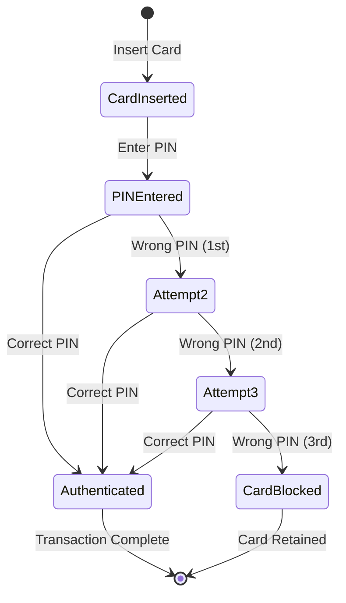
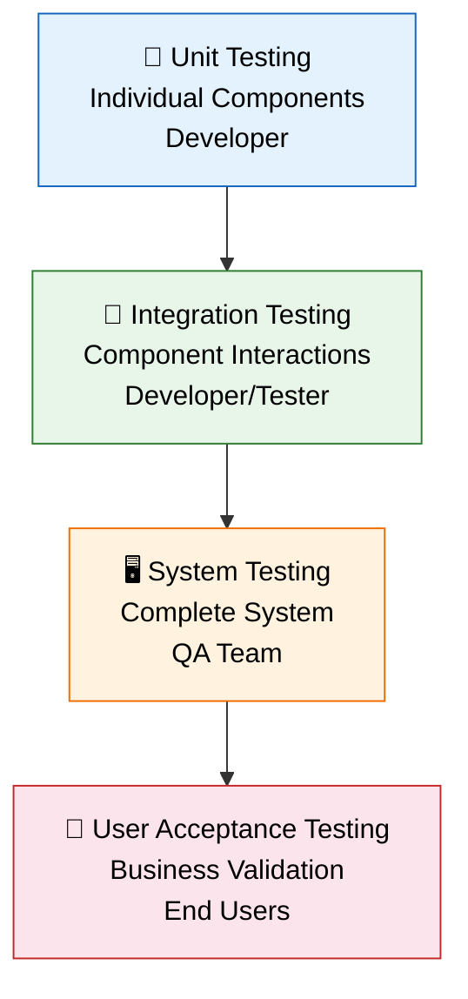
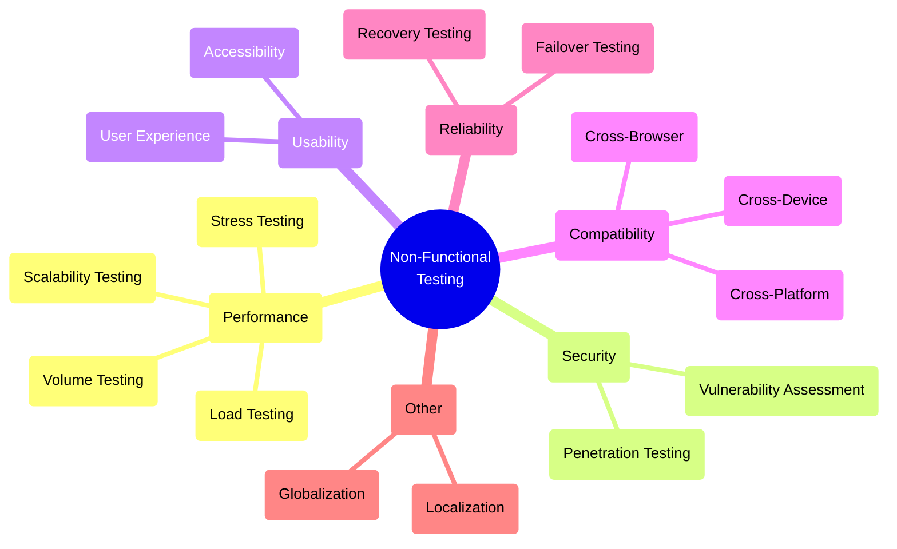
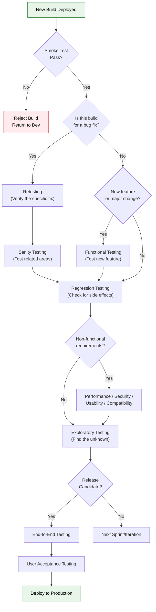

# Part 2: Types of Testing — Comprehensive Reference

> **Study Guide for Manual Testing Professionals**
> Difficulty Level: Intermediate to Advanced | Estimated Reading Time: 90 minutes

---

## Table of Contents

- [A. By Testing Approach](#a-by-testing-approach)
  - [Black Box Testing](#black-box-testing)
  - [White Box Testing](#white-box-testing)
  - [Grey Box Testing](#grey-box-testing)
- [B. By Testing Level](#b-by-testing-level)
  - [Unit Testing](#unit-testing)
  - [Integration Testing](#integration-testing)
  - [System Testing](#system-testing)
  - [User Acceptance Testing (UAT)](#user-acceptance-testing-uat)
- [C. By Testing Purpose](#c-by-testing-purpose)
  - [Functional Testing](#functional-testing)
  - [Non-Functional Testing](#non-functional-testing)
- [D. Specific Functional Testing Types](#d-specific-functional-testing-types)
  - [Smoke Testing](#smoke-testing)
  - [Sanity Testing](#sanity-testing)
  - [Regression Testing](#regression-testing)
  - [Retesting](#retesting)
- [E. Specific Non-Functional Testing Types](#e-specific-non-functional-testing-types)
- [F. Other Specialized Testing Types](#f-other-specialized-testing-types)
- [Decision Flowchart: When to Use Which Testing Type](#decision-flowchart-when-to-use-which-testing-type)
- [Common Interview Questions](#common-interview-questions)

---

## A. By Testing Approach

Testing approaches define **how much knowledge of the internal workings** of the software a tester uses during testing. The three fundamental approaches form a spectrum from complete ignorance of internals to complete knowledge.

```
No Internal Knowledge ◄──────────────────────────────► Full Internal Knowledge

    Black Box                Grey Box                  White Box
    Testing                  Testing                   Testing
    
    Tests WHAT              Tests with                 Tests HOW
    the system does         partial knowledge          the system works
    
    Tester = User           Tester = Informed User     Tester = Developer
```

---

### Black Box Testing

#### Definition

> **Black Box Testing** (also called behavioral testing, specification-based testing, or functional testing) is a testing technique where the tester evaluates the software's functionality **without any knowledge of its internal code structure, implementation, or design.** The tester only knows the inputs and expected outputs.

The term "black box" comes from the analogy of a sealed box: you can see what goes in and what comes out, but you cannot see what happens inside.

```
                    ┌──────────────────────┐
   Input ──────►    │                      │    ──────► Output
                    │     BLACK BOX        │
   Known            │  (Internal workings  │    Observed
                    │   are UNKNOWN)       │    & compared to
                    │                      │    expected output
                    └──────────────────────┘
```

#### When to Use Black Box Testing

- When testing functionality against requirements or specifications
- During **System Testing** and **User Acceptance Testing**
- When the tester does not have access to source code
- When testing from the end-user's perspective
- For **functional validation** of any feature

#### Black Box Test Design Techniques

##### 1. Equivalence Partitioning (EP)

**Definition:** Divides input data into partitions (classes) where all values in a partition are expected to behave the same way. Testing one value from each partition is considered sufficient.

**Core Idea:** If a test case from a partition finds a defect, all other test cases in that partition would also find the same defect. If a test case from a partition doesn't find a defect, no other test case in that partition would find it either.

**Real-World Example — Age Validation for an Insurance Application:**

The system accepts ages from 18 to 65 for a standard life insurance policy.

| Partition | Range | Type | Sample Test Value | Expected Result |
|-----------|-------|------|:--:|---|
| EP1 | Age < 0 | Invalid | -5 | Error: "Invalid age" |
| EP2 | Age 0-17 | Invalid | 10 | Error: "Must be 18 or older" |
| EP3 | Age 18-65 | **Valid** | 35 | Accepted |
| EP4 | Age 66-150 | Invalid | 80 | Error: "Maximum age is 65" |
| EP5 | Age > 150 | Invalid | 200 | Error: "Invalid age" |
| EP6 | Non-numeric | Invalid | "abc" | Error: "Please enter a number" |

**Result:** Instead of testing every age from -∞ to +∞, we test **6 representative values**.

##### 2. Boundary Value Analysis (BVA)

**Definition:** Tests at the boundaries of equivalence partitions, where defects are most likely to occur. Boundaries include the minimum, just below minimum, maximum, and just above maximum values.

**Why Boundaries?** Developers often make "off-by-one" errors:
- Using `>` instead of `>=`
- Using `<` instead of `<=`
- Array index starting at 0 vs. 1

**Real-World Example — Same Insurance Application (Age 18-65):**

| Boundary | Test Value | Expected Result | What It Checks |
|----------|:---------:|-----------------|----------------|
| Just below minimum | 17 | Rejected | Lower boundary exclusion |
| Minimum | 18 | **Accepted** | Lower boundary inclusion |
| Just above minimum | 19 | **Accepted** | Just inside lower boundary |
| Nominal | 40 | **Accepted** | Normal case |
| Just below maximum | 64 | **Accepted** | Just inside upper boundary |
| Maximum | 65 | **Accepted** | Upper boundary inclusion |
| Just above maximum | 66 | Rejected | Upper boundary exclusion |

> [!TIP]
> **BVA and EP work together.** EP identifies the partitions; BVA identifies the critical values within and around those partitions. Always use both techniques together for thorough test coverage.

##### 3. Decision Table Testing

**Definition:** Represents complex business logic as a table where **combinations of conditions** lead to specific **actions**. Each column represents a rule (a unique combination of conditions).

**Real-World Example — E-Commerce Shipping Logic:**

"Free shipping is offered if the order total is over $50 AND the customer is a premium member, OR if the order total is over $100 regardless of membership."

| Condition | Rule 1 | Rule 2 | Rule 3 | Rule 4 |
|-----------|:------:|:------:|:------:|:------:|
| Order > $100 | Y | Y | N | N |
| Premium Member | Y | N | Y | N |
| **Action** | | | | |
| Free Shipping | ✅ | ✅ | ✅ | ❌ |
| Standard Rate | ❌ | ❌ | ❌ | ✅ |

**Expanded with the $50 threshold:**

| Condition | R1 | R2 | R3 | R4 | R5 | R6 |
|-----------|:--:|:--:|:--:|:--:|:--:|:--:|
| Order > $100 | Y | Y | N | N | N | N |
| Order > $50 | — | — | Y | Y | N | N |
| Premium Member | Y | N | Y | N | Y | N |
| **Free Shipping** | ✅ | ✅ | ✅ | ❌ | ❌ | ❌ |

This technique is **invaluable** for complex business rules with multiple interacting conditions.

##### 4. State Transition Testing

**Definition:** Models the behavior of a system based on its current **state**, the **event** that occurs, and the resulting **transition** to a new state and any **action** performed.

**Real-World Example — ATM PIN Validation:**



**State Transition Table:**

| Current State | Event | Next State | Action |
|--------------|-------|------------|--------|
| Card Inserted | Enter correct PIN | Authenticated | Display main menu |
| Card Inserted | Enter wrong PIN (1st attempt) | Attempt 2 | Display "Incorrect PIN, 2 attempts remaining" |
| Attempt 2 | Enter correct PIN | Authenticated | Display main menu |
| Attempt 2 | Enter wrong PIN (2nd attempt) | Attempt 3 | Display "Incorrect PIN, 1 attempt remaining" |
| Attempt 3 | Enter correct PIN | Authenticated | Display main menu |
| Attempt 3 | Enter wrong PIN (3rd attempt) | Card Blocked | Display "Card blocked", retain card |

##### 5. Use Case Testing

**Definition:** Derives test cases from use cases or user stories, testing complete user workflows from start to finish, including main flows, alternate flows, and exception flows.

**Real-World Example — "Place an Order" Use Case:**

**Main Flow (Happy Path):**
1. User browses products → 2. Adds item to cart → 3. Proceeds to checkout → 4. Enters shipping address → 5. Selects payment method → 6. Confirms order → 7. Receives confirmation email

**Alternate Flows:**
- User applies a coupon code at step 3
- User selects "Save for Later" instead of adding to cart
- User chooses express shipping at step 4
- User selects "Pay on Delivery" at step 5

**Exception Flows:**
- Product becomes out of stock between adding to cart and checkout
- Payment is declined at step 5
- Network timeout during order confirmation at step 6
- Coupon code is expired or invalid

Each flow becomes one or more test cases, ensuring comprehensive scenario coverage.

#### Advantages & Disadvantages of Black Box Testing

| Advantages | Disadvantages |
|-----------|---------------|
| No code knowledge needed — testers don't need to be programmers | Cannot test internal logic (e.g., which code path was executed) |
| Tests from the user's perspective — validates real-world usage | Difficult to design tests without clear specifications |
| Tester and developer work independently — reduces bias | May miss internal errors (e.g., memory leaks, resource cleanup) |
| Can be done by non-technical testers and business users | Redundant tests possible — multiple tests may exercise the same code path |
| Effective for large, complex systems where code review isn't feasible | Test coverage is hard to measure without code-level metrics |

---

### White Box Testing

#### Definition

> **White Box Testing** (also called structural testing, glass box testing, clear box testing, or code-based testing) is a testing technique where the tester has **full knowledge of the internal code structure, design, and implementation** of the software. Tests are designed based on the code itself.

```
                    ┌──────────────────────┐
   Input ──────►    │  if (age >= 18) {    │    ──────► Output
                    │    return "adult";   │
   Known            │  } else {            │    Verified against
                    │    return "minor";   │    code logic AND
                    │  }                   │    expected output
                    └──────────────────────┘
                    ▲                      ▲
                    │  Code is VISIBLE     │
                    │  and ANALYZED        │
```

#### When to Use White Box Testing

- During **Unit Testing** and **Integration Testing**
- When optimizing code paths and eliminating dead code
- When verifying security at the code level (input validation, encryption)
- For **code coverage analysis** and improving test coverage
- When debugging complex algorithmic logic

#### White Box Test Design Techniques

##### 1. Statement Coverage

**Definition:** Ensures that **every executable statement** in the code is executed at least once during testing.

**Formula:** `Statement Coverage = (Number of statements executed / Total number of statements) × 100%`

**Example Code:**

```python
def calculate_discount(price, is_member):
    discount = 0                              # Statement 1
    if price > 100:                           # Statement 2
        discount = 10                         # Statement 3
    if is_member:                             # Statement 4
        discount = discount + 5              # Statement 5
    final_price = price - discount            # Statement 6
    return final_price                        # Statement 7
```

**Test Case for 100% Statement Coverage:**

| Test Case | price | is_member | Statements Executed | Coverage |
|-----------|:-----:|:---------:|---------------------|:--------:|
| TC1 | 150 | True | 1, 2, 3, 4, 5, 6, 7 | 100% |

A single test case achieves 100% statement coverage because it executes every line. However, this is the **weakest** form of coverage — it doesn't guarantee that all branches are tested.

##### 2. Branch Coverage (Decision Coverage)

**Definition:** Ensures that **every branch** (True and False outcome) of every decision point is executed at least once.

**Formula:** `Branch Coverage = (Number of branches executed / Total number of branches) × 100%`

**Using the same code:**

| Test Case | price | is_member | Branches Covered | Coverage |
|-----------|:-----:|:---------:|-------------------|:--------:|
| TC1 | 150 | True | price > 100: TRUE, is_member: TRUE | 50% (2/4) |
| TC2 | 50 | False | price > 100: FALSE, is_member: FALSE | 50% (2/4) |
| **Combined** | | | **All 4 branches** | **100%** |

> [!IMPORTANT]
> **100% Branch Coverage guarantees 100% Statement Coverage**, but not vice versa. Branch coverage is a stronger criterion.

##### 3. Path Coverage

**Definition:** Ensures that **every possible execution path** through the code is tested at least once. A path is a unique sequence of branches from entry to exit.

**Using the same code, paths:**

| Path | price > 100 | is_member | Test Case |
|------|:-----------:|:---------:|-----------|
| Path 1 | TRUE | TRUE | price=150, is_member=True |
| Path 2 | TRUE | FALSE | price=150, is_member=False |
| Path 3 | FALSE | TRUE | price=50, is_member=True |
| Path 4 | FALSE | FALSE | price=50, is_member=False |

Path coverage requires **4 test cases** for this simple function. For code with loops or many decision points, the number of paths grows **exponentially**, making 100% path coverage impractical for complex code.

##### 4. Condition Coverage

**Definition:** Ensures that each individual **boolean condition** within a decision evaluates to both True and False at least once.

**Example with compound condition:**

```python
if (age >= 18 AND income > 30000):
    approve_loan()
```

| Test Case | age >= 18 | income > 30000 | Overall Decision |
|-----------|:---------:|:--------------:|:----------------:|
| TC1 | TRUE (age=25) | TRUE (income=50000) | TRUE |
| TC2 | FALSE (age=16) | FALSE (income=20000) | FALSE |

Both individual conditions evaluate to both True and False, achieving 100% condition coverage. However, this doesn't guarantee decision coverage (the overall decision may not cover both True and False in all combinations).

##### Coverage Hierarchy

```
         ┌─────────────────────┐
         │   Path Coverage     │  ← Strongest, often impractical
         │   (All paths)       │
         ├─────────────────────┤
         │ Condition Coverage  │
         │ (All conditions     │
         │  both T and F)      │
         ├─────────────────────┤
         │  Branch Coverage    │  ← Industry standard minimum
         │  (All branches      │
         │   both T and F)     │
         ├─────────────────────┤
         │ Statement Coverage  │  ← Weakest, minimum baseline
         │ (All statements     │
         │  executed)          │
         └─────────────────────┘
```

#### Advantages & Disadvantages of White Box Testing

| Advantages | Disadvantages |
|-----------|---------------|
| Thorough testing — can target every code path | Requires programming knowledge and code access |
| Identifies dead code and unreachable paths | Cannot find missing functionality (tests what IS, not what SHOULD BE) |
| Finds internal security vulnerabilities | Time-consuming for large codebases |
| Enables precise code coverage measurement | Tests may become tightly coupled to implementation |
| Effective for algorithmic and logical testing | Maintenance-heavy — tests break when code is refactored |

---

### Grey Box Testing

#### Definition

> **Grey Box Testing** is a testing technique where the tester has **partial knowledge** of the internal workings of the software. The tester understands the system architecture, database schemas, or API contracts but does not have full access to the source code.

Grey Box Testing combines the best of both worlds: the user-perspective approach of black box testing with the targeted, informed approach of white box testing.

```
                    ┌──────────────────────┐
   Input ──────►    │  ┌──┐  ┌──┐  ┌──┐   │    ──────► Output
                    │  │  │──│??│──│  │   │
   Known            │  └──┘  └──┘  └──┘   │    Verified against
                    │                      │    expected output
                    │  Some parts VISIBLE  │    with targeted
                    │  Some parts HIDDEN   │    internal insight
                    └──────────────────────┘
```

#### When to Use Grey Box Testing

- **API Testing:** The tester knows the API contracts (endpoints, request/response formats) but not the backend implementation
- **Database Testing:** The tester can query the database to verify data integrity without examining the code that writes to it
- **Integration Testing:** The tester understands the system architecture and component interactions
- **Security Testing:** The tester knows the authentication mechanism and attack surfaces but not the exact implementation

#### Real-World Example — Testing an Order API

A tester knows:
- The API endpoint: `POST /api/orders`
- The database schema: `orders` table has columns `id`, `customer_id`, `total`, `status`, `created_at`
- The order workflow: Created → Confirmed → Shipped → Delivered

**Grey Box Test Cases:**

| Test Case | Action | Verification |
|-----------|--------|-------------|
| TC1: Place a valid order | POST a valid order via API | 1. API returns 201 Created (**black box**) 2. Verify `orders` table has a new row with `status='created'` (**white box knowledge**) |
| TC2: Verify order total calculation | POST an order with 3 items | 1. API returns correct total (**black box**) 2. Query DB to verify `total` matches sum of `order_items.price * quantity` (**white box knowledge**) |
| TC3: Test status transition | Update order status from "Created" to "Shipped" (skipping "Confirmed") | 1. API should return 400 Bad Request (**black box**) 2. Verify `status` in DB hasn't changed (**white box knowledge**) |

#### Comprehensive Comparison: Black Box vs. White Box vs. Grey Box

| Aspect | Black Box | White Box | Grey Box |
|--------|-----------|-----------|----------|
| **Internal knowledge** | None | Full | Partial |
| **Tester profile** | Tester, BA, end user | Developer, technical tester | Technical tester |
| **Code access** | No | Yes | Limited (architecture, DB, APIs) |
| **Primary focus** | What the system does | How the system does it | Both what and how |
| **Test basis** | Requirements, specifications | Source code, design documents | Architecture, API specs, DB schemas |
| **Test techniques** | EP, BVA, Decision Table, State Transition | Statement, Branch, Path Coverage | API testing, DB validation, integration |
| **Testing level** | System, UAT | Unit, Integration | Integration, System |
| **Defect types found** | Functional, usability, business logic | Logic errors, code-level security, dead code | Integration, data flow, architectural |
| **Coverage measurement** | Requirement coverage | Code coverage | Functional + data coverage |
| **Best for** | Validating user requirements | Testing internal logic | Testing APIs and integrations |
| **Example** | "Does clicking 'Buy' place an order?" | "Does the `processOrder()` function handle null input?" | "Does the API return 200 AND update the database correctly?" |

### Key Takeaways — Section A

> [!TIP]
> - **Black Box** tests from the outside — what goes in and what comes out. Best for system and acceptance testing.
> - **White Box** tests from the inside — examining every code path. Best for unit testing.
> - **Grey Box** uses partial knowledge — understanding architecture without reading every line. Best for API and integration testing.
> - In practice, most testing involves a **combination** of approaches. A system tester may use primarily black box techniques but also check the database (grey box) to verify data integrity.

---

## B. By Testing Level

Testing levels define **when and where** testing occurs in the software development lifecycle. Each level has a distinct scope, purpose, and set of responsible parties.



---

### Unit Testing

#### Definition

> **Unit Testing** is the testing of individual, isolated components (units) of the software, such as functions, methods, classes, or modules. The goal is to verify that each unit performs as designed.

#### Key Characteristics

| Aspect | Detail |
|--------|--------|
| **What is tested** | A single function, method, or class in isolation |
| **Who performs it** | Developers (primarily) |
| **When** | During development, before integration |
| **Test basis** | Code, detailed design documents |
| **Environment** | Developer's local machine, CI pipeline |
| **Dependencies** | Mocked or stubbed (unit is tested in isolation) |
| **Common tools** | JUnit (Java), pytest (Python), NUnit (.NET), Jest (JavaScript), XCTest (Swift) |

#### Real-World Example — E-Commerce Price Calculator

```python
# Function to test
def calculate_total(price, quantity, tax_rate):
    subtotal = price * quantity
    tax = subtotal * tax_rate
    return round(subtotal + tax, 2)

# Unit Tests
def test_basic_calculation():
    assert calculate_total(10.00, 2, 0.10) == 22.00  # 20 + 2 tax

def test_zero_quantity():
    assert calculate_total(10.00, 0, 0.10) == 0.00

def test_zero_tax():
    assert calculate_total(10.00, 3, 0.00) == 30.00

def test_rounding():
    assert calculate_total(10.00, 3, 0.0725) == 32.18  # 30 + 2.175 → 32.18

def test_large_quantity():
    assert calculate_total(0.01, 1000000, 0.10) == 11000.00
```

#### When to Use Unit Testing

- ✅ Every time new code is written
- ✅ When refactoring existing code (unit tests serve as a safety net)
- ✅ In TDD (Test-Driven Development) — tests are written before code
- ✅ For complex business logic (calculations, algorithms, validations)
- ❌ Not suitable for testing UI, integrations, or end-to-end workflows

---

### Integration Testing

#### Definition

> **Integration Testing** is the testing of **interactions between integrated components or modules** to detect defects in their interfaces and data exchanges. It verifies that individually tested units work together correctly.

**Why Integration Testing Is Necessary:**
Even if every unit passes its unit tests individually, defects can still exist in how units interact:
- Data format mismatches (one module sends JSON, another expects XML)
- Incorrect API call parameters
- Missing or incorrect error handling at boundaries
- Timing issues (one module expects synchronous response, another responds asynchronously)

#### Integration Testing Strategies

There are four main strategies for integration testing, each with trade-offs:

##### 1. Big Bang Integration

**Definition:** All modules are integrated simultaneously, and the entire system is tested as a whole.

```
Module A ──┐
Module B ──┤
Module C ──┼──► All integrated at once ──► Test the combined system
Module D ──┤
Module E ──┘
```

**When to Use:**
- Small systems with few modules
- When all modules are ready at the same time
- Quick prototype validation

**Real-World Example:**
A small internal tool with 5 modules (UI, Auth, Database, Reports, Notifications) — all are developed simultaneously and integrated in a single step for testing.

| Advantage | Disadvantage |
|-----------|-------------|
| Simple — no stubs or drivers needed | Defect localization is extremely difficult |
| Fast for small systems | Cannot start until all modules are ready |
| Low overhead | High risk — if integration fails, hard to identify the source |
| | Not practical for large systems |

##### 2. Top-Down Integration

**Definition:** Testing begins with the **top-level module** and progresses downward. Lower-level modules that are not yet developed or integrated are replaced with **stubs**.

> **Stub:** A simplified replacement for a lower-level module that returns predefined responses. It simulates the behavior of the called module.

```
         ┌────────┐
         │ Main   │  ← Tested first
         │ Module │
         └───┬────┘
          ┌──┴──┐
     ┌────┤     ├────┐
     ▼    ▼     ▼    ▼
   ┌──┐ ┌──┐ ┌──┐ ┌──┐
   │A │ │B │ │S1│ │S2│  ← Stubs replace modules not yet ready
   └──┘ └──┘ └──┘ └──┘
```

**Real-World Example — E-Commerce Platform:**

1. **Step 1:** Test the main application controller (with stubs for all services)
2. **Step 2:** Replace the Authentication stub with the real Authentication module
3. **Step 3:** Replace the Product Catalog stub with the real module
4. **Step 4:** Replace the Payment Service stub with the real module
5. **Step 5:** Replace the Order Processing stub with the real module

| Advantage | Disadvantage |
|-----------|-------------|
| Critical control flow tested early | Stubs must be developed (additional effort) |
| Early prototype available for demonstration | Lower-level modules tested late |
| Defect localization is easier than Big Bang | Stubs may not accurately simulate real behavior |
| Architectural validation possible early | Complex stubs needed for realistic testing |

##### 3. Bottom-Up Integration

**Definition:** Testing begins with the **lowest-level modules** and progresses upward. Higher-level modules that are not yet integrated are replaced with **drivers**.

> **Driver:** A simplified replacement for a higher-level module that calls the lower-level module being tested. It simulates the calling module.

```
   ┌──┐ ┌──┐ ┌──┐ ┌──┐
   │A │ │B │ │C │ │D │  ← Tested first (with drivers)
   └──┘ └──┘ └──┘ └──┘
     ▲    ▲     ▲    ▲
     └────┤     ├────┘
          ┌──┴──┐
         ┌────────┐
         │ Driver │  ← Simulates the calling module
         └────────┘
```

**Real-World Example — Banking System:**

1. **Step 1:** Test the Database Access Layer (with a driver that calls DB functions)
2. **Step 2:** Test the Business Logic Layer (account calculations, interest rates) — now using the real DB layer
3. **Step 3:** Test the Service Layer (API endpoints) — using real business logic
4. **Step 4:** Test the UI Layer — using real services

| Advantage | Disadvantage |
|-----------|-------------|
| No stubs needed (uses real lower-level modules) | Drivers must be developed (additional effort) |
| Utility modules tested thoroughly first | UI/user-facing flows tested last |
| Defect localization is relatively easy | No early prototype available for stakeholders |
| Reusable lower modules are validated early | Critical top-level control flow tested late |

##### 4. Sandwich/Hybrid Integration

**Definition:** Combines **Top-Down and Bottom-Up** approaches. Testing starts from both the top and bottom simultaneously and meets in the middle.

```
         ┌────────┐
         │  TOP   │ ← Top-Down (with stubs)
         └───┬────┘
             │
    ┌────────┤────────┐
    │   Middle Layer   │ ← Meeting point
    └────────┤────────┘
             │
         ┌───┴────┐
         │ BOTTOM │ ← Bottom-Up (with drivers)
         └────────┘
```

**Real-World Example — Airline Reservation System:**

**Top-Down Track:**
- Test the main application UI with stubs for services
- Replace stubs as services are ready

**Bottom-Up Track:**
- Test the database layer and external API integrations
- Build up through the service layer

**Meeting Point:**
- Both tracks converge at the business logic layer

| Advantage | Disadvantage |
|-----------|-------------|
| Combines benefits of both approaches | Most complex approach to manage |
| Testing starts early at both ends | Both stubs AND drivers needed |
| Faster than either approach alone | Requires careful coordination |
| Good for large, complex systems | Higher overhead in planning and management |

##### Comparison Table: Integration Testing Strategies

| Aspect | Big Bang | Top-Down | Bottom-Up | Sandwich |
|--------|----------|----------|-----------|----------|
| **Approach** | All at once | Top first | Bottom first | Both ends |
| **Stubs needed** | No | Yes | No | Yes |
| **Drivers needed** | No | No | Yes | Yes |
| **Defect localization** | Very difficult | Moderate | Moderate | Good |
| **Early prototype** | No | Yes | No | Partial |
| **Risk** | High | Moderate | Moderate | Low |
| **Best for** | Small systems | UI-driven systems | Utility-heavy systems | Large complex systems |
| **Testing start** | All modules ready | Top module ready | Bottom modules ready | Both ends ready |
| **Effort** | Low | Medium | Medium | High |

---

### System Testing

#### Definition

> **System Testing** is the testing of the **complete, integrated system** as a whole to verify that it meets specified requirements. It is performed on the fully integrated system in an environment that closely resembles the production environment.

#### Key Characteristics

| Aspect | Detail |
|--------|--------|
| **What is tested** | The entire system end-to-end |
| **Who performs it** | Independent QA/Test team |
| **When** | After integration testing, before UAT |
| **Test basis** | System requirements, business requirements, use cases |
| **Environment** | Staging/pre-production (mirrors production) |
| **Scope** | Functional + non-functional requirements |

#### Types of System Testing

| Type | What It Tests | Example |
|------|--------------|---------|
| **Functional System Testing** | Business functions work correctly end-to-end | Complete order placement, payment, and delivery tracking flow |
| **Performance System Testing** | System meets performance requirements under load | 10,000 concurrent users with < 2 second response time |
| **Security System Testing** | System is protected against threats | SQL injection, XSS, authentication bypass |
| **Usability System Testing** | System is easy to use | Can a new user complete registration in under 2 minutes? |
| **Compatibility System Testing** | System works across platforms/browsers | Chrome, Firefox, Safari, Edge on Windows, Mac, and mobile |
| **Recovery System Testing** | System recovers from crashes/failures | After a server crash, are pending transactions recovered? |
| **Installation System Testing** | System installs and uninstalls correctly | Desktop software installs on Windows 10/11 without errors |

#### Real-World Example — Testing an Online Banking System

**System Testing Checklist:**

| # | Test Area | Test Scenario | Expected Result |
|---|-----------|--------------|-----------------|
| 1 | Account Management | Create a new savings account, deposit $1,000, verify balance | Balance shows $1,000.00 |
| 2 | Fund Transfer | Transfer $500 from savings to checking | Savings: -$500, Checking: +$500, total unchanged |
| 3 | Bill Payment | Schedule a recurring utility bill payment | Payment processed on scheduled date, confirmation sent |
| 4 | Statements | Generate monthly statement for January 2026 | PDF with all transactions, correct opening/closing balances |
| 5 | Security | Attempt login with incorrect password 5 times | Account locked after 5 attempts, unlock email sent |
| 6 | Performance | 5,000 users performing fund transfers simultaneously | Response time < 3 seconds, zero failed transactions |
| 7 | Compatibility | Access all features on Chrome, Safari, Firefox (mobile + desktop) | No layout issues, all features functional |

---

### User Acceptance Testing (UAT)

#### Definition

> **User Acceptance Testing (UAT)** is the final level of testing, performed by **end users or business stakeholders** to determine whether the software meets their business needs and is ready for deployment to production.

UAT is the **last gate before production**. If UAT fails, the software does not ship.

#### Types of User Acceptance Testing

##### 1. Alpha Testing

| Aspect | Detail |
|--------|--------|
| **Definition** | Testing performed by **internal users** (employees, internal stakeholders) at the **developer's site** before release to external users |
| **Who** | Internal QA team, internal business users, product team |
| **Environment** | Developer's site, controlled lab/staging environment |
| **Goal** | Find defects before external exposure |
| **Feedback** | Directly communicated to the development team |

**Real-World Example:**
Before launching a new version of Google Docs, Google employees ("dogfooders") use the new version internally for several weeks, reporting issues through internal bug tracking. This is alpha testing.

##### 2. Beta Testing

| Aspect | Detail |
|--------|--------|
| **Definition** | Testing performed by **external users** (real customers) in their **own environments** before general release |
| **Who** | Selected external users, early adopters, beta program participants |
| **Environment** | Users' real-world environments (various devices, networks, configurations) |
| **Goal** | Validate in real-world conditions, get user feedback |
| **Feedback** | Through beta feedback forms, surveys, crash reports |

**Real-World Example:**
Apple releases iOS beta versions to registered developers and public beta testers months before the official release. Beta testers use it on their personal devices and report issues through the Apple Feedback Assistant app.

##### 3. Contract Acceptance Testing

| Aspect | Detail |
|--------|--------|
| **Definition** | Testing performed against **contractual criteria** defined in the agreement between the client and the vendor |
| **Who** | Client's testing team |
| **Criteria** | Specific acceptance criteria from the contract (e.g., "99.9% uptime," "500ms response time") |

**Real-World Example:**
A government agency contracts a vendor to build a tax filing system. The contract specifies: "The system must process 1 million tax returns per day with 99.99% accuracy." Contract acceptance testing validates these specific metrics.

##### 4. Regulation Acceptance Testing

| Aspect | Detail |
|--------|--------|
| **Definition** | Testing performed to verify compliance with **government regulations, industry standards, or legal requirements** |
| **Who** | Compliance team, regulatory auditors, specialized testing labs |
| **Standards** | HIPAA, FDA, PCI-DSS, SOX, GDPR, ADA |

**Real-World Example:**
A pharmaceutical company's drug trial management system must comply with FDA 21 CFR Part 11 (electronic records and signatures). Regulation acceptance testing verifies: electronic signatures are legally binding, audit trails are complete and tamper-proof, and data cannot be altered without documented reason.

##### 5. Operational Acceptance Testing (OAT)

| Aspect | Detail |
|--------|--------|
| **Definition** | Testing performed by **operations/IT teams** to verify that the system can be **operated and maintained** in production |
| **Who** | System administrators, DevOps, IT operations |
| **Focus** | Backup/restore, disaster recovery, monitoring, logging, deployment procedures |

**Real-World Example:**
Before deploying a new CRM system:
- **Backup test:** Can the system be backed up and restored within the 4-hour RTO (Recovery Time Objective)?
- **Monitoring test:** Do alerts fire when CPU exceeds 90%?
- **Deployment test:** Can the deployment be rolled back within 30 minutes if issues arise?
- **Log test:** Do application logs capture sufficient detail for troubleshooting?

##### Comparison Table: Types of UAT

| Aspect | Alpha | Beta | Contract | Regulation | Operational |
|--------|-------|------|----------|------------|-------------|
| **Who** | Internal users | External users | Client team | Compliance/Auditors | IT/Ops team |
| **Where** | Developer's site | User's environment | Client's site | Specialized lab | Production-like env |
| **Focus** | Functionality & usability | Real-world conditions | Contractual criteria | Regulatory compliance | Maintainability |
| **Feedback** | Direct to dev team | Via feedback channels | Formal acceptance/rejection | Pass/fail per regulation | Operational readiness |
| **Timing** | Before beta | After alpha, before GA | Before final payment | Before market release | Before deployment |
| **Example** | Google dogfooding | iOS public beta | Government IT contract | FDA drug system approval | CRM disaster recovery |

### Key Takeaways — Section B

> [!TIP]
> - **Unit → Integration → System → UAT** is the natural progression of testing levels.
> - **Integration testing strategies** (Big Bang, Top-Down, Bottom-Up, Sandwich) depend on system size and architecture.
> - **Stubs** simulate lower-level modules (Top-Down); **Drivers** simulate upper-level modules (Bottom-Up).
> - **UAT** is the final checkpoint — it validates business needs, not just technical correctness.
> - Different **UAT types** serve different purposes: Alpha (internal), Beta (external), Contract (legal), Regulation (compliance), OAT (operations).

---

## C. By Testing Purpose

All testing can be broadly categorized into two major purposes: **Functional** (does it work?) and **Non-Functional** (how well does it work?).

### Functional Testing

#### Definition

> **Functional Testing** validates that the software performs its intended functions correctly, as defined in the requirements. It answers the question: **"Does the system do what it's supposed to do?"**

Functional testing is based on the **specification** — the defined behavior of the system. Each test case maps to a requirement, user story, or business rule.

#### Types of Functional Testing

| Type | Description | Example |
|------|------------|---------|
| **Unit Testing** | Individual component testing | Test the `calculateTax()` function |
| **Integration Testing** | Interface/interaction testing | Test Order Service → Payment Gateway flow |
| **System Testing** | End-to-end functional validation | Test complete order placement workflow |
| **Smoke Testing** | Basic sanity check after build | Login, home page, basic navigation |
| **Sanity Testing** | Focused check after bug fix | Verify the fixed checkout bug |
| **Regression Testing** | Verify existing functions after changes | Re-run full test suite after code merge |
| **UAT** | Business validation by end users | Business users verify invoice generation |
| **End-to-End Testing** | Full user journey testing | Browse → Cart → Checkout → Payment → Confirmation |

#### Functional Testing Checklist (E-Commerce Example)

| Module | Functional Test | Priority |
|--------|----------------|:--------:|
| **User Registration** | Register with valid email, password | High |
| | Register with existing email → error | High |
| | Register with weak password → validation | Medium |
| **Product Search** | Search by keyword, category, price range | High |
| | Search with no results → "No products found" | Medium |
| | Search with special characters → handled gracefully | Medium |
| **Shopping Cart** | Add, update quantity, remove items | High |
| | Cart persists across browser sessions | Medium |
| | Cart calculates subtotal correctly | High |
| **Checkout** | Complete checkout with credit card | Critical |
| | Apply valid coupon → correct discount | High |
| | Apply expired coupon → error message | Medium |
| **Order Management** | View order history | Medium |
| | Cancel order within 30 minutes | High |
| | Track order status | Medium |

---

### Non-Functional Testing

#### Definition

> **Non-Functional Testing** validates **how the system performs** — its quality attributes beyond just functional correctness. It answers the question: **"How well does the system do what it does?"**

Non-functional testing covers attributes like performance, security, usability, reliability, scalability, and more.

#### Categories of Non-Functional Testing



#### Functional vs. Non-Functional Testing Comparison

| Aspect | Functional Testing | Non-Functional Testing |
|--------|-------------------|----------------------|
| **Question** | Does it work? | How well does it work? |
| **Focus** | Features and functions | Quality attributes |
| **Based on** | Requirements and specifications | Performance criteria, standards |
| **Example** | "Can the user log in?" | "Does login respond within 2 seconds?" |
| **Techniques** | EP, BVA, Decision Tables | Load testing, security scanning, usability heuristics |
| **Pass/Fail** | Yes/No (binary) | Measured on a scale (response time, throughput) |
| **Who** | Testers, business users | Performance engineers, security analysts, UX researchers |
| **Timing** | Throughout testing phases | Typically during system testing |
| **Tools** | Selenium, manual testing | JMeter, OWASP ZAP, Lighthouse, BrowserStack |

### Key Takeaways — Section C

> [!TIP]
> - **Functional testing** validates WHAT the system does. **Non-functional testing** validates HOW WELL it does it.
> - Both types are essential for a quality product. A functionally correct but slow or insecure system is still unusable.
> - Non-functional requirements should be **quantifiable** ("response time < 2s" not "system should be fast").
> - Non-functional testing often requires **specialized tools** and expertise.

---

## D. Specific Functional Testing Types

### Smoke Testing

#### Definition

> **Smoke Testing** (also called Build Verification Testing or Confidence Testing) is a **preliminary, high-level test** performed on a new build to verify that the **critical functionalities** work and the build is stable enough for further detailed testing.

The term comes from electronics: when you power on a new circuit board, if it doesn't emit smoke, it passes the "smoke test" — meaning it's stable enough for further testing.

#### Key Characteristics

| Aspect | Detail |
|--------|--------|
| **When** | After every new build or deployment |
| **Duration** | 30 minutes to 2 hours (brief) |
| **Depth** | Shallow — tests breadth, not depth |
| **Coverage** | Critical paths only (10-20% of test suite) |
| **Who** | QA team (sometimes automated in CI/CD) |
| **Goal** | Determine if the build is "testable" |
| **Result** | GO (proceed with testing) or NO-GO (reject the build) |

#### Smoke Test Suite Example — E-Commerce Application

| # | Test Case | Priority | Expected Result |
|---|-----------|:--------:|-----------------|
| 1 | Application launches without errors | Critical | Home page loads successfully |
| 2 | User can log in with valid credentials | Critical | Redirected to dashboard |
| 3 | Product search returns results | Critical | Products displayed for "shoes" |
| 4 | Add item to cart | Critical | Item appears in cart with correct price |
| 5 | Proceed to checkout page | Critical | Checkout form loads |
| 6 | Complete payment (test card) | Critical | Order confirmation displayed |
| 7 | User can log out | High | Redirected to login page |
| 8 | Admin panel loads | High | Dashboard with statistics |
| 9 | Application navigation works | High | All major menu links function |
| 10 | Database connectivity verified | High | Data loads without timeout errors |

> [!NOTE]
> **If ANY smoke test fails, the build is rejected and returned to development.** The team does not proceed with detailed testing on an unstable build, as it would waste time and resources.

---

### Sanity Testing

#### Definition

> **Sanity Testing** is a **focused, narrow test** performed after receiving a build with minor changes (bug fixes, minor feature additions) to verify that the **specific changes work correctly** and haven't broken closely related functionality.

The term "sanity" implies a quick check to determine if the system is "sane" enough — i.e., the specific changes are rational and functioning.

#### Key Characteristics

| Aspect | Detail |
|--------|--------|
| **When** | After a build with specific bug fixes or minor changes |
| **Duration** | 30 minutes to 1 hour (very brief) |
| **Depth** | Deep — tests specific area in detail |
| **Coverage** | Narrow — only the changed area and related functions |
| **Who** | QA team (usually the tester who reported the bug) |
| **Goal** | Determine if the specific fix/change works correctly |
| **Result** | Fixed/Not Fixed, with assessment of nearby impact |

#### Real-World Example

**Bug Reported:** "Applying a 20% discount coupon on the checkout page calculates the discount incorrectly — $100 order with 20% coupon shows $82 instead of $80."

**Fix Deployed:** Developer fixes the discount calculation formula.

**Sanity Test:**

| # | Test Case | Area | Expected Result |
|---|-----------|------|-----------------|
| 1 | Apply 20% coupon to $100 order | Direct fix | Total = $80.00 ✓ |
| 2 | Apply 20% coupon to $50 order | Same area | Total = $40.00 ✓ |
| 3 | Apply 10% coupon to $100 order | Related area | Total = $90.00 ✓ |
| 4 | Apply 50% coupon to $200 order | Related area | Total = $100.00 ✓ |
| 5 | Stack two coupons (if allowed) | Related area | Correct cumulative discount ✓ |
| 6 | Order without any coupon | Related area | Full price charged ✓ |

### Detailed Comparison: Smoke Testing vs. Sanity Testing

| Aspect | Smoke Testing | Sanity Testing |
|--------|:-------------:|:--------------:|
| **Purpose** | Verify build stability | Verify specific fix/change |
| **Scope** | **Broad** — covers all critical paths | **Narrow** — covers only changed area |
| **Depth** | **Shallow** — surface-level checks | **Deep** — detailed testing of specific area |
| **When** | After **every new build** | After a **bug fix or minor change** |
| **Question** | "Is the build testable?" | "Is the fix working?" |
| **If fails** | **Reject the build entirely** | **Return the fix to the developer** |
| **Scripted** | Usually yes (predefined smoke suite) | Usually no (based on the specific change) |
| **Analogy** | Checking if a car starts | Checking if the brakes work after a brake repair |
| **Coverage** | 10-20% of test suite | Specific area only |
| **Performed by** | QA team or CI/CD pipeline | Tester who reported the bug |

> [!IMPORTANT]
> **Memory aid:** **Smoke = Wide and Shallow.** **Sanity = Narrow and Deep.**

---

### Regression Testing

#### Definition

> **Regression Testing** is the re-execution of previously passing test cases to verify that **existing functionality has not been broken** by new code changes, bug fixes, enhancements, or configuration changes.

The word "regression" means "going backward" — regression testing checks whether the software has **regressed** (gone backward in quality) due to recent changes.

#### When Regression Testing Is Needed

| Trigger | Example |
|---------|---------|
| New feature added | A "wishlIst" feature is added — does the existing "cart" still work? |
| Bug fix deployed | A login bug was fixed — does password reset still work? |
| Code refactoring | The database layer was rewritten — does everything still read/write correctly? |
| Configuration change | The server was migrated — does the application still function normally? |
| Third-party library update | jQuery was updated from v3.5 to v3.7 — do all interactive elements still work? |
| Environment change | The application was moved from AWS to Azure — does everything still function? |

#### Regression Test Suite Selection Strategies

Since running the entire test suite for every change may not be feasible (time, resources), teams use strategies to select the most relevant regression tests:

| Strategy | Description | When to Use |
|----------|-------------|-------------|
| **Retest All** | Run the complete test suite | Major releases, high-risk changes |
| **Test Case Prioritization** | Run highest-priority tests first | Time-constrained testing windows |
| **Change-Based Selection** | Select tests related to changed modules | Minor changes, bug fixes |
| **Risk-Based Selection** | Select tests for highest-risk areas | When test resources are limited |
| **Cross-Functional Impact Analysis** | Select tests for modules impacted by the change (direct + indirect) | Architectural changes |

#### Real-World Example — Regression Testing Strategy for a Banking App

**Change:** A new "International Wire Transfer" feature is added.

| Test Category | # Tests | Rationale |
|--------------|:-------:|-----------|
| New feature tests (International Wire Transfer) | 50 | Validate the new feature |
| Domestic transfer tests | 30 | Same transfer module — may be impacted |
| Account balance tests | 20 | Transfers affect balances |
| Transaction history tests | 15 | New transfers must appear in history |
| Notification/email tests | 10 | Transfer notifications should fire |
| **Unrelated** (user registration, profile) | 0 | Not impacted by this change |
| **Total regression suite** | **125** | Instead of the full 1,200 test suite |

#### Regression Testing Best Practices

1. **Maintain a regression test suite:** Keep a curated set of tests that cover critical functionality.
2. **Prioritize automation:** Regression tests are repetitive and ideal for automation.
3. **Update after every sprint:** Add tests for new features, remove tests for deprecated features.
4. **Use change impact analysis:** Only run tests relevant to the changes made.
5. **Run critical tests first:** In time-constrained situations, prioritize high-risk tests.

---

### Retesting

#### Definition

> **Retesting** (also called Confirmation Testing) is the re-execution of a **specific test case that previously failed** to confirm that the reported defect has been **successfully fixed**.

Retesting is simple and specific: you re-run the exact same test case with the exact same test data on the new build to verify the fix.

#### How Retesting Works

```
1. Tester executes Test Case TC-101 → FAIL (Bug logged: BUG-555)
2. Developer fixes BUG-555
3. New build deployed
4. Tester re-executes TC-101 with same steps and data → PASS
5. BUG-555 status changed to "Verified Fixed" / "Closed"
```

### Comprehensive Comparison: Smoke vs. Sanity vs. Regression vs. Retesting

| Aspect | Smoke | Sanity | Regression | Retesting |
|--------|:-----:|:------:|:----------:|:---------:|
| **Purpose** | Build stability | Fix verification (narrow) | No side effects from changes | Confirm specific bug fix |
| **Scope** | Wide | Narrow | Moderate to Wide | Very Narrow (single bug) |
| **Depth** | Shallow | Deep | Moderate | Deep (specific test case) |
| **When** | Every new build | After specific fix | After any code change | After bug fix |
| **Test cases** | Predefined smoke suite | Based on the change | Previously passing tests | Previously failing test |
| **Question** | "Is the build testable?" | "Does the fix work?" | "Did the change break anything?" | "Is the bug fixed?" |
| **If fails** | Reject build | Return fix to dev | Log new regression bug | Reopen the original bug |
| **Automation** | Highly recommended | Rarely automated | Highly recommended | Usually manual |
| **Priority** | First (before any other testing) | Second (after smoke) | Third (after sanity) | Part of sanity/regression |
| **Performed by** | QA team | Tester who reported bug | QA team | Tester who reported bug |

#### Typical Testing Sequence After a New Build

```
New Build Deployed
       │
       ▼
  ┌──────────┐     FAIL → Reject Build → Back to Dev
  │  SMOKE   │──────────────────────────────────────────►
  │  TEST    │
  └────┬─────┘
       │ PASS
       ▼
  ┌──────────┐     FAIL → Return Fix to Dev
  │ SANITY / │──────────────────────────────────────────►
  │ RETEST   │
  └────┬─────┘
       │ PASS
       ▼
  ┌──────────┐     FAIL → Log Regression Bug
  │REGRESSION│──────────────────────────────────────────►
  │  TEST    │
  └────┬─────┘
       │ PASS
       ▼
  ┌──────────┐
  │ DETAILED │
  │ TESTING  │
  └──────────┘
```

### Key Takeaways — Section D

> [!TIP]
> - **Smoke Testing** = "Can I start testing?" → Wide, shallow, every build
> - **Sanity Testing** = "Does this specific fix work?" → Narrow, deep, specific changes
> - **Regression Testing** = "Did the change break something else?" → Broad, previously passing tests
> - **Retesting** = "Is this specific bug fixed?" → Re-run the exact failed test case
> - The sequence is: **Smoke → Sanity/Retest → Regression → Detailed Testing**
> - Smoke and Regression are prime candidates for **automation**

---

## E. Specific Non-Functional Testing Types

Non-functional testing types evaluate the quality attributes of the software — how well it performs, how secure it is, how usable it is, and how compatible it is across environments.

---

### Performance Testing

#### Definition

> **Performance Testing** evaluates how a system performs under various conditions — its speed, responsiveness, stability, and resource utilization. It answers: **"How fast, stable, and efficient is the system?"**

#### Key Performance Metrics

| Metric | Definition | Good Target (Web App) | Example |
|--------|-----------|:--------------------:|---------|
| **Response Time** | Time from request to first response | < 2 seconds | Login API responds in 1.2 seconds |
| **Throughput** | Number of transactions/requests processed per unit of time | Depends on SLA | 500 transactions per second |
| **Concurrent Users** | Number of users simultaneously active | Varies per system | 10,000 concurrent users |
| **Error Rate** | Percentage of requests that result in errors | < 1% | 0.5% of requests return 500 errors |
| **CPU Utilization** | Percentage of CPU used during operations | < 80% | Server CPU at 65% under load |
| **Memory Utilization** | Percentage of RAM used | < 80% | Application uses 6GB of 8GB RAM |
| **Latency** | Delay before data transfer begins | < 100ms | Network latency of 45ms |

---

### Load Testing

#### Definition

> **Load Testing** evaluates the system's performance under **expected (normal) and peak load conditions** to ensure it meets performance requirements.

#### Types of Load Testing

| Type | Description | Example |
|------|------------|---------|
| **Normal Load** | Expected everyday usage | 2,000 users browsing and ordering during a typical Tuesday |
| **Peak Load** | Maximum expected usage during known peaks | 15,000 users during Black Friday sale |
| **Endurance/Soak** | Sustained normal load over extended period | 2,000 users continuously for 72 hours to detect memory leaks |

#### Real-World Example — E-Commerce Load Testing

**Scenario:** A retailer expects 50,000 concurrent users during their annual flash sale.

| Test | Users | Duration | Success Criteria |
|------|:-----:|:--------:|-----------------|
| Normal Load | 5,000 | 1 hour | Response time < 2s, error rate < 0.5% |
| Peak Load | 50,000 | 30 min | Response time < 5s, error rate < 2% |
| Endurance | 10,000 | 24 hours | No memory leaks, response time stable over time |

**Tools:** JMeter, Gatling, k6, LoadRunner, Locust

---

### Stress Testing

#### Definition

> **Stress Testing** evaluates the system's behavior **beyond its normal capacity** to determine its breaking point and how it behaves under extreme conditions. It answers: **"What happens when the system is pushed past its limits?"**

#### Key Focus Areas

| Area | What's Tested | Example |
|------|--------------|---------|
| **Breaking Point** | At what load does the system fail? | System crashes at 25,000 concurrent users |
| **Failure Mode** | How does the system fail? (Gracefully or catastrophically?) | Does it show "Service temporarily unavailable" or does it corrupt data? |
| **Recovery** | How does the system recover after the stress is removed? | After reducing load from 25,000 to 5,000, does it recover within 5 minutes? |
| **Data Integrity** | Is data corrupted under stress? | Are orders placed during peak stress processed correctly? |

#### Real-World Example — Streaming Service Stress Test

**Scenario:** A streaming service normally handles 100,000 concurrent streams. Stress test pushes to 500,000.

| Load Level | Expected Behavior | Actual Observation |
|:---------:|-------------------|-------------------|
| 100,000 (normal) | All streams smooth, < 1s buffer | ✅ All metrics within SLA |
| 200,000 (2x) | Some buffering acceptable | ✅ Buffering < 3s, no dropped streams |
| 300,000 (3x) | Degraded service expected | ⚠️ 5s buffering, 2% stream failures |
| 400,000 (4x) | Significant degradation | ⚠️ 15s buffering, 8% stream failures |
| 500,000 (5x) | **Breaking point** | ❌ Load balancer overwhelmed, 40% streams dropped |
| Back to 100,000 | Full recovery | ✅ System recovers within 3 minutes |

---

### Volume Testing

#### Definition

> **Volume Testing** (also called Flood Testing) evaluates the system's performance when processing **large volumes of data** — large database records, file uploads, or data migrations.

Unlike load testing (which focuses on concurrent users), volume testing focuses on **data quantity**.

#### Real-World Examples

| Scenario | Data Volume | What's Tested |
|----------|------------|---------------|
| Database query | Query against a table with 100 million records | Query response time, index effectiveness |
| File upload | Upload a 5GB CSV file for data import | Processing time, memory usage, error handling |
| Report generation | Generate an annual report with 10 million transactions | PDF generation time, pagination, memory |
| Log analysis | Process 50GB of application logs | Search performance, aggregation speed |
| Data migration | Migrate 500 million records from legacy system | Migration time, data integrity, downtime |

---

### Security Testing

#### Definition

> **Security Testing** evaluates the system's ability to **protect data and maintain functionality** in the face of malicious attacks, unauthorized access, and vulnerabilities.

#### OWASP Top 10 (2021)

The **Open Web Application Security Project (OWASP)** defines the top 10 most critical web application security risks:

| # | Risk | Description | Test Example |
|---|------|-------------|-------------|
| A01 | **Broken Access Control** | Users can act outside their intended permissions | Can a regular user access admin pages by changing the URL? |
| A02 | **Cryptographic Failures** | Sensitive data exposed due to weak or missing encryption | Are passwords stored as plain text or hashed? Is data in transit encrypted (HTTPS)? |
| A03 | **Injection** | Malicious input interpreted as code (SQL, NoSQL, OS, LDAP) | Does entering `' OR '1'='1` in the login form bypass authentication? |
| A04 | **Insecure Design** | Missing or ineffective security controls in the design | Can a user enumerate all account numbers by incrementing IDs? |
| A05 | **Security Misconfiguration** | Default configs, unnecessary services, improper permissions | Are default admin credentials still active? Are error messages exposing stack traces? |
| A06 | **Vulnerable Components** | Using outdated libraries with known vulnerabilities | Is the application using Log4j < 2.17.0 (vulnerable to Log4Shell)? |
| A07 | **Authentication Failures** | Weak authentication, credential stuffing, session fixation | Is there a lockout after 5 failed login attempts? Are session tokens rotated after login? |
| A08 | **Data Integrity Failures** | Trusting untrusted data (deserialization, CI/CD integrity) | Can a user modify the "price" field in a hidden form to change the order total? |
| A09 | **Logging & Monitoring Failures** | Insufficient logging prevents detection of breaches | Are failed login attempts logged? Are security events alerting? |
| A10 | **Server-Side Request Forgery** | Application fetches a remote resource without validating the URL | Can an attacker make the server fetch internal resources (e.g., `http://localhost/admin`)? |

#### Types of Security Testing

| Type | Description | Depth | Tools |
|------|------------|:-----:|-------|
| **Vulnerability Scanning** | Automated scan for known vulnerabilities | Low | Nessus, OWASP ZAP, Qualys |
| **Security Auditing** | Manual review of code, configuration, and architecture | Medium | Manual review, SonarQube |
| **Penetration Testing** | Simulated real-world attack by ethical hackers | High | Burp Suite, Metasploit, Kali Linux |
| **Risk Assessment** | Identifying and prioritizing security risks | Medium | Threat modeling (STRIDE, DREAD) |
| **Security Review** | Evaluating security architecture and policies | Medium | Manual review against standards |

---

### Usability Testing

#### Definition

> **Usability Testing** evaluates how easy and intuitive it is for users to learn, use, and interact with the software. It measures the **user experience (UX)** quality.

#### Jakob Nielsen's 10 Usability Heuristics

| # | Heuristic | Description | Bad Example | Good Example |
|---|-----------|-------------|-------------|-------------|
| 1 | **Visibility of system status** | System should keep users informed | Form submits with no feedback | Spinner + "Processing your order..." message |
| 2 | **Match between system and real world** | Use language users understand | Button labeled "Execute POST /api/order" | Button labeled "Place Order" |
| 3 | **User control and freedom** | Easy undo and exit | No way to cancel a started payment | "Cancel" button at every step |
| 4 | **Consistency and standards** | Follow platform conventions | "Save" button is green on one page, red on another | "Save" is always blue, in the same position |
| 5 | **Error prevention** | Prevent errors before they happen | Free text field for dates | Date picker with calendar |
| 6 | **Recognition over recall** | Make options visible | User must remember product IDs | Dropdown showing product names |
| 7 | **Flexibility and efficiency** | Support both novice and expert users | Only mouse-based navigation | Keyboard shortcuts for power users |
| 8 | **Aesthetic and minimalist design** | No irrelevant information | Cluttered dashboard with 50 widgets | Clean dashboard with key metrics and drill-down |
| 9 | **Help users recognize errors** | Clear error messages in plain language | "Error 0x80070005" | "You don't have permission to access this page. Please contact your administrator." |
| 10 | **Help and documentation** | Provide searchable help | No help section | Contextual tooltips and a searchable knowledge base |

---

### Accessibility Testing

#### Definition

> **Accessibility Testing** ensures the software is usable by people with disabilities, including visual, auditory, motor, and cognitive impairments, in compliance with standards like **WCAG 2.1** (Web Content Accessibility Guidelines).

#### Key Accessibility Testing Areas

| Area | What to Test | Example |
|------|-------------|---------|
| **Screen Reader** | Can the content be read aloud by screen readers? | JAWS or NVDA reads all content in logical order |
| **Keyboard Navigation** | Can all functions be accessed via keyboard only? | Tab through all form fields, activate buttons with Enter |
| **Color Contrast** | Is text readable against its background? | WCAG AA: 4.5:1 ratio for normal text |
| **Alt Text** | Do images have descriptive alternative text? | `` not `` |
| **Focus Indicators** | Are focused elements visually highlighted? | Blue outline on the currently focused button |
| **Form Labels** | Are form fields properly labeled? | `<label for="email">Email Address</label>` |
| **Captions** | Do videos have captions? | All videos have synchronized closed captions |
| **Zoom** | Is the page usable at 200% zoom? | Content reflows without horizontal scrolling |

**Tools:** axe DevTools, WAVE, Lighthouse (accessibility audit), JAWS, NVDA, VoiceOver

---

### Compatibility Testing

#### Definition

> **Compatibility Testing** verifies that the software works correctly across different **browsers, operating systems, devices, and environments**.

#### Types of Compatibility Testing

| Type | What's Tested | Example Test Matrix |
|------|--------------|-------------------|
| **Cross-Browser** | Different web browsers | Chrome 120, Firefox 121, Safari 17, Edge 120 |
| **Cross-Platform** | Different operating systems | Windows 11, macOS Sonoma, Ubuntu 22.04 |
| **Cross-Device** | Different device types | iPhone 15, Samsung Galaxy S24, iPad Pro, Desktop |
| **Cross-Resolution** | Different screen sizes | 320×480, 768×1024, 1920×1080, 2560×1440 |
| **Backward Compatibility** | Older versions of software/data | Does v3.0 read data files created in v2.0? |
| **Forward Compatibility** | Future versions | Does v2.0 gracefully handle data from v3.0? |

#### Real-World Compatibility Test Matrix

| Browser | Windows 11 | macOS Sonoma | iOS 17 | Android 14 |
|---------|:----------:|:----------:|:------:|:----------:|
| Chrome 120 | ✅ | ✅ | N/A | ✅ |
| Firefox 121 | ✅ | ✅ | N/A | ✅ |
| Safari 17 | N/A | ✅ | ✅ | N/A |
| Edge 120 | ✅ | ✅ | N/A | N/A |
| Samsung Internet | N/A | N/A | N/A | ✅ |

**Tools:** BrowserStack, Sauce Labs, LambdaTest, CrossBrowserTesting

---

### Localization Testing

#### Definition

> **Localization Testing** (L10n Testing) verifies that the software is correctly adapted for a **specific locale** — including language translations, cultural conventions, date/time formats, currency, and local regulations.

#### What to Test

| Area | What to Check | Example |
|------|--------------|---------|
| **Translations** | All UI text correctly translated | "Add to Cart" → "Ajouter au panier" (French) |
| **Date Formats** | Correct date format for locale | US: MM/DD/YYYY, UK: DD/MM/YYYY, Japan: YYYY/MM/DD |
| **Currency** | Correct currency symbol and formatting | US: $1,234.56, Germany: 1.234,56 €, Japan: ¥1,234 |
| **Number Formats** | Correct decimal and thousand separators | US: 1,000.50, Germany: 1.000,50, India: 1,00,000.50 |
| **Phone Numbers** | Correct format for locale | US: (555) 123-4567, UK: 020 7123 4567 |
| **Addresses** | Correct address format | US: Street, City, State, ZIP. Japan: Postal, Prefecture, City, Block |
| **Text Direction** | RTL for Arabic, Hebrew | Arabic text displays right-to-left |
| **Cultural Sensitivity** | No offensive images, colors, symbols | Color red = danger (Western), good luck (Chinese) |
| **Legal Requirements** | Local laws and regulations | GDPR cookie consent for EU, CCPA for California |

---

### Globalization Testing

#### Definition

> **Globalization Testing** (also called Internationalization Testing or i18n Testing) verifies that the software is **designed and architected to support multiple locales** without code changes. It focuses on the underlying infrastructure rather than specific translations.

#### Difference Between Localization and Globalization Testing

| Aspect | Globalization (i18n) | Localization (L10n) |
|--------|---------------------|---------------------|
| **Focus** | Infrastructure for multi-locale support | Specific locale adaptation |
| **Question** | "Can the software support any locale?" | "Is the French version correct?" |
| **Examples** | Unicode support, locale-switching mechanism, externalized strings | French translations, Euro currency format |
| **When** | During architecture and design | After localization is applied |

#### Key Tests

| Test | What to Verify | Example |
|------|---------------|---------|
| **Unicode Support** | Can the system handle all character sets? | Chinese (中文), Arabic (عربي), Emoji (😀), accented (café) |
| **String Externalization** | Are all strings in resource files (not hardcoded)? | No hardcoded "Submit" in code — all strings from locale files |
| **Date/Time Engine** | Does the system use locale-aware date formatting? | `DateFormat.getDateInstance(locale)` not `String.format("MM/dd/yyyy")` |
| **Text Expansion** | Does the UI accommodate longer translated text? | German translations are ~30% longer than English — does the UI still look correct? |
| **Sorting** | Does sorting respect locale rules? | In Swedish, Ö comes after Z; in German, Ö sorts with O |

---

### Scalability Testing

#### Definition

> **Scalability Testing** evaluates the system's ability to **scale up (or scale down)** in response to increased or decreased load, verifying that performance remains acceptable as resources are added or removed.

#### Types of Scaling

| Type | Description | Example |
|------|------------|---------|
| **Vertical Scaling (Scale Up)** | Adding more resources to a single server | Upgrading from 8GB RAM to 32GB RAM |
| **Horizontal Scaling (Scale Out)** | Adding more servers to distribute load | Adding 3 more app servers behind a load balancer |

#### Scalability Test Scenarios

| Scenario | Test | Expected Result |
|----------|------|-----------------|
| **User growth** | Increase concurrent users from 1,000 to 10,000 to 100,000 | Response time increases linearly, not exponentially |
| **Data growth** | Increase database from 1M to 10M to 100M records | Query performance degrades gracefully |
| **Feature growth** | Add 5 new microservices to the architecture | Existing services maintain performance |
| **Geographic expansion** | Deploy to 3 additional AWS regions | Users in new regions get < 200ms latency |

### Key Takeaways — Section E

> [!TIP]
> - **Performance Testing** is the umbrella; **Load, Stress, Volume** are specific types underneath.
> - **Load Testing** = expected load. **Stress Testing** = beyond limits. **Volume Testing** = large data.
> - **Security Testing** should cover the **OWASP Top 10** at minimum.
> - **Usability Testing** uses **Nielsen's 10 Heuristics** as a framework.
> - **Accessibility Testing** follows **WCAG 2.1** guidelines (A, AA, AAA levels).
> - **Compatibility** and **Localization/Globalization** testing ensure the software works for all users, everywhere.

---

## F. Other Specialized Testing Types

### Exploratory Testing

#### Definition

> **Exploratory Testing** is a style of testing where the tester **simultaneously designs, executes, and evaluates tests** in real-time, using their experience, intuition, and creativity to explore the application and uncover defects that scripted tests might miss.

It is **not** random or unstructured — it is disciplined, focused, and often time-boxed.

#### Session-Based Test Management (SBTM)

Exploratory testing is best managed using **Session-Based Test Management**, where testing is organized into focused sessions:

| Element | Description | Example |
|---------|-------------|---------|
| **Session** | A time-boxed block of uninterrupted exploratory testing | 90-minute session |
| **Charter** | A brief mission statement defining what to explore | "Explore the checkout flow with unusual payment combinations" |
| **Time Box** | Fixed duration for the session | 60-90 minutes |
| **Session Report** | Notes on what was tested, bugs found, areas for further exploration | Tested 15 scenarios, found 3 bugs, identified 2 areas needing more exploration |

#### Sample Charter Examples

| Charter | Area | Focus |
|---------|------|-------|
| "Explore the search functionality using special characters, Unicode, and very long strings" | Search | Edge cases and input handling |
| "Explore the user registration process to find workflow and validation issues" | Registration | Process gaps and validation |
| "Explore the admin dashboard on mobile devices to find responsiveness issues" | Admin Panel | Mobile compatibility |
| "Explore the payment process when network connectivity is intermittent" | Payments | Error handling and resilience |
| "Explore the report generation module with large data sets to find performance issues" | Reports | Performance boundaries |

#### Advantages & Disadvantages

| Advantages | Disadvantages |
|-----------|---------------|
| Finds bugs that scripted tests miss | Less repeatable (depends on tester skill) |
| Adapts in real-time based on findings | Harder to measure coverage |
| Requires minimal documentation | Requires experienced testers |
| Excellent for new, undocumented features | Not suitable for regulatory/compliance testing |
| Provides rapid feedback | Management may perceive it as "just playing around" |

---

### Ad Hoc Testing

#### Definition

> **Ad Hoc Testing** is **informal, unplanned, unstructured testing** performed without test cases, test plans, or documentation. It relies entirely on the tester's intuition and random exploration.

#### Difference from Exploratory Testing

| Aspect | Exploratory Testing | Ad Hoc Testing |
|--------|:------------------:|:--------------:|
| **Structure** | Structured (charters, sessions, reports) | Unstructured (no plan, no documentation) |
| **Documentation** | Session notes, defect logs | None (typically) |
| **Goal** | Focused exploration of specific areas | Random testing to find obvious bugs quickly |
| **Accountability** | Traceable sessions with time logs | No traceability |
| **Skill required** | High (experienced testers) | Any (even developers, BAs can do it) |
| **When** | Scheduled as part of testing strategy | Informal, spare time, quick checks |

#### When to Use Ad Hoc Testing

- ✅ When there's no documentation or test cases (new, unfamiliar product)
- ✅ After formal test cycles, to explore "what else might break"
- ✅ During free time between test cycles
- ✅ When a developer wants a quick check before committing
- ❌ Not for compliance or audit-required testing
- ❌ Not a substitute for systematic testing

---

### Monkey Testing

#### Definition

> **Monkey Testing** is a technique where **random inputs and actions** are provided to the application to check if it crashes, hangs, or exhibits unexpected behavior. The idea is that a monkey randomly pressing buttons on a keyboard would eventually find bugs.

#### Types of Monkey Testing

| Type | Description | Example |
|------|------------|---------|
| **Dumb Monkey Testing** | Random inputs with no knowledge of the application | Randomly clicking buttons, entering gibberish, pressing random keys |
| **Smart Monkey Testing** | Random inputs with basic knowledge of the application (valid input ranges, navigation flows) | Randomly navigating through valid workflows but with unexpected data combinations |

#### Real-World Example

**Testing a mobile banking app with Monkey Testing:**
- Rapidly tapping the "Transfer" button 100 times
- Entering emoji (😀💰) in the account number field
- Rotating the device mid-transaction
- Pressing the back button during payment processing
- Opening and closing the app rapidly during data sync
- Switching between apps during a transfer

**Tools:** Android Monkey (built into Android SDK), Chaos Monkey (Netflix)

---

### Fuzz Testing

#### Definition

> **Fuzz Testing** (Fuzzing) is an automated testing technique that feeds **semi-random, malformed, or unexpected data** to the application's inputs to discover security vulnerabilities, crashes, and error handling failures.

Unlike monkey testing (which is random), fuzz testing is more systematic — it mutates valid inputs in specific ways.

#### Types of Fuzzing

| Type | Description | Example |
|------|------------|---------|
| **Input Fuzzing** | Sends malformed data to application inputs | Sending a 10MB string to a username field |
| **Protocol Fuzzing** | Sends malformed network protocol messages | Sending invalid HTTP headers to a web server |
| **File Format Fuzzing** | Sends malformed files to file parsers | Sending a corrupted PDF to a PDF viewer |
| **API Fuzzing** | Sends malformed API requests | Sending a JSON payload with nested objects 100 levels deep |

#### Real-World Example — API Fuzzing for a REST API

| Test | Input | Expected Behavior | Common Bug Found |
|------|-------|-------------------|-----------------|
| Null body | `POST /api/users` with no body | 400 Bad Request | 500 Internal Server Error (null pointer) |
| Empty strings | `{"name": "", "email": ""}` | Validation error | Data saved with empty fields |
| Very long strings | `{"name": "A" × 10000}` | Validation error | Buffer overflow or DB error |
| Special characters | `{"name": "'; DROP TABLE users;--"}` | Sanitized/rejected | SQL injection successful |
| Wrong types | `{"age": "twenty-five"}` | Type validation error | Server crash |
| Negative numbers | `{"quantity": -5}` | Business validation error | Order created with negative quantity |
| Deeply nested | `{"a": {"b": {"c": ... × 100}}}` | Handled gracefully | Stack overflow |

**Tools:** AFL (American Fuzzy Lop), Peach Fuzzer, Boofuzz, OWASP ZAP (API fuzzing)

---

### Mutation Testing

#### Definition

> **Mutation Testing** evaluates the **quality of test cases** by introducing small changes (mutations) to the source code and checking whether existing tests detect these changes. If a test fails after a mutation, the mutant is "killed" (good). If no test fails, the mutant "survived" (bad — your tests missed it).

#### How Mutation Testing Works

```
Original Code:           Mutant Code:              Test Suite:
─────────────            ──────────────            ──────────────
if (age >= 18)    ──►    if (age > 18)     ──►    test(age=18)
  return "adult"           return "adult"          expected: "adult"
                                                    actual: "minor"  ← KILLED ✅

if (age >= 18)    ──►    if (age >= 17)    ──►    No test for age=17
  return "adult"           return "adult"          Mutant SURVIVES ❌
```

#### Mutation Operators

| Operator | Original | Mutant | What It Checks |
|----------|----------|--------|----------------|
| **Arithmetic** | `a + b` | `a - b` | Are calculations tested? |
| **Relational** | `a >= b` | `a > b` | Are boundaries tested? |
| **Logical** | `a && b` | `a \|\| b` | Are logical conditions tested? |
| **Negation** | `if (valid)` | `if (!valid)` | Are both branches tested? |
| **Constant** | `return 0` | `return 1` | Are return values verified? |
| **Statement Deletion** | `log(event)` | *(removed)* | Is every statement necessary? |

#### Mutation Score

```
Mutation Score = (Killed Mutants / Total Mutants) × 100%
```

| Score | Interpretation |
|:-----:|---------------|
| 90-100% | Excellent test suite — catches almost all code changes |
| 70-89% | Good, but gaps exist in boundary/edge case testing |
| 50-69% | Moderate — significant test gaps |
| < 50% | Poor — tests miss more changes than they catch |

**Tools:** Pitest (Java), MutPy (Python), Stryker (JavaScript/C#)

---

### A/B Testing

#### Definition

> **A/B Testing** (also called Split Testing) is a technique where **two or more versions** of a feature, page, or design are shown to **different user groups simultaneously** to determine which version performs better based on a defined metric.

#### How A/B Testing Works

```
                    ┌─── Group A (50%) ──► Version A (Blue button)
All Users ──────────┤                                              ──► Compare metrics
                    └─── Group B (50%) ──► Version B (Green button)
```

#### Key Concepts

| Concept | Description | Example |
|---------|-------------|---------|
| **Control** | The existing/baseline version | Current checkout page with blue "Buy" button |
| **Variant** | The modified version being tested | Same page with green "Buy" button |
| **Metric** | The measurable outcome being compared | Conversion rate (% of users who click "Buy") |
| **Statistical Significance** | Confidence that the difference isn't due to chance | p-value < 0.05 (95% confidence) |
| **Sample Size** | Number of users needed for reliable results | Typically thousands per variant |

#### Real-World Example — E-Commerce Checkout

| | Version A (Control) | Version B (Variant) |
|---|---|---|
| **Change** | Single-page checkout | Multi-step checkout |
| **Users** | 50,000 | 50,000 |
| **Conversions** | 2,500 (5.0%) | 2,750 (5.5%) |
| **Revenue** | $125,000 | $137,500 |
| **Statistical Significance** | — | p = 0.03 (significant) |
| **Decision** | — | **Implement Version B** |

---

### Conformance Testing

#### Definition

> **Conformance Testing** (also called Compliance Testing) verifies that a software product **adheres to specified standards, specifications, or regulations**. It answers: "Does this product conform to standard X?"

#### Examples of Standards

| Domain | Standard | What's Verified |
|--------|---------|-----------------|
| Web Accessibility | WCAG 2.1 AA | Screen reader support, keyboard navigation, color contrast |
| Payment Processing | PCI-DSS | Card data encryption, secure transmission, access controls |
| Healthcare | HIPAA | Patient data privacy, audit trails, access controls |
| Financial | SOX | Financial reporting integrity, internal controls |
| Automotive | ISO 26262 | Functional safety of electrical/electronic systems |
| API Design | OpenAPI 3.0 | API endpoints match documented specification |

---

### End-to-End Testing

#### Definition

> **End-to-End (E2E) Testing** validates the complete **user journey** across all integrated systems, from the user interface through the backend, databases, and external services, ensuring the entire workflow functions correctly.

#### How E2E Differs from Other Levels

| Aspect | Unit Test | Integration Test | System Test | E2E Test |
|--------|-----------|-----------------|-------------|----------|
| **Scope** | Single function | Module interactions | Entire application | Full user journey across systems |
| **Dependencies** | Mocked | Some real, some mocked | Application-level | All real (DB, APIs, services, email) |
| **Example** | Test `calculateTax()` | Test Order → Payment flow | Test login to logout | Test signup → browse → cart → pay → receive email → track delivery |

#### Real-World E2E Test Scenario — Food Delivery App

| Step | System/Component Involved | What's Verified |
|------|--------------------------|-----------------|
| 1. User opens app | Mobile app, CDN | App loads, menu displays |
| 2. User searches "pizza" | App → Search API → Elasticsearch | Results displayed, relevant restaurants shown |
| 3. User adds items to cart | App → Cart Service → Redis | Cart updated correctly, total calculated |
| 4. User enters delivery address | App → Maps API → Address validation | Address validated, delivery zone confirmed |
| 5. User pays with credit card | App → Payment Gateway → Bank | Payment processed, confirmation received |
| 6. Order sent to restaurant | Notification Service → Restaurant App | Restaurant receives order, can accept/reject |
| 7. Restaurant confirms order | Restaurant App → Order Service | Order status updated to "Confirmed" |
| 8. Driver assigned | Order Service → Driver Matching → Driver App | Driver notified, accepts delivery |
| 9. User tracks delivery | App → Location Service → Maps API | Real-time tracking on map |
| 10. User receives order | Driver confirms delivery → Rating prompt | Delivery marked complete, rating screen shown |
| 11. Receipt sent via email | Order Service → Email Service | Email received with correct order details |

**Tools:** Cypress, Playwright, Selenium, Appium (mobile)

### Key Takeaways — Section F

> [!TIP]
> - **Exploratory Testing** is disciplined and structured (charters, sessions) — not random.
> - **Ad Hoc Testing** is truly unstructured — useful as a supplement, not a primary strategy.
> - **Monkey Testing** uses random actions; **Fuzz Testing** uses systematically malformed data.
> - **Mutation Testing** tests your tests — it measures test suite quality, not software quality.
> - **A/B Testing** is data-driven decision-making — let users tell you which version is better.
> - **E2E Testing** validates the complete user journey across all systems.

---

## Decision Flowchart: When to Use Which Testing Type



---

## Comprehensive Comparison: All Major Testing Types

| Testing Type | Scope | Depth | When | Who | Automated? |
|-------------|:-----:|:-----:|------|-----|:----------:|
| **Unit** | Single function | Deep | During development | Developer | Yes |
| **Integration** | Module interactions | Medium | After unit testing | Dev/QA | Often |
| **System** | Entire application | Deep | After integration | QA Team | Partially |
| **UAT** | Business requirements | Medium | Before release | Business Users | Rarely |
| **Smoke** | Critical paths | Shallow | Every new build | QA / CI pipeline | Yes |
| **Sanity** | Changed area | Deep | After bug fix | QA | Rarely |
| **Regression** | Previously working features | Medium | After any change | QA | Yes |
| **Retesting** | Specific failed test | Deep | After bug fix | QA | Sometimes |
| **Performance** | System capacity | Deep | System testing phase | Performance Engineers | Yes |
| **Security** | Vulnerabilities | Deep | System testing phase | Security Engineers | Partially |
| **Usability** | User experience | Medium | System testing / UAT | UX Researchers | No |
| **Accessibility** | Disability support | Deep | System testing | Accessibility Experts | Partially |
| **Compatibility** | Cross-environment | Medium | System testing | QA Team | Partially |
| **Exploratory** | Unknown risks | Variable | Any phase | Experienced Testers | No |
| **E2E** | Complete user journeys | Deep | Before release | QA Team | Yes |
| **A/B** | Feature variants | Medium | Post-release | Product Team | Yes |

---

## Common Interview Questions

### Question 1: What is the difference between Black Box, White Box, and Grey Box Testing?

**Model Answer:**

"These three approaches differ in the tester's knowledge of the system's internal workings:

**Black Box Testing:** The tester has NO knowledge of the internal code or design. Tests are based on requirements and specifications. Techniques include Equivalence Partitioning, Boundary Value Analysis, Decision Tables, and State Transition testing. It's primarily used during System Testing and UAT.

**White Box Testing:** The tester has FULL knowledge of the internal code. Tests are designed based on code structure to achieve specific coverage levels — statement, branch, path, or condition coverage. It's primarily used during Unit Testing and Integration Testing.

**Grey Box Testing:** The tester has PARTIAL knowledge — understanding the architecture, database schemas, or API contracts but not the full source code. It's commonly used for API testing and integration testing.

For example, when testing an e-commerce checkout: A black box tester would verify that placing an order produces a confirmation. A white box tester would examine the `processOrder()` function's code paths. A grey box tester would call the order API and verify both the API response AND the database records."

---

### Question 2: Explain the four Integration Testing strategies. When would you use each?

**Model Answer:**

"There are four main integration testing strategies:

**1. Big Bang:** All modules are integrated simultaneously and tested as a whole. It's simple but makes defect localization very difficult. I'd use this for small systems with few modules.

**2. Top-Down:** Integration starts from the top module and progresses downward. Lower modules are replaced with stubs — simplified placeholders that return predefined responses. I'd use this when the UI or main control flow needs early validation, or when stakeholders want an early prototype.

**3. Bottom-Up:** Integration starts from the bottom modules and progresses upward. Higher modules are replaced with drivers — simplified callers that invoke the lower modules. I'd use this when the utility/foundation modules are critical and need thorough testing first, like database layers or calculation engines.

**4. Sandwich (Hybrid):** Combines Top-Down and Bottom-Up simultaneously — testing from both ends and meeting in the middle. I'd use this for large, complex systems where we want to test both the UI layer and the foundation layer in parallel.

The choice depends on the system architecture, which modules are ready first, risk assessment, and whether early prototypes are needed for stakeholder feedback."

---

### Question 3: What is the difference between Smoke Testing and Sanity Testing?

**Model Answer:**

"Smoke Testing and Sanity Testing are often confused but serve different purposes:

**Smoke Testing** is a broad, shallow test performed on every new build to verify that the critical functionalities work and the build is stable enough for further testing. Think of it as 'Is the build testable?' If smoke testing fails, the build is rejected entirely. It covers all major features at a surface level — login works, navigation works, core features load.

**Sanity Testing** is a narrow, deep test performed after a specific bug fix or minor change to verify that the fix works correctly and hasn't broken related functionality. Think of it as 'Does this specific fix work?' It only covers the changed area and closely related functions.

The key differences are: Smoke is wide and shallow; Sanity is narrow and deep. Smoke is done on every build; Sanity is done after specific fixes. Smoke determines if testing should proceed; Sanity determines if the fix is correct.

An analogy: Smoke testing is like checking if a car starts, the steering works, and the brakes respond. Sanity testing is like checking specifically if the new brake pads were installed correctly after a brake repair."

---

### Question 4: What is Regression Testing? How do you select test cases for regression?

**Model Answer:**

"Regression Testing is the re-execution of previously passing test cases to ensure that existing functionality hasn't been broken by recent changes — new features, bug fixes, refactoring, or configuration changes.

I use several strategies to select regression test cases:

**1. Risk-Based Selection:** Prioritize tests for high-risk, high-impact areas. For a banking app, payment processing tests always go into regression.

**2. Change Impact Analysis:** Select tests for modules directly or indirectly affected by the change. If the payment module was changed, I'd include payment tests, order tests (which call payment), and notification tests (triggered by payment).

**3. Prioritization:** Run critical and high-priority tests first. If time runs out, at least the most important tests have been executed.

**4. Retest All (for major releases):** For major releases or high-risk changes, run the complete test suite.

**5. Automation:** Since regression tests are repetitive, I advocate for automating the regression suite. Automated regression can run overnight, providing results by morning.

In practice, I maintain a 'core regression suite' — a curated set of tests covering all critical functionality — and supplement it with change-specific tests for each release."

---

### Question 5: What is the difference between Regression Testing and Retesting?

**Model Answer:**

"**Retesting** (Confirmation Testing) is the re-execution of a specific test case that previously FAILED, to confirm that the reported defect has been fixed. It's simple: you run the exact same test with the same data on the new build.

**Regression Testing** is the re-execution of previously PASSING test cases to verify that existing functionality hasn't been broken by changes.

Key differences:

| Aspect | Retesting | Regression |
|--------|-----------|------------|
| Tests that... | Previously FAILED | Previously PASSED |
| Purpose | Confirm bug fix | Check for side effects |
| Scope | Very narrow (specific bug) | Broad (existing features) |
| Test cases | The specific failed test | A suite of previously passing tests |
| If fails | Reopen the original bug | Log a NEW regression bug |

For example: Bug #101 'Discount coupon applies incorrect percentage' is fixed. Retesting means re-running the exact test that found Bug #101. Regression testing means running all checkout-related tests to make sure the fix didn't break anything else — like tax calculation, shipping costs, or payment processing."

---

### Question 6: What is Exploratory Testing? Is it the same as Ad Hoc Testing?

**Model Answer:**

"Exploratory Testing is a disciplined testing approach where the tester simultaneously designs, executes, and evaluates tests in real-time, guided by a charter and time-boxed into sessions.

It is NOT the same as Ad Hoc Testing. The key differences are:

**Exploratory Testing** is structured: it has charters ('Explore the search functionality for edge cases in special character handling'), time boxes (90-minute sessions), and produces session reports documenting what was tested, bugs found, and areas for further exploration.

**Ad Hoc Testing** is completely unstructured: no plan, no charter, no documentation. It's informal testing done randomly without a specific mission.

I use Exploratory Testing when:
- Testing a new feature with incomplete documentation
- Wanting to find bugs that scripted tests miss
- Needing quick feedback on a specific area
- After formal test cycles to 'sweep for leftovers'

A typical charter I'd write: 'Explore the payment flow when network connectivity is intermittent, focusing on error handling and data integrity. 90-minute session.' This gives me a clear focus while allowing freedom to follow interesting observations."

---

### Question 7: Explain Performance Testing, Load Testing, and Stress Testing. How are they different?

**Model Answer:**

"**Performance Testing** is the umbrella term for evaluating how a system performs under various conditions. Load Testing and Stress Testing are specific types within Performance Testing.

**Load Testing** evaluates system behavior under **expected and peak load conditions**. The goal is to verify that the system meets performance requirements under normal and expected peak usage. For example, testing an e-commerce site with 10,000 concurrent users (normal) and 50,000 users (Black Friday peak).

**Stress Testing** pushes the system **beyond its design limits** to find its breaking point and observe how it fails. The goal is to determine the system's robustness and recovery capability. For example, pushing that same e-commerce site to 200,000 concurrent users to see where it breaks and whether it recovers gracefully when load is reduced.

The key differences:

| Aspect | Load Testing | Stress Testing |
|--------|-------------|---------------|
| Load level | Within expected limits | Beyond expected limits |
| Goal | Verify performance meets SLA | Find breaking point and failure mode |
| Success criteria | Meets response time targets | Fails gracefully, recovers quickly |
| Key question | 'Can it handle the expected load?' | 'What happens when it can't handle it?' |

There's also **Volume Testing** (testing with large data sets), **Endurance/Soak Testing** (testing under sustained load for extended periods to find memory leaks), and **Scalability Testing** (testing how performance changes as resources are added)."

---

### Question 8: What is Security Testing? Name the OWASP Top 10.

**Model Answer:**

"Security Testing evaluates a system's ability to protect data, maintain functionality, and resist malicious attacks. It covers authentication, authorization, data protection, input validation, and more.

The OWASP Top 10 (2021) are the most critical web application security risks:

1. **Broken Access Control** — Users acting outside their permissions (e.g., accessing other users' data by changing the URL parameter)
2. **Cryptographic Failures** — Sensitive data exposed due to weak encryption (e.g., passwords stored in plain text)
3. **Injection** — Malicious input executed as code (SQL injection, XSS)
4. **Insecure Design** — Flawed security architecture (e.g., no rate limiting on password reset)
5. **Security Misconfiguration** — Default passwords, unnecessary services enabled, verbose error messages
6. **Vulnerable Components** — Using libraries with known vulnerabilities (e.g., Log4Shell)
7. **Authentication Failures** — Weak passwords, no lockout policy, credential stuffing
8. **Data Integrity Failures** — Trusting untrusted data (e.g., client-side price modification)
9. **Logging & Monitoring Failures** — No alerts on suspicious activities
10. **Server-Side Request Forgery** — Making the server fetch internal resources via manipulated URLs

For manual security testing, I typically focus on: testing authentication bypasses, trying SQL injection on input fields, checking authorization by accessing resources of different user roles, verifying HTTPS usage, and checking for sensitive data in error messages."

---

### Question 9: What is Mutation Testing and how does it help?

**Model Answer:**

"Mutation Testing evaluates the quality of your test suite, not the quality of the software. It works by introducing small changes (mutations) to the source code and checking whether your existing tests detect those changes.

For example, if the code says `if (age >= 18)`, a mutation might change it to `if (age > 18)`. If your tests still pass after this change, it means your tests don't cover the boundary case of age=18 — the mutant 'survived.'

The **Mutation Score** = Killed Mutants / Total Mutants × 100%. A score of 90%+ means your test suite is very effective at detecting code changes.

Common mutations include changing arithmetic operators (+ to -), relational operators (>= to >), logical operators (&& to ||), and deleting statements.

Mutation testing helps by:
1. **Identifying weak test cases** that don't adequately verify behavior
2. **Finding missing tests** for boundary conditions and edge cases
3. **Quantifying test suite effectiveness** beyond just code coverage
4. **Improving confidence** in the test suite's ability to catch real defects

The limitation is that it's computationally expensive — a program with 1,000 lines might generate 10,000+ mutants, each requiring a full test run."

---

### Question 10: What is the difference between Alpha and Beta Testing?

**Model Answer:**

"Both Alpha and Beta testing are forms of User Acceptance Testing, but they differ in who tests, where, and when:

**Alpha Testing** is performed by **internal users** (employees, QA team, internal stakeholders) at the **developer's site** in a controlled environment. It's done before external exposure. The feedback goes directly to the development team. Example: Google employees using a new Gmail feature internally for weeks before releasing it.

**Beta Testing** is performed by **external users** (real customers, early adopters) in their **own environments** (various devices, networks, configurations). It's done after alpha testing, before general availability. Feedback comes through surveys, crash reports, and feedback forms. Example: Apple releasing iOS beta to public beta testers.

| Aspect | Alpha | Beta |
|--------|-------|------|
| Testers | Internal | External |
| Environment | Developer's site (controlled) | User's environment (uncontrolled) |
| Timing | Before beta | After alpha, before GA |
| Feedback | Direct to dev team | Via feedback channels |
| Control | High (controlled environment) | Low (diverse environments) |
| Focus | Functionality and basic usability | Real-world conditions and edge cases |

Beta testing is crucial because it exposes the software to real-world conditions that can't be replicated in a lab: diverse hardware, network conditions, usage patterns, and user expectations."

---

### Question 11: What is Accessibility Testing? What standards should you test against?

**Model Answer:**

"Accessibility Testing ensures that software is usable by people with disabilities, including visual, auditory, motor, and cognitive impairments.

The primary standard is **WCAG 2.1** (Web Content Accessibility Guidelines), which has three levels:
- **Level A:** Minimum accessibility (must have)
- **Level AA:** Addresses most common barriers (industry standard — most legal requirements target this)
- **Level AAA:** Highest accessibility (aspirational, rarely required)

WCAG is built on four principles (POUR):
- **Perceivable:** Information must be presentable in ways users can perceive (alt text, captions, contrast)
- **Operable:** UI must be operable (keyboard navigation, no time limits, seizure prevention)
- **Understandable:** Content must be understandable (readable, predictable, error help)
- **Robust:** Content must work with assistive technologies (valid HTML, ARIA roles)

In my testing, I check:
1. **Keyboard navigation:** Can I complete all tasks using only the keyboard (Tab, Enter, Space, Arrow keys)?
2. **Screen reader compatibility:** Does VoiceOver/NVDA read all content in a logical order?
3. **Color contrast:** Is the contrast ratio at least 4.5:1 for normal text (WCAG AA)?
4. **Alt text:** Do all meaningful images have descriptive alt text?
5. **Form labels:** Are all form fields properly labeled?
6. **Focus management:** Is focus visible and managed correctly during navigation?

Tools I use: axe DevTools, Lighthouse accessibility audit, WAVE, manual testing with VoiceOver."

---

### Question 12: What is A/B Testing and how does it relate to QA?

**Model Answer:**

"A/B Testing is a technique where two or more versions of a feature are shown to different user groups simultaneously to determine which performs better based on a measurable metric.

For example, an e-commerce site might test two versions of a 'Buy' button — one blue and one green — each shown to 50% of users. After enough data is collected, the version with the higher conversion rate (statistically significant) is chosen.

Key concepts:
- **Control:** The existing version
- **Variant:** The modified version
- **Metric:** The measured outcome (conversion rate, click-through rate, engagement)
- **Statistical significance:** Confidence that the difference is real (typically p < 0.05)

A/B Testing relates to QA in several ways:
1. **QA must test both variants** — each version needs functional, performance, and compatibility testing
2. **QA validates the A/B framework itself** — ensuring users are correctly randomized, metrics are accurately tracked, and there's no cross-contamination between groups
3. **QA monitors for anomalies** — if one variant shows unexpectedly high error rates, that's a quality issue, not just a design preference
4. **QA ensures rollback capability** — if the variant causes problems, can we quickly revert to the control?

A/B testing is essentially a **production testing technique** — it validates hypotheses with real users in real conditions, complementing traditional QA."

---

### Question 13: Explain the complete testing sequence for a new build.

**Model Answer:**

"When a new build is deployed, I follow this sequence:

**1. Smoke Testing (first, always):**
Run the predefined smoke test suite (10-15 critical test cases) to verify the build is stable. If ANY smoke test fails, reject the build immediately — don't waste time on detailed testing.

**2. Retesting / Sanity Testing:**
If the build includes specific bug fixes, retest those specific bugs to confirm they're fixed. Then perform sanity testing on related areas to check for local side effects.

**3. Regression Testing:**
Run the regression test suite to verify that existing functionality hasn't been broken by the changes. I prioritize based on risk and change impact analysis.

**4. Functional Testing (for new features):**
Test any new features or enhancements using techniques like Equivalence Partitioning, Boundary Value Analysis, and Use Case testing.

**5. Non-Functional Testing:**
If applicable, conduct performance testing, security testing, usability testing, and compatibility testing.

**6. Exploratory Testing:**
Conduct time-boxed exploratory testing sessions to find defects that scripted tests might have missed.

**7. End-to-End Testing:**
For release candidates, run complete end-to-end tests covering critical user journeys across all integrated systems.

**8. UAT:**
Business users validate the software against their business needs. This is the final gate before production deployment.

This sequence ensures we don't waste effort on detailed testing of an unstable build, and that we test progressively from basic stability through detailed functionality to business validation."

---

### Question 14: When would you choose Exploratory Testing over Scripted Testing?

**Model Answer:**

"I choose Exploratory Testing in these situations:

1. **New, undocumented features:** When requirements are incomplete or non-existent, scripted testing isn't possible. Exploratory testing lets me learn the application and test simultaneously.

2. **After formal test cycles:** As a supplementary technique to find defects that scripted tests missed — the 'sweep for leftovers' approach.

3. **Time-constrained situations:** When there's not enough time to write formal test cases, exploratory testing provides rapid feedback.

4. **Complex, unpredictable scenarios:** Some scenarios are hard to script — like testing how the system handles intermittent network connectivity or unusual user workflows.

5. **Early feedback on new builds:** Quick exploratory sessions give developers rapid feedback without waiting for formal test case design.

6. **Overcoming the pesticide paradox:** Running the same scripted tests repeatedly stops finding new bugs. Exploratory testing brings fresh perspectives.

I'd choose Scripted Testing when:
- Regulatory compliance requires documented test evidence
- The same tests need to be repeated exactly (regression)
- Multiple testers need to execute the same tests consistently
- Tests need to be automated

In practice, I use a combination: scripted tests for core coverage and traceability, and exploratory testing for creative, risk-based exploration."

---

### Question 15: What is End-to-End Testing and how is it different from System Testing?

**Model Answer:**

"**System Testing** tests the entire application as a single system, verifying that it meets its requirements. It may use stubs or mocks for external dependencies.

**End-to-End Testing** validates complete user journeys across ALL integrated systems and external dependencies — database, APIs, third-party services, email servers, payment gateways — everything is real.

Key differences:

| Aspect | System Testing | End-to-End Testing |
|--------|---------------|-------------------|
| **Scope** | The application | The complete ecosystem |
| **Dependencies** | May be mocked | All real |
| **Focus** | Application functionality | User journey across systems |
| **Environment** | Staging (may have mock services) | Production-like (all services real) |
| **Example** | 'Does the login function work?' | 'Can a user register, receive a verification email, click the link, log in, place an order, receive a confirmation email, and track the delivery?' |

For example, in a food delivery app:
- **System Testing** might test that placing an order through the app works correctly.
- **E2E Testing** validates the complete flow: user orders → payment gateway charges the card → restaurant receives the notification → driver is assigned → user receives real-time tracking → delivery is confirmed → receipt email is sent.

E2E testing catches integration issues that system testing misses because system testing may not use real external services."

---

## Final Summary: Part 2 — Types of Testing

```
╔════════════════════════════════════════════════════════════════════════════╗
║                     PART 2 MASTER REFERENCE                              ║
╠════════════════════════════════════════════════════════════════════════════╣
║                                                                          ║
║  BY APPROACH:      Black Box │ White Box │ Grey Box                      ║
║                                                                          ║
║  BY LEVEL:         Unit → Integration → System → UAT                     ║
║                                                                          ║
║  BY PURPOSE:       Functional │ Non-Functional                           ║
║                                                                          ║
║  FUNCTIONAL:       Smoke │ Sanity │ Regression │ Retesting │ E2E         ║
║                                                                          ║
║  NON-FUNCTIONAL:   Performance │ Load │ Stress │ Volume │ Security       ║
║                    Usability │ Accessibility │ Compatibility             ║
║                    Localization │ Globalization │ Scalability             ║
║                                                                          ║
║  SPECIALIZED:      Exploratory │ Ad Hoc │ Monkey │ Fuzz │ Mutation       ║
║                    A/B │ Conformance │ End-to-End                        ║
║                                                                          ║
╠════════════════════════════════════════════════════════════════════════════╣
║  KEY PRINCIPLES:                                                         ║
║  • Choose testing types based on project CONTEXT and RISK                ║
║  • No single testing type is sufficient — use a COMBINATION             ║
║  • Smoke → Sanity → Regression → Detailed is the standard SEQUENCE      ║
║  • Automate REPETITIVE tests (regression, smoke, performance)            ║
║  • Manual testing excels at CREATIVE exploration                         ║
║  • Both functional AND non-functional testing are ESSENTIAL              ║
╚════════════════════════════════════════════════════════════════════════════╝
```

> [!IMPORTANT]
> **Next Steps:** After mastering Part 2, practice by classifying the testing types used in your current project. For each feature you test, identify which testing types are being applied and which ones are missing. This exercise will deepen your understanding and make interview answers more authentic.

---

*© 2026 Software Testing Study Guide. All examples are for educational purposes.*
*Last Updated: May 2026*
