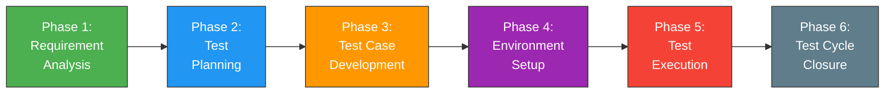
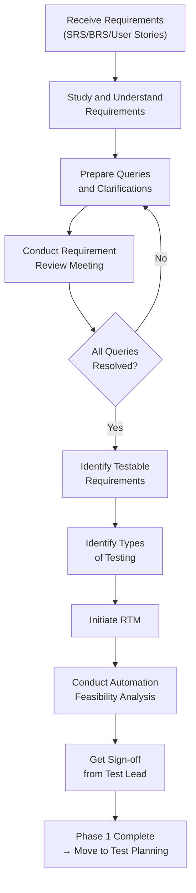
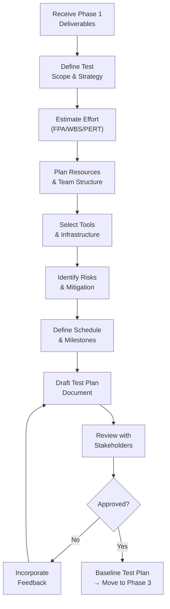
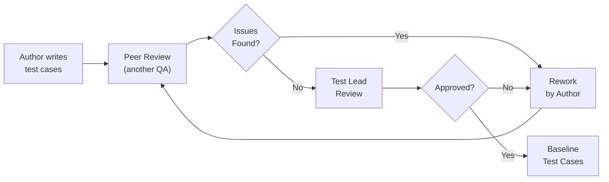
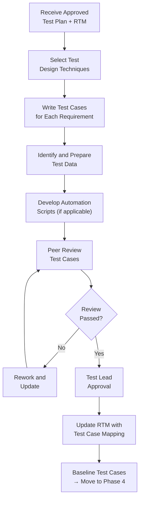
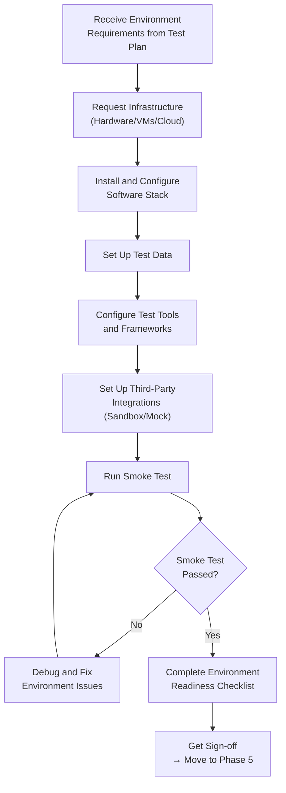
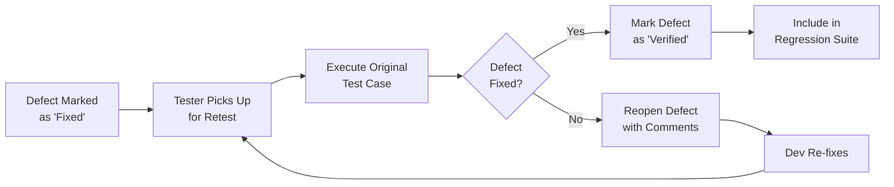
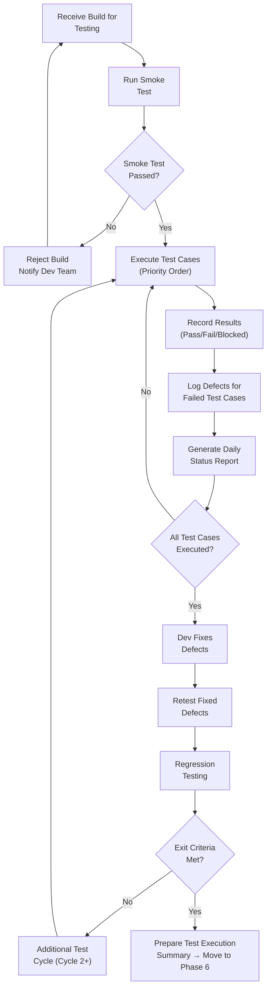
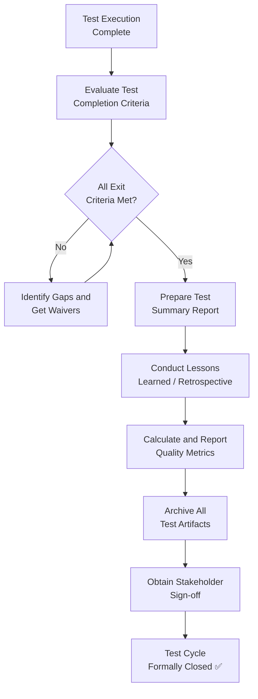

# Part 3: Software Testing Life Cycle (STLC)

---

## 3.1 Introduction to STLC

### What is STLC?

The **Software Testing Life Cycle (STLC)** is a systematic and structured sequence of activities carried out during the testing process to ensure that software quality goals are met. It defines a series of phases, each with specific objectives, entry criteria, exit criteria, activities, and deliverables. STLC is not merely about "finding bugs" — it is a comprehensive framework that transforms testing from a reactive, ad-hoc activity into a disciplined engineering process.

Unlike the common misconception that testing begins only after code is written, STLC activities actually start as soon as requirements are available. This early involvement ensures that defects are caught at their source — in requirements and design — where they are cheapest to fix.

> [!IMPORTANT]
> STLC is **not** a subset of SDLC. While STLC operates within the broader SDLC framework, it is a complete lifecycle in its own right, with its own governance, artifacts, and process controls.

**Key characteristics of STLC:**

- **Process-driven**: Every phase has defined inputs and outputs
- **Systematic**: Activities follow a logical sequence
- **Measurable**: Each phase has criteria to evaluate completion
- **Repeatable**: The process can be replicated across projects
- **Traceable**: Every test activity can be traced back to requirements

### STLC vs SDLC Comparison

Understanding how STLC relates to and differs from SDLC is fundamental. Here is a detailed comparison:

| Dimension | SDLC | STLC |
|---|---|---|
| **Full Form** | Software Development Life Cycle | Software Testing Life Cycle |
| **Primary Focus** | Building the software product | Validating and verifying the software product |
| **Goal** | Deliver a functional software system | Ensure the software meets quality standards |
| **Scope** | Covers the entire software development process | Covers only the testing activities within SDLC |
| **Phases** | Requirement → Design → Development → Testing → Deployment → Maintenance | Requirement Analysis → Test Planning → Test Case Development → Environment Setup → Test Execution → Test Closure |
| **Key Output** | Working software product | Test artifacts (test plans, test cases, defect reports, test summary) |
| **Stakeholders** | Business Analysts, Developers, Architects, Testers, Project Managers | Test Lead, QA Engineers, Test Managers, Automation Engineers |
| **Starts When** | Project initiation / business need identification | Requirements are available (partially or fully) |
| **Ends When** | Product is deployed and in maintenance | Test cycle is formally closed with sign-off |
| **Coding Involved** | Yes — core activity | Only for test automation scripts |
| **Defect Focus** | Preventing defects through good design | Detecting defects through systematic testing |
| **Documentation** | SRS, HLD, LLD, Code documentation | Test Plan, Test Cases, RTM, Defect Reports, Test Summary |

### Why STLC is Important

1. **Early Defect Detection**: By starting test activities during requirements analysis, defects in requirements and design are caught before they propagate into code. Studies show that fixing a defect found in requirements costs **1x**, while fixing the same defect in production costs **100x or more** (IBM Systems Sciences Institute).

2. **Structured Approach**: Without STLC, testing becomes chaotic — testers may test random features, miss critical paths, or duplicate efforts. STLC provides a roadmap.

3. **Clear Communication**: STLC artifacts (test plans, RTM, test summary reports) serve as communication tools between the testing team, development team, and stakeholders.

4. **Resource Optimization**: Proper planning prevents over-allocation or under-allocation of testing resources. You know exactly how many testers you need, what tools are required, and how long testing will take.

5. **Risk Management**: STLC forces teams to identify testing risks early and plan mitigation strategies.

6. **Compliance and Audit Readiness**: Industries like banking, healthcare, and aviation require documented evidence of testing. STLC produces the artifacts needed for regulatory compliance (SOX, HIPAA, FDA 21 CFR Part 11).

7. **Measurable Quality**: STLC enables quantitative reporting — test coverage, defect density, pass/fail rates — that gives stakeholders confidence in release decisions.

### STLC Overview Diagram



> [!NOTE]
> While the diagram shows a linear flow, in practice — especially in Agile environments — these phases may overlap or iterate. For example, Test Case Development and Environment Setup often happen in parallel.

---

## 3.2 Phase 1: Requirement Analysis

### Definition and Purpose

**Requirement Analysis** is the first and arguably the most critical phase of STLC. During this phase, the QA team studies the requirements — both functional and non-functional — to understand **what** needs to be tested, **how** it should be tested, and to identify any gaps, ambiguities, or inconsistencies in the requirements before testing begins.

The purpose of this phase is to:
- Gain a thorough understanding of the application's expected behavior
- Identify which requirements are testable and which are not
- Determine the scope of testing
- Begin building the foundation for all subsequent testing activities
- Establish traceability between requirements and test activities

> [!TIP]
> Many critical defects originate from poorly written, ambiguous, or incomplete requirements. The Requirement Analysis phase is your first line of defense. A well-conducted requirement analysis can prevent up to **40-50%** of defects from ever entering the system.

### Activities Performed

#### 1. Requirement Review and Understanding

The testing team participates in **requirement review meetings** (also called requirement walkthroughs or inspections) with Business Analysts, Product Owners, and other stakeholders. The goal is to achieve a shared understanding of the requirements.

**What testers look for during requirement review:**

| Review Checkpoint | Description | Example |
|---|---|---|
| **Completeness** | Are all scenarios described? Are edge cases covered? | "User can transfer funds" — but what about insufficient balance? Daily limits? |
| **Consistency** | Do requirements contradict each other? | Requirement A says "email is optional" but Requirement B says "send confirmation email to user" |
| **Clarity** | Are requirements unambiguous? Can two people interpret them differently? | "The system should respond quickly" — what does "quickly" mean? |
| **Testability** | Can we write a test to verify this requirement? | "The system should be user-friendly" is NOT testable; "The checkout process should complete in ≤ 5 clicks" IS testable |
| **Feasibility** | Can the requirement be implemented and tested with available resources? | "Support all browsers ever made" is not feasible |
| **Traceability** | Can each requirement be uniquely identified and tracked? | Each requirement should have a unique ID (e.g., REQ-LOGIN-001) |

**Practical approach:**

1. Read the SRS/BRS/User Stories thoroughly — at least twice
2. Highlight unclear or ambiguous areas
3. Prepare a list of questions/clarifications
4. Schedule a meeting with the BA or Product Owner
5. Document all clarifications and decisions
6. Get sign-off on the understood requirements

#### 2. Identifying Testable Requirements

Not all requirements are testable. The QA team must categorize requirements:

| Category | Description | Example |
|---|---|---|
| **Functional & Testable** | Specific, measurable behavior that can be verified | "The login page shall accept email addresses up to 254 characters" |
| **Non-Functional & Testable** | Quality attributes with measurable criteria | "The homepage shall load within 3 seconds under 1000 concurrent users" |
| **Non-Testable** | Vague, subjective, or impossible to verify | "The system should be intuitive" |
| **Partially Testable** | Can be tested with assumptions or additional clarification | "The system should support multiple languages" — which languages? |

> [!WARNING]
> Never skip a requirement simply because it seems "non-testable." Instead, work with the BA to make it testable. For example, "The system should be intuitive" can be refined to "90% of users should be able to complete the checkout process without referring to help documentation, as measured by usability testing."

#### 3. Identifying Types of Tests to Perform

Based on the requirements, the QA team identifies which types of testing are applicable:

| Requirement Type | Applicable Test Types |
|---|---|
| Login functionality | Functional Testing, Security Testing, Usability Testing |
| Fund transfer with amount limits | Functional Testing, Boundary Value Testing, Negative Testing |
| Page load time requirements | Performance Testing, Load Testing |
| Multi-browser support | Compatibility Testing, Cross-browser Testing |
| Data encryption requirements | Security Testing, Penetration Testing |
| Mobile responsiveness | Mobile Testing, UI/UX Testing |
| API integrations | API Testing, Integration Testing |
| Database operations | Database Testing, Data Integrity Testing |
| Regulatory compliance (GDPR) | Compliance Testing, Security Testing |

#### 4. Requirement Traceability Matrix (RTM) Initiation

The **Requirement Traceability Matrix (RTM)** is a document that maps requirements to test cases, ensuring complete test coverage. During this phase, the RTM is initiated by listing all requirements and their IDs.

**Sample RTM structure (initial version):**

| Req ID | Requirement Description | Priority | Test Case IDs | Test Status | Comments |
|---|---|---|---|---|---|
| REQ-LOGIN-001 | User shall be able to log in with valid email and password | High | *(To be filled in Phase 3)* | — | — |
| REQ-LOGIN-002 | System shall lock account after 5 failed login attempts | High | *(To be filled in Phase 3)* | — | — |
| REQ-LOGIN-003 | System shall display "Forgot Password" link on login page | Medium | *(To be filled in Phase 3)* | — | — |
| REQ-TRANS-001 | User shall be able to transfer funds between own accounts | High | *(To be filled in Phase 3)* | — | — |
| REQ-TRANS-002 | System shall enforce daily transfer limit of $10,000 | High | *(To be filled in Phase 3)* | — | — |
| REQ-PERF-001 | Login page shall load within 2 seconds | Medium | *(To be filled in Phase 3)* | — | — |

#### 5. Automation Feasibility Analysis

During this phase, the team evaluates which requirements/test scenarios are candidates for automation:

**Automation feasibility assessment criteria:**

| Criterion | Automate | Manual |
|---|---|---|
| Test executed frequently (regression) | ✅ | |
| Stable requirement (unlikely to change often) | ✅ | |
| High data volume / data-driven testing | ✅ | |
| Complex calculations or validations | ✅ | |
| Cross-browser / cross-platform testing | ✅ | |
| Exploratory testing | | ✅ |
| Usability / UX testing | | ✅ |
| One-time test execution | | ✅ |
| Frequently changing UI | | ✅ |
| Ad-hoc testing | | ✅ |

**Sample Automation Feasibility Report entry:**

| Module | Test Scenario | Automation Feasible? | Reason | Recommended Tool |
|---|---|---|---|---|
| Login | Valid/Invalid login combinations | Yes | High frequency, data-driven | Selenium WebDriver |
| Fund Transfer | Transfer between accounts | Yes | Complex validations, regression | Selenium + API tests |
| Dashboard | UI layout verification | Partial | Layout is stable, but visual testing needed | Selenium + Applitools |
| Onboarding | First-time user walkthrough | No | Requires human judgment for UX | Manual |

### Entry Criteria

Entry criteria define the conditions that must be met **before** Requirement Analysis can begin:

- [ ] Requirements document (SRS/BRS/User Stories) is available — even in draft form
- [ ] Stakeholders are identified and available for clarification meetings
- [ ] Application architecture document is available (if applicable)
- [ ] Project timeline and milestones are communicated
- [ ] QA team members are assigned to the project
- [ ] Access to requirement management tools (JIRA, Azure DevOps, etc.) is granted

### Exit Criteria

Exit criteria define when Requirement Analysis is considered **complete**:

- [ ] All requirements have been reviewed and understood by the QA team
- [ ] All ambiguities and queries have been resolved and documented
- [ ] Testable and non-testable requirements have been identified
- [ ] RTM (initial version) is prepared with all requirements listed
- [ ] Automation feasibility report is prepared
- [ ] Types of testing applicable to each module are identified
- [ ] Sign-off from Test Lead/QA Manager on the requirement analysis

### Deliverables

| Deliverable | Description | Owner |
|---|---|---|
| **Requirement Traceability Matrix (RTM)** — Initial Version | Maps all requirements with unique IDs; test case columns are placeholders | Test Lead |
| **Automation Feasibility Report** | Analysis of which scenarios can be automated, with tool recommendations | Automation Lead |
| **List of Queries/Clarifications** | Documented questions raised and their resolutions | QA Team |
| **Test Types Identification Document** | List of test types applicable per module/feature | Test Lead |

### Roles Involved

| Role | Responsibility |
|---|---|
| **Test Lead / QA Manager** | Leads the requirement analysis process, reviews RTM, assigns work |
| **Business Analyst** | Provides requirement clarifications, participates in review meetings |
| **QA Engineers** | Review requirements, identify testable requirements, prepare RTM entries |
| **Automation Lead** | Conducts automation feasibility analysis |
| **Product Owner** | Provides business context and validates requirement understanding |
| **Architect** | Clarifies technical requirements and constraints |

### Phase 1 Workflow



### Real-World Example: Analyzing Requirements for an Online Banking Application

**Scenario:** Your company, FinSecure Bank, is launching a new online banking platform. The Business Analyst has shared the SRS document with 250 requirements covering modules like Account Management, Fund Transfers, Bill Payments, Loan Applications, and Customer Support.

**How the QA team approaches Requirement Analysis:**

**Step 1: Initial Study (3 days)**
The QA team of 5 members divides the SRS by modules:
- Tester A: Account Management (45 requirements)
- Tester B: Fund Transfers (55 requirements)
- Tester C: Bill Payments (40 requirements)
- Tester D: Loan Applications (60 requirements)
- Tester E: Customer Support (50 requirements)

Each tester reads their assigned section thoroughly and flags issues.

**Step 2: Issues Found During Review**

| Issue # | Requirement | Problem | Type |
|---|---|---|---|
| 1 | REQ-FT-012: "Transfer should be fast" | Ambiguous — no measurable criteria | Clarity |
| 2 | REQ-AM-005: "User can update profile" but REQ-SEC-008: "Profile changes require OTP" | Contradiction — AM section doesn't mention OTP | Consistency |
| 3 | REQ-BP-022: "Support all billers in the country" | Too broad — which billers? How many? | Completeness |
| 4 | REQ-LA-015: "System should use AI for credit scoring" | Not testable as stated — what's the expected behavior? | Testability |
| 5 | REQ-CS-030: No mention of chatbot escalation to human agent | Missing requirement | Completeness |

**Step 3: Clarification Meeting (1 day)**
The QA team meets with the BA and resolves all issues:
- REQ-FT-012 refined to: "Fund transfer confirmation shall be displayed within 5 seconds for domestic transfers"
- REQ-AM-005 updated to include OTP requirement
- REQ-BP-022 scoped to "Top 50 billers by transaction volume"
- REQ-LA-015 refined to: "System shall approve/reject loan applications with accuracy matching manual underwriting decisions ± 5%"
- New requirement REQ-CS-031 added for chatbot escalation

**Step 4: RTM Created**
All 250+ requirements are entered into the RTM with unique IDs, module mapping, and priority.

**Step 5: Automation Feasibility**
- 120 requirements identified as automation candidates (login flows, fund transfers, API validations)
- 80 requirements identified for manual-only testing (UI/UX, exploratory, accessibility)
- 50 requirements identified as partial automation (combination of automated checks + manual verification)

> [!TIP]
> **Pro Tip for Requirement Analysis:** Always create a "Requirements Clarity Score" for your project. Rate each requirement on a scale of 1-5 for Clarity, Completeness, Testability, and Consistency. Requirements scoring below 3 on any dimension should be flagged for clarification before proceeding. This creates an objective measure and prevents subjective disputes.

---

## 3.3 Phase 2: Test Planning

### Definition and Purpose

**Test Planning** is the phase where the QA team creates a comprehensive strategy and plan for testing activities. The Test Plan is the most important document in the testing process — it serves as the "blueprint" for all testing activities, defining what will be tested, how it will be tested, who will test it, when it will be tested, and what resources are needed.

The Test Plan answers six fundamental questions:

1. **What** is the scope of testing? (What's in scope, what's out of scope)
2. **How** will testing be performed? (Strategy, techniques, tools)
3. **Who** will perform the testing? (Team composition, roles)
4. **When** will testing activities happen? (Schedule, milestones)
5. **Where** will testing be performed? (Environments, infrastructure)
6. **What if** something goes wrong? (Risks, contingencies)

### Activities Performed

#### 1. Test Strategy Formulation

The **test strategy** defines the overall approach to testing. It is typically a high-level document that applies across the organization or project.

**Components of a Test Strategy:**

| Component | Description | Example |
|---|---|---|
| **Scope** | What features/modules will be tested | "All modules listed in SRS v2.1 except the Admin module (Phase 2)" |
| **Test Levels** | Unit, Integration, System, Acceptance | "System testing and UAT are in scope for QA team" |
| **Test Types** | Functional, Performance, Security, etc. | "Functional, Regression, Smoke, Performance, Security" |
| **Test Approach** | Manual, Automated, or Hybrid | "Hybrid — 60% automated regression, 40% manual exploratory" |
| **Defect Management** | How defects will be logged, tracked, resolved | "JIRA with Severity/Priority classification, 24-hour SLA for Critical bugs" |
| **Test Data Strategy** | How test data will be managed | "Anonymized production data for performance tests; synthetic data for functional tests" |
| **Test Metrics** | What will be measured | "Test coverage, defect density, defect leakage, pass rate" |
| **Exit Criteria** | When testing is considered sufficient | "95% test cases executed, 100% Critical/High defects fixed, defect density < 0.5 per KLOC" |

#### 2. Effort Estimation

Effort estimation determines how much time and how many resources are needed. Three common techniques:

**a) Function Point Analysis (FPA)**

FPA estimates effort based on the number and complexity of functions in the application:

| Function Type | Low Complexity | Medium Complexity | High Complexity |
|---|---|---|---|
| External Inputs (EI) | 3 FP | 4 FP | 6 FP |
| External Outputs (EO) | 4 FP | 5 FP | 7 FP |
| External Inquiries (EQ) | 3 FP | 4 FP | 6 FP |
| Internal Logical Files (ILF) | 7 FP | 10 FP | 15 FP |
| External Interface Files (EIF) | 5 FP | 7 FP | 10 FP |

*Example:* If the Login module has 3 EI (low), 2 EO (medium), and 1 ILF (medium):
- EI: 3 × 3 = 9 FP
- EO: 2 × 5 = 10 FP
- ILF: 1 × 10 = 10 FP
- Total: 29 FP
- If each FP takes 2 hours to test: **58 person-hours**

**b) Work Breakdown Structure (WBS)**

WBS breaks testing into smaller, estimable tasks:

```
Fund Transfer Module Testing
├── Test Case Design: 40 hours
│   ├── Positive scenarios: 15 hours
│   ├── Negative scenarios: 15 hours
│   └── Edge cases: 10 hours
├── Test Data Preparation: 16 hours
├── Test Execution (Cycle 1): 60 hours
├── Defect Reporting & Verification: 24 hours
├── Regression Testing: 30 hours
├── Test Execution (Cycle 2): 40 hours
└── Test Reporting: 8 hours
    TOTAL: 218 hours (≈ 27 person-days)
```

**c) Three-Point Estimation (PERT)**

Uses optimistic (O), most likely (M), and pessimistic (P) estimates:

**Formula:** `E = (O + 4M + P) / 6`

| Task | Optimistic (O) | Most Likely (M) | Pessimistic (P) | Estimated (E) |
|---|---|---|---|---|
| Test Case Design | 30 hrs | 40 hrs | 70 hrs | 42.5 hrs |
| Test Execution | 50 hrs | 60 hrs | 90 hrs | 63.3 hrs |
| Defect Management | 15 hrs | 24 hrs | 45 hrs | 26 hrs |
| Regression | 20 hrs | 30 hrs | 50 hrs | 31.7 hrs |
| **Total** | — | — | — | **163.5 hrs** |

#### 3. Resource Planning

| Role | Count | Allocation | Skills Required |
|---|---|---|---|
| Test Lead | 1 | 100% | Test management, reporting, stakeholder communication |
| Senior QA Engineer | 2 | 100% | Domain expertise, complex scenario design, mentoring |
| QA Engineer | 3 | 100% | Test execution, defect reporting |
| Automation Engineer | 2 | 100% | Selenium, API testing, CI/CD |
| Performance Tester | 1 | 50% | JMeter/Gatling, performance analysis |
| Security Tester | 1 | 25% | OWASP, penetration testing |

#### 4. Tool Selection

| Purpose | Tool Options | Selection Criteria |
|---|---|---|
| Test Management | JIRA + Zephyr, TestRail, Azure Test Plans, qTest | Integration with existing tools, cost, team familiarity |
| Automation (Web) | Selenium, Cypress, Playwright | Browser coverage, language support, community |
| Automation (API) | Postman, RestAssured, Karate | Ease of use, assertion capabilities |
| Performance | JMeter, Gatling, k6 | Protocol support, scripting ease, reporting |
| Security | OWASP ZAP, Burp Suite | Vulnerability coverage, compliance requirements |
| Defect Tracking | JIRA, Bugzilla, Azure DevOps | Workflow customization, reporting, integration |
| CI/CD Integration | Jenkins, GitHub Actions, Azure Pipelines | Ecosystem fit, pipeline complexity |

#### 5. Risk Identification and Mitigation

| Risk ID | Risk Description | Probability | Impact | Mitigation Strategy |
|---|---|---|---|---|
| R-001 | Requirements may change mid-sprint | High | High | Maintain flexible test cases; implement change management process |
| R-002 | Test environment not available on time | Medium | High | Request environment 2 weeks early; have a backup environment plan |
| R-003 | Insufficient test data for performance testing | Medium | Medium | Prepare synthetic data generator; request anonymized production data early |
| R-004 | Key tester leaves the project | Low | High | Cross-train team members; maintain detailed documentation |
| R-005 | Third-party API not available for integration testing | Medium | High | Use mock services (WireMock/MockServer); coordinate with vendor |
| R-006 | Automation scripts may be fragile due to UI changes | High | Medium | Use Page Object Model; implement robust locator strategies |

#### 6. Defining Roles and Responsibilities (RACI Matrix)

| Activity | Test Lead | QA Engineer | Automation Engineer | BA | Dev Lead |
|---|---|---|---|---|---|
| Test Planning | **A** (Accountable) | C (Consulted) | C | C | I (Informed) |
| Test Case Design | R (Responsible) | **A** | C | C | I |
| Test Execution | I | **A** | R | I | I |
| Defect Triage | **A** | R | R | C | R |
| Automation Development | C | I | **A** | I | C |
| Test Reporting | **A** | R | R | I | I |

*R = Responsible, A = Accountable, C = Consulted, I = Informed*

#### 7. Training Needs Identification

| Team Member | Current Skill Gap | Training Needed | Timeline |
|---|---|---|---|
| Junior QA Engineers | API Testing | Postman + RestAssured workshop | Week 1-2 |
| QA Team | Domain Knowledge (Banking) | Banking domain training by BA | Week 1 |
| Automation Engineers | New framework (Playwright) | Playwright certification course | Week 1-3 |
| All QA | JIRA Zephyr plugin | Tool-specific training | Week 1 |

### Entry Criteria

- [ ] Requirement Analysis phase is complete with sign-off
- [ ] RTM (initial version) is available
- [ ] Automation Feasibility Report is available
- [ ] Project schedule and budget information is available
- [ ] Stakeholder list is finalized
- [ ] Development approach (Agile/Waterfall) is decided

### Exit Criteria

- [ ] Test Plan document is reviewed and approved by all stakeholders
- [ ] Effort estimation is complete and agreed upon
- [ ] Resource plan is finalized
- [ ] Tool selection is complete and tools are procured/licensed
- [ ] Risk register is created with mitigation strategies
- [ ] RACI matrix is defined and communicated
- [ ] Training plan is in place
- [ ] Test schedule with milestones is published

### Deliverables

| Deliverable | Description |
|---|---|
| **Test Plan Document** | Comprehensive document covering scope, strategy, schedule, resources, risks |
| **Effort Estimation Document** | Detailed breakdown of effort by module, phase, and resource |
| **Risk Register** | Identified risks with probability, impact, and mitigation |
| **Resource Plan** | Team composition, allocation, and onboarding plan |
| **Tool Procurement List** | Tools needed, licenses, and procurement timeline |
| **Training Plan** | Skill gaps and training schedule |

### Sample Test Plan Outline (IEEE 829 Standard)

```
TEST PLAN DOCUMENT
==================

1. Test Plan Identifier
   - TP-FINSECURE-2026-001

2. Introduction
   - Purpose of this document
   - Project overview
   - References (SRS, HLD, LLD)

3. Test Items
   - Login Module v2.1
   - Fund Transfer Module v2.1
   - Bill Payment Module v2.1
   - Loan Application Module v2.1 (deferred to Phase 2)

4. Features to be Tested
   - User authentication (email/password, MFA)
   - Account-to-account fund transfer
   - Scheduled payments
   - Bill payment with biller integration

5. Features NOT to be Tested
   - Admin console (Phase 2)
   - Mobile application (separate test plan)
   - Legacy system migration testing

6. Test Approach
   - Manual testing for exploratory and usability
   - Automated regression using Selenium + TestNG
   - API testing using RestAssured
   - Performance testing using JMeter (500 concurrent users)
   - Security testing using OWASP ZAP

7. Pass/Fail Criteria
   - Pass: Expected result matches actual result
   - Fail: Any deviation from expected behavior
   - Block: Test cannot be executed due to environment/dependency issue

8. Suspension and Resumption Criteria
   - Suspend: >5 Critical defects open simultaneously
   - Resume: Critical defect count reduced to ≤2

9. Test Deliverables
   - Test Plan, Test Cases, RTM, Defect Reports
   - Daily/Weekly Status Reports
   - Test Summary Report

10. Test Environment
    - OS: Windows 11, macOS Ventura, Ubuntu 22.04
    - Browsers: Chrome 120+, Firefox 119+, Safari 17+, Edge 120+
    - Database: PostgreSQL 15
    - Application Server: Apache Tomcat 10
    - Test Data: Anonymized production data + synthetic data

11. Staffing and Training
    - [See Resource Plan table above]

12. Schedule
    - Test Planning: Week 1-2
    - Test Case Development: Week 2-4
    - Environment Setup: Week 3-4
    - Test Execution Cycle 1: Week 5-7
    - Defect Fix & Retest: Week 7-8
    - Regression & Cycle 2: Week 8-9
    - Test Closure: Week 10

13. Risks and Contingencies
    - [See Risk Register above]

14. Approvals
    - Test Lead: _______________  Date: ___
    - QA Manager: ______________  Date: ___
    - Project Manager: _________  Date: ___
    - Dev Lead: ________________  Date: ___
```

### Phase 2 Workflow



### Real-World Example: Test Planning for an E-Commerce Platform

**Scenario:** You are the Test Lead for "ShopEase," a new e-commerce platform launching in 12 weeks. The platform includes: Product Catalog, Shopping Cart, Checkout, Payment Gateway Integration (Stripe, PayPal), Order Management, User Account Management, and Wishlist.

**Key decisions made during Test Planning:**

1. **Scope Definition:**
   - In scope: All 7 modules for web (desktop + mobile responsive)
   - Out of scope: Mobile app (native), Admin panel, Inventory management (backend-only, tested by dev team)

2. **Strategy:**
   - Hybrid approach: 70% manual for first release, 30% automated regression
   - Shift-left: QA participates in sprint grooming and design reviews
   - Risk-based testing: Payment and Checkout get highest priority

3. **Effort Estimate (using WBS):**
   - Total estimated effort: 1,200 person-hours
   - Checkout + Payment: 350 hours (highest risk/complexity)
   - Product Catalog: 200 hours
   - Other modules: 650 hours combined

4. **Team:** 1 Test Lead, 3 QA Engineers, 1 Automation Engineer, 1 Performance Tester (part-time)

5. **Tools:** TestRail for test management, Selenium + Java for automation, JIRA for defects, JMeter for performance

6. **Key Risk Identified:** Payment gateway sandbox environment has limited transaction types → Mitigation: Coordinate with Stripe/PayPal for extended sandbox access; create mock responses for unavailable scenarios

---

## 3.4 Phase 3: Test Case Development

### Definition and Purpose

**Test Case Development** is the phase where the QA team creates detailed test cases, test data, and test scripts (for automation) based on the requirements and test plan. This phase transforms the "what to test" (from Phases 1 and 2) into "how to test" with specific steps, inputs, expected results, and test data.

A well-written test case is:
- **Atomic**: Tests one thing at a time
- **Independent**: Does not depend on other test cases
- **Repeatable**: Produces the same result every time
- **Traceable**: Linked to a specific requirement
- **Clear**: Any tester can execute it without ambiguity

### Activities Performed

#### 1. Test Case Creation

Test cases are written using various test design techniques:

| Technique | Description | When to Use | Example |
|---|---|---|---|
| **Equivalence Partitioning** | Divide inputs into valid and invalid partitions | Large input ranges | Age field: Valid (18-65), Invalid (<18, >65) |
| **Boundary Value Analysis** | Test at the boundaries of partitions | Numeric/date ranges | Age: 17, 18, 19, 64, 65, 66 |
| **Decision Table** | Test combinations of conditions and actions | Multiple conditions affecting outcomes | Discount: VIP + coupon + holiday = ? |
| **State Transition** | Test transitions between states | Stateful systems | Order: Created → Paid → Shipped → Delivered |
| **Error Guessing** | Use experience to guess error-prone areas | Complex/legacy systems | SQL injection in search field |
| **Use Case Testing** | Test end-to-end user scenarios | User workflow testing | "User searches, adds to cart, checks out" |
| **Pairwise Testing** | Test all pairs of parameter combinations | Multiple parameter combinations | Browser × OS × Language combinations |

#### 2. Test Data Identification and Preparation

| Data Type | Description | Example | Source |
|---|---|---|---|
| **Positive Test Data** | Valid data that should be accepted | Email: "user@example.com" | Created manually |
| **Negative Test Data** | Invalid data that should be rejected | Email: "user@", "@example.com", "" | Created manually |
| **Boundary Test Data** | Data at exact boundaries | Password: exactly 8 chars, exactly 20 chars | Derived from requirements |
| **Large Volume Data** | Data for performance/load testing | 100,000 user records | Generated via scripts/tools |
| **Production-like Data** | Anonymized real data | Customer records with masked PII | Extracted and anonymized from production |
| **Special Character Data** | Data with special characters | Name: "O'Brien", "José García" | Created manually |

> [!WARNING]
> **Never use real production data with PII (Personally Identifiable Information) in test environments** without proper anonymization. This violates GDPR, HIPAA, and other data protection regulations. Always use data masking tools or synthetic data generators.

#### 3. Test Script Development (for Automation)

For test cases identified as automation candidates, automation engineers develop scripts:

```
Example: Automated Test Script Structure (Selenium + TestNG)

@Test(priority = 1, description = "Verify successful login with valid credentials")
public void testValidLogin() {
    // Step 1: Navigate to login page
    driver.get("https://app.shopease.com/login");
    
    // Step 2: Enter valid email
    loginPage.enterEmail("testuser@example.com");
    
    // Step 3: Enter valid password
    loginPage.enterPassword("SecurePass@123");
    
    // Step 4: Click Login button
    loginPage.clickLoginButton();
    
    // Step 5: Verify successful login
    Assert.assertTrue(dashboardPage.isWelcomeMessageDisplayed());
    Assert.assertEquals(dashboardPage.getUsername(), "Test User");
}
```

#### 4. Test Case Review and Approval

Test cases go through a formal review process:



**Review checklist:**

- [ ] Test case is traceable to a requirement (RTM updated)
- [ ] Steps are clear and unambiguous
- [ ] Expected results are specific and verifiable
- [ ] Test data is specified or referenced
- [ ] Pre-conditions are stated
- [ ] Post-conditions are stated
- [ ] No duplication with existing test cases
- [ ] Positive, negative, and edge cases are covered
- [ ] Test case follows the team's naming convention

### Entry Criteria

- [ ] Test Plan is approved and baselined
- [ ] Requirements are clear, unambiguous, and signed off
- [ ] RTM (initial version) is available
- [ ] Test case template is defined and agreed upon
- [ ] Test design techniques to be used are identified
- [ ] Automation feasibility analysis is complete

### Exit Criteria

- [ ] All test cases are written, reviewed, and approved
- [ ] Test data is identified, prepared, and validated
- [ ] RTM is updated with test case IDs mapped to requirements
- [ ] Automation scripts are developed and peer-reviewed (for automated test cases)
- [ ] Test cases achieve required coverage (e.g., 100% of high-priority requirements covered)
- [ ] Test case repository is organized and baselined

### Deliverables

| Deliverable | Description |
|---|---|
| **Test Cases** | Complete set of test cases with steps, data, expected results |
| **Test Data** | Prepared test data sets for various scenarios |
| **Test Scripts** | Automated test scripts (if applicable) |
| **Updated RTM** | RTM with test case IDs mapped to each requirement |

### Test Case Template (Full Sample)

```
┌──────────────────────────────────────────────────────────────────┐
│                      TEST CASE DOCUMENT                          │
├──────────────────────────────────────────────────────────────────┤
│ Test Case ID    : TC-LOGIN-005                                   │
│ Module          : Login                                          │
│ Test Title      : Verify account lockout after 5 failed attempts │
│ Priority        : High                                           │
│ Severity        : Critical                                       │
│ Type            : Functional, Security                           │
│ Requirement ID  : REQ-LOGIN-002                                  │
│ Author          : Sarah Johnson                                  │
│ Creation Date   : 2026-05-15                                     │
│ Last Updated    : 2026-05-20                                     │
│ Version         : 1.1                                            │
├──────────────────────────────────────────────────────────────────┤
│ PRECONDITIONS:                                                   │
│ 1. User account "testuser@finsecure.com" exists and is active    │
│ 2. Account is not currently locked                               │
│ 3. Browser is open and login page is accessible                  │
│ 4. Failed attempt counter for this account is reset to 0         │
├──────────────────────────────────────────────────────────────────┤
│ TEST DATA:                                                       │
│ - Valid Email: testuser@finsecure.com                            │
│ - Invalid Password: WrongPass@123                                │
│ - Valid Password: CorrectPass@456                                │
├──────────────────────────────────────────────────────────────────┤
│ TEST STEPS:                                                      │
│                                                                  │
│ Step 1: Navigate to https://app.finsecure.com/login              │
│   Expected: Login page is displayed with email and password      │
│             fields, and a "Login" button                         │
│                                                                  │
│ Step 2: Enter "testuser@finsecure.com" in the Email field        │
│   Expected: Email is entered successfully                        │
│                                                                  │
│ Step 3: Enter "WrongPass@123" in the Password field              │
│   Expected: Password is entered (masked with dots/asterisks)     │
│                                                                  │
│ Step 4: Click the "Login" button                                 │
│   Expected: Error message displayed:                             │
│            "Invalid email or password. 4 attempts remaining."    │
│                                                                  │
│ Step 5: Repeat Steps 2-4 four more times (total 5 failed         │
│         attempts) with the same invalid password                 │
│   Expected: After 5th attempt, message displayed:                │
│            "Your account has been locked due to multiple failed   │
│             login attempts. Please contact support or try again  │
│             after 30 minutes."                                   │
│                                                                  │
│ Step 6: Attempt to login with VALID credentials                  │
│         (CorrectPass@456)                                        │
│   Expected: Login should FAIL with message:                      │
│            "Your account is locked. Please try again after       │
│             30 minutes or contact support."                      │
│                                                                  │
│ Step 7: Wait 30 minutes and retry with valid credentials         │
│   Expected: Login should succeed and user is redirected to       │
│             dashboard                                            │
├──────────────────────────────────────────────────────────────────┤
│ POSTCONDITIONS:                                                  │
│ 1. Account lockout is logged in the audit trail                  │
│ 2. Account is unlocked after 30-minute cooldown period           │
│ 3. Failed attempt counter is reset to 0 after successful login   │
├──────────────────────────────────────────────────────────────────┤
│ ACTUAL RESULT  : (To be filled during execution)                 │
│ STATUS         : (Pass / Fail / Blocked / Not Executed)          │
│ DEFECT ID      : (If Failed, link to defect)                    │
│ EXECUTED BY    : (Tester name)                                   │
│ EXECUTION DATE : (Date of execution)                             │
│ COMMENTS       : (Any observations or notes)                     │
└──────────────────────────────────────────────────────────────────┘
```

### Phase 3 Workflow



### Real-World Example: Writing Test Cases for a Login Module

**Scenario:** You are writing test cases for the login module of the FinSecure Banking application. The login module has the following requirements:

- REQ-LOGIN-001: User can log in with valid email and password
- REQ-LOGIN-002: Account locks after 5 failed attempts
- REQ-LOGIN-003: Forgot Password functionality via email OTP
- REQ-LOGIN-004: Remember Me checkbox persists session for 30 days
- REQ-LOGIN-005: MFA via SMS/Email for sensitive operations

**Test cases created:**

| TC ID | Requirement | Test Scenario | Priority | Type |
|---|---|---|---|---|
| TC-LOGIN-001 | REQ-LOGIN-001 | Login with valid email and correct password | High | Positive |
| TC-LOGIN-002 | REQ-LOGIN-001 | Login with valid email and incorrect password | High | Negative |
| TC-LOGIN-003 | REQ-LOGIN-001 | Login with unregistered email | High | Negative |
| TC-LOGIN-004 | REQ-LOGIN-001 | Login with empty email field | Medium | Negative |
| TC-LOGIN-005 | REQ-LOGIN-001 | Login with empty password field | Medium | Negative |
| TC-LOGIN-006 | REQ-LOGIN-001 | Login with both fields empty | Medium | Negative |
| TC-LOGIN-007 | REQ-LOGIN-001 | Login with SQL injection in email field | High | Security |
| TC-LOGIN-008 | REQ-LOGIN-001 | Login with XSS script in email field | High | Security |
| TC-LOGIN-009 | REQ-LOGIN-001 | Login with email exceeding 254 characters | Medium | Boundary |
| TC-LOGIN-010 | REQ-LOGIN-001 | Login with password shorter than minimum (8 chars) | Medium | Boundary |
| TC-LOGIN-011 | REQ-LOGIN-001 | Login with password at maximum length (20 chars) | Medium | Boundary |
| TC-LOGIN-012 | REQ-LOGIN-002 | Account lockout after 5 failed attempts | High | Functional |
| TC-LOGIN-013 | REQ-LOGIN-002 | Login with valid creds while account is locked | High | Negative |
| TC-LOGIN-014 | REQ-LOGIN-002 | Account unlock after 30-minute cooldown | High | Functional |
| TC-LOGIN-015 | REQ-LOGIN-003 | Forgot Password — request OTP with valid email | High | Functional |
| TC-LOGIN-016 | REQ-LOGIN-003 | Forgot Password — enter correct OTP | High | Positive |
| TC-LOGIN-017 | REQ-LOGIN-003 | Forgot Password — enter incorrect OTP | High | Negative |
| TC-LOGIN-018 | REQ-LOGIN-003 | Forgot Password — OTP expiry after 10 minutes | Medium | Functional |
| TC-LOGIN-019 | REQ-LOGIN-004 | Remember Me — session persists after browser close | Medium | Functional |
| TC-LOGIN-020 | REQ-LOGIN-004 | Remember Me — session expires after 30 days | Low | Functional |
| TC-LOGIN-021 | REQ-LOGIN-005 | MFA triggered for fund transfer after login | High | Functional |
| TC-LOGIN-022 | REQ-LOGIN-005 | MFA — enter valid OTP | High | Positive |
| TC-LOGIN-023 | REQ-LOGIN-005 | MFA — enter invalid OTP | High | Negative |
| TC-LOGIN-024 | REQ-LOGIN-005 | MFA — resend OTP functionality | Medium | Functional |
| TC-LOGIN-025 | REQ-LOGIN-001 | Login using keyboard only (Tab + Enter) | Medium | Accessibility |

**Total: 25 test cases for 5 requirements = average 5 test cases per requirement**

> [!TIP]
> **Rule of Thumb for Test Case Coverage:** Aim for at least 3-5 test cases per requirement — at minimum one positive, one negative, and one boundary/edge case. Critical requirements like login, payments, and data security typically warrant 8-15 test cases each.

---

## 3.5 Phase 4: Test Environment Setup

### Definition and Purpose

**Test Environment Setup** is the phase where the hardware, software, network, and test data configurations required for test execution are prepared and validated. The test environment should mirror the production environment as closely as possible to ensure that test results are reliable and reproducible.

A test environment typically includes:
- **Hardware**: Servers, workstations, mobile devices
- **Software**: Operating systems, browsers, application servers, databases
- **Network**: Network configurations, firewalls, VPNs, load balancers
- **Test Data**: Pre-loaded data sets required for test execution
- **Tools**: Test management tools, automation frameworks, monitoring tools
- **Third-party Integrations**: APIs, payment gateways, email services (sandbox/mock)

> [!IMPORTANT]
> Test environment issues are one of the **top 3 causes** of test execution delays. According to industry surveys, teams lose an average of **25-35%** of their test execution time to environment-related problems. Investing time in proper environment setup pays dividends.

### Activities Performed

#### 1. Hardware and Software Setup

**Environment architecture for a typical web application:**

```
┌─────────────────────────────────────────────────────────┐
│                   TEST ENVIRONMENT                       │
│                                                          │
│  ┌──────────┐    ┌──────────┐    ┌──────────────────┐   │
│  │  Client   │    │   Web    │    │   Application    │   │
│  │ Machines  │───▶│  Server  │───▶│     Server       │   │
│  │(Browsers) │    │ (Nginx)  │    │   (Tomcat 10)    │   │
│  └──────────┘    └──────────┘    └──────────────────┘   │
│                                          │               │
│                                          ▼               │
│                                  ┌──────────────────┐   │
│                                  │    Database       │   │
│                                  │  (PostgreSQL 15)  │   │
│                                  └──────────────────┘   │
│                                          │               │
│                                          ▼               │
│  ┌──────────────────┐    ┌──────────────────────────┐   │
│  │  Mock Services   │    │   External Integrations   │   │
│  │ (WireMock, etc.) │    │  (Stripe Sandbox, etc.)  │   │
│  └──────────────────┘    └──────────────────────────┘   │
└─────────────────────────────────────────────────────────┘
```

**Environment configuration checklist:**

| Component | Production | Test Environment | Match? |
|---|---|---|---|
| Operating System | Ubuntu 22.04 LTS | Ubuntu 22.04 LTS | ✅ |
| Web Server | Nginx 1.24 | Nginx 1.24 | ✅ |
| App Server | Tomcat 10.1 | Tomcat 10.1 | ✅ |
| Database | PostgreSQL 15.4 (3 replicas) | PostgreSQL 15.4 (1 instance) | ⚠️ Partial |
| Java Version | JDK 17 | JDK 17 | ✅ |
| Memory | 64 GB RAM | 16 GB RAM | ⚠️ Scaled down |
| Storage | 2 TB SSD | 500 GB SSD | ⚠️ Scaled down |
| SSL Certificate | Production cert | Self-signed cert | ⚠️ Different |
| CDN | CloudFront | None | ❌ Not available |
| Load Balancer | ALB (2 instances) | None (single instance) | ❌ Not available |

#### 2. Test Data Setup

| Data Category | Description | Volume | Setup Method |
|---|---|---|---|
| **User Accounts** | Test users with various roles (admin, customer, merchant) | 50 accounts | SQL scripts |
| **Product Catalog** | Products with categories, images, pricing | 1,000 products | Data import tool |
| **Transaction History** | Historical transactions for reporting tests | 50,000 records | Generated via scripts |
| **Payment Methods** | Test credit cards, bank accounts | 20 methods | Stripe test card numbers |
| **Geographic Data** | Addresses for shipping calculations | 500 addresses | CSV import |

#### 3. Smoke Test on the Environment

Before declaring the environment ready, a **smoke test** is performed to verify basic functionality:

| Smoke Test # | Test | Expected Result | Actual Result | Status |
|---|---|---|---|---|
| ST-001 | Application URL is accessible | Login page loads | — | — |
| ST-002 | Login with valid credentials | Dashboard displayed | — | — |
| ST-003 | Database connectivity | Data retrieval successful | — | — |
| ST-004 | API endpoint responds | HTTP 200 with valid response | — | — |
| ST-005 | Email service (sandbox) | Test email received | — | — |
| ST-006 | Payment gateway (sandbox) | Test transaction processed | — | — |
| ST-007 | File upload functionality | File uploaded successfully | — | — |
| ST-008 | Report generation | Report generated/downloaded | — | — |

#### 4. Environment Readiness Checklist

| # | Checklist Item | Verified By | Date | Status |
|---|---|---|---|---|
| 1 | Application deployed and accessible | DevOps | — | — |
| 2 | Database populated with test data | QA | — | — |
| 3 | All test tools installed and configured | QA | — | — |
| 4 | Network access (VPN, firewalls) configured | Network Team | — | — |
| 5 | Third-party integrations available (sandbox) | Dev Team | — | — |
| 6 | Test user accounts created with appropriate roles | QA | — | — |
| 7 | Browser versions installed (Chrome, Firefox, Safari, Edge) | QA | — | — |
| 8 | Mobile devices available and configured | QA | — | — |
| 9 | Smoke test passed | QA Lead | — | — |
| 10 | Environment access granted to all team members | Admin | — | — |

### Entry Criteria

- [ ] Test Plan is approved
- [ ] System Design / Architecture documents are available
- [ ] Environment requirements are documented in the Test Plan
- [ ] Infrastructure team / DevOps team is available
- [ ] Required hardware and software are procured
- [ ] Test data requirements are identified

### Exit Criteria

- [ ] Test environment is set up and configured as per the Test Plan
- [ ] Smoke test is passed on the environment
- [ ] All test tools are installed, configured, and verified
- [ ] Test data is loaded and validated
- [ ] Environment readiness checklist is signed off
- [ ] All team members have access to the environment
- [ ] Environment documentation is updated

### Deliverables

| Deliverable | Description |
|---|---|
| **Environment Ready** | Fully configured and validated test environment |
| **Smoke Test Results** | Results of smoke testing on the environment |
| **Environment Configuration Document** | Detailed document listing all configurations |
| **Environment Readiness Checklist** | Signed-off checklist confirming readiness |

### Common Environment Issues and Solutions

| Issue | Impact | Root Cause | Solution |
|---|---|---|---|
| **Environment not matching production** | Tests pass in QA but fail in production | Different configurations, missing components | Maintain an environment parity matrix; use infrastructure-as-code (Terraform, Docker) |
| **Test data corruption** | Test cases fail intermittently | Shared test data modified by other testers | Implement test data isolation; refresh data before each test cycle |
| **Environment downtime** | Testing blocked | Server crashes, maintenance windows | Have a backup environment; schedule maintenance during non-testing hours |
| **Third-party service unavailable** | Integration tests blocked | Vendor sandbox outage | Use mock services (WireMock) as fallback |
| **Slow environment** | Tests take longer, timeouts | Insufficient resources | Monitor resource usage; scale up during test execution |
| **SSL/Certificate issues** | HTTPS tests fail | Expired or misconfigured certificates | Use cert-manager; add self-signed certs to trust store |
| **Database connectivity issues** | Data-dependent tests fail | Incorrect connection strings, firewall rules | Verify connectivity during smoke test; document connection parameters |
| **Version mismatch** | Unexpected behavior | Wrong build deployed | Implement version verification in smoke test; use CI/CD for deployments |

### Phase 4 Workflow



### Real-World Example: Setting Up Test Environment for a Healthcare Application

**Scenario:** Your team is testing "MedConnect," a telemedicine platform that allows patients to book appointments, have video consultations, and receive e-prescriptions. The application must comply with HIPAA regulations.

**Environment challenges and solutions:**

1. **HIPAA Compliance**: Test environment must also be HIPAA compliant
   - *Solution*: Used encrypted storage (AES-256), VPN-only access, audit logging, BAA (Business Associate Agreement) with cloud provider

2. **Video Conferencing Testing**: Need to test WebRTC-based video calls
   - *Solution*: Set up dedicated machines with webcams and microphones; used virtual webcam software for automation

3. **e-Prescription Integration**: Integration with pharmacy systems
   - *Solution*: Used a sandbox environment provided by the pharmacy integration vendor; created mock responses for unavailable endpoints

4. **Patient Data**: Need realistic patient records without real PHI
   - *Solution*: Used Synthea (open-source synthetic patient data generator) to create 10,000 realistic but completely synthetic patient records

5. **Multi-device Testing**: Need to test on iOS and Android devices
   - *Solution*: Used BrowserStack for cloud device testing; maintained 4 physical devices (2 iOS, 2 Android) for critical path testing

---

## 3.6 Phase 5: Test Execution

### Definition and Purpose

**Test Execution** is the phase where the actual testing happens — testers execute the prepared test cases against the application under test (AUT), record results, and log defects for any deviations from expected behavior. This is the most visible and resource-intensive phase of STLC.

Test execution is not a one-time activity. It typically involves multiple **test cycles**:

| Cycle | Purpose | Scope |
|---|---|---|
| **Cycle 1** | First full execution of all test cases | All test cases |
| **Defect Fix & Retest** | Verify that reported defects are fixed | Failed test cases only |
| **Cycle 2 (Regression)** | Ensure fixes haven't broken existing functionality | All test cases (or risk-based subset) |
| **Final Regression** | Final verification before release | High-priority + previously failed test cases |
| **UAT Support** | Support business users during acceptance testing | Business-critical scenarios |

### Activities Performed

#### 1. Execute Test Cases

Testers execute test cases following the test plan's prioritization:

**Execution priority order:**
1. **Smoke Tests** — Verify basic functionality works
2. **Critical Path Tests** — Core business flows (e.g., login, purchase, payment)
3. **High-Priority Test Cases** — Based on risk and business importance
4. **Medium-Priority Test Cases** — Important but not showstoppers
5. **Low-Priority Test Cases** — Nice-to-have, edge cases
6. **Exploratory Testing** — Unscripted testing to find unexpected defects

**Test execution status values:**

| Status | Symbol | Description |
|---|---|---|
| **Pass** | ✅ | Actual result matches expected result |
| **Fail** | ❌ | Actual result deviates from expected result |
| **Blocked** | 🚫 | Cannot execute due to dependency or environment issue |
| **Not Executed** | ⬜ | Test case has not been run yet |
| **In Progress** | 🔄 | Currently being executed |
| **Skipped** | ⏭️ | Deliberately not executed (e.g., out of scope for this cycle) |
| **Not Applicable** | N/A | Test case no longer relevant (requirement changed) |

#### 2. Map Test Results to Test Cases

Every test case execution is recorded with:

| Field | Description | Example |
|---|---|---|
| **Test Case ID** | Unique identifier | TC-LOGIN-012 |
| **Execution Date** | When the test was executed | 2026-06-15 |
| **Tester** | Who executed the test | John Smith |
| **Build/Version** | Application version tested | v2.1.3-RC1 |
| **Environment** | Which environment was used | QA-Env-01 |
| **Status** | Pass/Fail/Blocked | Fail |
| **Actual Result** | What actually happened | Account not locked after 5 failed attempts; 6th attempt allowed |
| **Screenshots/Evidence** | Visual proof of result | Screenshot attached |
| **Defect ID** | Link to defect (if failed) | BUG-2026-0456 |
| **Comments** | Additional observations | "Works correctly with Chrome but fails on Firefox" |

#### 3. Log Defects for Failed Test Cases

When a test case fails, a defect is logged with comprehensive information:

**Defect Report Template:**

```
┌─────────────────────────────────────────────────────────────┐
│                    DEFECT REPORT                             │
├─────────────────────────────────────────────────────────────┤
│ Defect ID     : BUG-2026-0456                                │
│ Title         : Account not locked after 5 failed login      │
│                 attempts on Firefox browser                   │
│ Module        : Login                                        │
│ Test Case ID  : TC-LOGIN-012                                 │
│ Requirement ID: REQ-LOGIN-002                                │
│ Reported By   : John Smith                                   │
│ Reported Date : 2026-06-15                                   │
│ Severity      : Critical                                     │
│ Priority      : High                                         │
│ Status        : New                                          │
│ Assigned To   : (Dev Team)                                   │
│ Build/Version : v2.1.3-RC1                                   │
│ Environment   : QA-Env-01, Firefox 119.0, Ubuntu 22.04       │
├─────────────────────────────────────────────────────────────┤
│ DESCRIPTION:                                                 │
│ The account lockout mechanism fails to trigger after 5       │
│ consecutive failed login attempts when using Firefox          │
│ browser. The user can continue attempting login indefinitely. │
│ This works correctly on Chrome and Edge.                     │
├─────────────────────────────────────────────────────────────┤
│ STEPS TO REPRODUCE:                                          │
│ 1. Open Firefox 119.0                                        │
│ 2. Navigate to https://qa.finsecure.com/login                │
│ 3. Enter email: testuser@finsecure.com                       │
│ 4. Enter incorrect password: WrongPass@123                   │
│ 5. Click "Login" button                                      │
│ 6. Repeat steps 3-5 five more times (total 6 attempts)       │
├─────────────────────────────────────────────────────────────┤
│ EXPECTED RESULT:                                             │
│ After 5 failed attempts, the account should be locked and    │
│ display: "Your account has been locked due to multiple       │
│ failed login attempts."                                       │
├─────────────────────────────────────────────────────────────┤
│ ACTUAL RESULT:                                               │
│ After 5 failed attempts, the 6th attempt is still allowed.   │
│ Error message shows "Invalid credentials" (same as before).  │
│ Account is never locked.                                     │
├─────────────────────────────────────────────────────────────┤
│ ATTACHMENTS:                                                 │
│ - Screenshot_firefox_6th_attempt.png                         │
│ - Video_recording_firefox_lockout_fail.mp4                   │
│ - Browser_console_log.txt                                    │
├─────────────────────────────────────────────────────────────┤
│ ADDITIONAL INFO:                                             │
│ - Works correctly on Chrome 120 and Edge 120                 │
│ - Suspect: Browser-specific cookie/session handling           │
│ - Firefox developer console shows no JavaScript errors       │
└─────────────────────────────────────────────────────────────┘
```

**Defect Severity vs Priority Matrix:**

| | Priority: Low | Priority: Medium | Priority: High |
|---|---|---|---|
| **Severity: Critical** | Rare — critical but workaround exists | Fix in current sprint | Fix immediately (showstopper) |
| **Severity: Major** | Fix in next sprint | Fix in current sprint | Fix in current sprint |
| **Severity: Minor** | Fix in future release | Fix in next sprint | Fix in current sprint |
| **Severity: Cosmetic** | Backlog | Fix in future release | Fix in next sprint |

#### 4. Retest Fixed Defects

When developers fix a defect, testers **retest** to verify:

1. The specific defect is actually fixed (the reported scenario now works correctly)
2. The fix is complete (all related scenarios work)
3. No new defects are introduced by the fix (covered in regression)

**Retest process:**



#### 5. Regression Testing

**Regression testing** ensures that new code changes (bug fixes, new features) haven't broken existing functionality.

**Regression test selection strategies:**

| Strategy | Description | When to Use |
|---|---|---|
| **Retest All** | Execute all test cases | Small test suite, ample time |
| **Risk-Based** | Execute tests for high-risk/impacted areas | Large test suite, limited time |
| **Priority-Based** | Execute high and medium priority test cases | Time-constrained |
| **Change-Based** | Execute tests related to changed modules + integration points | Well-documented change impact |

#### 6. Test Status Reporting

**Daily Test Execution Dashboard:**

| Metric | Value |
|---|---|
| Total Test Cases | 450 |
| Executed | 320 (71.1%) |
| Passed | 275 (85.9% of executed) |
| Failed | 35 (10.9% of executed) |
| Blocked | 10 (3.1% of executed) |
| Not Executed | 130 (28.9% of total) |
| Total Defects Logged | 42 |
| Critical Defects | 3 |
| Major Defects | 12 |
| Minor Defects | 18 |
| Cosmetic Defects | 9 |

**Test Execution Progress Chart (example data):**

```
Day 1:  ████░░░░░░░░░░░░░░░░  20%
Day 2:  ████████░░░░░░░░░░░░  35%
Day 3:  ████████████░░░░░░░░  50%  ← Blocked: Environment down for 4 hours
Day 4:  ████████████████░░░░  65%
Day 5:  ████████████████████  85%
Day 6:  █████████████████████ 95%  ← Retest cycle began
Day 7:  ██████████████████████100%  ← All test cases executed
```

### Entry Criteria

- [ ] Test Plan and test cases are approved and baselined
- [ ] Test environment is set up and smoke tested
- [ ] Test data is loaded and validated
- [ ] Application build is deployed and smoke test passed
- [ ] RTM is updated with test case mappings
- [ ] Defect tracking tool is configured
- [ ] Test team has access to all required environments and tools
- [ ] Entry build meets build acceptance criteria (basic smoke test passes)

### Exit Criteria

- [ ] All test cases have been executed (or explicitly deferred with justification)
- [ ] Test pass rate meets the defined threshold (e.g., ≥ 95%)
- [ ] All Critical and High severity defects are fixed and verified
- [ ] Regression testing is complete
- [ ] RTM is fully updated with results
- [ ] Test execution summary report is prepared
- [ ] No open Critical or High defects (or accepted as known issues with workarounds)
- [ ] Test exit criteria defined in the Test Plan are met

### Deliverables

| Deliverable | Description |
|---|---|
| **Completed RTM** | RTM with all test cases mapped and status updated |
| **Test Case Results** | Detailed results for every executed test case |
| **Defect Reports** | All defects logged with complete information |
| **Updated Test Logs** | Chronological log of test execution activities |
| **Test Execution Summary** | Summary of execution progress, pass/fail rates, defect metrics |
| **Regression Test Results** | Results of regression testing cycles |

### Phase 5 Workflow



### Real-World Example: Test Execution for a Food Delivery App

**Scenario:** You are executing tests for "QuickBite," a food delivery application. The team has 380 test cases across modules: Restaurant Search, Menu Browsing, Cart Management, Checkout, Payment, Order Tracking, and Ratings/Reviews.

**Cycle 1 Results (5 days):**

| Module | Total TCs | Passed | Failed | Blocked | Pass Rate |
|---|---|---|---|---|---|
| Restaurant Search | 45 | 40 | 3 | 2 | 88.9% |
| Menu Browsing | 35 | 33 | 2 | 0 | 94.3% |
| Cart Management | 55 | 48 | 5 | 2 | 87.3% |
| Checkout | 65 | 52 | 10 | 3 | 80.0% |
| Payment | 70 | 58 | 9 | 3 | 82.9% |
| Order Tracking | 60 | 55 | 4 | 1 | 91.7% |
| Ratings/Reviews | 50 | 47 | 3 | 0 | 94.0% |
| **Total** | **380** | **333** | **36** | **11** | **87.6%** |

**Defects by Severity:**
- Critical (3): Payment double-charge issue, Order stuck in "Processing" forever, Checkout crashes on iOS Safari
- Major (12): Cart total miscalculation with promos, GPS location not updating, etc.
- Minor (15): UI alignment issues, spelling errors, slow animations
- Cosmetic (6): Font inconsistencies, icon sizing

**Decision:** Cycle 1 pass rate (87.6%) is below the 95% target. 3 Critical defects must be fixed before Cycle 2.

**Cycle 2 Results (3 days after defect fixes):**

| Module | Total TCs | Passed | Failed | Blocked | Pass Rate |
|---|---|---|---|---|---|
| **Total** | **380** | **367** | **9** | **4** | **96.6%** |

Pass rate now exceeds the 95% threshold. All Critical defects are fixed and verified. 9 remaining failures are Minor/Cosmetic and accepted as known issues for post-release fix.

---

## 3.7 Phase 6: Test Cycle Closure

### Definition and Purpose

**Test Cycle Closure** is the final phase of STLC, where the testing team formally concludes testing activities, evaluates whether test objectives have been met, documents lessons learned, and archives all test artifacts. This phase ensures that the organization captures valuable knowledge for future projects.

This phase is often overlooked or rushed, but it is critically important for:
- Providing stakeholders with a comprehensive quality assessment
- Capturing lessons that prevent repeating mistakes
- Building an organizational knowledge base for testing
- Satisfying audit and compliance requirements
- Enabling data-driven improvement of the testing process

### Activities Performed

#### 1. Evaluate Test Completion Criteria

The team evaluates whether all exit criteria from the Test Plan have been met:

| Exit Criterion | Target | Actual | Met? |
|---|---|---|---|
| Test case execution rate | ≥ 98% | 99.2% (377/380 executed) | ✅ |
| Test case pass rate | ≥ 95% | 96.6% (367/380 passed) | ✅ |
| Critical defects open | 0 | 0 | ✅ |
| High defects open | 0 | 1 (accepted as known issue) | ⚠️ Waived |
| Medium defects open | ≤ 5 | 4 | ✅ |
| Requirement coverage | 100% | 100% (all 250 requirements have ≥1 test case) | ✅ |
| Regression test pass rate | ≥ 98% | 99.1% | ✅ |
| Performance test benchmarks | All metrics within SLA | 98% within SLA; 1 API endpoint at 3.2s vs 3s target | ⚠️ Accepted |

#### 2. Prepare Test Summary Report

The **Test Summary Report** is the final document that summarizes all testing activities, results, and quality assessment. It is the primary deliverable of this phase.

**Test Summary Report Structure:**

```
TEST SUMMARY REPORT
====================

1. Document Information
   - Project: FinSecure Online Banking Platform
   - Version: 2.1
   - Test Period: June 1 - July 10, 2026
   - Prepared By: Sarah Johnson (Test Lead)
   - Date: July 12, 2026

2. Executive Summary
   - Overall quality rating: GOOD (ready for release with minor known issues)
   - 380 test cases executed across 7 modules
   - 96.6% pass rate achieved (target: 95%)
   - 42 defects found; 38 fixed, 4 deferred as known issues
   - All Critical and High defects resolved
   - Performance benchmarks met (with 1 minor exception)

3. Scope
   - In Scope: Login, Fund Transfer, Bill Payment, Account Management,
     Loan Application, Customer Support, Reporting
   - Out of Scope: Admin Console, Mobile App (tested separately)

4. Test Execution Summary
   [Tables with module-wise pass/fail/blocked data]

5. Defect Summary
   - Total defects found: 42
   - By Severity: Critical(3), Major(12), Minor(18), Cosmetic(9)
   - By Module: Checkout(15), Payment(10), Login(5), Others(12)
   - Defect Resolution: Fixed(38), Deferred(4)
   - Defect Density: 0.42 defects per KLOC

6. Known Issues and Workarounds
   [List of deferred defects with workarounds]

7. Risk Assessment
   - Residual Risks: [List]
   - Mitigation: [Actions taken]

8. Test Metrics
   [Detailed metrics with charts]

9. Recommendation
   - Application is recommended for release to production
   - Deferred defects should be fixed in v2.2 sprint

10. Approvals
    - Test Lead: _______________  Date: ___
    - QA Manager: ______________  Date: ___
    - Project Manager: _________  Date: ___
    - Product Owner: ___________  Date: ___
```

#### 3. Lessons Learned / Retrospective

The team conducts a retrospective meeting to identify what went well, what didn't, and what can be improved:

| Category | Item | Details | Action for Next Project |
|---|---|---|---|
| **What Went Well** | Early involvement in requirements | Caught 15 requirement defects before coding began | Continue shift-left approach |
| **What Went Well** | Automation regression suite | Saved ~120 person-hours in regression cycles | Expand automation coverage |
| **What Went Well** | Daily defect triage meetings | Quick turnaround on critical defect fixes | Maintain daily triage rhythm |
| **What Didn't Go Well** | Environment downtime | Lost 2 days due to DB server crash | Set up automated environment monitoring |
| **What Didn't Go Well** | Test data management | Test data corruption caused false failures | Implement data isolation per tester |
| **What Didn't Go Well** | Late requirement changes | 12 requirements changed during test execution | Push back on scope changes; implement change freeze |
| **To Improve** | Performance testing | Started too late in the cycle | Begin performance testing earlier; integrate into CI/CD |
| **To Improve** | Cross-browser testing | Firefox-specific issues found late | Include cross-browser testing in Cycle 1 |
| **To Improve** | Security testing | Ad-hoc approach; no structured methodology | Implement OWASP testing checklist from Day 1 |

#### 4. Archive Test Artifacts

All test artifacts are archived in the project repository for future reference:

| Artifact | Location | Retention Period |
|---|---|---|
| Test Plan | SharePoint/Confluence → Project → QA → Test Plan | 5 years |
| Test Cases | TestRail → Project → v2.1 | Permanent |
| RTM | SharePoint/Confluence → Project → QA → RTM | 5 years |
| Defect Reports | JIRA → Project → v2.1 Sprint | Permanent |
| Test Summary Report | SharePoint/Confluence → Project → QA → Reports | 5 years |
| Automation Scripts | Git Repository → qa-automation → v2.1 branch | Permanent |
| Test Data Scripts | Git Repository → qa-testdata → v2.1 | 3 years |
| Environment Configuration | Confluence → Project → Environment | 3 years |
| Lessons Learned | Confluence → Project → Retrospectives | Permanent |

#### 5. Qualitative and Quantitative Reporting

**Quantitative Metrics:**

| Metric | Formula | Value | Interpretation |
|---|---|---|---|
| **Test Execution Rate** | (Executed / Total) × 100 | 99.2% | Nearly all test cases were executed |
| **Test Pass Rate** | (Passed / Executed) × 100 | 96.6% | High pass rate; quality is good |
| **Defect Density** | Total Defects / Size (KLOC) | 0.42/KLOC | Below industry average (1-5/KLOC) — good quality |
| **Defect Detection Percentage** | (Defects found by QA / Total Defects) × 100 | 91.3% | High detection rate; few production leaks |
| **Defect Leakage** | (Production Defects / Total Defects) × 100 | 8.7% | Low leakage — QA was effective |
| **Defect Rejection Rate** | (Invalid Defects / Total Logged) × 100 | 4.8% | Low rejection — defects were well-documented |
| **Automation ROI** | (Manual Effort Saved - Automation Effort) / Automation Effort | 2.3x | Automation saved 2.3x its cost |
| **Test Efficiency** | Defects Found / Test Effort (person-hours) | 0.035/hr | One defect found every ~28 hours of testing |

**Qualitative Assessment:**

| Quality Attribute | Assessment | Evidence |
|---|---|---|
| **Functionality** | Strong | 96.6% pass rate; all critical flows working |
| **Reliability** | Good | No crashes observed during 7-day soak test |
| **Performance** | Good | 98% of metrics within SLA |
| **Security** | Moderate | Passed OWASP Top 10; 2 medium-risk findings deferred |
| **Usability** | Good | Positive UAT feedback from 15 business users |
| **Compatibility** | Good | Tested on 4 browsers × 3 OS; 1 Firefox issue deferred |

### Entry Criteria

- [ ] All test execution cycles are complete
- [ ] Regression testing is complete
- [ ] All Critical and High defects are fixed and verified (or formally waived)
- [ ] Exit criteria from Test Plan have been evaluated
- [ ] UAT is complete (if applicable)

### Exit Criteria

- [ ] Test Summary Report is prepared and approved
- [ ] Lessons Learned document is completed
- [ ] All test artifacts are archived
- [ ] Outstanding defects are documented with plan for resolution
- [ ] Sign-off obtained from all stakeholders
- [ ] Knowledge transfer completed (if applicable)
- [ ] Test environment decommissioning plan is in place

### Deliverables

| Deliverable | Description |
|---|---|
| **Test Summary Report** | Comprehensive report summarizing all testing activities and quality assessment |
| **Lessons Learned Document** | What went well, what didn't, and improvement actions |
| **Archived Artifacts** | All test documents archived per retention policy |
| **Quality Metrics Report** | Quantitative and qualitative quality metrics |
| **Known Issues List** | Deferred defects with workarounds and planned fix timeline |

### Phase 6 Workflow



### Real-World Example: Test Closure for a Government Tax Filing Portal

**Scenario:** Your team completed testing for a government tax filing portal that processes millions of tax returns annually. Due to regulatory requirements, comprehensive documentation is mandatory.

**Key closure activities:**

1. **Compliance Documentation**: Generated evidence of testing for audit (SOC 2 Type II compliance)
   - Every test case execution was time-stamped and linked to a tester
   - All defects had full audit trails
   - Test environment configurations were documented with screenshots

2. **Performance Certification**: Issued a formal performance certification
   - System handled 50,000 concurrent users during load testing
   - Response time for filing submission: average 4.2 seconds (target: ≤ 5 seconds)
   - System stability verified with 72-hour endurance test

3. **Known Issues Report**: 7 minor issues documented with workarounds
   - Issue: Date picker doesn't work on Samsung Internet Browser → Workaround: Manual date entry
   - Issue: PDF receipt generation takes 15 seconds on complex returns → Workaround: Email receipt alternative

4. **Lessons Learned**: Key finding — integration testing with the IRS e-filing system started too late, causing 1 week delay
   - Action: In future, begin integration testing in parallel with system testing

5. **Artifact Archival**: All artifacts archived per government data retention policy (7 years)

---

## 3.8 STLC Best Practices

1. **Start Testing Early (Shift-Left)**
   - Involve QA in requirements review sessions
   - Write test cases during the design phase, not after development
   - Use static testing (reviews, inspections) to catch defects before code is written

2. **Maintain Traceability Throughout**
   - Keep the RTM updated at every phase
   - Every test case should map to at least one requirement
   - Every defect should map to a test case and requirement

3. **Define Clear Entry and Exit Criteria**
   - Don't start a phase until entry criteria are met
   - Don't proceed to the next phase until exit criteria are satisfied
   - Document any waivers or exceptions formally

4. **Invest in Test Environment Management**
   - Use infrastructure-as-code (Docker, Terraform) for reproducible environments
   - Implement environment monitoring and alerting
   - Have a backup environment plan

5. **Prioritize Test Cases Using Risk-Based Testing**
   - Focus testing effort on high-risk, high-impact areas
   - Use the formula: `Risk = Probability of Failure × Business Impact`
   - Test critical paths first, edge cases later

6. **Automate Wisely**
   - Automate regression tests first (highest ROI)
   - Don't automate everything — exploratory and usability tests should remain manual
   - Maintain automation scripts as living documents, not write-once artifacts

7. **Communicate Proactively**
   - Send daily status reports during test execution
   - Escalate blockers immediately — don't wait for status meetings
   - Use dashboards for real-time visibility

8. **Conduct Effective Retrospectives**
   - Focus on actionable improvements, not blame
   - Track action items from retrospectives to completion
   - Share lessons learned across teams and projects

9. **Manage Test Data Strategically**
   - Don't rely on shared test data — implement data isolation
   - Use data generation tools for large data sets
   - Refresh test data between test cycles

10. **Document Everything**
    - If it isn't documented, it didn't happen
    - Good documentation enables knowledge transfer and audit compliance
    - Use templates for consistency

---

## 3.9 Common Mistakes in STLC

| # | Mistake | Impact | How to Avoid |
|---|---|---|---|
| 1 | **Skipping Requirement Analysis** | Test cases miss critical scenarios; high defect leakage | Always allocate time for requirement analysis; insist on requirement clarity |
| 2 | **Inadequate Test Planning** | Underestimated effort, missed deadlines | Use estimation techniques (WBS, PERT); include buffer for unknowns |
| 3 | **Writing vague test cases** | Test cases are not repeatable; different testers get different results | Use specific steps, concrete test data, and measurable expected results |
| 4 | **Ignoring non-functional testing** | Performance/security issues found in production | Include non-functional testing in the Test Plan; allocate dedicated resources |
| 5 | **Test environment != Production** | Tests pass in QA, fail in production | Maintain environment parity matrix; use containerization |
| 6 | **No regression testing** | Bug fixes break existing functionality | Always run regression tests after defect fixes; automate regression suite |
| 7 | **Poor defect reporting** | Developers can't reproduce; defects get rejected | Use clear templates; include steps to reproduce, screenshots, logs |
| 8 | **Skipping Test Closure** | No lessons learned; same mistakes repeated | Allocate time for closure; make retrospective mandatory |
| 9 | **Over-reliance on automation** | False sense of security; edge cases missed | Balance automation with manual and exploratory testing |
| 10 | **Not involving QA early** | Late discovery of testability issues | Practice shift-left; include QA in all project phases |
| 11 | **Testing without a plan** | Ad-hoc, chaotic testing | Always create a test plan, even if lightweight |
| 12 | **Ignoring blocked test cases** | Gaps in test coverage go unnoticed | Track and resolve blockers daily; report blocked cases separately |

---

## 3.10 Interview Questions

### Question 1: What is STLC and how is it different from SDLC?

**Model Answer:**

STLC (Software Testing Life Cycle) is a systematic sequence of activities performed during the testing process to ensure software quality goals are met. It consists of six phases: Requirement Analysis, Test Planning, Test Case Development, Test Environment Setup, Test Execution, and Test Cycle Closure.

The key differences from SDLC are:
- **Focus**: SDLC focuses on building the software; STLC focuses on validating and verifying it
- **Scope**: SDLC covers the entire development process; STLC covers only testing activities
- **Output**: SDLC produces a working software product; STLC produces test artifacts and quality assessment
- **Coding**: SDLC involves production code development; STLC involves only test script development (for automation)

However, STLC operates within SDLC — it's not independent. Testing activities align with development activities, and in Agile, they happen concurrently.

---

### Question 2: Explain the entry and exit criteria for the Test Execution phase.

**Model Answer:**

**Entry Criteria:**
- Test Plan and test cases are approved and baselined
- Test environment is set up and has passed smoke testing
- Test data is loaded and validated
- The application build is deployed and meets build acceptance criteria
- RTM is updated with test case mappings
- Defect tracking tool is configured and accessible
- All team members have access to required tools and environments

**Exit Criteria:**
- All planned test cases have been executed (or explicitly deferred with justification)
- Test pass rate meets the defined threshold (typically ≥ 95%)
- All Critical and High severity defects are fixed, retested, and verified
- Regression testing is complete with acceptable pass rate
- RTM is fully updated with execution results
- No open Critical or High defects remain (unless formally waived)
- Test execution summary report is prepared and shared with stakeholders

In practice, if exit criteria cannot be fully met, a formal waiver process is used where stakeholders accept the risk and document the decision.

---

### Question 3: What is a Requirement Traceability Matrix (RTM) and why is it important?

**Model Answer:**

An RTM is a document that maps and traces every requirement to its corresponding test cases, ensuring complete test coverage. It typically includes columns for Requirement ID, Requirement Description, Test Case IDs, Test Status, and Defect IDs.

**Why it's important:**

1. **Coverage Assurance**: Ensures every requirement has at least one test case — no requirement is left untested
2. **Impact Analysis**: When requirements change, the RTM shows which test cases need to be updated
3. **Traceability**: Provides end-to-end traceability from requirements through testing to defects
4. **Reporting**: Enables reporting on test coverage by requirement
5. **Audit Compliance**: Regulatory standards (ISO, FDA, SOX) require documented traceability

**Example:** If REQ-LOGIN-002 (Account Lockout) maps to test cases TC-LOGIN-012, TC-LOGIN-013, and TC-LOGIN-014, and TC-LOGIN-012 fails, we can immediately trace the failure back to the specific requirement and log a defect against it.

---

### Question 4: How do you handle a situation where the test environment is not ready on time?

**Model Answer:**

This is a common real-world challenge. My approach would be:

1. **Immediate Communication**: Escalate the delay to the Project Manager and stakeholders, quantifying the impact on the testing schedule.

2. **Parallel Activities**: Use the time productively:
   - Continue writing and reviewing test cases
   - Prepare additional test data
   - Conduct peer reviews of existing artifacts
   - Perform dry runs of test execution process
   - Write automation scripts against a local/dev environment

3. **Alternative Environment**: Explore options like:
   - Using a development environment for initial smoke testing
   - Setting up a local environment using Docker containers
   - Using cloud-based environments (AWS, Azure) for temporary setup

4. **Risk Mitigation**: If the delay is significant:
   - Negotiate a compressed testing schedule with prioritized test cases
   - Request additional resources to compress the testing timeline
   - Propose risk-based testing — focus on critical paths first

5. **Documentation**: Record the delay and its impact for the Lessons Learned session, with recommendations to prevent recurrence (e.g., requesting environments earlier, using infrastructure-as-code).

---

### Question 5: Explain the difference between Severity and Priority with examples.

**Model Answer:**

**Severity** measures the impact of a defect on the application's functionality — it's a technical assessment made by the QA team.

**Priority** measures the urgency with which a defect should be fixed — it's a business decision typically made by the Product Owner or Project Manager.

They are independent dimensions:

| Scenario | Severity | Priority | Example |
|---|---|---|---|
| High Severity, High Priority | Critical | High | Payment gateway crashes when processing any transaction — blocks all purchases |
| High Severity, Low Priority | Critical | Low | Application crashes when uploading a file >10GB — rare scenario, workaround exists (split file) |
| Low Severity, High Priority | Minor | High | Company logo is wrong on the homepage — cosmetically minor but affects brand reputation; CEO wants it fixed immediately |
| Low Severity, Low Priority | Cosmetic | Low | Font size on the "Terms and Conditions" page is slightly smaller than the design spec |

The key insight is: Severity is **objective** (based on technical impact), while Priority is **subjective** (based on business needs, deadlines, and stakeholder decisions).

---

### Question 6: What is the difference between Retesting and Regression Testing?

**Model Answer:**

| Aspect | Retesting | Regression Testing |
|---|---|---|
| **Purpose** | Verify that a specific defect has been fixed | Verify that defect fixes haven't broken existing functionality |
| **Scope** | Only the specific test case(s) that failed | Broader set of test cases — entire module or system |
| **When** | After a defect is marked as "Fixed" by the developer | After any code change (bug fix, new feature, configuration change) |
| **Test Cases** | Original failed test cases | Previously passing test cases + integration test cases |
| **Priority** | Higher (must confirm fix before regression) | Done after retesting is complete |
| **Automation** | Usually manual (specific, one-time) | Highly recommended for automation (repetitive, broad) |

**Example:** If BUG-456 (login lockout not working on Firefox) is fixed:
- **Retesting**: Re-execute TC-LOGIN-012 on Firefox to verify the lockout now works
- **Regression**: Execute the entire login test suite (TC-LOGIN-001 through TC-LOGIN-025) plus any related security test cases to ensure the fix didn't break anything else

---

### Question 7: How do you estimate test effort for a new project?

**Model Answer:**

I use a combination of estimation techniques depending on the project context:

1. **Work Breakdown Structure (WBS)**: Break testing into granular tasks and estimate each:
   - Requirement analysis, test case design, test data preparation, execution cycles, defect management, regression, reporting
   - Sum up all estimates for total effort

2. **Three-Point Estimation (PERT)**: For each task, estimate Optimistic (O), Most Likely (M), and Pessimistic (P) times. Calculate: E = (O + 4M + P) / 6

3. **Historical Data**: Reference similar past projects for calibration. If a similar e-commerce project took 1,500 person-hours for 300 requirements, a new project with 400 requirements might need ~2,000 hours.

4. **Factor Adjustments**: Apply multipliers for complexity:
   - New domain/technology: +25-30%
   - Team with limited experience: +20%
   - Tight deadline: -10% scope (risk-based prioritization)
   - Multiple browsers/platforms: +15-20%

5. **Buffer**: Always include a 10-15% contingency buffer for unknowns (environment issues, requirement changes, learning curve).

**Example for a medium e-commerce project (250 requirements):**
- Requirement Analysis: 80 hrs
- Test Planning: 40 hrs
- Test Case Design: 200 hrs (250 requirements × ~4 TCs × 12 min per TC)
- Environment Setup: 40 hrs
- Test Execution (2 cycles): 320 hrs
- Defect Management: 80 hrs
- Regression: 120 hrs
- Test Closure: 40 hrs
- Buffer (15%): 138 hrs
- **Total: ~1,058 person-hours ≈ 132 person-days**

---

### Question 8: What activities do you perform during the Test Closure phase?

**Model Answer:**

Test Closure is the final STLC phase where we formally conclude testing. Key activities include:

1. **Evaluate Completion Criteria**: Check all exit criteria from the Test Plan — pass rate, defect closure, coverage metrics. Get formal waivers for any unmet criteria.

2. **Prepare Test Summary Report**: A comprehensive document covering scope, execution summary, defect summary, known issues, quality metrics, and release recommendation.

3. **Conduct Lessons Learned/Retrospective**: Team meeting to identify what went well, what didn't, and actionable improvements for future projects.

4. **Archive Artifacts**: Store all test documents (test plan, test cases, RTM, defect reports, scripts) in the project repository per the organization's retention policy.

5. **Quantitative and Qualitative Reporting**: Calculate metrics like defect density, defect leakage, test execution rate, pass rate, and provide a qualitative assessment of each quality attribute.

6. **Knowledge Transfer**: Document domain knowledge, system quirks, and testing insights for the maintenance team.

7. **Stakeholder Sign-off**: Obtain formal approval from the Test Lead, QA Manager, Project Manager, and Product Owner.

This phase is critical but often rushed. I always ensure it's scheduled in the project timeline with adequate time — typically 3-5 days for a medium project.

---

### Question 9: What are the different test effort estimation techniques? Compare them.

**Model Answer:**

| Technique | How It Works | Best For | Pros | Cons |
|---|---|---|---|---|
| **WBS** | Break work into smaller tasks and estimate each | Most projects | Detailed, bottom-up, easy to understand | Time-consuming, requires experience |
| **Function Point Analysis** | Estimate based on functional complexity | New projects with clear requirements | Objective, repeatable | Complex to learn, doesn't account for non-functional testing |
| **PERT (3-point)** | Use optimistic, likely, pessimistic estimates | Uncertain projects | Accounts for uncertainty, statistical basis | Requires good judgment for O/P values |
| **Expert Judgment** | Experienced team members provide estimates | Quick estimates, early planning | Fast, leverages experience | Subjective, depends on expert availability |
| **Historical Data** | Use past project data for comparison | Similar projects | Data-driven, reliable | Requires comparable past projects |
| **Use Case Points** | Based on use case complexity and technical factors | Use-case-driven projects | Good for OO projects | Not widely adopted |

In practice, I recommend combining 2-3 techniques and averaging the results for a more accurate estimate.

---

### Question 10: How do you decide which test cases to automate?

**Model Answer:**

I use a structured evaluation framework:

**Automate when:**
- Test case is part of the **regression suite** (executed every sprint/release)
- Test involves **high data volume** or many input combinations (data-driven)
- Test is **repetitive** and time-consuming when done manually
- Requirement is **stable** (not likely to change frequently)
- Test involves **cross-browser/cross-platform** execution
- Test requires **precise timing** or **complex calculations**

**Keep manual when:**
- Test requires **human judgment** (usability, visual appearance, user experience)
- Test is **exploratory** — you're investigating unknown behavior
- Test is a **one-time execution** (not worth the automation investment)
- The UI or requirement **changes frequently** (automation maintenance cost would be high)
- Test involves **complex setup** that's difficult to automate (e.g., physical device interaction)

**ROI Calculation:**
`Automation ROI = (Manual Execution Cost × Number of Executions - Automation Development Cost - Maintenance Cost) / (Automation Development Cost + Maintenance Cost)`

If a manual test takes 2 hours per execution, is run 20 times per year, and automation takes 16 hours to build + 4 hours/year maintenance:
- Manual cost: 2 × 20 = 40 hours/year
- Automation cost: 16 + 4 = 20 hours (Year 1), 4 hours (Year 2+)
- ROI in Year 1: (40 - 20) / 20 = 100%
- ROI in Year 2: (40 - 4) / 4 = 900%

---

### Question 11: Describe a situation where you would recommend NOT proceeding to Test Execution.

**Model Answer:**

I would recommend halting before Test Execution if:

1. **Smoke test fails on the build**: If the basic functionality is broken (e.g., login doesn't work, application crashes on launch), there's no point executing detailed test cases. The build should be rejected and sent back to development.

2. **Test environment has critical mismatches**: If the environment differs significantly from production in ways that would make test results unreliable (e.g., different database version, missing third-party integration).

3. **Test data is not ready or corrupted**: If we don't have valid test data to execute meaningful tests, results would be unreliable.

4. **Requirements have major unresolved ambiguities**: If key requirements are still unclear, test cases based on assumptions may yield meaningless results.

5. **Critical dependency is unavailable**: If a third-party service we depend on is down and cannot be mocked.

In each case, I would:
- Document the issue and its impact
- Communicate to stakeholders with a revised timeline
- Propose productive alternatives (review test cases, prepare automation, conduct training)
- Define what needs to happen before we can proceed

---

### Question 12: How do you handle requirement changes during the Test Execution phase?

**Model Answer:**

Requirement changes during test execution are common, especially in Agile. My approach:

1. **Impact Assessment**: Immediately assess the impact:
   - Which test cases are affected?
   - How many test cases need modification?
   - Does this require new test cases?
   - Is the current test execution progress impacted?

2. **RTM Update**: Update the RTM to reflect the changed/new requirements and identify affected test cases.

3. **Communicate Impact**: Share the impact analysis with the Project Manager, including effort for updating test cases, additional test data needed, and revised timeline.

4. **Change Control**: Follow the project's change management process:
   - Get formal approval for the scope change
   - Update the Test Plan if the change is significant
   - Get revised timelines approved

5. **Execute Modified Tests**: 
   - Update affected test cases
   - Execute new/modified test cases
   - Include affected areas in regression testing

6. **Document**: Track the change in the test execution log, noting which test cases were impacted and the timeline impact.

**Real example:** During testing of a banking app, the regulatory team required a new field (Aadhaar number) for KYC verification, mid-execution. We assessed impact (15 test cases affected, 8 new test cases needed), got approval for 2 extra days, updated RTM, wrote new test cases, and included KYC module in the final regression cycle.

---

## 3.11 Key Takeaways

| # | Key Takeaway |
|---|---|
| 1 | **STLC is a structured, phase-driven process** — not just "finding bugs." Each phase has defined inputs, activities, outputs, and criteria. |
| 2 | **Requirement Analysis is the most impactful phase** — catching defects here saves 10-100x the cost of finding them later. |
| 3 | **The Test Plan is your blueprint** — it defines scope, strategy, resources, risks, and schedule. A poor plan leads to poor testing. |
| 4 | **Test cases must be atomic, independent, and traceable** — every test case should map to a requirement via the RTM. |
| 5 | **Environment setup is a common bottleneck** — plan early, use infrastructure-as-code, and always have a backup plan. |
| 6 | **Test Execution involves multiple cycles** — Cycle 1 finds defects, retesting verifies fixes, regression ensures nothing is broken. |
| 7 | **Test Closure is mandatory, not optional** — lessons learned and metrics from closure improve future projects. |
| 8 | **Entry and Exit criteria are non-negotiable gates** — they prevent premature phase transitions and ensure quality at each step. |
| 9 | **The RTM is a living document** — update it throughout STLC, not just at the beginning. |
| 10 | **Automation complements manual testing** — it doesn't replace it. Use automation for regression; keep exploratory testing manual. |
| 11 | **Shift-left testing** — involve QA from Day 1 of the project, not after development is complete. |
| 12 | **Communication is key** — daily reports, early escalation, stakeholder updates, and retrospectives keep everyone aligned. |

---

## Quick Reference: STLC Phase Summary

```mermaid
flowchart TB
    subgraph Phase1["Phase 1: Requirement Analysis"]
        A1["📋 Review requirements"]
        A2["🔍 Identify testable requirements"]
        A3["📊 Create RTM (initial)"]
        A4["🤖 Automation feasibility"]
    end

    subgraph Phase2["Phase 2: Test Planning"]
        B1["📝 Write Test Plan"]
        B2["⏱️ Estimate effort"]
        B3["👥 Plan resources"]
        B4["⚠️ Identify risks"]
    end

    subgraph Phase3["Phase 3: Test Case Development"]
        C1["✍️ Write test cases"]
        C2["📦 Prepare test data"]
        C3["💻 Develop scripts"]
        C4["👀 Review & approve"]
    end

    subgraph Phase4["Phase 4: Environment Setup"]
        D1["🖥️ Configure hardware/software"]
        D2["📊 Load test data"]
        D3["🔥 Run smoke test"]
        D4["✅ Readiness checklist"]
    end

    subgraph Phase5["Phase 5: Test Execution"]
        E1["▶️ Execute test cases"]
        E2["🐛 Log defects"]
        E3["🔄 Retest & regression"]
        E4["📈 Report status"]
    end

    subgraph Phase6["Phase 6: Test Closure"]
        F1["📊 Evaluate completion"]
        F2["📄 Test Summary Report"]
        F3["💡 Lessons learned"]
        F4["📁 Archive artifacts"]
    end

    Phase1 --> Phase2
    Phase2 --> Phase3
    Phase3 --> Phase4
    Phase4 --> Phase5
    Phase5 --> Phase6
```



---

*End of Part 3: Software Testing Life Cycle (STLC)*

*Next: [Part 4: Software Development Life Cycle (SDLC) Models →](Part_04_SDLC_Models.md)*
