# Part 4: Software Development Life Cycle (SDLC) Models

---

## 4.1 Introduction to SDLC

### What is SDLC?

The **Software Development Life Cycle (SDLC)** is a structured framework that defines the process used by organizations to plan, design, develop, test, deploy, and maintain software systems. It provides a systematic approach to software engineering that ensures the final product meets business requirements, is delivered on time and within budget, and maintains a high standard of quality.

SDLC is not a single methodology — it is an umbrella term that encompasses multiple models, each with its own philosophy, process flow, and trade-offs. The choice of SDLC model profoundly impacts how a project is managed, how teams collaborate, how quality is ensured, and ultimately whether the project succeeds or fails.

> [!IMPORTANT]
> Every software project follows some form of SDLC — even if it's informal. The question is never "Should we use an SDLC?" but rather "Which SDLC model best fits our project context?" Choosing the wrong model can lead to missed deadlines, budget overruns, poor quality, and project failure.

### Why SDLC is Important

1. **Provides Structure and Discipline**: Without SDLC, software development becomes ad-hoc — developers code without clear requirements, testing happens randomly, and deployment is chaotic. SDLC brings order to this process.

2. **Reduces Risk**: SDLC models include checkpoints, reviews, and sign-offs that catch problems early — before they become expensive to fix.

3. **Enables Predictability**: Stakeholders can understand project status, estimate timelines, and plan budgets because SDLC defines clear phases and milestones.

4. **Ensures Quality**: By embedding testing and review activities throughout the lifecycle, SDLC ensures that quality is built into the product — not bolted on at the end.

5. **Facilitates Communication**: SDLC provides a common language and framework for all stakeholders — business users, developers, testers, project managers, and executives.

6. **Supports Compliance**: Regulated industries (healthcare, finance, aviation, government) require documented evidence of a structured development process. SDLC satisfies this requirement.

7. **Enables Continuous Improvement**: By following a repeatable process, organizations can measure performance, identify bottlenecks, and improve over time.

### Generic SDLC Phases Overview

Regardless of the specific model, most SDLC implementations include these core phases:

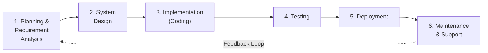

| Phase | Key Activities | Key Output | Key Stakeholders |
|---|---|---|---|
| **1. Planning & Requirement Analysis** | Gather business requirements, feasibility study, project planning | SRS (Software Requirements Specification), Project Plan | BA, PM, Client, Product Owner |
| **2. System Design** | High-level design (HLD), low-level design (LLD), database design, architecture | Design Document, ER Diagrams, UI Mockups | Architect, Tech Lead, Senior Developers |
| **3. Implementation (Coding)** | Write code, unit testing, code reviews, build management | Source Code, Build Artifacts, Unit Test Results | Developers, Tech Lead |
| **4. Testing** | Integration testing, system testing, UAT, performance testing | Test Reports, Defect Reports, Test Summary | QA Team, Business Users |
| **5. Deployment** | Deploy to production, user training, release documentation | Production System, Release Notes, User Manual | DevOps, Operations, Support Team |
| **6. Maintenance & Support** | Bug fixes, enhancements, patches, monitoring | Patches, Enhancement Releases | Support Team, Development Team |

### Role of Testing in SDLC

Testing's role varies significantly across SDLC models:

| SDLC Model | When Testing Starts | Testing Approach | QA Involvement |
|---|---|---|---|
| **Waterfall** | After development is complete | Sequential, at the end | Late involvement |
| **V-Model** | Test planning starts with requirements | Parallel with development phases | Early planning, late execution |
| **Agile** | From Sprint 1 | Continuous, every sprint | Embedded in the team from Day 1 |
| **Spiral** | During each iteration's evaluation phase | Iterative, risk-driven | Each spiral includes testing |
| **DevOps** | Automated in CI/CD pipeline | Continuous, automated | Fully integrated into the pipeline |

> [!TIP]
> **As a tester, understanding SDLC models is crucial** because the model determines when you get involved, how much time you have for testing, what documentation is expected, and how you interact with developers. The same project can have vastly different testing experiences under Waterfall vs. Agile.

---

## 4.2 Waterfall Model

### Detailed Definition and History

The **Waterfall Model** is the oldest and most straightforward SDLC model. Introduced by **Dr. Winston W. Royce** in his 1970 paper "Managing the Development of Large Software Systems," the Waterfall Model follows a **linear, sequential approach** where each phase must be completed before the next phase begins, and there is no going back to a previous phase once it is finished.

The name "Waterfall" comes from the visual representation of the model — phases cascade downward like a waterfall, with output from one phase becoming the input for the next.

> [!NOTE]
> Interestingly, Royce's original paper actually **criticized** the pure sequential model and recommended iterative approaches. However, the simplified version of his model became widely adopted as the "Waterfall" model.

**Key Characteristics:**
- **Sequential**: Each phase follows the previous one in strict order
- **Document-driven**: Extensive documentation is produced at each phase
- **No overlap**: Phases do not overlap; one must complete before the next begins
- **No going back**: Once a phase is completed, revisiting it is difficult and expensive
- **Big-bang delivery**: The complete product is delivered at the end

### Phase-by-Phase Workflow

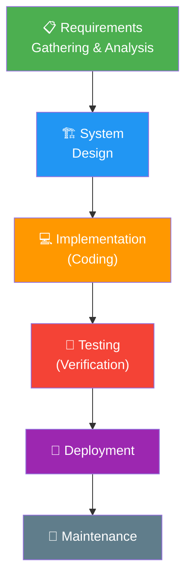

| Phase | Duration (Typical) | Activities | Output |
|---|---|---|---|
| **Requirements** | 2-4 weeks | Gather all requirements upfront; create SRS | SRS Document (signed off) |
| **System Design** | 3-6 weeks | Create HLD and LLD; database design; UI design | Design Documents, ER Diagrams |
| **Implementation** | 8-16 weeks | Code development; unit testing; code review | Source Code, Build |
| **Testing** | 4-8 weeks | System testing, integration testing, UAT | Test Reports, Defect Reports |
| **Deployment** | 1-2 weeks | Deploy to production; user training | Live System |
| **Maintenance** | Ongoing | Bug fixes, minor enhancements | Patches, Updates |

### When to Use Waterfall

- ✅ Requirements are **well-defined, stable, and unlikely to change**
- ✅ Project is **small to medium-sized** with a clear scope
- ✅ Technology is **well-understood** and mature
- ✅ **Regulatory/compliance requirements** demand extensive documentation (government, defense, healthcare)
- ✅ Customer is **not available** for frequent feedback during development
- ✅ Project has a **fixed budget and timeline** with no flexibility
- ✅ Team has **extensive experience** with similar projects

### Advantages and Disadvantages

| Advantages | Disadvantages |
|---|---|
| **Simple and easy to understand** — linear flow makes it intuitive | **No working software until late** — customer sees the product only at the end |
| **Well-documented** — extensive documentation at each phase | **High risk and uncertainty** — errors found late are very expensive to fix |
| **Clear milestones** — easy to track progress phase by phase | **Not suitable for changing requirements** — going back is costly and disruptive |
| **Easy to manage** — each phase has clear deliverables and sign-offs | **Long delivery time** — the full cycle can take months or years |
| **Works well for small projects** with stable requirements | **Customer feedback is delayed** — misunderstandings surface only during testing |
| **Discipline and structure** — enforces thorough planning and design | **Testing happens too late** — defects are found after significant development investment |
| **Good for regulatory compliance** — documentation satisfies audit requirements | **No parallel development and testing** — phases are strictly sequential |
| **Predictable budget and timeline** — scope is fixed upfront | **Integration issues** — discovered late when components come together for the first time |

### Role of Testing in Waterfall

In Waterfall, testing is a **distinct, late-stage phase** that occurs after all coding is complete:

```
Requirements → Design → Coding → ██████ TESTING ██████ → Deployment
                                  (All testing happens here)
```

**Implications for testers:**

| Aspect | Impact |
|---|---|
| **QA Involvement** | QA team is idle during requirements, design, and coding phases |
| **Time Pressure** | Testing is often squeezed if coding overruns (which it frequently does) |
| **Defect Cost** | Defects found during testing are expensive — code is already written |
| **Requirements Issues** | Requirement ambiguities are discovered during testing — too late for easy fix |
| **Regression** | Minimal regression — there's typically only one release |
| **Test Planning** | Can plan extensively since requirements are frozen |
| **Automation** | Limited value — test suite may only run once or twice |

### Real-World Example: Government Contract Project

**Scenario:** A state government awards a contract to build a new **Driver's License Management System (DLMS)** that will be used by all DMV offices in the state.

**Why Waterfall was chosen:**
1. Government contracts require fixed-price bids — scope must be frozen upfront
2. Regulatory requirements demand extensive documentation for audit trail
3. Multiple stakeholders (legal, IT, DMV operations) must sign off on requirements before work begins
4. The system replaces a 20-year-old legacy system with well-understood functionality
5. Contract mandates specific deliverables at each phase with formal reviews

**How it played out:**

| Phase | Duration | What Happened |
|---|---|---|
| Requirements | 3 months | 450-page SRS document created; 6 formal review meetings with DMV officials, legal team, and IT |
| Design | 2 months | Architecture designed for 500 DMV offices; database schema for 15 million driver records |
| Coding | 8 months | Team of 25 developers built the system |
| Testing | 3 months | Team of 10 testers executed 2,500 test cases; found 340 defects |
| Deployment | 2 months | Phased rollout to 500 DMV offices (50 per week); 3 weeks of on-site training |
| **Total** | **18 months** | System delivered on time and within budget |

**Challenges encountered:**
- During testing, 15 requirement ambiguities were discovered — required formal change requests (2-week approval process each)
- Integration with the federal REAL ID database had unexpected API changes — required 3 weeks of rework
- A UI requirement change was requested by the DMV director during testing — was deferred to Phase 2 (post-launch enhancement)

### When NOT to Use Waterfall

- ❌ Requirements are **unclear, evolving, or likely to change**
- ❌ Project requires **frequent customer feedback** and iterations
- ❌ Project is **large and complex** with many unknowns
- ❌ **Time-to-market** is critical (need to deliver quickly)
- ❌ Technology is **new or experimental** and the team is learning
- ❌ **User experience** is critical and needs iterative refinement

---

## 4.3 V-Model (Verification & Validation Model)

### Detailed Definition

The **V-Model (Verification and Validation Model)** is an extension of the Waterfall Model that emphasizes the relationship between each development phase and its corresponding testing phase. The model is represented as a "V" shape, where the left side represents **Verification** (development activities — "are we building the product right?") and the right side represents **Validation** (testing activities — "are we building the right product?").

The key innovation of the V-Model is that **test planning and test design begin in parallel with the corresponding development phase**, not after all development is complete. This means that while requirements are being written, acceptance test plans are being prepared. While system design is happening, system test cases are being written.

### Left Side (Verification) vs Right Side (Validation)

| Left Side (Verification / Development) | → | Right Side (Validation / Testing) |
|---|---|---|
| **Business Requirements Analysis** | maps to | **User Acceptance Testing (UAT)** |
| **System Requirements / Specification** | maps to | **System Testing** |
| **High-Level Design (Architecture)** | maps to | **Integration Testing** |
| **Low-Level Design (Detailed/Module)** | maps to | **Unit Testing** |
| ↓ **Implementation (Coding)** ↓ | | |

**How the mapping works:**

| Development Phase | Testing Phase | Relationship |
|---|---|---|
| **Business Requirements** | **UAT** | Business requirements are validated by having end-users verify the system meets their business needs |
| **System Requirements** | **System Testing** | System specifications are validated by testing the complete integrated system against the SRS |
| **Architecture Design** | **Integration Testing** | Architecture decisions are validated by testing the interactions between integrated modules |
| **Module Design** | **Unit Testing** | Detailed module designs are validated by testing individual units/components in isolation |

### V-Model Diagram

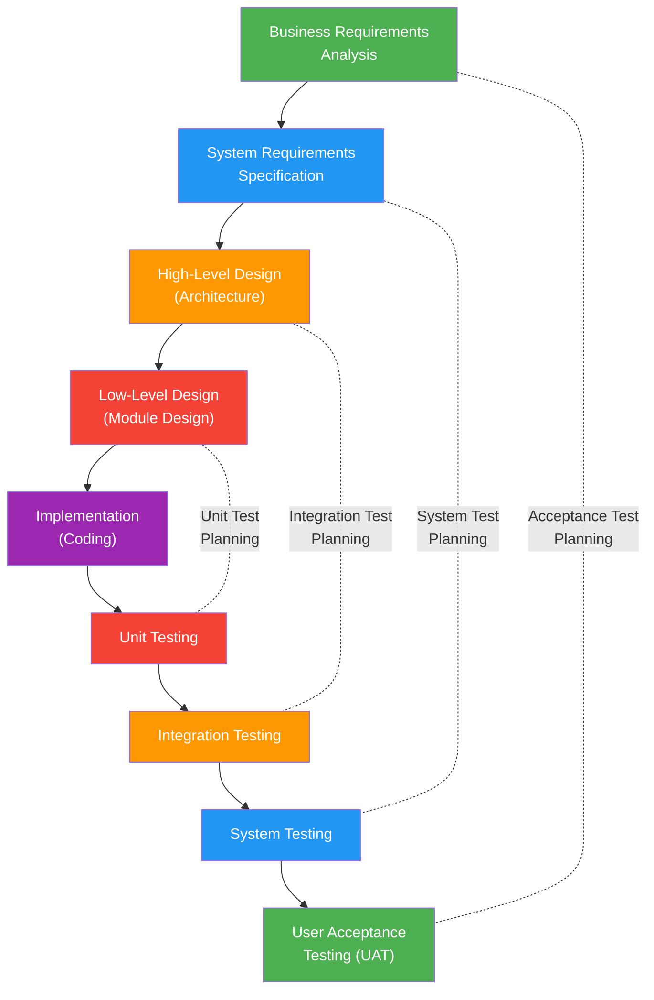

**Reading the V-Model:**
- The **left arm** goes downward: Requirements → Design → Code
- The **bottom** is Implementation (Coding)
- The **right arm** goes upward: Unit Testing → Integration Testing → System Testing → UAT
- **Horizontal dotted lines** show the correspondence between development and testing phases

### Advantages and Disadvantages

| Advantages | Disadvantages |
|---|---|
| **Early test planning** — testing is planned during corresponding dev phase | **Still rigid and sequential** — difficult to accommodate changes |
| **Clear traceability** — each test level maps to a development phase | **No working software until late** — same as Waterfall |
| **Higher quality** — defects are found earlier through early test planning | **Not suitable for changing requirements** — iterating is expensive |
| **Well-defined testing levels** — clear responsibilities at each level | **Expensive for small projects** — overhead of parallel planning |
| **Better than pure Waterfall** for testing | **Assumes requirements can be frozen** — unrealistic for many projects |
| **Good documentation** — test plans created alongside development docs | **No prototyping** — customer sees the product only during UAT |
| **Good for safety-critical systems** where thorough verification is required | **Risk of requirements misunderstanding** persists until UAT |

### When to Use

- ✅ Requirements are **clear, well-defined, and stable**
- ✅ Project is for a **safety-critical or mission-critical system** (medical devices, avionics, automotive)
- ✅ **High quality assurance** is mandatory (regulatory compliance)
- ✅ Project has **sufficient time and budget** for thorough testing at every level
- ✅ The technology and domain are **well-understood**
- ✅ **Traceability** from requirements to test cases is required

### Real-World Example: Medical Device Software

**Scenario:** A medical device company is developing software for an **Insulin Pump Controller** — a Class III medical device regulated by the FDA under 21 CFR Part 820 (Quality System Regulation) and IEC 62304 (Medical Device Software Lifecycle).

**Why V-Model was chosen:**
1. FDA requires documented evidence of verification and validation at every level
2. Patient safety demands rigorous testing with clear traceability
3. Requirements are well-defined based on clinical studies and regulatory standards
4. Any software defect could cause incorrect insulin dosing — potentially fatal
5. IEC 62304 specifically recommends a V-Model lifecycle approach

**How V-Model was applied:**

| Left Side (Verification) | Activity | Right Side (Validation) | Activity |
|---|---|---|---|
| **User Needs** | "Patient shall receive correct insulin dose based on blood glucose level" | **Clinical Validation** | Clinical trial with 200 patients; compare pump output to manual dosing |
| **System Requirements** | "System shall calculate dose using formula X with ±2% accuracy" | **System Testing** | 500 test cases covering all dosing scenarios, error conditions, alarm states |
| **Architecture Design** | "Dual-processor redundancy for dose calculation verification" | **Integration Testing** | Test communication between primary processor, verification processor, and pump mechanism |
| **Module Design** | "Dose calculation module with input range 20-600 mg/dL" | **Unit Testing** | 150 unit tests for dose calculation module; boundary values at 20, 21, 599, 600 |

**Documentation produced (as required by FDA):**
- Software Requirements Specification (SRS): 300 pages
- Software Design Document (SDD): 450 pages
- Unit Test Protocol and Report: 200 pages
- Integration Test Protocol and Report: 150 pages
- System Test Protocol and Report: 350 pages
- Validation Protocol and Report: 250 pages
- Traceability Matrix: Complete mapping from user needs → requirements → design → code → tests

---

## 4.4 Agile Model

### Detailed Definition and History

The **Agile Model** is an iterative and incremental approach to software development that emphasizes flexibility, collaboration, customer feedback, and rapid delivery of working software. Unlike Waterfall and V-Model, Agile doesn't attempt to define all requirements upfront or deliver the complete product at the end. Instead, it delivers software in small, functional increments called **iterations** or **sprints** (typically 1-4 weeks).

**History:**
- **1990s**: Frustration with heavy, document-driven methodologies (Waterfall) grew as software projects increasingly failed
- **2001**: 17 software practitioners met in Snowbird, Utah, and created the **Agile Manifesto**
- **2001-present**: Agile became the dominant software development methodology, with Scrum emerging as the most popular Agile framework

### Agile Manifesto

#### The 4 Core Values

The Agile Manifesto states:

> "We are uncovering better ways of developing software by doing it and helping others do it. Through this work we have come to value:"

| Value | Left Side (MORE valued) | Right Side (Still valued, but LESS) |
|---|---|---|
| **Value 1** | **Individuals and interactions** | over Processes and tools |
| **Value 2** | **Working software** | over Comprehensive documentation |
| **Value 3** | **Customer collaboration** | over Contract negotiation |
| **Value 4** | **Responding to change** | over Following a plan |

> [!WARNING]
> A common misunderstanding is that Agile means "no documentation" or "no planning." The manifesto says these things on the right side **still have value** — they are just valued LESS than the items on the left. Good Agile teams maintain appropriate documentation and plans; they just don't make them the primary measure of progress.

#### The 12 Principles

| # | Principle | Implication for Testing |
|---|---|---|
| 1 | Our highest priority is to satisfy the customer through early and continuous delivery of valuable software | Test early, test continuously — don't delay testing |
| 2 | Welcome changing requirements, even late in development | Test cases must be flexible; maintain living test suites |
| 3 | Deliver working software frequently (weeks rather than months) | Testing must fit within sprint cadence; automation is essential |
| 4 | Business people and developers must work together daily | QA should attend daily standups and collaborate closely with both groups |
| 5 | Build projects around motivated individuals; give them the environment and support they need | Trust QA professionals to make testing decisions |
| 6 | The most efficient method of conveying information is face-to-face conversation | Prefer verbal communication with documentation as backup |
| 7 | Working software is the primary measure of progress | Test results (not test plans) demonstrate progress |
| 8 | Agile processes promote sustainable development | Avoid testing "death marches" at sprint end |
| 9 | Continuous attention to technical excellence and good design enhances agility | Invest in test automation, clean test code, and good architecture |
| 10 | Simplicity — the art of maximizing the amount of work not done — is essential | Don't over-test; focus on high-value test cases |
| 11 | The best architectures, requirements, and designs emerge from self-organizing teams | QA should proactively identify testing needs, not wait for assignments |
| 12 | At regular intervals, the team reflects on how to become more effective | QA participates in retrospectives; improve testing process continuously |

### Scrum Framework

**Scrum** is the most widely used Agile framework. It defines specific roles, ceremonies (events), and artifacts.

#### Scrum Roles

| Role | Responsibilities | Who Fulfills This |
|---|---|---|
| **Product Owner (PO)** | Owns the Product Backlog; prioritizes features; represents the customer; defines acceptance criteria; makes business decisions | Business Analyst, Product Manager, or Client representative |
| **Scrum Master** | Facilitates Scrum ceremonies; removes impediments; coaches the team on Agile practices; protects the team from external interference | Experienced Agile practitioner (not a manager!) |
| **Development Team** | Cross-functional team that designs, develops, tests, and delivers the increment; self-organizing; typically 5-9 members | Developers, QA Engineers, Designers, DevOps Engineers |

> [!NOTE]
> In Scrum, **QA engineers are part of the Development Team**, not a separate group. There is no "QA phase" — testing happens throughout the sprint. Every team member is collectively responsible for quality.

#### Scrum Ceremonies (Events)

| Ceremony | Duration | Frequency | Purpose | QA Participation |
|---|---|---|---|---|
| **Sprint Planning** | 2-4 hours | Start of each sprint | Select user stories for the sprint; define sprint goal; break stories into tasks | QA reviews stories, identifies test scenarios, estimates testing effort, defines "Definition of Done" |
| **Daily Standup** | 15 minutes | Every day | Team members share: What did I do yesterday? What will I do today? Any blockers? | QA shares testing progress, reports defects found, raises blockers |
| **Sprint Review** | 1-2 hours | End of each sprint | Demo the completed increment to stakeholders; gather feedback | QA demonstrates test results; highlights quality metrics |
| **Sprint Retrospective** | 1-1.5 hours | End of each sprint | Reflect on the sprint: What went well? What can be improved? | QA shares testing insights; suggests process improvements |
| **Backlog Refinement** | 1-2 hours | Mid-sprint (ongoing) | Clarify upcoming stories; add acceptance criteria; estimate effort | QA asks clarifying questions; identifies testability issues; suggests acceptance criteria |

#### Scrum Artifacts

| Artifact | Description | Owner | QA Relevance |
|---|---|---|---|
| **Product Backlog** | Ordered list of all features, enhancements, and fixes needed in the product | Product Owner | QA reviews upcoming stories; identifies testing needs |
| **Sprint Backlog** | Selected subset of Product Backlog items for the current sprint + plan to deliver them | Development Team | Includes testing tasks; QA picks up testing items |
| **Increment** | The sum of all Product Backlog items completed during the sprint + all previous sprints; must be in a "Done" state | Development Team | "Done" means tested and verified; QA confirms quality |

#### Sprint Lifecycle

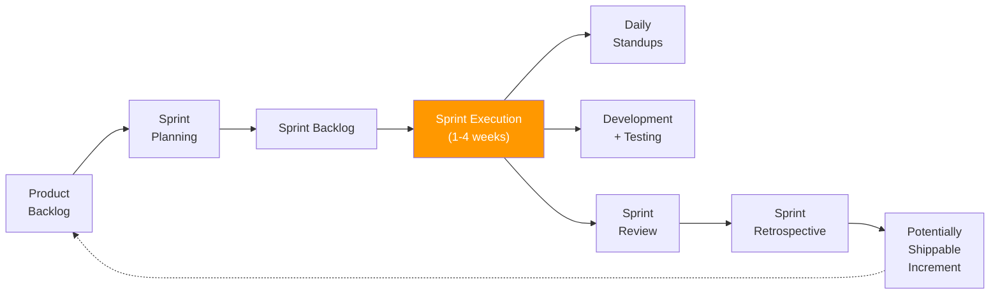

**A typical 2-week sprint timeline for a QA engineer:**

```
Day 1:  Sprint Planning — review stories, identify test cases, estimate effort
Day 2:  Write test cases for Sprint stories; review acceptance criteria
Day 3:  Dev starts delivering features; begin testing completed stories
Day 4-5: Test completed stories; log defects; work with devs on fixes
Day 6-7: Continue testing; automation scripts for completed features
Day 8-9: Regression testing; test remaining stories; retest fixed defects
Day 10: Final regression; Sprint Review demo; Sprint Retrospective
```

### Kanban Basics

**Kanban** is another popular Agile methodology that focuses on **continuous flow** rather than time-boxed sprints.

**Key differences from Scrum:**

| Aspect | Scrum | Kanban |
|---|---|---|
| **Cadence** | Fixed sprints (1-4 weeks) | Continuous flow |
| **Roles** | PO, Scrum Master, Dev Team | No prescribed roles |
| **Work Limits** | Sprint capacity (story points) | WIP (Work In Progress) limits per column |
| **Board** | Reset every sprint | Continuous; items flow through |
| **Changes** | Not allowed mid-sprint | Can add items anytime (if WIP allows) |
| **Meetings** | Prescribed ceremonies | No mandatory meetings (but standup is common) |
| **Metrics** | Velocity, burndown chart | Lead time, cycle time, throughput |

**Kanban Board Example:**

```
┌───────────┬───────────┬───────────┬───────────┬───────────┬───────────┐
│ Backlog   │ Ready     │ In Dev    │ In Test   │ In Review │ Done      │
│           │ (WIP: 5)  │ (WIP: 3)  │ (WIP: 3)  │ (WIP: 2)  │           │
├───────────┼───────────┼───────────┼───────────┼───────────┼───────────┤
│ Story-15  │ Story-10  │ Story-07  │ Story-05  │ Story-03  │ Story-01  │
│ Story-16  │ Story-11  │ Story-08  │ Story-06  │ Story-04  │ Story-02  │
│ Story-17  │ Story-12  │ Story-09  │           │           │           │
│ Story-18  │           │           │           │           │           │
│ Story-19  │           │           │           │           │           │
│ Story-20  │           │           │           │           │           │
└───────────┴───────────┴───────────┴───────────┴───────────┴───────────┘
```

### Testing in Agile (Continuous Testing, Shift-Left)

In Agile, testing is **not a phase** — it is a **continuous activity** embedded throughout the sprint.

**Agile Testing Quadrants (Brian Marick):**

```
┌─────────────────────────────────────────────────────────────────┐
│                     BUSINESS FACING                              │
│                                                                  │
│   Q2: Automated & Manual               Q3: Manual               │
│   - Functional Tests                   - Exploratory Testing     │
│   - Story Tests                        - Usability Testing       │
│   - Prototypes                         - UAT                     │
│   - Simulations                        - Alpha/Beta Testing      │
│   (Supporting the Team)                (Critiquing the Product)  │
│                                                                  │
│ ─────────── SUPPORTING ──────────── CRITIQUING ──────────────── │
│                                                                  │
│   Q1: Automated                        Q4: Automated             │
│   - Unit Tests                         - Performance Tests       │
│   - Component Tests                    - Load Tests              │
│   - Integration Tests                  - Security Tests          │
│   (Supporting the Team)                (Critiquing the Product)  │
│                                                                  │
│                     TECHNOLOGY FACING                             │
└─────────────────────────────────────────────────────────────────┘
```

**Shift-Left Testing:**

"Shift-Left" means moving testing activities **earlier** in the development process:

```
Traditional:    Requirements → Design → Coding → ████████ TESTING ████████
Shift-Left:     ████ TESTING ████████████████████████████████████████████████
                 ↑ Start testing here (requirements phase)
```

**Shift-Left activities for QA:**
- Review user stories and acceptance criteria during backlog refinement
- Write test cases during sprint planning (before coding starts)
- Participate in design reviews to identify testability issues
- Define "Definition of Done" (DoD) that includes testing criteria
- Collaborate with developers on unit test strategy

### Advantages and Disadvantages

| Advantages | Disadvantages |
|---|---|
| **Rapid delivery** — working software delivered every 1-4 weeks | **Requires experienced team** — self-organizing requires maturity |
| **Customer collaboration** — frequent feedback prevents misunderstandings | **Less predictable** — scope and timeline can be fluid |
| **Embrace change** — welcome changing requirements | **Documentation may suffer** — "working software over documentation" can be taken too far |
| **Continuous improvement** — retrospectives drive process improvement | **Not suitable for fixed-price contracts** — scope is intentionally flexible |
| **Reduced risk** — frequent deliveries reduce integration and deployment risk | **Requires customer availability** — PO must be accessible regularly |
| **Team empowerment** — self-organizing teams are more productive and engaged | **Scaling challenges** — difficult for very large teams (>10 people) without frameworks like SAFe |
| **Early defect detection** — continuous testing finds issues quickly | **Can lose sight of big picture** — focus on sprints may miss architectural concerns |
| **Higher quality** — Definition of Done enforces quality standards | **Scope creep risk** — welcoming change can lead to never-ending projects |

### When to Use

- ✅ Requirements are **evolving or unclear** at the start
- ✅ **Time-to-market** is critical — need to deliver value quickly
- ✅ **Customer/stakeholder** is available for regular feedback
- ✅ Project is **medium to large** and can benefit from incremental delivery
- ✅ Team is **experienced and collaborative** (or willing to learn)
- ✅ The product requires **iterative refinement** (UX-heavy, new market, startup)

### Real-World Example: SaaS Product Development

**Scenario:** A startup is building "TeamSync," a project management SaaS tool competing with Jira, Asana, and Monday.com. The team uses Scrum with 2-week sprints.

**Team:** 1 Product Owner, 1 Scrum Master, 3 Backend Developers, 2 Frontend Developers, 2 QA Engineers, 1 UX Designer

**Sprint 5 Example (Weeks 9-10):**

**Sprint Goal:** "Users can create and manage project boards with drag-and-drop task cards"

| User Story | Story Points | QA Activities |
|---|---|---|
| "As a user, I can create a new project board" | 3 | 5 test cases (positive, negative, boundary); automation for happy path |
| "As a user, I can add task cards to a board column" | 5 | 8 test cases; test data for various card types |
| "As a user, I can drag and drop cards between columns" | 8 | 12 test cases; cross-browser testing; mobile touch testing |
| "As a user, I can invite team members to a board" | 3 | 6 test cases; email notification testing; permission testing |

**QA Engineer's daily activities during Sprint 5:**

| Day | Activities |
|---|---|
| Day 1 | Sprint Planning: Review stories, ask clarifying questions, identify test scenarios |
| Day 2 | Write test cases for "Create board" and "Add task cards" (dev starts coding) |
| Day 3 | Test "Create board" (delivered by dev); start writing test cases for "Drag-and-drop" |
| Day 4 | Test "Add task cards"; log 2 defects; write automation for "Create board" |
| Day 5 | Retest fixed defects; test "Drag-and-drop" on Chrome |
| Day 6 | Cross-browser testing for "Drag-and-drop" (Firefox, Safari, Edge); log 3 defects |
| Day 7 | Test "Invite members"; retest fixed drag-and-drop defects |
| Day 8 | Regression testing on previous sprint features; automation for "Add task cards" |
| Day 9 | Final regression; fix 1 automation script; prepare demo evidence |
| Day 10 | Sprint Review (demo quality metrics); Sprint Retrospective; refine next sprint's stories |

**Sprint 5 Results:**
- 4 stories completed (19 story points)
- 31 test cases executed, 28 passed, 3 failed (fixed and retested)
- 5 defects found, all fixed within the sprint
- Automation coverage increased from 40% to 48%

---

## 4.5 Spiral Model

### Detailed Definition

The **Spiral Model** was proposed by **Barry Boehm** in 1986 and is a **risk-driven** process model that combines elements of both iterative development and the systematic aspects of the Waterfall Model. The model is represented as a spiral with multiple loops — each loop represents a phase of development, and each phase involves the same set of activities.

The key innovation of the Spiral Model is its emphasis on **risk analysis**. Before significant investment is made in development, risks are identified and mitigated. If a risk cannot be mitigated, the project can be terminated early, saving resources.

### Four Quadrants

Each spiral (iteration) passes through four quadrants:

| Quadrant | Activities | Output |
|---|---|---|
| **1. Planning** | Determine objectives, alternatives, and constraints for the iteration | Objectives document, constraints, alternatives |
| **2. Risk Analysis** | Identify and evaluate risks; analyze alternatives; develop risk mitigation strategies; build prototypes to address risks | Risk assessment, prototypes, mitigation plans |
| **3. Engineering** | Develop and verify the product (design, code, test) | Working software increment |
| **4. Evaluation** | Customer evaluates the results; plans the next iteration based on feedback | Customer feedback, plan for next spiral |

### Spiral Model Diagram

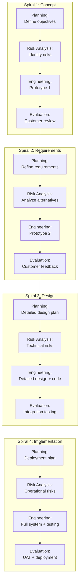

### Advantages and Disadvantages

| Advantages | Disadvantages |
|---|---|
| **Risk management** — systematic risk identification and mitigation at every iteration | **Complex** — difficult to manage and requires significant expertise |
| **Flexibility** — can accommodate changes between spirals | **Expensive** — risk analysis and prototyping add significant cost |
| **Customer feedback** — evaluation at the end of each spiral | **Not suitable for small projects** — overhead is disproportionate |
| **Early identification of problems** — prototypes expose issues early | **Requires risk assessment expertise** — not every team has this skill |
| **Incremental delivery** — working software produced at each spiral | **Time-consuming** — each spiral involves planning, risk analysis, engineering, evaluation |
| **Strong documentation** — each spiral produces artifacts | **Difficult to determine completion** — spirals can continue indefinitely |
| **Good for large, high-risk projects** — manages uncertainty effectively | **Process-heavy** — significant overhead in process documentation |

### When to Use

- ✅ Project is **large, complex, and high-risk** (budget > $1M; timeline > 1 year)
- ✅ **Requirements are not well-understood** and will evolve
- ✅ **Prototyping is important** — need to validate concepts before full development
- ✅ **Risk management** is a top priority (mission-critical, safety-critical)
- ✅ Customer wants to **evaluate the product** at multiple stages
- ✅ Organization has **expertise in risk analysis**

### Real-World Example: Aerospace Software

**Scenario:** A defense contractor is developing a **Next-Generation Air Traffic Control System** for the FAA. The system will manage air traffic for 500+ airports and must handle 10,000+ simultaneous flights with zero downtime.

**Why Spiral was chosen:**
1. Extremely high risk — system failure could cause loss of life
2. Requirements evolve based on FAA regulatory changes and new flight technologies (drones, Urban Air Mobility)
3. Budget is $200M+ over 5 years — risk management is essential
4. Multiple unknowns in technology (new radar systems, AI-based conflict detection)
5. Prototyping is needed to validate concepts before committing to full development

**Spirals executed:**

| Spiral | Duration | Focus | Risk Addressed | Prototype |
|---|---|---|---|---|
| **Spiral 1** | 6 months | Concept validation | Can AI accurately predict flight conflicts? | AI conflict detection prototype tested with simulated traffic data |
| **Spiral 2** | 6 months | Requirements refinement | Can system handle 10,000 simultaneous flights? | Performance prototype; load testing with synthetic flight data |
| **Spiral 3** | 9 months | Architecture validation | Can legacy radar systems integrate with new platform? | Integration prototype with 3 radar systems |
| **Spiral 4** | 12 months | Core system development | Full-scale system reliability under extreme conditions | Working system tested with simulated airport operations |
| **Spiral 5** | 12 months | Deployment preparation | Transition from legacy system without downtime | Parallel operation at 5 pilot airports |

**Testing at each spiral:**
- Spiral 1: Algorithm accuracy testing (10,000 simulated scenarios)
- Spiral 2: Performance testing (10,000 concurrent flights × 100 simulations)
- Spiral 3: Integration testing with real radar hardware
- Spiral 4: System testing, stress testing, failover testing, security testing
- Spiral 5: User acceptance testing, operational readiness testing, certification testing

---

## 4.6 Iterative Model

### Definition and Workflow

The **Iterative Model** is an approach where the software is developed through repeated cycles (iterations). In each iteration, a portion of the software is designed, developed, tested, and reviewed. Feedback from each iteration is used to refine the next iteration.

Unlike Waterfall, which aims to get everything right in a single pass, the Iterative Model acknowledges that understanding improves with each iteration, and the product evolves through refinement.

```mermaid
flowchart LR
    subgraph Iteration1["Iteration 1"]
        A1["Plan"] --> A2["Design"] --> A3["Build"] --> A4["Test"] --> A5["Review"]
    end

    subgraph Iteration2["Iteration 2"]
        B1["Plan"] --> B2["Design"] --> B3["Build"] --> B4["Test"] --> B5["Review"]
    end

    subgraph Iteration3["Iteration 3"]
        C1["Plan"] --> C2["Design"] --> C3["Build"] --> C4["Test"] --> C5["Review"]
    end

    A5 -->|"Feedback"| B1
    B5 -->|"Feedback"| C1
    C5 -->|"Release"| D["Final Product"]
```

### How It Differs from Waterfall

| Aspect | Waterfall | Iterative |
|---|---|---|
| **Approach** | Single pass through all phases | Multiple passes with refinement |
| **Requirements** | Must be complete upfront | Can evolve with each iteration |
| **Delivery** | Complete product at the end | Refined product after each iteration |
| **Feedback** | Only at the end (during testing/UAT) | After each iteration |
| **Risk** | High — late discovery of issues | Lower — issues found early in iterations |
| **Changes** | Expensive and disruptive | Expected and incorporated naturally |
| **Testing** | Single testing phase at the end | Testing in every iteration |

### Advantages and Disadvantages

| Advantages | Disadvantages |
|---|---|
| **Early working version** — partial product available after first iteration | **More resources needed** — repeated phases require more effort |
| **Reduced risk** — issues found early through iterative feedback | **Scope management** — iterations can lead to scope creep |
| **Flexible** — can accommodate changing requirements | **Architecture may suffer** — early iterations may not consider long-term design |
| **Better understanding** — each iteration improves team's understanding | **Difficult to estimate** — total cost and timeline are harder to predict |
| **Easier testing** — test smaller chunks, more manageable scope | **May require rework** — earlier iterations may need significant revision |
| **Customer satisfaction** — regular demos and feedback opportunities | **Not for small, simple projects** — overhead is unnecessary |

### When to Use

- ✅ Requirements are **partially known** and expected to evolve
- ✅ Project involves **new or unfamiliar technology** (learning curve)
- ✅ Core functionality must be delivered **quickly** with refinement later
- ✅ Organization wants **early feedback** from users before full investment

### Real-World Example

**Scenario:** A healthcare company is building a **Patient Portal** that allows patients to view medical records, book appointments, and communicate with doctors.

**Iteration 1 (4 weeks):** Basic patient registration and login → Test, get feedback → Users want social login (Google/Apple)

**Iteration 2 (4 weeks):** Social login + view medical records (basic) → Test, get feedback → Users want records filterable by date and type

**Iteration 3 (4 weeks):** Enhanced records with filters + appointment booking → Test, get feedback → Users want video consultation option

**Iteration 4 (4 weeks):** Video consultation + messaging + final polish → Final testing and deployment

Each iteration refined the product based on real user feedback, something that would have been impossible with a single-pass Waterfall approach.

---

## 4.7 Incremental Model

### Definition and Workflow

The **Incremental Model** divides the system into multiple independent modules (increments), each of which is designed, developed, tested, and delivered separately. Each increment adds new functionality to the existing system.

The key idea is **partial implementation**: instead of delivering the entire system at once, you deliver it in chunks, with each chunk being a fully functional piece of the system.

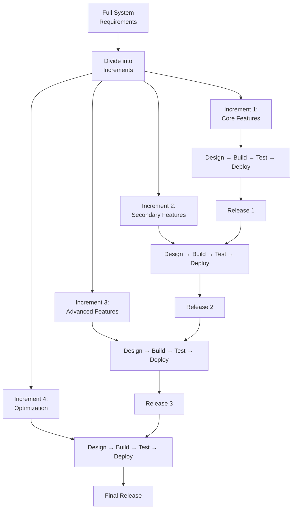

### Difference Between Iterative and Incremental

This is a commonly confused topic — here's a clear distinction:

| Aspect | Iterative | Incremental |
|---|---|---|
| **Philosophy** | Build the whole system roughly, then refine | Build the system piece by piece, each piece complete |
| **Each cycle produces** | A refined version of the entire system | A new functional piece added to the existing system |
| **Analogy** | Painting: Sketch the whole painting, then add details layer by layer | Building a house: Build foundation, then walls, then roof, then interior |
| **Starting point** | Entire system (rough version) | One module/feature (complete version) |
| **Rework** | Previous iterations are reworked/refined | Previous increments are stable; new ones are added |
| **Feedback focus** | "How can we improve what we built?" | "What should we build next?" |
| **Requirements** | May be unclear; refined through iterations | Must be well-defined enough to divide into increments |

**Visual comparison:**

```
ITERATIVE:
  Iteration 1: [Rough Full System] ──────────────────
  Iteration 2: [Improved Full System] ───────────────
  Iteration 3: [Polished Full System] ───────────────
  Iteration 4: [Final Full System] ──────────────────

INCREMENTAL:
  Increment 1: [Module A ✅] ─────────────────────────
  Increment 2: [Module A ✅] [Module B ✅] ───────────
  Increment 3: [Module A ✅] [Module B ✅] [Module C ✅]
  Increment 4: [A ✅] [B ✅] [C ✅] [Module D ✅] ────
```

### Advantages and Disadvantages

| Advantages | Disadvantages |
|---|---|
| **Partial delivery** — users get usable software early | **Requires clear requirement division** — must know how to divide into modules |
| **Easier testing** — test one increment at a time | **Integration challenges** — combining increments can cause issues |
| **Reduced risk** — each increment is manageable in scope | **Total cost may be higher** — repeated integration and testing overhead |
| **Flexibility** — later increments can be adjusted based on feedback from earlier ones | **Architecture must be robust** — needs to support future increments |
| **Revenue generation** — earlier increments can be deployed and generate revenue | **Dependency management** — increments may depend on each other |
| **Parallel development** — different teams can work on different increments | **Customer may see incomplete product** — can affect perception |

### When to Use

- ✅ Requirements are **clear enough to divide** into independent modules
- ✅ Core functionality needs to be delivered **quickly** while additional features follow
- ✅ The project is **large** and can benefit from phased delivery
- ✅ **Multiple teams** can work on different increments in parallel
- ✅ There is a need for **early market entry** with a basic product

### Real-World Example

**Scenario:** An e-commerce company building "ShopEase" divides the platform into increments:

| Increment | Features | Timeline | Deployment |
|---|---|---|---|
| **Increment 1** | Product catalog browsing, user registration, basic search | Weeks 1-6 | Deployed — users can browse and register |
| **Increment 2** | Shopping cart, wishlist, advanced search with filters | Weeks 7-10 | Deployed — users can add to cart |
| **Increment 3** | Checkout, payment integration (Stripe), order confirmation | Weeks 11-16 | Deployed — full purchase flow available |
| **Increment 4** | Order tracking, email notifications, ratings/reviews | Weeks 17-20 | Deployed — complete e-commerce experience |
| **Increment 5** | Recommendation engine, loyalty program, analytics dashboard | Weeks 21-26 | Deployed — enhanced features |

ShopEase started generating revenue after Increment 3 (Week 16) — 10 weeks earlier than if they had waited for the complete system using Waterfall.

---

## 4.8 RAD (Rapid Application Development)

### Definition and Phases

**RAD (Rapid Application Development)** was introduced by **James Martin** in 1991. It is a software development methodology that emphasizes **rapid prototyping** and **iterative development** with minimal planning. RAD prioritizes building working prototypes quickly, getting user feedback, and refining them — rather than spending extensive time on upfront planning and documentation.

**Core principles:**
- Speed of development is paramount
- Prototyping is the primary communication tool
- User involvement is continuous
- Planning is minimal — "just enough" to get started
- Reusable components are preferred over custom code
- Formal design is secondary to hands-on experimentation

### RAD Phases

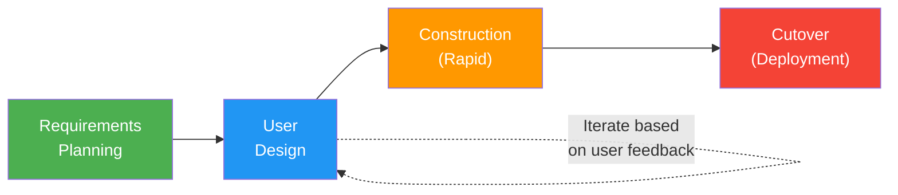

| Phase | Duration | Activities | Output |
|---|---|---|---|
| **Requirements Planning** | 1-2 weeks | High-level requirements gathering; define scope; identify constraints; form the team | High-level scope document |
| **User Design** | 2-6 weeks (iterative) | Build prototypes with user participation; users interact with prototypes and provide feedback; iterate until users are satisfied | Approved prototype/design |
| **Construction** | 4-8 weeks | Rapid development using prototypes as blueprints; code generation tools; component reuse; concurrent development and testing | Working system |
| **Cutover** | 1-2 weeks | Data conversion, testing, deployment, user training | Production system |

### Advantages and Disadvantages

| Advantages | Disadvantages |
|---|---|
| **Fastest delivery** — working software in weeks, not months | **Requires highly skilled team** — developers must be versatile and experienced |
| **High user involvement** — prototypes ensure requirements are understood | **Not for large-scale systems** — scalability is a concern |
| **Reduced risk** — early prototypes expose issues quickly | **Poor documentation** — speed over documentation can create maintenance issues |
| **Flexible** — changes are easy to incorporate | **Requires committed users** — users must be available for constant feedback |
| **Component reuse** — leverage existing libraries and frameworks | **Not suitable for high-risk systems** — speed may compromise quality for critical systems |
| **Low cost for small projects** — less overhead | **Technical debt** — rapid development often leads to shortcuts |

### When to Use

- ✅ Project has a **tight deadline** (2-3 months)
- ✅ Requirements are **general** and can be refined through prototyping
- ✅ **Users are available** for continuous involvement
- ✅ System can be **modularized** into independent components
- ✅ **Reusable components** are available (libraries, frameworks, APIs)
- ✅ Project is **small to medium** in size

### Real-World Example: Prototype-Driven Project

**Scenario:** A marketing agency needs a **Campaign Management Dashboard** for their team of 50 marketers to track, manage, and analyze marketing campaigns across multiple channels (email, social media, PPC).

**Why RAD was chosen:**
- Tight deadline: 8 weeks before the annual marketing summit
- Team of 3 experienced full-stack developers
- Users (marketers) are in the same office and available daily
- Can leverage existing charting libraries (Chart.js) and frameworks (React, Node.js)

**How it played out:**

| Phase | Duration | What Happened |
|---|---|---|
| Requirements Planning | 3 days | Met with marketing director; identified 5 core features: campaign creation, performance tracking, audience segmentation, budget management, reporting |
| User Design (Iteration 1) | 1 week | Built wireframe prototype in Figma; showed to 5 marketers; feedback: "Need drag-and-drop campaign builder" |
| User Design (Iteration 2) | 1 week | Built interactive prototype with drag-and-drop; showed to marketing team; feedback: "Add real-time metrics" |
| User Design (Iteration 3) | 3 days | Added real-time dashboard prototype; final approval from marketing director |
| Construction | 4 weeks | Built the full system using React + Node.js + PostgreSQL; daily testing by 2 beta users |
| Cutover | 1 week | Deployed to production; imported historical campaign data; 1-day training session |
| **Total** | **8 weeks** | Delivered on time for the marketing summit |

---

## 4.9 DevOps Model

### Definition and Philosophy

**DevOps** is a cultural and technical movement that bridges the gap between **Development (Dev)** and **Operations (Ops)** teams, emphasizing collaboration, automation, continuous integration, continuous delivery, and monitoring. DevOps is not just a set of tools — it's a philosophy that fundamentally changes how software is built, tested, deployed, and operated.

**Core philosophy:**
- **Break down silos**: Dev, QA, and Ops work as one team
- **Automate everything**: Build, test, deploy, and monitor automatically
- **Fail fast, recover fast**: Deploy frequently, detect issues quickly, roll back if needed
- **Continuous improvement**: Measure everything; use data to improve

> [!NOTE]
> DevOps is not an SDLC model in the traditional sense — it's more of an organizational culture and set of practices. However, it profoundly impacts the development lifecycle and is often discussed alongside SDLC models because it defines how modern software is built and delivered.

### CI/CD Pipeline Explanation

The **CI/CD (Continuous Integration / Continuous Delivery / Continuous Deployment)** pipeline is the backbone of DevOps:

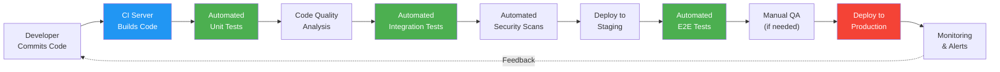

| Stage | Tool Examples | Purpose |
|---|---|---|
| **Code Commit** | Git, GitHub, GitLab, Bitbucket | Version control, collaboration |
| **Build** | Jenkins, GitHub Actions, GitLab CI, Azure Pipelines | Compile code, create artifacts |
| **Unit Tests** | JUnit, pytest, Jest, NUnit | Verify individual components |
| **Code Quality** | SonarQube, ESLint, Checkstyle | Static code analysis, code smell detection |
| **Integration Tests** | RestAssured, Postman/Newman, Karate | Verify component interactions |
| **Security Scans** | OWASP ZAP, Snyk, Trivy | Vulnerability detection |
| **Deploy to Staging** | Kubernetes, Docker, Terraform | Deploy to pre-production environment |
| **E2E Tests** | Selenium, Cypress, Playwright | End-to-end functional verification |
| **Deploy to Production** | ArgoCD, Spinnaker, AWS CodeDeploy | Production deployment |
| **Monitoring** | Datadog, New Relic, Prometheus, Grafana | Real-time health monitoring |

### DevOps Lifecycle

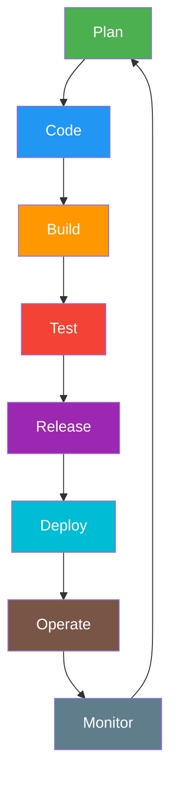

| Phase | Activities | DevOps Tools |
|---|---|---|
| **Plan** | Define features, user stories, sprint planning | JIRA, Azure Boards, Trello |
| **Code** | Develop features, code review, pair programming | VS Code, IntelliJ, GitHub |
| **Build** | Compile, create artifacts, containerize | Jenkins, Docker, Maven, npm |
| **Test** | Automated testing at all levels | Selenium, JUnit, JMeter |
| **Release** | Package for deployment, versioning | GitHub Releases, Artifactory |
| **Deploy** | Deploy to environments (staging, production) | Kubernetes, Terraform, Ansible |
| **Operate** | Manage infrastructure, handle incidents | PagerDuty, ServiceNow |
| **Monitor** | Track performance, errors, user behavior | Datadog, New Relic, ELK Stack |

### Role of Testing in DevOps

In DevOps, testing is **automated, continuous, and embedded** in the CI/CD pipeline:

**Testing pyramid in DevOps:**

```
         ┌─────────┐
         │  E2E    │  ← Few, slow, expensive (Selenium, Cypress)
         │  Tests  │
        ┌┴─────────┴┐
        │Integration │  ← Medium count, moderate speed (API tests)
        │   Tests    │
       ┌┴────────────┴┐
       │   Unit Tests  │  ← Many, fast, cheap (JUnit, Jest)
       └──────────────┘
```

| Test Level | Automated? | Run When? | Feedback Time | Who Owns |
|---|---|---|---|---|
| **Unit Tests** | Yes (100%) | Every commit | Seconds | Developers |
| **Integration Tests** | Yes (95%+) | Every build | Minutes | Developers + QA |
| **E2E Tests** | Yes (80%+) | Every deployment | 15-60 minutes | QA Engineers |
| **Performance Tests** | Yes (scheduled) | Nightly or per-release | Hours | Performance Engineers |
| **Security Scans** | Yes (automated) | Every build | Minutes | Security + DevOps |
| **Exploratory Testing** | Manual | Per release | Hours | QA Engineers |

### Continuous Testing in DevOps

**Continuous Testing** means testing at every stage of the pipeline, not just at the end:

| Pipeline Stage | Tests Executed | Goal |
|---|---|---|
| **Pre-commit** | Lint checks, pre-commit hooks | Prevent obvious errors from entering codebase |
| **Commit** | Unit tests, code coverage check | Verify individual component correctness |
| **Build** | Static analysis, dependency vulnerability scan | Catch code smells and security issues |
| **Integration** | API tests, contract tests, database tests | Verify component interactions |
| **Staging** | E2E tests, performance tests, accessibility tests | Verify full system behavior |
| **Production** | Smoke tests, canary tests, monitoring | Verify production deployment health |
| **Post-deployment** | Synthetic monitoring, real-user monitoring (RUM) | Ongoing quality assurance |

### Advantages and Disadvantages

| Advantages | Disadvantages |
|---|---|
| **Rapid delivery** — deploy multiple times per day | **Requires cultural shift** — breaking down silos is hard |
| **Automated quality** — testing is built into the pipeline | **High initial investment** — tools, training, automation setup |
| **Fast feedback** — issues detected within minutes of code commit | **Automation skill required** — team must be proficient in automation |
| **Reduced human error** — automation eliminates manual deployment mistakes | **Tool complexity** — managing a complex toolchain is challenging |
| **Continuous improvement** — monitoring data drives optimization | **Not suitable for all industries** — heavily regulated environments may struggle with velocity |
| **Better collaboration** — Dev, QA, Ops work as one team | **Security concerns** — rapid deployment can outpace security reviews |
| **Faster recovery** — automated rollbacks minimize downtime | **Requires mature automation** — poor automation creates more problems than it solves |
| **Scalable** — containerization and orchestration enable scaling | **Monitoring overhead** — too many alerts can lead to alert fatigue |

### When to Use

- ✅ Organization wants **frequent releases** (daily, weekly)
- ✅ Team has (or can develop) strong **automation skills**
- ✅ Product is a **web or cloud-based service** (SaaS, PaaS)
- ✅ **Continuous delivery** to market is a competitive advantage
- ✅ Organization is willing to invest in **cultural transformation**
- ✅ Infrastructure supports **containerization and cloud deployment**

### Real-World Example: Netflix-style Deployment

**Scenario:** "StreamFlix," a video streaming service with 10 million users, deploys code changes **50+ times per day** using DevOps practices.

**Their CI/CD pipeline:**

| Stage | Time | What Happens |
|---|---|---|
| Code Commit | 0 min | Developer pushes code to Git |
| Build + Unit Tests | 2 min | Jenkins builds; runs 15,000 unit tests |
| Code Quality Gate | 1 min | SonarQube checks; fails if coverage < 80% or critical issues found |
| Integration Tests | 5 min | 500 API tests run against mocked services |
| Deploy to Staging | 3 min | Docker container deployed to Kubernetes staging cluster |
| E2E Tests | 15 min | 200 Cypress tests verify critical user journeys |
| Performance Check | 10 min | k6 load test: verify response time < 200ms at 10,000 RPS |
| **Total Pipeline Time** | **~36 min** | From commit to production-ready |
| Canary Deployment | 30 min | Deploy to 5% of users; monitor error rates and latency |
| Full Deployment | 60 min | Roll out to remaining 95% of users |
| Post-deploy Monitoring | Ongoing | Datadog dashboards; PagerDuty alerts for anomalies |

**Testing team's role:**
- Maintain and expand the automated test suite
- Write E2E tests for new features as they're developed
- Conduct exploratory testing on staging before canary deployment
- Monitor production dashboards for quality issues post-deployment
- Analyze test flakiness and improve test reliability

---

## 4.10 Comprehensive SDLC Model Comparison

### Complete Comparison Table

| Dimension | Waterfall | V-Model | Agile (Scrum) | Spiral | Iterative | Incremental | RAD | DevOps |
|---|---|---|---|---|---|---|---|---|
| **Approach** | Sequential, linear | Sequential with testing correspondence | Iterative & incremental | Risk-driven, iterative | Iterative refinement | Modular, incremental delivery | Prototype-driven | Continuous, automated |
| **Requirements** | Fixed upfront | Fixed upfront | Evolving | Evolving with risk focus | Evolving through iterations | Known & divisible | General, refined via prototypes | Continuously refined |
| **Risk Handling** | Low — no formal risk mgmt | Low-Medium — testing correspondence helps | Medium — sprint reviews reduce risk | High — formal risk analysis every spiral | Medium — iteration feedback reduces risk | Medium — modular delivery reduces risk | Medium — prototypes validate early | High — continuous monitoring & feedback |
| **Customer Involvement** | Beginning and end only | Beginning and end | Continuous (every sprint) | Every spiral evaluation | Every iteration review | Each increment delivery | Continuous (prototyping) | Continuous (monitoring, feedback) |
| **Flexibility** | Very Low | Very Low | Very High | High | High | Medium | High | Very High |
| **Testing Approach** | Late, sequential | Parallel planning, late execution | Continuous, every sprint | Each spiral | Each iteration | Each increment | During construction | Automated, continuous |
| **Delivery** | Big-bang (end) | Big-bang (end) | Incremental (every sprint) | Incremental (each spiral) | Refined versions | Functional modules | Rapid prototype → product | Continuous deployment |
| **Timeline** | Long (months/years) | Long (months/years) | Short sprints (1-4 weeks) | Long (multiple spirals) | Medium (multiple iterations) | Medium (multiple increments) | Short (weeks) | Continuous |
| **Cost Predictability** | High (fixed scope) | High (fixed scope) | Low-Medium (scope flexible) | Medium (evolving) | Medium | Medium | Low | Low-Medium |
| **Documentation** | Extensive | Extensive | Minimal (just enough) | Moderate | Moderate | Moderate | Minimal | Automated (code-as-docs) |
| **Team Size** | Any (usually large) | Medium to large | Small (5-9 per team) | Large (expert team) | Small to medium | Medium to large | Small (3-5) | Small to medium |
| **Best For** | Stable reqs, compliance | Safety-critical, regulated | Evolving reqs, fast delivery | Large, high-risk projects | Unclear reqs, learning | Known reqs, phased delivery | Tight deadlines, prototypes | Frequent releases, SaaS |
| **Industry Examples** | Government, Defense | Medical devices, Aviation | Startups, SaaS, Tech | Aerospace, Defense | R&D, Innovation | Enterprise software | Marketing, Internal tools | Cloud services, Fintech |

---

## 4.11 How to Choose the Right SDLC Model

### Decision Framework

Choosing the right SDLC model depends on multiple factors. Use this decision framework:

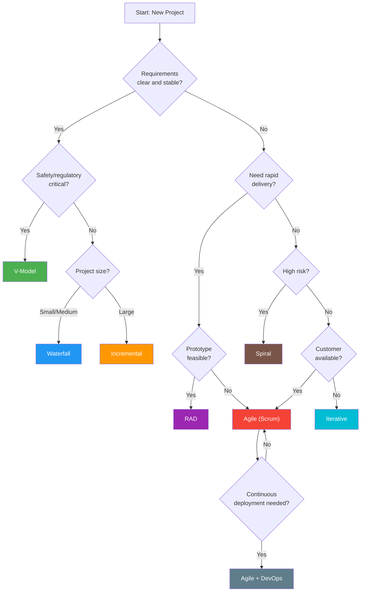

### Key Factors to Consider

| Factor | Questions to Ask | Model Implications |
|---|---|---|
| **Requirement Stability** | How likely are requirements to change? | Stable → Waterfall/V-Model; Evolving → Agile/Spiral |
| **Project Size & Complexity** | How large is the codebase? How many integrations? | Small → Waterfall/RAD; Large → Incremental/Spiral |
| **Risk Level** | What's the cost of failure? Is this safety-critical? | High risk → Spiral/V-Model; Low risk → Agile/RAD |
| **Time-to-Market** | How urgently is the product needed? | Urgent → RAD/Agile; Flexible → Waterfall/V-Model |
| **Customer Availability** | Will the customer provide regular feedback? | Available → Agile/RAD; Unavailable → Waterfall |
| **Team Experience** | Is the team experienced with Agile practices? | Experienced → Agile/DevOps; Junior → Waterfall |
| **Regulatory Requirements** | Does the industry require extensive documentation? | Regulated → Waterfall/V-Model; Unregulated → Agile |
| **Budget** | Is the budget fixed or flexible? | Fixed → Waterfall; Flexible → Agile |
| **Technology** | Is the technology proven or experimental? | Proven → Any model; Experimental → Iterative/Spiral |
| **Deployment Frequency** | How often will the product be deployed? | Frequently → DevOps; Rarely → Waterfall |

> [!TIP]
> **In practice, most modern organizations use a hybrid approach.** For example:
> - **Agile + DevOps**: Most SaaS companies use Agile for development methodology and DevOps for deployment/operations
> - **Agile + V-Model elements**: Healthcare companies use Agile sprints but maintain V-Model documentation for regulatory compliance
> - **Incremental + Agile**: Large enterprises break the project into increments and use Agile within each increment

---

## 4.12 Interview Questions

### Question 1: What is SDLC and why is it important?

**Model Answer:**

SDLC (Software Development Life Cycle) is a structured framework that defines the process for planning, creating, testing, deploying, and maintaining software. It encompasses the entire lifecycle from initial concept to retirement.

SDLC is important for several reasons:
1. **Provides structure**: Ensures systematic development rather than ad-hoc coding
2. **Reduces risk**: Checkpoints and reviews catch problems early
3. **Enables predictability**: Stakeholders can track progress and plan resources
4. **Ensures quality**: Testing and review activities are built into the process
5. **Facilitates communication**: Common framework for all stakeholders
6. **Supports compliance**: Regulated industries require documented processes
7. **Enables improvement**: Repeatable process allows measurement and optimization

The specific SDLC model chosen (Waterfall, Agile, V-Model, etc.) depends on project characteristics like requirement stability, risk level, team size, and delivery timeline.

---

### Question 2: Compare Waterfall and Agile models. When would you recommend each?

**Model Answer:**

| Aspect | Waterfall | Agile |
|---|---|---|
| **Approach** | Sequential, linear | Iterative, incremental |
| **Requirements** | Fixed upfront, all defined before development | Evolving, refined through sprints |
| **Delivery** | Complete product at the end | Working software every 1-4 weeks |
| **Customer Involvement** | Beginning and end | Continuous (every sprint) |
| **Flexibility** | Very low — changes are expensive | Very high — changes welcome |
| **Testing** | Late phase, after all coding | Continuous, every sprint |
| **Documentation** | Extensive | Minimal ("just enough") |
| **Risk** | High — late discovery of issues | Lower — frequent feedback loop |

**I would recommend Waterfall when:**
- Requirements are well-defined and unlikely to change (e.g., government contracts)
- Regulatory compliance requires extensive documentation (e.g., defense, healthcare)
- The project is small and straightforward
- The customer is not available for regular feedback

**I would recommend Agile when:**
- Requirements are evolving or unclear
- Time-to-market is critical
- The customer is available for regular feedback and collaboration
- The product needs iterative refinement (especially UX-heavy products)
- The team is experienced and self-organizing

---

### Question 3: Explain the V-Model and how it improves upon Waterfall.

**Model Answer:**

The V-Model extends Waterfall by establishing a direct correspondence between each development phase and a testing phase:
- Business Requirements ↔ Acceptance Testing
- System Requirements ↔ System Testing
- Architecture Design ↔ Integration Testing
- Module Design ↔ Unit Testing

**How it improves upon Waterfall:**

1. **Early test planning**: In Waterfall, testing is planned only during the testing phase. In V-Model, test planning starts alongside the corresponding development phase. For example, system test cases are designed while system requirements are being written.

2. **Better traceability**: Each test level explicitly validates a specific development artifact, creating clear traceability from requirements to tests.

3. **Defect prevention**: By thinking about testing during design, architects and developers consider testability, which leads to better designs.

4. **Clear testing levels**: V-Model clearly defines when unit, integration, system, and acceptance testing should occur, preventing confusion about testing responsibilities.

**However, V-Model retains Waterfall's limitations:** It's still sequential, doesn't handle changing requirements well, and doesn't produce working software until late in the cycle. It's best suited for safety-critical systems where thorough verification at every level is essential — like medical devices, avionics, or automotive software.

---

### Question 4: What is the Spiral Model and when would you use it?

**Model Answer:**

The Spiral Model, proposed by Barry Boehm, is a risk-driven process model that combines iterative development with systematic risk analysis. Each iteration (spiral) passes through four quadrants: Planning, Risk Analysis, Engineering, and Evaluation.

**Key characteristic:** Before any significant development investment, risks are formally identified and mitigated. If a risk cannot be mitigated, the project can be terminated early.

**When to use it:**
- Large, complex, high-risk projects (budget > $1M)
- Projects with significant technical uncertainty (new technology, complex integrations)
- Mission-critical or safety-critical systems (aerospace, defense)
- Projects where prototyping is needed to validate concepts
- When the cost of project failure is very high

**Real-world example:** I encountered a project where we were building an AI-based fraud detection system for a bank. We used the Spiral Model because:
- The AI algorithm's accuracy was uncertain (risk)
- Integration with the bank's legacy transaction system was complex (risk)
- Regulatory requirements kept evolving (risk)

Each spiral addressed a specific risk: Spiral 1 validated the AI algorithm's accuracy, Spiral 2 validated integration with the legacy system, Spiral 3 built the full system, and Spiral 4 focused on deployment and performance at scale.

---

### Question 5: Explain the difference between Iterative and Incremental models.

**Model Answer:**

This is a commonly confused topic. The key difference is in **what each cycle produces**:

**Iterative Model:** Each iteration produces a **refined version of the entire system**. Think of it like painting — you sketch the entire painting first (rough), then add more detail in each pass until it's complete.

**Incremental Model:** Each increment produces a **new, complete piece of functionality** added to the existing system. Think of it like building a house — foundation first, then walls, then roof. Each piece is complete on its own.

**Example comparison for a messaging app:**

*Iterative:*
- Iteration 1: Basic messaging (text only, no formatting, single thread)
- Iteration 2: Improved messaging (add formatting, emojis, read receipts)
- Iteration 3: Polished messaging (add reactions, threading, search)

*Incremental:*
- Increment 1: Text messaging (fully complete)
- Increment 2: File sharing (fully complete, added to text messaging)
- Increment 3: Voice calls (fully complete, added to existing features)

In practice, modern Agile combines both — each sprint delivers an increment (new features) that's also an iteration (refinement of existing features).

---

### Question 6: What is DevOps and how does it change the role of testing?

**Model Answer:**

DevOps is a cultural and technical approach that unifies Development and Operations teams, emphasizing collaboration, automation, continuous integration, continuous delivery, and monitoring.

**How DevOps changes testing:**

1. **From phase to pipeline**: Testing is no longer a separate phase — it's embedded at every stage of the CI/CD pipeline. Tests run automatically on every code commit.

2. **Automation-first**: Manual testing is minimized. Unit tests, integration tests, E2E tests, performance tests, and security scans are all automated.

3. **Shift-left AND shift-right**: Testing shifts left (earlier in development — unit tests, static analysis) AND shifts right (post-deployment — production monitoring, canary testing).

4. **Speed**: Feedback loops are measured in minutes, not days. A developer knows within 30 minutes if their change broke something.

5. **QA role evolves**: QA engineers become "Quality Engineers" who:
   - Write and maintain automated test suites
   - Set up testing infrastructure in CI/CD
   - Define quality gates (coverage thresholds, performance benchmarks)
   - Conduct exploratory testing on staging
   - Monitor production quality dashboards

6. **Continuous Testing**: Testing happens continuously — pre-commit hooks, build-time tests, deployment-time tests, and production monitoring create multiple quality checkpoints.

The biggest shift is from **"QA validates the product"** to **"quality is everyone's responsibility, and QA engineers build the systems that make quality measurable and automatable."**

---

### Question 7: How does testing differ in Waterfall vs Agile?

**Model Answer:**

| Aspect | Testing in Waterfall | Testing in Agile |
|---|---|---|
| **When** | After all development is complete | Every sprint, continuously |
| **QA Involvement** | Joins late (testing phase) | Embedded from Sprint 1 |
| **Test Planning** | One comprehensive test plan upfront | Lightweight; per-sprint test planning |
| **Test Cases** | All written before execution | Written incrementally per user story |
| **Documentation** | Extensive (formal test plans, detailed test cases) | Minimal (living documents, acceptance criteria) |
| **Regression** | Minimal (usually one release) | Every sprint (automation critical) |
| **Automation** | Limited value (tests may run only once) | Essential (regression runs every sprint) |
| **Defect Management** | Formal defect lifecycle; formal defect review meetings | Immediate communication; fix within sprint |
| **Collaboration** | QA works independently from dev | QA works alongside dev daily |
| **Requirements Changes** | Formal change request process | Welcome and incorporated into next sprint |
| **Definition of Done** | Not used; sign-off at phase end | Per-story DoD; includes testing criteria |

**As a tester, I find Agile more effective** because early involvement allows me to catch issues in requirements and design, continuous testing finds defects sooner when they're cheaper to fix, and close collaboration with developers leads to higher quality code overall.

---

### Question 8: What is CI/CD and how does testing fit into it?

**Model Answer:**

**CI (Continuous Integration):** Developers merge their code changes into a shared repository multiple times a day. Each merge triggers an automated build and test suite, ensuring that code changes don't break existing functionality.

**CD (Continuous Delivery):** Extends CI by automatically deploying code to staging and ensuring it's always in a deployable state. Deployment to production may still require manual approval.

**CD (Continuous Deployment):** Further extends by automatically deploying every passing change to production — no manual intervention.

**How testing fits:**

```
Code Commit → Build → [Unit Tests] → [Code Quality Check] → [Integration Tests] 
→ Deploy to Staging → [E2E Tests] → [Performance Tests] → [Security Scans]
→ Manual Approval (or auto) → Deploy to Production → [Smoke Tests] → [Monitoring]
```

Each bracket `[ ]` represents an automated test gate:
- **Unit Tests**: Run in seconds; validate individual components
- **Integration Tests**: Run in minutes; validate component interactions
- **E2E Tests**: Run in 15-30 minutes; validate user journeys
- **Performance Tests**: Verify response times and throughput
- **Security Scans**: Check for vulnerabilities

If any test gate fails, the pipeline stops and the developer is notified immediately. This prevents defective code from reaching production.

**QA's role in CI/CD:**
- Design and implement automated tests at all levels
- Define quality gates (e.g., "pipeline fails if code coverage drops below 80%")
- Monitor test results and fix flaky tests
- Conduct exploratory testing on staging before production deployment
- Analyze production monitoring data for quality insights

---

### Question 9: What is the RAD model and when is it appropriate?

**Model Answer:**

RAD (Rapid Application Development) is a methodology that prioritizes rapid prototyping and iterative development over extensive planning and documentation. It has four phases: Requirements Planning, User Design, Construction, and Cutover.

**When it's appropriate:**
- **Tight deadlines**: When the product needs to be delivered in weeks rather than months
- **User availability**: Users must be available for continuous prototype feedback
- **Small teams**: Works best with 3-5 experienced developers
- **Modular systems**: System can be broken into independent components
- **Reusable components**: Libraries, frameworks, and APIs can accelerate development

**When it's NOT appropriate:**
- Large-scale systems with complex integrations
- Safety-critical systems where quality cannot be compromised for speed
- Projects where users are unavailable for regular feedback
- Projects requiring extensive documentation (regulatory compliance)

**Real example:** At a previous company, we used RAD to build an internal HR dashboard in 6 weeks. We had 3 developers, direct access to the HR team for daily feedback, and leveraged React and existing REST APIs. The rapid prototyping phase (3 iterations over 2 weeks) eliminated all requirement ambiguities before we started building the actual system.

---

### Question 10: Compare the Spiral Model with the V-Model.

**Model Answer:**

| Aspect | V-Model | Spiral Model |
|---|---|---|
| **Core Focus** | Verification and validation at each level | Risk management and mitigation |
| **Structure** | V-shaped: development left, testing right | Spiral: repeating quadrants |
| **Iterations** | Single pass (like Waterfall) | Multiple spirals (iterative) |
| **Risk Management** | Not formally addressed | Core activity — every spiral includes risk analysis |
| **Prototyping** | No | Yes — prototypes used to mitigate risks |
| **Customer Feedback** | Only during UAT (end) | Every spiral evaluation (regular) |
| **Flexibility** | Low — sequential phases | Medium-High — can adjust between spirals |
| **Best For** | Safety-critical with clear requirements (medical devices, avionics) | Large, complex, high-risk with uncertain requirements (defense, aerospace) |
| **Cost** | Moderate — structured but one-pass | High — repeated risk analysis and prototyping |
| **Documentation** | Extensive (test plans per level) | Extensive (risk assessments, prototypes, evaluations) |
| **Testing Approach** | Defined test levels (Unit, Integration, System, UAT) | Testing within each spiral's engineering phase |

**When I would choose V-Model over Spiral:**
When requirements are clear, risks are known, and we need documented verification at every level (e.g., FDA-regulated medical software).

**When I would choose Spiral over V-Model:**
When the project has significant unknowns, the technology is unproven, and we need to validate feasibility before committing large resources (e.g., a new AI-based system for a defense agency).

---

### Question 11: How do you decide which SDLC model to recommend for a new project?

**Model Answer:**

I evaluate several key factors to make this decision:

1. **Requirement Stability**: If requirements are stable and well-defined → Waterfall or V-Model. If requirements will evolve → Agile or Spiral.

2. **Risk Level**: High-risk, mission-critical → Spiral or V-Model. Standard business application → Agile or Incremental.

3. **Project Size**: Small (< 5 team members, < 3 months) → Waterfall or RAD. Medium → Agile. Large → Incremental or Spiral.

4. **Time-to-Market**: Urgent → RAD or Agile. Flexible → Any model based on other factors.

5. **Customer Availability**: Available → Agile or RAD. Unavailable → Waterfall.

6. **Regulatory Requirements**: Heavily regulated → V-Model or Waterfall. Lightly regulated → Agile.

7. **Team Experience**: Experienced with Agile → Agile + DevOps. Inexperienced → Waterfall (simpler to learn).

8. **Deployment Frequency**: Multiple times per week → Agile + DevOps. Once or twice → Waterfall or V-Model.

**In practice, I often recommend hybrids.** For example, for a fintech project I recently worked on, we used Agile Scrum for development methodology (evolving requirements, rapid delivery needed) but maintained V-Model-style documentation for regulatory compliance (banking regulations required documented test protocols at every level).

---

### Question 12: What is the Agile Testing Pyramid and why is it important?

**Model Answer:**

The Agile Testing Pyramid is a framework that describes the ideal distribution of automated tests at different levels:

**Bottom layer (Wide): Unit Tests** — Many, fast, cheap. Test individual functions or methods in isolation. Run in milliseconds. Developers write and maintain these. Goal: 70-80% of all automated tests.

**Middle layer (Medium): Integration/Service Tests** — Moderate count. Test interactions between components (API tests, database tests). Run in seconds to minutes. Developers and QA share ownership. Goal: 15-20% of all automated tests.

**Top layer (Narrow): E2E/UI Tests** — Few, slow, expensive. Test complete user journeys through the UI. Run in minutes. QA engineers typically own these. Goal: 5-10% of all automated tests.

**Why it's important:**

1. **Fast feedback**: Unit tests give immediate feedback (seconds); E2E tests take much longer. Having more unit tests means faster overall feedback.

2. **Cost-effective**: Unit tests are cheap to write and maintain. E2E tests are expensive (brittle UI selectors, slow execution, complex setup).

3. **Pinpoints issues**: When a unit test fails, you know exactly which function is broken. When an E2E test fails, you have to investigate the entire stack.

4. **Anti-pattern warning**: The "Ice Cream Cone" anti-pattern (many E2E tests, few unit tests) leads to slow pipelines, flaky tests, and difficult debugging. The pyramid prevents this.

**In practice, the pyramid guides testing strategy**: If I'm joining a project and find 500 E2E tests but only 50 unit tests, I know we need to invest in building out the unit test layer and potentially retiring some E2E tests.

---

## 4.13 Key Takeaways

| # | Key Takeaway |
|---|---|
| 1 | **SDLC is not one-size-fits-all** — the right model depends on project size, risk, requirements stability, team experience, and delivery needs. |
| 2 | **Waterfall works for stable, well-defined projects** — but it's risky for projects with changing requirements or where customer feedback is needed early. |
| 3 | **V-Model adds testing discipline to Waterfall** — each development phase has a corresponding testing phase, enabling better verification and traceability. |
| 4 | **Agile is the dominant model for modern software** — iterative delivery, continuous feedback, and embracing change make it ideal for most projects. |
| 5 | **Scrum is the most popular Agile framework** — understand roles (PO, SM, Dev Team), ceremonies (Sprint Planning, Daily Standup, Review, Retro), and artifacts (Product Backlog, Sprint Backlog, Increment). |
| 6 | **Spiral Model is for high-risk, large projects** — its formal risk analysis at every iteration makes it ideal for aerospace, defense, and mission-critical systems. |
| 7 | **Iterative refines the whole system gradually; Incremental builds it piece by piece** — they sound similar but are fundamentally different approaches. |
| 8 | **RAD prioritizes speed through prototyping** — great for small teams with tight deadlines and available users, but not for large or safety-critical projects. |
| 9 | **DevOps transforms the entire software lifecycle** — it's not just about tools; it's a cultural shift that embeds quality, automation, and collaboration into everything. |
| 10 | **Testing role evolves with the SDLC model** — from a late-stage gatekeeper (Waterfall) to an embedded quality engineer (Agile) to a pipeline architect (DevOps). |
| 11 | **Most organizations use hybrid models** — Agile + DevOps for development and delivery, with V-Model documentation for compliance, and Incremental strategy for large-scale rollouts. |
| 12 | **Understanding SDLC models is essential for QA professionals** — the model determines when you get involved, how you test, what tools you use, and how you communicate with the team. |

---

*End of Part 4: Software Development Life Cycle (SDLC) Models*

*Previous: [← Part 3: Software Testing Life Cycle (STLC)](Part_03_STLC.md)*

*Next: [Part 5: Test Case Design Techniques →](Part_05_Test_Case_Design.md)*
