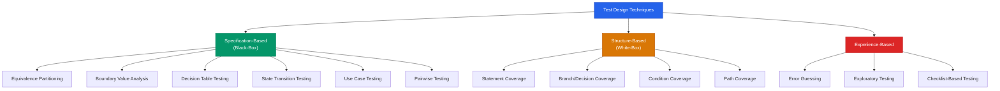
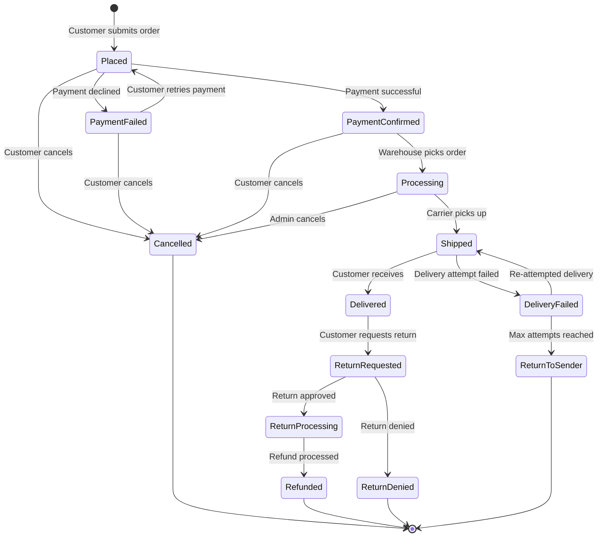
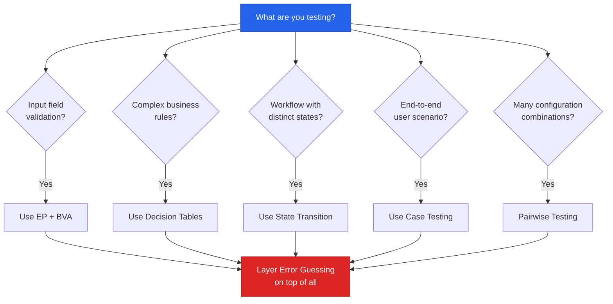

# Part 5: Test Design Techniques

---

## 5.1 Introduction to Test Design Techniques

### What Are Test Design Techniques?

**Test design techniques** are systematic methods used to derive test conditions, test cases, and test data from identified requirements, specifications, or internal structures of a software system. Rather than relying on intuition or ad-hoc approaches, these techniques provide structured frameworks that help testers ensure thorough and efficient test coverage.

Think of test design techniques as the "science" behind test case creation. While experience and intuition play a role in testing, applying formal techniques ensures that you are not missing critical scenarios and that your test effort is optimized.

> [!IMPORTANT]
> Test design techniques are not mutually exclusive. In real-world projects, experienced testers combine multiple techniques to achieve maximum coverage with minimum test cases.

### Why Are They Important?

Without structured test design techniques, testing becomes a random activity that may miss critical defects. Here's why they matter:

| Reason | Explanation |
|--------|-------------|
| **Systematic Coverage** | Ensures all logical areas of the software are tested without relying on guesswork |
| **Defect Detection Efficiency** | Focuses testing effort on areas most likely to contain defects (boundaries, combinations, transitions) |
| **Reduced Redundancy** | Eliminates duplicate test cases that test the same condition repeatedly |
| **Optimized Test Effort** | Helps achieve maximum coverage with the minimum number of test cases |
| **Documented Rationale** | Provides justification for why specific test cases were created — useful during audits and reviews |
| **Repeatability** | Different testers applying the same technique to the same specification should derive similar test cases |
| **Improved Communication** | Common vocabulary and framework shared across the team |
| **Regulatory Compliance** | Many standards (DO-178C for aviation, ISO 26262 for automotive) mandate specific test design techniques |

**Real-World Example:** Consider testing an e-commerce checkout page. Without techniques, a tester might randomly try a few valid orders and a few invalid ones. With techniques like Equivalence Partitioning and Boundary Value Analysis, the tester systematically identifies that the quantity field (1–99) needs tests at 0, 1, 2, 98, 99, 100 — catching the common off-by-one errors that developers frequently introduce.

### Categories of Test Design Techniques

Test design techniques are broadly classified into three categories:



#### 1. Specification-Based (Black-Box) Techniques

These techniques derive test cases from the **external specifications** (requirements, user stories, functional specifications) of the software **without** considering the internal code structure. The tester treats the system as a "black box" — input goes in, output comes out, and the internal workings are unknown.

**Key Characteristics:**
- No knowledge of internal code is required
- Based on requirements and specifications
- Applicable at all levels of testing (unit, integration, system, acceptance)
- Most commonly used by manual testers

**Techniques covered in this chapter:**
- Equivalence Partitioning (EP)
- Boundary Value Analysis (BVA)
- Decision Table Testing
- State Transition Testing
- Use Case Testing
- Pairwise / All-Pairs Testing

#### 2. Structure-Based (White-Box) Techniques

These techniques derive test cases from the **internal structure** (source code, architecture, data flow) of the software. The tester has access to and understanding of the code.

**Key Characteristics:**
- Requires knowledge of the internal code
- Primarily used by developers during unit testing
- Measures code coverage (statement, branch, path)
- Helps identify dead code and untested paths

> [!NOTE]
> While this chapter focuses primarily on black-box techniques (most relevant for manual testers), understanding white-box concepts is essential for interviews and for collaborating with developers.

#### 3. Experience-Based Techniques

These techniques leverage the **tester's knowledge, experience, and intuition** to identify potential defects. They complement formal techniques by catching defects that systematic methods might miss.

**Key Characteristics:**
- Relies on tester's skill and domain knowledge
- Informal but highly effective
- Best used in combination with formal techniques
- Difficult to measure coverage systematically

### Overview: Choosing the Right Technique

| Technique | Best Used When | Input Required | Effort Level |
|-----------|---------------|----------------|-------------|
| Equivalence Partitioning | Large input domains with distinct ranges | Input field specifications | Low |
| Boundary Value Analysis | Numeric or ordered inputs with clear limits | Boundary values from specs | Low |
| Decision Table Testing | Multiple conditions affect outcomes | Business rules with combinations | Medium |
| State Transition Testing | System has distinct states and transitions | State diagrams or workflow specs | Medium-High |
| Use Case Testing | End-to-end user workflows exist | Use case documents | Medium |
| Pairwise Testing | Many input parameters with multiple values | Parameter lists with values | Medium |
| Error Guessing | Experienced tester, known problem areas | Domain knowledge | Low |

> [!TIP]
> In practice, start with Equivalence Partitioning and Boundary Value Analysis for input fields, use Decision Tables for business rules, State Transition for workflows, and layer Error Guessing on top of everything.

---

## 5.2 Equivalence Partitioning (EP)

### Detailed Definition

**Equivalence Partitioning (EP)** — also called Equivalence Class Partitioning (ECP) — is a black-box test design technique that divides the input data of a software unit into **partitions** (or classes) of equivalent data from which test cases can be derived. The fundamental assumption is:

> **If one test case from a partition detects a defect, all other test cases in the same partition would also detect the same defect. Conversely, if one test case does not detect a defect, none of the other test cases from the same partition will either.**

This means you only need **one representative test value** from each partition, dramatically reducing the total number of test cases needed while still maintaining effective coverage.

**Formal Definition (ISTQB):** *"Equivalence partitioning divides data into partitions (known as equivalence partitions or equivalence classes) in such a way that all the members of a given partition are expected to be processed in the same way."*

### Step-by-Step Process

Follow these steps to apply Equivalence Partitioning:

```
Step 1: Identify Input Domains
    ↓ Read the specification, identify all input fields and parameters
Step 2: Determine Valid and Invalid Partitions
    ↓ For each input, define the ranges/sets that are valid and invalid
Step 3: Select One Representative Value from Each Partition
    ↓ Choose a typical value (not a boundary value) from each partition
Step 4: Create Test Cases
    ↓ Design test cases using selected representative values
Step 5: Verify Coverage
    ↓ Ensure every partition has at least one test case
```

### Rules for Creating Partitions

| Rule | Description | Example |
|------|-------------|---------|
| **Range Rule** | If the input is a range of values, create one valid partition (within range) and two invalid partitions (below and above range) | Age 18-60: Valid [18-60], Invalid [<18], Invalid [>60] |
| **Specific Value Rule** | If the input must be a specific value, create one valid partition (the value) and one invalid partition (any other value) | Country code "US": Valid ["US"], Invalid [anything else] |
| **Set/Member Rule** | If the input must be from a set, create one valid partition (any member of the set) and one invalid partition (not a member) | Color {Red, Blue, Green}: Valid [any of the 3], Invalid [Yellow] |
| **Boolean Rule** | If the input is Boolean, create one valid partition (True) and one invalid partition (False) | Checkbox: Valid [Checked], Invalid [Unchecked] |
| **Must-be Rule** | If the input has a specific constraint (e.g., must be numeric), create one valid partition (satisfies constraint) and one invalid partition (violates constraint) | Phone: Valid [numeric], Invalid [alphabetic] |

### Example 1: Age Field (1–100)

**Specification:** An insurance application has an "Age" field that accepts values from 1 to 100 (inclusive). The field should accept only integer values.

**Step 1: Identify the input domain**
- Input field: Age
- Type: Integer
- Range: 1 to 100

**Step 2: Divide into partitions**

| Partition ID | Type | Description | Range | Representative Value |
|-------------|------|-------------|-------|---------------------|
| EP1 | Invalid | Below minimum | < 1 (e.g., -5, 0) | **-5** |
| EP2 | Valid | Within range | 1 to 100 | **50** |
| EP3 | Invalid | Above maximum | > 100 (e.g., 101, 999) | **150** |
| EP4 | Invalid | Non-numeric input | Alphabetic/special chars | **"abc"** |
| EP5 | Invalid | Decimal values | Floating point numbers | **25.5** |
| EP6 | Invalid | Empty/Null | No input provided | **(empty)** |

**Step 3: Derive test cases**

| Test Case | Input | Partition | Expected Result |
|-----------|-------|-----------|-----------------|
| TC1 | -5 | EP1 (Invalid - below min) | Error: "Age must be between 1 and 100" |
| TC2 | 50 | EP2 (Valid) | Accepted successfully |
| TC3 | 150 | EP3 (Invalid - above max) | Error: "Age must be between 1 and 100" |
| TC4 | "abc" | EP4 (Invalid - non-numeric) | Error: "Please enter a valid number" |
| TC5 | 25.5 | EP5 (Invalid - decimal) | Error: "Please enter a whole number" |
| TC6 | (empty) | EP6 (Invalid - empty) | Error: "Age is required" |

**Result:** Instead of testing hundreds of possible age values, we need only **6 test cases** to cover all equivalence partitions.

### Example 2: Username Field (6–15 characters, alphanumeric only)

**Specification:** A registration form has a "Username" field with these rules:
- Length: 6 to 15 characters
- Allowed characters: Alphanumeric only (a-z, A-Z, 0-9)
- Cannot be empty
- Must start with a letter

**Partitions:**

| Partition ID | Dimension | Type | Description | Representative Value |
|-------------|-----------|------|-------------|---------------------|
| EP1 | Length | Invalid | Too short (< 6 chars) | "abc" (3 chars) |
| EP2 | Length | Valid | Within range (6-15 chars) | "JohnDoe1" (8 chars) |
| EP3 | Length | Invalid | Too long (> 15 chars) | "abcdefghijklmnop" (16 chars) |
| EP4 | Characters | Valid | Alphanumeric only | "User123" |
| EP5 | Characters | Invalid | Contains special chars | "User@123" |
| EP6 | Characters | Invalid | Contains spaces | "John Doe" |
| EP7 | Start char | Valid | Starts with a letter | "aUser1" |
| EP8 | Start char | Invalid | Starts with a number | "1User" |
| EP9 | Presence | Invalid | Empty input | "" |

**Test Cases:**

| TC# | Input | Partitions Tested | Expected Result |
|-----|-------|-------------------|-----------------|
| TC1 | "abc" | EP1 (too short) | Error: "Username must be 6-15 characters" |
| TC2 | "JohnDoe1" | EP2 (valid length), EP4 (valid chars), EP7 (starts with letter) | Username accepted |
| TC3 | "abcdefghijklmnop" | EP3 (too long) | Error: "Username must be 6-15 characters" |
| TC4 | "User@123" | EP5 (special chars) | Error: "Only alphanumeric characters allowed" |
| TC5 | "John Doe" | EP6 (spaces) | Error: "Spaces not allowed" |
| TC6 | "1UserABC" | EP8 (starts with number) | Error: "Username must start with a letter" |
| TC7 | "" | EP9 (empty) | Error: "Username is required" |

### Example 3: Discount Field with Multiple Ranges

**Specification:** An e-commerce platform applies discounts based on purchase amount:

| Purchase Amount | Discount |
|----------------|----------|
| $0 - $49.99 | 0% (No discount) |
| $50 - $99.99 | 5% |
| $100 - $499.99 | 10% |
| $500 - $999.99 | 15% |
| $1000 and above | 20% |

**Equivalence Partitions:**

| Partition ID | Type | Range | Discount | Representative Value |
|-------------|------|-------|----------|---------------------|
| EP1 | Invalid | < $0 (negative) | Error | -$10.00 |
| EP2 | Valid | $0 - $49.99 | 0% | $25.00 |
| EP3 | Valid | $50 - $99.99 | 5% | $75.00 |
| EP4 | Valid | $100 - $499.99 | 10% | $250.00 |
| EP5 | Valid | $500 - $999.99 | 15% | $750.00 |
| EP6 | Valid | $1000+ | 20% | $1500.00 |
| EP7 | Invalid | Non-numeric | Error | "abc" |

**Test Cases:**

| TC# | Input Amount | Partition | Expected Discount | Expected Result |
|-----|-------------|-----------|-------------------|-----------------|
| TC1 | -$10.00 | EP1 | N/A | Error: "Invalid amount" |
| TC2 | $25.00 | EP2 | 0% | Total: $25.00 |
| TC3 | $75.00 | EP3 | 5% | Total: $71.25 |
| TC4 | $250.00 | EP4 | 10% | Total: $225.00 |
| TC5 | $750.00 | EP5 | 15% | Total: $637.50 |
| TC6 | $1500.00 | EP6 | 20% | Total: $1200.00 |
| TC7 | "abc" | EP7 | N/A | Error: "Enter a valid amount" |

### Number of Test Cases Formula

The minimum number of test cases needed for Equivalence Partitioning:

**Minimum Test Cases = Number of Valid Partitions + Number of Invalid Partitions**

However, for **valid partitions**, you can combine multiple dimensions in a single test case. For **invalid partitions**, each should be tested individually (to isolate the error):

- **Valid test cases:** At least 1 test case that covers all valid partitions simultaneously
- **Invalid test cases:** 1 test case per invalid partition (only one invalid value at a time, rest are valid)

**Formula:**
```
Minimum TC = max(number of valid partitions) + total invalid partitions
```

### Advantages and Limitations

| Advantages | Limitations |
|-----------|------------|
| Significantly reduces the number of test cases | Assumes all values in a partition behave identically (not always true) |
| Systematic and structured approach | Does not test boundary values specifically |
| Easy to learn and apply | Requires correct identification of partitions from specifications |
| Applicable to any input domain | May miss defects at partition boundaries |
| Provides good coverage with minimal effort | Ambiguous specifications lead to incorrect partitions |
| Can be combined with other techniques | Cannot detect combinatorial defects |

### Common Mistakes in Equivalence Partitioning

1. **Forgetting non-functional partitions:** Ignoring inputs like empty strings, null values, whitespace-only strings
2. **Not considering data types:** Only testing numeric ranges but forgetting that alphabetic or special character input is possible
3. **Overlapping partitions:** Creating partitions that share values (e.g., [1-50] and [50-100] — where does 50 belong?)
4. **Too few partitions:** Lumping all invalid inputs into one partition instead of separating them by type
5. **Testing multiple invalid values simultaneously:** Each invalid partition should be tested individually while keeping other inputs valid
6. **Ignoring output partitions:** Only focusing on input partitions without considering different output categories

> [!TIP]
> Always create partitions for **both input and output** domains. Output-based partitioning can reveal test cases that input-based partitioning might miss.

---

## 5.3 Boundary Value Analysis (BVA)

### Detailed Definition

**Boundary Value Analysis (BVA)** is a black-box test design technique that focuses on testing values at the **edges (boundaries)** of equivalence partitions. It is based on the observation that a disproportionately large number of defects occur at the boundaries of input domains rather than in the middle.

**Why?** Because developers often make mistakes in:
- Using `<` instead of `<=` (or vice versa)
- Off-by-one errors in loops and conditions
- Incorrect handling of minimum and maximum values
- Edge cases in array indexing (0-based vs 1-based)

> [!IMPORTANT]
> BVA is an **extension** of Equivalence Partitioning. While EP tells you *which partitions* to test, BVA tells you *which specific values* within and around those partitions are most likely to expose defects.

### Why Boundaries Are Error-Prone

Consider this code snippet that a developer might write:

```java
// Developer intended: accept ages 18 to 60
if (age > 18 && age < 60) {  // BUG! Should be >= 18 and <= 60
    processApplication(age);
} else {
    rejectApplication(age);
}
```

In this example:
- Age 25 (middle of the range) → works correctly ✓
- Age 18 (boundary) → **FAILS** (rejected when it should be accepted) ✗
- Age 60 (boundary) → **FAILS** (rejected when it should be accepted) ✗

A test with value 25 (from EP) would pass, hiding the defect. But BVA would catch it immediately by testing 18 and 60.

### Step-by-Step Process

```
Step 1: Identify Equivalence Partitions
    ↓ Use EP to determine the partitions first
Step 2: Identify Boundaries of Each Partition
    ↓ Determine the minimum and maximum values of each partition
Step 3: Select Boundary Values
    ↓ For each boundary, select values AT, JUST BELOW, and JUST ABOVE the boundary
Step 4: Create Test Cases
    ↓ Design test cases for each boundary value
Step 5: Verify Coverage
    ↓ Ensure all boundaries have been tested
```

### Two-Value vs Three-Value BVA

There are two approaches to BVA, and which one you use depends on the level of rigor required:

#### Two-Value BVA (Standard)

For each boundary, test **two values**: the boundary value itself and its closest neighbor outside the partition.

For a range [min, max]:
- **min** and **min - 1**
- **max** and **max + 1**

**Total test values: 4** (for a single range)

#### Three-Value BVA (Robust / Extended)

For each boundary, test **three values**: the boundary value, and its neighbors on both sides.

For a range [min, max]:
- **min - 1**, **min**, **min + 1**
- **max - 1**, **max**, **max + 1**

**Total test values: 6** (for a single range)

```
    Invalid     │         Valid           │     Invalid
                │                         │
    ◄───────────┼─────────────────────────┼──────────────►
                │                         │
  min-1       min    min+1     max-1     max    max+1
   ▲           ▲       ▲        ▲        ▲        ▲
   │           │       │        │        │        │
   └── 2-val ──┘       │        │        └── 2-val ┘
   └────── 3-val ──────┘        └────── 3-val ─────┘
```

### Example 1: Age Field (18–60)

**Specification:** An employment application form accepts ages from 18 to 60 (inclusive).

**Two-Value BVA:**

| Boundary | Test Value | Partition | Expected Result |
|----------|-----------|-----------|-----------------|
| Below minimum | 17 | Invalid | Error: "Age must be 18-60" |
| At minimum | 18 | Valid | Accepted |
| At maximum | 60 | Valid | Accepted |
| Above maximum | 61 | Invalid | Error: "Age must be 18-60" |

**Three-Value BVA (Robust):**

| Boundary | Test Value | Partition | Expected Result |
|----------|-----------|-----------|-----------------|
| Below minimum | 17 | Invalid | Error: "Age must be 18-60" |
| At minimum | 18 | Valid | Accepted |
| Just above minimum | 19 | Valid | Accepted |
| Just below maximum | 59 | Valid | Accepted |
| At maximum | 60 | Valid | Accepted |
| Above maximum | 61 | Invalid | Error: "Age must be 18-60" |

### Example 2: Password Length (8–20 characters)

**Specification:** A password field must be between 8 and 20 characters long.

**Complete BVA Table (Three-Value):**

| Test Case | Password Length | Test Password | Type | Expected Result |
|-----------|----------------|---------------|------|-----------------|
| BVA1 | 7 chars | "Abcde1@" | Invalid (below min) | Error: "Password must be 8-20 characters" |
| BVA2 | 8 chars | "Abcdef1@" | Valid (at min) | Accepted |
| BVA3 | 9 chars | "Abcdefg1@" | Valid (above min) | Accepted |
| BVA4 | 19 chars | "Abcdefghijklmno1@xy" | Valid (below max) | Accepted |
| BVA5 | 20 chars | "Abcdefghijklmnop1@xy" | Valid (at max) | Accepted |
| BVA6 | 21 chars | "Abcdefghijklmnopq1@xy" | Invalid (above max) | Error: "Password must be 8-20 characters" |
| BVA7 | 0 chars | "" | Invalid (empty) | Error: "Password is required" |

### Example 3: Shopping Cart Quantity (1–99)

**Specification:** An online store allows customers to order between 1 and 99 units of a product per order.

**Complete BVA Table (Three-Value):**

| Test Case | Quantity | Partition | Expected Behavior | Priority |
|-----------|----------|-----------|-------------------|----------|
| BVA1 | -1 | Invalid (negative) | Error: "Quantity must be 1-99" | High |
| BVA2 | 0 | Invalid (below min) | Error: "Minimum order quantity is 1" | High |
| BVA3 | 1 | Valid (at min boundary) | Item added to cart, quantity = 1 | High |
| BVA4 | 2 | Valid (just above min) | Item added to cart, quantity = 2 | Medium |
| BVA5 | 50 | Valid (middle value) | Item added to cart, quantity = 50 | Low |
| BVA6 | 98 | Valid (just below max) | Item added to cart, quantity = 98 | Medium |
| BVA7 | 99 | Valid (at max boundary) | Item added to cart, quantity = 99 | High |
| BVA8 | 100 | Invalid (above max) | Error: "Maximum order quantity is 99" | High |
| BVA9 | 999 | Invalid (far above max) | Error: "Maximum order quantity is 99" | Medium |
| BVA10 | "" | Invalid (empty) | Error: "Quantity is required" | High |
| BVA11 | "abc" | Invalid (non-numeric) | Error: "Enter a valid number" | High |

### Relationship Between EP and BVA

EP and BVA are **complementary techniques** that are almost always used together:


| Aspect | EP | BVA |
|--------|-----|-----|
| **Focus** | Classes of equivalent data | Edge values at partition boundaries |
| **Value selection** | Any representative value from each partition | Specific boundary values |
| **Defect detection** | Logic errors within partitions | Off-by-one errors, boundary mishandling |
| **Number of tests** | One per partition | Multiple per boundary |
| **Independence** | Can be used standalone | Almost always used with EP |
| **What it answers** | "What ranges should I test?" | "Which specific values should I use?" |

### Combined EP + BVA Example

**Specification:** A tax calculation system charges:
- 0% for income $0 – $10,000
- 10% for income $10,001 – $40,000
- 20% for income $40,001 – $100,000
- 30% for income above $100,000

**EP Partitions:**

| Partition | Range | Tax Rate |
|-----------|-------|----------|
| EP1 (Invalid) | < $0 | Error |
| EP2 (Valid) | $0 – $10,000 | 0% |
| EP3 (Valid) | $10,001 – $40,000 | 10% |
| EP4 (Valid) | $40,001 – $100,000 | 20% |
| EP5 (Valid) | > $100,000 | 30% |

**Combined EP + BVA Test Cases:**

| TC# | Input | Technique | Partition | Expected Tax |
|-----|-------|-----------|-----------|-------------|
| TC1 | -$100 | EP | EP1 (Invalid) | Error |
| TC2 | $0 | BVA | EP2 boundary (min) | $0 (0%) |
| TC3 | $5,000 | EP | EP2 (middle) | $0 (0%) |
| TC4 | $10,000 | BVA | EP2/EP3 boundary | $0 (0%) |
| TC5 | $10,001 | BVA | EP3 boundary (min) | $1,000.10 (10%) |
| TC6 | $25,000 | EP | EP3 (middle) | $2,500 (10%) |
| TC7 | $40,000 | BVA | EP3/EP4 boundary | $4,000 (10%) |
| TC8 | $40,001 | BVA | EP4 boundary (min) | $8,000.20 (20%) |
| TC9 | $70,000 | EP | EP4 (middle) | $14,000 (20%) |
| TC10 | $100,000 | BVA | EP4/EP5 boundary | $20,000 (20%) |
| TC11 | $100,001 | BVA | EP5 boundary (min) | $30,000.30 (30%) |
| TC12 | $200,000 | EP | EP5 (middle) | $60,000 (30%) |

### Advantages and Limitations

| Advantages | Limitations |
|-----------|------------|
| Catches the most common type of defect (off-by-one errors) | Only applicable to ordered/numeric data types |
| Scientifically proven to find more defects per test case than random testing | Does not work well for Boolean or categorical inputs |
| Simple and easy to apply | Requires clearly defined boundaries in specifications |
| Complements EP perfectly | Does not consider combinations of inputs |
| Well-documented and widely accepted technique | May generate too many test cases for inputs with many boundaries |
| Effective for all testing levels | Not effective for non-linear relationships between input and output |

> [!TIP]
> **Pro Tip:** When specifications are vague about boundary behavior (e.g., "around 100"), always clarify with the BA or product owner. Document the clarified boundary in your test case so there's no ambiguity during execution.

---

## 5.4 Decision Table Testing

### Detailed Definition

**Decision Table Testing** is a black-box test design technique used to test systems that have **complex business rules** where the output depends on **multiple combinations of inputs (conditions)**. A decision table systematically lists all possible combinations of conditions and their corresponding actions/outcomes.

Decision tables are particularly valuable when:
- Multiple conditions need to be evaluated together
- Different combinations of conditions lead to different outcomes
- Business rules are complex with many if-then-else paths
- Requirements contain logical operators (AND, OR, NOT)

> [!NOTE]
> Decision tables are also an excellent **requirements analysis tool**. The process of creating a decision table often reveals ambiguities, gaps, and contradictions in the requirements themselves.

### When to Use Decision Table Testing

| Scenario | Example |
|----------|---------|
| Multiple conditions affect a single outcome | Loan approval based on credit score, income, and employment status |
| Business rules with AND/OR logic | Discount applies if customer is a member AND order > $100 OR has a coupon |
| Permission/access control rules | User access based on role, department, and security clearance |
| Error handling depends on combination of factors | Different error messages based on which fields are invalid |
| Pricing rules with multiple tiers | Insurance premium based on age, smoker status, and pre-existing conditions |

### Structure of a Decision Table

A decision table has four quadrants:

```
┌─────────────────────┬──────────────────────────────────────┐
│                     │         Rules (Combinations)         │
│                     ├──────┬──────┬──────┬──────┬──────────┤
│                     │ R1   │ R2   │ R3   │ R4   │ ...      │
├─────────────────────┼──────┼──────┼──────┼──────┼──────────┤
│ Conditions (Inputs) │      │      │      │      │          │
│  Condition 1        │ T/F  │ T/F  │ T/F  │ T/F  │          │
│  Condition 2        │ T/F  │ T/F  │ T/F  │ T/F  │          │
│  Condition 3        │ T/F  │ T/F  │ T/F  │ T/F  │          │
├─────────────────────┼──────┼──────┼──────┼──────┼──────────┤
│ Actions (Outputs)   │      │      │      │      │          │
│  Action 1           │ X/ - │ X/ - │ X/ - │ X/ - │          │
│  Action 2           │ X/ - │ X/ - │ X/ - │ X/ - │          │
└─────────────────────┴──────┴──────┴──────┴──────┴──────────┘
```

### Step-by-Step Process

**Step 1: Identify all conditions (inputs)**
List all the conditions that affect the outcome. These are typically True/False (binary) conditions.

**Step 2: Identify all actions (outputs)**
List all possible actions or outcomes that can result from the conditions.

**Step 3: Calculate the number of rules**
For N binary conditions, the total number of combinations (rules) = **2^N**

| Number of Conditions | Number of Rules |
|---------------------|-----------------|
| 2 | 4 |
| 3 | 8 |
| 4 | 16 |
| 5 | 32 |

**Step 4: Fill in the condition combinations**
Systematically list all possible True/False combinations.

**Step 5: Determine the action for each rule**
For each combination of conditions, mark which actions apply.

**Step 6: Simplify the table (optional)**
Reduce rules using "don't care" conditions (marked with `-` or `*`) where a condition doesn't affect the outcome.

### Example 1: Login Validation

**Specification:** A login system validates credentials with these rules:
- Username must be valid (exists in database)
- Password must be correct (matches the username)
- Account must not be locked

**Conditions:**
- C1: Username is valid?
- C2: Password is correct?
- C3: Account is not locked?

**Number of rules:** 2³ = 8

**Full Decision Table:**

| | R1 | R2 | R3 | R4 | R5 | R6 | R7 | R8 |
|---|---|---|---|---|---|---|---|---|
| **Conditions** | | | | | | | | |
| C1: Valid Username | T | T | T | T | F | F | F | F |
| C2: Correct Password | T | T | F | F | T | T | F | F |
| C3: Account Not Locked | T | F | T | F | T | F | T | F |
| **Actions** | | | | | | | | |
| A1: Login Successful | ✓ | | | | | | | |
| A2: Error "Account Locked" | | ✓ | | | | | | |
| A3: Error "Invalid Credentials" | | | ✓ | ✓ | ✓ | ✓ | ✓ | ✓ |
| A4: Increment Failed Attempt Counter | | | ✓ | | | | | |

> [!NOTE]
> Notice that Rules R4 through R8 all produce the same action (A3: "Invalid Credentials"). This is a deliberate **security practice** — the system should not reveal whether the username exists, or whether the password is wrong, or whether the account is locked (except in R2 where the user has proven identity with a valid username). In practice, the specific messages vary by application security policy.

**Simplified Decision Table (with "don't care" conditions):**

| | R1 | R2 | R3 | R4 |
|---|---|---|---|---|
| **Conditions** | | | | |
| C1: Valid Username | T | T | T | F |
| C2: Correct Password | T | T | F | - |
| C3: Account Not Locked | T | F | - | - |
| **Actions** | | | | |
| A1: Login Successful | ✓ | | | |
| A2: Error "Account Locked" | | ✓ | | |
| A3: Error "Invalid Credentials" | | | ✓ | ✓ |

Here, `-` means "don't care" — the condition doesn't matter for that rule's outcome.

### Example 2: E-commerce Discount Rules

**Specification:** An online store applies discounts based on:
- C1: Customer is a Premium Member (Yes/No)
- C2: Order Amount > $100 (Yes/No)
- C3: Valid Coupon Code Applied (Yes/No)

**Discount Rules:**
- Premium members with orders > $100 and a coupon: 25% discount
- Premium members with orders > $100, no coupon: 15% discount
- Premium members with orders ≤ $100 and a coupon: 12% discount
- Premium members with orders ≤ $100, no coupon: 8% discount
- Non-premium with orders > $100 and a coupon: 10% discount
- Non-premium with orders > $100, no coupon: 5% discount
- Non-premium with orders ≤ $100 and a coupon: 5% discount
- Non-premium with orders ≤ $100, no coupon: 0% discount

**Full Decision Table:**

| | R1 | R2 | R3 | R4 | R5 | R6 | R7 | R8 |
|---|---|---|---|---|---|---|---|---|
| **Conditions** | | | | | | | | |
| C1: Premium Member | Y | Y | Y | Y | N | N | N | N |
| C2: Order > $100 | Y | Y | N | N | Y | Y | N | N |
| C3: Valid Coupon | Y | N | Y | N | Y | N | Y | N |
| **Actions** | | | | | | | | |
| Discount Applied | 25% | 15% | 12% | 8% | 10% | 5% | 5% | 0% |
| Free Shipping | ✓ | ✓ | ✓ | ✓ | ✓ | | | |
| Bonus Points (2x) | ✓ | ✓ | | | | | | |

**Derived Test Cases:**

| TC# | Member? | Order Amount | Coupon? | Expected Discount | Free Shipping? | Bonus 2x? |
|-----|---------|-------------|---------|-------------------|---------------|-----------|
| TC1 | Yes | $150 | Valid123 | 25% ($37.50 off) | Yes | Yes |
| TC2 | Yes | $200 | None | 15% ($30 off) | Yes | Yes |
| TC3 | Yes | $80 | SAVE10 | 12% ($9.60 off) | Yes | No |
| TC4 | Yes | $50 | None | 8% ($4.00 off) | Yes | No |
| TC5 | No | $120 | DEAL5 | 10% ($12.00 off) | Yes | No |
| TC6 | No | $175 | None | 5% ($8.75 off) | No | No |
| TC7 | No | $45 | FIRST | 5% ($2.25 off) | No | No |
| TC8 | No | $30 | None | 0% ($0.00 off) | No | No |

### Example 3: ATM Withdrawal

**Specification:** An ATM processes withdrawals based on:
- C1: Valid card (card is recognized and not expired)
- C2: Correct PIN entered
- C3: Sufficient account balance
- C4: Within daily withdrawal limit

**Full Decision Table:**

| | R1 | R2 | R3 | R4 | R5 | R6 | R7 | R8 |
|---|---|---|---|---|---|---|---|---|
| **Conditions** | | | | | | | | |
| C1: Valid Card | T | T | T | T | T | T | F | F |
| C2: Correct PIN | T | T | T | T | F | F | - | - |
| C3: Sufficient Balance | T | T | F | F | - | - | - | - |
| C4: Within Daily Limit | T | F | T | F | - | - | - | - |
| **Actions** | | | | | | | | |
| A1: Dispense Cash | ✓ | | | | | | | |
| A2: Update Balance | ✓ | | | | | | | |
| A3: Print Receipt | ✓ | ✓ | ✓ | ✓ | | | | |
| A4: "Daily Limit Exceeded" | | ✓ | | | | | | |
| A5: "Insufficient Funds" | | | ✓ | ✓ | | | | |
| A6: "Incorrect PIN" | | | | | ✓ | | | |
| A7: Increment PIN Attempt | | | | | ✓ | ✓ | | |
| A8: Retain Card (3 failed PINs) | | | | | | ✓ | | |
| A9: "Invalid Card" | | | | | | | ✓ | ✓ |
| A10: Eject Card | ✓ | ✓ | ✓ | ✓ | ✓ | | | ✓ |

### How to Reduce Rules ("Don't Care" Conditions)

When two rules have the same actions but differ in only one condition, that condition is irrelevant — it's a "don't care" (`-`) condition. These rules can be merged:

**Before simplification:**
| | R1 | R2 |
|---|---|---|
| C1 | T | T |
| C2 | T | F |
| Action | Error | Error |

**After simplification:**
| | R1-2 |
|---|---|
| C1 | T |
| C2 | - |
| Action | Error |

**Rules for simplification:**
1. Two rules can be merged only if they differ in **exactly one** condition and produce the **same set of actions**
2. The differing condition becomes a "don't care" (`-`)
3. After merging, check if further merging is possible
4. The total rules covered must remain the same (verify: each `- ` doubles the coverage)

### Advantages and Limitations

| Advantages | Limitations |
|-----------|------------|
| Systematic coverage of all condition combinations | Number of rules grows exponentially (2^N) |
| Exposes missing requirements and ambiguities | Can become unwieldy for more than 5-6 conditions |
| Easy to translate directly into test cases | Only handles binary (T/F) conditions easily |
| Serves as both a design and documentation tool | Doesn't consider the sequence/order of conditions |
| Simplification reduces redundant tests | Requires clear understanding of business rules |
| Excellent for complex business logic | Not suitable for simple input validation |

> [!WARNING]
> For systems with more than 5-6 conditions, the decision table becomes very large (2^6 = 64 rules). In such cases, consider using **Pairwise Testing** (Section 5.8) to reduce combinations while still maintaining good coverage.

---

## 5.5 State Transition Testing

### Detailed Definition

**State Transition Testing** is a black-box test design technique used to test systems that have **distinct states** and where **transitions between states** are triggered by events or inputs. It is based on the concept of a **finite state machine (FSM)** — the system can be in one of a finite number of states at any given time, and specific events cause it to move from one state to another.

This technique is particularly useful for:
- Systems with sequential behavior (order processing, workflows)
- User interfaces with distinct modes (edit mode, view mode, locked mode)
- Protocol testing (network handshakes)
- Embedded systems (device states)
- Subscription/account lifecycle management

### Key Terminology

| Term | Definition | Example |
|------|-----------|---------|
| **State** | A distinct condition or mode of the system | "Logged In", "Locked", "Active" |
| **Transition** | The change from one state to another | Logged Out → Logged In |
| **Event/Input** | The trigger that causes a transition | "Enter correct password" |
| **Action/Output** | What happens during a transition | "Display dashboard" |
| **Guard Condition** | A condition that must be true for the transition to occur | "Account not expired" |
| **Initial State** | The starting state of the system | "Idle" |
| **Final State** | An ending state (if applicable) | "Account Deleted" |

### State Transition Diagram

A **State Transition Diagram** (STD) is a visual representation showing:
- States (as circles/rounded rectangles)
- Transitions (as arrows between states)
- Events and actions (labels on arrows)

### State Transition Table

A **State Transition Table** (STT) is a tabular representation that captures the same information:

| Current State | Event | Guard Condition | Next State | Action |
|--------------|-------|-----------------|------------|--------|
| State A | Event 1 | [condition] | State B | Do something |
| State A | Event 2 | [condition] | State C | Do something else |

### Step-by-Step Process

1. **Identify all possible states** — Review the specification to find all distinct states the system can be in
2. **Identify all events/inputs** — Determine what triggers cause state changes
3. **Identify all transitions** — Map which events cause which state changes
4. **Identify actions/outputs** — Determine what happens during each transition
5. **Draw the State Transition Diagram** — Visualize the states and transitions
6. **Create the State Transition Table** — Tabulate all state-event-transition combinations
7. **Derive test cases** — Create test cases to cover all transitions (and optionally invalid transitions)

### Example 1: ATM PIN Verification (3 Attempts)

**Specification:**
- User inserts card and enters PIN
- If PIN is correct, access is granted
- If PIN is wrong, the user gets up to 3 attempts
- After 3 wrong attempts, the card is retained (blocked)
- User can cancel at any time to eject the card

**States:**
- S1: Card Inserted (Waiting for PIN)
- S2: First Attempt Failed
- S3: Second Attempt Failed
- S4: Access Granted
- S5: Card Retained (Blocked)
- S6: Card Ejected (Cancelled)

**State Transition Diagram:**

```mermaid
stateDiagram-v2
    [*] --> S1: Insert Card

    S1 --> S4: Correct PIN
    S1 --> S2: Wrong PIN (Attempt 1)
    S1 --> S6: Cancel

    S2 --> S4: Correct PIN
    S2 --> S3: Wrong PIN (Attempt 2)
    S2 --> S6: Cancel

    S3 --> S4: Correct PIN
    S3 --> S5: Wrong PIN (Attempt 3)
    S3 --> S6: Cancel

    S4 --> [*]: Session Complete
    S5 --> [*]: Card Retained
    S6 --> [*]: Card Ejected

    state S1 {
        direction LR
    }
```

**State Transition Table:**

| Current State | Event | Next State | Action |
|--------------|-------|------------|--------|
| S1: Card Inserted | Correct PIN | S4: Access Granted | Display main menu |
| S1: Card Inserted | Wrong PIN | S2: 1st Attempt Failed | Display "Wrong PIN, 2 attempts left" |
| S1: Card Inserted | Cancel | S6: Card Ejected | Eject card |
| S2: 1st Attempt Failed | Correct PIN | S4: Access Granted | Display main menu |
| S2: 1st Attempt Failed | Wrong PIN | S3: 2nd Attempt Failed | Display "Wrong PIN, 1 attempt left" |
| S2: 1st Attempt Failed | Cancel | S6: Card Ejected | Eject card |
| S3: 2nd Attempt Failed | Correct PIN | S4: Access Granted | Display main menu |
| S3: 2nd Attempt Failed | Wrong PIN | S5: Card Retained | Display "Card retained, contact bank" |
| S3: 2nd Attempt Failed | Cancel | S6: Card Ejected | Eject card |

**Derived Test Cases:**

| TC# | Description | Steps | Expected Result |
|-----|-------------|-------|-----------------|
| TC1 | Correct PIN on first attempt | Insert card → Enter correct PIN | Access granted, main menu displayed |
| TC2 | Correct PIN on second attempt | Insert card → Enter wrong PIN → Enter correct PIN | Warning shown, then access granted |
| TC3 | Correct PIN on third attempt | Insert card → Wrong PIN → Wrong PIN → Correct PIN | Two warnings, then access granted |
| TC4 | Three wrong PINs - card blocked | Insert card → Wrong PIN × 3 | Card retained, "Contact bank" message |
| TC5 | Cancel after first wrong PIN | Insert card → Wrong PIN → Cancel | Card ejected |
| TC6 | Cancel immediately | Insert card → Cancel | Card ejected |
| TC7 | Cancel after two wrong PINs | Insert card → Wrong PIN → Wrong PIN → Cancel | Card ejected |

### Example 2: Online Order Status

**Specification:** An e-commerce order goes through the following lifecycle:
- Order Placed → Payment Confirmed → Processing → Shipped → Delivered
- Order can be Cancelled before it is Shipped
- Delivered order can be Returned within 30 days
- Returned order goes through Return Processing → Refunded

**State Transition Diagram:**



**State Transition Table:**

| Current State | Event | Next State | Action |
|--------------|-------|------------|--------|
| Placed | Payment successful | PaymentConfirmed | Send confirmation email |
| Placed | Payment declined | PaymentFailed | Notify customer |
| Placed | Customer cancels | Cancelled | Refund if charged, send cancellation email |
| PaymentFailed | Retry payment | Placed | Re-initiate payment flow |
| PaymentFailed | Cancel | Cancelled | Send cancellation email |
| PaymentConfirmed | Warehouse picks | Processing | Update tracking, send "preparing" email |
| PaymentConfirmed | Customer cancels | Cancelled | Refund payment, send cancellation email |
| Processing | Carrier picks up | Shipped | Update tracking, send shipping notification |
| Processing | Admin cancels | Cancelled | Refund payment, restock items |
| Shipped | Customer receives | Delivered | Update tracking, send delivery confirmation |
| Shipped | Delivery failed | DeliveryFailed | Notify customer, schedule redelivery |
| DeliveryFailed | Re-attempt | Shipped | Update tracking |
| DeliveryFailed | Max attempts | ReturnToSender | Initiate return to warehouse |
| Delivered | Return request | ReturnRequested | Generate return label |
| ReturnRequested | Return approved | ReturnProcessing | Send return instructions |
| ReturnRequested | Return denied | ReturnDenied | Notify customer with reason |
| ReturnProcessing | Refund processed | Refunded | Refund to original payment method |

**Test Cases for Order Status:**

| TC# | Scenario | Path Tested | Expected Final State |
|-----|----------|-------------|---------------------|
| TC1 | Happy path - complete order | Placed → Confirmed → Processing → Shipped → Delivered | Delivered |
| TC2 | Cancel before payment | Placed → Cancelled | Cancelled |
| TC3 | Payment failure, then retry | Placed → PaymentFailed → Placed → Confirmed | PaymentConfirmed |
| TC4 | Cancel after confirmation | Placed → Confirmed → Cancelled | Cancelled, refund issued |
| TC5 | Cancel during processing | Placed → Confirmed → Processing → Cancelled | Cancelled, refund + restock |
| TC6 | Delivery failure, then redeliver | Shipped → DeliveryFailed → Shipped → Delivered | Delivered |
| TC7 | Return after delivery | Delivered → ReturnRequested → ReturnProcessing → Refunded | Refunded |
| TC8 | Return denied | Delivered → ReturnRequested → ReturnDenied | ReturnDenied |
| TC9 | Cannot cancel after shipped | Shipped → (attempt cancel) | Error: "Cannot cancel shipped order" |
| TC10 | Max delivery attempts | Shipped → DeliveryFailed → ... → ReturnToSender | ReturnToSender |

### Example 3: User Account States

**Specification:** A user management system has the following account states:

**States:**
- **Pending:** Account created but email not verified
- **Active:** Account is active and usable
- **Inactive:** Account deactivated by user (can be reactivated)
- **Locked:** Account locked due to security (too many failed logins, suspicious activity)
- **Suspended:** Account suspended by admin (policy violation)
- **Deleted:** Account permanently deleted

**State Transition Table:**

| Current State | Event | Next State | Action |
|--------------|-------|------------|--------|
| Pending | Email verified | Active | Enable login, send welcome email |
| Pending | Verification expired (72hrs) | Deleted | Remove account data |
| Active | User deactivates | Inactive | Disable login, retain data |
| Active | 5 failed logins | Locked | Disable login, send alert email |
| Active | Admin suspends | Suspended | Disable login, send suspension notice |
| Active | User deletes account | Deleted | 30-day grace period, then purge |
| Inactive | User reactivates | Active | Enable login |
| Inactive | 180 days inactive | Deleted | Purge data per policy |
| Locked | User resets password | Active | Enable login, reset attempt counter |
| Locked | Admin unlocks | Active | Enable login, reset attempt counter |
| Locked | 30 days locked | Suspended | Escalate to admin review |
| Suspended | Admin reinstates | Active | Enable login, send reinstatement email |
| Suspended | Admin deletes | Deleted | Purge data immediately |

### N-Switch Coverage

**N-switch coverage** defines the depth of transition sequences to test:

- **0-switch coverage:** Test each **individual transition** at least once (state → event → new state). This is the minimum level of state transition testing.
- **1-switch coverage:** Test each **pair of consecutive transitions** at least once (state1 → event1 → state2 → event2 → state3). This tests sequences of two transitions.
- **N-switch coverage:** Test sequences of **N+1 transitions** at least once.

**Example (ATM PIN):**

**0-switch (individual transitions):**
- S1 → Correct PIN → S4
- S1 → Wrong PIN → S2
- S2 → Correct PIN → S4

**1-switch (pairs of transitions):**
- S1 → Wrong PIN → S2 → Correct PIN → S4
- S1 → Wrong PIN → S2 → Wrong PIN → S3
- S1 → Wrong PIN → S2 → Cancel → S6

> [!TIP]
> For most manual testing projects, **0-switch coverage** (covering every individual transition) is sufficient. **1-switch coverage** is recommended for critical systems (banking, medical devices, aviation).

### Advantages and Limitations

| Advantages | Limitations |
|-----------|------------|
| Visual representation makes it easy to understand | Not suitable for systems without clear states |
| Catches transition-related defects | Complex systems may have too many states to diagram |
| Tests both valid and invalid transitions | Can miss defects not related to state changes |
| Excellent for workflow-based applications | Doesn't test data within states |
| Systematic derivation of test cases | Requires thorough understanding of the system |
| Helps identify missing requirements | State explosion problem for large systems |

---

## 5.6 Error Guessing

### Detailed Definition

**Error Guessing** is an experience-based test design technique where the tester uses their **knowledge, intuition, and experience** to anticipate where defects are likely to occur. Unlike formal techniques that follow systematic rules, error guessing relies on the tester's understanding of:

- Common programming mistakes
- Historical defects in similar systems
- Technology-specific pitfalls
- Domain-specific edge cases
- Known problematic areas

> [!IMPORTANT]
> Error Guessing is NOT random testing. It is a **structured application of experience** to identify test cases that formal techniques might miss. The best error guessers maintain mental (or written) catalogs of common error categories.

### When to Apply Error Guessing

| Situation | Why Error Guessing Helps |
|-----------|------------------------|
| After formal techniques are applied | Catches scenarios that EP, BVA, and decision tables miss |
| When specifications are incomplete | Experience fills the gaps in requirements |
| During exploratory testing | Guides the tester's exploration |
| When testing legacy systems | Historical knowledge of problem areas helps |
| Under time pressure | Quickly identifies high-risk test cases |
| For non-functional testing | Performance and security edge cases |

### Common Error Categories

#### 1. Null/Empty Inputs
| Error Scenario | Example |
|---------------|---------|
| Empty string | Login with blank username |
| Null value | API call with null parameter |
| Only whitespace | Name field with "   " (spaces only) |
| Zero-length file | Upload an empty file |

#### 2. Special Characters
| Error Scenario | Example |
|---------------|---------|
| Apostrophes in names | "O'Brien", "McDonald's" |
| Unicode characters | "Ñ", "ü", "中文", "العربية" |
| Emoji | "John 😀 Doe" in name field |
| Control characters | Tab, newline, null byte in inputs |
| HTML entities | `&amp;`, `&lt;`, `&#x27;` |

#### 3. Boundary-Adjacent Values
| Error Scenario | Example |
|---------------|---------|
| Maximum integer | 2,147,483,647 (32-bit int max) |
| Minimum integer | -2,147,483,648 |
| Integer overflow | 2,147,483,647 + 1 |
| Float precision | 0.1 + 0.2 (= 0.30000000000000004) |

#### 4. SQL Injection Strings
| Error Scenario | Example Input |
|---------------|--------------|
| Basic SQL injection | `' OR '1'='1` |
| Drop table | `'; DROP TABLE users; --` |
| Union-based | `' UNION SELECT * FROM users --` |
| Comment-based | `admin'--` |

#### 5. Script/HTML Injection
| Error Scenario | Example Input |
|---------------|--------------|
| Basic XSS | `<script>alert('XSS')</script>` |
| Event handler | `` |
| SVG-based | `<svg onload="alert(1)">` |
| URL-based | `javascript:alert(1)` |

#### 6. Date-Related Errors
| Error Scenario | Example |
|---------------|---------|
| February 29 (leap year) | 2024-02-29 (valid), 2023-02-29 (invalid) |
| Year 2038 problem | Dates after January 19, 2038 |
| Timezone issues | User in EST creates event, viewed in PST |
| Daylight saving time | Scheduling at 2:30 AM during DST transition |
| End of month | January 31 + 1 month = ? |
| Epoch date | 1970-01-01, dates before epoch |

#### 7. Network-Related Errors
| Error Scenario | How to Test |
|---------------|-------------|
| Network timeout | Disconnect during file upload |
| Slow connection | Throttle to 2G speed |
| Intermittent connection | Toggle airplane mode during operation |
| Server unavailable | Backend server down |
| DNS resolution failure | Invalid server address |

### Example 1: Login Form — Error Guessing Test Cases

**For a standard login form with Username and Password fields:**

| # | Test Scenario | Input | Expected Result |
|---|--------------|-------|-----------------|
| 1 | Empty username, empty password | "", "" | "Username is required" |
| 2 | Valid username, empty password | "john@email.com", "" | "Password is required" |
| 3 | Empty username, valid password | "", "Pass@123" | "Username is required" |
| 4 | Spaces-only username | "   ", "Pass@123" | "Invalid username" |
| 5 | Username with leading/trailing spaces | " john@email.com ", "Pass@123" | Should trim and login (or reject — verify spec) |
| 6 | SQL injection in username | `' OR 1=1 --`, "anything" | Login fails, no SQL error exposed |
| 7 | XSS in username | `<script>alert('xss')</script>`, "pass" | Input sanitized, login fails |
| 8 | Very long username (1000+ chars) | "a" × 1000, "Pass@123" | Graceful error, no crash |
| 9 | Unicode username | "用户@email.com", "Pass@123" | Depends on spec — handle gracefully |
| 10 | Case sensitivity test | "JOHN@email.com" vs "john@email.com" | Verify if case-insensitive |
| 11 | Copy-paste password (hidden chars) | Pasted password with hidden chars | Login should work correctly |
| 12 | Caps Lock on for password | Password typed with caps lock | Wrong password (expected behavior) |
| 13 | Rapid multiple login attempts | Click login 10 times quickly | No duplicate sessions, rate limiting |
| 14 | Concurrent login from two browsers | Login same account, two browsers | Depends on policy — verify |
| 15 | Login after session timeout | Expired session → retry login | New session created, no errors |
| 16 | Browser back button after login | Login → Dashboard → Back button | Should not show login page (or show with message) |
| 17 | Remember me + session expiry | Login with "Remember Me" → close browser → reopen | Should auto-login (if implemented) |
| 18 | Password with only special chars | "john@email.com", "!@#$%^&*()" | Should work if it's the actual password |

### Example 2: File Upload Feature — Error Guessing Test Cases

| # | Test Scenario | File Details | Expected Result |
|---|--------------|-------------|-----------------|
| 1 | Upload empty file (0 bytes) | empty.txt (0 KB) | Error: "File is empty" |
| 2 | Upload very large file | video.mp4 (5 GB) | Error: "File too large" or upload succeeds |
| 3 | Upload with wrong extension | malware.exe renamed to photo.jpg | Rejected (server validates magic bytes) |
| 4 | Double extension | report.pdf.exe | Rejected |
| 5 | Filename with special chars | "file (1) [copy] #2.pdf" | Uploaded successfully, name preserved |
| 6 | Filename with unicode | "報告.pdf" | Uploaded, name displayed correctly |
| 7 | Upload same file twice | Same document.pdf uploaded 2× | Handled per policy (overwrite/rename/error) |
| 8 | Cancel during upload | Start upload → Cancel mid-way | Partial upload removed, no corruption |
| 9 | Network disconnect during upload | Upload → disconnect WiFi | Graceful error, retry option |
| 10 | Upload with no file selected | Click upload without selecting file | Error: "Please select a file" |
| 11 | Upload hidden file | .htaccess or .env | Rejected (security risk) |
| 12 | Upload file with very long name | "a" × 255 + ".txt" | Handled gracefully |
| 13 | Upload corrupted file | Truncated or corrupted ZIP | Error during processing, not crash |
| 14 | Concurrent uploads | Upload 5 files simultaneously | All process correctly |
| 15 | Upload file while another processes | Upload while previous still processing | Queue or parallel — verify behavior |

### Example 3: Payment Processing — Error Scenarios

| # | Test Scenario | Expected Behavior |
|---|--------------|-------------------|
| 1 | Expired credit card | Error: "Card expired" |
| 2 | Card with insufficient funds | Error: "Insufficient funds" |
| 3 | Invalid CVV | Error: "Invalid security code" |
| 4 | Card number with spaces/dashes | Accepted (auto-formatting) |
| 5 | Card number all zeros | Error: "Invalid card number" |
| 6 | Luhn check failure | Error: "Invalid card number" |
| 7 | Payment timeout (slow processing) | Timeout error, payment status verified |
| 8 | Double-click pay button | Only one charge processed |
| 9 | Browser refresh during payment | No duplicate charges |
| 10 | Currency conversion edge cases | Verify rounding, no penny errors |
| 11 | Maximum transaction amount | System handles $999,999.99 |
| 12 | Zero amount payment | Error: "Amount must be greater than 0" |
| 13 | Negative amount payment | Error: "Invalid amount" |
| 14 | Payment with stolen card | Fraud detection triggers |
| 15 | 3D Secure timeout | Graceful error, retry allowed |

### Tips for Effective Error Guessing

1. **Maintain a defect log** — Track defects you find and categorize them. Over time, this becomes your personal error guessing database.
2. **Study past defects** — Review bug reports from previous releases. History tends to repeat itself.
3. **Think like a malicious user** — What would someone trying to break the system do?
4. **Consider all input types** — Not just text: files, URLs, API payloads, header values.
5. **Test error recovery** — After an error, does the system recover gracefully?
6. **Combine with formal techniques** — Use error guessing to supplement, not replace, systematic testing.
7. **Share knowledge** — Pair with other testers and share error guessing insights.
8. **Use checklists** — Build team checklists based on common errors.

### Building an Error Guessing Checklist

Here is a template for creating your own error guessing checklist:

| Category | Check Item | Status |
|----------|-----------|--------|
| **Input Validation** | Empty/null values tested | ☐ |
| **Input Validation** | Maximum length values tested | ☐ |
| **Input Validation** | Special characters tested | ☐ |
| **Input Validation** | SQL injection strings tested | ☐ |
| **Input Validation** | XSS payloads tested | ☐ |
| **Security** | Authentication bypass attempted | ☐ |
| **Security** | Authorization bypass attempted | ☐ |
| **Security** | Session handling tested | ☐ |
| **Data** | Unicode/multilingual data tested | ☐ |
| **Data** | Boundary dates tested | ☐ |
| **Data** | Negative numbers tested | ☐ |
| **Data** | Very large numbers tested | ☐ |
| **Network** | Timeout scenarios tested | ☐ |
| **Network** | Disconnection during operation tested | ☐ |
| **Concurrency** | Simultaneous operations tested | ☐ |
| **Concurrency** | Rapid repeated actions tested | ☐ |
| **Browser/Client** | Back button behavior tested | ☐ |
| **Browser/Client** | Refresh during operation tested | ☐ |
| **Browser/Client** | Multiple tabs tested | ☐ |

---

## 5.7 Use Case Based Testing

### Detailed Definition

**Use Case Testing** is a black-box test design technique that derives test cases from **use cases** — descriptions of interactions between actors (users or external systems) and the system under test to achieve a specific goal. Use cases describe the **main flow** (happy path), **alternate flows** (valid variations), and **exception flows** (error scenarios).

This technique is powerful because it tests the system from the **user's perspective**, ensuring that complete business workflows function correctly end-to-end.

### Use Case Structure

Every use case follows a standard structure:

| Element | Description | Example |
|---------|-------------|---------|
| **Use Case ID** | Unique identifier | UC-001 |
| **Use Case Name** | Descriptive name | "Place Online Order" |
| **Actor(s)** | Who interacts with the system | Customer, Payment Gateway |
| **Preconditions** | What must be true before the use case starts | User is logged in, items in cart |
| **Trigger** | What initiates the use case | User clicks "Checkout" |
| **Main Flow** | The primary sequence of steps (happy path) | Steps 1-8 |
| **Alternate Flows** | Valid variations of the main flow | Use coupon, choose different shipping |
| **Exception Flows** | Error scenarios | Payment declined, item out of stock |
| **Postconditions** | What must be true after the use case completes | Order is placed, confirmation email sent |
| **Business Rules** | Rules that apply | Minimum order $10, max 99 items |

### Step-by-Step Process

1. **Identify Use Cases** — Review requirements, user stories, or business processes to identify use cases
2. **Document the Main Flow** — Write the step-by-step happy path
3. **Identify Alternate Flows** — Find valid variations that branch from the main flow
4. **Identify Exception Flows** — Find error conditions at each step
5. **Derive Test Cases** — Create at least one test case for:
   - The main flow
   - Each alternate flow
   - Each exception flow
6. **Determine Test Data** — Identify what data is needed for each test case

### Example 1: Online Purchase Use Case

**Use Case: UC-001 — Place Online Order**

| Element | Details |
|---------|---------|
| **Actor** | Registered Customer |
| **Preconditions** | Customer is logged in; at least one item is in the shopping cart |
| **Trigger** | Customer clicks "Proceed to Checkout" |
| **Postconditions** | Order is placed; inventory updated; confirmation email sent |

**Main Flow (Happy Path):**
1. System displays the checkout page with cart summary
2. Customer reviews items and quantities
3. Customer selects/confirms shipping address
4. Customer selects shipping method (Standard/Express/Overnight)
5. System calculates shipping cost and displays updated total
6. Customer enters payment information (credit card)
7. Customer reviews order summary
8. Customer clicks "Place Order"
9. System validates payment with payment gateway
10. System confirms order, generates order number
11. System sends confirmation email to customer
12. System updates inventory

**Alternate Flows:**

| Alt Flow | Branches From Step | Description |
|----------|-------------------|-------------|
| AF1 | Step 3 | Customer adds a new shipping address |
| AF2 | Step 4 | Customer selects Express shipping |
| AF3 | Step 6 | Customer pays with PayPal instead of credit card |
| AF4 | Step 6 | Customer applies a coupon/discount code |
| AF5 | Step 2 | Customer modifies item quantity |
| AF6 | Step 2 | Customer removes an item from cart |

**Exception Flows:**

| Exc Flow | Branches From Step | Description |
|----------|-------------------|-------------|
| EF1 | Step 9 | Payment declined by gateway |
| EF2 | Step 9 | Payment gateway timeout |
| EF3 | Step 8 | Item goes out of stock during checkout |
| EF4 | Step 3 | Invalid shipping address (undeliverable area) |
| EF5 | Step 6 | Invalid coupon code (expired/already used) |
| EF6 | Step 1 | Cart is empty (items removed by another session) |

**Derived Test Cases:**

| TC# | Flow | Description | Steps | Expected Result |
|-----|------|-------------|-------|-----------------|
| TC1 | Main Flow | Complete purchase with default settings | Login → Cart → Checkout → Confirm address → Standard shipping → Credit card → Place order | Order confirmed, email sent |
| TC2 | AF1 | Add new shipping address | During checkout → Add new address → Continue | New address saved, order uses new address |
| TC3 | AF2 | Express shipping selected | Select Express → Verify updated cost | Shipping cost updated, delivery date adjusted |
| TC4 | AF3 | Pay with PayPal | Select PayPal → Redirect to PayPal → Approve → Return | Payment via PayPal, order confirmed |
| TC5 | AF4 | Apply valid coupon | Enter "SAVE20" → Apply | 20% discount applied to total |
| TC6 | AF5 | Modify quantity | Change quantity from 1 to 3 → Update | Total recalculated, 3 items shown |
| TC7 | AF6 | Remove item | Remove item → Continue | Cart updated, total recalculated |
| TC8 | EF1 | Payment declined | Enter invalid card → Place order | Error: "Payment declined", allow retry |
| TC9 | EF2 | Payment timeout | Simulate slow payment gateway | Error: "Payment timeout", no charges |
| TC10 | EF3 | Out of stock | Item becomes unavailable during checkout | Error: "Item out of stock", option to remove |
| TC11 | EF4 | Invalid address | Enter PO Box for large item | Error: "Cannot ship to this address" |
| TC12 | EF5 | Expired coupon | Enter expired coupon code | Error: "Coupon has expired" |
| TC13 | EF6 | Empty cart at checkout | Navigate to checkout with empty cart | Redirect to cart page, "Cart is empty" |

### Example 2: User Registration Use Case

**Use Case: UC-002 — Register New Account**

| Element | Details |
|---------|---------|
| **Actor** | Unregistered Visitor |
| **Preconditions** | Visitor is not logged in; on the registration page |
| **Trigger** | Visitor clicks "Create Account" / "Sign Up" |
| **Postconditions** | Account created; verification email sent; user profile initialized |

**Main Flow:**
1. System displays registration form (Name, Email, Password, Confirm Password)
2. Visitor enters first name and last name
3. Visitor enters email address
4. Visitor enters password (8-20 chars, 1 uppercase, 1 number, 1 special char)
5. Visitor re-enters password in confirmation field
6. Visitor checks "I agree to Terms of Service" checkbox
7. Visitor clicks "Register"
8. System validates all fields
9. System checks if email already exists in database
10. System creates account with "Pending" status
11. System sends verification email with activation link
12. Visitor clicks activation link within 72 hours
13. System activates account, changes status to "Active"

**Alternate Flows:**

| Alt Flow | Description |
|----------|-------------|
| AF1 | Register using Google OAuth (Social Login) |
| AF2 | Register using Apple ID |
| AF3 | User navigates away and returns (form data preserved) |

**Exception Flows:**

| Exc Flow | Description |
|----------|-------------|
| EF1 | Email already registered |
| EF2 | Password doesn't meet complexity requirements |
| EF3 | Passwords don't match |
| EF4 | Terms of Service not accepted |
| EF5 | Invalid email format |
| EF6 | Activation link expired (72 hours) |
| EF7 | Activation link already used |

**Derived Test Cases:**

| TC# | Flow | Description | Expected Result |
|-----|------|-------------|-----------------|
| TC1 | Main | Complete registration | Account created, verification email sent |
| TC2 | AF1 | Register via Google | Google auth popup, account created with Google profile |
| TC3 | EF1 | Duplicate email | Error: "Email already registered. Login instead?" |
| TC4 | EF2 | Weak password ("12345") | Error: "Password must include uppercase, number, special char" |
| TC5 | EF3 | Mismatched passwords | Error: "Passwords do not match" |
| TC6 | EF4 | Terms not checked | Error: "Please accept Terms of Service" |
| TC7 | EF5 | Invalid email ("john@") | Error: "Enter a valid email address" |
| TC8 | EF6 | Expired activation link | Error: "Link expired. Resend verification email?" |
| TC9 | EF7 | Used activation link | Error: "Account already activated" |
| TC10 | Main+EF | Register, don't verify, try login | Error: "Please verify your email first" |

### Advantages and Limitations

| Advantages | Limitations |
|-----------|------------|
| Tests from user perspective (end-to-end) | Use cases may not exist in all projects |
| Covers main, alternate, and exception flows | Does not cover non-functional requirements |
| Easy to understand by all stakeholders | May miss low-level field validations |
| Directly traceable to requirements | Complex use cases may have many flows |
| Finds integration defects | Requires well-documented use cases |
| Excellent for UAT preparation | Not suitable for unit testing |

---

## 5.8 Pairwise Testing / All-Pairs Testing

### Brief Overview

**Pairwise Testing** (also called All-Pairs Testing) is a combinatorial test design technique that tests all possible **pairs of input values** rather than testing all possible combinations. It is based on the observation that most defects are caused by interactions between **two parameters** rather than three or more.

### When to Use Pairwise Testing

Use pairwise when you have **many input parameters**, each with **multiple values**, and testing all combinations would be impractical.

**Example:** A web application must be tested across:
- 4 browsers (Chrome, Firefox, Safari, Edge)
- 3 operating systems (Windows, macOS, Linux)
- 3 screen resolutions (1920×1080, 1366×768, 375×667)
- 2 languages (English, Spanish)

**Full exhaustive testing:** 4 × 3 × 3 × 2 = **72 combinations**
**Pairwise testing:** Only **~12 combinations** needed (covers every pair)

### Example: Pairwise Table

| TC# | Browser | OS | Resolution | Language |
|-----|---------|-----|-----------|----------|
| 1 | Chrome | Windows | 1920×1080 | English |
| 2 | Chrome | macOS | 1366×768 | Spanish |
| 3 | Chrome | Linux | 375×667 | English |
| 4 | Firefox | Windows | 1366×768 | English |
| 5 | Firefox | macOS | 375×667 | English |
| 6 | Firefox | Linux | 1920×1080 | Spanish |
| 7 | Safari | Windows | 375×667 | Spanish |
| 8 | Safari | macOS | 1920×1080 | English |
| 9 | Safari | Linux | 1366×768 | English |
| 10 | Edge | Windows | 1920×1080 | Spanish |
| 11 | Edge | macOS | 1366×768 | English |
| 12 | Edge | Linux | 375×667 | Spanish |

**Verification:** Check that every pair of values appears at least once:
- Chrome + Windows ✓ (TC1)
- Chrome + macOS ✓ (TC2)
- Firefox + 1920×1080 ✓ (TC6)
- Safari + Spanish ✓ (TC7)
- Edge + Linux ✓ (TC12)
- ...and so on for all pairs

**Tools for Pairwise Testing:**
- **PICT** (Microsoft) — free command-line tool
- **AllPairs** — open-source web-based tool
- **Hexawise** — commercial tool with visual interface
- **Jenny** — open-source command-line tool

> [!TIP]
> Research shows that pairwise testing detects **70-85% of all defects** while reducing the test suite by **50-80%** compared to exhaustive testing. It's one of the most cost-effective techniques for configuration and compatibility testing.

---

## 5.9 Comparison of All Techniques

### Comprehensive Comparison Table

| Aspect | EP | BVA | Decision Table | State Transition | Error Guessing | Use Case | Pairwise |
|--------|-----|-----|---------------|-----------------|----------------|----------|----------|
| **Category** | Black-box | Black-box | Black-box | Black-box | Experience | Black-box | Black-box |
| **Focus** | Input ranges | Boundary values | Condition combinations | State changes | Known errors | User workflows | Parameter pairs |
| **Best For** | Input validation | Numeric limits | Complex rules | Workflows | Supplementary | E2E testing | Config testing |
| **Complexity** | Low | Low | Medium | Medium-High | Low | Medium | Medium |
| **Coverage** | Partition coverage | Boundary coverage | Rule coverage | Transition coverage | Risk-based | Flow coverage | Pair coverage |
| **# Test Cases** | Few (1/partition) | Moderate | 2^N (max) | States × Events | Variable | 1/flow | Reduced combos |
| **Spec Required?** | Yes | Yes | Yes | Yes | No | Yes | Yes |
| **Strength** | Reduces tests | Finds common bugs | Finds rule gaps | Tests sequences | Finds edge cases | Tests real usage | Handles many params |
| **Weakness** | Misses boundaries | Only ordered data | Exponential growth | Complex diagrams | Subjective | Needs use cases | Misses 3+ interactions |

### Decision Guide: When to Use Which Technique



| If You Are Testing... | Primary Technique | Supplement With |
|----------------------|-------------------|-----------------|
| A text input field (name, email, phone) | EP + BVA | Error Guessing |
| A numeric input field (age, amount, quantity) | EP + BVA | Error Guessing |
| A login system with multiple conditions | Decision Table | Error Guessing, State Transition |
| An order processing workflow | State Transition | Use Case Testing |
| A complete user journey | Use Case Testing | EP + BVA for inputs |
| Cross-browser/OS/device compatibility | Pairwise Testing | Error Guessing |
| A new feature with no clear specs | Error Guessing | Exploratory Testing |
| Insurance premium calculation with 5+ factors | Decision Table + Pairwise | BVA for each factor |
| A payment gateway integration | Use Case + Error Guessing | State Transition |

---

## 5.10 Interview Questions

### Q1: What is Equivalence Partitioning? Explain with an example.

**Model Answer:**
"Equivalence Partitioning is a black-box test design technique that divides the input data into groups or partitions where all values in a partition are expected to behave the same way. The key assumption is that testing one value from a partition is sufficient to represent the entire partition.

For example, if a form field accepts ages between 18 and 60, we create three partitions:
- Invalid partition 1: values less than 18 (e.g., test with 10)
- Valid partition: values 18-60 (e.g., test with 35)
- Invalid partition 2: values greater than 60 (e.g., test with 75)

Instead of testing every age from 1 to 100, we only need 3 test cases. We'd also add partitions for non-numeric input and empty input, bringing total to about 5 test cases."

---

### Q2: What is the difference between Equivalence Partitioning and Boundary Value Analysis?

**Model Answer:**
"Both are black-box techniques and often used together, but they differ in focus:

- **Equivalence Partitioning** divides input into partitions and selects *any representative value* from each partition. It answers: 'What groups of inputs should I test?'
- **Boundary Value Analysis** focuses specifically on values *at the edges* of those partitions. It answers: 'Which specific values within those groups are most likely to cause defects?'

For an age field accepting 18-60:
- EP test value: 35 (any value in the valid range)
- BVA test values: 17, 18, 19, 59, 60, 61 (at the boundaries)

BVA is considered an extension of EP because it builds upon the partitions identified by EP. The combination of both provides the best coverage — EP ensures we test all logical groups, and BVA ensures we test the most error-prone values."

---

### Q3: When would you use a Decision Table instead of Equivalence Partitioning?

**Model Answer:**
"I would use a Decision Table when the system's behavior depends on *combinations* of multiple input conditions, not just individual inputs.

For example, consider a loan approval system where approval depends on: credit score (good/bad), income level (high/low), existing debt (yes/no), and employment status (employed/unemployed). The outcome (approve, reject, manual review) depends on specific *combinations* of these conditions.

EP would test each condition independently, but the defect might only appear when specific conditions combine — like 'good credit AND high income AND existing debt.' A decision table systematically covers all 2^4 = 16 combinations, ensuring no combination is missed.

In contrast, I'd use EP when testing a single input field like an 'Age' field, where the behavior depends on the value range of that one field."

---

### Q4: Explain State Transition Testing with a real-world example.

**Model Answer:**
"State Transition Testing is used when a system behaves differently depending on its current state and the events that occur. It models the system as a finite state machine with defined states, transitions, events, and actions.

A real-world example is an ATM PIN entry system:
- **States:** Waiting for PIN, 1st attempt failed, 2nd attempt failed, Access Granted, Card Blocked
- **Events:** Correct PIN, Wrong PIN, Cancel
- **Transitions:** Wrong PIN in 'Waiting' state → moves to '1st attempt failed'

We create a state transition diagram showing all states and arrows between them, then derive test cases to cover each transition. For instance:
- Test 1: Correct PIN on first attempt → Access Granted
- Test 2: Two wrong PINs, then correct → Access Granted
- Test 3: Three wrong PINs → Card Blocked

This technique is particularly effective for testing workflows, protocol implementations, and any system with a lifecycle."

---

### Q5: What is Error Guessing? Is it a formal technique?

**Model Answer:**
"Error Guessing is an experience-based test design technique where the tester uses their knowledge and intuition to anticipate potential defects. It is *not* a formal technique — it doesn't follow a systematic algorithm like EP or BVA. However, it's far from random testing.

Effective error guessing is based on:
- Common programming mistakes (null pointer errors, off-by-one errors)
- Historical defect patterns in similar applications
- Domain knowledge (e.g., knowing that financial calculations have rounding issues)
- Understanding of technology limitations

For example, when testing a search field, an experienced tester would instinctively try: empty search, single character, special characters, SQL injection strings, very long queries, and searching for items that don't exist. These wouldn't necessarily come from EP or BVA, but from the tester's experience.

I always use error guessing as a supplement to formal techniques — after creating test cases from EP, BVA, and decision tables, I add error guessing test cases to catch edge cases that formal methods might miss."

---

### Q6: How many test cases are needed for Boundary Value Analysis of a field accepting values 1-100?

**Model Answer:**
"It depends on whether we use two-value or three-value (robust) BVA:

**Two-value BVA:** 4 test cases
- 0 (just below minimum)
- 1 (at minimum)
- 100 (at maximum)
- 101 (just above maximum)

**Three-value BVA (Robust):** 6 test cases
- 0 (just below minimum)
- 1 (at minimum)
- 2 (just above minimum)
- 99 (just below maximum)
- 100 (at maximum)
- 101 (just above maximum)

In practice, I'd also add test cases for non-numeric input and empty input, but those come from EP, not BVA. BVA specifically focuses on the numeric boundaries."

---

### Q7: What is a 'don't care' condition in a Decision Table?

**Model Answer:**
"A 'don't care' condition (represented by '-' or '*') in a decision table indicates that the value of that condition does not affect the outcome for that particular rule. It means the action is the same regardless of whether the condition is True or False.

For example, in a login system, if the username is invalid, the system shows 'Invalid credentials' regardless of whether the password is correct or not. So the password condition becomes 'don't care' when the username is invalid.

'Don't care' conditions are used during table simplification to merge rules. If two rules differ in only one condition but produce the same actions, that condition is 'don't care' and the rules can be combined. This reduces the number of test cases while maintaining the same coverage."

---

### Q8: What is N-switch coverage in State Transition Testing?

**Model Answer:**
"N-switch coverage defines how many consecutive transitions we test in sequence:

- **0-switch coverage:** Tests each individual transition once. If the system has 10 unique transitions, we need enough test cases to cover all 10 transitions.
- **1-switch coverage:** Tests every pair of consecutive transitions. This catches defects that only appear when one transition is immediately followed by another specific transition.
- **2-switch coverage:** Tests every sequence of three consecutive transitions.

For example, in an ATM system:
- 0-switch: Test 'Card Inserted → Correct PIN → Access Granted' (single transition)
- 1-switch: Test 'Card Inserted → Wrong PIN → Attempt Failed → Wrong PIN → Second Attempt Failed' (two consecutive transitions)

Higher N values provide more coverage but exponentially more test cases. In practice, 0-switch is minimum, 1-switch is recommended for critical systems, and 2+ switch is rare outside safety-critical domains."

---

### Q9: How do you combine multiple test design techniques in a real project?

**Model Answer:**
"In practice, I combine techniques based on what I'm testing:

1. **Start with Use Cases** — I begin by understanding the end-to-end user workflows to create scenario-level test cases covering main, alternate, and exception flows.

2. **Apply EP and BVA to input fields** — For each input field in those workflows, I apply Equivalence Partitioning to identify partitions and Boundary Value Analysis for boundary values.

3. **Use Decision Tables for complex rules** — When I encounter business logic with multiple conditions (like discount calculations or eligibility rules), I create decision tables to ensure all combinations are covered.

4. **Use State Transition for workflows** — If the feature involves state changes (like order status or account lifecycle), I create state transition diagrams and test all transitions.

5. **Layer Error Guessing** — After formal techniques, I add test cases based on my experience: security inputs, edge cases, error handling, and concurrency scenarios.

6. **Apply Pairwise for configurations** — For cross-browser or environment testing, I use pairwise to reduce the combination count.

For example, testing an e-commerce checkout: I'd use use case testing for the overall flow, EP+BVA for the quantity and payment fields, decision tables for discount rules, state transition for the order status lifecycle, and error guessing for payment edge cases."

---

### Q10: What is Pairwise Testing and when would you use it?

**Model Answer:**
"Pairwise Testing is a combinatorial technique that ensures every possible pair of input values is tested at least once. It's based on research showing that most software defects are triggered by the interaction of at most two parameters.

For example, if I need to test a web app across 4 browsers, 3 OS versions, and 3 screen resolutions, exhaustive testing would need 4×3×3 = 36 combinations. With pairwise, I'd need only about 12 test cases — every pair (like Chrome+Windows, Firefox+macOS, Safari+1080p) would appear at least once.

I'd use pairwise testing when:
- There are many input parameters with multiple possible values
- Exhaustive testing is impractical due to the number of combinations
- The interactions between parameters are important

Tools like Microsoft PICT or Hexawise can generate pairwise tables automatically."

---

### Q11: Can you explain the concept of valid and invalid partitions? Why is it important to test both?

**Model Answer:**
"Valid partitions contain input values that the system should accept and process correctly. Invalid partitions contain input values that the system should reject and handle with appropriate error messages.

For a 'Quantity' field accepting 1-99:
- Valid partition: [1-99] — the system should add items to the cart
- Invalid partitions: [<1], [>99], [non-numeric], [empty], [decimal values]

Testing both is critical because:
1. **Valid partitions** verify the system works correctly for legitimate inputs
2. **Invalid partitions** verify the system handles bad inputs gracefully without crashing
3. Security vulnerabilities often exist in how invalid inputs are processed
4. User experience depends on meaningful error messages for invalid inputs

A common mistake is testing multiple invalid partitions simultaneously. Each invalid partition should be tested in isolation (with all other inputs being valid) to isolate which specific validation is triggered."

---

### Q12: How does State Transition Testing differ from Decision Table Testing?

**Model Answer:**
"While both techniques test complex conditions and outcomes, they address fundamentally different scenarios:

**Decision Table Testing** focuses on *combinations of conditions* evaluated at a **single point in time**. The order of conditions doesn't matter — only whether each condition is True or False. Example: Loan approval based on credit score + income + employment status (all evaluated simultaneously).

**State Transition Testing** focuses on *sequences of events over time*. The current state of the system (which depends on past events) determines the system's response to the next event. Example: ATM PIN entry — the system responds differently to a wrong PIN depending on how many wrong PINs have been entered previously.

The key distinction: If **history matters** (the system remembers previous interactions), use State Transition. If **only the current inputs matter** (no memory of past interactions), use Decision Tables."

---

### Q13: You have a form with 5 input fields. How would you decide how many test cases are needed?

**Model Answer:**
"I'd approach this systematically:

1. **For each field independently:**
   - Apply EP to identify partitions (typically 3-6 per field)
   - Apply BVA for numeric/ordered fields (4-6 values per boundary pair)
   - This gives the field-level test cases

2. **For positive/happy path testing:**
   - Create test cases where all fields have valid values (can combine valid partitions of multiple fields in one test case)
   - Minimum: max(valid partitions across all fields) test cases

3. **For negative testing:**
   - Create one test case per invalid partition per field (only one field invalid at a time, others valid)
   - This isolates which validation triggers

4. **For combinations:**
   - If interactions between fields matter (e.g., StartDate must be before EndDate), use decision tables or pairwise testing

For 5 fields with ~5 partitions each (3 invalid + 2 valid): approximately 1-3 positive test cases + 15 negative test cases = roughly 16-18 test cases as a baseline, plus additional cases for field interactions."

---

### Q14: What are the limitations of Equivalence Partitioning and how do you overcome them?

**Model Answer:**
"EP has several limitations:

1. **Misses boundary defects** — EP picks any value from a partition, potentially missing defects at the edges. *Overcome by:* Combining EP with BVA.

2. **Assumes uniform behavior within partitions** — In reality, behavior might differ within a partition (e.g., a discount calculation might have sub-ranges). *Overcome by:* Creating more granular partitions based on output analysis.

3. **Doesn't test combinations** — Testing each partition independently misses interaction defects. *Overcome by:* Using Decision Tables or Pairwise Testing for combinations.

4. **Depends on specification quality** — Incorrect or incomplete specs lead to wrong partitions. *Overcome by:* Requirement reviews and adding Error Guessing.

5. **Doesn't cover non-functional aspects** — Performance, usability, security are not addressed. *Overcome by:* Dedicated non-functional testing techniques.

The key insight is that EP should never be the *only* technique used — it's a starting point that should always be supplemented with other techniques."

---

### Q15: Describe a scenario where Error Guessing found a defect that formal techniques would have missed.

**Model Answer:**
"In a previous project, we were testing a flight booking system. We had comprehensive EP, BVA, and Decision Table test cases for the date picker. All formal test cases passed.

However, I used error guessing to try booking a flight departing on February 29, 2024 (a leap year) with a return on March 1, 2024. The trip duration calculation showed '1 day' correctly. But when I tried February 29, 2025 (not a leap year), the system didn't show an error — instead, it silently changed the date to March 1, 2025, making the 'return on March 1' calculation show '0 days' duration, which caused the booking to fail with a confusing 'Invalid duration' error.

This defect was missed by BVA because February 29 wasn't a boundary of any input partition — the date picker had no explicit range constraints. It was missed by EP because the 'valid date' partition didn't distinguish between leap year and non-leap year dates. Only domain knowledge about date handling — knowing that February 29 is a classic source of bugs — led to this discovery.

This is why I always recommend layering error guessing on top of formal techniques."

---

## 5.11 Key Takeaways

### Summary of Core Concepts

| # | Key Takeaway |
|---|-------------|
| 1 | **Test design techniques are systematic methods** for deriving test cases from requirements, code structure, or experience — never rely solely on ad-hoc testing |
| 2 | **Equivalence Partitioning reduces test cases** by grouping equivalent inputs — test one value per partition to represent the entire group |
| 3 | **Boundary Value Analysis catches the most common defects** — always test at boundaries where off-by-one errors lurk |
| 4 | **EP and BVA are complementary** — EP identifies what to test, BVA identifies the specific values to use. Always combine them |
| 5 | **Decision Tables are essential for complex business rules** — they systematically cover all condition combinations and often reveal requirement gaps |
| 6 | **State Transition Testing is critical for workflows** — any system with distinct states and events needs this technique to verify correct sequencing |
| 7 | **Error Guessing leverages experience** — it's not random; it's the structured application of knowledge about common failure patterns |
| 8 | **Use Case Testing validates end-to-end user journeys** — ensuring that complete workflows work, not just individual features |
| 9 | **Pairwise Testing tames combinatorial explosion** — when full exhaustive testing is impractical, pairwise provides excellent coverage with far fewer tests |
| 10 | **No single technique is sufficient** — real-world testing requires combining multiple techniques based on what you're testing |
| 11 | **Invalid partition testing is as important as valid** — security and stability depend on how the system handles bad input |
| 12 | **Always document your technique** — record which technique was used to derive each test case for traceability and review purposes |

> [!TIP]
> **Final Pro Tip:** When starting a new testing project, use this order:
> 1. **Use Case Testing** → to understand the big picture workflows
> 2. **Decision Table** → to map complex business rules
> 3. **State Transition** → to model system workflows
> 4. **EP + BVA** → to design field-level test data
> 5. **Pairwise** → to handle configuration combinations
> 6. **Error Guessing** → to add experience-based edge cases

---

*End of Part 5: Test Design Techniques*
