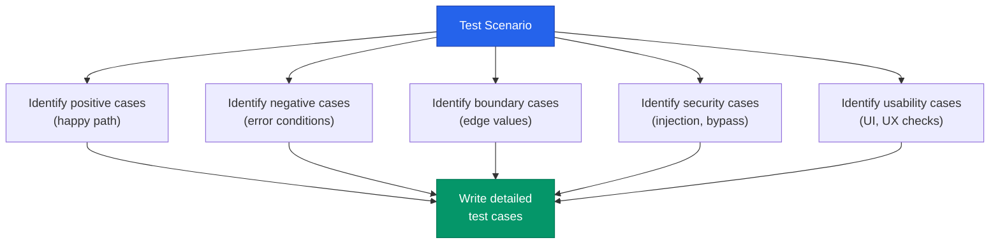
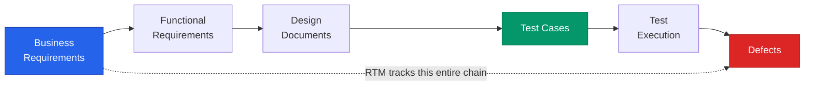
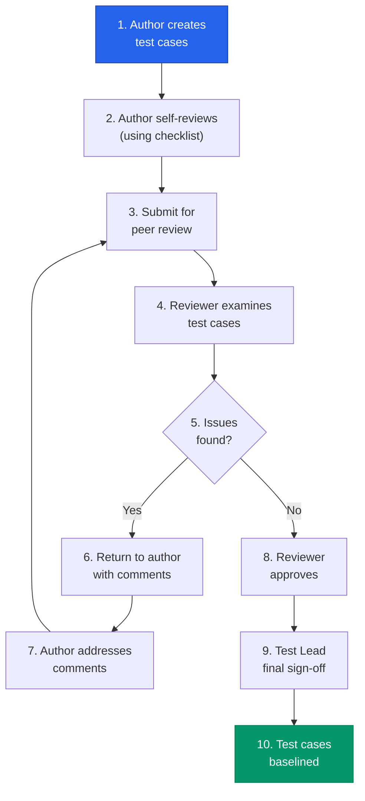

# Part 6: Test Case Development

---

## 6.1 Introduction to Test Cases

### What Is a Test Case?

A **test case** is a detailed document that specifies the **inputs, execution conditions, testing procedure, and expected results** for a particular test scenario. It defines a single unit of testing — one specific condition or functionality that needs to be verified against the expected behavior.

In simple terms, a test case answers: *"If I do THIS with THESE inputs under THESE conditions, the system should do THAT."*

**Formal Definition (IEEE 829):** *"A set of test inputs, execution conditions, and expected results developed for a particular objective, such as to exercise a particular program path or to verify compliance with a specific requirement."*

**Real-World Analogy:** Think of a test case like a recipe in a cookbook. It lists the ingredients (test data), the step-by-step cooking instructions (test steps), and a description of what the finished dish should look like (expected result). A chef (tester) follows the recipe and compares the actual dish (actual result) to the expected outcome.

### Why Test Cases Are Important

| Reason | Explanation |
|--------|-------------|
| **Systematic Coverage** | Ensures that all requirements are tested — nothing is accidentally skipped |
| **Repeatability** | Any tester can execute the same test case and get consistent results |
| **Documentation** | Provides a permanent record of what was tested, how, and with what outcome |
| **Regression Testing** | Pre-written test cases can be re-executed when changes are made to the software |
| **Progress Tracking** | Test execution status (Pass/Fail/Blocked) provides measurable project progress |
| **Knowledge Transfer** | New team members can understand the testing scope by reading existing test cases |
| **Compliance & Audit** | Many industries (healthcare, finance, aviation) require documented test evidence |
| **Defect Reproduction** | Well-written test cases make it easy to reproduce reported defects |
| **Estimation** | The number and complexity of test cases helps estimate testing effort and timelines |
| **Communication** | Serves as a contract between testers, developers, and business stakeholders about what "tested" means |

### Characteristics of a Good Test Case

A well-written test case should have these qualities (remember the acronym **CRISP-TRAM**):

| Characteristic | Description | Bad Example | Good Example |
|---------------|-------------|-------------|--------------|
| **C**lear | Unambiguous language, no jargon without definition | "Test the login" | "Enter valid email and password, click Login, verify dashboard is displayed" |
| **R**eusable | Can be used across multiple test cycles and regression | Test case tied to specific data | Test case with parameterized data |
| **I**ndependent | Does not depend on other test cases to run | "Run TC-05 first, then run this" | Self-contained with own preconditions |
| **S**pecific | Tests one specific condition or scenario | "Test all login scenarios" | "Test login with valid credentials" |
| **P**recise Expected Results | Clear, measurable, verifiable expected outcome | "Login should work" | "User is redirected to /dashboard, username 'John' displayed in header" |
| **T**raceable | Linked to a specific requirement or user story | No requirement reference | "Traces to REQ-AUTH-001" |
| **R**epeatable | Same result every time it's executed with same conditions | Depends on time of day or external state | Uses controlled test data and environment |
| **A**tomic | Tests one thing — one expected result per test case | Tests login AND logout in one case | Separate test cases for login and logout |
| **M**aintainable | Easy to update when requirements change | Hardcoded values everywhere | Parameterized data, modular steps |

> [!WARNING]
> The most common mistake in test case writing is **vague expected results**. "System should work correctly" is NOT an acceptable expected result. Always specify exactly WHAT the user should see, WHERE, and WHEN.

### Test Case vs Test Scenario vs Test Script

These three terms are frequently confused. Here's a clear differentiation:

| Aspect | Test Scenario | Test Case | Test Script |
|--------|--------------|-----------|-------------|
| **Definition** | A high-level description of *what* to test | A detailed description of *how* to test | An automated code implementation of a test case |
| **Granularity** | High-level (1 line) | Detailed (multiple steps) | Code-level (executable) |
| **Detail Level** | Minimal — describes the "what" | Complete — describes the "how" | Complete — includes code logic |
| **Example** | "Verify user can login" | Step-by-step login procedure with data and expected results | `selenium.findElement("login").click()` |
| **Created By** | Test Lead / Senior Tester | Test Engineer / QA Analyst | Automation Engineer / SDET |
| **Format** | One-liner or brief description | Structured template | Programming language code |
| **Relationship** | 1 scenario → many test cases | 1 test case → 1 test script | 1 script = 1 automated test case |
| **Used In** | Test planning, scope definition | Test execution (manual) | Test execution (automated) |

**Example Relationship:**

```
Test Scenario: "Verify Login Functionality"
  │
  ├── Test Case 1: Login with valid email and correct password
  ├── Test Case 2: Login with valid email and incorrect password
  ├── Test Case 3: Login with invalid email format
  ├── Test Case 4: Login with empty email and empty password
  ├── Test Case 5: Login with SQL injection in email field
  └── Test Case 6: Login with account that is locked
```

---

## 6.2 Test Case Writing Format

### Complete Test Case Template

Below is a comprehensive test case template with all fields that a professional QA team should use:

| Field | Description | Required? |
|-------|-------------|-----------|
| **Test Case ID** | Unique identifier following naming convention | Yes |
| **Test Suite / Module** | The module or feature area this test case belongs to | Yes |
| **Test Scenario / Title** | Brief, descriptive title of what is being tested | Yes |
| **Description** | Detailed explanation of the test case purpose | Yes |
| **Prerequisites / Preconditions** | Conditions that must be met before execution | Yes |
| **Test Steps** | Numbered, detailed steps to execute | Yes |
| **Test Data** | Specific data values to use during testing | Yes |
| **Expected Results** | Precise description of the expected outcome | Yes |
| **Actual Results** | What actually happened during execution | After execution |
| **Status** | Pass / Fail / Blocked / Not Executed / Skipped | After execution |
| **Priority** | High / Medium / Low — business importance | Yes |
| **Severity** | Critical / Major / Minor / Trivial — impact level | Yes |
| **Test Type** | Functional / Regression / Smoke / Sanity / UAT | Yes |
| **Requirement ID** | Traceability to requirement or user story | Yes |
| **Created By** | Name of the test case author | Yes |
| **Created Date** | Date the test case was written | Yes |
| **Reviewed By** | Name of the reviewer | After review |
| **Review Date** | Date of the review | After review |
| **Executed By** | Name of the tester who executed it | After execution |
| **Execution Date** | Date of execution | After execution |
| **Environment** | Browser, OS, device, environment (QA/Staging) | After execution |
| **Comments / Notes** | Additional observations, known issues | Optional |
| **Attachments** | Screenshots, logs, videos | Optional |
| **Defect ID** | Link to defect if test case failed | If failed |
| **Version** | Test case version number | Yes |
| **Last Modified** | Date of last update | Yes |

### Naming Convention for Test Case IDs

A well-structured naming convention makes test cases easy to find and organize:

**Format:** `TC_<Module>_<Number>`

| Module Abbreviation | Full Module Name |
|---------------------|-----------------|
| TC_LOG_001 | Login Module |
| TC_REG_001 | Registration Module |
| TC_CART_001 | Shopping Cart Module |
| TC_PAY_001 | Payment Module |
| TC_SRCH_001 | Search Module |
| TC_PROF_001 | User Profile Module |
| TC_ORD_001 | Order Management |
| TC_RPT_001 | Reporting Module |
| TC_ADMIN_001 | Admin Panel |
| TC_NOTIF_001 | Notifications Module |

> [!TIP]
> Some teams include the test type in the ID: `TC_LOG_FUN_001` (Functional), `TC_LOG_REG_001` (Regression), `TC_LOG_SEC_001` (Security). Choose a convention and stick with it consistently across the project.

---

### Sample Test Case 1: Login Functionality

| Field | Details |
|-------|---------|
| **Test Case ID** | TC_LOG_001 |
| **Test Suite** | Login Module |
| **Test Scenario** | Verify successful login with valid credentials |
| **Description** | This test case verifies that a registered user can successfully log in to the application using valid email and password, and is redirected to the dashboard page. |
| **Prerequisites** | 1. Application is accessible at https://staging.app.com<br/>2. User account exists: john.doe@email.com / Pass@1234<br/>3. Account is active (not locked, not suspended)<br/>4. Browser: Chrome v120+ |
| **Test Data** | Email: john.doe@email.com<br/>Password: Pass@1234 |

**Test Steps:**

| Step # | Action | Expected Result |
|--------|--------|-----------------|
| 1 | Navigate to https://staging.app.com/login | Login page is displayed with Email, Password fields, and Login button |
| 2 | Enter "john.doe@email.com" in the Email field | Email is entered and visible in the field |
| 3 | Enter "Pass@1234" in the Password field | Password is entered and masked (shown as dots) |
| 4 | Click the "Login" button | Loading spinner appears briefly |
| 5 | Observe the page after login processing | User is redirected to https://staging.app.com/dashboard |
| 6 | Verify the welcome message | "Welcome, John Doe" is displayed in the page header |
| 7 | Verify navigation menu is visible | Dashboard, Profile, Orders, Settings, Logout links are visible |

| Field | Details |
|-------|---------|
| **Expected Result** | User successfully logs in, is redirected to the dashboard, and sees their name in the header |
| **Actual Result** | *(To be filled during execution)* |
| **Status** | Not Executed |
| **Priority** | High |
| **Severity** | Critical |
| **Test Type** | Functional, Smoke |
| **Requirement ID** | REQ-AUTH-001 |
| **Created By** | Jane Smith |
| **Created Date** | 2026-05-20 |
| **Version** | 1.0 |

---

### Sample Test Case 2: Shopping Cart — Add Item

| Field | Details |
|-------|---------|
| **Test Case ID** | TC_CART_001 |
| **Test Suite** | Shopping Cart Module |
| **Test Scenario** | Verify that a user can add a product to the shopping cart |
| **Description** | This test case verifies that when a logged-in user clicks "Add to Cart" on a product page, the product is successfully added to the cart with the correct quantity, price, and product details. |
| **Prerequisites** | 1. User is logged in as john.doe@email.com<br/>2. Product "Wireless Bluetooth Headphones" (SKU: WBH-2024) exists and is in stock<br/>3. Shopping cart is empty<br/>4. Browser: Chrome v120+ |
| **Test Data** | Product: Wireless Bluetooth Headphones (SKU: WBH-2024)<br/>Price: $79.99<br/>Quantity: 1 (default) |

**Test Steps:**

| Step # | Action | Expected Result |
|--------|--------|-----------------|
| 1 | Navigate to https://staging.app.com/products/WBH-2024 | Product page is displayed showing "Wireless Bluetooth Headphones", price $79.99, "In Stock" badge |
| 2 | Verify the quantity selector shows "1" as default | Quantity field shows value "1" |
| 3 | Click the "Add to Cart" button | Success notification appears: "Wireless Bluetooth Headphones added to cart" |
| 4 | Observe the cart icon in the navigation header | Cart icon shows badge with number "1" |
| 5 | Click the cart icon to navigate to the cart page | Cart page is displayed at https://staging.app.com/cart |
| 6 | Verify the product is listed in the cart | Product name "Wireless Bluetooth Headphones", SKU "WBH-2024", Quantity "1", Price "$79.99" are displayed |
| 7 | Verify the cart subtotal | Subtotal shows "$79.99" |
| 8 | Verify the product image thumbnail | Product thumbnail image is displayed next to the product name |

| Field | Details |
|-------|---------|
| **Expected Result** | Product is added to cart with correct details; cart badge updates; cart page shows the product with accurate price and quantity |
| **Actual Result** | *(To be filled during execution)* |
| **Status** | Not Executed |
| **Priority** | High |
| **Severity** | Critical |
| **Test Type** | Functional |
| **Requirement ID** | REQ-CART-001 |
| **Created By** | Jane Smith |
| **Created Date** | 2026-05-20 |
| **Version** | 1.0 |

---

### Sample Test Case 3: Password Reset

| Field | Details |
|-------|---------|
| **Test Case ID** | TC_LOG_005 |
| **Test Suite** | Login Module |
| **Test Scenario** | Verify successful password reset via email link |
| **Description** | This test case verifies the complete password reset flow: user requests a password reset, receives an email with a reset link, clicks the link, enters a new password, and can log in with the new password. |
| **Prerequisites** | 1. Application is accessible at https://staging.app.com<br/>2. User account exists: jane.doe@email.com (active account)<br/>3. Access to email inbox for jane.doe@email.com<br/>4. Current password: OldPass@123<br/>5. Test email service is functional (Mailhog/Mailtrap) |
| **Test Data** | Email: jane.doe@email.com<br/>New Password: NewPass@456<br/>Confirm Password: NewPass@456 |

**Test Steps:**

| Step # | Action | Expected Result |
|--------|--------|-----------------|
| 1 | Navigate to https://staging.app.com/login | Login page is displayed |
| 2 | Click "Forgot Password?" link | Password reset page is displayed with Email field and "Send Reset Link" button |
| 3 | Enter "jane.doe@email.com" in the Email field | Email address is entered in the field |
| 4 | Click "Send Reset Link" button | Success message: "Password reset link sent to jane.doe@email.com. Check your inbox." |
| 5 | Open the email inbox for jane.doe@email.com | Email from "noreply@app.com" with subject "Password Reset Request" is received within 2 minutes |
| 6 | Open the email and verify its content | Email contains: greeting with user's name, reset link, expiry notice (24 hours), security warning |
| 7 | Click the "Reset Password" link/button in the email | Browser opens to the password reset page at https://staging.app.com/reset-password?token=xxx |
| 8 | Enter "NewPass@456" in the "New Password" field | Password is entered and masked |
| 9 | Enter "NewPass@456" in the "Confirm Password" field | Password is entered and masked |
| 10 | Click "Reset Password" button | Success message: "Your password has been reset successfully. You can now log in." |
| 11 | Click "Go to Login" or navigate to login page | Login page is displayed |
| 12 | Enter "jane.doe@email.com" and "NewPass@456", click Login | User successfully logs in, redirected to dashboard |
| 13 | (Cleanup) Reset password back to OldPass@123 if needed | Password restored for future test runs |

| Field | Details |
|-------|---------|
| **Expected Result** | Password reset email is received, new password is set successfully, user can log in with new password |
| **Actual Result** | *(To be filled during execution)* |
| **Status** | Not Executed |
| **Priority** | High |
| **Severity** | Critical |
| **Test Type** | Functional |
| **Requirement ID** | REQ-AUTH-005 |
| **Created By** | Jane Smith |
| **Created Date** | 2026-05-20 |
| **Version** | 1.0 |

---

### Sample Test Case 4: Search Functionality

| Field | Details |
|-------|---------|
| **Test Case ID** | TC_SRCH_001 |
| **Test Suite** | Search Module |
| **Test Scenario** | Verify search returns relevant results for a valid product name |
| **Description** | This test case verifies that when a user enters a valid product name in the search bar and initiates a search, the system returns relevant results that match the search term, with proper pagination and sorting. |
| **Prerequisites** | 1. Application is accessible<br/>2. Product catalog contains at least 10 products with "Headphones" in the name<br/>3. Search index is up-to-date<br/>4. User is on the home page |
| **Test Data** | Search term: "Wireless Headphones" |

**Test Steps:**

| Step # | Action | Expected Result |
|--------|--------|-----------------|
| 1 | Locate the search bar at the top of the page | Search bar with placeholder text "Search products..." and magnifying glass icon is visible |
| 2 | Click on the search bar | Search bar receives focus, cursor is blinking |
| 3 | Type "Wireless Headphones" in the search bar | Text "Wireless Headphones" appears in the search bar; autocomplete suggestions dropdown may appear |
| 4 | Press Enter key or click the search icon | Search results page is displayed at /search?q=Wireless+Headphones |
| 5 | Verify the search results header | Text "Search results for 'Wireless Headphones'" is displayed with the total number of results (e.g., "Showing 1-10 of 23 results") |
| 6 | Verify the first 3 results contain the search term | Each result shows product name containing "Wireless" or "Headphones" (or both), product image, price, and rating |
| 7 | Verify results are sorted by relevance (default) | Most relevant results (containing both "Wireless" AND "Headphones" in the title) appear first |
| 8 | Verify pagination | If more than 10 results, pagination controls (Next, Previous, page numbers) are displayed at the bottom |
| 9 | Click on the first search result | Product detail page for the selected product is displayed |
| 10 | Click the browser back button | Returns to the search results page with the same results and position |

| Field | Details |
|-------|---------|
| **Expected Result** | Search results page displays relevant products matching "Wireless Headphones" with correct count, pagination, and sorting |
| **Actual Result** | *(To be filled during execution)* |
| **Status** | Not Executed |
| **Priority** | High |
| **Severity** | Major |
| **Test Type** | Functional |
| **Requirement ID** | REQ-SRCH-001 |
| **Created By** | Jane Smith |
| **Created Date** | 2026-05-20 |
| **Version** | 1.0 |

---

## 6.3 Test Scenario vs Test Case

### Definitions with Examples

**Test Scenario** (also called Test Condition):
A one-line high-level description of **what** functionality needs to be tested. It describes the *goal* without specifying *how*.

**Test Case:**
A detailed document specifying **how** to test a particular scenario, including exact steps, test data, preconditions, and expected results.

| # | Test Scenario (What to test) | Test Case Examples (How to test) |
|---|-------|------|
| 1 | Verify user can register | TC1: Register with all valid data<br/>TC2: Register with existing email<br/>TC3: Register with invalid email format |
| 2 | Verify search functionality | TC1: Search with valid keyword<br/>TC2: Search with no results<br/>TC3: Search with special characters |
| 3 | Verify payment processing | TC1: Pay with valid credit card<br/>TC2: Pay with expired card<br/>TC3: Pay with insufficient balance |

### When to Use Scenarios vs Cases

| Use Test Scenarios When... | Use Test Cases When... |
|---------------------------|----------------------|
| Quick high-level planning is needed | Detailed test execution is required |
| Communicating scope to stakeholders | Repeatable testing across multiple cycles |
| Agile environments with exploratory testing | Regulatory/compliance testing needs documentation |
| Experienced testers who can fill in details | Junior testers need step-by-step guidance |
| Time-constrained testing (ad-hoc) | Formal test execution with pass/fail reporting |
| Early project phases (test estimation) | Test execution phase with evidence collection |

### How to Derive Test Cases from Scenarios

Follow this systematic process:



### Example: Payment Module — Scenarios to Test Cases

**Module: Payment Processing**

#### Test Scenarios (5):

| TS# | Test Scenario |
|-----|--------------|
| TS-PAY-001 | Verify successful payment with credit card |
| TS-PAY-002 | Verify payment with various card types |
| TS-PAY-003 | Verify payment failure handling |
| TS-PAY-004 | Verify payment with discount/coupon applied |
| TS-PAY-005 | Verify refund processing |

#### Derived Test Cases (18):

**From TS-PAY-001 (Successful Credit Card Payment):**

| TC ID | Test Case | Priority |
|-------|-----------|----------|
| TC_PAY_001 | Pay with valid Visa credit card — verify order confirmation, amount deducted, confirmation email sent | High |
| TC_PAY_002 | Pay with valid Visa debit card — verify order confirmation | High |
| TC_PAY_003 | Pay with 3D Secure enabled card — verify OTP/verification step, then order confirmation | High |
| TC_PAY_004 | Pay with saved card (tokenized) — verify no re-entry of card details needed | Medium |

**From TS-PAY-002 (Various Card Types):**

| TC ID | Test Case | Priority |
|-------|-----------|----------|
| TC_PAY_005 | Pay with MasterCard — verify acceptance and correct processing | High |
| TC_PAY_006 | Pay with American Express — verify acceptance (different CVV length) | Medium |
| TC_PAY_007 | Pay with Discover card — verify acceptance | Medium |
| TC_PAY_008 | Pay with international card (non-USD) — verify currency conversion | Medium |

**From TS-PAY-003 (Payment Failure):**

| TC ID | Test Case | Priority |
|-------|-----------|----------|
| TC_PAY_009 | Pay with expired card — verify "Card expired" error and retry option | High |
| TC_PAY_010 | Pay with insufficient funds — verify "Insufficient funds" error | High |
| TC_PAY_011 | Pay with invalid CVV — verify "Invalid security code" error | High |
| TC_PAY_012 | Pay during gateway timeout — verify graceful error, no double charge | Critical |
| TC_PAY_013 | Double-click the "Pay" button — verify only one transaction created | Critical |

**From TS-PAY-004 (Discount/Coupon):**

| TC ID | Test Case | Priority |
|-------|-----------|----------|
| TC_PAY_014 | Apply valid 20% coupon code, pay — verify discounted total charged | High |
| TC_PAY_015 | Apply expired coupon — verify "Coupon expired" error, full price shown | Medium |
| TC_PAY_016 | Apply coupon with minimum order requirement not met — verify error message | Medium |

**From TS-PAY-005 (Refund):**

| TC ID | Test Case | Priority |
|-------|-----------|----------|
| TC_PAY_017 | Request full refund for delivered order — verify refund amount matches original payment | High |
| TC_PAY_018 | Request partial refund (return 1 of 3 items) — verify correct partial amount refunded | High |

---

## 6.4 Test Case Design Best Practices

### 15+ Best Practices with Explanations

#### 1. Keep Test Cases Independent

Each test case should be **self-contained** — it should not depend on the execution or outcome of another test case.

**Why:** If test cases depend on each other, a failure in one test case causes a cascade of false failures. It also prevents parallel execution and makes it difficult to run individual test cases.

| ❌ Dependent (Bad) | ✓ Independent (Good) |
|---|---|
| TC1: Create user "john" | TC1: Create user "john" (prereq: no user "john" exists) |
| TC2: Login as "john" (requires TC1 to pass) | TC2: Login as "john" (prereq: user "john" exists with password "Pass@123") |
| TC3: Update "john's" profile (requires TC2) | TC3: Update profile for "john" (prereq: logged in as "john") |

#### 2. Use Clear, Descriptive Naming

Test case titles should clearly describe **what is being tested** and **the expected behavior**.

| ❌ Vague Title | ✓ Descriptive Title |
|---|---|
| "Test Login" | "Verify successful login with valid email and password" |
| "Check Cart" | "Verify adding multiple items to cart updates total correctly" |
| "Payment Test" | "Verify payment fails gracefully when credit card is expired" |

#### 3. Include Both Positive and Negative Cases

For every feature, create test cases that verify:
- **Positive cases:** Valid inputs that should work correctly
- **Negative cases:** Invalid inputs that should be handled gracefully

**Rule of Thumb:** For every positive test case, create at least 2-3 negative test cases.

#### 4. One Expected Result Per Test Case

Each test case should verify **one specific condition**. If you need to verify multiple conditions, create separate test cases.

| ❌ Multiple Objectives | ✓ Single Objective |
|---|---|
| "Verify login works AND verify dashboard loads AND verify profile link works" | TC1: "Verify login with valid credentials redirects to dashboard" |
| | TC2: "Verify dashboard displays user's name after login" |
| | TC3: "Verify profile link in dashboard navigates to profile page" |

#### 5. Write Reusable Test Cases

Design test cases that can be reused across multiple test cycles, environments, and releases.

**Techniques for reusability:**
- Use **variables** instead of hardcoded values: `{valid_email}` instead of "john@test.com"
- Create **parameterized test cases** that can be run with different data sets
- Avoid environment-specific URLs: use `{base_url}/login` instead of `https://qa.myapp.com/login`

#### 6. Maintain Traceability to Requirements

Every test case should trace back to at least one requirement, user story, or acceptance criterion. This ensures:
- 100% requirement coverage can be verified
- The impact of requirement changes on test cases is clear
- Unused test cases (testing no requirement) can be identified
- Test gaps (requirements with no test cases) are visible

#### 7. Peer Review All Test Cases

Before execution, test cases should be reviewed by at least one other team member. Fresh eyes catch:
- Missing scenarios
- Ambiguous steps
- Incorrect expected results
- Unnecessary duplication
- Assumptions that may not hold

#### 8. Write Clear Preconditions

Preconditions should specify **everything** that must be true before the test case can be executed.

| ❌ Vague Precondition | ✓ Specific Precondition |
|---|---|
| "User must be logged in" | "User 'john.doe@email.com' is logged in with password 'Pass@1234' on Chrome v120+ in the QA environment" |
| "Product should exist" | "Product 'Wireless Headphones' (SKU: WBH-2024, Price: $79.99) exists in catalog and is marked 'In Stock'" |

#### 9. Use Specific, Verifiable Test Data

Never use generic descriptions like "enter some text." Specify exact values.

| ❌ Generic | ✓ Specific |
|---|---|
| "Enter a valid email" | "Enter 'john.doe@email.com'" |
| "Enter a wrong password" | "Enter 'WrongPass@999'" |
| "Enter a large number" | "Enter '999999999'" |

#### 10. Include Cleanup/Teardown Steps

If a test case creates data or changes state, include steps to restore the system to its original state for subsequent test cases.

#### 11. Prioritize Test Cases

Not all test cases are equally important. Assign priority based on:
- **High:** Core business flows, critical security features, frequently used features
- **Medium:** Secondary features, alternative flows, non-critical validations
- **Low:** Edge cases, cosmetic checks, rarely used features

#### 12. Keep Test Steps Granular but Not Excessive

Each step should represent **one user action**. Don't combine multiple actions, but also don't break down trivial actions into sub-steps.

| ❌ Too Combined | ✓ Just Right | ❌ Too Granular |
|---|---|---|
| "Login and navigate to cart and add an item" | Step 1: "Navigate to login page"<br/>Step 2: "Enter email and password"<br/>Step 3: "Click Login" | Step 1: "Move mouse to browser address bar"<br/>Step 2: "Click on address bar"<br/>Step 3: "Type 'h'"<br/>Step 4: "Type 't'" |

#### 13. Document Assumptions

If a test case makes any assumptions about the system state, data, or environment, document them explicitly in the notes or preconditions.

#### 14. Use Consistent Terminology

Use the same terms for the same UI elements, features, and actions throughout all test cases. Create a glossary if needed.

| Inconsistent | Consistent |
|---|---|
| "Press Submit" / "Click the Submit button" / "Hit Submit" | Always: "Click the 'Submit' button" |
| "Login screen" / "Sign in page" / "Authentication form" | Always: "Login page" |

#### 15. Include Screenshots Where Needed

For complex UI interactions, include annotated screenshots showing:
- Where to click
- What fields to fill
- What the expected result looks like

#### 16. Version Control Test Cases

Track changes to test cases over time. When requirements change, update test cases and increment the version number. Maintain a change log.

---

## 6.5 Test Data Management

### What Is Test Data?

**Test data** is the data that is used to execute test cases. It includes input values, database records, configuration settings, files, and any other data that the system under test processes during testing.

Test data directly affects the quality of testing — if the data doesn't cover all scenarios, the testing is incomplete regardless of how well the test cases are designed.

### Types of Test Data

| Type | Description | Example |
|------|-------------|---------|
| **Valid Data** | Data that the system should accept and process correctly | Email: "user@example.com", Age: 25 |
| **Invalid Data** | Data that the system should reject gracefully | Email: "user@", Age: -5 |
| **Boundary Data** | Data at the edges of acceptable ranges | Age: 0, 1, 99, 100 for range [1-100] |
| **Production-like Data** | Data that resembles real production data in volume and variety | 10,000 customer records with realistic names, addresses |
| **Masked/Anonymized Data** | Production data with PII removed or replaced | Real transaction patterns but fake names/SSNs |
| **Synthetic Data** | Artificially generated data that mimics production patterns | Tool-generated data matching production distributions |
| **Edge Case Data** | Data that tests unusual but valid scenarios | Feb 29 date, name with apostrophe, maximum length string |
| **Performance Data** | Large volumes of data for load/performance testing | 1 million concurrent user records |

### Test Data Generation Techniques

| Technique | Description | Best For |
|-----------|-------------|----------|
| **Manual Creation** | Testers manually create test data for specific test cases | Small test suites, specific edge cases |
| **Database Scripts** | SQL scripts to insert/modify test data | Setting up and resetting test environments |
| **Data Factories** | Code libraries that generate test objects (e.g., FactoryBot, Faker) | Automated testing, API testing |
| **Production Data Copy** | Copy production database and mask sensitive fields | Realistic testing scenarios |
| **Data Generation Tools** | Tools like Mockaroo, GenerateData, Faker libraries | Large volumes of realistic data |
| **API-Based Setup** | Use application APIs to create test data before tests | Integration testing, API testing |
| **Test Data Repositories** | Centralized, version-controlled test data sets | Shared across teams and environments |

### Test Data Best Practices

1. **Never use production data directly** — Always mask or anonymize sensitive data
2. **Create test data scripts** — Automate data setup and teardown for repeatability
3. **Version control test data** — Track changes to test data alongside test cases
4. **Use data pools** — Maintain pools of reusable test data for common scenarios (valid emails, addresses, phone numbers)
5. **Plan for data dependencies** — Understand which test data is shared across test cases
6. **Clean up after tests** — Remove or reset test data after test execution to prevent data pollution
7. **Document data requirements** — Each test case should specify exactly what data it needs
8. **Consider data volume** — Test with realistic data volumes, not just 5-10 records
9. **Test with multilingual data** — Include Unicode, CJK characters, RTL text if applicable
10. **Refresh test data regularly** — Stale data can mask defects related to data processing

### Data Masking and Privacy Considerations

> [!WARNING]
> Using real customer data in test environments is a **significant legal and security risk**. Regulations like GDPR, HIPAA, CCPA, and PCI-DSS impose strict requirements on handling personal and financial data.

**Data Masking Techniques:**

| Technique | Description | Example |
|-----------|-------------|---------|
| **Substitution** | Replace real values with fake but realistic values | "John Smith" → "Jane Wilson" |
| **Shuffling** | Randomize the order of values within a column | Customer names randomly reassigned to different records |
| **Encryption** | Encrypt sensitive fields | SSN "123-45-6789" → "a1b2c3d4e5" |
| **Nulling** | Replace sensitive data with null/empty values | Phone: null |
| **Truncation** | Remove portions of data | "123-45-6789" → "***-**-6789" |
| **Date Aging** | Shift dates by a consistent offset | All dates shifted forward by 6 months |
| **Number Variance** | Add random variance to numeric values | Salary $50,000 → $52,347 (within ±10%) |

**Compliance Requirements by Regulation:**

| Regulation | Key Requirements for Test Data |
|-----------|-------------------------------|
| **GDPR** (EU) | No real EU citizen data in test environments; data minimization; right to be forgotten |
| **HIPAA** (US Healthcare) | PHI must be de-identified; Safe Harbor method requires removal of 18 identifier types |
| **PCI-DSS** (Payment Cards) | No real card numbers in test environments; use test card numbers (e.g., Stripe test cards) |
| **CCPA** (California) | Consumer personal information must be masked; consumers can request data deletion |
| **SOX** (Financial) | Audit trail for all data access; segregation of test and production environments |

---

## 6.6 Requirement Traceability Matrix (RTM)

### What Is RTM?

A **Requirement Traceability Matrix (RTM)** is a document that maps and traces **requirements** to their corresponding **test cases** (and other artifacts like design documents, code modules, and defects). It provides a systematic way to verify that all requirements have been tested and no requirement is left uncovered.

Think of RTM as a **cross-reference table** that answers:
- Is every requirement covered by at least one test case?
- Is every test case linked to a valid requirement?
- What is the overall test coverage status?



### Types of RTM

| Type | Direction | Purpose | When to Use |
|------|-----------|---------|-------------|
| **Forward Traceability** | Requirements → Test Cases | Ensures every requirement has corresponding test cases | Verify test coverage |
| **Backward Traceability** | Test Cases → Requirements | Ensures every test case traces to a valid requirement | Identify orphan test cases |
| **Bi-Directional Traceability** | Requirements ↔ Test Cases | Combines both directions for complete traceability | Comprehensive quality assurance, audits |

### How to Create RTM (Step-by-Step)

**Step 1: Gather all requirements**
Collect all business requirements, functional requirements, and user stories from the requirements document, BRD, FRD, or backlog.

**Step 2: Assign unique requirement IDs**
If requirements don't already have IDs, assign them (e.g., REQ-001, REQ-002, or US-001 for user stories).

**Step 3: Identify test cases for each requirement**
Map each requirement to the test case(s) that verify it.

**Step 4: Add additional traceability columns**
Include design documents, code modules, test results, and defect IDs.

**Step 5: Review and validate the matrix**
Check for gaps (requirements with no test cases) and orphans (test cases with no requirements).

**Step 6: Maintain throughout the project**
Update the RTM whenever requirements change, new test cases are added, or defects are found.

### RTM Template — Full Sample

| Req ID | Requirement Description | Priority | Design Ref | Test Case IDs | Test Status | Defect IDs | Coverage |
|--------|------------------------|----------|-----------|---------------|-------------|-----------|----------|
| REQ-AUTH-001 | User shall be able to login with valid email and password | High | DD-AUTH-01 | TC_LOG_001, TC_LOG_002, TC_LOG_003 | TC_LOG_001: Pass, TC_LOG_002: Pass, TC_LOG_003: Pass | None | 100% |
| REQ-AUTH-002 | System shall lock account after 5 consecutive failed login attempts | High | DD-AUTH-02 | TC_LOG_010, TC_LOG_011 | TC_LOG_010: Pass, TC_LOG_011: Fail | DEF-042 | 50% |
| REQ-AUTH-003 | User shall be able to reset password via email link | High | DD-AUTH-03 | TC_LOG_005, TC_LOG_006, TC_LOG_007 | TC_LOG_005: Pass, TC_LOG_006: Pass, TC_LOG_007: Blocked | DEF-045 | 67% |
| REQ-REG-001 | New user shall be able to register with name, email, and password | High | DD-REG-01 | TC_REG_001, TC_REG_002, TC_REG_003, TC_REG_004 | TC_REG_001: Pass, TC_REG_002: Pass, TC_REG_003: Pass, TC_REG_004: Pass | None | 100% |
| REQ-REG-002 | System shall validate email uniqueness during registration | Medium | DD-REG-02 | TC_REG_005 | TC_REG_005: Pass | None | 100% |
| REQ-CART-001 | User shall be able to add products to shopping cart | High | DD-CART-01 | TC_CART_001, TC_CART_002, TC_CART_003 | TC_CART_001: Pass, TC_CART_002: Pass, TC_CART_003: Fail | DEF-051 | 67% |
| REQ-CART-002 | Cart shall display accurate subtotal based on items and quantities | High | DD-CART-02 | TC_CART_004, TC_CART_005 | TC_CART_004: Pass, TC_CART_005: Pass | None | 100% |
| REQ-PAY-001 | System shall process credit card payments securely via payment gateway | Critical | DD-PAY-01 | TC_PAY_001, TC_PAY_002, TC_PAY_009, TC_PAY_010 | TC_PAY_001: Pass, TC_PAY_002: Pass, TC_PAY_009: Pass, TC_PAY_010: Fail | DEF-055 | 75% |
| REQ-SRCH-001 | User shall be able to search products by keyword | Medium | DD-SRCH-01 | TC_SRCH_001, TC_SRCH_002, TC_SRCH_003 | TC_SRCH_001: Pass, TC_SRCH_002: Pass, TC_SRCH_003: Pass | None | 100% |
| REQ-ORD-001 | User shall receive order confirmation email after successful payment | High | DD-ORD-01 | TC_ORD_001, TC_ORD_002 | TC_ORD_001: Pass, TC_ORD_002: Pass | None | 100% |
| REQ-ORD-002 | User shall be able to track order status (Placed, Shipped, Delivered) | Medium | DD-ORD-02 | TC_ORD_003, TC_ORD_004, TC_ORD_005 | TC_ORD_003: Pass, TC_ORD_004: Not Executed, TC_ORD_005: Not Executed | None | 33% |
| REQ-PROF-001 | User shall be able to update profile information (name, phone, address) | Low | DD-PROF-01 | TC_PROF_001, TC_PROF_002 | TC_PROF_001: Not Executed, TC_PROF_002: Not Executed | None | 0% |

### RTM Summary Analysis

| Metric | Value |
|--------|-------|
| Total Requirements | 12 |
| Requirements with Test Cases | 12 (100%) |
| Requirements Fully Tested (100% pass) | 6 (50%) |
| Requirements with Failures | 3 (25%) |
| Requirements Not Yet Tested | 2 (17%) |
| Requirements Partially Tested | 1 (8%) |
| Total Test Cases | 33 |
| Test Cases Passed | 25 (76%) |
| Test Cases Failed | 3 (9%) |
| Test Cases Blocked | 1 (3%) |
| Test Cases Not Executed | 4 (12%) |
| Open Defects | 3 (DEF-042, DEF-045, DEF-051, DEF-055) |

### Benefits of RTM

| Benefit | Explanation |
|---------|-------------|
| **Gap Analysis** | Reveals requirements without test cases (coverage gaps) |
| **Impact Analysis** | Shows which test cases are affected when a requirement changes |
| **Orphan Detection** | Identifies test cases not linked to any requirement |
| **Progress Tracking** | Provides quantitative test execution progress |
| **Audit Compliance** | Demonstrates systematic testing for regulatory audits |
| **Release Readiness** | Helps decide if the product is ready for release based on coverage |
| **Communication** | Provides stakeholders with clear visibility into testing status |
| **Prioritization** | Helps focus testing on high-priority, uncovered requirements |

### RTM Tools

| Tool | Type | Cost | Best For |
|------|------|------|----------|
| **Jira + Zephyr/Xray** | Integrated | Paid | Agile teams using Jira |
| **Azure DevOps** | Integrated | Paid (Free tier) | Microsoft ecosystem teams |
| **TestRail** | Standalone | Paid | Dedicated test management |
| **qTest** | Standalone | Paid | Enterprise test management |
| **HP ALM / Quality Center** | Enterprise | Paid | Large enterprise projects |
| **Excel / Google Sheets** | Manual | Free | Small teams, simple projects |
| **Zephyr Scale** | Jira Plugin | Paid | Jira-based test management |
| **PractiTest** | Standalone | Paid | Cross-tool integration |

> [!TIP]
> Even if your team uses a test management tool, export RTM data to Excel for stakeholder presentations. Not all stakeholders have access to testing tools, but everyone can read a spreadsheet.

---

## 6.7 Test Case Review Process

### Why Review Test Cases?

Test case review is a **quality gate** that prevents defective test cases from reaching the execution phase. Just as developers review code, testers should review test cases before execution.

**Benefits of Test Case Review:**

| Benefit | Impact |
|---------|--------|
| **Catch missing scenarios** | Reviewers identify test cases the author didn't think of |
| **Eliminate ambiguity** | Unclear steps are clarified before execution |
| **Ensure accuracy** | Incorrect expected results are corrected |
| **Reduce redundancy** | Duplicate test cases are identified and removed |
| **Improve consistency** | Ensure all test cases follow the same format and conventions |
| **Knowledge sharing** | Reviewers learn about features they may not be familiar with |
| **Reduce rework** | Issues found during review are cheaper to fix than during execution |
| **Improve traceability** | Ensure all test cases are linked to requirements |

### Review Checklist (20+ Items)

| # | Category | Review Item | Status |
|---|----------|------------|--------|
| 1 | **Coverage** | Does the test case trace to a specific requirement? | ☐ |
| 2 | **Coverage** | Are all positive (happy path) scenarios covered? | ☐ |
| 3 | **Coverage** | Are all negative (error) scenarios covered? | ☐ |
| 4 | **Coverage** | Are boundary values tested? | ☐ |
| 5 | **Coverage** | Are all business rules from the requirements tested? | ☐ |
| 6 | **Format** | Does the test case follow the standard template? | ☐ |
| 7 | **Format** | Is the test case ID following the naming convention? | ☐ |
| 8 | **Format** | Is the priority and severity correctly assigned? | ☐ |
| 9 | **Clarity** | Are the test steps clear and unambiguous? | ☐ |
| 10 | **Clarity** | Can a new team member execute this test case without questions? | ☐ |
| 11 | **Clarity** | Is the expected result specific and verifiable? | ☐ |
| 12 | **Data** | Is the test data explicitly specified? | ☐ |
| 13 | **Data** | Is the test data realistic and valid? | ☐ |
| 14 | **Data** | Are data privacy requirements met (no real PII)? | ☐ |
| 15 | **Prerequisites** | Are all prerequisites clearly listed? | ☐ |
| 16 | **Prerequisites** | Are prerequisites achievable in the test environment? | ☐ |
| 17 | **Independence** | Is the test case independent of other test cases? | ☐ |
| 18 | **Independence** | If dependent, is the dependency explicitly documented? | ☐ |
| 19 | **Atomicity** | Does the test case test only ONE condition? | ☐ |
| 20 | **Accuracy** | Is the expected result correct per the requirements? | ☐ |
| 21 | **Completeness** | Are cleanup/teardown steps included if needed? | ☐ |
| 22 | **Reusability** | Can this test case be reused in regression? | ☐ |
| 23 | **Grammar** | Are there any spelling or grammatical errors? | ☐ |
| 24 | **Duplication** | Is this test case a duplicate of another? | ☐ |
| 25 | **Environment** | Are environment requirements specified? | ☐ |

### Review Process Steps



### Peer Review vs Formal Review

| Aspect | Peer Review | Formal Review |
|--------|-------------|---------------|
| **Formality** | Informal, collegial | Structured, documented |
| **Participants** | 1-2 peers | Review board (3-5 members) |
| **Documentation** | Comments in tool or email | Formal review report, meeting minutes |
| **Time Investment** | 30 min - 1 hour | 2-4 hours (including meeting) |
| **When to Use** | Agile projects, routine test cases | Critical systems, compliance-required, high-risk features |
| **Output** | Approved with comments | Signed review report |
| **Follow-up** | Informal verification | Formal re-review required |

### Common Test Case Defects Found in Review

| # | Defect Type | Example | Impact |
|---|------------|---------|--------|
| 1 | **Vague expected result** | "System should work properly" | Tester cannot determine pass/fail |
| 2 | **Missing negative test** | Only valid login tested, no invalid scenarios | Defects in error handling missed |
| 3 | **Wrong expected result** | Expected "200 OK" but spec says "201 Created" | False failures during execution |
| 4 | **Missing precondition** | Test assumes data exists but doesn't specify it | Test case fails due to missing setup |
| 5 | **Duplicate test case** | Two test cases test exact same scenario | Wasted testing effort |
| 6 | **Missing boundary test** | Range [1-100] tested with 50 only | Boundary defects missed |
| 7 | **Hardcoded environment data** | URL: "https://qa1.app.com" — fails in other environments | Not portable across environments |
| 8 | **Combined test objectives** | One test case tests login AND logout AND search | Cannot isolate failures |
| 9 | **Missing test data** | "Enter valid credit card" — which card number? | Tester must guess or ask |
| 10 | **Untraceable test case** | No requirement ID linked | Coverage gaps invisible |

### Sign-Off Process

After review is complete and all comments are addressed:

1. **Reviewer signs off** — Marks the test case as "Reviewed and Approved"
2. **Test Lead validates** — Confirms coverage is adequate for the requirement
3. **Baseline created** — Test cases are versioned and locked for the current test cycle
4. **Distribution** — Approved test cases are distributed to the execution team

---

## 6.8 Test Case Prioritization

### Why Prioritize?

In real-world projects, it's rare to have unlimited time to execute all test cases. Test case prioritization ensures that the **most important tests are executed first**, maximizing defect detection within the available time.

> [!IMPORTANT]
> Prioritization is especially critical in Agile sprints where testing time is limited, and during regression testing where the full suite may take days to execute.

### Prioritization Techniques

#### 1. Risk-Based Prioritization

Prioritize test cases based on the **risk** associated with the feature they test:

| Risk Factor | Description | Weight |
|------------|-------------|--------|
| **Business Impact** | How critical is this feature to the business? | High |
| **User Frequency** | How often do users use this feature? | High |
| **Technical Complexity** | How complex is the implementation? | Medium |
| **Change Frequency** | How often is this area modified? | Medium |
| **Defect History** | How many defects were previously found here? | High |
| **Integration Points** | How many other systems does it interact with? | Medium |

**Risk Score = Business Impact × Probability of Failure**

| Feature | Business Impact (1-5) | Failure Probability (1-5) | Risk Score | Priority |
|---------|---------------------|-------------------------|------------|----------|
| Payment Processing | 5 | 4 | 20 | P1 - Critical |
| User Login | 5 | 2 | 10 | P2 - High |
| Product Search | 4 | 2 | 8 | P2 - High |
| Order History | 3 | 2 | 6 | P3 - Medium |
| User Profile Edit | 2 | 1 | 2 | P4 - Low |
| FAQ Page | 1 | 1 | 1 | P4 - Low |

#### 2. Business Impact Analysis

Prioritize based on the direct business impact of a feature failure:

| Priority Level | Criteria | Examples |
|---------------|----------|----------|
| **P1 - Critical** | Feature failure prevents revenue generation or causes legal/compliance issues | Payment, checkout, user authentication, data security |
| **P2 - High** | Feature failure significantly impacts user experience or core functionality | Search, add to cart, order tracking, registration |
| **P3 - Medium** | Feature failure causes inconvenience but workarounds exist | Filters, sorting, email notifications, profile updates |
| **P4 - Low** | Feature failure has minimal impact; cosmetic or rarely used features | Tooltips, color themes, advanced settings, FAQ |

#### 3. MoSCoW Method

| Category | Description | Testing Priority |
|----------|-------------|-----------------|
| **Must Have** | Core features without which the system is unusable | Test first, every cycle |
| **Should Have** | Important features expected by most users | Test second, every cycle |
| **Could Have** | Nice-to-have features that enhance the experience | Test if time permits |
| **Won't Have** | Out of scope for current release | Don't test this cycle |

#### 4. Coverage-Based Prioritization

Prioritize test cases that cover the most **unique code paths** or **requirements**:

1. Rank test cases by the number of requirements they cover
2. Select the test case that covers the most uncovered requirements
3. Repeat until all requirements are covered
4. Remaining test cases are lower priority

> [!TIP]
> **Practical Approach:** When time is extremely limited (e.g., hotfix release), execute test cases in this order:
> 1. Smoke tests (verify basic functionality)
> 2. Tests for the changed/fixed area
> 3. Tests for areas with high risk of regression
> 4. High-priority test cases from the full suite
> 5. Medium and low-priority test cases (if time permits)

---

## 6.9 Test Case Maintenance

### When to Update Test Cases

Test cases are living documents that need to be maintained throughout the project lifecycle. Update them when:

| Trigger | Action Required |
|---------|----------------|
| **Requirement change** | Update test cases to reflect new or modified requirements |
| **Bug fix** | Add new test cases to prevent regression of the fixed bug |
| **UI change** | Update test steps that reference specific UI elements |
| **New feature** | Create new test cases for the new feature |
| **Feature removal** | Mark related test cases as obsolete or archive them |
| **Environment change** | Update environment-specific test data and URLs |
| **Process improvement** | Improve test case clarity based on execution feedback |
| **Defect found during execution** | Add missing test cases that should have caught the defect |
| **Technology migration** | Update test cases for the new technology platform |

### Version Control for Test Cases

Just like code, test cases benefit from version control:

| Practice | Description |
|----------|-------------|
| **Version numbering** | Use semantic versioning (1.0, 1.1, 2.0) or date-based versioning |
| **Change log** | Maintain a log of what changed, when, why, and by whom |
| **Baseline management** | Create baselines (snapshots) at the start of each test cycle |
| **Branching** | In test management tools, maintain separate versions for different releases |
| **Review before update** | Changes to baselined test cases should go through review |

**Test Case Change Log Example:**

| Version | Date | Changed By | Description of Change |
|---------|------|-----------|----------------------|
| 1.0 | 2026-01-15 | Jane Smith | Initial creation |
| 1.1 | 2026-02-20 | John Doe | Updated expected result for login redirect (now goes to /home instead of /dashboard) |
| 1.2 | 2026-03-10 | Jane Smith | Added step for 2FA verification (new requirement REQ-AUTH-008) |
| 2.0 | 2026-04-01 | John Doe | Major rewrite — UI redesign changed all login page elements |

### Obsolete Test Case Handling

Test cases become obsolete when the feature they test is removed, fundamentally changed, or replaced. Handle obsolete test cases carefully:

| Approach | Pros | Cons |
|----------|------|------|
| **Archive** (move to archive folder) | Preserves history, can be referenced | Clutters archive over time |
| **Mark as Obsolete** (change status) | Stays in the same location, easy to find | May confuse testers who see it in the suite |
| **Delete** (permanent removal) | Clean test suite | Loses history, cannot recover |
| **Deprecate** (mark as deprecated with reason and date) | Clear status, history preserved | Needs periodic cleanup |

> [!TIP]
> **Recommended Approach:** Mark test cases as "Deprecated" with a reason and date. During quarterly reviews, archive deprecated test cases older than 6 months. Never hard-delete test cases in regulated industries.

**Maintenance Workflow:**

```mermaid
graph TD
    A["Trigger: Requirement/<br/>Feature Change"] --> B{"Is the test case<br/>still relevant?"}

    B -->|"Yes, needs update"| C["Update test case<br/>steps/data/expected results"]
    B -->|"No, feature removed"| D["Mark as Deprecated<br/>with reason & date"]
    B -->|"Partially relevant"| E["Split into new<br/>test cases"]

    C --> F["Increment version"]
    D --> G["Quarterly archive review"]
    E --> F

    F --> H["Submit for<br/>peer review"]
    H --> I["Update RTM"]

    style A fill:#d97706,stroke:#b45309,color:#fff
    style I fill:#059669,stroke:#047857,color:#fff
```



---

## 6.10 Interview Questions

### Q1: What is the difference between a Test Case and a Test Scenario?

**Model Answer:**
"A **test scenario** is a high-level description of *what* to test — it's a one-liner that describes the functionality. For example: 'Verify that a user can login successfully.'

A **test case** is a detailed document describing *how* to test that scenario — it includes specific steps, test data, preconditions, and expected results. From the login scenario, we might derive multiple test cases: login with valid credentials, login with wrong password, login with locked account, etc.

The relationship is one-to-many: one test scenario typically generates multiple test cases. Test scenarios are used for planning and scope estimation, while test cases are used for actual test execution.

In practice, I create test scenarios first during test planning to estimate scope, then drill down into detailed test cases during test design."

---

### Q2: What are the characteristics of a good test case?

**Model Answer:**
"A good test case should have these key characteristics — I use the acronym CRISP:

1. **Clear** — Written in plain language that any tester can understand, with no ambiguous steps
2. **Reusable** — Can be executed across multiple test cycles and environments without modification
3. **Independent** — Does not depend on other test cases for its execution
4. **Specific** — Tests one specific condition with one clear expected result
5. **Precise Expected Results** — The expected outcome is measurable and verifiable, not vague like 'should work correctly'

Additionally:
- **Traceable** — Linked to a specific requirement
- **Repeatable** — Produces the same result every time under the same conditions
- **Maintainable** — Easy to update when requirements change

The most common mistake I see is vague expected results. Instead of 'login should work,' the expected result should be 'User is redirected to the dashboard at /dashboard, and the header displays Welcome, John Doe.'"

---

### Q3: What is a Requirement Traceability Matrix? Why is it important?

**Model Answer:**
"A Requirement Traceability Matrix, or RTM, is a document that maps requirements to their corresponding test cases, creating a cross-reference that ensures complete test coverage.

It's important for several reasons:
1. **Coverage verification** — It reveals if any requirement lacks test cases (a gap)
2. **Impact analysis** — When a requirement changes, the RTM shows exactly which test cases need updating
3. **Orphan detection** — Identifies test cases that don't trace to any requirement, which may be unnecessary
4. **Progress tracking** — Shows testing progress as a percentage of requirements tested
5. **Audit compliance** — In regulated industries, RTM is often mandatory to demonstrate testing rigor

In practice, I maintain the RTM throughout the project lifecycle. At project start, I create forward traceability (requirements → test cases). During execution, I update it with test results and defect IDs. For release decisions, the RTM provides quantitative data on coverage and risk.

A typical RTM has columns for: Requirement ID, Requirement Description, Test Case IDs, Test Status, and Defect IDs."

---

### Q4: How do you prioritize test cases when there's limited time for testing?

**Model Answer:**
"When time is limited, I use a risk-based approach to prioritize test cases. I consider:

1. **Business criticality** — Features that directly impact revenue (payment, checkout) are tested first
2. **User frequency** — Features used by most users daily (login, search, navigation) get priority
3. **Defect history** — Areas with a history of defects are more likely to have new ones
4. **Change impact** — Recently modified code areas need thorough testing
5. **Regulatory requirements** — Compliance-related features must always be tested

I typically organize test execution in this order:
- **First:** Smoke test (10-20 key test cases to verify basic functionality)
- **Second:** Test cases for changed/fixed areas
- **Third:** High-risk regression test cases
- **Fourth:** Medium and low-priority test cases

I also communicate the risk of not executing low-priority test cases to stakeholders so they can make informed release decisions."

---

### Q5: Explain the test case review process. What do you look for during review?

**Model Answer:**
"The test case review process is a quality gate before execution. Here's how I approach it:

**Process:**
1. The author self-reviews using a checklist
2. Test cases are submitted for peer review
3. The reviewer examines each test case against a review checklist
4. Comments are provided for improvements
5. The author addresses comments
6. Final approval and sign-off

**What I look for during review:**
- **Coverage:** Are all requirements covered, including positive, negative, and boundary cases?
- **Clarity:** Can a new team member execute this without asking questions?
- **Accuracy:** Are expected results correct per the requirements?
- **Test data:** Is specific, realistic test data provided?
- **Independence:** Does any test case depend on another?
- **Completeness:** Are preconditions, steps, and expected results all filled in?
- **Traceability:** Is every test case linked to a requirement?
- **Duplication:** Are there redundant test cases?

I typically find issues like vague expected results, missing negative test cases, and unspecified test data. Catching these before execution saves significant time and prevents false test results."

---

### Q6: How do you handle test data for test cases? What are the challenges?

**Model Answer:**
"Test data management is one of the most challenging aspects of testing. Here's my approach:

**How I handle test data:**
1. **Define data requirements** per test case — exactly what data is needed
2. **Create reusable data sets** — pools of valid/invalid data for common scenarios
3. **Use data generation tools** — Faker libraries or Mockaroo for large datasets
4. **Automate data setup** — Scripts to create/reset data before test runs
5. **Maintain data independently** — Test data stored separately from test cases for easy updates

**Key challenges:**
- **Data privacy** — Can't use real production data due to GDPR, HIPAA, PCI-DSS. I use masked or synthetic data.
- **Data dependencies** — Some test cases need related data across tables (e.g., order needs customer + product + address)
- **Data freshness** — Test data can become stale as the application evolves
- **Environment consistency** — Ensuring the same data exists across QA, staging, and UAT environments
- **Data volume** — Performance testing needs realistic data volumes, not just 10 records

**Best practice:** I always use separate test data for each test environment and never share data between test cycles. This prevents one tester's execution from affecting another's results."

---

### Q7: What is the difference between test case priority and severity?

**Model Answer:**
"Priority and severity are related but different concepts:

**Priority** indicates **when** a test case should be executed — it's based on business importance:
- **High priority:** Must be tested first, in every cycle
- **Medium priority:** Tested after high-priority cases
- **Low priority:** Tested if time permits

**Severity** indicates the **impact** if the test case reveals a defect:
- **Critical:** System crash, data loss, security breach
- **Major:** Feature doesn't work, no workaround
- **Minor:** Feature works but with issues, workaround exists
- **Trivial:** Cosmetic issue, no functional impact

**They can differ:** A spelling error on the login page is **low severity** (cosmetic) but **high priority** (login page is seen by every user). Conversely, a crash in an admin report used once a quarter is **critical severity** but may be **medium priority** for testing.

In practice, I use priority to plan test execution order and severity to assess the risk if we skip certain test cases."

---

### Q8: How do you maintain test cases when requirements change frequently?

**Model Answer:**
"Frequent requirement changes are common, especially in Agile projects. My approach:

1. **Version control test cases** — Every change gets a new version with a change log entry noting what changed and why
2. **Use RTM for impact analysis** — When a requirement changes, the RTM immediately shows which test cases are affected
3. **Modular test case design** — I keep test cases small and focused, so changes affect fewer test cases
4. **Parameterize test data** — Rather than hardcoding data in steps, I reference test data separately, so data changes don't require step updates
5. **Regular maintenance sprints** — In Agile, I allocate time each sprint to update test cases from the previous sprint's changes
6. **Deprecation policy** — Clearly mark outdated test cases as deprecated with a reason, so they're not accidentally executed
7. **Communication** — I attend requirement change meetings (CCB) to understand changes early and start updating test cases immediately

The key is treating test cases as living documents — they're never 'done' in an active project."

---

### Q9: Explain forward and backward traceability. Why do we need both?

**Model Answer:**
"**Forward traceability** maps from **requirements → test cases**. It answers: 'Is every requirement covered by at least one test case?' This ensures we haven't missed testing any requirement.

**Backward traceability** maps from **test cases → requirements**. It answers: 'Does every test case trace back to a valid requirement?' This identifies orphan test cases — test cases that don't verify any requirement and may be unnecessary.

We need both because:
- Forward traceability alone might miss orphan test cases (wasted effort)
- Backward traceability alone might miss uncovered requirements (coverage gaps)

Together, they form **bi-directional traceability**, which provides complete visibility:
- Every requirement has at least one test case (no gaps)
- Every test case is justified by a requirement (no waste)
- Changes in either direction are traceable

In practice, test management tools like Jira+Xray or TestRail provide bi-directional traceability automatically when you link test cases to requirements."

---

### Q10: What are the common mistakes you've seen in test case writing?

**Model Answer:**
"Based on my experience reviewing hundreds of test cases, the most common mistakes are:

1. **Vague expected results** — 'System should work correctly' instead of specifying exact behavior, messages, and UI changes
2. **Missing negative test cases** — Only testing happy path, ignoring error scenarios
3. **Dependent test cases** — Test case B requires test case A to pass first, causing cascading failures
4. **No test data specified** — 'Enter valid email' without specifying which email
5. **Multiple objectives** — One test case trying to verify login, navigation, and profile simultaneously
6. **Missing preconditions** — Assuming the tester knows the setup needed
7. **Too high-level steps** — 'Test the login feature' as a single step
8. **Hardcoded environment data** — URLs, credentials, and data specific to one environment
9. **No requirement traceability** — Test cases not linked to any requirement
10. **Copy-paste errors** — Test cases copied from similar ones but not fully updated

The fix is systematic: establish a test case template, implement a peer review process with a checklist, and regularly audit test case quality. In my teams, we reduced these issues by 80% after implementing mandatory peer review."

---

### Q11: How many test cases should you write for a given requirement?

**Model Answer:**
"There's no fixed number — it depends on the complexity of the requirement. However, I use a structured approach:

**Minimum test cases per requirement:**
- At least **1 positive test case** (happy path)
- At least **2-3 negative test cases** (error scenarios)
- **Boundary test cases** if the requirement involves ranges
- **Edge case test cases** based on error guessing

**General guidelines:**
- Simple requirement (e.g., 'Display user name'): 2-3 test cases
- Medium requirement (e.g., 'User login with validation'): 5-10 test cases
- Complex requirement (e.g., 'Calculate insurance premium based on 5 factors'): 15-30 test cases

I use test design techniques to determine the right number:
- **Equivalence Partitioning**: 1 test case per partition
- **Boundary Value Analysis**: 2-6 test cases per boundary
- **Decision Table**: One test case per rule
- **State Transition**: One test case per transition path

The goal is **sufficient coverage, not maximum test cases**. Over-testing wastes time; under-testing risks defects. The right balance comes from applying techniques systematically and using risk to guide depth."

---

## 6.11 Key Takeaways

### Summary of Core Concepts

| # | Key Takeaway |
|---|-------------|
| 1 | **A test case is the fundamental unit of testing** — it defines what to test, how to test it, and what the expected outcome should be |
| 2 | **Good test cases are CRISP** — Clear, Reusable, Independent, Specific, and Precise in expected results |
| 3 | **Test scenarios describe WHAT to test; test cases describe HOW to test** — one scenario generates multiple test cases |
| 4 | **Follow a standard template** — Use consistent format with all essential fields (ID, steps, data, expected results, preconditions) |
| 5 | **Test data is as important as test steps** — Specify exact, realistic data values; never leave data ambiguous |
| 6 | **RTM ensures complete coverage** — Use bi-directional traceability to verify every requirement is tested and every test case is justified |
| 7 | **Review test cases before execution** — Peer review with a checklist catches missing scenarios, ambiguity, and errors before they waste execution time |
| 8 | **Prioritize test cases by risk** — When time is limited, test the highest-risk, highest-impact features first |
| 9 | **Test cases are living documents** — Maintain, version, and update them as requirements evolve; deprecate what's no longer relevant |
| 10 | **Test data privacy is non-negotiable** — Never use real production data in test environments; mask, anonymize, or generate synthetic data |
| 11 | **One test case = one objective** — Avoid cramming multiple verifications into a single test case; keep them atomic |
| 12 | **Write for your future self (and others)** — Test cases should be so clear that anyone can execute them months later without asking questions |

> [!TIP]
> **The Ultimate Test Case Quality Check:** Before finalizing any test case, ask yourself: *"If I gave this test case to a brand new tester on their first day, could they execute it without asking me a single question?"* If the answer is no, the test case needs more detail.

### Quick Reference Card

```
┌────────────────────────────────────────────────────────┐
│              TEST CASE DEVELOPMENT CHECKLIST            │
├────────────────────────────────────────────────────────┤
│                                                        │
│  □ Test Case ID follows naming convention              │
│  □ Title is clear and descriptive                      │
│  □ Requirement ID is linked (traceability)             │
│  □ Preconditions are complete and specific             │
│  □ Test data is explicitly specified                   │
│  □ Steps are numbered, clear, one action per step      │
│  □ Expected result is specific and verifiable          │
│  □ Test case is independent                            │
│  □ Test case tests ONE condition                       │
│  □ Priority and severity are assigned                  │
│  □ Negative and boundary cases are included            │
│  □ Test case has been peer-reviewed                    │
│  □ Test data does not contain real PII                 │
│  □ Cleanup/teardown steps included if needed           │
│                                                        │
└────────────────────────────────────────────────────────┘
```

---

*End of Part 6: Test Case Development*
