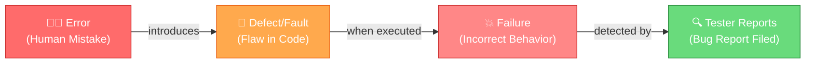
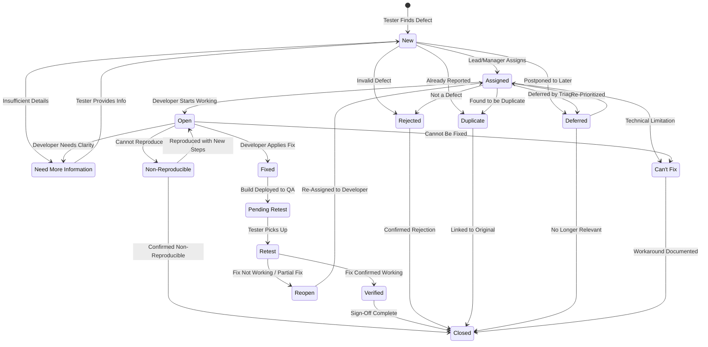
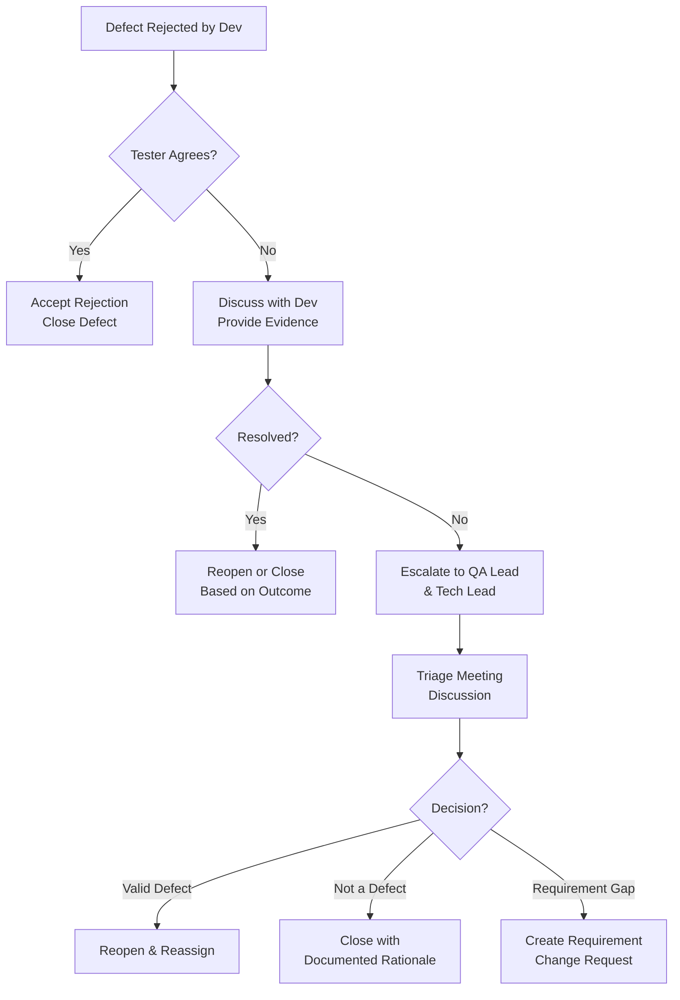
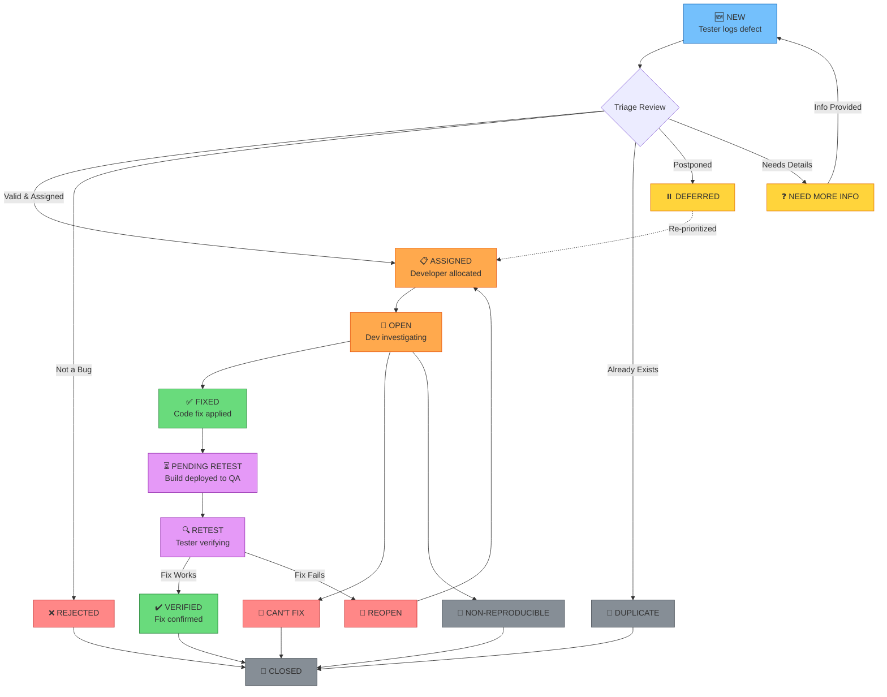
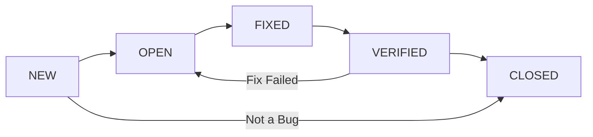
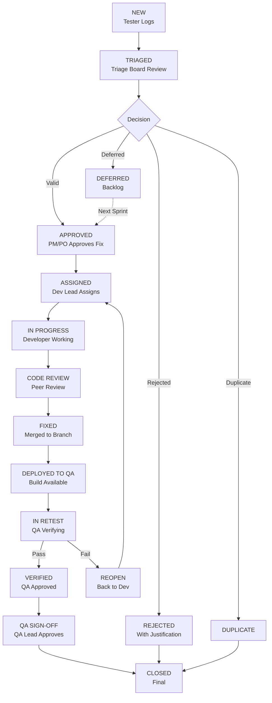
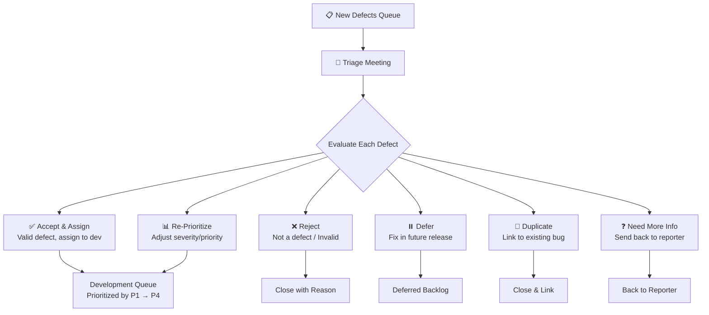

# Part 7: Defect/Bug Life Cycle

> **Study Guide for Manual Testing Professionals**
> *Mastering Defect Management from Identification to Closure*

---

## 7.1 Introduction to Defects

### What is a Defect/Bug?

A **defect** (also commonly called a **bug**) is any deviation or variance between the expected behavior of an application (as defined by requirements, specifications, or user expectations) and its actual behavior during execution. In simpler terms, when software doesn't do what it's supposed to do — or does something it shouldn't — that's a defect.

> [!NOTE]
> The term "bug" originated from an actual moth found trapped in a relay of the Harvard Mark II computer in 1947 by Grace Hopper's team. While the origin is anecdotal, the term has become the industry standard for software defects.

**Real-World Examples of Defects:**

| # | Scenario | Expected Behavior | Actual Behavior | Type |
|---|----------|-------------------|-----------------|------|
| 1 | User clicks "Add to Cart" on an e-commerce site | Item is added to cart with correct quantity | Item is added twice or not at all | Functional Defect |
| 2 | Login page on mobile device (iPhone 15) | Login form fits screen with proper alignment | Username field overlaps with password field | UI/Layout Defect |
| 3 | Bank transfer of $500 | $500 debited from sender, $500 credited to recipient | $500 debited from sender, $50 credited to recipient (decimal error) | Data/Calculation Defect |
| 4 | Page load on 4G network | Page loads within 3 seconds (SLA) | Page takes 18 seconds to load | Performance Defect |
| 5 | User enters `<script>alert('hack')</script>` in search bar | Input is sanitized, no script execution | JavaScript alert box appears — XSS vulnerability | Security Defect |

---

### Defect vs Bug vs Error vs Failure — A Clear Distinction

These terms are often used interchangeably in casual conversation, but they have **distinct meanings** in software testing and quality assurance:

| Term | Definition | Who Introduces It | Stage | Example |
|------|-----------|-------------------|-------|---------|
| **Error (Mistake)** | A human action that produces an incorrect result. It's a mistake in coding, logic, or requirements understanding. | Developer, Business Analyst, Designer | During development/design | A developer writes `if (balance > 0)` instead of `if (balance >= 0)`, misunderstanding the business rule that zero balance should be allowed. |
| **Defect (Bug)** | A flaw in the software product — a deviation from the requirement or specification. It exists in the code whether or not it has been discovered. | Introduced by the Error | Exists in the product (code/design) | The code has incorrect validation logic that prevents users with zero balance from proceeding, even though the requirement says they should be able to. |
| **Fault** | The manifestation of an error in the software. It is essentially the incorrect step, process, or data definition in the code. | Present in code | In the code itself | The specific line of code `if (balance > 0)` is the fault — the exact location of the problem. |
| **Failure** | The inability of a software system to perform its required function. A failure occurs when a defect is **executed** and causes the system to produce incorrect results. | Triggered when defect is executed | During execution/runtime | A user with $0.00 balance tries to view their account summary and gets an "Insufficient funds" error page instead. |

> [!IMPORTANT]
> **The Chain of Events:** An **Error** (human mistake) leads to a **Defect** (flaw in code) which, when executed, causes a **Failure** (incorrect system behavior). Not all defects lead to failures — some defects exist in code paths that are rarely or never executed.



---

### Why Defect Management is Crucial

Defect management is not just about logging bugs — it's a **systematic process** that directly impacts product quality, team productivity, customer satisfaction, and business revenue.

**1. Financial Impact**
- The cost of fixing a defect increases **exponentially** the later it is found in the SDLC.
- A defect found in production can cost **30–100x more** to fix than one found during requirements.

**2. Customer Trust & Brand Reputation**
- A single critical defect in production (e.g., data breach, payment failure) can destroy years of brand building.
- Example: In 2014, a healthcare.gov launch was plagued with defects that prevented millions from enrolling, causing massive public backlash and costing over $2 billion in fixes.

**3. Team Efficiency**
- Without structured defect management, teams waste time on duplicate bugs, miscommunication, and lost fixes.
- A clear defect life cycle ensures every bug is tracked, assigned, fixed, and verified systematically.

**4. Regulatory Compliance**
- In domains like healthcare (HIPAA), banking (PCI-DSS), and aviation (DO-178C), defect tracking and resolution is **legally required** and subject to audit.

**5. Continuous Improvement**
- Defect metrics (density, leakage, trends) help teams identify weak areas and improve processes over time.
- Root Cause Analysis (RCA) of defects prevents recurrence.

---

### Cost of Defects at Different Stages

The **Boehm Curve** (Barry Boehm, 1981) and subsequent research by IBM, NIST, and the Standish Group have consistently shown that defect cost grows exponentially across SDLC phases:

| SDLC Phase | Relative Cost to Fix | Example Cost (If Requirements = $1) | Example Scenario |
|-----------|---------------------|-------------------------------------|------------------|
| **Requirements** | 1x | $1 | BA identifies that the "free shipping" requirement lacks a minimum order threshold. Fix: Update the requirement document. |
| **Design** | 3–6x | $5 | Architect realizes the database schema doesn't support multi-currency. Fix: Revise the design document and schema. |
| **Coding/Development** | 10x | $10 | Developer finds a null pointer exception during unit testing. Fix: Add a null check and update the unit test. |
| **Unit Testing** | 15x | $15 | A unit test catches an off-by-one error in pagination logic. Fix: Modify the loop boundary and regression test. |
| **Integration/System Testing** | 30–40x | $35 | QA finds that the payment module sends incorrect tax calculations to the billing module. Fix: Debug across modules, fix, rebuild, and retest. |
| **UAT (User Acceptance Testing)** | 50–70x | $60 | Business users discover that the discount code applies to excluded products. Fix: Requires requirement clarification, code change, testing, and re-UAT. |
| **Production** | 100–150x | $100+ | Customers report that their credit cards are being charged twice. Fix: Emergency hotfix, customer refunds, PR damage control, potential legal implications, and root cause analysis. |

```
Cost of Defect Fix (Relative Scale)
│
│                                                          ████ Production
│                                                    ████ ($100+)
│                                               ████
│                                          ████
│                                    ████  UAT
│                              ████  ($60)
│                         ████
│                    ████  System Test
│               ████  ($35)
│          ████
│     ████  Dev/Unit Test ($10-15)
│ ████  Design ($5)
│█ Requirements ($1)
└──────────────────────────────────────────────────────────────
  Requirements  Design  Coding  Unit Test  System Test  UAT  Production
                              SDLC Phase →
```

> [!WARNING]
> **The "Shift Left" Principle:** The cost data above is why modern testing advocates for **Shift Left Testing** — moving testing activities as early as possible in the SDLC. Every defect caught during requirements review saves exponentially more than one caught in production.

---

## 7.2 Defect Life Cycle — Complete Flow

The **Defect Life Cycle** (also called **Bug Life Cycle**) is the journey a defect takes from the moment it is identified to the moment it is closed. It defines all the possible **states** (or statuses) a defect can be in and the **transitions** (movements) between those states.

### Complete Defect Life Cycle — Master Diagram



---

### Primary States — Detailed Explanation

---

#### State 1: New

**Definition:** The initial state when a defect is first logged in the defect tracking system. The defect has been identified and documented but has not yet been reviewed or assigned to anyone.

**Who Creates It:** The **Tester** (QA Engineer) creates the defect after identifying a deviation from expected behavior during test execution. In some organizations, defects can also be reported by developers (during code reviews), business analysts, product owners, or even end-users (via support tickets escalated to QA).

**What Information Must Be Included:**

When logging a new defect, the tester must include:
- **Bug Title:** A clear, concise, and descriptive summary (e.g., "Login fails with valid credentials when Caps Lock is OFF on Chrome v124")
- **Description:** Detailed explanation of the issue
- **Steps to Reproduce (STR):** Numbered, precise steps that anyone can follow to reproduce the bug
- **Expected Result:** What *should* happen according to requirements
- **Actual Result:** What *actually* happens
- **Environment:** OS, browser, device, app version, build number, test environment (e.g., staging)
- **Severity & Priority:** Initial assessment by the tester
- **Screenshots/Videos:** Visual evidence of the defect
- **Test Data:** Specific data used to trigger the bug (e.g., username, password, product ID)
- **Attachments:** Log files, network traces, console errors

> [!TIP]
> **Golden Rule of Bug Reporting:** A good defect report should allow someone who has *never seen the application* to reproduce the issue by following the Steps to Reproduce alone — without needing to ask the reporter any questions.

**Example Scenario:**
A tester is testing the login functionality of an e-commerce application. They enter valid credentials (username: `john.doe@test.com`, password: `Test@1234`) and click the "Sign In" button. Instead of being redirected to the dashboard, the page refreshes and displays the message: *"Invalid credentials. Please try again."* The tester verifies the credentials in the database, confirms they are correct, and logs a **New** defect.

---

#### State 2: Assigned / Open

**Definition:** After the defect is logged as "New," a **Test Lead**, **Project Manager**, or **Triage Board** reviews the defect and assigns it to the appropriate **developer** or development team for investigation and fixing. In some tools and workflows, "Assigned" and "Open" are treated as the same state; in others, "Assigned" means allocated but not yet started, while "Open" means the developer has acknowledged and started working on it.

**The Triage Process:**

Triage is the process of reviewing, evaluating, and prioritizing defects. It typically happens in a **triage meeting** (daily or bi-weekly) attended by:
- QA Lead / Test Manager
- Development Lead / Tech Lead
- Product Owner / Business Analyst
- Project Manager (optional)

During triage, each new defect is evaluated based on:
1. **Validity:** Is this actually a defect? Or is it working as designed?
2. **Severity:** How badly does it affect the system?
3. **Priority:** How urgently does it need to be fixed?
4. **Assignment:** Which developer or team is best suited to fix it?
5. **Sprint/Release Fit:** Should it be fixed in the current sprint/release or deferred?

**How Defects Are Assigned:**

| Assignment Method | Description | When Used |
|-------------------|-------------|-----------|
| **Manual Assignment** | Test Lead or PM manually assigns to a specific developer | Small teams, critical bugs requiring specific expertise |
| **Component-Based** | Auto-assigned based on the module/component (e.g., all "Payment" bugs go to the Payment team) | Medium to large teams with clear module ownership |
| **Round-Robin** | Automatically distributed evenly across developers | Teams with interchangeable developers |
| **Self-Assignment** | Developers pick from a queue of unassigned bugs | Agile teams using pull-based workflows |
| **Triage Meeting** | Assignment decided collectively during triage | Complex bugs, cross-module issues |

**Developer Responsibilities Upon Assignment:**
1. **Acknowledge** the defect — confirm you've seen it
2. **Review** the defect report — read all details, STR, and attachments
3. **Reproduce** the defect in your development environment
4. **Investigate** the root cause
5. **Communicate** if you need more information (move to "Need More Info")
6. **Estimate** the fix effort and communicate to the team
7. **Fix** the defect and update the status

**Example Scenario:**
The login defect reported above is reviewed in the daily triage meeting. The QA Lead confirms it's a valid defect affecting the core login flow. The Tech Lead identifies that it's likely a backend authentication service issue and assigns it to `Dev-Sarah`, the developer responsible for the authentication module. The defect status changes from "New" to "Assigned" and later to "Open" when Sarah starts investigating.

---

#### State 3: Fixed

**Definition:** The developer has identified the root cause, implemented a code fix, and checked the code into the version control system (e.g., Git). The defect status is updated to **Fixed** to signal that a resolution is in place and ready for testing.

> [!IMPORTANT]
> "Fixed" does NOT mean the defect is resolved. It means the developer *believes* they have fixed it. The defect still needs to be **verified** by QA before it can be closed.

**Fix Verification Checklist (Developer Side):**

Before marking a defect as "Fixed," the developer should:
- [ ] Identify and fix the root cause (not just the symptom)
- [ ] Write or update unit tests to cover the fix
- [ ] Run all related unit tests — they must pass
- [ ] Perform local testing to verify the fix works
- [ ] Check that the fix doesn't break other functionality (local regression)
- [ ] Submit a code review / pull request
- [ ] Get code review approved by at least one peer
- [ ] Merge the fix into the appropriate branch (e.g., `develop` or `release/v2.5`)
- [ ] Add a comment on the defect with:
  - Root cause description
  - What was changed (files, methods, logic)
  - Which build/version contains the fix
  - Any risks or areas that might be affected by the fix

**Build Deployment:**

After the fix is merged, the **build/deployment pipeline** (CI/CD) creates a new build containing the fix and deploys it to the **QA/Testing environment**. Only then can the tester retest the defect.

| Build Stage | Description |
|-------------|-------------|
| Developer commits fix | Code pushed to Git branch |
| Pull Request created | Peer review requested |
| Code Review approved | At least 1 approval |
| Merge to develop branch | Code integrated |
| CI build triggered | Automated build created (e.g., Build #2847) |
| Automated tests run | Unit + smoke tests pass |
| Deploy to QA environment | Build deployed to test server |
| QA notified | Defect moved to "Pending Retest" |

**Example Scenario:**
Dev-Sarah investigates the login defect and discovers that a recent API gateway update changed the authentication token format. The backend service was still expecting the old format, causing valid credentials to be rejected. Sarah updates the token parser, writes unit tests, gets the code reviewed, and merges it. The CI pipeline deploys Build #2847 to the QA environment. Sarah updates the defect status to "Fixed" with a comment: *"Root cause: API gateway v3.2 changed JWT token structure. Updated AuthTokenParser.java to handle both old and new formats. Fix in Build #2847."*

---

#### State 4: Pending Retest

**Definition:** The defect has been marked as "Fixed" by the developer, and the build containing the fix has been deployed to the QA/Testing environment. The defect is now waiting in the QA team's queue to be retested. This state exists to separate "the fix is available" from "the tester has started retesting."

**When Defect Moves to This State:**
- The developer marks the defect as "Fixed"
- The build containing the fix is successfully deployed to the QA environment
- The QA Lead or automation moves the defect to "Pending Retest"

**QA Team Queue Management:**
- Defects in "Pending Retest" are typically prioritized by **severity** and **priority**
- Critical/Blocker defects are retested first
- The QA Lead may assign specific retests to specific testers (ideally the same tester who found the bug)
- Some teams use JIRA dashboards or Kanban boards to visualize the retest queue

**Example Scenario:**
Build #2847 is deployed to the QA staging environment at 2:00 PM. The build release notes indicate that the login authentication defect (BUG-1042) is included in this build. The defect status is automatically updated to "Pending Retest" via a JIRA automation rule. QA Lead Alex sees BUG-1042 in the retest queue and prioritizes it since it's a Critical severity defect affecting the login flow.

---

#### State 5: Retest

**Definition:** The tester actively picks up the defect from the "Pending Retest" queue and begins verifying whether the fix actually resolves the reported issue. This is the state when the tester is actively testing the fix.

**Retesting Process:**

1. **Verify the Build:** Confirm you are testing on the correct build that contains the fix (check build number, version, deployment timestamp)
2. **Reproduce Using Original Steps:** Follow the exact same Steps to Reproduce (STR) from the original defect report
3. **Verify the Fix:** Confirm that the original defect no longer occurs and the expected result is now achieved
4. **Test with Variations:** Test with different data sets, edge cases, and boundary conditions related to the fix
5. **Check Related Areas:** Verify that the fix hasn't introduced new issues in related functionality (mini-regression)
6. **Document Results:** Update the defect with retest results, including screenshots/videos of the fix working correctly

**What to Verify:**

| Verification Area | What to Check | Example |
|-------------------|---------------|---------|
| **Original STR** | Exact steps from the bug report work correctly now | Login with valid credentials → Dashboard loads successfully |
| **Edge Cases** | Boundary conditions related to the fix | Login with credentials containing special characters (`!@#$%`) |
| **Negative Cases** | Invalid inputs still handled correctly | Login with invalid credentials → Appropriate error message shown |
| **Related Features** | Features that share code/modules with the fix | Password reset flow, "Remember Me" functionality, Session management |
| **Cross-Browser/Device** | Fix works across all supported platforms | Chrome, Firefox, Safari, Edge; Desktop and Mobile |
| **Data Integrity** | No data corruption from the fix | User session data, audit logs, login timestamps all correct |

**Regression Considerations:**
- The tester should run a **focused regression** on areas potentially impacted by the fix
- If the fix touched authentication logic, test: login, logout, session timeout, password reset, multi-factor auth, remember me, social login
- If automated regression tests exist, trigger the relevant test suite

**Example Scenario:**
Tester Maria picks up BUG-1042 from the retest queue. She confirms she's on Build #2847 by checking the application's "About" page. She follows the original STR: navigates to the login page, enters `john.doe@test.com` / `Test@1234`, and clicks "Sign In." This time, she is successfully redirected to the dashboard. She also tests with other accounts, including accounts with special characters in passwords. She verifies that login attempts with incorrect credentials still show the appropriate error message. She runs a quick regression on the password reset and "Remember Me" features. Everything works correctly. She updates the defect: *"Retested on Build #2847. Login with valid credentials now works as expected. Verified across Chrome, Firefox, and Safari. Related features (password reset, session management) working correctly. Moving to Verified."*

---

#### State 6: Reopen

**Definition:** During retesting, if the tester finds that the fix did **not** resolve the issue (or only partially resolved it), or if the fix introduced a **new** issue, the defect is moved back to the **Reopen** state. This sends the defect back to the developer for further investigation and fixing.

**When to Reopen a Defect:**

| Reason | Description | Example |
|--------|-------------|---------|
| **Fix Not Working** | The original issue still occurs exactly as before | Login still fails with valid credentials on the same build that supposedly contains the fix |
| **Partial Fix** | The defect is partially fixed but not completely resolved | Login works on Chrome but still fails on Firefox |
| **New Issue Introduced** | The fix resolved the original issue but created a new problem | Login works, but now the "Remember Me" checkbox no longer saves credentials |
| **Different Data Set** | Works with the test data mentioned in the fix but fails with other valid data | Login works with `john.doe@test.com` but fails with `jane.smith@test.com` |
| **Regression** | The fix broke existing functionality in a related area | Login works, but the Forgot Password flow now returns a 500 error |

**How to Communicate Reopening:**
- **Add detailed comments** explaining exactly why the defect is being reopened
- Include **new screenshots/videos/logs** showing the issue
- Reference the **build number** you tested on
- If the issue is slightly different, clarify whether it's the same root cause or a new one
- **Be professional and factual** — avoid blame language like "the developer didn't fix it properly"

> [!TIP]
> **Constructive Reopen Comment Example:**
> *"Retested BUG-1042 on Build #2847. Login with `john.doe@test.com` now works as expected ✅. However, login with `jane.smith@test.com` (also valid in DB) still fails with the same 'Invalid credentials' error ❌. Attached screenshot and server logs showing a different token parsing error for this account. This appears to be related to the same root cause — the account was created before the API gateway migration and may have a legacy token format. Reopening for further investigation."*

**Additional Information to Provide When Reopening:**
- Specific steps where the fix fails
- Comparison with original behavior vs. current behavior
- Server logs, console errors, network traces
- Screenshots / video recordings
- Environment details (if different from original)
- Suggested investigation areas (if you have insights)

**Example Scenario:**
Tester Maria retests BUG-1042 and finds that login works for accounts created after January 2025 but still fails for older accounts. She determines that the fix only handled the new JWT token format but didn't account for legacy accounts that were migrated from the old system. She reopens the defect with detailed comments, screenshots of both working and failing scenarios, and server logs showing the specific parsing error for legacy accounts.

---

#### State 7: Verified

**Definition:** The tester has retested the defect and confirmed that the fix successfully resolves the reported issue. The defect now works as expected according to the requirements. The defect is moved to **Verified** to indicate that QA has validated the fix.

**Verification Criteria:**
1. ✅ The original defect no longer occurs (tested with original STR)
2. ✅ The fix works across all supported platforms/browsers/devices
3. ✅ Edge cases and boundary conditions related to the fix pass
4. ✅ No regression in related functionality
5. ✅ The fix matches the expected behavior defined in requirements
6. ✅ The fix doesn't introduce new defects

**Sign-Off Process:**
- The tester updates the defect with verification results
- Adds "Verified" status with the build number and date
- In some organizations, the QA Lead performs a second sign-off for Critical/Blocker defects
- The defect is now eligible for closure

**Example Scenario:**
After the developer provides a second fix in Build #2853 that handles both new and legacy token formats, Tester Maria retests BUG-1042. She tests with both new accounts and legacy accounts across all browsers. Everything works as expected. She updates the defect status to "Verified" with the comment: *"Verified on Build #2853. Login works correctly for all account types (new and legacy). Tested on Chrome 124, Firefox 126, Safari 17.5, and Edge 124. No regression observed in related features. Fix verified."*

---

#### State 8: Closed

**Definition:** The defect has been verified by QA and is officially **Closed**. This is the final state in the primary defect life cycle. A closed defect means the issue has been resolved, verified, and no further action is required.

**Closure Criteria:**
- The fix has been verified by QA (status is "Verified")
- All related regression tests pass
- No pending questions or concerns about the fix
- QA Lead / Test Manager approves the closure (for critical defects)
- The fix is included in the build that will be released to production

**Documentation Requirements Upon Closure:**
- Final resolution status (Fixed, Won't Fix, Duplicate, etc.)
- Build number containing the fix
- Release version the fix will be part of
- Any known limitations or workarounds (if applicable)
- Lessons learned (for critical defects)
- Updated test cases to cover the defect scenario going forward

**Who Can Close:**
| Organization Type | Who Closes Defects |
|-------------------|-------------------|
| Small Teams | The tester who verified the fix |
| Medium Teams | QA Lead after tester verification |
| Enterprise/Regulated | QA Manager or Defect Review Board |

> [!NOTE]
> In some organizations, defects move directly from "Verified" to "Closed" automatically. In others, there's a separate sign-off step where a QA Lead or manager reviews all verified defects before closing them.

**Example Scenario:**
QA Lead Alex reviews all verified defects before the release sign-off meeting. BUG-1042 has been verified on Build #2853 by Tester Maria. Alex reviews the defect history, verification comments, and screenshots. Satisfied that the fix is thorough, Alex closes BUG-1042 with the final comment: *"Defect resolved and verified. Fix included in Release v2.5.0 (Build #2853). Adding regression test case TC-AUTH-047 to the regression suite to prevent recurrence."*

---

### Secondary / Special States

---

#### State 9: Rejected

**Definition:** A defect is marked as **Rejected** (also called "Invalid" or "Not a Bug") when, upon review, it is determined that the reported behavior is **not actually a defect**. The application is working correctly as per the requirements, specifications, or design.

**When and Why Defects Are Rejected:**

| Reason | Description | Example |
|--------|-------------|---------|
| **Working as Designed (WAD)** | The behavior is intentional and matches the requirement | Tester reports that the "Submit" button is grayed out when required fields are empty — this is the designed validation behavior |
| **Requirement Misunderstanding** | The tester misunderstood the requirement | Tester reports that shipping cost is calculated after tax, but the requirement clearly states shipping is calculated post-tax |
| **Test Environment Issue** | The issue exists only due to test environment misconfiguration | Login fails because the test environment's auth server certificate expired, not a code defect |
| **Incorrect Test Data** | The tester used invalid or incorrect test data | Tester reports payment failure but was using an expired test credit card number |
| **User Error** | The reported behavior is due to incorrect user action | Tester reports "file upload fails" but was trying to upload a 500MB file when the limit is clearly stated as 10MB |

**How to Handle Rejection:**
1. **Don't take it personally** — rejection doesn't mean you did a bad job
2. **Review the rejection reason** carefully — the developer should provide a clear explanation
3. **Verify the reason** — check the requirement document, design spec, or acceptance criteria
4. If you **agree** with the rejection: Accept it, learn from it, and move on
5. If you **disagree** with the rejection:
   - Escalate to QA Lead with your evidence
   - Request a triage meeting discussion
   - Provide requirement references that support your position
   - Never argue in defect comments — escalate through proper channels

**Escalation Process for Disputed Rejections:**



**Example Scenario:**
A tester reports BUG-1087: *"User is logged out after 15 minutes of inactivity — expected behavior is to remain logged in."* The developer rejects the defect with the comment: *"Working as designed. Per Security Requirement SR-AUTH-003, all sessions must time out after 15 minutes of inactivity to comply with PCI-DSS requirements. This is a mandatory security control."* The tester verifies the security requirement document, confirms the 15-minute timeout is specified, and accepts the rejection.

---

#### State 10: Deferred

**Definition:** A defect is marked as **Deferred** when it is a **valid defect** but the decision is made to **postpone** the fix to a later release, sprint, or phase. The defect is not being fixed right now, but it will be addressed in the future.

**When to Defer:**

| Criteria | Description | Example |
|----------|-------------|---------|
| **Low Priority** | The defect is valid but not urgent | A tooltip has a minor grammatical error |
| **Release Deadline** | No time to fix before the release and severity doesn't warrant delay | A cosmetic alignment issue when browser zoom is at 150% |
| **High Risk** | The fix carries a high risk of regression and the release is imminent | Fixing a minor calculation rounding issue requires changing the core calculation engine |
| **Future Redesign** | The affected module is already scheduled for redesign | UI alignment issues in a page that will be completely redesigned in Q3 |
| **Resource Constraints** | The developer with expertise in the affected area is unavailable | The specialist for the legacy payment integration is on leave |

**Deferred Backlog Management:**
- All deferred defects should be tagged/labeled (e.g., `Deferred_v2.6`, `Deferred_Q3`)
- Deferred defects should be reviewed at the beginning of each sprint/release planning
- Set a **review date** when the deferred defect should be re-evaluated
- Track deferred defects separately in dashboards to ensure they don't accumulate indefinitely
- Never defer Critical/Blocker defects — escalate if someone suggests it

**Re-evaluation Process:**
1. At each sprint/release planning, review the deferred backlog
2. Reassess severity and priority (they may have changed)
3. Check if the fix is now feasible (resources, time, risk)
4. Either move to "Assigned" for fixing or extend the deferral with a new target date
5. If the defect is no longer relevant (feature removed, redesigned), close it

**Example Scenario:**
BUG-1095: *"On the product listing page, the 'Add to Wishlist' heart icon is 2 pixels lower than the 'Compare' icon on screens with resolution 2560x1440."* Severity: Trivial. Priority: P4. The triage team agrees it's a valid cosmetic issue but decides to defer it to Release v2.6 since the product listing page is being redesigned in Q3. The defect is marked as Deferred with the tag `Deferred_v2.6`.

---

#### State 11: Duplicate

**Definition:** A defect is marked as **Duplicate** when the same issue has already been reported by another tester (or even the same tester) in a different defect report. The duplicate defect is linked to the **original** defect and closed.

**How to Identify Duplicates:**
1. **Search before logging:** Always search the defect tracker for similar issues before creating a new defect
2. **Search by keywords:** Use the error message, module name, or feature area
3. **Search by component:** Filter by the same component/module
4. **Review recent defects:** Check defects logged in the same sprint/release
5. **Check for similar symptoms:** Different steps might lead to the same underlying defect

**Linking Duplicate Defects:**
- Mark the newer defect as "Duplicate of [BUG-XXXX]"
- Add a link/reference to the original defect
- Any useful information from the duplicate (additional steps, environments, data) should be copied to the original defect as a comment
- Close the duplicate defect

> [!TIP]
> **Not Every Similar Bug is a Duplicate:** Two bugs may have the same symptom but different root causes. For example, "Login fails" could be caused by (1) incorrect password validation, (2) database connection timeout, or (3) expired SSL certificate. These are three different defects, not duplicates. Always verify the root cause before marking as duplicate.

**Example Scenario:**
Tester A logs BUG-1100: *"Search results page shows 'No results found' when searching for 'laptop' — even though laptops exist in the catalog."* Tester B independently logs BUG-1105: *"Searching for 'phone' returns empty results despite phones being in the database."* Upon review, the Tech Lead determines both are caused by the same root cause: the search indexer service crashed after the last deployment and hasn't been restarted. BUG-1105 is marked as a duplicate of BUG-1100, with BUG-1100 being the original defect to be fixed.

---

#### State 12: Not a Defect

**Definition:** Similar to "Rejected," this state is used when the reported issue is determined to be **not a defect at all**. It may be a misunderstanding, a feature that doesn't exist yet, expected behavior under specific conditions, or an environmental issue.

**When Something Is Not a Defect:**

| Scenario | Why It's Not a Defect | What to Do Instead |
|----------|----------------------|-------------------|
| User expects a feature that doesn't exist | The feature was never in the requirements | Log a Feature Request / Enhancement |
| Behavior differs from a competitor's product | Your product has its own design decisions | Log as a Suggestion / Enhancement |
| Issue only in the tester's local environment | Browser cache, extensions, proxy settings | Clear environment and retest |
| Behavior changed from previous version intentionally | Part of a planned redesign | Verify with release notes and requirements |

**Requirements Clarification:**
When a defect is rejected as "Not a Defect," it often highlights a **requirements gap**:
- The requirement was ambiguous and open to interpretation
- The requirement didn't cover an edge case
- The requirement was updated but the tester wasn't informed
- There is no requirement for the scenario at all

In these cases, the tester should raise a **requirements clarification request** to the BA/Product Owner.

**Example Scenario:**
A tester logs BUG-1110: *"When adding a product to the cart, there is no 'Quantity' field — the user can only add one at a time."* The Product Owner responds: *"This is by design. The current MVP only supports single-quantity additions. Users can increase quantity on the cart page. A bulk-add feature is planned for Phase 2."* The defect is marked as "Not a Defect" and a feature request is created for Phase 2.

---

#### State 13: Non-Reproducible / Cannot Reproduce

**Definition:** A defect is marked as **Non-Reproducible** (or "Cannot Reproduce" / "CNR") when the developer (or another tester) is unable to reproduce the issue by following the provided Steps to Reproduce. The defect occurs intermittently or cannot be triggered consistently.

**Steps to Try Before Marking as Non-Reproducible:**

1. **Follow the STR exactly** as written — don't add or skip steps
2. **Use the same environment** (OS, browser version, device, app version, build number)
3. **Use the same test data** (exact same inputs, accounts, products)
4. **Check prerequisites** — was there specific setup required (logged in as admin, specific database state)?
5. **Try multiple times** — some bugs are intermittent (race conditions, timing issues)
6. **Check different timing** — try faster/slower interactions, different network speeds
7. **Review server logs** — look for error logs at the timestamp when the bug was originally reported
8. **Check for environment differences** — deployed version, feature flags, configuration
9. **Ask the reporter** for clarification or a screen recording
10. **Try on the reporter's machine/environment** if possible

**Environment-Specific Issues:**

| Issue Type | Description | Example |
|-----------|-------------|---------|
| **Browser-Specific** | Bug only occurs in a specific browser or version | Layout breaks only in Safari 17.4 due to a CSS grid rendering bug |
| **OS-Specific** | Bug related to OS-level behavior | File upload dialog behaves differently on macOS vs Windows |
| **Network-Specific** | Bug related to network conditions | Timeout error only occurs on slow 3G connections |
| **Data-Specific** | Bug triggered by specific data patterns | Calculation error only with prices containing 3+ decimal places |
| **Race Condition** | Bug occurs due to timing of concurrent operations | Double-clicking "Submit" quickly creates duplicate orders (50% of the time) |
| **State-Dependent** | Bug requires a specific application state to trigger | Error only occurs when the user's session is within 30 seconds of timeout |

**Example Scenario:**
Tester logs BUG-1115: *"After adding 3 items to cart and clicking 'Checkout,' the page shows a blank white screen for 5 seconds before loading."* Developer tries to reproduce: adds 3 items, clicks Checkout — page loads instantly. After multiple attempts, developer asks for the tester's environment details. The tester was using a VPN connected to a different region, which caused a latency issue with the CDN. The developer cannot reproduce without the VPN setup. The defect is marked as "Non-Reproducible" with a note: *"Unable to reproduce in standard test environment. Appears to be network-latency related. Monitoring via APM tools."*

---

#### State 14: Can't Be Fixed

**Definition:** A defect is acknowledged as valid but is marked as **Can't Be Fixed** (also "Won't Fix" or "By Design Limitation") when there are **technical, architectural, or third-party constraints** that prevent a fix.

**Technical Limitations:**
- The fix would require a complete architectural overhaul that isn't feasible
- The issue is caused by a fundamental limitation of the technology being used
- The fix would create worse problems than the current defect

**Third-Party Constraints:**
- The defect is in a third-party library, SDK, or API that your team doesn't control
- The third-party vendor has acknowledged the bug but won't fix it until their next major release
- The defect is in the browser itself or the operating system

**Workaround Documentation:**
When a defect can't be fixed, the team **must** document:
- The defect and its impact
- The reason it can't be fixed
- A **workaround** for users/testers
- A plan for when/if it might be fixed (e.g., when the third-party library releases a patch)
- Known affected scenarios and affected user segments

**Example Scenario:**
BUG-1120: *"On iOS Safari, the date picker input shows the native iOS date wheel instead of our custom calendar widget."* After investigation, the team discovers that iOS Safari does not allow custom styling or replacement of the native `<input type="date">` picker. This is a browser-level limitation. The defect is marked as "Can't Be Fixed" with the workaround: *"On iOS, users should use the native date wheel. For desktop browsers, the custom calendar widget will display correctly. We will re-evaluate when Safari supports the Web Components API for input replacements."*

---

#### State 15: Need More Information

**Definition:** A defect is moved to **Need More Information** when the developer, triage team, or QA Lead determines that the defect report does not contain sufficient detail to investigate or reproduce the issue.

**When to Request More Info:**
- Steps to Reproduce are missing, incomplete, or unclear
- Environment details are missing (which browser, OS, build?)
- The expected result is not clear
- The defect description is ambiguous
- No screenshots or evidence are attached for a UI issue
- The test data used is not specified

**What Additional Info to Request:**

| Information Needed | Example Request |
|-------------------|-----------------|
| **Complete STR** | "Can you provide exact step-by-step instructions to reproduce this issue? Starting from which page?" |
| **Environment** | "Which browser and version were you using? Which build number? Which test environment (QA, Staging, UAT)?" |
| **Test Data** | "Which user account did you use? Which product were you adding to cart?" |
| **Screenshots/Video** | "Can you provide a screenshot or screen recording of the issue? Console errors would also help." |
| **Error Messages** | "Did you see any error messages? Can you check the browser console (F12) for errors?" |
| **Frequency** | "Does this happen every time, or intermittently? If intermittent, how often (e.g., 3 out of 10 tries)?" |
| **Logs** | "Can you attach the server logs from the test environment for the time window when you encountered this?" |

**Example Scenario:**
Tester logs BUG-1125: *"Checkout page is broken."* That's the entire defect report. The developer moves it to "Need More Information" with the comment: *"Hi, could you please provide more details? Specifically: (1) What exactly is broken — is it a UI issue, functional error, or data issue? (2) Steps to reproduce from the beginning. (3) Which browser and build are you testing on? (4) A screenshot of what you see. (5) Any error messages displayed. Without this information, I cannot begin investigation."*

---

## 7.3 State Transition Workflows

### Standard Workflow Diagram

The standard workflow is used by most organizations and covers the primary happy path along with common alternative paths.



---

### Simplified Workflow for Small Teams

For startups or small teams (2-5 members), a simplified workflow reduces overhead:



**Key Differences from Standard:**
- No separate "Assigned" state — the small team self-assigns
- No "Pending Retest" — testers pick up immediately
- No formal triage meeting — quick Slack/huddle discussions
- Fewer administrative steps — focus on speed
- Reopen goes directly back to "Open" (same developer)

---

### Enterprise Workflow with Approvals

For large organizations, regulated industries, or enterprise-grade products:



**Key Additions in Enterprise:**
- **Triaged** state with formal review board
- **Approved** state requiring PM/PO approval before development starts
- **Code Review** state ensuring peer review compliance
- **Deployed to QA** state tracking build deployment
- **QA Sign-Off** state requiring QA Lead approval before closure
- Audit trail maintained at every transition
- Each transition may require comments/justification

---

### Table of All Valid State Transitions

| Current State | Valid Next States | Trigger / Reason |
|--------------|-------------------|------------------|
| **New** | Assigned, Rejected, Duplicate, Deferred, Need More Info | Triage decision |
| **Need More Info** | New | Tester provides requested information |
| **Assigned** | Open, Rejected, Duplicate, Deferred, Can't Fix | Developer begins or triage updates |
| **Open** | Fixed, Can't Fix, Need More Info, Non-Reproducible | Developer investigation result |
| **Fixed** | Pending Retest | Build deployed to QA |
| **Pending Retest** | Retest | Tester picks up for verification |
| **Retest** | Verified, Reopen | Retest result (pass/fail) |
| **Verified** | Closed | QA sign-off |
| **Reopen** | Assigned | Re-assigned to developer |
| **Rejected** | Closed, New (if disputed & overturned) | Confirmed rejection or escalation result |
| **Duplicate** | Closed | Linked to original defect |
| **Deferred** | Assigned, Closed | Re-prioritized or no longer relevant |
| **Non-Reproducible** | Open, Closed | Reproduced with new steps or confirmed CNR |
| **Can't Fix** | Closed | Workaround documented |

> [!IMPORTANT]
> **Invalid Transitions:** Not all transitions are allowed. For example:
> - A defect should **never** go directly from "New" to "Closed" without review
> - A defect should **never** go from "Fixed" to "Closed" without retesting
> - A defect should **never** go from "Reopen" to "Closed" without being re-fixed and re-verified

---

## 7.4 Defect Classification

### Severity Levels

**Severity** measures the **impact** of the defect on the system's functionality. It is a technical assessment of how badly the defect affects the application. Severity is typically set by the **Tester** based on the observed impact.

| Level | Name | Description | Impact | Example |
|-------|------|-------------|--------|---------|
| **S1** | **Critical / Blocker** | The defect causes complete system failure, data loss, or blocks all testing. There is no workaround. | System is unusable; complete showstopper | **E-commerce:** Clicking "Place Order" deletes all items from the cart and charges the customer $0.00, but marks the order as "Completed" — data integrity is completely broken. |
| **S2** | **Major / High** | The defect severely impacts a major feature/functionality. A workaround may exist but is not practical for end users. | Major feature broken; significant user impact | **Banking App:** Fund transfer works but the confirmation email shows the wrong recipient name and account number, causing customer confusion and potential fraud reports. |
| **S3** | **Medium / Moderate** | The defect impacts a feature but a reasonable workaround exists. The system is still usable for most functions. | Feature partially broken; acceptable workaround available | **E-commerce:** The "Sort by Price" filter on the search results page sorts in ascending order when "High to Low" is selected. Workaround: Users can manually browse through pages. |
| **S4** | **Minor / Low** | The defect is a minor issue that doesn't significantly impact functionality. It's a cosmetic or usability issue. | Minor inconvenience; no real functional impact | **Social Media App:** When a user uploads a profile picture larger than 5MB, the upload progress bar shows 0% until it jumps to 100% at the end (no incremental progress). |
| **S5** | **Trivial / Cosmetic** | The defect is a very minor cosmetic issue — typo, alignment, color variation — that has virtually no impact on usability or functionality. | No functional impact; purely aesthetic | **Corporate Website:** The footer text says "Copyright 2024" instead of "Copyright 2025" on the About Us page. |

---

### Priority Levels

**Priority** indicates **how urgently** the defect needs to be fixed. It is a business decision based on the defect's impact on users, business operations, and release timelines. Priority is typically set or adjusted by the **Product Owner**, **Project Manager**, or **Triage Board**.

| Level | Name | Description | Fix Timeline | Example |
|-------|------|-------------|-------------|---------|
| **P1** | **Urgent / Immediate** | Must be fixed immediately. The defect is blocking critical business operations, users, or testing. Typically requires a **hotfix**. | Within hours (same day) | **Payment Gateway:** All credit card transactions are failing since the morning deployment. Revenue loss is $50,000/hour. Hotfix required immediately. |
| **P2** | **High** | Must be fixed in the current sprint/release. The defect significantly impacts business or user experience. | Within 1-3 days; current sprint | **E-commerce:** The promotional banner on the homepage shows "50% OFF" but clicking it leads to a 404 error page. Marketing campaign launches tomorrow. |
| **P3** | **Medium** | Should be fixed soon but can wait for the next sprint/release. The defect impacts a secondary feature or has a viable workaround. | Next sprint / next release | **HR Portal:** The "Export to PDF" feature in the employee reports section generates a PDF with incorrect formatting (columns overlap). Workaround: Export to Excel instead. |
| **P4** | **Low** | Fix when time permits. The defect is minor and has negligible impact on business or users. | Backlog; no specific timeline | **Internal Tool:** The "Last Updated" timestamp on the admin dashboard shows time in UTC instead of the local timezone. |

---

### Severity vs Priority Matrix

> [!IMPORTANT]
> **Key Insight:** Severity and Priority are **independent** dimensions. A defect can be high severity but low priority, or low severity but high priority. Understanding this distinction is one of the most frequently tested interview topics.

| | **P1 - Urgent** | **P2 - High** | **P3 - Medium** | **P4 - Low** |
|---|---|---|---|---|
| **S1 - Critical** | 🔴 Fix NOW — Hotfix | 🔴 Fix in current sprint | 🟠 Fix in next sprint | 🟡 Rare — usually escalated |
| **S2 - Major** | 🔴 Fix ASAP | 🟠 Fix in current sprint | 🟡 Fix in next sprint | 🟢 Backlog |
| **S3 - Medium** | 🟠 Fix ASAP | 🟡 Current or next sprint | 🟢 Next sprint | 🟢 Backlog |
| **S4 - Minor** | 🟡 Fix when possible | 🟢 Next sprint | 🟢 Backlog | 🟢 Backlog |
| **S5 - Trivial** | 🟡 Rare — usually low priority | 🟢 Backlog | 🟢 Backlog | 🟢 Nice to have |

---

#### Detailed Examples of Severity vs Priority Combinations

**1. High Severity, Low Priority — "Critical but Not Urgent"**

| Attribute | Value |
|-----------|-------|
| **Scenario** | An e-commerce application crashes (S1 - Critical) when a user applies a specific combination of 4 discount codes simultaneously |
| **Why High Severity** | Application crash = Critical severity |
| **Why Low Priority** | The 4-code combination is virtually impossible in real usage (users can only apply 1 code at a time in the current UI — this was found via API testing). The crash scenario can only be triggered via direct API manipulation. |
| **Decision** | Defer to next release. Add API validation to prevent multi-code application as a quick fix. |

**2. Low Severity, High Priority — "Minor but Urgent"**

| Attribute | Value |
|-----------|-------|
| **Scenario** | The company logo on the login page is stretched and pixelated (S5 - Trivial/Cosmetic) |
| **Why Low Severity** | It's a purely cosmetic issue — no functional impact |
| **Why High Priority** | The CEO is presenting a demo to the company's largest potential client tomorrow. The distorted logo looks unprofessional and could impact a $2M deal. |
| **Decision** | Fix immediately — replace the logo image file. Quick fix, high business impact. |

**3. High Severity, High Priority — "Critical and Urgent"**

| Attribute | Value |
|-----------|-------|
| **Scenario** | User personal data (name, email, phone) is visible to other logged-in users due to a session management bug (S1 - Critical) |
| **Why High Severity** | Security vulnerability exposing PII — potential GDPR/regulatory violation |
| **Why High Priority** | Currently affecting all users in production. Legal implications. Must fix immediately. |
| **Decision** | Emergency hotfix. Consider taking the feature offline temporarily. Notify security team and legal. |

**4. Low Severity, Low Priority — "Minor and Not Urgent"**

| Attribute | Value |
|-----------|-------|
| **Scenario** | The "Terms and Conditions" page has inconsistent font sizes — headings use 18px on some sections and 20px on others (S5 - Cosmetic) |
| **Why Low Severity** | No functional impact; purely aesthetic inconsistency |
| **Why Low Priority** | Very few users visit the T&C page. No business impact. |
| **Decision** | Add to backlog. Fix during a UI cleanup sprint or when working on the page for other reasons. |

---

## 7.5 Defect Report Template

### Standard Defect Report Template

| Field | Description | Example Value |
|-------|-------------|---------------|
| **Bug ID** | Unique identifier (auto-generated by tool) | BUG-1042 |
| **Bug Title / Summary** | Clear, concise, descriptive title | Login fails with valid credentials when MFA is disabled on Chrome v124 |
| **Module / Component** | The application module/feature area | Authentication / Login |
| **Severity** | Impact on the system (S1-S5) | S1 - Critical |
| **Priority** | Urgency of the fix (P1-P4) | P1 - Urgent |
| **Environment** | Complete environment details | OS: Windows 11 Pro (23H2) / Browser: Chrome 124.0.6367.91 / Device: Desktop / Build: v2.5.0-beta.3 (Build #2841) / Environment: QA-Staging |
| **Reported By** | Name of the tester | Maria Johnson (QA Engineer) |
| **Reported Date** | Date the defect was logged | 2025-11-15 |
| **Assigned To** | Developer responsible for the fix | Sarah Chen (Backend Developer) |
| **Status** | Current state in the life cycle | New |
| **Description** | Detailed explanation of the issue | When a user attempts to log in with valid credentials (verified in DB) and MFA is disabled for their account, the login request returns a 401 Unauthorized error and displays "Invalid credentials" message. This affects all users with MFA disabled. Users with MFA enabled can log in successfully. |
| **Pre-Conditions** | Required state before testing | 1. User account exists in the database with valid credentials. 2. MFA is disabled for the account. 3. Account is active (not locked or expired). |
| **Steps to Reproduce** | Numbered, precise steps | See below |
| **Expected Result** | What should happen | User should be logged in successfully and redirected to the Dashboard page. A valid session token should be created. |
| **Actual Result** | What actually happens | Login fails. Page displays "Invalid credentials. Please try again." error message. No session is created. Server returns HTTP 401 Unauthorized. |
| **Screenshots / Attachments** | Visual evidence | login_failure_screenshot.png, browser_console_errors.png, server_error_log.txt |
| **Reproducibility** | How often it occurs | Always (10/10 attempts) |
| **Additional Notes** | Any extra information | - Issue started after Build #2841 deployment (was working in Build #2838). - Users with MFA enabled are NOT affected. - Same issue observed on Firefox 126 and Safari 17.5. - Server log shows: "TokenParseException: Unable to parse JWT - unexpected format at position 47" |

**Steps to Reproduce (Detailed):**
1. Open Chrome browser (v124.0.6367.91)
2. Navigate to `https://qa-staging.example.com/login`
3. Enter username: `john.doe@test.com` in the "Email Address" field
4. Enter password: `Test@1234` in the "Password" field
5. Ensure "Remember Me" checkbox is unchecked
6. Click the "Sign In" button
7. **Observe:** Login fails with "Invalid credentials" error message
8. **Expected:** User should be redirected to the Dashboard (`/dashboard`)

---

### Sample Bug Report 1: Login Authentication Failure

---

> **BUG-1042: Login fails with valid credentials for non-MFA users after Build #2841**

| Field | Value |
|-------|-------|
| **Bug ID** | BUG-1042 |
| **Title** | Login fails with valid credentials for non-MFA users after Build #2841 |
| **Module** | Authentication / Login |
| **Severity** | S1 - Critical |
| **Priority** | P1 - Urgent |
| **Environment** | OS: Windows 11 Pro (23H2), macOS Sonoma 14.5 / Browser: Chrome 124, Firefox 126, Safari 17.5 / Build: v2.5.0-beta.3 (#2841) / Env: QA-Staging |
| **Reported By** | Maria Johnson |
| **Date** | 2025-11-15 |
| **Assigned To** | Sarah Chen |
| **Status** | New |

**Description:**
After the deployment of Build #2841, all users with MFA (Multi-Factor Authentication) disabled are unable to log in. The login form accepts input and submits, but returns a "Invalid credentials. Please try again." error despite the credentials being verified as correct in the database. Users with MFA enabled are not affected and can log in normally. This issue was not present in the previous Build #2838.

**Pre-Conditions:**
1. A user account exists with valid credentials (verified in DB: `users` table)
2. The account has `mfa_enabled = false`
3. The account is active (`status = 'ACTIVE'`)
4. The user is not currently locked out

**Steps to Reproduce:**
1. Open any supported browser (Chrome 124 / Firefox 126 / Safari 17.5)
2. Navigate to `https://qa-staging.example.com/login`
3. Enter email: `john.doe@test.com` in the "Email Address" field
4. Enter password: `Test@1234` in the "Password" field
5. Click the "Sign In" button
6. **Observe the result**

**Expected Result:**
- User is authenticated successfully
- User is redirected to the Dashboard (`/dashboard`)
- A valid session token is created
- Welcome message "Hello, John!" is displayed

**Actual Result:**
- Login fails
- Error message displayed: "Invalid credentials. Please try again."
- URL remains on `/login` (no redirect)
- No session token is created
- Browser console shows: `POST /api/v2/auth/login 401 (Unauthorized)`
- Server log: `TokenParseException: Unable to parse JWT - unexpected format at position 47`

**Reproducibility:** Always (10/10 attempts)

**Attachments:**
- `login_failure_screenshot.png` — Screenshot of the error message
- `browser_console_errors.png` — Chrome DevTools console showing 401 error
- `server_error_log_20251115.txt` — Server logs with TokenParseException
- `db_verification_query.png` — Screenshot showing the account exists with correct credentials in the DB

**Additional Notes:**
- This is a **regression** — login worked in Build #2838 (deployed Nov 12)
- Tested with 5 different non-MFA accounts — all fail
- Tested with 3 MFA-enabled accounts — all succeed
- The JWT token format appears to have changed between builds
- Impact: ~65% of users have MFA disabled and are currently unable to log in

---

### Sample Bug Report 2: UI Alignment Issue on Mobile

---

> **BUG-1078: Product detail page — "Add to Cart" button overlaps with price on iPhone 14/15 in portrait mode**

| Field | Value |
|-------|-------|
| **Bug ID** | BUG-1078 |
| **Title** | Product detail page — "Add to Cart" button overlaps with price on iPhone 14/15 in portrait mode |
| **Module** | Product Detail Page / UI |
| **Severity** | S3 - Medium |
| **Priority** | P2 - High |
| **Environment** | Device: iPhone 14 Pro (iOS 17.4.1), iPhone 15 (iOS 17.5) / Browser: Safari Mobile / Screen: 393x852 (portrait) / Build: v2.5.0-beta.3 (#2841) / Env: QA-Staging |
| **Reported By** | Raj Patel |
| **Date** | 2025-11-16 |
| **Assigned To** | Emily Rodriguez (Frontend Developer) |
| **Status** | New |

**Description:**
On iPhone 14 and iPhone 15 devices in **portrait mode**, the "Add to Cart" button on the Product Detail page overlaps with the product price text, making both elements partially unreadable. The button appears to be positioned approximately 20px too high, causing the bottom portion of the price text ($XX.XX) to be covered by the top of the button. This issue does NOT occur in landscape mode or on iPad. Desktop browsers are not affected.

**Pre-Conditions:**
1. A product exists in the catalog with a price displayed
2. The product is available for purchase (in-stock)
3. Device: iPhone 14 or iPhone 15 in portrait orientation

**Steps to Reproduce:**
1. Open Safari on an iPhone 14 or iPhone 15 (portrait mode)
2. Navigate to `https://qa-staging.example.com`
3. Search for "Wireless Headphones" in the search bar
4. Tap on the first search result ("Sony WH-1000XM5 Wireless Headphones")
5. Scroll down to the price and "Add to Cart" section
6. **Observe:** The "Add to Cart" button overlaps with the price text "$349.99"

**Expected Result:**
- The price text "$349.99" should be fully visible with adequate spacing (at least 16px) below it
- The "Add to Cart" button should be positioned below the price with proper margin/padding
- Both elements should be fully readable and tappable without overlap

**Actual Result:**
- The price text "$349.99" is partially covered by the "Add to Cart" button
- The top ~8px of the "Add to Cart" button overlaps with the bottom portion of the price
- The price appears as "$349" with ".99" hidden behind the button
- The "Add to Cart" button is still functional (tappable)
- The issue is purely visual/layout but affects readability

**Reproducibility:** Always (on affected devices)

**Attachments:**
- `iphone14_overlap_screenshot.png` — Screenshot from iPhone 14 showing the overlap
- `iphone15_overlap_screenshot.png` — Screenshot from iPhone 15 showing the overlap
- `ipad_no_issue_screenshot.png` — Screenshot from iPad showing correct layout (for comparison)
- `screen_recording_portrait.mp4` — 15-second screen recording showing the issue

**Additional Notes:**
- Issue appears to be related to the CSS `position: fixed` applied to the "Add to Cart" button on mobile viewports
- Issue does NOT occur on: iPad Air, iPad Pro, iPhone SE, Samsung Galaxy S23
- Issue occurs on: iPhone 14, iPhone 14 Pro, iPhone 15, iPhone 15 Pro (all share same viewport width: 393px)
- Suggested fix: Adjust the media query breakpoint or add proper `margin-bottom` to the price container for 393px-width viewports
- This is a high-priority fix because iPhone 14/15 users constitute ~35% of our mobile traffic

---

### Sample Bug Report 3: Data Loss During Checkout

---

> **BUG-1091: Saved shipping address is cleared/lost when user navigates back from Payment to Shipping step during checkout**

| Field | Value |
|-------|-------|
| **Bug ID** | BUG-1091 |
| **Title** | Saved shipping address is cleared/lost when user navigates back from Payment to Shipping step during checkout |
| **Module** | Checkout / Shipping Address |
| **Severity** | S2 - Major |
| **Priority** | P1 - Urgent |
| **Environment** | OS: Windows 11, macOS Sonoma / Browser: Chrome 124, Firefox 126 / Build: v2.5.0-beta.3 (#2841) / Env: QA-Staging |
| **Reported By** | Lisa Wong |
| **Date** | 2025-11-17 |
| **Assigned To** | James Miller (Fullstack Developer) |
| **Status** | New |

**Description:**
During the multi-step checkout process, when a user completes the Shipping Address step (Step 2 of 4) and proceeds to the Payment step (Step 3), if the user then clicks the "Back" button or clicks on the "Shipping" step indicator to go back, **all shipping address data is lost**. The Shipping Address form is completely empty — the user must re-enter all fields (name, address, city, state, ZIP, phone). This causes significant user frustration and is likely contributing to the increased cart abandonment rate observed this week.

**Pre-Conditions:**
1. User is logged in with a valid account
2. User has items in the shopping cart
3. User has NOT saved any default shipping address in their profile (new address entry)

**Steps to Reproduce:**
1. Log in as `john.doe@test.com` / `Test@1234`
2. Add any product to the cart (e.g., "Wireless Mouse")
3. Click "Proceed to Checkout"
4. **Step 1 - Cart Review:** Verify items and click "Continue to Shipping"
5. **Step 2 - Shipping Address:** Fill in the following:
   - Full Name: `John Doe`
   - Address Line 1: `123 Main Street`
   - Address Line 2: `Apt 4B`
   - City: `New York`
   - State: `New York`
   - ZIP Code: `10001`
   - Phone: `(212) 555-1234`
6. Click "Continue to Payment"
7. **Step 3 - Payment:** The payment form loads correctly
8. Click the "Back" button (browser or application) OR click the "Shipping" step in the progress indicator
9. **Observe:** The Shipping Address form is now completely empty — ALL data is lost

**Expected Result:**
- When navigating back to the Shipping step, all previously entered data should be preserved and displayed in the form fields
- The form should be pre-populated with: John Doe, 123 Main Street, Apt 4B, New York, NY, 10001, (212) 555-1234
- Users should be able to review/edit and continue without re-entering everything

**Actual Result:**
- The Shipping Address form is completely empty
- All 7 fields are blank
- The "Continue to Payment" button is disabled (because required fields are empty)
- User must re-enter the entire address from scratch
- If the user re-enters and proceeds to Payment, then goes back again — data is lost again
- Browser console shows: `WARN: Checkout state not found for step 'shipping' — initializing empty form`

**Reproducibility:** Always (10/10 attempts)

**Impact Assessment:**
- This affects 100% of users who navigate back during checkout
- Cart abandonment analytics show a 23% increase in drop-off at the Shipping step since Build #2841
- Estimated revenue impact: ~$12,000/day based on average order value and drop-off rate

**Attachments:**
- `checkout_data_loss_recording.mp4` — Full screen recording showing the complete checkout flow and data loss
- `shipping_form_empty.png` — Screenshot of the empty form after navigating back
- `browser_console_log.png` — Console warning about missing checkout state
- `cart_abandonment_analytics.png` — Analytics dashboard showing increased drop-off

**Additional Notes:**
- **Root cause hypothesis:** The checkout flow appears to use component-level state instead of session/global state. When the Shipping component unmounts (user navigates to Payment), the state is lost. When the user navigates back, a new Shipping component mounts with empty state.
- This is a **regression** — data was preserved in Build #2838
- The issue does NOT occur for users with a saved default shipping address (those addresses load from the profile/API)
- Workaround: Users can save a default address in their profile before checkout, but this is not intuitive

---

## 7.6 Defect Reporting Best Practices

### 15+ Best Practices for Effective Bug Reporting

**1. Reproduce Before Reporting**
Always reproduce the defect at least **2-3 times** before logging it. This confirms it's consistent and helps you write accurate Steps to Reproduce. If you can only reproduce it once, note the reproducibility as "Rarely" and provide as much context as possible.

**2. One Defect Per Report**
Each defect report should describe **one** and only one issue. Don't combine multiple bugs into a single report — it makes tracking, assignment, and closure complicated. If you find 3 issues on the same page, log 3 separate defect reports.

**3. Write Descriptive Titles**
The title should be specific enough that anyone can understand the issue without reading the full report. Include: **what** is wrong, **where** it occurs, and **when/under what conditions**.

| ❌ Bad Title | ✅ Good Title |
|-------------|---------------|
| "Login not working" | "Login fails with valid credentials when MFA is disabled on Chrome v124" |
| "Page is broken" | "Product listing page returns 500 error when price filter exceeds $10,000" |
| "Button issue" | "Submit Order button is unresponsive after applying discount code on mobile Safari" |
| "Error message" | "Incorrect error message 'File not found' displayed when uploading invalid file type (.exe)" |
| "Slow" | "Search results page takes 15+ seconds to load when query returns more than 500 results" |

**4. Provide Exact Steps to Reproduce**
Steps should be **numbered**, **precise**, and **start from a known state** (e.g., "Open the homepage" or "Log in as admin"). Anyone should be able to reproduce the bug by following your steps alone. Don't assume the reader knows anything about the application.

**5. Include Environment Details**
Always specify: Operating System (version), Browser (name + version), Device (if mobile/tablet), Application Version/Build Number, Test Environment (QA, Staging, UAT, Production).

**6. Distinguish Expected vs Actual Results**
Always clearly state what **should** happen (based on requirements) and what **actually** happens. This removes ambiguity about whether the behavior is indeed a defect.

**7. Attach Visual Evidence**
- **Screenshots** for UI and display issues
- **Screen recordings/videos** for workflow issues, intermittent bugs, or complex scenarios
- **Browser console logs** for JavaScript errors
- **Network traces** (HAR files) for API issues
- **Server logs** for backend errors
- Annotate screenshots with arrows, circles, or highlights pointing to the issue

**8. Specify Test Data**
Include the exact test data you used: usernames, passwords, product IDs, search queries, file names, etc. This is critical for reproduction. If the data contains sensitive information, use anonymized equivalents and note that.

**9. Note the Reproducibility**
Specify how consistently you can reproduce the bug: Always, Sometimes (X out of Y attempts), Rarely, or One-Time. This helps developers prioritize and investigate.

**10. Set Accurate Severity**
Assess the impact objectively. Don't mark everything as "Critical" — it dilutes the meaning and delays truly critical fixes. Use the severity guidelines consistently.

**11. Include Pre-Conditions**
State any setup required before the Steps to Reproduce. Examples: "User must be logged in as admin," "Cart must have at least 2 items," "Test data must include an expired credit card."

**12. Check for Duplicates Before Logging**
Search the defect tracker for existing reports of the same issue. If a similar defect exists, check if it's truly the same issue. If so, add your information as a comment on the existing defect rather than creating a duplicate.

**13. Reference Requirements**
When possible, include a reference to the specific requirement, user story, or acceptance criteria that the defect violates. This removes ambiguity about whether the behavior is expected or not.

**14. Be Factual and Professional**
Avoid emotional language, blame, or opinions. Stick to facts. Say *"The form fails to validate email format"* instead of *"The developer clearly didn't test this."*

**15. Include Regression Information**
If the bug is a regression (worked before, broken now), note the last known working version/build. This helps developers identify the specific code change that introduced the bug.

**16. Log Bugs Promptly**
Report defects as soon as you find them while details are fresh in your mind. Waiting can lead to forgotten details or the same bug being found and reported by someone else.

**17. Use Consistent Formatting**
Follow your organization's defect report template consistently. Use standard fields, consistent severity/priority definitions, and uniform formatting.

---

### Common Mistakes in Bug Reporting

| Mistake | Why It's Problematic | Better Approach |
|---------|---------------------|-----------------|
| Vague titles ("It's broken") | Developer can't understand the issue from the queue | Be specific: what, where, when |
| Missing Steps to Reproduce | Developer can't reproduce and marks as CNR | Detailed numbered steps from a known state |
| Assuming context | "Do the usual flow" — what's "usual"? | Write for someone who's never seen the app |
| Combining multiple bugs | Can't track fixes independently | One defect = one report |
| Exaggerating severity | If everything is Critical, nothing is | Use severity guidelines objectively |
| No screenshots for UI bugs | Developer asks for evidence, delays fix | Always attach visual proof |
| Not mentioning environment | Bug may be environment-specific | Always include full environment details |
| Not checking for duplicates | Creates noise, wastes triage time | Search before logging |
| Writing novels | TL;DR — developer skims and misses key info | Be concise but complete |
| Not including test data | "Enter valid data" — what data? | Specify exact inputs used |

---

### How to Write Clear Bug Titles

**Formula for a good bug title:**

```
[Feature/Module] + [What Goes Wrong] + [Under What Conditions]
```

**Examples:**
- `[Login] Authentication fails for non-MFA users after JWT gateway update`
- `[Checkout] Shipping address data lost when navigating back from Payment step`
- `[Search] Results page returns 500 error for queries containing special characters`
- `[Reports] PDF export generates blank pages for reports with more than 50 rows`
- `[Profile] Profile picture upload timeout for images larger than 2MB on slow connections`

---

### How to Write Clear Steps to Reproduce

**Template:**

```
Pre-Conditions:
- [State the required setup]

Steps:
1. [Start from a clear starting point]
2. [Specific action with specific data]
3. [Next action]
4. ...
N. [Final action — where the bug manifests]

Expected Result: [What SHOULD happen]
Actual Result: [What ACTUALLY happens]
```

> [!TIP]
> **Pro Tips for STR:**
> - Start from a clean slate (login page, homepage, etc.)
> - Specify exact values — not "enter a username" but "enter `testuser@example.com`"
> - Include the step where the issue occurs, not just the observation
> - If the bug requires timing (e.g., double-click quickly), describe the timing
> - If the bug requires specific network conditions, specify them (e.g., "enable airplane mode, then disable")

---

### Screenshot and Video Evidence Guidelines

| Evidence Type | When to Use | Tool Suggestions | Tips |
|--------------|-------------|------------------|------|
| **Screenshot** | Static UI issues, error messages, alignment problems | Snagit, Lightshot, OS built-in (Cmd+Shift+4, Win+Shift+S) | Annotate with arrows/circles pointing to the issue. Include full page, not just cropped section. |
| **Screen Recording** | Complex workflows, intermittent bugs, multi-step issues | Loom, OBS Studio, built-in screen recording (macOS/Windows) | Keep under 60 seconds. Narrate or add captions. Show the full flow, not just the error. |
| **Console Logs** | JavaScript errors, network issues, warnings | Browser DevTools (F12 → Console tab) | Screenshot the console with the error highlighted. Include timestamp. |
| **Network Traces** | API failures, slow requests, incorrect responses | Browser DevTools (F12 → Network tab), Fiddler, Charles Proxy | Export as HAR file. Highlight the failing request. |
| **Server Logs** | Backend errors, exceptions, database issues | SSH into server, log aggregator (Splunk, ELK, CloudWatch) | Include only relevant log entries around the timestamp of the issue. |
| **Database Queries** | Data integrity issues, incorrect calculations | SQL client (DBeaver, MySQL Workbench) | Screenshot the query and results. Anonymize sensitive data. |

---

## 7.7 Defect Metrics

Defect metrics are quantitative measures used to assess the quality of the software, the effectiveness of the testing process, and the efficiency of the defect management workflow. They provide data-driven insights for decision-making.

### 1. Defect Density

**Definition:** The number of defects identified per unit of size (e.g., per thousand lines of code, per function point, or per module).

**Formula:**

```
Defect Density = (Total Number of Defects) / (Size of the Software)
```

**Common units:**
- Defects per KLOC (Thousand Lines of Code)
- Defects per Function Point
- Defects per Module
- Defects per Feature/User Story

**Example:**

| Module | Lines of Code | Defects Found | Defect Density (per KLOC) |
|--------|--------------|---------------|--------------------------|
| Authentication | 3,200 | 8 | 2.5 |
| Payment Processing | 5,500 | 22 | 4.0 |
| Product Catalog | 4,000 | 6 | 1.5 |
| User Profile | 2,800 | 4 | 1.4 |
| Order Management | 6,000 | 18 | 3.0 |
| **Overall** | **21,500** | **58** | **2.7** |

**Interpretation:** Payment Processing (4.0 defects/KLOC) has the highest defect density and may need additional code reviews, refactoring, or testing focus. User Profile (1.4 defects/KLOC) is the most stable module.

**Industry Benchmarks:**
- Average commercial software: 15-50 defects per KLOC (before testing)
- After testing: 1-5 defects per KLOC
- High-quality / safety-critical software: < 1 defect per KLOC

---

### 2. Defect Removal Efficiency (DRE)

**Definition:** The percentage of defects identified and removed before the software is released to production. A higher DRE indicates a more effective testing process.

**Formula:**

```
DRE = (Defects Found Before Release / Total Defects Found) × 100%

Where: Total Defects = Defects Found Before Release + Defects Found After Release (in production)
```

**Example:**

| Release | Defects Found Before Release | Defects Found in Production | Total Defects | DRE |
|---------|-----------------------------|-----------------------------|---------------|-----|
| v2.1 | 120 | 15 | 135 | 88.9% |
| v2.2 | 95 | 8 | 103 | 92.2% |
| v2.3 | 140 | 5 | 145 | 96.6% |
| v2.4 | 110 | 3 | 113 | 97.3% |

**Interpretation:** The DRE is improving with each release, from 88.9% in v2.1 to 97.3% in v2.4. The team is catching more defects before they reach production.

**Industry Benchmarks:**
- Poor: < 85% DRE
- Average: 85-95% DRE
- Good: 95-99% DRE
- Excellent: > 99% DRE

---

### 3. Defect Leakage Rate

**Definition:** The percentage of defects that "leaked" through testing and were found in production (by end users or production monitoring). This is essentially the inverse of DRE.

**Formula:**

```
Defect Leakage Rate = (Defects Found in Production / Total Defects Found) × 100%
```

**Example:**
Using the same data as above:
- v2.1: 15/135 = **11.1%** leakage rate
- v2.4: 3/113 = **2.7%** leakage rate

**Goal:** Minimize defect leakage. A rate above 10% indicates a need for testing process improvement.

---

### 4. Defect Rejection Ratio

**Definition:** The percentage of reported defects that were rejected (marked as "Not a Bug," "Invalid," or "Rejected"). A high rejection ratio may indicate poor understanding of requirements or inadequate training.

**Formula:**

```
Defect Rejection Ratio = (Number of Rejected Defects / Total Defects Reported) × 100%
```

**Example:**

| Tester | Defects Reported | Defects Rejected | Rejection Ratio |
|--------|-----------------|-----------------|-----------------|
| Maria J. | 45 | 3 | 6.7% |
| Raj P. | 38 | 2 | 5.3% |
| Lisa W. | 52 | 12 | 23.1% |
| Tom K. | 30 | 8 | 26.7% |

**Interpretation:** Lisa and Tom have high rejection ratios (23% and 27%), suggesting they may need additional training on requirements understanding or defect identification.

**Healthy Range:** 5-15% rejection ratio is normal. Above 20% needs investigation.

---

### 5. Defect Age

**Definition:** The average time between when a defect is opened and when it is closed. This measures how quickly defects are resolved.

**Formula:**

```
Defect Age = Closure Date - Open Date (in days/hours)
Average Defect Age = Sum of All Defect Ages / Total Number of Closed Defects
```

**Example:**

| Severity | Average Defect Age | Target | Status |
|----------|-------------------|--------|--------|
| S1 - Critical | 1.2 days | 1 day | ⚠️ Slightly above target |
| S2 - Major | 3.5 days | 5 days | ✅ Within target |
| S3 - Medium | 8.2 days | 10 days | ✅ Within target |
| S4 - Minor | 15.7 days | 20 days | ✅ Within target |
| S5 - Trivial | 22.3 days | 30 days | ✅ Within target |

---

### 6. Defect Trends

**Definition:** A graphical representation of defect discovery and closure rates over time. Trends help predict release readiness and identify testing effectiveness.

**Key Trend Charts:**

**a) Defect Discovery vs Closure Trend (Arrival-Departure Curve)**

```
Defects
│
│       ╭──── Discovered (cumulative)
│      ╱  ╭── Closed (cumulative)
│     ╱  ╱
│    ╱  ╱     ← Gap should narrow as release approaches
│   ╱  ╱
│  ╱  ╱
│ ╱  ╱
│╱  ╱
│──╱──────────────────────
└──────────────────────────
  Sprint 1  Sprint 2  Sprint 3  Sprint 4  Sprint 5 → Release
```

**Interpretation:**
- If the gap between "Discovered" and "Closed" is **widening**, the team is finding bugs faster than fixing them — a problem.
- If the gap is **narrowing**, the team is catching up — healthy.
- If the curves **converge** before release, the product is approaching release readiness.
- If "Discovered" plateaus while "Closed" catches up, testing is nearly complete.

**b) Defect Distribution by Severity Over Sprints**

| Sprint | S1 (Critical) | S2 (Major) | S3 (Medium) | S4 (Minor) | S5 (Trivial) | Total |
|--------|--------------|-----------|------------|-----------|-------------|-------|
| Sprint 1 | 5 | 12 | 18 | 8 | 3 | 46 |
| Sprint 2 | 3 | 8 | 15 | 10 | 5 | 41 |
| Sprint 3 | 1 | 5 | 12 | 12 | 7 | 37 |
| Sprint 4 | 0 | 2 | 8 | 6 | 4 | 20 |
| Sprint 5 | 0 | 1 | 3 | 4 | 2 | 10 |

**Interpretation:** Critical and Major defects are decreasing over sprints — a healthy trend. The total count is also decreasing, indicating the application is stabilizing.

---

### 7. Additional Defect Metrics Summary

| Metric | Formula | Purpose | Ideal Value |
|--------|---------|---------|-------------|
| **Defect Fix Rate** | Fixed Defects / Total Open Defects × 100% | Measures developer efficiency in fixing bugs | > 90% per sprint |
| **Reopen Rate** | Reopened Defects / Total Fixed Defects × 100% | Measures quality of developer fixes | < 10% |
| **Defect Severity Index (DSI)** | (S1×5 + S2×4 + S3×3 + S4×2 + S5×1) / Total Defects | Weighted average severity | Lower is better |
| **Test Case Effectiveness** | Defects Found / Test Cases Executed × 100% | Measures how effective test cases are at finding bugs | 15-25% for new features |
| **Defects by Root Cause** | Group defects by root cause category | Identifies systematic issues | N/A — trend analysis |
| **Mean Time to Detect (MTTD)** | Avg time from defect introduction to detection | Measures testing speed | Lower is better |
| **Mean Time to Resolve (MTTR)** | Avg time from defect reporting to closure | Measures overall resolution speed | < SLA target |

---

## 7.8 Defect Triage Process

### What is Defect Triage?

**Defect Triage** is a formal process of reviewing, evaluating, and prioritizing defects to determine the appropriate course of action for each one. The word "triage" comes from the French word meaning "to sort" — and that's exactly what this process does.

Think of it like an emergency room in a hospital: when patients arrive, a triage nurse assesses each patient's condition and urgency to determine the order in which they should be treated. Similarly, defect triage assesses each bug's impact and urgency to determine whether and when it should be fixed.



### Triage Meeting Format

**Frequency:** Daily (during active testing), or 2-3 times per week (during maintenance phases)

**Duration:** 15-30 minutes (timeboxed)

**Attendees:**

| Role | Responsibility in Triage |
|------|-------------------------|
| **QA Lead / Test Manager** | Presents new defects, provides testing context, clarifies reproduction steps |
| **Development Lead / Tech Lead** | Assesses technical complexity, identifies root cause area, estimates fix effort |
| **Product Owner / Business Analyst** | Provides business context, confirms priority, validates against requirements |
| **Project Manager** (optional) | Considers schedule impact, resource availability |
| **Scrum Master** (in Agile) | Facilitates the meeting, ensures timely decisions |

**Meeting Agenda:**

1. **Review previous triage actions** (2 min) — Are pending actions completed?
2. **Review new defects** (15-20 min) — Go through each new defect one by one:
   - Reporter presents the defect briefly
   - Team validates it
   - Team assigns severity and priority
   - Team assigns to a developer
   - Team decides the target sprint/release
3. **Review deferred defects** (3-5 min) — Any deferred defects ready to be addressed?
4. **Review metrics** (2-3 min) — Quick look at open defect count, aging, trends

### Decision Criteria for Triage

| Decision Factor | Questions to Ask |
|----------------|-----------------|
| **Validity** | Is this really a defect? Does it violate a requirement? Is the requirement clear? |
| **Reproducibility** | Can the defect be reproduced consistently? On which environments? |
| **Impact** | How many users are affected? Which features are impacted? Is there a workaround? |
| **Urgency** | Is this blocking testing? Is it affecting production? Is there a release deadline? |
| **Risk** | What's the risk of fixing this? What's the risk of NOT fixing this? |
| **Effort** | How complex is the fix? How long will it take? Are the right resources available? |
| **Dependencies** | Does this defect block other defects or features? Is it blocked by anything? |
| **Business Value** | Does fixing this defect impact revenue, compliance, or customer satisfaction? |

### Roles in Triage — RACI Matrix

| Activity | QA Lead | Dev Lead | Product Owner | PM |
|----------|---------|----------|---------------|-----|
| Present defects | **R** (Responsible) | C (Consulted) | I (Informed) | I |
| Validate defects | **R** | **A** (Accountable) | C | I |
| Set Severity | **R** | C | I | I |
| Set Priority | C | C | **R** / **A** | C |
| Assign developer | I | **R** / **A** | I | C |
| Decide fix timeline | C | C | **R** | **A** |
| Defer/Reject decision | C | C | **A** | C |

> [!TIP]
> **Triage Tip:** Keep triage meetings short and focused. If a defect requires extended discussion, take it offline. The goal is to make quick decisions for the majority of defects and flag the complex ones for separate deep-dive discussions.

---

## 7.9 Interview Questions

### Question 1: What is the Defect Life Cycle? Explain the different states.

**Model Answer:**
"The Defect Life Cycle, also known as the Bug Life Cycle, is the journey a defect goes through from discovery to closure. It defines the various states a defect can be in and the transitions between those states.

The primary states are:
1. **New** — Defect is first logged by a tester
2. **Assigned** — Assigned to a developer for investigation
3. **Open** — Developer is actively working on it
4. **Fixed** — Developer has applied a fix
5. **Pending Retest** — Fix is deployed and waiting for QA verification
6. **Retest** — QA is actively verifying the fix
7. **Verified** — QA confirms the fix works correctly
8. **Closed** — Defect is resolved and formally closed

Secondary states include: Rejected (not a valid bug), Deferred (postponed to later), Duplicate (already reported), Non-Reproducible (can't recreate), Need More Information (insufficient details), and Can't Be Fixed (technical limitations).

Each transition has specific triggers — for example, a defect moves from 'Retest' to 'Reopen' when the tester finds the fix doesn't work, or from 'Retest' to 'Verified' when the fix is confirmed. In my experience working on an e-commerce platform, having a clear defect life cycle reduced our average resolution time by 40% because everyone knew the process and their responsibilities at each stage."

---

### Question 2: What is the difference between Severity and Priority? Can you give examples where they differ?

**Model Answer:**
"Severity and Priority are two independent dimensions of a defect:

**Severity** measures the **technical impact** on the system — how badly the defect affects functionality. It is typically set by the **tester** based on observed impact. Levels range from Critical (system crash, data loss) to Trivial (cosmetic issues).

**Priority** measures the **business urgency** — how quickly the defect needs to be fixed. It is typically set by the **product owner** or **project manager** based on business impact. Levels range from P1 (fix immediately) to P4 (fix when convenient).

**Example where they differ:**

*High Severity, Low Priority:* An application crashes when a user enters a specific 50-character Unicode string in the search bar. The crash is Critical severity (S1), but since no real user would ever enter that specific string, the priority is Low (P4). It can be fixed in a future release.

*Low Severity, High Priority:* The company's logo appears pixelated on the homepage. This is Trivial severity (S5) — it's just a cosmetic issue. However, if the CEO has a major investor demo tomorrow and the distorted logo looks unprofessional, the priority becomes Urgent (P1) — it must be fixed immediately for business reasons."

---

### Question 3: What information should a good defect report contain?

**Model Answer:**
"A comprehensive defect report should include:

1. **Bug ID** — Unique identifier (usually auto-generated)
2. **Title/Summary** — Clear, descriptive, and specific (e.g., 'Login fails with valid credentials when MFA is disabled')
3. **Description** — Detailed explanation of the issue
4. **Steps to Reproduce** — Numbered, precise steps starting from a known state
5. **Expected Result** — What should happen per requirements
6. **Actual Result** — What actually happens
7. **Environment** — OS, browser, device, app version, build number
8. **Severity & Priority** — Impact and urgency assessment
9. **Screenshots/Attachments** — Visual evidence, logs, console errors
10. **Reproducibility** — Always, Sometimes, Rarely
11. **Test Data** — Exact inputs used
12. **Pre-conditions** — Required setup
13. **Module/Component** — Which part of the application
14. **Reporter and Date** — Who found it and when

The golden rule is: someone who has never seen the application should be able to reproduce the bug by reading your report alone."

---

### Question 4: What is Defect Triage? Who participates and what decisions are made?

**Model Answer:**
"Defect Triage is a structured meeting where new defects are reviewed, evaluated, and prioritized. The word 'triage' means 'to sort' — similar to how a hospital emergency room prioritizes patients.

**Participants** typically include:
- QA Lead (presents defects, provides context)
- Development Lead (assesses technical complexity)
- Product Owner (provides business context, sets priority)
- Project Manager (considers schedule impact)

**Decisions made during triage:**
1. **Validity** — Is this a real defect or working as designed?
2. **Priority assignment** — How urgently should it be fixed?
3. **Developer assignment** — Who will fix it?
4. **Timeline** — Current sprint, next sprint, or deferred?
5. **Rejection/Deferral** — Should the defect be rejected, deferred, or marked as duplicate?

In my experience, we held 15-minute daily triage meetings during active testing phases, which ensured no defect sat unreviewed for more than 24 hours."

---

### Question 5: When would you Reopen a defect? What should you include in the reopen note?

**Model Answer:**
"I would reopen a defect when:
1. The fix doesn't resolve the original issue — the same bug still occurs
2. The fix only partially resolves the issue — works in some scenarios but not others
3. The fix introduces a new related issue — a regression
4. The fix works with the developer's test data but fails with other valid data

**In the reopen note, I include:**
- Clear statement of why I'm reopening (the fix doesn't work / partial fix / regression)
- The build number I tested on
- Steps I followed (same as original or modified)
- What I observed vs what I expected
- New screenshots/videos/logs as evidence
- Any additional data points or environment details
- Suggestions for investigation areas (if I have insights)

I always keep the communication **professional and factual**. Instead of 'the developer didn't fix it,' I write 'Retested on Build #2853 — login works for Account A but still fails for Account B with the same error. See attached logs.'"

---

### Question 6: What is Defect Density? How do you calculate it?

**Model Answer:**
"Defect Density measures the number of defects relative to the size of the software. It helps identify which modules or components have the most quality issues.

**Formula:** Defect Density = Total Defects / Software Size (in KLOC or Function Points)

For example, if the Payment module has 5,500 lines of code and 22 defects were found, the defect density is: 22 / 5.5 KLOC = 4.0 defects per KLOC.

Compare this to the User Profile module with 2,800 lines and 4 defects: 4 / 2.8 = 1.4 defects per KLOC.

The Payment module has nearly 3x the defect density, indicating it needs more testing focus, code reviews, or possibly refactoring. Industry benchmarks suggest that mature software should have fewer than 5 defects per KLOC after testing."

---

### Question 7: What is the difference between Defect Removal Efficiency (DRE) and Defect Leakage Rate?

**Model Answer:**
"These are complementary metrics that together paint a picture of testing effectiveness:

**Defect Removal Efficiency (DRE)** measures the percentage of defects caught **before** release:
- Formula: DRE = (Pre-release Defects / Total Defects) × 100%
- Example: 140 defects found in testing, 5 found in production → DRE = 140/145 = 96.6%
- Higher is better. A DRE above 95% is considered good.

**Defect Leakage Rate** measures the percentage of defects that **escaped** to production:
- Formula: Leakage = (Production Defects / Total Defects) × 100%
- Example: Same data → Leakage = 5/145 = 3.4%
- Lower is better.

They are inversely related: DRE + Leakage Rate = 100%. Both are calculated after a release, once production defects are identified over a defined period."

---

### Question 8: Explain the difference between a defect that is "Rejected" and one that is "Not Reproducible."

**Model Answer:**
"These are different states with different implications:

**Rejected** means the reported behavior is **not a defect** — the application is working correctly as per requirements. Examples include:
- The tester misunderstood the requirement
- The behavior is working as designed (WAD)
- The issue is caused by incorrect test data or test environment configuration

**Not Reproducible** means the issue **might be valid** but the developer (or other testers) **cannot recreate it** following the provided steps. The defect may be:
- Intermittent (race condition, timing issue)
- Environment-specific (specific browser, OS, network)
- Data-state dependent (specific data combination or sequence)

The key difference: a Rejected defect is definitely NOT a bug. A Not Reproducible defect might be a real bug that the team simply cannot trigger consistently — and it might appear again later."

---

### Question 9: What is a Deferred defect? When would you defer a defect?

**Model Answer:**
"A Deferred defect is a **valid, acknowledged bug** that the team has decided to **postpone** fixing to a future release or sprint. It is NOT rejected — the team agrees it's a bug but decides it's not worth fixing right now.

I would defer a defect when:
1. **Low severity + low priority** — Minor cosmetic issue with no business impact
2. **Release deadline pressure** — Not enough time to fix safely before the release, and the defect isn't critical
3. **High-risk fix** — The fix requires changing core logic and the risk of regression outweighs the bug's impact close to release
4. **Module redesign planned** — The affected area is being completely rebuilt soon
5. **Resource constraints** — The subject matter expert is unavailable

Important: Deferred defects should be tracked in a backlog, reviewed at each sprint planning, and have a target release assigned. They should never be forgotten."

---

### Question 10: A critical defect found in production — walk me through the process from discovery to resolution.

**Model Answer:**
"When a critical production defect is discovered, the process typically follows these steps:

1. **Immediate Acknowledgment** — The production support team or automated monitoring detects the issue and creates an incident ticket
2. **Severity Assessment** — Confirm it's Critical (S1) — e.g., payment processing is failing for all users
3. **War Room / Bridge Call** — QA Lead, Dev Lead, and Product Owner are immediately notified. A war room is set up for real-time coordination
4. **Impact Analysis** — How many users are affected? What's the revenue impact? Is data at risk?
5. **Hotfix Development** — A senior developer investigates, identifies root cause, and develops a hotfix on an emergency branch
6. **Code Review** — Even in emergencies, a quick peer review is done
7. **QA Verification** — The fix is deployed to a staging environment. QA performs rapid testing — verifying the fix and running critical path regression
8. **Production Deployment** — After QA sign-off, the hotfix is deployed to production
9. **Production Verification** — QA verifies the fix in production with real data
10. **Communication** — Stakeholders, affected customers, and support teams are notified
11. **Post-Mortem / RCA** — Within 24-48 hours, a Root Cause Analysis meeting identifies why the defect happened, why it wasn't caught in testing, and what preventive measures should be implemented
12. **Process Improvement** — Add regression test cases to prevent recurrence. Update the test suite."

---

### Question 11: How do you handle a situation where a developer rejects your defect but you believe it's valid?

**Model Answer:**
"This is a common scenario that I handle professionally:

1. **Review the rejection reason** — First, I read the developer's justification carefully. Sometimes they're right and I may have misunderstood a requirement.

2. **Verify against requirements** — I check the requirement document, user story, or acceptance criteria to see if the reported behavior is indeed expected or not.

3. **If I still believe it's valid** — I have a direct, professional conversation with the developer. I share my evidence: requirement references, screenshots, and explain why I believe the behavior is incorrect.

4. **If we can't agree** — I escalate to the QA Lead and Tech Lead. I present both perspectives factually without making it personal.

5. **If needed, involve the Product Owner** — The PO has the final authority on whether the behavior is correct or not, since they own the requirements.

6. **Document the outcome** — Whatever the decision, I update the defect with the resolution and rationale for future reference.

The key is to stay professional, be data-driven, and focus on the product quality rather than ego."

---

### Question 12: What defect metrics would you track as a QA Lead? How would you present them to management?

**Model Answer:**
"As a QA Lead, I would track these key metrics:

1. **Defect Density** — Defects per module/KLOC to identify quality hotspots
2. **Defect Removal Efficiency (DRE)** — Percentage of defects caught before production (target: >95%)
3. **Defect Leakage Rate** — Percentage of defects escaping to production (target: <5%)
4. **Open vs Closed Trend** — Are we closing bugs faster than finding them?
5. **Defect Age** — Average time to resolve by severity level
6. **Reopen Rate** — Percentage of defects reopened (measures fix quality)
7. **Defect Rejection Ratio** — Percentage of invalid defects (measures reporting quality)
8. **Severity Distribution** — Are critical bugs decreasing over sprints?

For management, I'd present:
- A **dashboard** with visual charts (trends, pie charts for distribution, bar charts for density)
- **Executive summary** highlighting: total defects, critical bugs remaining, DRE, and release readiness assessment
- **Risk areas** with specific modules that need attention
- **Comparison** with previous releases to show improvement trends
- **Actionable recommendations** based on the data (e.g., 'Payment module needs additional code review focus')"

---

## 7.10 Key Takeaways

> [!IMPORTANT]
> **Summary of Part 7 — Defect/Bug Life Cycle**

1. **A defect is a deviation** between expected and actual behavior. An Error (human mistake) → Defect (code flaw) → Failure (incorrect behavior at runtime).

2. **The Defect Life Cycle** traces a bug through: New → Assigned → Open → Fixed → Pending Retest → Retest → Verified → Closed. Special states include Rejected, Deferred, Duplicate, Non-Reproducible, Can't Fix, and Need More Info.

3. **Severity measures technical impact** (how bad is it?), while **Priority measures business urgency** (how soon must it be fixed?). They are independent — a cosmetic bug can be high priority if it affects a CEO demo.

4. **A good defect report** is self-contained: anyone should be able to reproduce the bug by reading the report alone. Include clear title, precise STR, expected vs actual results, environment, screenshots, and test data.

5. **Defect Triage** is the process of reviewing, validating, and prioritizing defects. It involves QA Lead, Dev Lead, and Product Owner making decisions about validity, priority, assignment, and timeline.

6. **Defect Metrics** provide data-driven insights: Defect Density identifies quality hotspots, DRE measures testing effectiveness, Leakage Rate measures what escapes to production, and Defect Age measures resolution speed.

7. **Best practices** include: reproduce before reporting, one defect per report, write descriptive titles, provide exact STR, include environment details, attach visual evidence, and check for duplicates before logging.

8. **Cost of defects increases exponentially** across SDLC phases. A defect caught in requirements costs $1; the same defect in production costs $100+. This is why **Shift Left Testing** is critical.

9. **Never close a defect without retesting.** The developer's "Fixed" status means they *believe* they've fixed it. QA must verify independently before the defect can be verified and closed.

10. **Defect management is a team sport.** It requires collaboration between testers, developers, product owners, and managers. Clear processes, consistent classification, and data-driven decisions lead to higher quality software.

---

*End of Part 7: Defect/Bug Life Cycle*

---
