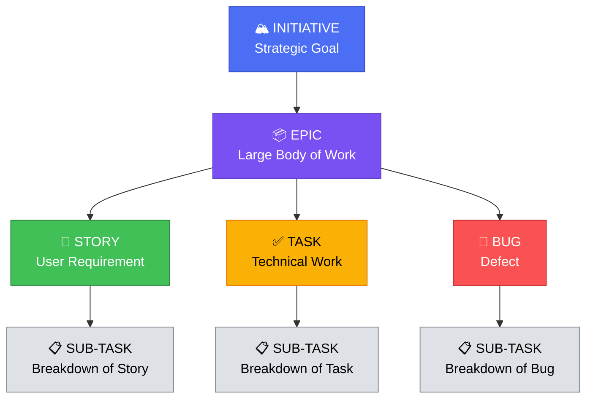
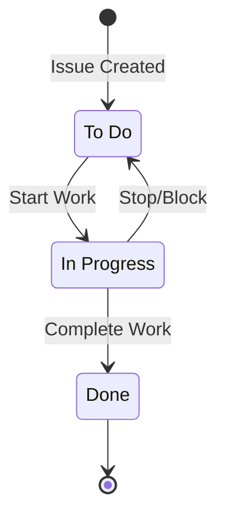
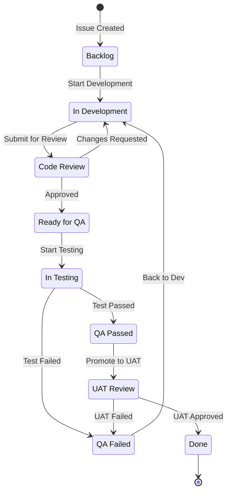
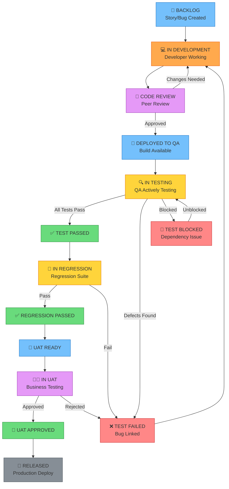
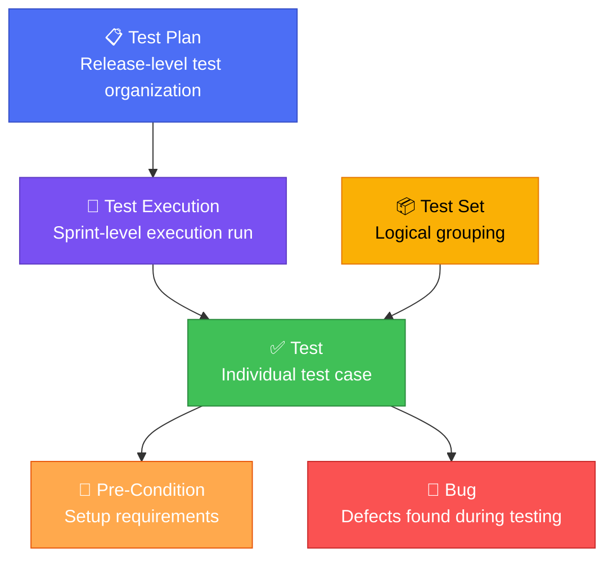

# Part 8: JIRA for Test Management

> **Study Guide for Manual Testing Professionals**
> *Mastering JIRA as a Testing and Defect Management Powerhouse*

---

## 8.1 JIRA Overview

### What is JIRA?

**JIRA** is a powerful project management and issue tracking tool developed by **Atlassian**. Originally designed as a bug and issue tracker for software development teams, JIRA has evolved into a comprehensive **work management platform** used by software development, IT operations, business teams, and quality assurance professionals worldwide.

For **QA and testing professionals**, JIRA serves as:
- A **defect tracking system** — logging, assigning, tracking, and closing bugs
- A **test management tool** — organizing test cases, tracking test execution (with plugins)
- A **requirements traceability tool** — linking tests and defects to user stories and requirements
- A **reporting and metrics platform** — dashboards, charts, and custom reports for QA managers
- A **collaboration hub** — facilitating communication between QA, development, product, and stakeholders

> [!NOTE]
> The name "JIRA" is derived from "Gojira," the Japanese name for Godzilla. It was a playful nod to Bugzilla, the popular open-source bug tracker that JIRA was originally designed to compete with.

---

### JIRA History and Evolution

| Year | Milestone |
|------|-----------|
| **2002** | Atlassian founded in Sydney, Australia by Mike Cannon-Brookes and Scott Farquhar |
| **2002** | JIRA 1.0 released as a bug and issue tracker |
| **2004** | JIRA 3.0 — introduced custom workflows, making it configurable beyond just bug tracking |
| **2007** | JIRA 3.10 — added project roles and improved permissions |
| **2009** | JIRA Agile (formerly GreenHopper) plugin introduced — Scrum & Kanban boards |
| **2011** | JIRA 5.0 — major UI overhaul, inline editing, improved performance |
| **2013** | JIRA 6.0 — new project creation wizard, improved Agile boards |
| **2015** | JIRA 7.0 — introduced JIRA Software (dev teams), JIRA Service Desk (IT), JIRA Core (business) |
| **2017** | JIRA Cloud introduced — SaaS model with regular automatic updates |
| **2020** | Atlassian announces end-of-life for JIRA Server — pushes customers toward Cloud or Data Center |
| **2021** | JIRA Server licenses discontinued for new customers |
| **2024** | JIRA Server reaches end-of-support — all customers must migrate to Cloud or Data Center |
| **2025** | JIRA Cloud dominates with AI-powered features (Atlassian Intelligence), improved automation, and enhanced integration ecosystem |

---

### JIRA Cloud vs JIRA Server vs JIRA Data Center

| Feature | JIRA Cloud | JIRA Server (Discontinued) | JIRA Data Center |
|---------|-----------|---------------------------|-----------------|
| **Hosting** | Hosted by Atlassian (SaaS) | Self-hosted on your own server | Self-hosted (clustered) |
| **Updates** | Automatic, continuous releases | Manual updates by admin | Manual updates by admin |
| **Availability (2025)** | ✅ Available — Primary offering | ❌ Discontinued (Feb 2024) | ✅ Available for enterprise |
| **Infrastructure** | Managed by Atlassian | Managed by your IT team | Managed by your IT team |
| **Scalability** | Auto-scales (Atlassian manages) | Limited to single server | Horizontally scalable (cluster) |
| **Customization** | Marketplace apps, limited deep customization | Full customization, custom plugins | Full customization, custom plugins |
| **Performance** | Depends on plan tier | Depends on your hardware | High performance (multi-node) |
| **AI Features** | ✅ Atlassian Intelligence (AI) | ❌ No AI features | Limited AI features |
| **Best For** | Small to large teams wanting hassle-free management | (Legacy — not available for new customers) | Large enterprises with strict compliance/data residency needs |
| **Cost Model** | Per-user monthly subscription | One-time license (discontinued) | Annual license based on user count |

> [!IMPORTANT]
> **As of 2025**, most organizations are on **JIRA Cloud**. JIRA Server is no longer supported. If you're in an interview, be familiar with JIRA Cloud — it's the industry standard.

---

### JIRA Pricing and Licensing (2025 Context)

| Plan | Users | Price (Per User/Month) | Key Features |
|------|-------|----------------------|--------------|
| **Free** | Up to 10 users | $0 | Basic Scrum/Kanban boards, backlog, 2 GB storage |
| **Standard** | Up to 50,000 users | ~$8.15/user/month | Audit logs, 250 GB storage, project roles, advanced permissions |
| **Premium** | Up to 50,000 users | ~$16/user/month | Advanced roadmaps, sandbox environment, unlimited storage, IP allow-listing, SLA guarantee (99.9%) |
| **Enterprise** | Unlimited | Custom pricing | Unlimited sites, Atlassian Intelligence, advanced security (SAML SSO, SCIM), data residency, 24/7 support |

> [!NOTE]
> Prices are approximate and subject to change. Atlassian uses a tiered pricing model where the per-user cost decreases with larger team sizes. For the latest pricing, check [atlassian.com/software/jira/pricing](https://www.atlassian.com/software/jira/pricing).

---

### Why JIRA is the Industry Standard

**Market Dominance:**
- JIRA holds approximately **70-75% market share** in project/issue tracking tools as of 2025
- Used by over **65,000 companies** globally, including 85% of Fortune 500 companies
- Over **10 million monthly active users** worldwide

**Why Teams Choose JIRA:**

| Reason | Explanation |
|--------|-------------|
| **Highly Customizable** | Workflows, fields, issue types, screens, permissions — nearly everything is configurable |
| **Agile-First** | Native Scrum and Kanban boards, sprint planning, velocity charts, burndown charts |
| **Rich Ecosystem** | 3,000+ Marketplace apps/plugins for every need (test management, CI/CD, reporting) |
| **Integration** | Integrates with Confluence, Bitbucket, GitHub, GitLab, Slack, Teams, Jenkins, and 100+ tools |
| **Powerful Querying** | JQL (JIRA Query Language) enables complex searches and custom reports |
| **Reporting** | Built-in dashboards with gadgets, custom reports, and exportable data |
| **Scalability** | From 10-person startups to 100,000-person enterprises |
| **Atlassian Intelligence** | AI-powered features: auto-summarization, smart suggestions, natural language JQL |

---

## 8.2 JIRA Core Concepts

### Projects

A **Project** in JIRA is a collection of issues (tasks, bugs, stories, etc.) organized around a common goal, product, or team. Every issue in JIRA belongs to exactly one project.

**Project Types:**

| Project Type | Template | Best For | Examples |
|-------------|----------|----------|----------|
| **Software Development** | Scrum or Kanban | Dev + QA teams building software products | "E-Commerce Platform," "Mobile Banking App" |
| **Business** | Project Management | Non-technical teams tracking work | "Marketing Campaign Q1," "HR Onboarding" |
| **Service Management** | ITSM | IT support, service desk | "IT Help Desk," "Customer Support" |

**Project Configuration Elements:**

| Element | Description | Example |
|---------|-------------|---------|
| **Project Key** | Short prefix for all issues in the project (2-10 characters) | `ECOM` → issues are ECOM-1, ECOM-2, etc. |
| **Project Lead** | Person responsible for the project | Jane Smith (Engineering Manager) |
| **Default Assignee** | Who issues are assigned to by default | Unassigned, Project Lead, or Component Lead |
| **Issue Types** | Types of work items allowed in the project | Epic, Story, Task, Sub-task, Bug |
| **Workflow** | The state transitions that issues follow | To Do → In Progress → In Review → Done |
| **Notification Scheme** | Who gets notified about what events | "Reporter gets notified when issue is resolved" |
| **Permission Scheme** | Who can do what (create, edit, close, delete issues) | "Only QA team can create Bug issue types" |

**Project Roles:**

| Role | Typical Members | Permissions |
|------|----------------|-------------|
| **Administrators** | Project managers, tech leads | Full configuration access |
| **Developers** | Software engineers | Create/edit issues, transitions |
| **QA** | Testers, QA engineers | Create bugs, manage test-related issues |
| **Viewers** | Stakeholders, executives | Read-only access |

---

### Issues

An **Issue** is the fundamental unit of work in JIRA. Everything tracked in JIRA — from a massive initiative to a tiny sub-task — is an issue.

**Issue Types:**



| Issue Type | Symbol | Description | Example |
|-----------|--------|-------------|---------|
| **Epic** | 📦 | A large body of work that can be broken into smaller stories/tasks. Spans multiple sprints. | "User Authentication Module" — includes login, registration, password reset, MFA |
| **Story (User Story)** | 📖 | A feature or requirement from the user's perspective. Deliverable in a single sprint. | "As a user, I want to log in with my email and password so I can access my account" |
| **Task** | ✅ | A unit of work that isn't directly a user-facing feature — often technical or operational. | "Set up CI/CD pipeline for the authentication module" |
| **Sub-task** | 📋 | A breakdown of a story, task, or bug into smaller pieces. | Under the Login story: "Implement login form UI," "Implement login API endpoint," "Write login unit tests" |
| **Bug** | 🐛 | A defect — a deviation from expected behavior. | "Login fails with valid credentials when MFA is disabled" |

**Issue Fields:**

| Field Category | Fields | Description |
|---------------|--------|-------------|
| **System Fields** | Summary, Description, Status, Priority, Resolution, Assignee, Reporter, Created, Updated | Built-in fields that exist on every issue |
| **Standard Fields** | Components, Labels, Fix Version, Affects Version, Sprint, Story Points, Environment | Commonly used fields available by default |
| **Custom Fields** | Any field created by admin | Organization-specific fields: "Test Case ID," "Root Cause Category," "Browser," "Severity" |

**Issue Hierarchy:**

JIRA supports a hierarchical structure for organizing work:

| Level | Issue Type | Scope | Example |
|-------|-----------|-------|---------|
| **Level 1 (Top)** | Initiative | Strategic goal spanning quarters/years | "Modernize Payment Platform" |
| **Level 2** | Epic | Large feature spanning multiple sprints | "Implement Apple Pay Integration" |
| **Level 3** | Story / Task / Bug | Sprint-level deliverable | "Display Apple Pay button on checkout page" |
| **Level 4** | Sub-task | Atomic unit of work within a parent | "Create Apple Pay button component" |

---

### Workflows

A **Workflow** in JIRA defines the set of **statuses** and **transitions** that an issue goes through during its life cycle. It's the backbone of how work flows through your team.

**Default JIRA Workflow:**



This default workflow is simple but insufficient for most testing workflows. Let's create a custom one.

**Custom Workflow Creation — Step-by-Step:**

**Step 1: Define Your Statuses**

First, list all the statuses your issues will pass through:

| Status | Category | Description |
|--------|----------|-------------|
| To Do | To Do | Issue is in the backlog, not started |
| In Development | In Progress | Developer is working on the issue |
| Code Review | In Progress | Code is being peer-reviewed |
| Ready for QA | To Do | Issue is ready for testing |
| In Testing | In Progress | QA is actively testing |
| QA Failed | To Do | Testing found issues, sent back to dev |
| QA Passed | Done | Testing passed, fix verified |
| Done | Done | Issue is complete |

**Step 2: Define Transitions**

Transitions are the paths between statuses:

| From Status | To Status | Transition Name | Who Can Trigger |
|-------------|-----------|----------------|-----------------|
| To Do | In Development | Start Development | Developer |
| In Development | Code Review | Submit for Review | Developer |
| Code Review | In Development | Request Changes | Reviewer |
| Code Review | Ready for QA | Approve & Deploy | Reviewer |
| Ready for QA | In Testing | Start Testing | Tester |
| In Testing | QA Failed | Fail Test | Tester |
| In Testing | QA Passed | Pass Test | Tester |
| QA Failed | In Development | Reopen | Tester |
| QA Passed | Done | Close | QA Lead |

**Step 3: Configure Conditions, Validators, and Post-Functions**

| Component | Purpose | Example |
|-----------|---------|---------|
| **Conditions** | Control who can perform a transition | "Only members of the 'QA' group can trigger 'Pass Test'" |
| **Validators** | Ensure required data is provided | "Resolution must be set before transitioning to 'Done'" |
| **Post-Functions** | Automatic actions after a transition | "When 'QA Passed,' automatically assign to QA Lead for sign-off" |

**Step 4: Create the Workflow in JIRA**

1. Go to **JIRA Settings** → **Issues** → **Workflows**
2. Click **Add Workflow** → Name it (e.g., "QA Testing Workflow")
3. Add statuses by clicking **Add Status** for each status listed above
4. Add transitions by clicking the source status and dragging to the target status
5. Configure conditions, validators, and post-functions on each transition
6. **Publish** the workflow (make it active)
7. **Associate** the workflow with your project via a **Workflow Scheme**

**Example: Custom QA Testing Workflow:**



---

### Boards

**Boards** provide a visual representation of your team's work. JIRA supports two types of boards:

#### Scrum Board

**Best for:** Teams working in time-boxed iterations (sprints), typically 1-4 weeks.

| Feature | Description |
|---------|-------------|
| **Backlog** | Prioritized list of all issues not yet in a sprint |
| **Sprint** | A time-boxed iteration (e.g., 2 weeks) with committed work |
| **Board Columns** | Visual workflow: To Do → In Progress → In Review → Done |
| **Sprint Planning** | Move issues from backlog to sprint based on velocity |
| **Sprint Review** | Demo completed work at the end of the sprint |
| **Sprint Retrospective** | Team reflects on the process and identifies improvements |
| **Velocity Chart** | Shows story points completed per sprint over time |
| **Burndown Chart** | Shows remaining work in the current sprint over time |

**Scrum Board Setup for QA Teams:**

1. Create a Scrum project or add a Scrum board to an existing project
2. Configure columns to match your workflow:
   - **To Do** → **In Dev** → **Code Review** → **Ready for QA** → **In Testing** → **QA Passed** → **Done**
3. Set WIP (Work In Progress) limits if needed
4. Map statuses to columns
5. Configure swimlanes (e.g., by assignee, epic, or priority)
6. Set up quick filters (e.g., "My Issues," "Bugs Only," "Critical Priority")

#### Kanban Board

**Best for:** Teams with continuous flow (no fixed sprints), support teams, or maintenance work.

| Feature | Description |
|---------|-------------|
| **No Sprints** | Work flows continuously — no time-boxed iterations |
| **WIP Limits** | Maximum number of issues allowed in each column (prevents bottlenecks) |
| **Lead Time** | Time from issue creation to completion |
| **Cycle Time** | Time from when work starts to completion |
| **Cumulative Flow Diagram** | Shows work distribution across statuses over time |
| **Continuous Delivery** | Issues are released as they're completed |

**Board Configuration — Columns, Swimlanes, Quick Filters:**

| Configuration | Description | Example |
|--------------|-------------|---------|
| **Columns** | Map workflow statuses to visual columns | "To Do" column contains statuses: Backlog, Selected for Dev |
| **Column Limits** | Set WIP limits per column | "In Testing" column: max 5 issues |
| **Swimlanes** | Horizontal groupings on the board | By Priority, By Assignee, By Epic, By Issue Type |
| **Quick Filters** | One-click filters above the board | "My Issues" (assignee = currentUser()), "Bugs Only" (type = Bug) |
| **Card Layout** | Customize what info appears on cards | Show: Priority icon, Assignee avatar, Story Points, Labels |
| **Card Colors** | Color-code cards by criteria | Red for Blocker priority, Blue for Stories, Orange for Bugs |

---

## 8.3 JIRA Workflow for Testing

### Custom Test Management Workflow Design

A dedicated testing workflow goes beyond the default JIRA workflow by incorporating **QA-specific statuses and transitions** that model how testing actually works in real teams.

**Testing-Specific Statuses:**

| Status | Category | Description | Owned By |
|--------|----------|-------------|----------|
| **Ready for Test** | To Do | Issue is deployed and ready for QA to test | Auto (from deploy) |
| **In Testing** | In Progress | QA engineer is actively testing | QA Engineer |
| **Test Blocked** | In Progress | Testing is blocked by an external dependency | QA Engineer |
| **Test Failed** | To Do | Testing found defects, sent back to dev | QA Engineer |
| **Test Passed** | Done | All test scenarios passed | QA Engineer |
| **In Regression** | In Progress | Regression testing is in progress | QA Engineer |
| **Regression Passed** | Done | Regression suite passed | QA Lead |
| **UAT Ready** | To Do | Ready for User Acceptance Testing | QA Lead |
| **In UAT** | In Progress | Business users are testing | Business Users |
| **UAT Approved** | Done | Business users have accepted | Product Owner |
| **Released** | Done | Deployed to production | DevOps |

### Complete Testing Workflow — Mermaid Diagram



### Transition Rules and Conditions

| Transition | Condition | Validator | Post-Function |
|-----------|-----------|-----------|---------------|
| **Move to "In Testing"** | Only QA group members | Issue must have "Build Version" field populated | Auto-assign to the QA engineer in the Component Lead |
| **Move to "Test Failed"** | Only QA group members | Comment is mandatory (must explain what failed) | Create a linked Bug automatically; Send notification to developer |
| **Move to "Test Passed"** | Only QA group members | All sub-tasks must be Done | Send notification to QA Lead |
| **Move to "UAT Approved"** | Only Product Owner role | Comment with approval note required | Set resolution to "Done"; Send notification to DevOps |
| **Move to "Test Blocked"** | Only QA group members | Blocker link must be added | Send notification to QA Lead and PM |

---

## 8.4 Creating and Managing Test Cases in JIRA

### Native JIRA Approach (Using Stories/Tasks)

JIRA doesn't have a built-in "Test Case" issue type, but you can manage test cases natively using creative configuration:

**Method 1: Custom Issue Type for Test Cases**

1. Go to **JIRA Settings** → **Issues** → **Issue Types**
2. Create a new issue type: "Test Case" with icon 🧪
3. Create a custom issue type scheme and add "Test Case" to your project
4. Create custom fields for test cases:
   - **Test Steps** (Text field, multi-line)
   - **Expected Result** (Text field, multi-line)
   - **Test Data** (Text field)
   - **Pre-Conditions** (Text field)
   - **Test Type** (Select: Functional, Regression, Smoke, Integration)
   - **Execution Status** (Select: Not Executed, Pass, Fail, Blocked, Skipped)
5. Create a custom screen layout showing these fields

**Method 2: Using Stories with Labels**

If you don't want to create custom issue types:
- Create test cases as **Tasks** or **Stories**
- Use the label `test-case` to identify them
- Use the **Component** field to categorize (e.g., "Login Tests," "Checkout Tests")
- Link test cases to requirements using JIRA issue links ("tests" link type)

**Test Case Fields Mapping:**

| Traditional Test Case Field | JIRA Field | Type |
|---------------------------|------------|------|
| Test Case ID | Issue Key (auto-generated) | System |
| Test Case Title | Summary | System |
| Description / Objective | Description | System |
| Pre-Conditions | Custom field: Pre-Conditions | Custom (Text) |
| Test Steps | Custom field: Test Steps | Custom (Text, Multi-line) |
| Expected Results | Custom field: Expected Results | Custom (Text, Multi-line) |
| Test Data | Custom field: Test Data | Custom (Text) |
| Test Type | Custom field: Test Type | Custom (Select) |
| Priority | Priority | System |
| Module / Component | Component | System |
| Execution Status | Custom field: Execution Status | Custom (Select) |
| Linked Requirements | Issue Links ("tests" relationship) | System |
| Assignee (Tester) | Assignee | System |
| Attachments | Attachments | System |
| Comments / Notes | Comments | System |

**Example: Creating a Test Case in JIRA**

```
Issue Type: Test Case 🧪
Key: ECOM-TC-042
Summary: Verify successful login with valid email and password

Description:
Verify that a registered user can successfully log in to the application using
valid email and password credentials and is redirected to the dashboard.

Component: Authentication
Labels: test-case, regression, smoke
Priority: High

Pre-Conditions:
1. User account exists in the system (john.doe@test.com / Test@1234)
2. Account is active and not locked
3. MFA is disabled for the account
4. Application is accessible at https://qa-staging.example.com

Test Steps:
Step 1: Open the application login page (https://qa-staging.example.com/login)
Step 2: Enter "john.doe@test.com" in the Email field
Step 3: Enter "Test@1234" in the Password field
Step 4: Click the "Sign In" button

Expected Results:
Step 1: Login page loads with Email and Password fields visible
Step 2: Email is accepted in the field
Step 3: Password is masked (shown as dots)
Step 4: User is redirected to /dashboard. Welcome message "Hello, John!" is displayed.
         Session token is created. Navigation menu shows user's name.

Test Data:
- Email: john.doe@test.com
- Password: Test@1234

Test Type: Functional, Smoke
Execution Status: Not Executed

Linked Issues:
- tests → ECOM-101 (Story: User Login with Email/Password)
- is tested by → ECOM-TC-043 (Negative: Login with invalid password)
```

---

## 8.5 Bug Reporting in JIRA

### Step-by-Step Guide to Creating a Bug in JIRA

**Step 1: Click "Create" (or press `C`)**
- The Create Issue dialog opens
- Select your **Project** from the dropdown
- Select **Bug** as the Issue Type

**Step 2: Fill in the Bug Details**

| Field | What to Enter | Example |
|-------|--------------|---------|
| **Summary** | Clear, descriptive title | "Checkout fails with 500 error when applying expired discount code" |
| **Description** | Detailed description with STR, expected/actual results | See template below |
| **Priority** | Business urgency | High (P2) |
| **Severity** | Technical impact (custom field) | Major (S2) |
| **Component** | Module/feature area | Checkout, Payments |
| **Affects Version** | Version where the bug was found | v2.5.0-beta.3 |
| **Fix Version** | Target version for the fix | v2.5.0 (or leave blank for triage) |
| **Environment** | OS, browser, device, build details | Windows 11 / Chrome 124 / Desktop / Build #2841 / QA-Staging |
| **Labels** | Tags for categorization | `regression`, `checkout`, `p2-review` |
| **Sprint** | Current sprint (if applicable) | Sprint 23 |
| **Assignee** | Developer to fix (or leave for triage) | Unassigned (or specific dev if known) |
| **Attachments** | Screenshots, videos, logs | Upload files |
| **Linked Issues** | Related stories/bugs | "is caused by" ECOM-101, "blocks" ECOM-TC-087 |

**Step 3: Use the Description Template**

```markdown
## Description
When a user applies an expired discount code during checkout, the application
returns a 500 Internal Server Error instead of a user-friendly error message.

## Pre-Conditions
1. User is logged in and has items in the cart
2. Expired discount code: SUMMER2024 (expired on Dec 31, 2024)

## Steps to Reproduce
1. Log in as john.doe@test.com / Test@1234
2. Add "Wireless Mouse" (SKU: WM-001) to the cart
3. Click "Proceed to Checkout"
4. On the Order Summary page, enter "SUMMER2024" in the "Discount Code" field
5. Click "Apply"

## Expected Result
- A user-friendly error message should be displayed: "This discount code has
  expired. Please use a valid code."
- The checkout flow should continue without interruption
- The order total should remain unchanged

## Actual Result
- A generic "500 Internal Server Error" page is displayed
- The entire checkout flow is broken — user must start over
- Browser console shows: POST /api/v2/checkout/apply-discount 500
- Server log: NullPointerException at DiscountService.java:147

## Reproducibility
Always (10/10 attempts)

## Additional Notes
- This is a regression — expired codes showed a proper error in v2.4.0
- Valid discount codes (e.g., WELCOME2025) work correctly
- The issue appears to be a null check missing when the discount lookup
  returns null for expired codes
```

**Step 4: Attach Evidence**
- Drag and drop screenshots directly into the description or attachments
- Use the **Attach** button for files
- For screen recordings, upload MP4/GIF files

**Step 5: Link Related Issues**
- Click "Link" → Select link type → Search for related issues:
  - "**is caused by**" → Link to the story/feature that introduced the bug
  - "**blocks**" → Link to test cases or other issues this bug blocks
  - "**duplicates**" → Link if this is related to another known bug
  - "**is related to**" → General relationship to other issues

**Step 6: Submit**
- Review all fields one final time
- Click **Create** to submit the bug
- Note the generated issue key (e.g., ECOM-1042) for reference

---

### Bug Template Configuration in JIRA

To ensure consistent bug reports across your team, configure a **default template** for the Bug issue type:

1. Go to **JIRA Settings** → **Issues** → **Issue Types** → **Bug**
2. Edit the **Description** field default value
3. Add the following template:

```
h2. Description
[Describe the issue in detail]

h2. Pre-Conditions
# [List any required setup]

h2. Steps to Reproduce
# [Step 1]
# [Step 2]
# [Step 3]

h2. Expected Result
[What should happen]

h2. Actual Result
[What actually happens]

h2. Reproducibility
[Always / Sometimes (X out of Y) / Rarely / One-time]

h2. Additional Notes
[Browser console errors, server logs, related issues, etc.]
```

> [!TIP]
> In JIRA Cloud (2025), you can also use **issue templates** via Marketplace apps like "Issue Templates for Jira" or use **Automation rules** to auto-populate fields when a Bug is created.

---

### Required Fields for Bug Reports

Configure your project's **Field Configuration** to make essential fields mandatory when creating a Bug:

| Field | Required? | Rationale |
|-------|-----------|-----------|
| Summary | ✅ Required | Every bug needs a title |
| Description | ✅ Required | Must include STR, expected/actual results |
| Priority | ✅ Required | Determines fix urgency |
| Severity | ✅ Required (custom) | Determines technical impact |
| Component | ✅ Required | Identifies the affected module |
| Affects Version | ✅ Required | Identifies the version where the bug exists |
| Environment | ✅ Required | OS, browser, device, build info |
| Reproducibility | ⬜ Optional (recommended) | How consistently the bug can be reproduced |
| Fix Version | ⬜ Optional | Set during triage |
| Assignee | ⬜ Optional | Set during triage |
| Labels | ⬜ Optional | Useful for categorization and filtering |
| Attachments | ⬜ Optional (encouraged) | Screenshots, videos, logs |

---

## 8.6 JIRA Dashboards and Reports

### Creating QA Dashboards

A **Dashboard** in JIRA is a customizable page containing multiple **gadgets** (widgets) that display real-time project data. QA teams should create dedicated dashboards for monitoring testing progress, defect status, and quality metrics.

**How to Create a QA Dashboard:**

1. Click **Dashboards** → **Create Dashboard**
2. Name it: "QA Dashboard - [Project Name]"
3. Set permissions: Share with QA team, Dev team, PM
4. Click **Add Gadget** to add widgets
5. Arrange gadgets by dragging and dropping

### Essential Gadgets for Testing

| Gadget | Purpose | Configuration | Example View |
|--------|---------|---------------|-------------|
| **Filter Results** | Shows issues matching a JQL query | JQL: `type = Bug AND status != Closed` | List of all open bugs with key, summary, priority, assignee |
| **Pie Chart** | Visual distribution of issues by a field | Field: Priority; JQL: `type = Bug AND project = ECOM` | Pie chart showing 15% Critical, 30% High, 35% Medium, 20% Low |
| **Two Dimensional Filter Statistics** | Cross-reference two fields | X-axis: Priority; Y-axis: Status; Filter: All open bugs | Matrix showing bug counts by priority × status |
| **Created vs Resolved Chart** | Trend of bug discovery vs closure | Period: Daily; Filter: All bugs | Line chart showing bugs created/resolved over time |
| **Heat Map** | Density of issues by a field | Field: Component; Filter: Open bugs | Visual showing "Checkout" has 23 bugs (red), "Profile" has 3 (green) |
| **Sprint Burndown** | Remaining work in current sprint | Board: QA Sprint Board | Declining chart showing remaining story points |
| **Sprint Health** | Current sprint status overview | Board: Team Sprint Board | Shows completed vs remaining items |
| **Bubble Chart** | Multi-dimensional view of issues | X: Priority, Y: Age, Size: Linked Issues | Bubbles showing aging critical bugs |

### Example Dashboard Layout

```
┌──────────────────────────────────────────────────────────────────────┐
│                    QA DASHBOARD - E-Commerce Platform                │
├──────────────────────────────┬───────────────────────────────────────┤
│                              │                                       │
│  📊 BUG SUMMARY BY STATUS   │  🥧 BUGS BY SEVERITY                 │
│                              │                                       │
│  Open:        15             │  [Pie Chart]                          │
│  In Progress: 8              │  Critical: 3 (8%)                    │
│  Fixed:       5              │  Major: 12 (30%)                     │
│  Verified:    12             │  Medium: 15 (38%)                    │
│  Closed:      45             │  Minor: 7 (18%)                     │
│  Reopened:    3              │  Trivial: 3 (8%)                    │
│  Total:       88             │                                       │
│                              │                                       │
├──────────────────────────────┼───────────────────────────────────────┤
│                              │                                       │
│  📈 CREATED vs RESOLVED     │  🔥 TOP 10 CRITICAL/BLOCKER BUGS     │
│     (Last 30 Days)          │                                       │
│                              │  ECOM-1042 Login fails (P1) - 3 days │
│  [Line Chart]                │  ECOM-1091 Data loss (P1) - 2 days  │
│  Created: ───── (declining)  │  ECOM-1103 Payment err (P2) - 1 day │
│  Resolved: ----- (catching up)│  ...                                │
│                              │                                       │
├──────────────────────────────┼───────────────────────────────────────┤
│                              │                                       │
│  📋 MY OPEN BUGS            │  🏔️ DEFECT AGING REPORT              │
│  (Assigned to Current User)  │                                       │
│                              │  < 1 day:    ████████ 8              │
│  [Filter Results List]       │  1-3 days:   ██████ 6                │
│  ECOM-1078 UI overlap (P2)   │  3-7 days:   ████ 4                 │
│  ECOM-1125 Checkout (P3)    │  7-14 days:  ██ 2                    │
│  ...                         │  > 14 days:  █ 1 ⚠️                  │
│                              │                                       │
├──────────────────────────────┴───────────────────────────────────────┤
│                                                                      │
│  📊 SPRINT BURNDOWN - Sprint 23 (Nov 4 - Nov 15)                   │
│                                                                      │
│  Story Points: 45 planned → 30 remaining → 7 days left             │
│  [Burndown Chart]                                                    │
│                                                                      │
└──────────────────────────────────────────────────────────────────────┘
```

### Custom Reports for QA Managers

| Report | Description | How to Create | Useful For |
|--------|-------------|---------------|------------|
| **Defect Density by Module** | Bugs per component/module | Pie/bar chart gadget filtered by component | Identifying quality hotspots |
| **Test Execution Progress** | Pass/Fail/Not Executed rates | Two-dimensional filter (Test Type × Status) | Tracking testing completeness |
| **Defect Aging** | How long bugs have been open | Created vs Resolved + filter for open bugs | Identifying stale bugs |
| **Reopened Bug Rate** | Percentage of bugs that were reopened | JQL for reopened bugs / total resolved × 100 | Measuring fix quality |
| **Release Readiness** | Open Critical/Major bugs trend | Created vs Resolved filtered by severity S1/S2 | Go/No-Go release decision |
| **Tester Productivity** | Bugs found per tester, test cases executed | Filter results grouped by reporter | Team performance review |

---

## 8.7 JQL (JIRA Query Language) for Testers

### JQL Basics

**JQL (JIRA Query Language)** is a powerful query language that allows you to search for issues in JIRA using structured queries. Think of it as SQL for JIRA — it lets you find exactly the issues you need using fields, operators, keywords, and functions.

**Syntax Structure:**

```
field operator value [AND/OR field operator value] [ORDER BY field ASC/DESC]
```

**Components:**

| Component | Description | Examples |
|-----------|-------------|---------|
| **Fields** | Issue attributes to search by | `project`, `type`, `status`, `priority`, `assignee`, `reporter`, `created`, `updated`, `summary`, `description`, `component`, `label`, `fixVersion`, `affectedVersion`, `sprint`, `resolution` |
| **Operators** | How to compare fields to values | `=`, `!=`, `>`, `>=`, `<`, `<=`, `~` (contains), `!~` (not contains), `IN`, `NOT IN`, `IS`, `IS NOT`, `WAS`, `WAS IN`, `WAS NOT`, `CHANGED` |
| **Values** | What to compare against | `"Bug"`, `"High"`, `"currentUser()"`, `"2025-01-01"`, `EMPTY`, `NULL` |
| **Keywords** | Logical connectors and modifiers | `AND`, `OR`, `NOT`, `ORDER BY`, `ASC`, `DESC` |
| **Functions** | Dynamic values | `currentUser()`, `now()`, `startOfDay()`, `endOfWeek()`, `membersOf("group")`, `updatedBy()` |

---

### Essential JQL Queries for Testers (20+ Queries)

#### Basic Bug Finding Queries

**1. Find all open bugs assigned to me**
```sql
type = Bug AND assignee = currentUser() AND status != Closed
ORDER BY priority ASC, created DESC
```
*Use: Daily standup — check what's on your plate.*

**2. Find all critical/blocker bugs in the current sprint**
```sql
type = Bug AND priority IN (Highest, High) AND sprint in openSprints()
ORDER BY priority ASC, created ASC
```
*Use: Sprint review — identify blocking issues.*

**3. Find bugs reported in the last 7 days**
```sql
type = Bug AND created >= -7d
ORDER BY created DESC
```
*Use: Weekly bug summary report.*

**4. Find bugs reported today**
```sql
type = Bug AND created >= startOfDay()
ORDER BY created DESC
```
*Use: Daily triage meeting preparation.*

**5. Find bugs by component/module**
```sql
type = Bug AND component = "Checkout" AND status != Closed
ORDER BY priority ASC
```
*Use: Module-specific testing focus.*

**6. Find reopened bugs**
```sql
type = Bug AND status = Reopened
ORDER BY updated DESC
```
*Alternative — find bugs that were EVER reopened:*
```sql
type = Bug AND status WAS "Reopened"
ORDER BY updated DESC
```
*Use: Identify quality issues with developer fixes.*

**7. Find bugs by severity and priority**
```sql
type = Bug AND "Severity" = "Critical" AND priority = Highest
ORDER BY created ASC
```
*Use: Focus on the most impactful bugs first.*

**8. Find unresolved bugs older than 14 days**
```sql
type = Bug AND resolution = Unresolved AND created <= -14d
ORDER BY created ASC
```
*Use: Aging defects report — follow up on stale bugs.*

#### Advanced Bug Analysis Queries

**9. Find bugs that I reported**
```sql
type = Bug AND reporter = currentUser()
ORDER BY created DESC
```
*Use: Track your own reported defects.*

**10. Find bugs not assigned to anyone**
```sql
type = Bug AND assignee is EMPTY AND status != Closed
ORDER BY priority ASC, created ASC
```
*Use: Triage — identify unassigned bugs that need attention.*

**11. Find bugs with no fix version assigned**
```sql
type = Bug AND fixVersion is EMPTY AND resolution = Unresolved
ORDER BY priority ASC
```
*Use: Release planning — bugs without a target release.*

**12. Find bugs resolved in the current sprint**
```sql
type = Bug AND sprint in openSprints() AND resolution = Done
ORDER BY updated DESC
```
*Use: Sprint closure — verify all resolved bugs are retested.*

**13. Find bugs linked to a specific epic**
```sql
type = Bug AND "Epic Link" = ECOM-50
ORDER BY priority ASC
```
*Use: Feature-level quality assessment.*

**14. Find bugs in a specific version**
```sql
type = Bug AND affectedVersion = "v2.5.0"
ORDER BY severity DESC, priority ASC
```
*Use: Release-specific bug tracking.*

**15. Find bugs with attachments**
```sql
type = Bug AND attachments IS NOT EMPTY
ORDER BY created DESC
```
*Use: Review bugs with evidence/screenshots.*

**16. Find bugs updated in the last 24 hours**
```sql
type = Bug AND updated >= -24h
ORDER BY updated DESC
```
*Use: Track recent activity on bugs.*

**17. Find bugs that were recently closed**
```sql
type = Bug AND status CHANGED TO "Closed" AFTER -7d
ORDER BY updated DESC
```
*Use: Verify recently closed bugs for sign-off.*

**18. Find bugs I need to retest (assigned to me, status is Ready for QA)**
```sql
type = Bug AND assignee = currentUser() AND status = "Ready for QA"
ORDER BY priority ASC
```
*Use: Daily work — find bugs waiting for your retesting.*

**19. Find all bugs in my team's components**
```sql
type = Bug AND component IN ("Authentication", "Checkout", "Payments")
AND status NOT IN (Closed, Resolved)
ORDER BY priority ASC, component ASC
```
*Use: Team-level bug overview.*

**20. Find duplicate bugs**
```sql
type = Bug AND resolution = Duplicate
ORDER BY created DESC
```
*Use: Analyze reporting quality — high duplicates indicate poor bug searching habits.*

**21. Find bugs that changed status in the last 3 days**
```sql
type = Bug AND status CHANGED AFTER -3d
ORDER BY updated DESC
```
*Use: Track defect flow activity.*

**22. Find bugs with specific labels**
```sql
type = Bug AND labels IN ("regression", "hotfix")
ORDER BY priority ASC
```
*Use: Track regression bugs or hotfix candidates.*

**23. Complex query — Critical bugs, unresolved, older than 7 days, in active sprint**
```sql
type = Bug
AND priority IN (Highest, High)
AND resolution = Unresolved
AND created <= -7d
AND sprint in openSprints()
ORDER BY created ASC
```
*Use: Escalation — identify critical bugs that have been open too long.*

---

### Advanced JQL with Functions

| Function | Description | Example |
|----------|-------------|---------|
| `currentUser()` | Returns the currently logged-in user | `assignee = currentUser()` |
| `now()` | Current date and time | `created <= now()` |
| `startOfDay()` | Midnight today | `created >= startOfDay()` |
| `startOfWeek()` | Monday of the current week | `created >= startOfWeek()` |
| `startOfMonth()` | First day of current month | `created >= startOfMonth()` |
| `endOfDay()` | End of today (23:59:59) | `due <= endOfDay()` |
| `membersOf("group")` | All users in a JIRA group | `assignee in membersOf("qa-team")` |
| `openSprints()` | Currently active sprints | `sprint in openSprints()` |
| `closedSprints()` | Completed sprints | `sprint in closedSprints()` |
| `futureSprints()` | Upcoming planned sprints | `sprint in futureSprints()` |
| `updatedBy("user")` | Issues updated by a specific user | `issue in updatedBy("maria.j")` |

---

### Saving and Sharing Filters

**Saving a Filter:**
1. Run your JQL query in the JIRA search bar
2. Click **Save as** (or **Save** if updating an existing filter)
3. Name the filter (e.g., "My Open Bugs - P1/P2")
4. Click **Save**

**Sharing a Filter:**
1. Open the saved filter
2. Click the **Details** icon (ⓘ) or go to filter settings
3. Under **Permissions**, add:
   - **Any logged in user** — everyone in your JIRA instance
   - **Group** — specific groups (e.g., "qa-team")
   - **Project** — all members of a specific project
   - **User** — specific individual

**Using Filters in Dashboards:**
- Most dashboard gadgets accept a "Saved Filter" as their data source
- Create filters for common views and use them across multiple gadgets

---

### JQL Cheat Sheet Table

| What You Want to Find | JQL Query |
|----------------------|-----------|
| All open bugs | `type = Bug AND resolution = Unresolved` |
| My bugs | `type = Bug AND assignee = currentUser()` |
| Bugs I reported | `type = Bug AND reporter = currentUser()` |
| Critical bugs | `type = Bug AND priority = Highest` |
| Bugs in Sprint 23 | `type = Bug AND sprint = "Sprint 23"` |
| Bugs created this week | `type = Bug AND created >= startOfWeek()` |
| Bugs updated today | `type = Bug AND updated >= startOfDay()` |
| Unassigned bugs | `type = Bug AND assignee is EMPTY` |
| Bugs with no component | `type = Bug AND component is EMPTY` |
| Bugs in Checkout module | `type = Bug AND component = "Checkout"` |
| Bugs with "login" in title | `type = Bug AND summary ~ "login"` |
| Bugs NOT in Closed status | `type = Bug AND status != Closed` |
| Bugs resolved as "Won't Fix" | `type = Bug AND resolution = "Won't Fix"` |
| Bugs older than 30 days | `type = Bug AND created <= -30d` |
| Bugs due this week | `type = Bug AND due <= endOfWeek() AND due >= startOfWeek()` |
| Bugs with high severity | `type = Bug AND "Severity" IN ("Critical", "Major")` |
| Bugs that were reopened | `type = Bug AND status WAS "Reopened"` |
| Bugs in multiple projects | `type = Bug AND project IN (ECOM, MOBILE, API)` |
| Bugs with labels | `type = Bug AND labels = "regression"` |
| Overdue bugs | `type = Bug AND due < now() AND resolution = Unresolved` |

---

## 8.8 Integration with Test Management Tools

While JIRA is excellent for project management and bug tracking, it lacks a dedicated **test case management** feature out of the box. This is where specialized test management plugins fill the gap.

### Xray for JIRA

**Overview:**
Xray is a comprehensive test management app for JIRA that provides native test case management, test execution, and reporting capabilities directly within JIRA.

**Key Features:**

| Feature | Description |
|---------|-------------|
| **Test Case Management** | Create manual and automated test cases as JIRA issue types (Test, Pre-Condition, Test Set, Test Plan, Test Execution) |
| **Test Execution** | Execute tests directly in JIRA, record pass/fail/blocked status with evidence |
| **Test Plans** | Organize tests into plans for releases/sprints |
| **Test Sets** | Group related test cases (e.g., "Smoke Tests," "Regression Suite") |
| **Traceability** | Full traceability from requirements → tests → defects → executions |
| **Reporting** | Built-in reports: Test Execution Progress, Test Coverage, Traceability Matrix |
| **CI/CD Integration** | Import results from automation frameworks (JUnit, TestNG, Cucumber, Robot Framework) |
| **BDD/Cucumber Support** | Native support for writing tests in Gherkin (Given/When/Then) syntax |

**Xray Issue Types in JIRA:**



**Setup Steps:**
1. Install Xray from the Atlassian Marketplace (Free trial available)
2. Navigate to your JIRA project → **Project Settings** → **Xray Settings**
3. Configure issue types (Test, Test Execution, Test Plan, etc.)
4. Create your first Test: Click **Create** → Issue Type: **Test** → Choose Manual or BDD
5. Create a Test Execution: Link tests, assign to testers, set sprint/version
6. Execute: Open the Test Execution → Run tests → Record results (Pass/Fail/Blocked)
7. View Reports: Project → Xray Reports → Select report type

---

### Zephyr for JIRA

**Overview:**
Zephyr is one of the oldest and most popular test management plugins for JIRA. It comes in two versions: **Zephyr Squad** (for smaller teams) and **Zephyr Scale** (formerly TM4J — for enterprise teams).

**Zephyr Squad vs Zephyr Scale:**

| Feature | Zephyr Squad | Zephyr Scale (formerly TM4J) |
|---------|-------------|----------------------------|
| **Target Audience** | Small to medium teams | Enterprise teams |
| **Test Case Storage** | Stored as part of JIRA issues | Dedicated test case repository (separate from JIRA issues) |
| **Test Cycles** | Basic test cycles | Advanced test cycles with folders and phases |
| **Parameterized Testing** | ❌ No | ✅ Yes — data-driven testing support |
| **Test Case Versioning** | ❌ No | ✅ Yes — track changes to test cases over time |
| **Cross-Project Tests** | ❌ No | ✅ Yes — share test cases across projects |
| **Advanced Reporting** | Basic reports | Advanced reports with traceability matrices, custom dashboards |
| **BDD Support** | ❌ No | ✅ Yes (Gherkin) |
| **Pricing** | Lower (per user/month) | Higher (per user/month) |
| **Best For** | Startups, small QA teams | Large QA teams, regulated industries |

**Key Concepts in Zephyr:**

| Concept | Description |
|---------|-------------|
| **Test Case** | A single test with steps, expected results, and test data |
| **Test Cycle** | A collection of test cases to be executed together (similar to a test suite) |
| **Test Execution** | The act of running a test cycle and recording results |
| **Folder** | Organizational structure for test cases (e.g., by module, by feature) |
| **Environment** | Test environment configuration (e.g., Chrome/Windows, Safari/macOS) |
| **Test Plan** | High-level plan linking test cycles to releases (Zephyr Scale only) |

**Zephyr Scale Setup Steps:**
1. Install Zephyr Scale from the Atlassian Marketplace
2. Navigate to **Tests** in the project sidebar (new menu item added)
3. Create folder structure: e.g., `Authentication > Login > Positive Cases`
4. Create test cases within folders:
   - Click **Create Test Case**
   - Enter name, objective, pre-conditions
   - Add test steps with expected results
   - Set priority, labels, component
5. Create a Test Cycle:
   - Click **Test Cycles** → **Create Cycle**
   - Name: "Sprint 23 Regression"
   - Add test cases to the cycle
   - Assign testers
6. Execute:
   - Open the test cycle
   - Click on a test case → Execute
   - Record status: Pass / Fail / Blocked / Not Executed
   - Add actual results, attachments, and link defects
7. Report:
   - View execution progress, test coverage, traceability matrix

---

### Comparison: Xray vs Zephyr Scale vs Native JIRA

| Feature | Xray | Zephyr Scale | Native JIRA (No Plugin) |
|---------|------|-------------|------------------------|
| **Test Cases as JIRA Issues** | ✅ Yes (custom issue types) | ❌ No (separate repository) | ⚠️ Workaround (Tasks with labels) |
| **Dedicated Test Repository** | ✅ Yes (within JIRA) | ✅ Yes (separate UI) | ❌ No |
| **Test Plans** | ✅ Yes | ✅ Yes | ❌ No |
| **Test Cycles / Executions** | ✅ Yes | ✅ Yes | ❌ No |
| **Test Steps with Expected Results** | ✅ Yes (structured) | ✅ Yes (structured) | ⚠️ Free text only |
| **Parameterized / Data-Driven Tests** | ✅ Yes (data sets) | ✅ Yes | ❌ No |
| **BDD / Gherkin Support** | ✅ Native | ✅ Yes | ❌ No |
| **Traceability Matrix** | ✅ Requirements ↔ Tests ↔ Defects | ✅ Requirements ↔ Tests ↔ Defects | ⚠️ Manual via issue links |
| **Automated Test Integration** | ✅ JUnit, TestNG, Cucumber, Robot, NUnit | ✅ JUnit, TestNG, Cucumber | ❌ No |
| **Custom Reports** | ✅ Extensive | ✅ Extensive | ⚠️ Dashboard gadgets only |
| **Test Case Versioning** | ✅ Yes | ✅ Yes | ❌ No |
| **Reusable Test Cases** | ✅ Yes | ✅ Yes | ❌ No |
| **Learning Curve** | Moderate (JIRA-native feel) | Moderate (separate UI) | Low (using existing JIRA features) |
| **Pricing (Cloud, per user/month)** | ~$10-30 (tiered) | ~$10-30 (tiered) | $0 (included with JIRA) |
| **Best For** | Teams wanting test management fully integrated as JIRA issues | Teams wanting a dedicated test repository with advanced features | Very small teams or teams just starting with test management |

> [!TIP]
> **When to Use Which:**
> - **Xray** — Choose if your team prefers test cases as first-class JIRA issues, wants strong BDD support, or uses a lot of automation frameworks
> - **Zephyr Scale** — Choose if your enterprise needs a dedicated test repository, advanced reporting, cross-project test sharing, and test case versioning
> - **Native JIRA** — Choose if you're a very small team (< 5 testers), just starting out, or have budget constraints. You can always add a plugin later.

---

## 8.9 JIRA Best Practices for Testing (2025)

### 15+ Best Practices

**1. Use a Dedicated Bug Issue Type**
Don't log bugs as Tasks or Stories. Use the **Bug** issue type with its own workflow, required fields, and screen scheme. This enables proper filtering, reporting, and metrics.

**2. Enforce a Bug Report Template**
Configure a default description template for the Bug issue type. This ensures every bug has STR, expected/actual results, and environment details. Consider using a Marketplace app for richer templates.

**3. Always Link Bugs to Requirements**
Use JIRA's **issue linking** to connect every Bug to the Story, Epic, or requirement it relates to. This provides traceability and helps with impact analysis. Use link types like "is caused by," "tests," or "relates to."

**4. Use Components to Organize Modules**
Set up **Components** matching your application modules (e.g., Authentication, Checkout, Payments, Profile). Assign component leads. This enables module-specific bug tracking and assignment.

**5. Create a Consistent Severity Custom Field**
JIRA's built-in "Priority" field is often confused with Severity. Create a custom **"Severity"** select field with values: Critical, Major, Medium, Minor, Trivial. This separates technical impact from business urgency.

**6. Use Labels Strategically**
Labels are flexible tags for cross-cutting concerns. Useful labels for testing:
- `regression` — defects that are regressions
- `smoke-test` — related to smoke test suite
- `data-loss` — bugs involving data integrity issues
- `security` — security-related defects
- `ux` — user experience issues
- `env-specific` — environment-specific issues

**7. Set Up Automation Rules**
JIRA Cloud supports **Automation** (built-in) to reduce manual work:
- Auto-assign bugs to component lead when component is set
- Auto-transition to "Ready for Retest" when developer comments "Fixed in Build #XXX"
- Auto-close bugs that have been in "Verified" status for 3+ days
- Send Slack/Teams notification when a Critical bug is created
- Auto-add label "aging" to bugs open for more than 14 days

**8. Use Sprints for Test Execution Tracking**
Even if your team isn't fully Agile, use sprints to organize testing work into time-boxed periods. This gives you burndown charts and velocity metrics.

**9. Configure Proper Notification Schemes**
Don't over-notify (everyone ignores emails) or under-notify (people miss critical updates). Set up smart notifications:
- Reporter: notified when their bug changes status
- Assignee: notified when assigned a new bug
- QA Lead: notified when Critical bugs are created or reopened
- Watchers: self-subscribe to bugs they're interested in

**10. Create Shared JQL Filters for the Team**
Create and share common filters that everyone uses:
- "Open Bugs - Current Sprint"
- "Critical/Blocker Bugs - All Projects"
- "My Bugs - Pending Retest"
- "Aging Bugs (> 14 days)"
- "Recently Closed Bugs"

**11. Use Dashboards for Visibility**
Create project and team dashboards displaying real-time bug metrics. Share with development leads and product owners to maintain transparency.

**12. Regularly Groom the Bug Backlog**
Schedule monthly "Bug Backlog Grooming" sessions to review deferred and aging bugs. Close bugs that are no longer relevant, re-prioritize bugs whose urgency has changed, and assign stale unassigned bugs.

**13. Use Fix Version Religiously**
Always set the **Fix Version** during triage. This ties every bug to a release and enables "Release Notes" generation. After release, run `fixVersion = "v2.5.0" AND resolution = Unresolved` to find missed bugs.

**14. Leverage Atlassian Intelligence (AI)**
In 2025, JIRA Cloud offers AI features:
- **Smart summarization** — AI summarizes long bug discussions
- **Natural language JQL** — Type "show me critical bugs from last week" and AI converts to JQL
- **Work suggestions** — AI suggests related issues and potential duplicates

**15. Use Sub-Tasks for Complex Bugs**
If a bug requires multiple actions (fix in frontend + fix in backend + update documentation), create sub-tasks for each:
- Sub-task 1: Fix API validation (Assigned: Backend Dev)
- Sub-task 2: Update error message UI (Assigned: Frontend Dev)
- Sub-task 3: Update user documentation (Assigned: Tech Writer)

**16. Track Test Coverage via Labels or Custom Fields**
Add a custom field or label to stories indicating test coverage status:
- `tested` — test cases created and executed
- `partially-tested` — some test cases executed
- `not-tested` — no test cases created or executed
- This provides a quick view of feature-level test coverage

**17. Archive Completed Sprints Properly**
Before closing a sprint, ensure:
- All bugs are either Closed, Deferred (with target version), or moved to the next sprint
- No bugs are stuck in ambiguous states
- Sprint review notes are documented

---

### Common JIRA Mistakes by Testers

| Mistake | Impact | Correction |
|---------|--------|------------|
| Creating bugs without STR | Developer can't reproduce; marks as CNR | Use the template; always include numbered steps |
| Setting everything as Critical/P1 | Dilutes urgency; real P1s get buried | Follow severity/priority guidelines objectively |
| Not linking bugs to stories | No traceability; impact analysis is impossible | Always add "is caused by" or "relates to" links |
| Leaving Component empty | Module-level reporting is useless | Always select the correct component |
| Not updating bug status | Workflow tracking breaks down | Update status as soon as you complete retest |
| Creating duplicate bugs | Wastes triage time; confuses metrics | Search before logging (use JQL: `summary ~ "keyword"`) |
| Using vague bug titles | Queue is unreadable; triage takes longer | Specific title: what, where, when |
| Ignoring Fix Version | Release planning gaps; missed bugs | Set Fix Version during triage (or flag for PM) |
| Not checking the right build | Retesting on wrong build; incorrect results | Always verify build number before retesting |
| Over-watching issues | Inbox flooded with notifications | Only watch issues you need to act on |

---

### JIRA Hygiene Tips

1. **Close what's done.** If a bug is verified, close it. Don't leave it in "Verified" indefinitely.
2. **Update, don't create.** If you have more info about an existing bug, add a comment — don't create a new bug.
3. **Clean your filters.** Delete or archive filters you no longer use.
4. **Review your dashboard weekly.** Ensure gadgets are still relevant and working.
5. **Use @mentions** in comments to notify specific people (e.g., "@sarah.chen can you review this?").
6. **Bulk operations** — Use JIRA's bulk change feature to update multiple bugs at once (e.g., change all deferred bugs' Fix Version from "v2.5" to "v2.6").

---

### Automation Rules for Testing Workflows

| Rule | Trigger | Action |
|------|---------|--------|
| Auto-assign bugs to component lead | Bug created with component set | Assign to component lead |
| Notify QA Lead on Critical bug | Bug created with priority = Highest | Send email/Slack to QA Lead |
| Auto-transition to "Pending Retest" | Developer adds comment containing "Fix deployed" | Change status to "Pending Retest" |
| Flag aging bugs | Bug open > 14 days | Add label "aging", add flag |
| Auto-close verified bugs | Bug in "Verified" for > 3 days | Change status to "Closed" |
| Reopen notification | Bug status changed to "Reopened" | Notify original assignee and QA Lead |
| Sprint cleanup reminder | Sprint ends | Send summary of unresolved bugs to PM |

---

## 8.10 JIRA Keyboard Shortcuts for Efficiency

> [!TIP]
> Press `?` (question mark) anywhere in JIRA to see the full keyboard shortcuts overlay.

| Shortcut | Action | Context |
|----------|--------|---------|
| `C` | Create a new issue | Global |
| `/` | Focus the search bar | Global |
| `G` then `D` | Go to Dashboard | Global |
| `G` then `B` | Go to Board | Global |
| `G` then `P` | Go to Projects | Global |
| `G` then `I` | Go to Issue Navigator (Search) | Global |
| `J` | Move to next issue in list | Issue navigator / board |
| `K` | Move to previous issue in list | Issue navigator / board |
| `O` or `Enter` | Open selected issue | Issue navigator |
| `E` | Edit the current issue | Issue view |
| `A` | Assign the current issue | Issue view |
| `M` | Comment on the current issue | Issue view |
| `I` | Assign to me | Issue view |
| `L` | Edit labels | Issue view |
| `T` | Change issue type | Issue view |

---

## 8.11 Interview Questions

### Question 1: What is JIRA and why is it used in software testing?

**Model Answer:**
"JIRA is a project management and issue tracking tool developed by Atlassian. While originally designed as a bug tracker, it has evolved into a comprehensive work management platform.

In software testing, JIRA is used for:
1. **Bug Tracking** — Logging, assigning, tracking, and closing defects throughout the defect life cycle
2. **Test Management** — With plugins like Xray or Zephyr, JIRA becomes a full test management tool for creating test cases, executing tests, and reporting results
3. **Requirements Traceability** — Linking test cases and bugs to user stories and epics to ensure complete coverage
4. **Reporting** — Dashboards and JQL queries provide real-time visibility into testing progress, bug trends, and quality metrics
5. **Collaboration** — Comments, @mentions, watchers, and notifications keep the entire team aligned on defect status

JIRA is the industry standard — used by over 65,000 companies and 85% of Fortune 500 organizations. Its customizable workflows, powerful JQL query language, and rich plugin ecosystem make it the top choice for QA teams."

---

### Question 2: What is JQL? Write a query to find all critical bugs assigned to you in the current sprint.

**Model Answer:**
"JQL stands for JIRA Query Language — it's a structured query language for searching issues in JIRA, similar to SQL for databases.

The query to find all critical bugs assigned to me in the current sprint:

```sql
type = Bug AND priority = Highest AND assignee = currentUser() AND sprint in openSprints()
ORDER BY created ASC
```

Let me break down each part:
- `type = Bug` — filters for Bug issue type only
- `priority = Highest` — filters for Critical/Highest priority
- `assignee = currentUser()` — dynamically filters for the logged-in user
- `sprint in openSprints()` — filters for currently active sprints
- `ORDER BY created ASC` — orders by creation date, oldest first (so you fix the oldest critical bugs first)

If I also wanted to include High priority bugs, I'd modify it to:
```sql
type = Bug AND priority IN (Highest, High) AND assignee = currentUser() AND sprint in openSprints()
```"

---

### Question 3: Explain the difference between a Scrum board and a Kanban board in JIRA.

**Model Answer:**
"Scrum and Kanban are two different Agile methodologies, and JIRA provides boards for both:

**Scrum Board:**
- Work is organized into **time-boxed sprints** (typically 1-4 weeks)
- The team commits to a specific set of work at the beginning of each sprint
- The backlog is separate from the board — only sprint items appear on the board
- Includes **Sprint Planning**, **Sprint Review**, and **Sprint Retrospective** ceremonies
- Provides **Burndown Charts** and **Velocity Charts**
- Best for: Teams that work on planned features with regular release cycles

**Kanban Board:**
- Work flows **continuously** — no time-boxed iterations
- Items move from left to right across the board as they progress
- Uses **WIP (Work In Progress) limits** to prevent bottlenecks
- Focuses on **Lead Time** (creation to done) and **Cycle Time** (start to done)
- Provides **Cumulative Flow Diagrams**
- Best for: Support teams, maintenance work, or teams with continuous delivery

For QA teams, I typically recommend:
- **Scrum** for feature testing aligned with development sprints
- **Kanban** for production bug fixing and maintenance testing where work arrives unpredictably"

---

### Question 4: How would you create a custom workflow in JIRA for a testing team?

**Model Answer:**
"To create a custom testing workflow in JIRA, I would follow these steps:

**Step 1: Define Statuses**
I'd define statuses that reflect our testing process:
- Backlog → In Development → Code Review → Ready for QA → In Testing → Test Blocked → Test Failed → Test Passed → UAT → Done

**Step 2: Define Transitions**
Map the paths between statuses — which status can move to which, and who can trigger each transition:
- 'Ready for QA' → 'In Testing': Only QA group members
- 'In Testing' → 'Test Failed': Only QA, with mandatory comment
- 'Test Failed' → 'In Development': Auto-notification to developer

**Step 3: Configure Rules**
- **Conditions** — who can trigger transitions (e.g., only QA can 'Pass Test')
- **Validators** — what data must be provided (e.g., comment required when failing a test)
- **Post-Functions** — automatic actions (e.g., auto-assign to QA Lead when test passes)

**Step 4: Create in JIRA**
Go to Settings → Issues → Workflows → Add Workflow. Add statuses, create transitions, configure rules, then publish.

**Step 5: Associate with Project**
Create or update a Workflow Scheme to associate this workflow with the Bug issue type in our project.

In practice, I'd start simple and iterate. Begin with a basic workflow and add complexity as the team's needs evolve."

---

### Question 5: What are JIRA Components and how would you use them for testing?

**Model Answer:**
"Components in JIRA are sub-sections of a project used to group issues into smaller logical units, typically representing modules or functional areas of the application.

For testing, I'd configure components matching the application's architecture:
- **Authentication** — Login, Registration, Password Reset, MFA
- **Checkout** — Cart, Shipping, Payment, Order Confirmation
- **Product Catalog** — Search, Listings, Product Details, Reviews
- **User Profile** — Account Settings, Addresses, Order History
- **Notifications** — Email, SMS, Push Notifications
- **Admin Panel** — User Management, Reports, Configuration

**Benefits for QA:**
1. **Filtering** — Quickly find all bugs in a specific module using JQL: `component = 'Checkout'`
2. **Assignment** — Set a Component Lead (e.g., a senior developer for each module) and auto-assign bugs
3. **Reporting** — Generate component-level defect density reports to identify quality hotspots
4. **Test Coverage** — Map test cases to components to ensure every module is covered
5. **Triage** — During triage, filter new bugs by component for efficient review"

---

### Question 6: How would you use JIRA to track test execution progress?

**Model Answer:**
"There are several approaches depending on whether you're using plugins:

**With Test Management Plugins (Xray/Zephyr):**
- Create Test Plans for each release
- Create Test Cycles for each sprint within the plan
- Add test cases to cycles and assign to testers
- Testers execute tests and record Pass/Fail/Blocked/Not Executed
- Reports show: overall progress (70% executed, 60% passed), coverage by module, and defects found

**With Native JIRA (No Plugins):**
- Create a 'Test Case' issue type or use Tasks with label `test-case`
- Create a Kanban board filtered by `label = test-case`
- Use statuses: Not Executed → In Progress → Passed / Failed / Blocked
- Dashboard gadgets: Pie chart showing distribution of test statuses
- JQL for progress: `label = test-case AND status = Passed` vs `label = test-case` total

**Dashboard Reporting:**
- Add a Two-Dimensional Filter Statistics gadget: X-axis = Component, Y-axis = Execution Status
- This gives a matrix showing how many tests are passing/failing per module
- Add a Created vs Resolved chart for bugs to show if we're converging on zero open bugs"

---

### Question 7: What is the difference between Xray and Zephyr for JIRA?

**Model Answer:**
"Both are popular test management plugins, but they differ in approach:

**Xray:**
- Test cases are native JIRA issue types — they appear in backlogs, sprints, and boards like any other issue
- Strong BDD/Cucumber support with native Gherkin test case creation
- Supports data-driven testing with parameterized tests
- Excellent automation integration (imports JUnit, TestNG, Cucumber, Robot Framework results)
- Traceability is built on JIRA's native issue linking

**Zephyr Scale (formerly TM4J):**
- Test cases live in a separate, dedicated repository (not JIRA issues)
- Has its own UI for browsing and organizing tests (folder structure)
- Supports test case versioning — track changes to tests over time
- Cross-project test reuse — share test cases across multiple JIRA projects
- Advanced parameterized testing with data-driven test execution

**Key Difference:** Xray is more 'JIRA-native' (everything is a JIRA issue), while Zephyr Scale has a separate, purpose-built test repository with richer test management features.

I'd recommend Xray for teams that want test management tightly integrated into their JIRA workflow, and Zephyr Scale for larger enterprise teams that need advanced features like test versioning and cross-project sharing."

---

### Question 8: How would you set up a QA dashboard in JIRA?

**Model Answer:**
"I would create a dedicated QA dashboard with these key gadgets:

**Row 1 — Status Overview:**
- **Filter Results** showing all open bugs sorted by priority (quick reference list)
- **Pie Chart** showing bug distribution by severity (are we mostly dealing with critical bugs or minor ones?)

**Row 2 — Trends:**
- **Created vs Resolved Chart** (last 30 days) — shows if we're closing bugs faster than finding them
- **Filter Results** for Top 10 Critical/Blocker bugs (the most important bugs that need attention)

**Row 3 — Team & Aging:**
- **Two-Dimensional Filter** — Assignee vs Status (who has how many bugs in what state)
- **Heat Map** by component — which modules have the most bugs

**Row 4 — Sprint:**
- **Sprint Burndown** — are we on track to complete sprint work
- **Sprint Health** — overall sprint status

Each gadget is powered by a saved JQL filter. I'd share the dashboard with the QA team, dev leads, and product owner, and review it at the beginning of each day's standup."

---

### Question 9: Write JQL to find all bugs that were reopened, are still unresolved, and are older than 7 days.

**Model Answer:**
```sql
type = Bug
AND status WAS "Reopened"
AND resolution = Unresolved
AND created <= -7d
ORDER BY priority ASC, created ASC
```

"Let me explain:
- `type = Bug` — only Bug issue types
- `status WAS 'Reopened'` — the `WAS` operator checks the issue's history, finding bugs that were ever in the 'Reopened' status (even if they've moved to a different status since)
- `resolution = Unresolved` — they haven't been resolved yet
- `created <= -7d` — created more than 7 days ago
- `ORDER BY priority ASC, created ASC` — highest priority first, then oldest first

This query is valuable for identifying problematic bugs — they were found, supposedly fixed, reopened because the fix didn't work, and they're STILL not resolved after 7+ days. These need escalation."

---

### Question 10: What JIRA automation rules would you set up for a testing workflow?

**Model Answer:**
"I'd set up these automation rules:

1. **Auto-assign bugs to component lead** — When a bug is created with a component selected, automatically assign it to that component's lead developer. This speeds up triage.

2. **Notify QA Lead on Critical bugs** — When a bug is created with priority = Highest, send an email/Slack notification to the QA Lead immediately. Critical bugs need immediate attention.

3. **Auto-transition to Pending Retest** — When a developer adds a comment containing 'Fixed in Build' or changes status to 'Resolved,' automatically move the bug to 'Pending Retest' and notify the reporter.

4. **Flag aging bugs** — If a bug has been open for more than 14 days, automatically add the label 'aging' and flag the issue on the board. This makes stale bugs visible.

5. **Auto-close verified bugs** — If a bug has been in 'Verified' status for more than 3 business days with no activity, automatically close it.

6. **Reopen notification** — When a bug is moved to 'Reopened,' send a notification to the original developer and QA Lead with the reopen comment.

7. **Sprint cleanup** — When a sprint ends, send a summary to the PM listing all unresolved bugs with their current status.

These automations reduce manual overhead and ensure the workflow keeps moving smoothly."

---

### Question 11: How do you ensure traceability between requirements, test cases, and defects in JIRA?

**Model Answer:**
"Traceability in JIRA is achieved through **issue linking** and **reporting**:

**Setting Up Traceability:**
1. **Requirements → Test Cases:** Link test cases to their parent story/requirement using the 'tests' link type. ECOM-TC-042 *tests* → ECOM-101 (Login Story)
2. **Test Cases → Defects:** When a test fails and a bug is created, link the bug to the test case using 'is caused by' link. ECOM-BUG-1042 *is caused by* → ECOM-TC-042
3. **Defects → Requirements:** The chain automatically connects: Requirement → Test → Defect

**Traceability Matrix:**
With plugins like Xray or Zephyr Scale, you get a built-in **Traceability Matrix** report showing:
- Which requirements have test cases (coverage)
- Which test cases have been executed (progress)
- Which requirements have linked defects (quality)
- Which requirements have untested scenarios (gaps)

Without plugins, you can approximate with JQL:
- Requirements with no linked tests: `type = Story AND issueFunction NOT IN hasLinkType('is tested by')` (requires ScriptRunner)
- Or manually review issue links on each story

This traceability is essential for:
- **Impact Analysis** — When a requirement changes, you know which tests need updating
- **Coverage Reporting** — Ensure every requirement has at least one test
- **Audit Compliance** — In regulated industries, proving that every requirement was tested"

---

### Question 12: What JIRA best practices would you implement as a QA Lead?

**Model Answer:**
"As a QA Lead, my top JIRA best practices would be:

1. **Standardize bug reporting** with a mandatory template including STR, expected/actual results, and environment
2. **Separate Severity from Priority** with a custom Severity field — they measure different things
3. **Use Components** for module-level tracking and auto-assignment
4. **Create shared JQL filters** so the team has quick access to common views
5. **Build a QA dashboard** with real-time bug metrics visible to all stakeholders
6. **Set up automation rules** for notifications, auto-assignment, and aging alerts
7. **Enforce Fix Version** so every bug is tied to a release
8. **Link everything** — bugs to stories, tests to requirements, related bugs to each other
9. **Regular backlog grooming** — monthly review of deferred and aging bugs
10. **Train the team** on JQL, keyboard shortcuts, and efficient JIRA usage

The overarching principle is: JIRA should reflect reality. If the dashboard shows green, the project should actually be in good shape. If it shows red, there should be a clear action plan. JIRA is only as useful as the data quality the team puts into it."

---

## 8.12 Key Takeaways

> [!IMPORTANT]
> **Summary of Part 8 — JIRA for Test Management**

1. **JIRA is the industry standard** for project management and issue tracking, used by 85% of Fortune 500 companies. As of 2025, JIRA Cloud is the primary offering with AI-powered features (Atlassian Intelligence).

2. **Core concepts** include Projects (organized by product/team), Issues (Epics → Stories → Tasks → Sub-tasks → Bugs), Workflows (defining how issues flow through statuses), and Boards (Scrum for sprint-based work, Kanban for continuous flow).

3. **Custom workflows for testing** should include statuses like Ready for QA, In Testing, Test Blocked, Test Failed, Test Passed, In Regression, UAT, and Done — with proper transition rules, conditions, and validators.

4. **Bug reporting in JIRA** should follow a standardized template with mandatory fields: Summary, Description (with STR), Priority, Severity, Component, Environment, and Affects Version. Configure required fields and default templates.

5. **JQL (JIRA Query Language)** is a powerful search tool. Essential queries include: finding open bugs (`resolution = Unresolved`), filtering by sprint (`sprint in openSprints()`), tracking aging bugs (`created <= -14d`), and using functions like `currentUser()` and `startOfWeek()`.

6. **Dashboards** provide real-time visibility. Essential gadgets: Filter Results, Pie Charts (by severity/priority), Created vs Resolved trends, Two-Dimensional Statistics (component × status), and Sprint Burndown.

7. **Test management plugins** (Xray, Zephyr Scale) extend JIRA with dedicated test case management, test execution tracking, and traceability matrices. Xray is more JIRA-native; Zephyr Scale offers a separate, feature-rich test repository.

8. **Best practices** include: using Components for module tracking, separating Severity from Priority with custom fields, linking bugs to requirements for traceability, setting up automation rules, and regular backlog grooming.

9. **Keyboard shortcuts** save significant time: `C` to create, `/` to search, `J`/`K` to navigate, `E` to edit, `M` to comment. Press `?` to see all shortcuts.

10. **JIRA is only as good as the data you put in.** Consistent, accurate, and timely updates are the foundation of reliable metrics, dashboards, and decision-making. Train your team and enforce standards.

---

*End of Part 8: JIRA for Test Management*

---
