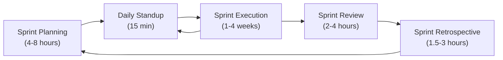
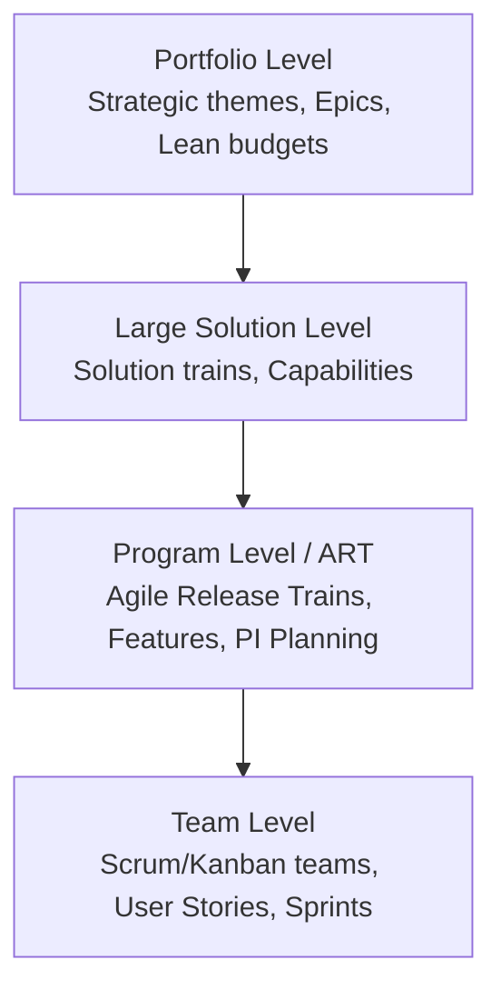
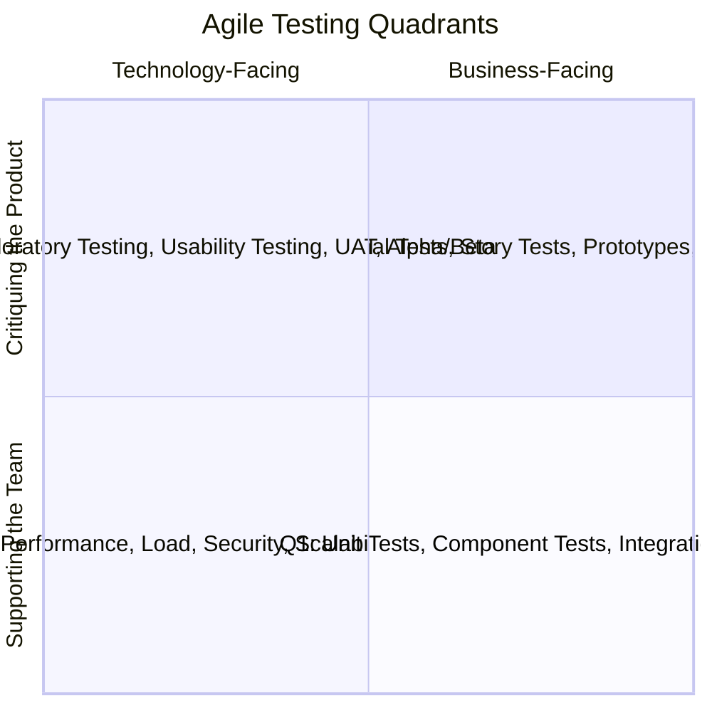
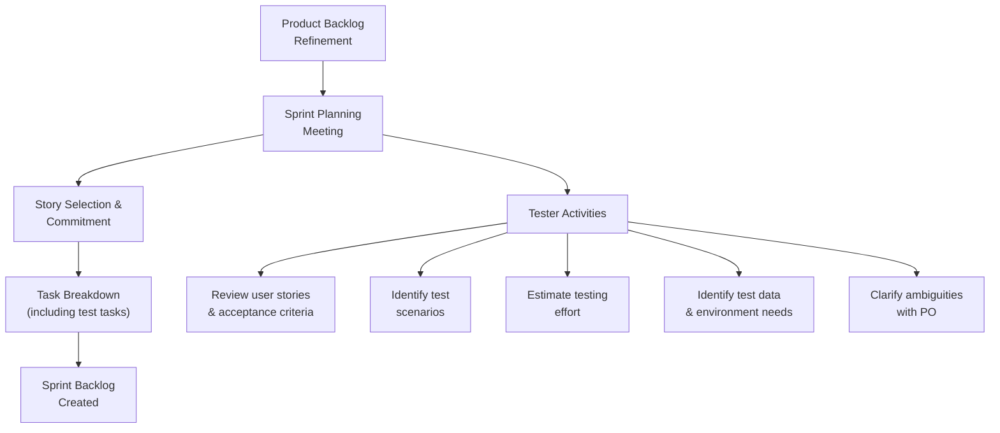
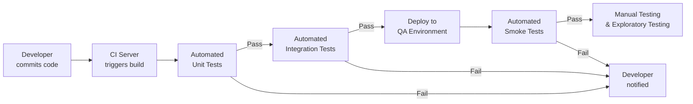
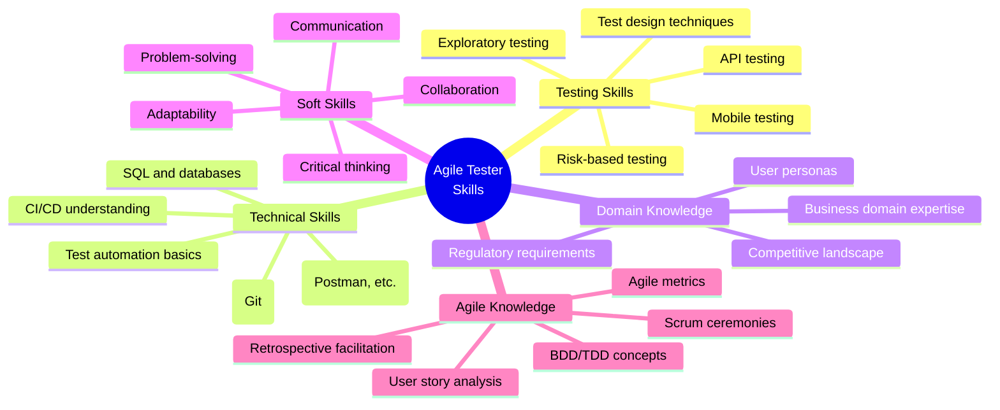
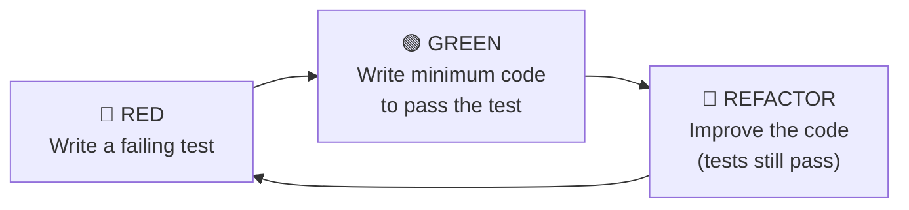
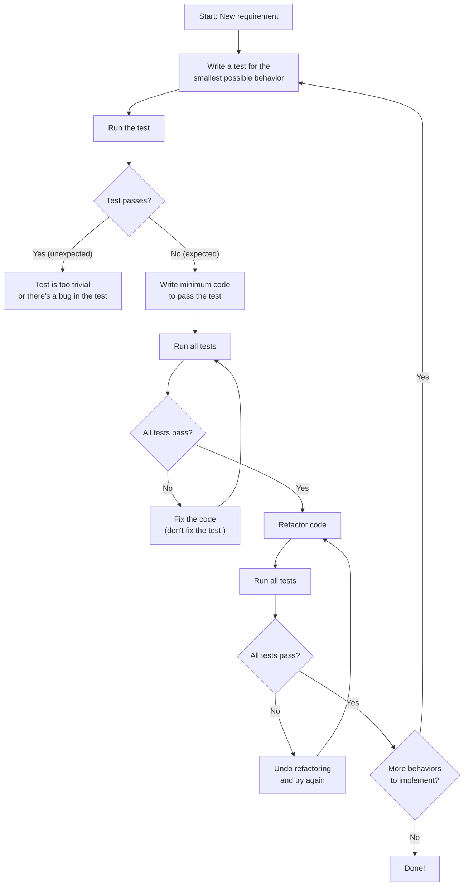

# Part 9: Agile Testing

---

## 9.1 Introduction to Agile

### What is Agile?

**Agile** is an iterative and incremental approach to software development that emphasizes flexibility, collaboration, continuous feedback, and rapid delivery of working software. Rather than delivering the entire product at the end of a lengthy development cycle, Agile breaks the work into small, manageable increments called **iterations** or **sprints**, each typically lasting 1–4 weeks.

At its core, Agile is not a single methodology but a **mindset** — a philosophy that values adaptability over rigid planning, people over processes, and customer satisfaction over contractual obligations. It fundamentally changes how teams build software by encouraging close collaboration between cross-functional team members, including developers, testers, product owners, and stakeholders.

> [!NOTE]
> Agile is an umbrella term encompassing multiple frameworks and methodologies (Scrum, Kanban, XP, etc.). Saying "we do Agile" without specifying a framework is like saying "we play sports" without naming the sport.

### History and Evolution of Agile

| Year | Event | Significance |
|------|-------|--------------|
| 1970 | Winston Royce publishes the Waterfall model paper | Introduced sequential development phases; ironically, Royce himself warned against using it in a purely sequential fashion |
| 1986 | Hirotaka Takeuchi and Ikujiro Nonaka publish "The New New Product Development Game" | Introduced the "rugby" approach to product development, coining the term "Scrum" |
| 1991 | James Martin publishes Rapid Application Development (RAD) | Promoted rapid prototyping and iterative development |
| 1995 | Ken Schwaber and Jeff Sutherland formalize Scrum | Presented the Scrum framework at OOPSLA conference |
| 1996 | Kent Beck introduces Extreme Programming (XP) | Introduced TDD, pair programming, and continuous integration |
| 1999 | Kent Beck publishes "Extreme Programming Explained" | XP gains mainstream attention |
| 2001 | **The Agile Manifesto is created** | 17 software practitioners meet in Snowbird, Utah, and publish the Manifesto for Agile Software Development |
| 2003 | Lean Software Development principles published | Mary and Tom Poppendieck adapt Lean Manufacturing concepts to software |
| 2004 | David Anderson introduces Kanban for software | Adapted Toyota Production System's Kanban to knowledge work |
| 2011 | Scaled Agile Framework (SAFe) released | Dean Leffingwell publishes SAFe for enterprise-scale Agile adoption |
| 2013 | Large-Scale Scrum (LeSS) formalized | Craig Larman and Bas Vodde publish LeSS framework |
| 2020s | Agile becomes mainstream across industries | Agile principles adopted beyond software: marketing, HR, education |

### Problems with the Traditional (Waterfall) Approach

The Waterfall model follows a strict sequential flow: Requirements → Design → Implementation → Testing → Deployment → Maintenance. While it works well for projects with extremely stable requirements (e.g., embedded systems in medical devices), it suffers from critical limitations that led to the need for Agile:

| Problem | Description | Real-World Impact |
|---------|-------------|-------------------|
| **Late testing** | Testing happens only after development is complete | A banking application discovered fundamental architecture flaws during system testing, requiring 3 months of rework |
| **Rigid requirements** | Requirements are frozen at the start | An e-commerce platform's checkout flow was outdated by the time it was delivered 18 months later because competitor UX had evolved |
| **No customer feedback until delivery** | Stakeholders see the product only at the end | A healthcare portal was delivered "as specified" but was unusable by nurses because no one validated workflows during development |
| **High risk of project failure** | Issues surface late, when they're expensive to fix | The cost of fixing a bug found in production is 100x the cost of fixing it during requirements (IBM Systems Science Institute data) |
| **Poor adaptability** | Changes are costly and resisted | A retail chain's inventory management system couldn't incorporate a new regulatory requirement mid-project, leading to a separate compliance project |
| **Long time to market** | Delivery cycles span months or years | Competitors release competing features quarterly while the Waterfall team is still in the design phase |
| **Siloed teams** | Each phase is handled by a different team | The development team "throws it over the wall" to testing, leading to misunderstandings about expected behavior |

> [!IMPORTANT]
> The Standish Group's CHAOS Report consistently shows that Agile projects have significantly higher success rates (42%) compared to Waterfall projects (14%). The primary reasons are shorter feedback cycles and the ability to adapt to changing requirements.

**Real-World Example: The FBI's Virtual Case File (VCF) Project**

One of the most cited Waterfall failures is the FBI's Virtual Case File project. Initiated in 2001 with a $170 million budget, the project followed a strict Waterfall approach. After three years, the system was abandoned as unusable. The requirements had changed significantly after 9/11, but the rigid Waterfall process couldn't accommodate those changes. The FBI eventually restarted with a more iterative approach (Sentinel), which was delivered successfully.

---

## 9.2 Agile Manifesto and Principles

### The Four Values of the Agile Manifesto

In February 2001, seventeen software developers met at the Snowbird ski resort in Utah. Despite representing diverse methodologies (XP, Scrum, DSDM, Crystal, etc.), they found common ground and produced the **Manifesto for Agile Software Development**.

The manifesto states:

> *We are uncovering better ways of developing software by doing it and helping others do it. Through this work we have come to value:*
>
> 1. **Individuals and interactions** over processes and tools
> 2. **Working software** over comprehensive documentation
> 3. **Customer collaboration** over contract negotiation
> 4. **Responding to change** over following a plan
>
> *That is, while there is value in the items on the right, we value the items on the left more.*

> [!WARNING]
> A common misconception is that Agile means "no documentation" or "no planning." The manifesto clearly states there is value in processes, documentation, contracts, and plans — it simply prioritizes the items on the left when trade-offs must be made.

#### Value 1: Individuals and Interactions Over Processes and Tools

**What it means:** The most important factor in a project's success is the people involved and how they communicate, not the tools they use or the processes they follow.

**Testing Context:**
- A tester who has a 5-minute face-to-face conversation with a developer about a confusing requirement is more effective than one who relies solely on documented specifications.
- A pair testing session between a tester and developer uncovers more defects than a tester working in isolation following a rigid test script.
- Team dynamics and trust matter more than which test management tool you use (JIRA, Azure DevOps, TestRail, etc.).

**Real-World Example:** At a fintech startup, the QA team was mandated to log every test case in HP ALM before execution. Testers spent 40% of their time on data entry, reducing actual testing time. When the team switched to lightweight test checklists and increased verbal communication during daily standups, defect detection improved by 35%.

#### Value 2: Working Software Over Comprehensive Documentation

**What it means:** The primary measure of progress is working, functional software — not thick requirement documents, design specifications, or status reports.

**Testing Context:**
- Rather than creating 200-page test plans that become outdated within a sprint, create concise, living test documentation that evolves with the product.
- A passing automated test suite demonstrates "done" more convincingly than a signed-off test case document.
- Exploratory testing sessions that find real bugs provide more value than meticulously documented but never-executed test scripts.

**Real-World Example:** An insurance company had a 500-page test plan for each release. By the time the plan was reviewed and approved (4 weeks), the application had already changed. They moved to one-page sprint test plans with bullet-point test scenarios and embedded acceptance criteria in user stories, cutting planning overhead by 70% while improving test coverage.

#### Value 3: Customer Collaboration Over Contract Negotiation

**What it means:** Work collaboratively with customers and stakeholders throughout the project rather than negotiating rigid contracts and then delivering exactly what was specified (even if it's no longer what they need).

**Testing Context:**
- Invite product owners and stakeholders to sprint demos and testing sessions. Their feedback during testing is invaluable.
- Testers act as **customer advocates**, ensuring the product meets real user needs, not just documented requirements.
- User Acceptance Testing (UAT) happens continuously, not as a final gate.

**Real-World Example:** A travel booking platform held weekly "testing showcase" sessions where testers demonstrated newly tested features to product managers and actual travel agents. This real-time collaboration uncovered 23 usability issues that would have been missed if the team only validated against the original specifications.

#### Value 4: Responding to Change Over Following a Plan

**What it means:** Welcome changing requirements, even late in development. Agile processes harness change for the customer's competitive advantage.

**Testing Context:**
- Test plans and test cases must be flexible enough to accommodate requirement changes within a sprint.
- Regression test suites need to be maintained and adapted as features evolve.
- Testers should not resist change requests but help the team understand the testing implications of changes (impact analysis).
- Exploratory testing is particularly valuable when requirements change rapidly because it doesn't require pre-written scripts.

**Real-World Example:** During COVID-19, a food delivery application needed to add "contactless delivery" features within 2 weeks. The Agile testing team quickly identified existing test scenarios affected, created new test scenarios, and performed risk-based testing to validate the most critical flows first. A Waterfall team would have needed to restart the entire test planning process.

---

### The 12 Principles of Agile

The Agile Manifesto is supported by 12 principles that provide more concrete guidance:

| # | Principle | Impact on Testing |
|---|-----------|-------------------|
| 1 | Our highest priority is to satisfy the customer through early and continuous delivery of valuable software. | Testers must ensure each increment is shippable and provides real value. Testing cannot be a bottleneck that delays delivery. |
| 2 | Welcome changing requirements, even late in development. Agile processes harness change for the customer's competitive advantage. | Test cases and test plans must be living documents. Testers must perform impact analysis quickly when requirements change. |
| 3 | Deliver working software frequently, from a couple of weeks to a couple of months, with a preference to the shorter timescale. | Testing must fit within short sprints. Test automation becomes essential to maintain quality at delivery speed. |
| 4 | Business people and developers must work together daily throughout the project. | Testers participate in three amigos sessions (developer, tester, product owner) to clarify requirements and acceptance criteria. |
| 5 | Build projects around motivated individuals. Give them the environment and support they need, and trust them to get the job done. | Testers are trusted team members, not gatekeepers. They're empowered to decide testing approaches without micromanagement. |
| 6 | The most efficient and effective method of conveying information to and within a development team is face-to-face conversation. | Testers discuss defects directly with developers rather than relying solely on bug reports. Pair testing and mob testing are encouraged. |
| 7 | Working software is the primary measure of progress. | Test results and quality metrics supplement this — a "done" story means it's tested and working, not just coded. |
| 8 | Agile processes promote sustainable development. The sponsors, developers, and users should be able to maintain a constant pace indefinitely. | Testers should not be under constant crunch. Test automation helps maintain sustainable pace. Overwork leads to missed defects. |
| 9 | Continuous attention to technical excellence and good design enhances agility. | Testers promote testability, advocate for clean code practices, and participate in code reviews. Test code quality matters too. |
| 10 | Simplicity — the art of maximizing the amount of work not done — is essential. | Test only what adds value. Don't write test cases for trivial scenarios. Use risk-based testing to focus effort. |
| 11 | The best architectures, requirements, and designs emerge from self-organizing teams. | Testers help shape requirements and designs, not just validate them after the fact. |
| 12 | At regular intervals, the team reflects on how to become more effective, then tunes and adjusts its behavior accordingly. | Testers participate in retrospectives and bring testing-specific improvements (e.g., "We should automate smoke tests" or "We need better test data management"). |

> [!TIP]
> When studying for interviews, don't just memorize the 12 principles — be prepared to give concrete examples of how you've applied each one in your testing practice. Interviewers value practical experience over textbook knowledge.

---

## 9.3 Agile Methodologies Overview

### Scrum (Detailed)

**Scrum** is the most widely adopted Agile framework, used by approximately 66% of Agile teams (State of Agile Report). It provides a structured yet flexible framework for delivering products iteratively.

#### Scrum Roles

| Role | Responsibilities | Testing Involvement |
|------|-----------------|---------------------|
| **Product Owner (PO)** | Owns the product backlog, prioritizes features, defines acceptance criteria, represents the customer | Collaborates with testers on acceptance criteria, validates test results during sprint review |
| **Scrum Master (SM)** | Facilitates Scrum ceremonies, removes impediments, coaches the team on Agile practices | Helps testers remove testing impediments (environment issues, missing test data), ensures testing isn't bottlenecked |
| **Development Team** (includes testers) | Cross-functional, self-organizing team of 3–9 members that delivers the increment | Testers are full team members who participate in all activities — planning, design, development, and testing |

#### Scrum Events (Ceremonies)



1. **Sprint Planning:** The team selects user stories from the product backlog and plans the work for the sprint. Testers identify test scenarios, estimate testing effort, and clarify acceptance criteria.

2. **Daily Standup (Daily Scrum):** A 15-minute time-boxed meeting where each team member answers three questions:
   - What did I do yesterday?
   - What will I do today?
   - Are there any impediments?

3. **Sprint Review (Demo):** The team demonstrates the completed increment to stakeholders. Testers often help prepare the demo and ensure the demonstrated features actually work end-to-end.

4. **Sprint Retrospective:** The team reflects on the sprint and identifies improvements. Testing-specific topics might include: "Test environment was unstable," "We should start writing test scenarios during grooming," or "Automation coverage is too low."

#### Scrum Artifacts

| Artifact | Description | Tester's Role |
|----------|-------------|---------------|
| **Product Backlog** | Ordered list of all features, enhancements, and fixes | Testers may add technical testing stories (e.g., "Set up performance testing environment") |
| **Sprint Backlog** | Subset of product backlog selected for the sprint + plan | Includes testing tasks for each user story |
| **Increment** | The sum of all completed product backlog items during the sprint | Must meet the Definition of Done, which includes testing criteria |

**Real-World Example — Scrum in Action (E-commerce Platform):**

Sprint 7 of an e-commerce platform project:
- **Sprint Goal:** Implement guest checkout and order confirmation email
- **Sprint Planning:** The tester identified 15 test scenarios for guest checkout, including edge cases like expired session, network timeout during payment, and invalid email format
- **Daily Standups:** The tester reported progress — "Yesterday I completed happy path testing for guest checkout. Today I'll test payment gateway integration. Impediment: Stripe sandbox credentials are not working."
- **Sprint Review:** The tester helped demo the guest checkout flow with various payment methods
- **Retrospective:** The tester suggested: "We should add a 'testability review' during story grooming to catch issues early"

---

### Kanban (Detailed)

**Kanban** (Japanese for "visual signal" or "card") is a visual workflow management method that emphasizes continuous flow rather than fixed-length sprints. It originated from Toyota's manufacturing process and was adapted for knowledge work.

#### Core Principles of Kanban

1. **Visualize the workflow:** Use a Kanban board to make work visible
2. **Limit Work in Progress (WIP):** Set maximum items allowed in each column
3. **Manage flow:** Optimize the movement of items through the workflow
4. **Make policies explicit:** Define clear rules for each workflow state
5. **Implement feedback loops:** Regular review and improvement
6. **Improve collaboratively, evolve experimentally:** Small, incremental changes

#### Kanban Board for Testing

```
┌──────────────┬──────────────┬──────────────┬──────────────┬──────────────┬──────────────┐
│   BACKLOG    │  IN DEV (3)  │ READY TO TEST│ IN TEST (2)  │   IN UAT     │    DONE      │
│              │              │    (5)       │              │    (3)       │              │
├──────────────┼──────────────┼──────────────┼──────────────┼──────────────┼──────────────┤
│ US-201       │ US-195       │ US-190       │ US-188       │ US-185       │ US-180       │
│ US-202       │ US-196       │ US-191       │ US-189       │ US-186       │ US-181       │
│ US-203       │ US-197       │ US-192       │              │              │ US-182       │
│ US-204       │              │              │              │              │ US-183       │
│ US-205       │              │              │              │              │ US-184       │
│ ...          │              │              │              │              │              │
└──────────────┴──────────────┴──────────────┴──────────────┴──────────────┴──────────────┘
                    WIP=3          WIP=5          WIP=2           WIP=3
```

> [!TIP]
> The numbers in parentheses are **WIP limits**. If "Ready to Test" has 5 items and a developer finishes another item, they cannot push it to "Ready to Test." Instead, they should help with testing to unblock the bottleneck. This prevents testers from being overwhelmed.

#### Kanban Metrics for Testers

| Metric | Description | Example |
|--------|-------------|---------|
| **Lead Time** | Time from request to delivery | A bug report was filed and fixed/tested in 3 days |
| **Cycle Time** | Time from start of work to completion | A user story took 2 days from "In Test" to "Done" |
| **Throughput** | Number of items completed per time period | 12 user stories tested per week |
| **Cumulative Flow Diagram** | Visual chart showing work in each state over time | Shows if testing is becoming a bottleneck |

---

### XP (Extreme Programming)

**Extreme Programming (XP)** focuses on engineering practices and technical excellence. It was created by Kent Beck and is particularly relevant for testers because of its emphasis on testing.

#### Key XP Practices Related to Testing

| Practice | Description | Testing Relevance |
|----------|-------------|-------------------|
| **Test-Driven Development (TDD)** | Write tests before code | Developers write unit tests first; testers can extend this to acceptance tests |
| **Pair Programming** | Two developers work at one workstation | Can be extended to "pair testing" — tester and developer test together |
| **Continuous Integration** | Integrate and test code multiple times per day | Automated tests run on every code commit |
| **Refactoring** | Improve code structure without changing behavior | Regression testing ensures refactoring doesn't break existing functionality |
| **Simple Design** | Keep the design as simple as possible | Simpler systems are easier to test |
| **Collective Code Ownership** | Anyone can modify any code | Testers can fix minor issues in test automation code |
| **On-site Customer** | A real customer sits with the team | Direct feedback loop for testers to validate with the customer |
| **Small Releases** | Release in small increments frequently | Each small release needs fast testing turnaround |

---

### Lean Software Development

Lean Software Development adapts principles from Lean Manufacturing (Toyota Production System) to software development. It was formalized by Mary and Tom Poppendieck.

#### Seven Principles of Lean

| Principle | Testing Application |
|-----------|-------------------|
| **Eliminate waste** | Remove redundant test cases, eliminate unnecessary documentation, stop testing features that never ship |
| **Build quality in** | Test early, test often; prevent defects rather than detect them; embed testers in the development process |
| **Create knowledge** | Document testing insights; share defect patterns; conduct knowledge-sharing sessions |
| **Defer commitment** | Don't finalize test plans too early; decide testing approach based on emerging information |
| **Deliver fast** | Automate regression tests; reduce test cycle time; focus on high-risk areas first |
| **Respect people** | Trust testers' judgment; empower them to make decisions; value their expertise |
| **Optimize the whole** | Consider the entire delivery pipeline, not just the testing phase; a fast testing phase is useless if deployment is slow |

---

### SAFe (Scaled Agile Framework) Overview

SAFe is an enterprise-scale Agile framework for organizations with multiple teams working on the same product or portfolio. It organizes work at four levels:



**Testing in SAFe:**
- **Program Increment (PI) Planning:** Testers participate in PI planning events (2-day events) to plan testing across 8–12 week increments
- **System Demos:** Regular demos at the program level where integrated features are demonstrated
- **Inspect & Adapt:** Portfolio-level retrospectives that include testing process improvements
- **System Team:** A dedicated team that manages integration testing environments and supports testing at the program level
- **Release on Demand:** Testing must support the ability to release at any time

---

### Comparison Table: Agile Methodologies

| Aspect | Scrum | Kanban | XP | Lean | SAFe |
|--------|-------|--------|-----|------|------|
| **Iterations** | Fixed sprints (1–4 weeks) | Continuous flow | 1–2 week iterations | Continuous flow | Program Increments (8–12 weeks) |
| **Roles** | PO, SM, Dev Team | No prescribed roles | Coach, Customer, Programmer, Tester | No prescribed roles | Multiple roles across levels |
| **Planning** | Sprint planning | Continuous prioritization | Release & iteration planning | Pull-based | PI Planning (2-day event) |
| **Change during iteration** | Discouraged during sprint | Allowed anytime | Allowed (with trade-offs) | Allowed anytime | Controlled at PI level |
| **WIP Limits** | Sprint capacity | Explicit WIP limits per column | Implicit (small stories) | Explicit | Per team and train |
| **Best for** | Most software projects | Maintenance, support, ops | Projects needing technical excellence | Organizations seeking efficiency | Large enterprises, 50+ developers |
| **Testing approach** | Sprint-based testing | Continuous testing | TDD-driven testing | Lean testing (eliminate waste) | Multi-level testing strategy |
| **Ceremonies** | 4 formal ceremonies | No required meetings (but reviews recommended) | Stand-ups, iterations, releases | Value stream mapping sessions | PI Planning, System Demos, I&A |

---

## 9.4 Agile Testing Quadrants

The **Agile Testing Quadrants**, originally described by Brian Marick and popularized by Lisa Crispin and Janet Gregory in *"Agile Testing: A Practical Guide for Testers and Agile Teams"*, provide a framework for categorizing different types of testing. They help teams plan comprehensive testing strategies.

### Quadrant Diagram



### Detailed ASCII Representation

```
                          BUSINESS-FACING
                               ▲
                               │
              Q2               │              Q3
    ┌──────────────────────────┼──────────────────────────┐
    │  Supporting the Team     │   Critiquing the Product  │
    │                          │                           │
    │  • Functional Tests      │   • Exploratory Testing   │
    │  • Story Tests           │   • Usability Testing     │
    │  • Prototypes            │   • UAT                   │
    │  • Simulations           │   • Alpha/Beta Testing    │
    │  • Examples/Scenarios    │   • A/B Testing           │
    │                          │                           │
    │  Automated & Manual      │   Primarily Manual        │
    │──────────────────────────┼───────────────────────────│
    │                          │                           │
    │  Q1                      │   Q4                      │
    │  Supporting the Team     │   Critiquing the Product  │
    │                          │                           │
    │  • Unit Tests            │   • Performance Testing   │
    │  • Component Tests       │   • Load Testing          │
    │  • Integration Tests     │   • Stress Testing        │
    │  • API Tests             │   • Security Testing      │
    │                          │   • Scalability Testing   │
    │  Automated               │   • Reliability Testing   │
    │                          │                           │
    │                          │   Tools-based             │
    └──────────────────────────┼───────────────────────────┘
                               │
              TECHNOLOGY-FACING▼
```

---

### Q1: Technology-Facing, Supporting the Team

**Purpose:** Guide development and provide fast feedback to developers. These tests are written before or alongside the code and run frequently (often on every commit).

**Types of Tests:**
- **Unit Tests:** Test individual functions, methods, or classes in isolation
- **Component Tests:** Test a component's behavior (e.g., a single microservice)
- **Integration Tests:** Test interactions between components (e.g., API-to-database)

**Characteristics:**
- Almost always **automated**
- Written by developers (sometimes with tester input)
- Run as part of the **CI/CD pipeline**
- Provide the fastest feedback loop
- Form the base of the **test automation pyramid**

**Real-World Example:**
For an e-commerce application, Q1 tests include:
- Unit test: `calculateDiscount()` correctly applies a 20% discount to orders over $100
- Component test: The CartService correctly adds, removes, and updates items
- Integration test: The OrderService correctly communicates with the PaymentGateway service via REST API

> [!TIP]
> Testers can contribute to Q1 by reviewing unit tests for edge cases that developers might miss, suggesting negative test scenarios, and ensuring integration points are tested.

---

### Q2: Business-Facing, Supporting the Team

**Purpose:** Validate that the system does what the business expects. These tests verify features against business requirements and acceptance criteria.

**Types of Tests:**
- **Functional Tests:** Verify that features work according to specifications
- **Story Tests:** Tests derived from user story acceptance criteria
- **Prototypes & Wireframes:** Validate that the UI meets business expectations before coding
- **Simulations:** Model business scenarios to validate logic
- **Examples / Scenarios:** Given-When-Then scenarios used in BDD

**Characteristics:**
- Can be **automated or manual**
- Driven by **acceptance criteria** defined by the Product Owner
- Help clarify requirements and reduce ambiguity
- Often written before development (ATDD/BDD approach)

**Real-World Example:**
For a banking application's fund transfer feature:
```gherkin
Feature: Fund Transfer

  Scenario: Successful transfer between own accounts
    Given the user has a savings account with balance $5,000
    And the user has a checking account with balance $2,000
    When the user transfers $1,000 from savings to checking
    Then the savings account balance should be $4,000
    And the checking account balance should be $3,000
    And a transaction receipt should be generated

  Scenario: Transfer with insufficient funds
    Given the user has a savings account with balance $500
    When the user tries to transfer $1,000 from savings to checking
    Then the transfer should be declined
    And the error message "Insufficient funds" should be displayed
    And no balance changes should occur
```

---

### Q3: Business-Facing, Critiquing the Product

**Purpose:** Evaluate the product from a user's perspective. These tests find issues that formal test cases might miss and assess the overall user experience.

**Types of Tests:**
- **Exploratory Testing:** Testers explore the application without scripts, using their creativity, experience, and intuition
- **Usability Testing:** Evaluate how easy and intuitive the application is for real users
- **User Acceptance Testing (UAT):** End users validate the system meets their needs
- **Alpha/Beta Testing:** Early releases to a limited audience for real-world feedback
- **A/B Testing:** Compare two versions to determine which performs better

**Characteristics:**
- Primarily **manual** (requires human judgment)
- Requires domain expertise and testing experience
- Cannot be fully automated (though some usability checks can be)
- Most valuable for discovering unexpected issues

**Real-World Example:**
During exploratory testing of a ride-sharing app:
- The tester noticed that the pickup location pin was difficult to move on screens smaller than 5 inches
- The tester found that switching from 4G to Wi-Fi during ride booking caused the app to show a blank screen
- The tester discovered that typing an emoji in the "notes to driver" field caused the app to crash
- None of these scenarios were in the formal test cases

---

### Q4: Technology-Facing, Critiquing the Product

**Purpose:** Evaluate the system's non-functional attributes — how well it performs, how secure it is, and how well it scales.

**Types of Tests:**
- **Performance Testing:** Measure response times, throughput, and resource usage
- **Load Testing:** Verify behavior under expected and peak loads
- **Stress Testing:** Determine breaking points
- **Security Testing:** Identify vulnerabilities (SQL injection, XSS, CSRF, etc.)
- **Scalability Testing:** Verify the system can handle growth
- **Reliability Testing:** Verify the system operates correctly over extended periods
- **Compatibility Testing:** Cross-browser, cross-device, cross-OS testing

**Characteristics:**
- Require **specialized tools** (JMeter, Gatling, OWASP ZAP, Burp Suite)
- Often require **dedicated environments** that mirror production
- Results need expert interpretation
- Typically done by specialists or specialized teams

**Real-World Example:**
For an online exam platform expecting 50,000 concurrent users during exam sessions:
- **Load Test:** Simulate 50,000 users starting the exam simultaneously
- **Stress Test:** Ramp up to 100,000 users to find the breaking point
- **Performance Test:** Measure page load times for question rendering (target: < 2 seconds)
- **Security Test:** Verify that students cannot access answer keys through API manipulation

### Using Quadrants in Sprint Planning

During sprint planning, the team should consider all four quadrants:

1. **Q1 (Unit/Integration):** "What unit tests will developers write? Are there integration points?"
2. **Q2 (Functional):** "What acceptance criteria do these stories have? What functional test scenarios are needed?"
3. **Q3 (Exploratory/Usability):** "Which features warrant exploratory testing? Do we need usability review?"
4. **Q4 (Performance/Security):** "Does this feature have performance implications? Are there security concerns?"

> [!IMPORTANT]
> Not every sprint requires equal attention to all four quadrants. A sprint focused on backend API refactoring might emphasize Q1 and Q4, while a sprint focused on a new user-facing feature might emphasize Q2 and Q3.

---

## 9.5 Agile Testing Life Cycle

### Phase 1: Sprint Planning



#### Tester's Role in Sprint Planning

The tester is an **active participant** in sprint planning, not a silent observer. Key responsibilities include:

1. **Reviewing User Stories:** Read every user story being considered for the sprint. Ask questions:
   - Is this story testable?
   - Are the acceptance criteria clear and complete?
   - Are there missing edge cases?
   - What are the dependencies?

2. **Estimating Testing Effort:** Help the team estimate story points by considering:
   - Number of test scenarios
   - Complexity of test data setup
   - Need for cross-browser/cross-device testing
   - Integration testing requirements
   - Regression test impact

3. **Identifying Test Scenarios Early:** During planning, the tester can outline high-level test scenarios:
   - "For the 'password reset' story, I'll need to test: valid email, invalid email, expired link, already-used link, multiple requests, and email delivery timing"

4. **Acceptance Criteria Review:** Challenge incomplete or ambiguous acceptance criteria:
   - "The acceptance criteria says 'user should see an error message.' What should the message say? Where should it appear? Should it disappear after a timeout?"

5. **Three Amigos Session:** Participate in discussions with the developer and product owner to ensure shared understanding of each story.

**Real-World Example — Sprint Planning for a Social Media App:**

User Story: *"As a user, I want to upload a profile picture so that my contacts can recognize me."*

Tester's contributions during sprint planning:
- "What file formats are supported? Only JPEG/PNG or also GIF, BMP, WebP?"
- "What's the maximum file size? What happens if the user uploads a 50MB file?"
- "Should the user be able to crop/rotate the image before saving?"
- "What happens to the old profile picture? Is there a version history?"
- "How does this work on slow networks? Should we show a progress indicator?"
- "What about accessibility? Should the image have alt text?"
- "I estimate this story needs 3 test tasks: functional testing (2 hours), cross-device testing (1 hour), and edge case testing (1 hour)"

---

### Phase 2: Sprint Execution / Test Execution

#### Daily Testing Activities

| Activity | Description | Time Allocation |
|----------|-------------|-----------------|
| **Test scenario design** | Write detailed test cases/scenarios for stories in progress | 20–30% |
| **Test execution** | Execute manual tests on completed features | 30–40% |
| **Defect reporting & verification** | Log bugs, verify fixes, retest | 10–15% |
| **Exploratory testing** | Session-based exploratory testing on completed features | 10–15% |
| **Collaboration** | Pair testing, discussions with developers, PO clarifications | 5–10% |
| **Test maintenance** | Update regression suite, maintain test data | 5–10% |

#### Test Case Creation During Sprint

In Agile, test cases are created **just in time** — not weeks in advance. The typical flow is:

1. **Story moves to "In Development":** The tester reviews the story and writes test scenarios
2. **Story moves to "Ready for Testing":** The tester already has test scenarios prepared and begins execution immediately
3. **Exploratory Testing:** After formal test scenarios are executed, the tester performs exploratory testing sessions

#### Continuous Integration and Testing



#### Pair Testing

**Pair testing** involves two team members (usually a developer and a tester) testing together at the same workstation. Benefits include:
- Developer explains the implementation, helping the tester focus on risk areas
- Tester's different perspective helps identify issues the developer overlooked
- Bugs are found and fixed in real-time, reducing defect cycle time
- Knowledge transfer happens naturally

#### Defect Management in Sprints

| Defect Type | Handling Approach |
|-------------|-------------------|
| **Bug in current sprint story** | Fix immediately within the sprint; no separate story needed |
| **Bug in previously completed story** | Create a new defect item in the backlog; PO prioritizes it for a future sprint |
| **Critical production bug** | Pulled into the current sprint immediately (may displace a lower-priority story) |
| **Minor cosmetic issue** | Logged in backlog; fixed when capacity allows |

> [!WARNING]
> A common anti-pattern is treating every bug as a "current sprint" item. This disrupts sprint goals. Only critical bugs that block the sprint goal should be fixed immediately. Other bugs go through normal backlog prioritization.

---

### Phase 3: Sprint Tracking

#### Daily Standup (Tester's Perspective)

The tester's standup update should be concise and informative:

**Good Example:**
> "Yesterday I completed functional testing for user story US-204 (login with SSO). Found 2 bugs — one critical (SSO token not expiring) and one minor (UI misalignment on Safari). Today I'll start testing US-207 (password policy enforcement) and retest the critical bug once the fix is deployed. No impediments."

**Bad Example:**
> "Yesterday I tested some stuff. Today I'll test more stuff. No blockers."

#### Burndown Chart Interpretation for Testers

```
Story Points  │
Remaining     │
              │
   40 ────────│●
              │  ●
   30 ────────│    ●──── Ideal burndown
              │      ●
   20 ────────│    ●   ● ──── Actual burndown (testing bottleneck visible)
              │    │     ●
   10 ────────│    │       ●
              │    │         ●
    0 ────────│────┼───────────●
              └────┼───────────────
              Day1  Day5      Day10
                    ↑
                Testing bottleneck:
                stories piling up in
                "Ready to Test" state
```

When the burndown chart shows a plateau or upward trend, testers should:
1. Flag the bottleneck during standup
2. Request pairing help from developers
3. Suggest prioritizing testing of high-risk stories first
4. Consider reducing sprint scope if needed

#### Test Progress Tracking

| Metric | Sprint Day 1 | Sprint Day 5 | Sprint Day 10 |
|--------|-------------|-------------|---------------|
| Stories committed | 8 | 8 | 8 |
| Stories dev complete | 0 | 5 | 8 |
| Stories tested | 0 | 3 | 7 |
| Stories accepted | 0 | 2 | 7 |
| Open bugs (critical) | 0 | 2 | 0 |
| Open bugs (major) | 0 | 1 | 1 |
| Test scenarios executed | 0/45 | 25/45 | 42/45 |

---

### Phase 4: Sprint Closure / Review

#### Sprint Demo Preparation

Testers contribute to the sprint demo by:
1. **Ensuring demo-ready features are tested:** No embarrassing failures during the demo
2. **Preparing test data:** Set up realistic data for the demo environment
3. **Identifying demo scenarios:** Suggest the most impactful scenarios to demonstrate
4. **Being ready to answer questions:** Stakeholders may ask "Did you test X?" during the demo

#### Test Summary for Sprint

A concise sprint test summary might include:

```
Sprint 14 Test Summary
======================
Sprint Goal: Implement multi-currency support for payments

Stories Committed: 8
Stories Completed: 7 (1 carried over due to dependency on external API)

Test Metrics:
  - Total test scenarios: 52
  - Executed: 48 (92%)
  - Passed: 45 (94%)
  - Failed: 3 (pending fixes for Sprint 15)
  - Blocked: 4 (external API unavailable)

Defects:
  - Found: 12
  - Fixed in sprint: 9
  - Deferred: 3 (1 major, 2 minor)

Exploratory Testing:
  - 3 sessions conducted (90 minutes total)
  - 4 additional defects found through exploration

Automation:
  - 8 new automated regression tests added
  - Total regression suite: 234 tests, all passing

Risks:
  - Currency conversion rounding logic needs additional 
    validation with finance team
  - Performance testing for multi-currency checkout not 
    yet done (planned for Sprint 15)
```

#### Sprint Retrospective (Testing Perspective)

Testers should come prepared with specific observations:

| Category | Example |
|----------|---------|
| **What went well** | "Three amigos sessions before development started reduced rework by 50%" |
| **What didn't go well** | "Test environment was down for 2 days, blocking 3 stories" |
| **Action items** | "Set up automated environment health checks; alert the team within 30 minutes of environment issues" |

#### Definition of Done Verification

Before a story is marked as "Done," the tester verifies against the team's Definition of Done (see Section 9.8 for details):

- [ ] All acceptance criteria met
- [ ] Test cases executed and passed
- [ ] Exploratory testing completed
- [ ] No critical or major open bugs
- [ ] Regression tests updated
- [ ] Cross-browser testing done (if applicable)
- [ ] Performance baseline met (if applicable)
- [ ] Code reviewed
- [ ] Deployed to staging environment

---

## 9.6 Role of Tester in Agile

### How the Tester Role Differs from Traditional Testing

| Aspect | Traditional Testing | Agile Testing |
|--------|-------------------|---------------|
| **When testing starts** | After development is complete | From Day 1 of the sprint (even during planning) |
| **Test planning** | Comprehensive test plan created upfront | Lightweight, just-in-time test planning |
| **Test cases** | Written before testing begins, reviewed, approved | Written alongside development, may use checklists |
| **Tester's position** | Separate QA team, often in a different department | Embedded in the development team |
| **Relationship with developers** | Often adversarial ("us vs. them") | Collaborative ("we're in this together") |
| **Focus** | Finding bugs | Preventing bugs and ensuring quality |
| **Documentation** | Heavy documentation (test plans, test cases, test reports) | Lightweight documentation, living documents |
| **Feedback cycle** | Weeks to months | Hours to days |
| **Scope of work** | Only testing activities | Testing + requirements clarification + demos + retrospectives |
| **Decision authority** | Limited (follows the test plan) | Empowered to make testing decisions |
| **Skill expectations** | Deep testing expertise | Broad skills: testing, automation, domain knowledge, communication |

### Tester as a Team Member (Not a Gatekeeper)

In Agile, the tester is not a "quality police" who decides whether software can be released. Instead, the tester is a **quality advocate** who helps the entire team build quality into the product.

**Gatekeeper Mindset (Wrong in Agile):**
- "I need to approve this before it goes to production"
- "Testing is MY responsibility"
- "I found 20 bugs — development did a bad job"
- "This doesn't meet MY quality standards"

**Team Member Mindset (Right in Agile):**
- "Let's review the acceptance criteria together before development starts"
- "Quality is everyone's responsibility; I help the team achieve it"
- "I found patterns in these bugs — let's discuss how to prevent them"
- "Let's define our quality standards as a team"

### Skills Needed for Agile Testers



### Collaboration with Developers

| Collaboration Activity | How It Works | Benefit |
|-----------------------|-------------|---------|
| **Three Amigos** | Developer, tester, and PO discuss each user story | Shared understanding, fewer defects |
| **Pair Testing** | Tester and developer test together | Real-time bug fixes, knowledge sharing |
| **Code Reviews** | Tester reviews test-related code (unit tests, test data) | Improved test coverage |
| **Bug Triage** | Tester and developer discuss and prioritize bugs together | Faster resolution, better prioritization |
| **Design Reviews** | Tester provides input on system design (testability) | More testable architecture |

### Tester Participation in Ceremonies

| Ceremony | Tester's Participation |
|----------|----------------------|
| **Backlog Grooming** | Reviews upcoming stories, identifies testability concerns, suggests acceptance criteria |
| **Sprint Planning** | Estimates testing effort, identifies test dependencies, breaks stories into test tasks |
| **Daily Standup** | Reports testing progress, raises impediments, identifies blocked stories |
| **Sprint Review** | Helps demo features, answers stakeholder questions about quality, presents test findings |
| **Retrospective** | Shares testing-specific insights, proposes improvements to testing process |

### T-Shaped Skills Concept

A **T-shaped professional** has deep expertise in one area (the vertical bar) and broad knowledge across multiple areas (the horizontal bar).

```
    ←─────────── Broad Knowledge ──────────────→
    ┌──────────────────────────────────────────────┐
    │ Scrum │ Dev │ DevOps │ UX │ Business │ Data  │
    │ Basics│Basics│ Basics│Basics│ Domain │ Basics│
    └───────┴──┬──┴───────┴──────┴─────────┴──────┘
               │
               │  Deep Expertise
               │  in Testing
               │
               │  • Test Design
               │  • Exploratory Testing
               │  • Test Automation
               │  • Risk Analysis
               │  • Quality Strategy
               │
               ▼
```

**Real-World Example:** A T-shaped Agile tester at a healthcare company:
- **Deep expertise:** Manual testing, test design, exploratory testing, medical device regulations (FDA 21 CFR Part 11)
- **Broad knowledge:** Can read Python code, understands CI/CD pipelines, knows SQL well enough to verify data, understands UX principles, can have meaningful conversations about system architecture

---

## 9.7 User Story Testing

### Understanding User Stories

A **user story** is a short, simple description of a feature told from the user's perspective. It follows the format:

> **As a** [type of user], **I want** [some goal], **So that** [some reason/benefit].

User stories are not detailed requirements — they are **placeholders for conversations**. The real requirements emerge through discussions between the team members.

**Components of a Good User Story:**

| Component | Description | Example |
|-----------|-------------|---------|
| **Card** | The story written on a card (physical or digital) | "As a customer, I want to filter products by price range so that I can find items within my budget" |
| **Conversation** | The discussion that clarifies the story | "Should the filter show a slider or min/max input fields? Should it filter in real-time or require a button click?" |
| **Confirmation** | The acceptance criteria that define "done" | "Given a price range of $10–$50, only products within that range should be displayed" |

### INVEST Criteria for User Stories

A well-written user story should meet the **INVEST** criteria:

| Letter | Criterion | Description | Testing Implication |
|--------|-----------|-------------|-------------------|
| **I** | Independent | Stories should not depend on each other | Testers can test stories in any order without dependencies |
| **N** | Negotiable | Details can be discussed and changed | Testers can suggest modifications to improve testability |
| **V** | Valuable | Must deliver value to the user or business | Testers should validate that the story actually delivers value |
| **E** | Estimable | Team should be able to estimate the effort | Testing effort should be included in the estimate |
| **S** | Small | Small enough to be completed in one sprint | Testing should also be completable within the sprint |
| **T** | Testable | Must have clear acceptance criteria that can be verified | If a story isn't testable, it's not ready for development |

> [!WARNING]
> If a user story is not testable, it should not be pulled into a sprint. Push back and ask the Product Owner for clearer acceptance criteria. "Make the homepage look modern" is NOT testable. "Redesign the homepage to match wireframe v3.2 with a maximum load time of 2 seconds" IS testable.

### How to Test User Stories

1. **Read the story and acceptance criteria carefully**
2. **Identify positive (happy path) scenarios**
3. **Identify negative (error) scenarios**
4. **Identify edge cases and boundary conditions**
5. **Consider non-functional requirements** (performance, security, accessibility)
6. **Design test scenarios using test design techniques** (equivalence partitioning, boundary value analysis, etc.)
7. **Execute tests and report results**
8. **Perform exploratory testing** beyond the written scenarios

### Deriving Test Cases from User Stories — Detailed Examples

#### Example 1: E-Commerce Product Search

**User Story:**
> As an online shopper, I want to search for products by keyword so that I can quickly find what I'm looking for.

**Acceptance Criteria:**
1. Search bar is visible on all pages
2. Search returns results matching the keyword in product name or description
3. Results are displayed in relevance order
4. If no results found, display "No products found" message
5. Search should return results within 2 seconds
6. Minimum 2 characters required for search

**Test Scenarios:**

| # | Test Scenario | Type | Expected Result |
|---|--------------|------|-----------------|
| 1 | Search for "laptop" | Happy path | Products with "laptop" in name/description are displayed |
| 2 | Search for "lptp" (misspelled) | Negative | "No products found" or "Did you mean: laptop?" |
| 3 | Search with exactly 2 characters "ab" | Boundary | Search executes successfully |
| 4 | Search with 1 character "a" | Boundary | Error: "Please enter at least 2 characters" |
| 5 | Search with empty string | Negative | No search triggered or validation message |
| 6 | Search with special characters "laptop@#$" | Negative | Handles gracefully, no SQL injection |
| 7 | Search with very long string (500 chars) | Edge case | Input truncated or error message |
| 8 | Search on mobile viewport | Cross-device | Search bar functional and results readable |
| 9 | Search performance with 1M products in DB | Performance | Results within 2 seconds |
| 10 | Search with HTML/script tags | Security | Tags are sanitized, no XSS vulnerability |
| 11 | Search result order by relevance | Functional | Exact matches appear before partial matches |
| 12 | Search persistence across page navigation | UX | Search term retained when navigating back |

---

#### Example 2: Banking — Bill Payment

**User Story:**
> As a bank customer, I want to pay my utility bills through the app so that I don't have to visit the bank or use third-party services.

**Acceptance Criteria:**
1. User can select a biller from a list of registered billers
2. User can enter the bill amount (minimum $1, maximum $10,000)
3. Payment is deducted from the selected account
4. User receives a confirmation with transaction ID
5. Transaction appears in account history within 5 minutes
6. User can schedule future payments

**Test Scenarios:**

| # | Test Scenario | Test Data | Expected Result |
|---|--------------|-----------|-----------------|
| 1 | Pay bill with valid amount from account with sufficient balance | Amount: $150, Balance: $5,000 | Payment successful, confirmation shown |
| 2 | Pay bill with insufficient balance | Amount: $5,000, Balance: $100 | Error: "Insufficient balance" |
| 3 | Pay minimum amount | Amount: $1.00 | Payment successful |
| 4 | Pay below minimum | Amount: $0.50 | Error: "Minimum payment is $1.00" |
| 5 | Pay maximum amount | Amount: $10,000.00 | Payment successful (if balance allows) |
| 6 | Pay above maximum | Amount: $10,001.00 | Error: "Maximum payment is $10,000" |
| 7 | Pay with decimal amounts | Amount: $99.99 | Payment successful with correct deduction |
| 8 | Schedule payment for future date | Date: 7 days from now | Scheduled payment confirmed, not yet deducted |
| 9 | Schedule payment for past date | Date: yesterday | Error: "Cannot schedule payment for past date" |
| 10 | Duplicate payment prevention | Same biller, same amount, within 5 minutes | Warning: "A similar payment was recently made" |
| 11 | Network interruption during payment | Kill network after payment initiation | Payment either completes or rolls back cleanly |
| 12 | Concurrent payment from same account | Two payments totaling more than balance | One succeeds, one fails with "insufficient balance" |
| 13 | Transaction history update | After successful payment | Transaction appears in history within 5 minutes |
| 14 | Session timeout during payment | User idle for 15 minutes | Session expires, no partial payment |

---

#### Example 3: Healthcare — Patient Appointment Booking

**User Story:**
> As a patient, I want to book an appointment with a doctor online so that I can avoid calling the clinic and waiting on hold.

**Acceptance Criteria:**
1. Patient can search for doctors by specialty and location
2. Available time slots are shown in the doctor's timezone
3. Patient can select a date and time slot
4. Booking confirmation is sent via email and SMS
5. Patient can cancel the appointment up to 24 hours before
6. HIPAA compliance: Patient data is encrypted in transit and at rest

**Test Scenarios:**

| # | Test Scenario | Expected Result |
|---|--------------|-----------------|
| 1 | Search for "Cardiologist" in "New York" | List of available cardiologists displayed |
| 2 | Select available time slot | Booking confirmed, confirmation page shown |
| 3 | Select already-booked time slot | Slot marked as unavailable or "This slot has been taken" |
| 4 | Book appointment for past date | Error: cannot book in the past |
| 5 | Cancel appointment 48 hours before | Cancellation successful, confirmation received |
| 6 | Cancel appointment 12 hours before | Error: "Cannot cancel within 24 hours" |
| 7 | Double booking same time slot (race condition) | System handles concurrency — only one booking succeeds |
| 8 | Email confirmation delivery | Patient receives booking confirmation email within 2 minutes |
| 9 | SMS confirmation delivery | Patient receives SMS with appointment details |
| 10 | Data encryption verification | HTTPS enforced; database fields encrypted |
| 11 | Patient data access audit trail | All data access logged with timestamp and user |
| 12 | Timezone handling | Doctor in EST, patient in PST — times displayed correctly for each |

---

## 9.8 Acceptance Criteria and Definition of Done

### Acceptance Criteria

#### What Are Acceptance Criteria?

**Acceptance criteria** are a set of predefined conditions that a user story must satisfy to be accepted by the Product Owner. They define the boundaries of a user story and help the team understand what "done" means for that specific story.

Think of acceptance criteria as a **checklist of conditions** that must be true for the story to be considered complete.

#### Format: Given-When-Then (BDD Style)

The most popular format for acceptance criteria is the **Given-When-Then** format, also known as the Gherkin syntax:

- **Given** [some precondition/context]
- **When** [some action is performed]
- **Then** [expected outcome]
- **And** [additional outcomes]
- **But** [exceptions]

**Example:**
```gherkin
Given the user is on the login page
And the user has a valid registered account
When the user enters correct email and password
And clicks the "Login" button
Then the user is redirected to the dashboard
And a welcome message displays "Hello, [FirstName]!"
But the password field is cleared
```

#### Writing Effective Acceptance Criteria (Guidelines)

| # | Guideline | Bad Example | Good Example |
|---|-----------|-------------|--------------|
| 1 | **Be specific and measurable** | "Page loads fast" | "Page loads within 3 seconds on 3G network" |
| 2 | **Focus on 'what', not 'how'** | "Use AJAX to load results" | "Results load without page refresh" |
| 3 | **One criterion per condition** | "User can log in and see dashboard and change settings" | Separate into 3 acceptance criteria |
| 4 | **Include positive and negative scenarios** | "User can login" | "User can login with valid credentials" AND "User sees error with invalid credentials" |
| 5 | **Specify error handling** | "System handles errors" | "If payment fails, display 'Payment declined. Please try again.' and retain form data" |
| 6 | **Include boundary values** | "User can upload a file" | "User can upload files up to 10MB in JPEG, PNG, or GIF format" |
| 7 | **Consider accessibility** | (missing) | "Error messages are announced by screen readers" |
| 8 | **Consider performance** | (missing) | "Search results return within 2 seconds for up to 10,000 products" |
| 9 | **Be testable** | "UI should look nice" | "UI matches approved wireframe v2.1 with no more than 2px deviation" |
| 10 | **Avoid ambiguity** | "Recently added items shown" | "Items added in the last 7 days are shown in the 'New Arrivals' section, sorted by date descending" |
| 11 | **Include data validation rules** | "Email must be valid" | "Email must match pattern xxx@xxx.xxx, max 254 characters, no spaces allowed" |
| 12 | **Specify what happens at limits** | "User can add items to cart" | "User can add up to 99 units of a single item; at 99, the '+' button is disabled with tooltip 'Maximum quantity reached'" |

#### Detailed Acceptance Criteria Examples

**Example 1: Password Reset**
```gherkin
Feature: Password Reset

  AC1: Requesting a password reset
    Given the user is on the login page
    When the user clicks "Forgot Password"
    Then a form is displayed requesting the user's email address

  AC2: Valid email submission
    Given the user has entered a registered email address
    When the user clicks "Send Reset Link"
    Then a success message displays "Check your email for reset instructions"
    And a reset email is sent within 2 minutes
    And the reset link expires after 24 hours

  AC3: Invalid email submission
    Given the user has entered an unregistered email address
    When the user clicks "Send Reset Link"
    Then the same success message displays (to prevent email enumeration)
    But no email is sent

  AC4: Password requirements
    Given the user has clicked a valid reset link
    When the user enters a new password
    Then the password must be at least 8 characters
    And contain at least 1 uppercase letter, 1 lowercase letter, 1 number, and 1 special character
    And not match any of the last 5 passwords

  AC5: Expired link
    Given the reset link was sent more than 24 hours ago
    When the user clicks the link
    Then a message displays "This link has expired. Please request a new password reset."
```

**Example 2: Shopping Cart**
```gherkin
Feature: Shopping Cart

  AC1: Adding an item
    Given the user is on a product detail page
    When the user clicks "Add to Cart"
    Then the item is added to the cart
    And the cart icon shows the updated item count
    And a toast notification displays "[Product Name] added to cart"

  AC2: Updating quantity
    Given the user has an item in the cart
    When the user changes the quantity to a value between 1 and 99
    Then the subtotal updates immediately
    And the total reflects the new quantity × unit price

  AC3: Removing an item
    Given the user has items in the cart
    When the user clicks "Remove" on an item
    Then a confirmation dialog displays "Remove [Product Name] from cart?"
    And upon confirmation, the item is removed and totals recalculated

  AC4: Empty cart
    Given the user has removed all items from the cart
    Then the cart page displays "Your cart is empty"
    And a "Continue Shopping" button is displayed

  AC5: Cart persistence
    Given the user has items in the cart
    When the user logs out and logs back in
    Then the cart items are preserved
```

**Example 3: Search Auto-Complete**
```gherkin
Feature: Search Auto-Complete

  AC1: Triggering auto-complete
    Given the user types at least 3 characters in the search box
    When the user pauses typing for 300ms
    Then a dropdown displays up to 10 matching suggestions
    And suggestions are ordered by popularity

  AC2: Selecting a suggestion
    Given the auto-complete dropdown is visible
    When the user clicks a suggestion
    Then the search box is populated with the suggestion text
    And the search results page loads with matching products

  AC3: Keyboard navigation
    Given the auto-complete dropdown is visible
    When the user uses arrow keys to navigate
    Then the highlighted suggestion changes
    And pressing Enter selects the highlighted suggestion

  AC4: No matches
    Given the user types "xyzqwerty123"
    When auto-complete triggers
    Then no dropdown appears (or "No suggestions found" displays)

  AC5: Special characters
    Given the user types "<script>alert('xss')</script>"
    Then the input is sanitized
    And no script execution occurs
```

---

### Definition of Done (DoD)

#### What Is DoD?

The **Definition of Done (DoD)** is a shared understanding within the team of what it means for a user story, sprint, or release to be "complete." Unlike acceptance criteria (which are story-specific), the DoD applies to **every** user story.

#### Team-Level DoD vs Sprint-Level DoD vs Release-Level DoD

| Level | Scope | Example Items |
|-------|-------|---------------|
| **Story-Level DoD** | What must be true for any single user story to be "done" | Code written, unit tests passing, code reviewed, acceptance criteria met, tested on staging |
| **Sprint-Level DoD** | What must be true for the sprint to be considered "done" | All stories meet story-level DoD, regression tests passing, sprint demo completed, no critical bugs |
| **Release-Level DoD** | What must be true before a release can go to production | All sprint-level DoD met, UAT signed off, performance testing passed, security scan clean, release notes prepared, deployment runbook reviewed |

#### Sample DoD Checklist (Story-Level)

| # | DoD Item | Category |
|---|----------|----------|
| 1 | Code complete and committed to the feature branch | Development |
| 2 | Code peer-reviewed and approved by at least one team member | Development |
| 3 | All unit tests written and passing (minimum 80% code coverage) | Development |
| 4 | Integration tests written and passing | Development |
| 5 | Feature branch merged to develop branch (no merge conflicts) | Development |
| 6 | CI/CD pipeline passing (build, lint, tests) | DevOps |
| 7 | All acceptance criteria verified and passing | Testing |
| 8 | Functional testing completed (all test scenarios executed) | Testing |
| 9 | Exploratory testing session completed (minimum 30 minutes) | Testing |
| 10 | Cross-browser testing done (Chrome, Firefox, Safari, Edge) | Testing |
| 11 | Mobile responsive testing done (iOS Safari, Android Chrome) | Testing |
| 12 | No open critical or major defects | Testing |
| 13 | Regression test suite updated with new test cases | Testing |
| 14 | API documentation updated (if APIs changed) | Documentation |
| 15 | User-facing documentation updated (help articles, tooltips) | Documentation |
| 16 | Accessibility check passed (WCAG 2.1 AA) | Compliance |
| 17 | Feature deployed to staging environment | Deployment |
| 18 | Product Owner has reviewed and accepted the story | Acceptance |

#### Difference Between Acceptance Criteria and DoD

| Aspect | Acceptance Criteria | Definition of Done |
|--------|-------------------|-------------------|
| **Scope** | Specific to a single user story | Applies to ALL user stories |
| **Who defines** | Product Owner (with tester input) | The entire Scrum team |
| **Content** | Business requirements and expected behaviors | Quality standards, process steps, and technical standards |
| **Variability** | Different for every story | Same for every story (updated occasionally) |
| **Example** | "User can sort products by price ascending and descending" | "All acceptance criteria met, code reviewed, tests passing, deployed to staging" |
| **Focus** | WHAT the feature does | HOW WELL the feature is delivered |

> [!IMPORTANT]
> A story is "Done" only when BOTH the acceptance criteria AND the Definition of Done are satisfied. Meeting acceptance criteria without meeting DoD (e.g., no code review) means the story is NOT done. Meeting DoD without acceptance criteria (e.g., all tests pass but the feature doesn't do what the PO wanted) also means it's NOT done.

---

## 9.9 Test-Driven Development (TDD) Basics

### What Is TDD?

**Test-Driven Development (TDD)** is a software development practice where tests are written **before** the code that makes them pass. Introduced by Kent Beck as part of Extreme Programming, TDD follows a short, iterative cycle: write a failing test, write the minimum code to pass it, then refactor.

### Red-Green-Refactor Cycle



**Detailed Steps:**

1. **RED — Write a failing test:**
   - Think about what the code should do
   - Write a test that describes this behavior
   - Run the test — it should **fail** (because the code doesn't exist yet)

2. **GREEN — Write the minimum code to pass:**
   - Write just enough code to make the failing test pass
   - Don't worry about elegance or optimization
   - Run the test — it should now **pass**

3. **REFACTOR — Improve the code:**
   - Clean up the code: remove duplication, improve naming, optimize
   - Run all tests — they should all still **pass**
   - No new functionality is added during refactoring

### TDD Process Step-by-Step



### Benefits of TDD

| Benefit | Explanation |
|---------|-------------|
| **Better design** | Writing tests first forces you to think about the interface before the implementation |
| **Fewer bugs** | Every behavior is covered by a test; bugs are caught immediately |
| **Confidence to refactor** | You can change the code knowing the tests will catch any regressions |
| **Living documentation** | Tests describe what the code does; they're always up-to-date |
| **Faster debugging** | When a test fails, you know exactly what broke (the last change you made) |
| **Reduced over-engineering** | You only write code that's needed to pass tests, avoiding unnecessary features |

### TDD vs BDD vs ATDD Comparison

| Aspect | TDD | BDD | ATDD |
|--------|-----|-----|------|
| **Full Name** | Test-Driven Development | Behavior-Driven Development | Acceptance Test-Driven Development |
| **Focus** | Code correctness | Business behavior | User requirements |
| **Tests written by** | Developers | Developers + Testers + PO | Testers + PO |
| **Test language** | Programming language (JUnit, NUnit, pytest) | Natural language (Gherkin: Given-When-Then) | Natural or semi-structured language |
| **Level of testing** | Unit/component level | Feature/scenario level | Acceptance/user story level |
| **Tools** | JUnit, NUnit, pytest, Mocha | Cucumber, SpecFlow, Behave | FitNesse, Robot Framework |
| **Driven by** | Technical requirements | Business requirements | Acceptance criteria |
| **Primary audience** | Developers | All team members (PO, tester, developer) | PO and testers |
| **Example** | `assert calculate_tax(100) == 7.5` | `Given income is $100, Then tax should be $7.50` | `Verify that tax calculation for $100 income equals $7.50` |

### Example: TDD for a Calculator Function

**Requirement:** Build a function that calculates the total price with tax.

**Step 1 — RED: Write the first failing test**
```python
# test_calculator.py
def test_calculate_total_with_tax():
    assert calculate_total(100, 0.10) == 110.00  # 100 + 10% tax
```
Running this test → **FAILS** (function doesn't exist)

**Step 2 — GREEN: Write minimum code**
```python
# calculator.py
def calculate_total(price, tax_rate):
    return price + (price * tax_rate)
```
Running this test → **PASSES** ✅

**Step 3 — RED: Write the next failing test**
```python
def test_calculate_total_with_zero_tax():
    assert calculate_total(100, 0) == 100.00

def test_calculate_total_with_zero_price():
    assert calculate_total(0, 0.10) == 0.00

def test_calculate_total_rounds_to_two_decimals():
    assert calculate_total(99.99, 0.075) == 107.49  # Should round properly
```
Running → The rounding test **FAILS**

**Step 4 — GREEN: Fix the code**
```python
def calculate_total(price, tax_rate):
    return round(price + (price * tax_rate), 2)
```
All tests → **PASS** ✅

**Step 5 — RED: Test edge cases**
```python
def test_calculate_total_negative_price():
    with pytest.raises(ValueError, match="Price cannot be negative"):
        calculate_total(-50, 0.10)

def test_calculate_total_negative_tax():
    with pytest.raises(ValueError, match="Tax rate cannot be negative"):
        calculate_total(100, -0.05)
```
Running → **FAILS**

**Step 6 — GREEN: Add validation**
```python
def calculate_total(price, tax_rate):
    if price < 0:
        raise ValueError("Price cannot be negative")
    if tax_rate < 0:
        raise ValueError("Tax rate cannot be negative")
    return round(price + (price * tax_rate), 2)
```
All tests → **PASS** ✅

**Step 7 — REFACTOR**
```python
def calculate_total(price: float, tax_rate: float) -> float:
    """Calculate total price including tax.
    
    Args:
        price: Base price (must be >= 0)
        tax_rate: Tax rate as decimal (0.10 = 10%, must be >= 0)
    
    Returns:
        Total price rounded to 2 decimal places
    
    Raises:
        ValueError: If price or tax_rate is negative
    """
    _validate_inputs(price, tax_rate)
    total = price * (1 + tax_rate)
    return round(total, 2)

def _validate_inputs(price: float, tax_rate: float) -> None:
    if price < 0:
        raise ValueError("Price cannot be negative")
    if tax_rate < 0:
        raise ValueError("Tax rate cannot be negative")
```
All tests → Still **PASS** ✅

---

## 9.10 Behavior-Driven Development (BDD)

### What Is BDD?

**Behavior-Driven Development (BDD)** is a collaborative approach that bridges the communication gap between technical and non-technical team members. BDD extends TDD by using a shared, human-readable language to describe expected software behavior.

BDD was created by Dan North in 2003 as a response to the difficulties people had understanding and adopting TDD. The key insight was that tests should describe **behaviors** in business language, not technical implementation details.

### Gherkin Syntax

BDD uses the **Gherkin** language to write executable specifications. The key keywords are:

| Keyword | Purpose | Example |
|---------|---------|---------|
| **Feature** | Describes the feature being tested | `Feature: User Login` |
| **Scenario** | A specific test case / behavior | `Scenario: Successful login with valid credentials` |
| **Given** | Preconditions / initial context | `Given the user is on the login page` |
| **When** | The action being performed | `When the user enters valid credentials` |
| **Then** | Expected outcome | `Then the user is redirected to the dashboard` |
| **And** | Additional Given/When/Then steps | `And a welcome message is displayed` |
| **But** | Exception to an expected outcome | `But the password field is cleared` |
| **Scenario Outline** | Template for data-driven scenarios | Used with `Examples` table |
| **Examples** | Data table for Scenario Outline | Provides multiple sets of test data |
| **Background** | Shared setup for all scenarios in a feature | `Background: Given the user is logged in` |

### Feature Files

A **feature file** is a plain-text file (with `.feature` extension) that contains one or more scenarios written in Gherkin:

```gherkin
Feature: Online Shopping Cart
  As an online shopper
  I want to manage items in my shopping cart
  So that I can purchase the products I want

  Background:
    Given the user is logged in
    And the user is on the product catalog page

  Scenario: Add single item to cart
    Given the product "Wireless Headphones" is in stock
    When the user clicks "Add to Cart" for "Wireless Headphones"
    Then the cart should contain 1 item
    And the cart total should be $79.99
    And a notification should display "Wireless Headphones added to cart"

  Scenario: Add multiple quantities of same item
    Given the product "USB-C Cable" is in stock with 50 units
    When the user adds 3 units of "USB-C Cable" to cart
    Then the cart should contain 3 items
    And the cart total should be $29.97

  Scenario: Remove item from cart
    Given the cart contains "Wireless Headphones" with quantity 1
    When the user removes "Wireless Headphones" from the cart
    Then the cart should be empty
    And the cart total should be $0.00

  Scenario: Apply discount coupon
    Given the cart contains items totaling $100.00
    When the user applies coupon code "SAVE20"
    Then a 20% discount should be applied
    And the cart total should be $80.00
    And a message should display "Coupon SAVE20 applied: -$20.00"

  Scenario Outline: Invalid coupon codes
    Given the cart contains items totaling $100.00
    When the user applies coupon code "<code>"
    Then the error message "<error_message>" should be displayed
    And the cart total should remain $100.00

    Examples:
      | code       | error_message                    |
      | EXPIRED01  | This coupon has expired          |
      | INVALID99  | Invalid coupon code              |
      | MINORDER   | Minimum order of $200 required   |
      |            | Please enter a coupon code       |
```

### Tools for BDD

| Tool | Language | Description |
|------|----------|-------------|
| **Cucumber** | Java, Ruby, JavaScript | The most popular BDD framework; uses Gherkin syntax |
| **SpecFlow** | C# / .NET | BDD framework for .NET, similar to Cucumber |
| **Behave** | Python | Python BDD framework using Gherkin |
| **Jasmine** | JavaScript | BDD testing framework for JavaScript |
| **RSpec** | Ruby | BDD testing framework for Ruby |
| **Karate** | Java | API testing framework with BDD syntax |
| **Serenity BDD** | Java | Comprehensive BDD framework with reporting |

### BDD Scenario Examples by Domain

**Healthcare — Patient Registration:**
```gherkin
Feature: Patient Registration
  As a new patient
  I want to register online
  So that I can book appointments without visiting the clinic

  Scenario: Successful registration with all required fields
    Given the user is on the registration page
    When the user enters the following details:
      | Field          | Value              |
      | First Name     | John               |
      | Last Name      | Smith              |
      | Date of Birth  | 1985-03-15         |
      | Email          | john@example.com   |
      | Phone          | +1-555-0123        |
      | Insurance ID   | INS-2024-789       |
    And the user agrees to the terms of service
    And the user clicks "Register"
    Then the account should be created successfully
    And a verification email should be sent to "john@example.com"
    And the user should see "Registration successful. Please verify your email."
```

**Finance — Stock Trading:**
```gherkin
Feature: Stock Market Order Placement
  As a retail investor
  I want to place buy and sell orders
  So that I can manage my investment portfolio

  Scenario: Place a market buy order during trading hours
    Given the user has a verified trading account
    And the trading session is active (9:30 AM - 4:00 PM EST)
    And the user has $10,000 available balance
    When the user places a market buy order for 10 shares of "AAPL" at market price $150
    Then the order should be executed immediately
    And 10 shares of "AAPL" should appear in the portfolio
    And the available balance should decrease by approximately $1,500
    And an order confirmation should display with the execution price

  Scenario: Attempt to place order outside trading hours
    Given the trading session is closed
    When the user tries to place a market order
    Then the message "Market orders can only be placed during trading hours" should display
    But the user should be able to place a limit order for the next trading session
```

---

## 9.11 Continuous Testing in Agile

### What Is Continuous Testing?

**Continuous Testing** is the practice of executing automated tests as part of the software delivery pipeline to obtain immediate feedback on the business risks associated with a software release candidate. It goes beyond test automation — it integrates testing into every phase of the development lifecycle.

### CI/CD Pipeline and Testing

```mermaid
graph LR
    A["Code<br/>Commit"] --> B["Build"]
    B --> C["Unit Tests"]
    C --> D["Code Quality<br/>Analysis"]
    D --> E["Integration<br/>Tests"]
    E --> F["Deploy to<br/>QA"]
    F --> G["Functional<br/>Tests"]
    G --> H["Performance<br/>Tests"]
    H --> I["Security<br/>Scan"]
    I --> J["Deploy to<br/>Staging"]
    J --> K["UAT /<br/>Smoke Tests"]
    K --> L["Deploy to<br/>Production"]
    L --> M["Production<br/>Monitoring"]
    
    style A fill:#4CAF50
    style L fill:#2196F3
    style M fill:#FF9800
```



| Pipeline Stage | Test Type | Typical Duration | Failure Action |
|---------------|-----------|-----------------|----------------|
| Build | Compilation, lint checks | 1–5 minutes | Block pipeline, notify developer |
| Unit Tests | Unit & component tests | 2–10 minutes | Block pipeline, notify developer |
| Code Quality | Static analysis (SonarQube) | 3–10 minutes | Warn or block based on thresholds |
| Integration Tests | API tests, service interaction tests | 5–20 minutes | Block pipeline |
| Functional Tests | UI automation, regression tests | 15–60 minutes | Block deployment to next stage |
| Performance Tests | Load tests, response time checks | 30–120 minutes | Block if thresholds exceeded |
| Security Scan | SAST, DAST, dependency checks | 10–30 minutes | Block on critical/high vulnerabilities |
| Smoke Tests (Staging) | Critical path validation | 5–15 minutes | Block production deployment |
| Production Monitoring | Health checks, synthetic monitoring | Continuous | Alert and rollback |

### Shift-Left and Shift-Right Testing

```
Traditional Testing Timeline:
Requirements → Design → Development → ████████████████ Testing ████████████████ → Deploy

Shift-Left Testing (Move testing earlier):
████ Testing ████████████████████████████████████████████████████████████████████ → Deploy
↑ Testing starts during requirements and design

Shift-Right Testing (Continue testing after deploy):
Requirements → Design → Development → Testing → Deploy → ████████ Testing in Production ████████
                                                           ↑ Monitoring, A/B testing, chaos engineering
```

**Shift-Left Activities:**
- Reviewing requirements for testability
- Three Amigos sessions during backlog grooming
- Writing acceptance criteria before development
- TDD and BDD
- Static code analysis on every commit
- Unit and integration testing during development

**Shift-Right Activities:**
- Production monitoring and alerting
- A/B testing with real users
- Canary deployments (release to 5% of users first)
- Chaos engineering (intentionally introduce failures)
- Real user monitoring (RUM)
- Feature flags to toggle features on/off

### Tools for Continuous Testing

| Category | Tools | Usage |
|----------|-------|-------|
| **CI/CD Servers** | Jenkins, GitHub Actions, GitLab CI, CircleCI, Azure DevOps | Orchestrate the pipeline |
| **Unit Testing** | JUnit, NUnit, pytest, Mocha, Jest | Automated unit tests |
| **Integration Testing** | Postman/Newman, RestAssured, Karate | API and service tests |
| **UI Automation** | Selenium, Cypress, Playwright, Appium | Browser and mobile automation |
| **Performance Testing** | JMeter, Gatling, k6, Locust | Load and stress testing |
| **Security Testing** | OWASP ZAP, SonarQube, Snyk, Checkmarx | Vulnerability scanning |
| **Code Quality** | SonarQube, ESLint, Pylint, Checkstyle | Static code analysis |
| **Monitoring** | Datadog, New Relic, Grafana, PagerDuty | Production monitoring |
| **Test Management** | TestRail, Zephyr, qTest, Xray | Test case and result management |

---

## 9.12 Agile Testing Best Practices

### 15+ Best Practices with Explanations

| # | Best Practice | Explanation | Real-World Impact |
|---|--------------|-------------|-------------------|
| 1 | **Start testing from Day 1** | Don't wait for a build; start by reviewing stories, writing test scenarios, and preparing test data | A retail team found 35% of defects during story review — before any code was written |
| 2 | **Whole team approach to quality** | Quality is everyone's responsibility, not just the tester's | When developers at a SaaS company started writing unit tests with 85% coverage, production bugs dropped 40% |
| 3 | **Automate regression tests** | Manual regression is unsustainable with frequent sprints | A banking app team automated 70% of regression, reducing sprint testing time from 5 days to 2 days |
| 4 | **Use risk-based testing** | Focus testing effort on high-risk, high-impact areas first | A healthcare team focused 60% of testing on patient data workflows and caught 3 HIPAA-related bugs |
| 5 | **Embrace exploratory testing** | Scripted testing alone misses many real-world issues | During exploratory testing, a tester found that the app crashed when the device language was set to Arabic (RTL layout) |
| 6 | **Maintain a living test documentation** | Update test cases as requirements change; don't let documentation become stale | A team that updated test cases every sprint had 90% relevant coverage vs. 40% for a team with static documentation |
| 7 | **Participate in all ceremonies** | Testers should attend grooming, planning, standups, reviews, and retros | A tester who attended grooming identified a missing edge case that would have caused a 2-sprint delay if found later |
| 8 | **Build strong relationships with developers** | Collaboration beats confrontation | Pair testing sessions at a fintech company reduced bug-fix turnaround time from 2 days to 4 hours |
| 9 | **Use the Definition of Done** | Every story must meet DoD before being marked complete | A team that enforced DoD rigorously reduced carryover stories by 60% |
| 10 | **Shift testing left** | Get involved early: requirements review, design review, code review | Shift-left testing at a telecom company reduced production bugs by 50% over 6 months |
| 11 | **Provide fast feedback** | Report bugs immediately, don't batch them for end-of-sprint | Real-time bug reporting reduced average bug fix time from 3 days to 4 hours |
| 12 | **Use test data management** | Create realistic, reusable test data sets | A team using synthetic patient data could test 200 scenarios vs. 20 with manually created data |
| 13 | **Practice continuous improvement** | Use retrospectives to improve the testing process each sprint | After 5 retro-driven improvements, a team's defect escape rate dropped from 15% to 3% |
| 14 | **Cross-train team members** | Developers should understand testing; testers should understand development | Cross-trained teams had 25% fewer "works on my machine" issues |
| 15 | **Use metrics wisely** | Measure what matters; don't game metrics | A team that tracked "defect escape rate" instead of "number of bugs found" focused on prevention over detection |
| 16 | **Test in production-like environments** | Minimize environment differences between QA and production | An e-commerce team that used Docker containers for consistent environments eliminated 80% of environment-related bugs |
| 17 | **Time-box exploratory testing** | Use session-based test management (SBTM) to structure exploration | 60-minute sessions with clear charters produced 3x more bugs than unstructured exploration |

### Common Anti-Patterns in Agile Testing

| Anti-Pattern | Description | Consequence | Fix |
|-------------|-------------|-------------|-----|
| **Testing at the end of sprint** | All testing happens in the last 2 days | Bugs found too late, stories carry over | Start testing as soon as stories are dev-complete |
| **No automation** | 100% manual testing every sprint | Regression takes entire sprint, testers overwhelmed | Incrementally automate; start with smoke tests |
| **Mini-waterfall within sprints** | Dev for 7 days, test for 3 days | Same as waterfall but in smaller batches | Slice stories smaller; test continuously |
| **QA signoff as a gate** | Tester "approves" stories | Creates bottleneck, adversarial relationship | Whole team is responsible for quality |
| **Ignoring technical debt** | Never refactoring test code | Test suite becomes slow, flaky, unmaintainable | Allocate 10–20% of sprint capacity to test maintenance |
| **Not attending ceremonies** | Tester skips grooming and retros | Misses context, can't influence story quality | Mandatory participation in all ceremonies |
| **Testing only happy paths** | Only positive scenarios tested | Bugs in error handling, edge cases go to production | Use test design techniques (EP, BVA) systematically |
| **Treating testers as second-class** | "Let the developers test it first" | Tester gets incomplete builds, wastes time on obvious bugs | Deploy quality builds; include testers in CI/CD |

### How to Handle Technical Debt in Testing

**Types of Testing Technical Debt:**
1. **Flaky tests:** Tests that pass and fail randomly
2. **Slow test suites:** Regression suite takes too long to run
3. **Unmaintained test data:** Test data is outdated or inconsistent
4. **Missing test coverage:** Gaps in critical areas
5. **Duplicate test cases:** Same scenario tested multiple times
6. **Obsolete test cases:** Tests for features that no longer exist

**Strategies for Managing Testing Technical Debt:**

1. **Make it visible:** Track testing debt on the team board just like bugs
2. **Allocate sprint capacity:** Reserve 10–20% of each sprint for debt reduction
3. **Fix flaky tests immediately:** A flaky test is worse than no test
4. **Regular test suite audits:** Quarterly review of the entire test suite
5. **Automate debt prevention:** Use linters and code quality tools for test code

---

## 9.13 Agile Testing Metrics

### Essential Agile Testing Metrics

#### 1. Velocity

**Definition:** The total number of story points completed by the team in a sprint.

**Testing Relevance:** Velocity helps predict how much work (including testing) the team can handle in future sprints.

| Sprint | Planned SP | Completed SP | Velocity |
|--------|-----------|-------------|----------|
| Sprint 1 | 30 | 25 | 25 |
| Sprint 2 | 28 | 28 | 28 |
| Sprint 3 | 30 | 22 | 22 |
| Sprint 4 | 25 | 26 | 26 |
| **Average** | | | **25.25** |

> [!TIP]
> If velocity is consistently lower than planned, it might indicate that testing is taking longer than estimated. Investigate whether the team is underestimating testing effort.

#### 2. Sprint Burndown

Shows the remaining work (story points) over the sprint duration. A healthy burndown shows a steady decrease. A flat line followed by a sharp drop may indicate testing bottleneck (stories pile up in "Ready for Test" and then are tested all at once at the end).

#### 3. Test Coverage

| Coverage Type | Definition | Target | Measurement |
|--------------|------------|--------|-------------|
| **Requirements Coverage** | % of requirements with at least one test case | 100% for critical features | Test management tool traceability |
| **Code Coverage** | % of code lines/branches executed by tests | 80%+ for unit tests | Coverage tools (JaCoCo, Istanbul, Coverage.py) |
| **Risk Coverage** | % of identified risks mitigated by tests | 100% for high-risk areas | Risk register mapping |
| **Automation Coverage** | % of test cases that are automated | 70–80% for regression suite | Test management tool metrics |

#### 4. Defect Leakage

**Definition:** The percentage of defects that escape to production despite testing.

**Formula:** `Defect Leakage = (Defects found in Production / Total Defects found) × 100`

| Quarter | Defects in Testing | Defects in Production | Total | Leakage Rate |
|---------|-------------------|----------------------|-------|-------------|
| Q1 | 85 | 15 | 100 | 15% |
| Q2 | 90 | 10 | 100 | 10% |
| Q3 | 95 | 5 | 100 | 5% |
| Q4 | 97 | 3 | 100 | 3% |

> [!IMPORTANT]
> A defect leakage rate below 5% is considered excellent. If your rate is above 10%, investigate root causes: Are you testing the right things? Are there coverage gaps? Are environments different from production?

#### 5. Automation Coverage

**Formula:** `Automation Coverage = (Automated Test Cases / Total Test Cases) × 100`

| Module | Total Tests | Automated | Coverage |
|--------|------------|-----------|----------|
| Login/Auth | 45 | 40 | 89% |
| Product Search | 60 | 48 | 80% |
| Checkout | 80 | 55 | 69% |
| Payment | 70 | 60 | 86% |
| User Profile | 35 | 20 | 57% |
| **Total** | **290** | **223** | **77%** |

#### 6. Sprint Test Completion Rate

**Formula:** `Sprint Test Completion = (Test Cases Executed / Test Cases Planned) × 100`

A consistently low completion rate (below 90%) indicates:
- Stories are too large to test within the sprint
- Testing effort is underestimated
- Too many dependencies or blockers
- Environment instability

#### Additional Useful Metrics

| Metric | Description | Why It Matters |
|--------|-------------|---------------|
| **Defect Density** | Number of defects per story point or per module | Identifies problem areas requiring more testing focus |
| **Defect Aging** | Average time a defect remains open | Long-lived bugs indicate prioritization problems |
| **Test Execution Time** | Time to run the full regression suite | If it's growing, the suite needs optimization |
| **Escaped Defect Severity** | Severity distribution of production defects | Critical escapes need immediate process review |
| **Mean Time to Detect (MTTD)** | Average time to detect a defect after it's introduced | Shorter is better; shift-left reduces MTTD |
| **Mean Time to Resolve (MTTR)** | Average time to fix a detected defect | Fast MTTR indicates good collaboration |

---

## 9.14 Interview Questions

### Q1: What is the role of a tester in an Agile team?

**Model Answer:**
In an Agile team, the tester is a full-fledged team member who participates in all ceremonies and contributes throughout the sprint — not just during the testing phase. The role includes:

- **Sprint Planning:** Reviewing user stories, identifying test scenarios, estimating testing effort, and clarifying acceptance criteria.
- **Development Phase:** Writing test scenarios in parallel with development, preparing test data, and setting up test environments.
- **Testing Phase:** Executing functional tests, performing exploratory testing, reporting and verifying bugs.
- **Sprint Review:** Helping demo features and reporting test summary to stakeholders.
- **Retrospective:** Suggesting testing process improvements.

Unlike traditional testing where the tester is a "gatekeeper" who decides if the product is ready, in Agile, the tester is a "quality advocate" who helps the entire team build quality into the product from the start. The tester collaborates closely with developers through pair testing and three amigos sessions, and with the Product Owner to ensure acceptance criteria are testable and complete.

---

### Q2: Explain the Agile Testing Quadrants.

**Model Answer:**
The Agile Testing Quadrants, introduced by Brian Marick and popularized by Lisa Crispin and Janet Gregory, classify testing into four categories based on two axes: technology-facing vs. business-facing, and supporting the team vs. critiquing the product.

- **Q1 (Technology-Facing, Supporting the Team):** Unit tests, integration tests, and component tests. Automated, developer-driven, run as part of CI/CD.
- **Q2 (Business-Facing, Supporting the Team):** Functional tests, story tests, prototypes. Verify that the system meets business requirements. Can be automated (BDD scenarios) or manual.
- **Q3 (Business-Facing, Critiquing the Product):** Exploratory testing, usability testing, UAT. Primarily manual, requiring human judgment and creativity.
- **Q4 (Technology-Facing, Critiquing the Product):** Performance, load, stress, and security testing. Require specialized tools and expertise.

These quadrants help teams plan a comprehensive testing strategy. Not every sprint needs equal attention to all quadrants — the focus depends on the sprint's content. For example, a sprint with heavy UI work would emphasize Q2 and Q3, while an infrastructure sprint would emphasize Q1 and Q4.

---

### Q3: What is the Definition of Done (DoD)? How does it differ from acceptance criteria?

**Model Answer:**
The **Definition of Done** is a shared agreement within the Scrum team about what criteria must be met for any user story to be considered complete. It's consistent across all stories and defines quality standards.

**Acceptance criteria** are specific conditions for individual user stories defined by the Product Owner. They describe what the feature should do.

Key differences:
- **DoD** applies to ALL stories; **AC** is story-specific
- **DoD** is defined by the team; **AC** is defined by the PO
- **DoD** covers process standards (code review, testing, deployment); **AC** covers functional requirements
- A story is complete only when BOTH are satisfied

Example DoD: Code reviewed, unit tests passing, functional tests executed, no critical bugs, deployed to staging.
Example AC: "When the user searches for 'laptop,' products matching 'laptop' in name or description are displayed within 2 seconds."

---

### Q4: How do you estimate testing effort in Agile?

**Model Answer:**
In Agile, testing effort is included in the overall story point estimate, not estimated separately. However, I use several techniques to ensure testing effort is adequately considered:

1. **Story analysis:** I evaluate each story's complexity — number of acceptance criteria, integration points, and edge cases.
2. **Historical data:** I look at similar stories from past sprints to calibrate estimates.
3. **Test scenario count:** More test scenarios = more effort. A story with 5 scenarios takes less time than one with 25.
4. **Complexity factors:** I consider cross-browser testing, test data setup, environment dependencies, and automation effort.
5. **Planning Poker:** I participate in planning poker, raising my estimate if I believe the team is underestimating testing complexity.

I make sure to voice testing considerations during planning. For example: "This story looks simple from a development perspective, but it touches the payment module, so we need extensive integration testing, which adds complexity."

---

### Q5: What is Test-Driven Development (TDD)?

**Model Answer:**
TDD is a development practice where you write a failing test before writing the code to make it pass. It follows the Red-Green-Refactor cycle:

1. **Red:** Write a test for a specific behavior. Run it — it fails because the code doesn't exist yet.
2. **Green:** Write the minimum code necessary to make the test pass. No extra features.
3. **Refactor:** Clean up the code (improve structure, naming, remove duplication) while ensuring all tests still pass.

TDD results in code that is inherently testable, has high test coverage, and is well-designed. It also creates a safety net of tests that makes refactoring safe.

As a manual tester, I may not write TDD code myself, but I understand the concept and can collaborate with developers. I can help define acceptance test scenarios (ATDD) that developers can use as the basis for their TDD tests.

---

### Q6: Explain the difference between Scrum and Kanban.

**Model Answer:**
Both are Agile frameworks, but they differ significantly:

**Scrum** uses fixed-length sprints (1–4 weeks) with defined roles (PO, SM, Dev Team) and ceremonies (planning, standup, review, retro). Work is committed at sprint start and changes are discouraged during the sprint. It suits projects with well-defined backlogs and the need for regular releases.

**Kanban** uses continuous flow without fixed iterations. There are no prescribed roles or ceremonies. Work is pulled based on capacity, and WIP limits prevent overloading. Changes can be introduced at any time. It suits support teams, operations, and projects with unpredictable work.

For testing: In Scrum, I plan and complete testing within the sprint. In Kanban, I test items as they flow into the "Ready for Test" column, with WIP limits ensuring I'm not overwhelmed.

---

### Q7: What is Behavior-Driven Development (BDD)?

**Model Answer:**
BDD is a collaborative development approach that uses natural language (Given-When-Then format) to describe software behavior. It bridges the communication gap between technical and non-technical team members.

BDD scenarios are written in Gherkin syntax and serve as both documentation and executable tests. Tools like Cucumber, SpecFlow, and Behave can execute these scenarios by mapping each step to code (step definitions).

Example:
```
Given the user has an account with $5,000 balance
When the user transfers $1,000 to another account
Then the sender's balance should be $4,000
And the recipient's balance should increase by $1,000
```

As a tester, I actively participate in BDD by:
- Writing Gherkin scenarios during three amigos sessions
- Ensuring scenarios cover positive, negative, and edge cases
- Collaborating with developers to implement step definitions

---

### Q8: How do you handle a situation where the developer says "it works on my machine"?

**Model Answer:**
This is a common situation. My approach is collaborative, not confrontational:

1. **Document the environment:** I clearly document my test environment — OS, browser version, device, network conditions, test data — and share it with the developer.
2. **Reproduce together:** I suggest we reproduce the issue together at my machine or by sharing my screen. This immediately proves the bug is real.
3. **Investigate differences:** We compare environments to find the root cause — maybe it's a browser version difference, missing configuration, or test data issue.
4. **Advocate for environment parity:** I propose that we use Docker containers or infrastructure-as-code to ensure development and testing environments are identical.
5. **CI/CD as proof:** If the bug is reproducible in the CI/CD environment, that eliminates the "my machine" argument.

The goal isn't to "win" the argument but to find and fix the bug. I focus on the outcome, not the blame.

---

### Q9: What is continuous testing? How is it different from test automation?

**Model Answer:**
**Continuous testing** is the practice of executing automated tests as an integral part of the software delivery pipeline to obtain fast feedback on business risks. **Test automation** is the use of tools to execute tests automatically.

The key difference: test automation is a **technique**, while continuous testing is a **practice** that encompasses test automation plus strategy, risk analysis, and pipeline integration.

Continuous testing includes:
- Automated tests integrated into CI/CD pipelines
- Tests triggered automatically on every code commit
- Fast feedback loops (results in minutes, not days)
- Risk-based prioritization of which tests to run
- Production monitoring (shift-right testing)

You can have test automation without continuous testing (e.g., running Selenium tests manually once a week). But you can't have continuous testing without test automation.

---

### Q10: How do you manage testing when requirements change mid-sprint?

**Model Answer:**
In Agile, change is expected, though it should be managed:

1. **Assess the impact:** I quickly determine which test scenarios are affected by the change.
2. **Communicate:** I raise it in standup: "The change to US-205 affects 8 of my 15 test scenarios. I need to rewrite them and retest."
3. **Negotiate scope:** If the change is significant, I work with the PO and Scrum Master to adjust sprint scope — perhaps deferring a lower-priority story to accommodate the testing effort.
4. **Update test artifacts:** I update test scenarios, test data, and automation scripts to reflect the new requirements.
5. **Risk-based approach:** If time is tight, I prioritize testing the changed areas and high-risk scenarios first, deferring low-risk scenarios to the next sprint.
6. **Regression check:** I ensure that the change doesn't break existing functionality by running relevant regression tests.

The key is to be flexible but transparent about the impact of changes on testing effort and quality.

---

### Q11: What are the Agile Testing Quadrants and how do you use them in sprint planning?

**Model Answer:**
*(See the detailed answer in Q2 above for quadrant descriptions)*

In sprint planning, I use the quadrants as a checklist to ensure comprehensive test coverage:

- **Q1:** "Are developers writing unit tests? Do we need integration tests for the API changes in this sprint?"
- **Q2:** "What functional test scenarios do we need? Should we write BDD scenarios for the new checkout flow?"
- **Q3:** "This sprint has a new user onboarding wizard — we should allocate time for exploratory and usability testing."
- **Q4:** "We're adding a bulk upload feature — we need to plan performance testing for large file uploads."

This ensures we don't focus solely on functional testing and miss performance or usability issues.

---

### Q12: What is the Three Amigos session?

**Model Answer:**
A Three Amigos session is a meeting involving three perspectives: the **developer** (how will it be built?), the **tester** (what could go wrong?), and the **Product Owner** (what does the business need?). They discuss each user story to build shared understanding.

The tester contributes by:
- Asking questions about edge cases
- Identifying ambiguities in acceptance criteria
- Suggesting missing scenarios (what happens if the network fails? what about concurrent users?)
- Ensuring the story is testable

In my experience, Three Amigos sessions reduce defects by 30–40% because many issues are identified and resolved before development begins.

---

### Q13: How do you track testing progress in a sprint?

**Model Answer:**
I use several approaches:

1. **Sprint board:** Stories move through columns (Dev → Ready for Test → In Test → Done). I can see at a glance how many stories are waiting for testing.
2. **Test execution metrics:** I track total scenarios planned vs. executed vs. passed vs. failed, updated daily.
3. **Burndown chart:** I monitor the sprint burndown to see if testing is on track. A plateau often indicates a testing bottleneck.
4. **Daily standup:** I report which stories I've tested, which I'm working on, and any blockers.
5. **Bug tracking:** I monitor open defects by severity and assign them to sprints.

I share a brief test status update in standup: "8 out of 12 stories tested. 35 out of 50 test scenarios executed, 32 passed, 3 failed (bugs logged). On track to complete by Thursday."

---

### Q14: What metrics do you use to measure testing effectiveness in Agile?

**Model Answer:**
I focus on metrics that drive improvement, not just measurement:

1. **Defect Leakage Rate:** (Production bugs / Total bugs) × 100 — goal is below 5%
2. **Sprint Test Completion Rate:** (Tests executed / Tests planned) × 100 — goal is 95%+
3. **Automation Coverage:** (Automated tests / Total regression tests) × 100 — goal is 70%+
4. **Defect Aging:** Average time a bug stays open — shorter is better
5. **Mean Time to Detect (MTTD):** How quickly bugs are found after introduction
6. **Sprint Velocity Stability:** Consistent velocity suggests predictable testing effort

I avoid vanity metrics like "number of bugs found" (which can be gamed) and focus on outcome metrics that reflect actual quality improvement.

---

### Q15: How do you ensure quality in a fast-paced Agile environment?

**Model Answer:**
Quality in Agile is ensured through prevention, not just detection:

1. **Shift left:** Participate in story grooming and planning to catch issues early
2. **Three Amigos sessions:** Build shared understanding before development
3. **Clear acceptance criteria:** Ensure every story has testable, specific acceptance criteria
4. **Definition of Done:** Enforce consistent quality standards across all stories
5. **Continuous integration:** Automated tests run on every commit
6. **Risk-based testing:** Focus manual effort on high-risk areas
7. **Exploratory testing:** Use human creativity to find issues that scripts miss
8. **Fast feedback:** Report bugs immediately, pair with developers to fix them
9. **Retrospective improvements:** Continuously improve the testing process
10. **Automation investment:** Build and maintain a reliable automated regression suite

Quality is not just the tester's job — it's a team sport. The whole team writes tests, reviews code, and takes ownership of quality.

---

## 9.15 Key Takeaways

> [!IMPORTANT]
> **Essential concepts to remember from this chapter:**

1. **Agile is a mindset, not just a methodology.** It values individuals, working software, collaboration, and adaptability.

2. **The Agile Manifesto has 4 values and 12 principles.** The items on the right still have value — Agile simply prioritizes the items on the left.

3. **Scrum is the most popular Agile framework** with defined roles (PO, SM, Dev Team), ceremonies (planning, standup, review, retro), and artifacts (product backlog, sprint backlog, increment).

4. **Kanban emphasizes continuous flow** with WIP limits, visual boards, and no fixed iterations.

5. **The Agile Testing Quadrants** (Q1–Q4) help teams plan comprehensive testing across unit tests, functional tests, exploratory testing, and non-functional testing.

6. **Testers in Agile are team members, not gatekeepers.** They participate in all ceremonies, collaborate with developers, and advocate for quality.

7. **User stories follow the format** "As a [user], I want [goal], so that [benefit]" and should meet INVEST criteria.

8. **Acceptance criteria define WHAT a feature does** (story-specific); **Definition of Done defines HOW WELL** the team delivers (applies to all stories).

9. **TDD follows Red-Green-Refactor;** BDD uses Given-When-Then syntax to describe behavior in business language.

10. **Continuous testing** integrates testing into the CI/CD pipeline for fast feedback; it includes both shift-left and shift-right practices.

11. **Key Agile metrics include:** velocity, burndown, defect leakage, automation coverage, and sprint test completion rate.

12. **Common anti-patterns to avoid:** testing only at the end of sprint, no automation, mini-waterfall within sprints, and treating testers as gatekeepers.

13. **T-shaped skills** are essential for Agile testers — deep expertise in testing with broad knowledge across development, DevOps, domain, and soft skills.

14. **Three Amigos sessions** (developer + tester + PO) reduce defects by building shared understanding before development begins.

15. **Quality in Agile is built in, not tested in.** Prevention through collaboration, early involvement, and continuous feedback is more effective than detection through end-of-cycle testing.

---

*End of Part 9: Agile Testing*
