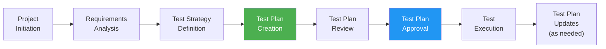
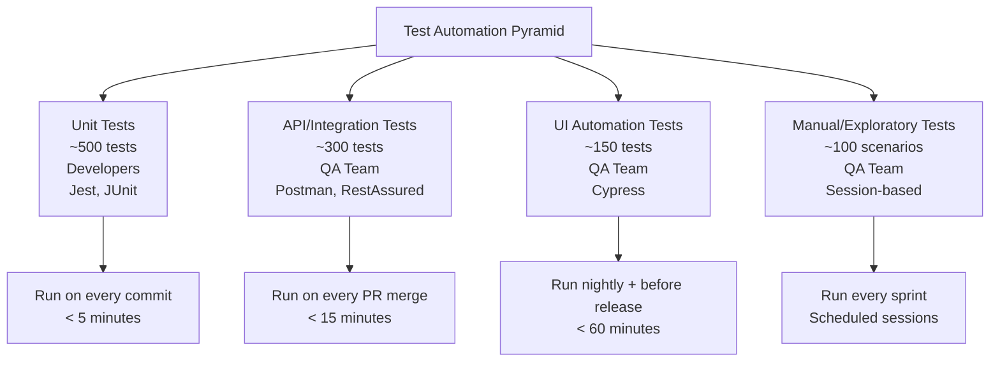
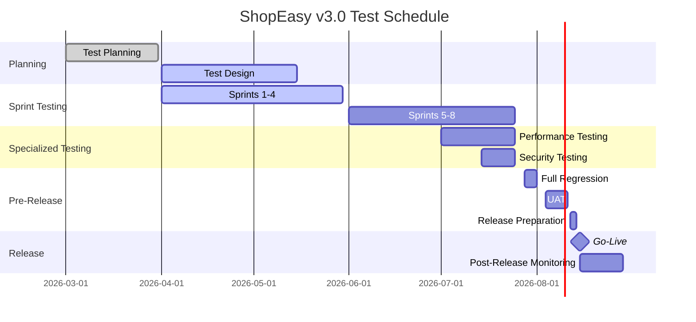
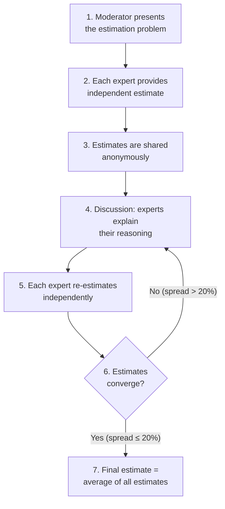
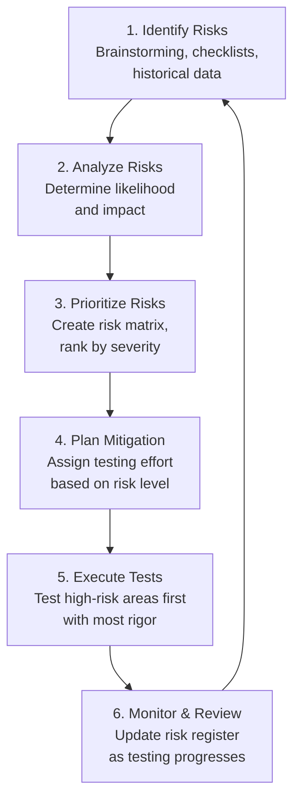
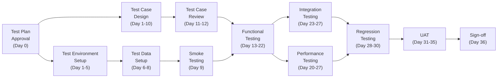

# Part 10: Test Planning & Documentation

---

## 10.1 Introduction to Test Planning

### What Is Test Planning?

**Test planning** is the systematic process of defining the scope, approach, resources, schedule, and activities required to test a software product. It is one of the most critical activities in the software testing lifecycle because it transforms the abstract concept of "testing" into a concrete, actionable plan.

A test plan is not just a document — it is a **roadmap** that guides the entire testing effort. Without a test plan, testing becomes ad-hoc, inconsistent, and unpredictable, leading to missed defects, budget overruns, and delayed releases.

> [!NOTE]
> A test plan answers four fundamental questions:
> 1. **WHAT** will be tested (and what won't)?
> 2. **HOW** will it be tested (approach, techniques, tools)?
> 3. **WHO** will test it (team composition, roles, responsibilities)?
> 4. **WHEN** will it be tested (schedule, milestones, dependencies)?

### Why Test Planning Is Crucial

| Reason | Explanation | Without Test Planning |
|--------|-------------|----------------------|
| **Provides direction** | Ensures the team knows what to test, how to test, and when | Testers work on random areas, leading to duplicate effort and coverage gaps |
| **Manages risk** | Identifies potential risks early and defines mitigation strategies | Risks are discovered during testing or worse, in production |
| **Allocates resources** | Ensures the right people, tools, and environments are available | Resource conflicts and environment unavailability delay testing |
| **Sets expectations** | Stakeholders understand what quality level to expect and when | Stakeholders have unrealistic expectations, leading to conflict |
| **Defines scope** | Clear boundaries prevent scope creep and focus effort | Testing scope keeps expanding without additional resources |
| **Tracks progress** | Provides a baseline against which to measure progress | No way to know if testing is on track or behind |
| **Ensures compliance** | Demonstrates due diligence for audits and regulations | Regulatory non-compliance can result in fines or legal action |
| **Enables estimation** | Accurate estimates of time, cost, and resources | Budget overruns and missed deadlines |

**Real-World Example — Cost of No Test Plan:**
A logistics company developed a fleet management system without a formal test plan. During system testing, the team discovered that:
- GPS integration was never tested because no one was assigned to it
- Performance testing was skipped because the load testing tool wasn't procured
- UAT was scheduled for 1 week, but 150+ test scenarios needed execution — an impossible timeline
- The release was delayed by 2 months, costing the company $500,000 in delayed ROI

### Who Creates the Test Plan?

| Role | Responsibility |
|------|---------------|
| **Test Lead / Test Manager** | Primary author; owns the test plan document |
| **QA Architect** | Contributes to test strategy, automation approach, and tool selection |
| **Test Analysts / Senior Testers** | Provide input on test scenarios, estimation, and risk identification |
| **Project Manager** | Reviews schedule, resources, and budget sections |
| **Product Owner / Business Analyst** | Validates scope, features, and priorities |
| **Development Lead** | Reviews technical sections, environment requirements, and integration points |
| **Stakeholders** | Review and approve the final plan |

### When to Create a Test Plan?

| Project Type | When to Create | Type of Plan |
|-------------|---------------|-------------|
| **Waterfall** | During the planning phase, after requirements are finalized | Comprehensive, detailed test plan |
| **V-Model** | In parallel with the corresponding development phase | Master test plan + level-specific plans |
| **Agile (Scrum)** | Lightweight plan at project start; detailed planning during each sprint | Living document, updated per sprint |
| **Agile (SAFe)** | During PI planning for the Program Increment | PI-level test plan + sprint test notes |
| **Regulatory projects** | As early as possible; required for audits | Formal, IEEE 829-compliant plan |



---

## 10.2 Test Plan (IEEE 829 Standard)

The **IEEE 829** standard (formally known as IEEE Standard for Software and System Test Documentation) defines the structure and content of a test plan. While modern Agile projects may use lighter versions, understanding the full standard is essential for interviews and formal projects.

Below is a **complete test plan** with all sections filled in using an **e-commerce web application (ShopEasy)** as the example project.

---

### Complete Test Plan: ShopEasy E-Commerce Web Application

---

#### 1. Test Plan Identifier

| Field | Value |
|-------|-------|
| **Document ID** | TP-SHOPEASY-2026-001 |
| **Version** | 2.1 |
| **Date** | May 26, 2026 |
| **Author** | Sarah Johnson, Test Lead |
| **Reviewer** | Michael Chen, QA Manager |
| **Approver** | David Williams, VP Engineering |
| **Status** | Approved |
| **Project** | ShopEasy E-Commerce Platform v3.0 |
| **Classification** | Internal — Confidential |

**Revision History:**

| Version | Date | Author | Changes |
|---------|------|--------|---------|
| 1.0 | March 1, 2026 | Sarah Johnson | Initial draft |
| 1.5 | March 15, 2026 | Sarah Johnson | Updated after requirements review |
| 2.0 | April 1, 2026 | Sarah Johnson | Added performance testing scope |
| 2.1 | May 26, 2026 | Sarah Johnson | Updated schedule after sprint 4 feedback |

---

#### 2. References

| # | Document | Version | Location |
|---|----------|---------|----------|
| 1 | ShopEasy v3.0 Business Requirements Document (BRD) | 4.2 | Confluence: /projects/shopeasy/BRD |
| 2 | ShopEasy v3.0 Functional Requirements Specification (FRS) | 3.1 | Confluence: /projects/shopeasy/FRS |
| 3 | ShopEasy System Architecture Document | 2.0 | Confluence: /projects/shopeasy/architecture |
| 4 | ShopEasy UI/UX Wireframes | Final | Figma: ShopEasy v3 Design System |
| 5 | API Specification (OpenAPI/Swagger) | 3.0.1 | Swagger Hub: shopeasy-api |
| 6 | IEEE 829-2008 Standard for Software Test Documentation | 2008 | IEEE Standards |
| 7 | Corporate QA Policy Manual | 5.0 | SharePoint: /quality/policies |
| 8 | PCI DSS Compliance Requirements | 4.0 | PCI Security Standards Council |
| 9 | Previous Release Test Report (v2.5) | Final | JIRA: TEST-2025-REPORT-Q4 |
| 10 | Third-Party Integration Documentation (Stripe, SendGrid) | Current | Respective vendor portals |

---

#### 3. Introduction

##### Purpose

This test plan defines the testing approach, scope, resources, schedule, and deliverables for the ShopEasy E-Commerce Web Application version 3.0. The purpose is to ensure that the application meets the specified requirements, is free of critical defects, and provides a reliable, secure, and performant shopping experience for end users.

This document serves as the master test plan and will be supplemented by level-specific test plans (system test plan, integration test plan, UAT plan) as needed.

##### Scope

**In-Scope:**
- User registration and authentication (including social login: Google, Apple, Facebook)
- Product catalog (search, filter, sort, categories, product details)
- Shopping cart management (add, update, remove, save for later)
- Checkout process (guest checkout, registered user checkout)
- Payment processing (credit/debit cards via Stripe, PayPal, Apple Pay, Google Pay)
- Order management (order tracking, order history, order cancellation)
- User profile management (address book, payment methods, preferences)
- Wishlist functionality
- Product reviews and ratings
- Email notifications (order confirmation, shipping updates, password reset)
- Admin panel (product management, order management, user management, reports)
- Responsive design (desktop, tablet, mobile)
- Cross-browser compatibility (Chrome, Firefox, Safari, Edge)
- API testing (RESTful APIs for mobile app integration)
- Security testing (OWASP Top 10, PCI DSS compliance)
- Performance testing (up to 10,000 concurrent users)
- Accessibility testing (WCAG 2.1 AA)

**Out-of-Scope:**
- Mobile native application testing (covered by separate test plan TP-SHOPEASY-MOB-001)
- Third-party payment gateway internal testing (covered by Stripe/PayPal SLAs)
- Content management (marketing copy, product descriptions — responsibility of content team)
- SEO testing (responsibility of the marketing team)
- Data migration from v2.5 to v3.0 (covered by separate migration test plan)
- Localization/internationalization (planned for v3.5)

##### Project Overview

ShopEasy v3.0 is a major upgrade to the existing e-commerce platform, introducing:
- **Redesigned UI** based on modern design principles (Material Design 3)
- **Microservices architecture** (migrating from monolithic)
- **New payment options** (Apple Pay, Google Pay)
- **Enhanced search** powered by Elasticsearch
- **Real-time notifications** via WebSocket
- **Progressive Web App (PWA)** capabilities

The project follows a hybrid Agile approach (SAFe) with 2-week sprints and quarterly Program Increments. Release target: August 15, 2026.

---

#### 4. Test Items

##### Features to Be Tested

| # | Module | Feature | Priority | Testing Type |
|---|--------|---------|----------|-------------|
| 1 | Authentication | User registration (email, social login) | Critical | Functional, Security |
| 2 | Authentication | Login/Logout | Critical | Functional, Security, Performance |
| 3 | Authentication | Password reset/change | High | Functional, Security |
| 4 | Authentication | Two-factor authentication (2FA) | High | Functional, Security |
| 5 | Catalog | Product search (keyword, category, filters) | Critical | Functional, Performance |
| 6 | Catalog | Product detail page | High | Functional, UI, Accessibility |
| 7 | Catalog | Product comparison (up to 4 products) | Medium | Functional |
| 8 | Cart | Add/remove/update cart items | Critical | Functional |
| 9 | Cart | Cart persistence (logged-in users) | High | Functional |
| 10 | Cart | Save for later | Medium | Functional |
| 11 | Checkout | Guest checkout | Critical | Functional, Security |
| 12 | Checkout | Registered user checkout | Critical | Functional |
| 13 | Checkout | Address validation | High | Functional, Integration |
| 14 | Checkout | Coupon/promo code application | High | Functional |
| 15 | Payment | Credit/debit card processing (Stripe) | Critical | Functional, Security, Integration |
| 16 | Payment | PayPal integration | Critical | Functional, Integration |
| 17 | Payment | Apple Pay / Google Pay | High | Functional, Integration |
| 18 | Orders | Order confirmation & email | Critical | Functional, Integration |
| 19 | Orders | Order tracking | High | Functional |
| 20 | Orders | Order cancellation/returns | High | Functional |
| 21 | Profile | Address book management | Medium | Functional |
| 22 | Profile | Payment method management | High | Functional, Security |
| 23 | Reviews | Submit/edit/delete product reviews | Medium | Functional |
| 24 | Reviews | Rating aggregation | Low | Functional |
| 25 | Admin | Product CRUD operations | High | Functional |
| 26 | Admin | Order management dashboard | High | Functional |
| 27 | Admin | Sales reports and analytics | Medium | Functional |
| 28 | Notifications | Email notifications (all types) | High | Functional, Integration |
| 29 | Notifications | Real-time in-app notifications | Medium | Functional |
| 30 | Cross-cutting | Responsive design (all viewports) | High | UI, Accessibility |

##### Features Not to Be Tested

| # | Feature | Justification |
|---|---------|---------------|
| 1 | Stripe internal payment processing | Covered by Stripe's PCI compliance and their internal testing |
| 2 | SendGrid email delivery infrastructure | Third-party SLA; we test integration only, not delivery reliability |
| 3 | CDN (CloudFront) caching behavior | AWS-managed service; tested during infrastructure setup, not in scope for application testing |
| 4 | Database failover/replication | Infrastructure team responsibility; covered by separate DR test plan |
| 5 | SEO meta tags and structured data | Marketing team responsibility |
| 6 | Browser versions older than 2 years | Business decision to support only last 2 major versions |

---

#### 5. Software Risk Issues

##### Risk Identification and Mitigation

| Risk ID | Risk Description | Likelihood | Impact | Severity | Mitigation Strategy |
|---------|-----------------|------------|--------|----------|-------------------|
| R-001 | Payment gateway (Stripe) integration failures during peak load | Medium | Critical | High | Conduct load testing with Stripe sandbox; implement circuit breaker pattern; have PayPal as fallback |
| R-002 | Elasticsearch performance degradation with 500K+ products | Medium | High | High | Performance test with production-volume data; implement caching layer; plan for index optimization |
| R-003 | Cross-browser compatibility issues (especially Safari) | High | Medium | Medium | Dedicate browser-specific testing sprints; use BrowserStack for comprehensive coverage |
| R-004 | Data migration issues from v2.5 to v3.0 | Medium | Critical | High | Separate migration testing with production data clone; rollback plan documented |
| R-005 | Third-party API rate limiting during flash sales | Low | High | Medium | Implement request queuing; test with rate-limited API simulations |
| R-006 | Security vulnerabilities (OWASP Top 10) | Medium | Critical | High | Automated security scanning in CI/CD; manual penetration testing; code review for security |
| R-007 | Test environment instability | High | Medium | Medium | Dedicated test environment with monitoring; automated environment health checks |
| R-008 | Insufficient test data for edge cases | Medium | Medium | Medium | Automated test data generation scripts; synthetic data covering all edge cases |
| R-009 | Key tester unavailability (illness, resignation) | Low | High | Medium | Cross-training; documented test cases; at least 2 testers familiar with each module |
| R-010 | Requirement changes during testing phase | High | Medium | Medium | Agile approach with impact analysis; flexible test plan; prioritized regression testing |

---

#### 6. Features to Be Tested (Detailed Approach)

| Feature | Testing Approach | Test Types | Automation Level |
|---------|-----------------|------------|-----------------|
| User Registration | Functional testing with EP/BVA for input fields; social login integration testing | Functional, Integration, Security | 80% automated |
| Login/Logout | Positive/negative scenarios; session management; concurrent login testing | Functional, Security, Performance | 90% automated |
| Product Search | Keyword variations, filters, sorting; search performance with large datasets | Functional, Performance | 85% automated |
| Shopping Cart | CRUD operations; cart persistence; concurrent modification; session timeout | Functional, Integration | 75% automated |
| Checkout | End-to-end flow; guest vs. registered; address validation; tax calculation | Functional, Integration, E2E | 70% automated |
| Payment Processing | Card validation; successful/failed payments; refunds; 3D Secure | Functional, Security, Integration | 60% automated (sandbox) |
| Order Management | Order lifecycle; email notifications; status transitions | Functional, Integration | 70% automated |
| Admin Panel | CRUD for products/orders; role-based access; reporting accuracy | Functional, Security | 50% automated |
| Responsive Design | Viewport testing at 320px, 768px, 1024px, 1440px breakpoints | UI, Accessibility | 40% automated (visual regression) |
| API Endpoints | Contract testing; authentication; rate limiting; error handling | API, Security, Performance | 95% automated |

---

#### 7. Features Not to Be Tested

*(See Section 4 — Features Not to Be Tested above, with justifications)*

---

#### 8. Approach / Test Strategy

##### Testing Types to Be Used

| Testing Type | Description | When | Tools |
|-------------|-------------|------|-------|
| **Smoke Testing** | Verify critical functionality after each deployment | After every build deployment to QA | Automated (Cypress) |
| **Functional Testing** | Verify each feature works per requirements | During sprint testing | Manual + Automated |
| **Integration Testing** | Test interactions between microservices and third-party APIs | After feature development | Automated (Postman/Newman) |
| **System Testing** | End-to-end testing of the complete system | After integration testing | Manual + Automated |
| **Regression Testing** | Verify existing functionality after changes | Every sprint | Automated (Cypress + API tests) |
| **UAT** | Business users validate the system meets their needs | Final 2 weeks before release | Manual (by business users) |
| **Performance Testing** | Load, stress, and endurance testing | Dedicated testing sprint | JMeter, Grafana |
| **Security Testing** | OWASP Top 10, penetration testing, PCI DSS compliance | Continuous (automated) + dedicated sprint (manual) | OWASP ZAP, Burp Suite |
| **Accessibility Testing** | WCAG 2.1 AA compliance | Every sprint (automated checks) + dedicated review | axe DevTools, WAVE, manual keyboard testing |
| **Compatibility Testing** | Cross-browser, cross-device testing | Every sprint (critical browsers) + dedicated phase | BrowserStack |
| **Exploratory Testing** | Unscripted testing based on tester experience | Every sprint | Session-based (SBTM) |

##### Automation Approach



**Automation Strategy:**
- **Phase 1 (Sprints 1–3):** Automate smoke tests and critical path scenarios (login, search, add to cart, checkout)
- **Phase 2 (Sprints 4–6):** Automate regression test suite for completed features
- **Phase 3 (Sprints 7–9):** Automate API tests and cross-browser scenarios
- **Phase 4 (Sprint 10+):** Optimize test suite; add performance and security automation

##### Regression Strategy

| Regression Level | Scope | Execution Frequency | Duration |
|-----------------|-------|--------------------|---------| 
| **Smoke** | 20 critical path test cases | After every build deployment | 15 minutes |
| **Sanity** | 50 test cases covering all modules | Daily (automated) | 30 minutes |
| **Partial Regression** | Test cases related to changed modules + dependent modules | Before sprint review | 2 hours |
| **Full Regression** | Complete regression suite (150+ test cases) | Before each release | 4 hours (automated) |

---

#### 9. Item Pass/Fail Criteria

##### Entry Criteria

| # | Criterion | Verification Method |
|---|-----------|-------------------|
| 1 | Requirements document approved and baselined | Document version control |
| 2 | Test plan reviewed and approved by stakeholders | Sign-off in document header |
| 3 | Test environment set up and verified | Environment checklist validation |
| 4 | Test data prepared and loaded | Test data verification scripts |
| 5 | Build deployed to QA environment successfully | Deployment notification from CI/CD |
| 6 | Smoke test passed on the deployed build | Automated smoke test report |
| 7 | Unit test coverage ≥ 80% | SonarQube dashboard |
| 8 | No critical/blocker defects from previous builds | JIRA defect dashboard |
| 9 | Testing tools installed and configured | Tool readiness checklist |
| 10 | Test team available and trained | Resource allocation confirmed |

##### Exit Criteria

| # | Criterion | Target | Current Status |
|---|-----------|--------|---------------|
| 1 | All planned test cases executed | 100% | — |
| 2 | Test case pass rate | ≥ 95% | — |
| 3 | Critical defects open | 0 | — |
| 4 | Major defects open | ≤ 3 (with workarounds documented) | — |
| 5 | Minor defects open | ≤ 10 | — |
| 6 | Defect leakage rate | < 5% | — |
| 7 | Regression test suite passing | 100% | — |
| 8 | Performance benchmarks met | Response time < 3s at 10K users | — |
| 9 | Security scan (no critical/high vulnerabilities) | Clean OWASP ZAP report | — |
| 10 | UAT sign-off received | Signed by business stakeholders | — |
| 11 | Test summary report published | Approved by Test Manager | — |

##### Suspension Criteria

Testing will be suspended if:
1. More than 30% of test cases are blocked due to environment issues
2. A critical build defect prevents execution of any test scenario
3. Test environment is down for more than 4 consecutive hours
4. A security breach is detected in the test environment
5. Key testing resources (more than 50% of the team) are unavailable

##### Resumption Criteria

Testing will resume when:
1. The root cause of suspension is identified and resolved
2. A new build is deployed (if suspension was due to build issues)
3. Test environment stability is confirmed for at least 2 hours
4. Test Manager approves resumption with a brief re-assessment
5. Remaining test execution plan is updated and communicated

---

#### 10. Suspension Criteria and Resumption Requirements

*(Detailed in Section 9 above)*

---

#### 11. Test Deliverables

| # | Deliverable | Owner | Timing | Format |
|---|-------------|-------|--------|--------|
| 1 | Test Plan (this document) | Test Lead | Before testing starts | Confluence + PDF |
| 2 | Test Cases / Test Scenarios | Test Analysts | Before each sprint's testing | TestRail |
| 3 | Test Data Sets | Test Analysts | Before test execution | SQL scripts + JSON files |
| 4 | Test Environment Setup Document | DevOps + Test Lead | Before testing starts | Confluence |
| 5 | Traceability Matrix | Test Lead | Updated each sprint | Excel / TestRail |
| 6 | Daily Test Execution Report | Test Lead | Daily during testing | Email / Slack |
| 7 | Defect Reports | All Testers | Ongoing | JIRA |
| 8 | Sprint Test Summary | Test Lead | End of each sprint | Confluence |
| 9 | Performance Test Report | Performance Tester | After performance testing | Confluence + Grafana dashboards |
| 10 | Security Test Report | Security Tester | After security testing | Confluence (restricted access) |
| 11 | UAT Report | UAT Coordinator | After UAT completion | Confluence + sign-off form |
| 12 | Test Automation Scripts | Automation Engineers | Ongoing | Git repository |
| 13 | Final Test Summary Report | Test Lead | Before release | Confluence + PDF |
| 14 | Lessons Learned / Retrospective Notes | Test Lead | After release | Confluence |

---

#### 12. Remaining Test Tasks

| # | Task | Assigned To | Target Date | Status |
|---|------|-------------|-------------|--------|
| 1 | Finalize test cases for payment module | Priya Sharma | June 15, 2026 | In Progress |
| 2 | Set up BrowserStack integration | James Wilson | June 10, 2026 | Not Started |
| 3 | Create performance test scripts (JMeter) | Alex Kim | June 20, 2026 | In Progress |
| 4 | Prepare UAT test scenarios with business team | Sarah Johnson | July 1, 2026 | Not Started |
| 5 | Configure automated security scanning in CI/CD | DevOps Team | June 5, 2026 | In Progress |
| 6 | Create synthetic test data (50K products, 10K users) | Maria Garcia | June 12, 2026 | Not Started |
| 7 | Train junior testers on Cypress automation framework | James Wilson | June 8, 2026 | Scheduled |
| 8 | Obtain production database snapshot for performance testing | DBA Team | June 25, 2026 | Requested |

---

#### 13. Environmental Needs

##### Hardware Requirements

| Environment | Server Specs | Quantity | Purpose |
|-------------|-------------|----------|---------|
| QA Server | 8 CPU, 16 GB RAM, 200 GB SSD | 3 (web, API, DB) | Functional testing |
| Staging Server | 16 CPU, 32 GB RAM, 500 GB SSD | 3 (web, API, DB) | Pre-production validation |
| Performance Test Server | 32 CPU, 64 GB RAM, 1 TB SSD | 5 (web x2, API x2, DB) | Load and stress testing |
| Test Client Machines | Standard dev machine | 6 | Manual testing |
| Mobile Devices | iPhone 14, Samsung Galaxy S23, iPad Air | 1 each | Mobile responsive testing |

##### Software Requirements

| Software | Version | Purpose | License |
|----------|---------|---------|---------|
| Chrome | Latest | Primary test browser | Free |
| Firefox | Latest | Cross-browser testing | Free |
| Safari | Latest | Cross-browser testing (macOS/iOS) | Free |
| Edge | Latest | Cross-browser testing | Free |
| Node.js | 20.x LTS | Application runtime | Free |
| PostgreSQL | 15.x | Database | Free |
| Redis | 7.x | Cache layer | Free |
| Elasticsearch | 8.x | Search engine | Free (basic tier) |
| Cypress | 13.x | UI test automation | Free |
| JMeter | 5.6 | Performance testing | Free |
| Postman | Latest | API testing | Team plan ($12/user/month) |
| OWASP ZAP | Latest | Security testing | Free |
| BrowserStack | Cloud plan | Cross-browser/device testing | Enterprise ($249/month) |
| TestRail | Cloud | Test case management | Professional ($36/user/month) |
| JIRA | Cloud | Defect tracking and project management | Premium |
| SonarQube | Community | Code quality analysis | Free |

##### Network Requirements

| Requirement | Specification |
|-------------|--------------|
| QA environment network | Isolated VLAN, 1 Gbps internal |
| Internet access | Required for third-party API integration testing (Stripe sandbox, SendGrid) |
| VPN access | Required for remote testers |
| Firewall rules | QA environment accessible only from office network and VPN |
| SSL certificates | Valid SSL certificates for QA and staging environments |

##### Test Data Requirements

| Data Type | Volume | Source | Sensitivity |
|-----------|--------|--------|-------------|
| User accounts | 10,000 synthetic users | Generated via Faker.js | No PII — all synthetic |
| Product catalog | 50,000 products across 200 categories | Cloned from production (sanitized) | Non-sensitive |
| Orders | 100,000 historical orders | Generated based on production patterns | Sanitized — no real user data |
| Payment test cards | Stripe test card numbers | Stripe documentation | Non-sensitive (test mode only) |
| Address data | 5,000 valid US addresses | USPS address validation API (test mode) | Non-sensitive |
| Coupon codes | 50 test coupons with various rules | Created by test team | Non-sensitive |

> [!WARNING]
> Under NO circumstances should real customer data (PII, payment information) be used in the test environment. All test data must be synthetic or properly anonymized. This is required for PCI DSS and GDPR compliance.

---

#### 14. Staffing and Training Needs

##### Team Composition

| Role | Name | Allocation | Modules |
|------|------|------------|---------|
| Test Lead | Sarah Johnson | 100% | Overall testing coordination, all modules |
| Senior QA Analyst | Priya Sharma | 100% | Checkout, Payment, Orders |
| QA Analyst | James Wilson | 100% | Authentication, Profile, Admin Panel |
| QA Analyst | Maria Garcia | 100% | Catalog, Search, Cart, Wishlist |
| QA Analyst | Tom Lee | 50% | Reviews, Notifications, Email |
| Automation Engineer | Alex Kim | 100% | Test automation framework and scripts |
| Performance Tester | Rachel Brown | 50% (Sprints 7–10) | Performance, load, stress testing |
| Security Tester | External Vendor | 2 weeks (Sprint 9) | Penetration testing, security audit |
| UAT Coordinator | Sarah Johnson | Part-time (Sprint 10–11) | UAT facilitation |

##### Training Requirements

| # | Training Topic | Target Audience | Duration | Deadline |
|---|---------------|----------------|----------|----------|
| 1 | Cypress test automation framework | All QA Analysts | 3 days | June 8, 2026 |
| 2 | Microservices architecture overview | All QA team | 1 day | June 5, 2026 |
| 3 | ShopEasy v3.0 new features walkthrough | All QA team | 2 hours | Sprint planning |
| 4 | JMeter performance testing | Rachel Brown, Alex Kim | 2 days | June 18, 2026 |
| 5 | OWASP Top 10 and security testing basics | All QA team | 1 day | June 12, 2026 |
| 6 | PCI DSS compliance requirements | Senior testers | Half day | June 10, 2026 |
| 7 | BrowserStack cloud testing | All QA Analysts | Half day | June 10, 2026 |
| 8 | Accessibility testing (WCAG 2.1 AA) | Maria Garcia, James Wilson | 1 day | June 15, 2026 |

---

#### 15. Responsibilities

##### RACI Matrix

| Activity | Test Lead | QA Analysts | Automation Engineer | Performance Tester | Security Tester | PO | Dev Lead | PM |
|----------|-----------|-------------|--------------------|--------------------|----------------|-----|---------|-----|
| Test Plan creation | **A/R** | C | C | C | C | C | C | I |
| Test case design | A | **R** | C | — | — | C | I | I |
| Test automation development | A | C | **R** | — | — | — | C | I |
| Manual test execution | A | **R** | — | — | — | — | I | I |
| Regression testing | A | **R** | **R** | — | — | — | I | I |
| Performance testing | A | I | C | **R** | — | — | C | I |
| Security testing | A | I | — | — | **R** | — | C | I |
| UAT coordination | **R** | C | — | — | — | **A** | I | C |
| Defect triage | **R** | C | C | — | — | C | **R** | I |
| Test environment setup | C | I | C | C | — | — | **R** | I |
| Test summary report | **R** | C | C | C | C | I | I | **A** |

**Legend:** R = Responsible, A = Accountable, C = Consulted, I = Informed

---

#### 16. Schedule

##### Timeline with Milestones

| Phase | Start Date | End Date | Duration | Key Activities |
|-------|-----------|---------|----------|----------------|
| **Test Planning** | March 1, 2026 | March 31, 2026 | 4 weeks | Test plan, test strategy, tool setup |
| **Test Design** | April 1, 2026 | May 15, 2026 | 6 weeks | Test cases, test data, automation framework |
| **Sprint Testing (Sprints 1–4)** | April 1, 2026 | May 30, 2026 | 8 weeks | Functional testing per sprint |
| **Sprint Testing (Sprints 5–8)** | June 1, 2026 | July 25, 2026 | 8 weeks | Functional + integration testing |
| **Performance Testing** | July 1, 2026 | July 25, 2026 | 4 weeks | Load, stress, endurance testing |
| **Security Testing** | July 14, 2026 | July 25, 2026 | 2 weeks | Penetration testing, security audit |
| **Full Regression** | July 28, 2026 | August 1, 2026 | 1 week | Complete regression suite execution |
| **UAT** | August 4, 2026 | August 11, 2026 | 1 week | Business user acceptance testing |
| **Release Preparation** | August 12, 2026 | August 14, 2026 | 3 days | Final checks, sign-off, deployment plan |
| **Go-Live** | August 15, 2026 | — | — | Production deployment |
| **Post-Release Monitoring** | August 15, 2026 | August 29, 2026 | 2 weeks | Production monitoring, hotfix testing |



---

#### 17. Planning Risks and Contingencies

| Risk | Probability | Impact | Contingency Plan |
|------|------------|--------|-----------------|
| Schedule delays in development reduce testing time | High | High | Prioritize risk-based testing; focus on critical path first; leverage automation for regression |
| Key tester leaves the project | Low | High | Cross-training implemented; all test cases documented in TestRail; at least 2 people per module |
| Test environment unavailability | Medium | Medium | Secondary test environment configured; local Docker-based testing as backup |
| Third-party API downtime (Stripe sandbox) | Low | Medium | Mocked API responses for functional testing; integration testing rescheduled |
| New regulatory requirements discovered | Low | High | Compliance buffer built into schedule; security/compliance team consulted monthly |
| Underestimation of test effort | Medium | Medium | 15% buffer built into estimates; scope negotiation with PM if needed |
| Automation framework instability | Medium | Medium | Manual testing fallback; dedicated automation maintenance sprints |

---

#### 18. Approvals

| Role | Name | Signature | Date |
|------|------|-----------|------|
| Test Lead | Sarah Johnson | ___________________ | ___ / ___ / 2026 |
| QA Manager | Michael Chen | ___________________ | ___ / ___ / 2026 |
| Project Manager | Lisa Park | ___________________ | ___ / ___ / 2026 |
| Development Lead | Robert Taylor | ___________________ | ___ / ___ / 2026 |
| Product Owner | Amy Rodriguez | ___________________ | ___ / ___ / 2026 |
| VP Engineering | David Williams | ___________________ | ___ / ___ / 2026 |

---

## 10.3 Test Strategy Document

### What Is Test Strategy?

A **test strategy** is a high-level document that defines the organization's overall approach to testing. Unlike a test plan (which is project-specific), a test strategy typically applies across multiple projects and provides organizational-level testing standards and guidelines.

Think of the test strategy as the **constitution** and the test plan as **specific legislation**. The strategy sets the overarching principles; the plan implements them for a specific project.

### Test Plan vs Test Strategy Comparison

| Aspect | Test Plan | Test Strategy |
|--------|-----------|---------------|
| **Scope** | Project-specific | Organization-wide or product-line-wide |
| **Granularity** | Detailed — specific test cases, schedules, resources | High-level — general approach and principles |
| **Created by** | Test Lead / Test Manager | QA Manager / QA Director / CTO |
| **Frequency** | One per project (or release) | One per organization (updated periodically) |
| **Lifespan** | Duration of the project | Long-term (years) |
| **Content focus** | WHAT to test, WHEN, WHO, HOW for this project | HOW the organization approaches testing in general |
| **Audience** | Project team, stakeholders | All project teams, management, auditors |
| **Changeability** | Updated frequently during the project | Rarely changed; reviewed annually |
| **Standards reference** | IEEE 829 | ISTQB, organizational quality standards |
| **Examples of content** | "Sprint 5 will test the checkout flow with 3 testers" | "All projects must achieve 80% automation coverage" |

### Test Strategy Template

```
TEST STRATEGY DOCUMENT
=======================

1. INTRODUCTION
   1.1 Purpose
   1.2 Scope
   1.3 Audience

2. TEST APPROACH
   2.1 Testing Levels (Unit, Integration, System, Acceptance)
   2.2 Testing Types (Functional, Non-Functional, Structural)
   2.3 Entry and Exit Criteria Standards
   2.4 Test Design Techniques Standards

3. TEST ENVIRONMENT STRATEGY
   3.1 Environment Architecture
   3.2 Environment Management
   3.3 Data Management

4. TEST AUTOMATION STRATEGY
   4.1 Automation Goals
   4.2 Tool Standards
   4.3 Automation Framework Standards
   4.4 Automation Coverage Targets

5. DEFECT MANAGEMENT STRATEGY
   5.1 Defect Lifecycle
   5.2 Severity and Priority Definitions
   5.3 Defect Triage Process

6. TEST METRICS AND REPORTING
   6.1 Standard Metrics
   6.2 Reporting Frequency and Format
   6.3 Dashboards

7. RISK MANAGEMENT
   7.1 Risk-Based Testing Approach
   7.2 Risk Categories
   7.3 Risk Assessment Methodology

8. COMPLIANCE AND STANDARDS
   8.1 Industry Standards (IEEE, ISTQB)
   8.2 Regulatory Requirements
   8.3 Audit Requirements

9. ROLES AND RESPONSIBILITIES
   9.1 QA Organization Structure
   9.2 Standard Roles and Competencies

10. CONTINUOUS IMPROVEMENT
    10.1 Process Improvement Framework
    10.2 Metrics-Driven Improvement
    10.3 Knowledge Management
```

### Types of Test Strategies

| Strategy Type | Description | When to Use | Example |
|--------------|-------------|-------------|---------|
| **Analytical** | Test design is based on analysis of requirements, risks, or other factors | Most structured projects; risk-based testing | "We analyzed 50 requirements and identified 15 high-risk areas. 60% of test effort will focus on these high-risk areas." |
| **Model-Based** | Tests are designed based on models (state diagrams, data flow diagrams, process models) | Complex systems with clear workflows | "We created state transition diagrams for the order lifecycle and designed tests to cover all valid and invalid transitions." |
| **Methodical** | Tests are based on predefined set of test conditions (quality characteristics, checklists) | Projects with established quality standards | "We test every screen against a 50-item usability checklist covering layout, navigation, error handling, and accessibility." |
| **Process-Compliant** | Testing follows externally defined standards or regulations | Regulated industries (healthcare, finance, aviation) | "Testing follows FDA 21 CFR Part 11 requirements, including validation protocols, traceability, and documented evidence." |
| **Directed** | Testing is guided by advice or instructions from stakeholders or domain experts | When subject matter expertise drives testing | "The head of risk management identified 10 critical scenarios. Testing prioritizes these scenarios with 100% coverage." |
| **Regression-Averse** | Heavy focus on regression testing to ensure existing functionality is preserved | Maintenance projects, legacy systems | "After every change, the full regression suite of 2,000 tests is executed before deployment." |
| **Reactive** | Testing is responsive to the system under test rather than pre-planned | Exploratory testing, research projects | "Testers use session-based exploratory testing, with charters derived from user complaints and support tickets." |

> [!TIP]
> In practice, most organizations use a **combination** of strategies. For example, a fintech company might use an analytical strategy for risk identification, process-compliant strategy for regulatory features, and a reactive strategy for exploratory testing sessions.

### Example Test Strategy (Excerpt)

**Test Automation Strategy Section for a SaaS Company:**

```
4. TEST AUTOMATION STRATEGY

4.1 Automation Goals
  - Achieve 80% automation coverage for regression test suites across all products
  - Reduce regression testing cycle time from 5 days to under 4 hours
  - Enable continuous testing in CI/CD pipelines with automated quality gates

4.2 Tool Standards
  - UI Testing: Cypress (web), Appium (mobile)
  - API Testing: Postman/Newman (functional), k6 (performance)
  - Unit Testing: Jest (frontend), JUnit (backend)
  - Security: OWASP ZAP (DAST), SonarQube (SAST)
  - Visual Regression: Percy
  
4.3 Automation Framework Standards
  - All automation projects must use the Page Object Model (POM) design pattern
  - Tests must be independent (no test dependencies)
  - Tests must be data-driven (test data separate from test logic)
  - Tests must run in CI/CD without manual intervention
  - Test reports must be generated automatically (Allure format)
  
4.4 Automation Coverage Targets
  - Smoke tests: 100% automated
  - Regression tests: 80% automated
  - API tests: 95% automated
  - UI tests: 60% automated (focus on critical paths)
  - Performance tests: 100% automated (scheduled runs)
```

---

## 10.4 Test Estimation Techniques

Test estimation is the process of predicting the **time, effort, and resources** required to complete testing activities. Accurate estimation is critical for project planning, budgeting, and setting realistic expectations.

> [!WARNING]
> Under-estimation leads to rushed testing and missed defects. Over-estimation leads to wasted resources and loss of stakeholder trust. Both are harmful — aim for accuracy with appropriate buffers.

### Work Breakdown Structure (WBS)

**What it is:** A hierarchical decomposition of the total testing work into smaller, manageable tasks that can be individually estimated.

**Step-by-Step Process:**

1. **Identify all testing activities** at the highest level (test planning, test design, test execution, reporting)
2. **Break each activity into sub-activities** (e.g., test execution → smoke testing, functional testing, regression testing, etc.)
3. **Break sub-activities into tasks** (e.g., functional testing → test login module, test search module, etc.)
4. **Estimate each task** in hours or days
5. **Sum up** to get the total estimate
6. **Add buffer** (typically 10–20% for unforeseen issues)

**Example: WBS for Testing a Mobile Banking App**

```
Mobile Banking App Testing - WBS
│
├── 1. Test Planning (32 hours)
│   ├── 1.1 Review requirements (8h)
│   ├── 1.2 Create test plan (12h)
│   ├── 1.3 Review and approve test plan (4h)
│   ├── 1.4 Set up test management tool (4h)
│   └── 1.5 Prepare test data (4h)
│
├── 2. Test Design (80 hours)
│   ├── 2.1 Login/Authentication (12h - 25 test cases)
│   ├── 2.2 Account Overview (8h - 15 test cases)
│   ├── 2.3 Fund Transfer (16h - 35 test cases)
│   ├── 2.4 Bill Payment (16h - 30 test cases)
│   ├── 2.5 Mobile Deposit (12h - 20 test cases)
│   ├── 2.6 Settings & Profile (8h - 15 test cases)
│   └── 2.7 Notifications (8h - 12 test cases)
│
├── 3. Test Execution (160 hours)
│   ├── 3.1 Smoke Testing (8h - 5 cycles)
│   ├── 3.2 Functional Testing (80h - 152 test cases)
│   ├── 3.3 Integration Testing (24h)
│   ├── 3.4 Regression Testing (32h - 3 cycles)
│   └── 3.5 Exploratory Testing (16h - 8 sessions)
│
├── 4. Non-Functional Testing (60 hours)
│   ├── 4.1 Performance Testing (24h)
│   ├── 4.2 Security Testing (20h)
│   ├── 4.3 Compatibility Testing (8h)
│   └── 4.4 Accessibility Testing (8h)
│
├── 5. Defect Management (40 hours)
│   ├── 5.1 Bug reporting and triage (16h)
│   ├── 5.2 Bug verification and retesting (16h)
│   └── 5.3 Bug regression testing (8h)
│
├── 6. Reporting & Closure (16 hours)
│   ├── 6.1 Daily/weekly status reports (8h)
│   ├── 6.2 Final test summary report (4h)
│   └── 6.3 Lessons learned (4h)
│
├── SUBTOTAL: 388 hours
├── Buffer (15%): 58 hours
└── TOTAL ESTIMATE: 446 hours ≈ 56 person-days
```

---

### Function Point Analysis (FPA)

**What it is:** A technique that estimates testing effort based on the functional complexity of the application, measured in Function Points (FP).

**Calculation Methodology:**

1. **Count Function Points** by identifying:
   - **External Inputs (EI):** Data entering the system (forms, file uploads)
   - **External Outputs (EO):** Data leaving the system (reports, notifications)
   - **External Inquiries (EQ):** Data retrieval requests (search, lookup)
   - **Internal Logical Files (ILF):** Data stored within the system (database tables)
   - **External Interface Files (EIF):** Data referenced from external systems (APIs)

2. **Assign complexity weights:**

| Function Type | Low | Average | High |
|--------------|-----|---------|------|
| External Inputs (EI) | 3 | 4 | 6 |
| External Outputs (EO) | 4 | 5 | 7 |
| External Inquiries (EQ) | 3 | 4 | 6 |
| Internal Logical Files (ILF) | 7 | 10 | 15 |
| External Interface Files (EIF) | 5 | 7 | 10 |

3. **Calculate Unadjusted Function Points (UFP):** Sum of all weighted counts

4. **Apply adjustment factor** based on system characteristics (data communications, distributed processing, performance, etc.)

5. **Convert to test effort:** Use an organization-specific ratio (e.g., 1 FP = 0.5 person-hours of testing effort)

**Example:**

| Function Type | Count | Complexity | Weight | Total |
|--------------|-------|------------|--------|-------|
| External Inputs | 15 | Average | 4 | 60 |
| External Outputs | 8 | Average | 5 | 40 |
| External Inquiries | 10 | Low | 3 | 30 |
| Internal Logical Files | 6 | High | 15 | 90 |
| External Interface Files | 4 | Average | 7 | 28 |
| **UFP** | | | | **248** |

With an adjustment factor of 1.1 and a test effort ratio of 0.5 hours/FP:
- Adjusted FP = 248 × 1.1 = 272.8
- Test Effort = 272.8 × 0.5 = **136.4 person-hours ≈ 17 person-days**

---

### Three-Point Estimation

**What it is:** A technique that accounts for uncertainty by calculating three estimates: optimistic, most likely, and pessimistic.

**Formula (PERT):**
```
E = (O + 4M + P) / 6
Standard Deviation (SD) = (P - O) / 6
```

Where:
- **O** = Optimistic estimate (best case, everything goes perfectly)
- **M** = Most Likely estimate (realistic case)
- **P** = Pessimistic estimate (worst case, everything goes wrong)
- **E** = Expected estimate (weighted average)

**Example: Estimating Test Execution for an E-Commerce Checkout Module**

| Activity | Optimistic (O) | Most Likely (M) | Pessimistic (P) | Expected (E) | SD |
|----------|---------------|-----------------|-----------------|-------------|-----|
| Test case design | 12h | 16h | 28h | **17.3h** | 2.7h |
| Test data preparation | 4h | 6h | 12h | **6.7h** | 1.3h |
| Functional testing | 20h | 30h | 50h | **31.7h** | 5.0h |
| Integration testing | 8h | 12h | 24h | **13.3h** | 2.7h |
| Regression testing | 6h | 10h | 18h | **10.7h** | 2.0h |
| Bug retesting | 4h | 8h | 16h | **8.7h** | 2.0h |
| **Total** | **54h** | **82h** | **148h** | **88.4h** | — |

**Interpretation:**
- The expected effort is **88.4 hours** (approximately 11 person-days)
- With 95% confidence (±2 SD), the effort will be between 88.4 - 2(15.7) = **57h** and 88.4 + 2(15.7) = **119.8h**
- For planning purposes, use the expected estimate + 1 SD = **104.1 hours** (13 person-days) for a ~84% confidence level

---

### Use Case Point Method

**What it is:** A technique that estimates effort based on the complexity and number of use cases, supplemented by technical and environmental factors.

**Process:**

1. **Count actors** and classify them:
   - Simple (API, system interface) = 1 point
   - Average (protocol-driven interface, e.g., TCP/IP) = 2 points
   - Complex (human user via GUI) = 3 points

2. **Count use cases** and classify them:
   - Simple (≤3 transactions) = 5 points
   - Average (4–7 transactions) = 10 points
   - Complex (≥8 transactions) = 15 points

3. **Calculate Unadjusted Use Case Points (UUCP)** = Sum of actor weights + Sum of use case weights

4. **Apply Technical Complexity Factor (TCF)** and **Environmental Complexity Factor (ECF)**

5. **Calculate Use Case Points (UCP)** = UUCP × TCF × ECF

6. **Convert to effort:** UCP × productivity factor (typically 20–28 hours/UCP)

**Example:**

| Use Case | Complexity | Weight |
|----------|-----------|--------|
| User Registration | Average (5 transactions) | 10 |
| Product Search | Complex (10 transactions) | 15 |
| Shopping Cart | Average (6 transactions) | 10 |
| Checkout | Complex (12 transactions) | 15 |
| Payment Processing | Complex (8 transactions) | 15 |
| Order Tracking | Simple (3 transactions) | 5 |
| **Total Use Case Points** | | **70** |

| Actor | Complexity | Weight |
|-------|-----------|--------|
| Customer (web UI) | Complex | 3 |
| Admin (web UI) | Complex | 3 |
| Payment Gateway (API) | Simple | 1 |
| Email Service (API) | Simple | 1 |
| **Total Actor Points** | | **8** |

UUCP = 70 + 8 = 78
With TCF = 1.0 and ECF = 0.9:
UCP = 78 × 1.0 × 0.9 = **70.2**

Test effort = 70.2 × 24 hours/UCP = **1,684.8 hours ≈ 211 person-days**

(Note: This includes all project effort. Testing is typically 30–40%, so test effort ≈ 63–84 person-days)

---

### Wideband Delphi Technique

**What it is:** A consensus-based estimation technique where a group of experts independently estimate, discuss, and re-estimate until they converge on an agreed figure.

**Process:**



**Example:**

**Estimation Task:** "How many hours to test the payment module of an online banking application?"

| Expert | Round 1 | Reasoning | Round 2 | Round 3 |
|--------|---------|-----------|---------|---------|
| Expert A (Senior QA) | 120h | "15 payment methods × 8 scenarios each" | 100h | 95h |
| Expert B (Test Lead) | 80h | "Based on similar project last year" | 90h | 92h |
| Expert C (QA Analyst) | 150h | "Including regulatory compliance testing" | 110h | 100h |
| Expert D (Automation Lead) | 60h | "70% can be automated from existing scripts" | 85h | 88h |

After 3 rounds, estimates converged (range: 88h–100h, spread ≈ 12%):
**Final estimate = (95 + 92 + 100 + 88) / 4 = 93.75 hours ≈ 94 hours**

---

### Experience-Based Estimation

**What it is:** Estimation based on the tester's or team's past experience with similar projects.

**When to Use:**
- When historical data from similar projects is available
- When the team has experienced members who have tested similar systems
- For quick, initial estimates during project planning
- When formal estimation techniques are too time-consuming

**Guidelines:**

| Guideline | Description |
|-----------|-------------|
| **Use analogous projects** | "Last year, we tested a similar e-commerce checkout in 80 hours. This one has more payment options but fewer shipping options, so I estimate 85 hours." |
| **Adjust for complexity** | Compare the current project's complexity with past projects and apply a multiplier (1.2x for higher complexity, 0.8x for lower) |
| **Consider team experience** | A team experienced with the technology will test faster than a new team |
| **Account for learning curve** | New tools, technologies, or domains add 20–30% overhead |
| **Document assumptions** | Always record what assumptions your estimate is based on |
| **Validate with multiple experts** | Don't rely on a single person's estimate |

> [!TIP]
> Keep an **estimation log** — record your estimates and actual effort for every project. Over time, this historical data makes experience-based estimation increasingly accurate. If you consistently underestimate by 20%, you know to add a 20% buffer.

---

### Comparison Table of All Estimation Techniques

| Technique | Accuracy | Effort Required | Best For | Limitations |
|-----------|----------|----------------|----------|-------------|
| **WBS** | High | High (requires detailed decomposition) | Detailed project planning; large projects | Time-consuming; requires knowledge of all tasks |
| **Function Point Analysis** | Medium-High | High (requires function point counting) | New projects with clear requirements | Complex calculation; requires FPA expertise |
| **Three-Point** | Medium-High | Medium (three estimates per task) | When uncertainty is high; risk-aware planning | Pessimistic estimates may be too conservative |
| **Use Case Point** | Medium | Medium (requires use case documentation) | Use case-driven projects | Relies on accurate use case identification |
| **Wideband Delphi** | High | Medium (requires expert panels, multiple rounds) | Complex projects; when consensus is needed | Time-consuming; requires available experts |
| **Experience-Based** | Low-Medium | Low (quick assessment) | Quick estimates; familiar projects | Subjective; prone to bias; unreliable for novel projects |

---

## 10.5 Risk-Based Testing

### What Is Risk-Based Testing?

**Risk-Based Testing (RBT)** is a testing approach where test activities are planned, designed, and prioritized based on the **risk** associated with each feature, function, or area of the system. The core principle is: **test the riskiest things first and most thoroughly**.

**Risk** in testing is defined as:
> **Risk = Likelihood (of failure) × Impact (of failure)**

### Risk Identification Process



**Risk Identification Methods:**

| Method | Description | Example |
|--------|-------------|---------|
| **Brainstorming** | Team discusses potential risks | "What could go wrong with the payment flow?" |
| **Checklists** | Use predefined risk checklists from past projects | "Check for: data loss, security breaches, performance degradation, usability issues" |
| **Historical Data** | Review defects from previous releases | "The search module had 40 bugs in v2.0 — it's high risk" |
| **Expert Judgment** | Consult domain experts and experienced team members | "The compliance officer flagged HIPAA risks in data handling" |
| **Requirements Analysis** | Identify complex, ambiguous, or frequently changed requirements | "The pricing engine has 15 discount rules with complex interactions" |
| **Architecture Analysis** | Identify risky technology choices and integration points | "The new Elasticsearch integration is untested in production" |

### Risk Assessment Matrix

| | **Impact: Low** | **Impact: Medium** | **Impact: High** | **Impact: Critical** |
|---|---|---|---|---|
| **Likelihood: Very High** | Medium | High | **Critical** | **Critical** |
| **Likelihood: High** | Low | Medium | **High** | **Critical** |
| **Likelihood: Medium** | Low | Medium | **High** | **High** |
| **Likelihood: Low** | Low | Low | Medium | **High** |
| **Likelihood: Very Low** | Low | Low | Low | Medium |

**Color Coding:**
- 🔴 **Critical:** Test first, with maximum rigor. 100% test coverage. Automated regression.
- 🟠 **High:** Test thoroughly. 90%+ coverage. Strong regression.
- 🟡 **Medium:** Test adequately. 75%+ coverage. Selective regression.
- 🟢 **Low:** Test minimally. Spot checks. Exploratory testing.

### Risk Prioritization

After assessment, risks are ranked by severity (likelihood × impact):

| Rank | Risk | Likelihood (1-5) | Impact (1-5) | Score | Test Priority |
|------|------|------------------|--------------|-------|--------------|
| 1 | Payment processing failure | 3 | 5 | **15** | Critical — test first |
| 2 | Customer data breach | 2 | 5 | **10** | Critical — dedicated security testing |
| 3 | Search returning wrong results | 4 | 3 | **12** | High — extensive functional testing |
| 4 | Checkout flow breaks on mobile | 3 | 4 | **12** | High — cross-device testing |
| 5 | Performance degradation under load | 3 | 4 | **12** | High — dedicated performance testing |
| 6 | Email notifications not sent | 3 | 3 | **9** | Medium — integration testing |
| 7 | Admin report data inaccuracy | 2 | 3 | **6** | Medium — validation testing |
| 8 | Wishlist feature malfunction | 2 | 2 | **4** | Low — basic functional testing |
| 9 | UI alignment issues on Edge | 3 | 1 | **3** | Low — visual spot check |

### Risk Mitigation Through Testing

| Risk Level | Testing Approach | Effort Allocation |
|-----------|-----------------|-------------------|
| **Critical** | Full functional testing + integration + performance + security + exploratory | 40% of total effort |
| **High** | Comprehensive functional testing + selective integration + regression | 30% of total effort |
| **Medium** | Key functional scenarios + basic regression | 20% of total effort |
| **Low** | Smoke testing + ad-hoc checks | 10% of total effort |

### Example: Risk-Based Testing for a Healthcare Application

**Application:** PatientCare — a hospital management system with modules for patient registration, appointment scheduling, prescription management, lab results, and billing.

**Risk Register:**

| ID | Risk | Module | Likelihood | Impact | Score | Mitigation Testing |
|----|------|--------|-----------|--------|-------|-------------------|
| R1 | Wrong medication prescribed due to drug interaction check failure | Prescriptions | Medium (3) | Critical (5) | **15** | 100% test coverage; boundary testing for dosages; integration testing with drug database; FDA compliance testing |
| R2 | Patient data exposed to unauthorized users | All modules | Low (2) | Critical (5) | **10** | Security testing (OWASP); role-based access testing; penetration testing; HIPAA compliance audit |
| R3 | Lab results assigned to wrong patient | Lab Results | Medium (3) | Critical (5) | **15** | Data integrity testing; concurrent access testing; barcode/ID verification testing |
| R4 | Appointment double-booking | Scheduling | High (4) | Medium (3) | **12** | Concurrency testing; database locking testing; UI validation testing |
| R5 | Billing calculation errors | Billing | Medium (3) | High (4) | **12** | Calculation verification with known data; insurance integration testing; rounding edge cases |
| R6 | System unavailable during emergency hours | Infrastructure | Low (2) | Critical (5) | **10** | Failover testing; performance testing under load; DR testing |
| R7 | Notification delays for critical lab results | Notifications | Medium (3) | High (4) | **12** | End-to-end notification testing; latency measurement; SMS/email integration testing |
| R8 | Patient registration form validation failures | Registration | Medium (3) | Low (2) | **6** | Standard functional testing; input validation testing |

**Testing Effort Allocation Based on Risk:**

```
┌────────────────────────────────────────────────────────────────────┐
│                    Testing Effort Allocation                       │
├────────────────────────┬─────────────────────────────────────────┤
│ Prescriptions (R1)     │████████████████████████████████ 25%     │
│ Lab Results (R3)       │████████████████████████████ 22%         │
│ Security (R2)          │████████████████████ 15%                 │
│ Scheduling (R4)        │████████████████ 12%                     │
│ Billing (R5)           │████████████████ 12%                     │
│ Notifications (R7)     │████████ 8%                              │
│ Registration (R8)      │████ 4%                                  │
│ Other                  │██ 2%                                    │
└────────────────────────┴─────────────────────────────────────────┘
```

---

## 10.6 Test Schedule Planning

### Creating Test Schedules

A test schedule defines **when** each testing activity will occur, considering dependencies, resource availability, and project milestones.

**Steps to Create a Test Schedule:**

1. **List all testing activities** (from WBS or test plan)
2. **Estimate duration** for each activity (using estimation techniques from Section 10.4)
3. **Identify dependencies** between activities (e.g., functional testing depends on build deployment)
4. **Identify the critical path** (longest sequence of dependent activities)
5. **Assign resources** to each activity
6. **Add milestones** and checkpoints
7. **Add buffer time** (10–20% for contingencies)
8. **Review and optimize** (parallel activities, resource leveling)

### Dependencies and Critical Path



**Critical Path:** Test Plan → Test Case Design → Test Case Review → Functional Testing → Integration Testing → Regression Testing → UAT → Sign-off

**Critical Path Duration:** 36 days (any delay on this path delays the entire project)

### Buffer Time Allocation

| Scenario | Recommended Buffer | Rationale |
|----------|-------------------|-----------|
| Well-defined requirements, experienced team | 10% | Low uncertainty, predictable work |
| Moderate complexity, some new technology | 15% | Some unknowns to account for |
| Complex system, new team, unclear requirements | 20–25% | High uncertainty; expect issues |
| Regulatory project with audit requirements | 25–30% | Compliance testing often uncovers unexpected gaps |
| First release of a new product | 30% | Unknown unknowns; no historical data |

### Sample Test Schedule

| Week | Activities | Resources | Milestone |
|------|-----------|-----------|-----------|
| **Week 1** | Test plan finalization; environment setup; test case design begins | Test Lead, All testers, DevOps | Test Plan Approved ✓ |
| **Week 2** | Test case design continues; test data preparation; automation script development | All testers, Automation engineer | — |
| **Week 3** | Test case review; smoke testing on Build 1; functional testing begins | Test Lead reviews; all testers execute | Build 1 Deployed ✓ |
| **Week 4** | Functional testing (Sprint 1 stories); defect reporting; regression for Build 1 fixes | All testers | Sprint 1 Testing Complete ✓ |
| **Week 5** | Functional testing (Sprint 2 stories); integration testing begins | All testers | Build 2 Deployed ✓ |
| **Week 6** | Integration testing; performance test script development | All testers, Performance tester | — |
| **Week 7** | Regression testing; performance testing execution | All testers, Performance tester | Performance Baseline ✓ |
| **Week 8** | Full regression cycle; UAT preparation; security testing | All testers, Security tester | Regression Complete ✓ |
| **Week 9** | UAT execution; UAT defect fixes and retesting | UAT testers, Dev team | UAT Complete ✓ |
| **Week 10** | Final regression; sign-off; test summary report | Test Lead, All testers | Release Sign-off ✓ |

### Handling Schedule Delays

| Delay Scenario | Response Strategy |
|---------------|-------------------|
| Build deployment delayed by 3 days | Use the 3 days for test preparation (test data, scripts, review) — convert dead time into productive time |
| Critical defect blocks 40% of testing | Escalate immediately; work with developers to fix or provide a workaround; test unblocked areas first |
| Tester becomes unavailable | Redistribute work based on priority; defer low-risk testing; leverage automation |
| New requirements added mid-testing | Perform impact analysis; negotiate scope with PM — add time for new testing or remove lower-priority items |
| Test environment unstable | Switch to local testing environment if possible; escalate to DevOps; document lost time |
| UAT finds critical issues | Extend UAT by 2–3 days; fast-track fixes; prioritize retesting of critical issues |

---

## 10.7 Resource Planning

### Team Size Estimation

A general guideline for test team sizing:

| Project Size | Dev Team Size | Recommended Test Team | Ratio |
|-------------|--------------|----------------------|-------|
| Small | 3–5 developers | 1–2 testers | 3:1 to 5:1 |
| Medium | 6–15 developers | 2–5 testers | 3:1 to 4:1 |
| Large | 16–40 developers | 5–12 testers | 3:1 to 4:1 |
| Very Large | 40+ developers | 12+ testers | 4:1 to 5:1 |

> [!NOTE]
> These ratios vary significantly by industry. Healthcare and finance (regulated industries) often need 2:1 or even 1:1 ratios. Consumer web applications might function with 5:1 or higher, especially with strong automation.

### Skill Requirements

| Role | Required Skills | Nice-to-Have Skills |
|------|----------------|-------------------|
| **Test Lead** | Test planning, estimation, risk management, team management, stakeholder communication | Automation framework design, CI/CD knowledge, Agile coaching |
| **Senior QA Analyst** | Test design techniques, domain expertise, defect management, mentoring | API testing, SQL, basic automation |
| **QA Analyst** | Test execution, bug reporting, regression testing, attention to detail | Cross-browser testing, mobile testing |
| **Automation Engineer** | Programming (Python/Java/JS), automation frameworks (Selenium/Cypress), CI/CD | Performance testing, security testing, containerization |
| **Performance Tester** | JMeter/Gatling, load testing methodology, performance analysis, server monitoring | APM tools (Datadog, New Relic), database tuning |
| **Security Tester** | OWASP Top 10, penetration testing tools (Burp Suite, ZAP), security standards | Network security, code review, compliance frameworks |

### Resource Allocation Matrix

| Resource | Sprint 1-2 | Sprint 3-4 | Sprint 5-6 | Sprint 7-8 | Sprint 9-10 |
|----------|-----------|-----------|-----------|-----------|-------------|
| Test Lead | 100% | 100% | 100% | 100% | 100% |
| QA Analyst 1 | 100% (Module A) | 100% (Module A) | 100% (Module C) | 100% (Regression) | 50% (UAT support) |
| QA Analyst 2 | 100% (Module B) | 100% (Module B) | 100% (Module D) | 100% (Regression) | 50% (UAT support) |
| QA Analyst 3 | 50% (Module C) | 100% (Module C) | 50% (Support) | 100% (Integration) | 100% (UAT) |
| Automation Eng | 100% (Framework) | 100% (Scripts) | 100% (Scripts) | 50% (Maintenance) | 50% (Regression) |
| Perf Tester | 0% | 0% | 50% (Script dev) | 100% (Execution) | 0% |
| Security Tester | 0% | 0% | 0% | 50% (Scan) | 100% (Pen test) |

### Budget Estimation

| Category | Items | Estimated Cost |
|----------|-------|---------------|
| **Personnel** | 5 QA team members × 5 months × avg salary | $150,000 |
| **Tools - Testing** | TestRail ($36/user/month × 5 users × 5 months) | $900 |
| **Tools - Automation** | BrowserStack ($249/month × 5 months) | $1,245 |
| **Tools - Performance** | JMeter (open source) | $0 |
| **Tools - Security** | External penetration testing (vendor) | $15,000 |
| **Infrastructure** | QA servers (cloud) × 5 months | $3,000 |
| **Training** | Cypress training, security training | $5,000 |
| **Contingency** (10%) | | $17,515 |
| **Total** | | **$192,660** |

---

## 10.8 Test Documentation Best Practices

### IEEE 829 Standards Overview

The **IEEE 829** standard defines templates for the following test documents:

| Document | Purpose | When Created |
|----------|---------|-------------|
| **Test Plan** | Overall test approach and scope | During test planning phase |
| **Test Design Specification** | Detailed test conditions and expected results | During test design phase |
| **Test Case Specification** | Specific test cases with steps and data | During test design phase |
| **Test Procedure Specification** | Step-by-step execution procedures | Before test execution |
| **Test Item Transmittal Report** | Identifies test items being delivered for testing | When build is deployed to test |
| **Test Log** | Chronological record of test execution | During test execution |
| **Test Incident Report** | Documents anomalies observed during testing | During test execution |
| **Test Summary Report** | Summary of testing activities and results | After testing is complete |

### Documentation in Agile (Lightweight Documentation)

Agile favors **"just enough" documentation** — enough to be useful, not so much that it becomes a maintenance burden.

| Traditional Documentation | Agile Alternative |
|--------------------------|-------------------|
| 100-page test plan | 2–5 page sprint test plan (or wiki page) |
| Detailed test case document (step-by-step) | Test checklists, mind maps, or BDD scenarios |
| Daily test execution log | Automated test reports from CI/CD |
| Formal test summary report | Sprint demo + brief test metrics dashboard |
| Comprehensive RTM | Acceptance criteria linked to user stories |
| Formal defect reports | JIRA tickets with screenshots/videos |

**Agile Documentation Principles:**
1. **Keep it lightweight:** Write the minimum documentation needed
2. **Make it living:** Update documentation as the product evolves
3. **Make it accessible:** Use wikis (Confluence) not Word documents
4. **Automate where possible:** Generate test reports from automation tools
5. **Embed in user stories:** Put acceptance criteria and test notes directly in the user story

### Documentation Templates

**Sprint Test Plan Template (Agile):**

```markdown
# Sprint [X] Test Plan

## Sprint Goal
[What the sprint aims to deliver]

## Stories to Test
| Story ID | Story Title | Priority | Tester |
|----------|------------|----------|--------|
| US-101   | ...        | High     | ...    |

## Test Approach
- [Functional testing approach]
- [Automation plans]
- [Regression scope]

## Test Data Needs
- [List of test data required]

## Environment
- [Build version]
- [Test environment URL]

## Risks
- [Any testing risks for this sprint]

## Exit Criteria
- All acceptance criteria verified
- No open critical bugs
- Regression suite passing
```

**Test Case Template (Lightweight):**

```markdown
## Test Case: TC-001 - User Login with Valid Credentials

**Story:** US-101 - User Authentication
**Priority:** High
**Preconditions:** User account exists with email test@example.com

| Step | Action | Expected Result |
|------|--------|----------------|
| 1 | Navigate to login page | Login page displays with email/password fields |
| 2 | Enter email: test@example.com | Email field populated |
| 3 | Enter password: ValidP@ss1 | Password field populated (masked) |
| 4 | Click "Login" button | Redirected to dashboard, "Welcome" message shown |

**Post-conditions:** User session created, last login time updated
**Test Data:** test@example.com / ValidP@ss1
**Automation Status:** Automated (TC_Login_001.cy.js)
```

### Common Documentation Mistakes

| Mistake | Problem | Fix |
|---------|---------|-----|
| **Writing test cases too detailed** | Excessive steps like "Move mouse to field, click field" waste time | Use business-level steps: "Enter email address" |
| **Not updating documentation** | Stale test cases give false confidence | Schedule monthly documentation reviews |
| **Documenting everything** | Effort spent on documentation instead of testing | Document only what adds value; use the "would a new team member need this?" test |
| **No traceability** | Can't prove which requirements are tested | Link test cases to requirements/user stories |
| **Informal defect reports** | "Search is broken" — no steps, no environment, no evidence | Use templates: steps to reproduce, expected vs. actual, environment, screenshots |
| **No version control** | Multiple versions of test plan floating around | Use Confluence or Git; always link to the single source of truth |
| **Writing tests after testing** | Documentation becomes retroactive and less accurate | Write test scenarios before execution; update during execution |
| **Neglecting negative cases** | Only positive scenarios documented | For every positive case, document at least 2 negative/edge cases |

> [!TIP]
> A good test for documentation quality: **Give your test cases to a new team member and see if they can execute them without asking questions.** If they can, your documentation is good. If they can't, simplify and add missing context.

---

## 10.9 Interview Questions

### Q1: What is a Test Plan? What are its key components?

**Model Answer:**
A test plan is a document that describes the scope, approach, resources, schedule, and activities for testing a software application. It serves as a blueprint for the entire testing effort.

Key components include:
1. **Test Plan Identifier:** Unique ID, version, author
2. **Introduction:** Purpose, scope (in-scope and out-of-scope), project overview
3. **Test Items:** Features to be tested and not tested, with justifications
4. **Test Approach:** Testing types, techniques, automation strategy
5. **Pass/Fail Criteria:** Entry criteria, exit criteria, suspension/resumption criteria
6. **Test Deliverables:** Documents, reports, scripts to be produced
7. **Environmental Needs:** Hardware, software, network, test data
8. **Staffing:** Team composition, training needs
9. **Responsibilities:** RACI matrix
10. **Schedule:** Timeline, milestones, dependencies
11. **Risks and Contingencies:** Risk assessment and mitigation plans
12. **Approvals:** Sign-off by stakeholders

The IEEE 829 standard defines the formal structure, though Agile projects use lighter versions.

---

### Q2: What is the difference between a Test Plan and a Test Strategy?

**Model Answer:**
The **test strategy** is a high-level, organization-wide document that defines the general testing approach, standards, and methodologies used across all projects. It's created by the QA Manager or QA Director and rarely changes.

The **test plan** is a project-specific document that applies the test strategy to a particular project, with specific details about scope, schedule, resources, and test cases. It's created by the Test Lead for each project.

Think of the test strategy as the organization's "testing constitution" and the test plan as "specific legislation" for each project. The strategy says "We use risk-based testing," and the plan says "For this project, the high-risk areas are payment and authentication."

---

### Q3: Explain Entry and Exit Criteria with examples.

**Model Answer:**
**Entry criteria** are conditions that must be met before testing can begin:
- Requirements document is approved
- Test environment is set up and verified
- Build is deployed successfully
- Smoke test has passed
- Test data is prepared
- Test plan is approved

**Exit criteria** are conditions that must be met before testing can be considered complete:
- All planned test cases executed (100%)
- Pass rate ≥ 95%
- Zero critical bugs open
- Regression suite passing
- Performance benchmarks met
- UAT sign-off received

For example, in an e-commerce project, entry criteria might include "Stripe sandbox is configured and accessible," and exit criteria might include "Payment processing tested with all 4 card types with zero failures."

---

### Q4: How do you estimate testing effort?

**Model Answer:**
I use multiple techniques depending on the project context:

1. **Work Breakdown Structure (WBS):** Decompose testing into tasks, estimate each task, and sum up. Best for detailed planning.
2. **Three-Point Estimation:** Calculate optimistic, most likely, and pessimistic estimates using the formula E = (O + 4M + P) / 6. Best when there's uncertainty.
3. **Experience-Based:** Use historical data from similar projects. "The last project of this size took 200 hours; this one is 20% more complex, so I estimate 240 hours."
4. **Wideband Delphi:** Gather estimates from multiple experts, discuss, and converge. Best for complex projects.

I always add a buffer (10–20%) for unforeseen issues. I also track actual vs. estimated effort to improve future estimates.

For example, for a mobile banking app, I'd use WBS to break testing into modules (login, transfers, payments, etc.), estimate each module using three-point estimation, and validate with the team using Wideband Delphi.

---

### Q5: What is Risk-Based Testing? Give an example.

**Model Answer:**
Risk-Based Testing prioritizes testing effort based on the risk associated with each feature. Risk is calculated as Likelihood × Impact.

**Process:**
1. Identify risks (brainstorming, historical data, expert judgment)
2. Assess each risk's likelihood and impact
3. Prioritize: test high-risk areas first and most thoroughly
4. Allocate testing effort proportionally to risk

**Example:** In an online banking application:
- **High Risk:** Fund transfer (high impact if wrong amount transferred) — 30% of testing effort
- **High Risk:** Authentication (high impact if breached) — 20% of testing effort
- **Medium Risk:** Account statements (moderate impact if incorrect) — 15% of effort
- **Low Risk:** Profile settings (low impact if malfunctioning) — 5% of effort

This ensures that if testing time is cut short, the most critical areas have been tested thoroughly.

---

### Q6: What is the IEEE 829 standard?

**Model Answer:**
IEEE 829 is a standard for software and system test documentation. It defines templates and content for eight test documents:

1. **Test Plan** — Overall testing approach
2. **Test Design Specification** — Test conditions and expected results
3. **Test Case Specification** — Detailed test cases
4. **Test Procedure Specification** — Step-by-step execution procedures
5. **Test Item Transmittal Report** — Test items delivered
6. **Test Log** — Execution record
7. **Test Incident Report** — Anomaly documentation
8. **Test Summary Report** — Final testing summary

While not all organizations follow IEEE 829 strictly, understanding it is important for interviews and regulated industries. Agile teams use simplified versions of these documents.

---

### Q7: How do you handle testing when requirements are incomplete or unclear?

**Model Answer:**
This is a common situation. My approach:

1. **Identify gaps early:** During requirement review, I flag unclear or missing items with specific questions.
2. **Use assumptions:** When I can't get immediate answers, I document assumptions and share them with the PO. "I'm assuming the password must be 8–20 characters. Please confirm."
3. **Apply domain knowledge:** Use my understanding of similar systems and industry standards to fill gaps.
4. **Exploratory testing:** When requirements are vague, exploratory testing is more effective than scripted testing because I can adapt based on what I discover.
5. **Risk-based approach:** Focus testing on well-defined, high-risk areas first while waiting for unclear requirements to be clarified.
6. **Iterative clarification:** Don't wait for all requirements to be clear — start testing what you can and iterate.

---

### Q8: What is a Traceability Matrix? Why is it important?

**Model Answer:**
A **Requirements Traceability Matrix (RTM)** maps requirements to test cases, ensuring every requirement has corresponding test coverage and every test case traces back to a requirement.

Example:

| Requirement ID | Requirement | Test Case IDs | Status |
|---------------|-------------|---------------|--------|
| REQ-001 | User can log in with email/password | TC-001, TC-002, TC-003 | All Passed |
| REQ-002 | User can reset password | TC-010, TC-011, TC-012 | TC-012 Failed |
| REQ-003 | System locks account after 5 failed attempts | TC-015 | Passed |

**Why it's important:**
- Ensures **100% requirement coverage** — no requirement is untested
- Identifies **orphan test cases** — tests not linked to any requirement (may be unnecessary)
- Supports **impact analysis** — when a requirement changes, you know which tests are affected
- Provides **audit trail** — demonstrates compliance for regulated industries
- Helps **estimate effort** — more requirements = more test cases = more effort

---

### Q9: Explain suspension and resumption criteria.

**Model Answer:**
**Suspension criteria** define conditions under which testing should be paused:
- Critical defect blocks more than 30% of test execution
- Test environment is down for more than 4 hours
- Build is too unstable (more than 5 critical bugs in the first hour)
- Key resources become unavailable (more than 50% of the team)
- Security breach detected in the test environment

**Resumption criteria** define conditions that must be met before testing resumes:
- Root cause of suspension is identified and fixed
- New build is deployed and smoke-tested successfully
- Test environment stability is confirmed
- Updated test plan/schedule is communicated to the team
- Test manager approves resumption

These criteria prevent wasting effort on unstable builds or unavailable environments, and ensure a structured return to testing.

---

### Q10: How do you create a test plan for an Agile project?

**Model Answer:**
In Agile, test plans are **lightweight, iterative, and living documents.** My approach:

1. **Master test plan (one-time):** A brief document covering the overall testing approach, tools, environments, and quality standards for the project. Updated quarterly.

2. **Sprint test plan (each sprint):** A one-page plan covering:
   - Stories to test this sprint
   - Test approach (functional, regression, exploratory)
   - Test data needs
   - Risks specific to this sprint
   - Exit criteria

3. **Acceptance criteria as test plans:** Each user story's acceptance criteria serve as mini test plans — they define what to test.

4. **Test automation as documentation:** Automated test scripts serve as living, executable test documentation.

5. **Sprint retrospective feedback:** I use retro insights to update the testing approach for the next sprint.

The key difference from Waterfall is that the plan evolves every sprint rather than being fixed upfront. It's about planning, not about the plan.

---

### Q11: What is the difference between Entry Criteria and Exit Criteria?

**Model Answer:**
**Entry criteria** are prerequisites that must be met BEFORE testing can start. They ensure the team doesn't waste time testing an incomplete or unstable system.

Examples:
- Build deployed to test environment
- Smoke test passed
- Test data prepared
- Requirements reviewed and understood

**Exit criteria** are conditions that must be met BEFORE testing is considered COMPLETE. They define "what does 'done' mean for testing?"

Examples:
- 100% test cases executed
- 95% pass rate
- No critical/blocker bugs open
- Performance benchmarks met
- Stakeholder sign-off received

The entry criteria are the "gate to start" and exit criteria are the "gate to finish." Both must be agreed upon during test planning and documented in the test plan.

---

### Q12: How do you prioritize test cases when time is limited?

**Model Answer:**
When time is limited, I use a risk-based prioritization approach:

1. **Priority 1 — Critical path:** Test the main user journeys that represent 80% of user activity (login → search → add to cart → checkout → payment)
2. **Priority 2 — High-risk areas:** Test areas with high likelihood of failure or high business impact (payment processing, data security)
3. **Priority 3 — Recent changes:** Test areas that were recently modified (highest probability of new bugs)
4. **Priority 4 — Previously buggy areas:** Test modules with historically high defect rates
5. **Priority 5 — Compliance-critical:** Test features required for regulatory compliance
6. **Deprioritize:** Cosmetic issues, rarely-used features, already-well-tested stable areas

I also leverage automation for regression testing to free up manual testing time for high-risk and exploratory testing.

---

## 10.10 Key Takeaways

> [!IMPORTANT]
> **Essential concepts to remember from this chapter:**

1. **Test planning is essential** regardless of methodology. Even Agile projects need planning — it's just lighter and more iterative than traditional planning.

2. **The IEEE 829 standard** defines the formal structure of test documents. While not always followed strictly, understanding it is crucial for interviews and regulated projects.

3. **A test plan has 18+ sections** covering scope, approach, resources, schedule, risks, and approvals. The most critical sections are scope (what to test), approach (how to test), and criteria (when to start/stop).

4. **Test strategy vs. test plan:** Strategy is organization-wide and long-lived; the plan is project-specific and changes frequently.

5. **Six estimation techniques** — WBS (detailed decomposition), FPA (function-based), Three-Point (uncertainty-aware), Use Case Points (use case-based), Wideband Delphi (expert consensus), and Experience-Based (historical data).

6. **Risk-Based Testing** prioritizes testing effort based on Risk = Likelihood × Impact. Test high-risk areas first and most thoroughly.

7. **Entry criteria** define when testing can start; **exit criteria** define when testing is complete. Both must be agreed upon during planning.

8. **Suspension criteria** prevent wasting effort on unstable builds; **resumption criteria** ensure a structured return to testing.

9. **RACI matrix** clarifies Responsible, Accountable, Consulted, and Informed roles for each testing activity.

10. **Test schedules should include buffer time** (10–30% depending on project complexity and uncertainty).

11. **Documentation in Agile is lightweight** — test checklists, BDD scenarios, and automated test reports replace heavy documentation.

12. **Traceability matrix** links requirements to test cases, ensuring complete coverage and enabling impact analysis.

13. **Resource planning** considers not just the number of testers, but also their skills, availability, and training needs.

14. **Test environment planning** is often underestimated — include hardware, software, network, test data, and tool requirements.

15. **Common estimation mistake:** Forgetting to include time for test data preparation, environment setup, defect retesting, and documentation.

---

*End of Part 10: Test Planning & Documentation*
