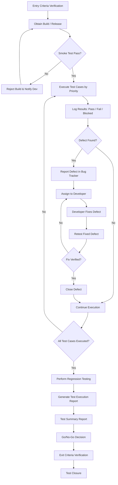

# Part 11: Test Execution & Reporting

---

## 11.1 Introduction to Test Execution

### What Is Test Execution?

**Test Execution** is the phase in the Software Testing Life Cycle (STLC) where the QA team actually runs the prepared test cases against the application under test (AUT), compares the actual results with expected results, and logs outcomes as Pass, Fail, Blocked, or Not Executed. It is the most visible and operationally intensive phase of testing — the point where all planning, design, and preparation converge into tangible quality feedback.

Test execution is not simply "running tests." It is a disciplined, methodical process that involves:

- **Verifying prerequisites** — environment readiness, test data availability, build stability
- **Executing test cases** — following documented steps precisely while also applying tester judgment
- **Observing and documenting results** — comparing actual behavior against expected behavior
- **Reporting defects** — logging any deviations with sufficient detail for developers to reproduce and fix
- **Tracking progress** — maintaining real-time visibility into testing status for all stakeholders
- **Making decisions** — providing data to support release Go/No-Go decisions

> [!IMPORTANT]
> Test execution is not a one-time activity. It occurs in multiple cycles — an initial execution cycle, followed by regression cycles, fix-verification cycles, and sometimes additional ad-hoc or exploratory sessions. Each cycle yields updated metrics that inform the overall quality assessment.

### Prerequisites for Test Execution

Before any test case is executed, the following prerequisites **must** be satisfied. Skipping these is a common root cause of wasted effort, false results, and inaccurate reporting.

| # | Prerequisite | Description | Who is Responsible |
|---|-------------|-------------|-------------------|
| 1 | **Test Plan Approved** | The Test Plan document must be reviewed and signed off by the QA Lead, Project Manager, and key stakeholders. | QA Lead / PM |
| 2 | **Test Cases Reviewed** | All test cases must be peer-reviewed for clarity, completeness, and traceability to requirements. | QA Team / QA Lead |
| 3 | **Test Data Prepared** | Test data for all test cases must be created and verified. This includes valid data, invalid data, boundary values, and edge cases. | QA Team |
| 4 | **Test Environment Ready** | The test environment must mirror production as closely as possible. All servers, databases, third-party integrations, and configurations must be set up. | DevOps / Environment Team |
| 5 | **Build Deployed to Test Environment** | A stable build must be deployed. The build must pass smoke testing before full test execution begins. | Development / DevOps |
| 6 | **Entry Criteria Met** | All entry criteria defined in the Test Plan must be verified (e.g., unit testing complete, build available, environment stable). | QA Lead |
| 7 | **Test Management Tool Configured** | The test management tool (e.g., Jira + Zephyr, TestRail, Azure DevOps) must be set up with test suites, test cycles, and assignments. | QA Lead |
| 8 | **Defect Tracking Tool Ready** | The defect tracking system must be configured with workflows, severity/priority definitions, and assignment rules. | QA Lead / PM |
| 9 | **Access Credentials Available** | All test accounts, roles, and permissions must be pre-created in the test environment. | QA Team / Admin |
| 10 | **Communication Channels Established** | Slack channels, email distribution lists, and escalation contacts must be defined. | QA Lead / PM |

> [!TIP]
> Create a **Test Execution Readiness Checklist** — a simple Google Sheet or Confluence page — and have the QA Lead verify each item before announcing "Execution Start." This simple practice prevents 80% of false starts.

### Test Execution Workflow



### Test Execution Best Practices

1. **Never skip smoke testing.** If the build fails smoke tests, reject it immediately. Running full test execution on an unstable build wastes time and generates misleading metrics.

2. **Execute high-priority test cases first.** Focus on critical business workflows (e.g., user registration, payment processing, order placement) before edge cases.

3. **Follow the test case steps exactly as written.** Do not deviate unless you document the deviation. Consistency is essential for reproducible results.

4. **Report defects immediately upon discovery.** Do not batch defects until the end of the day. Immediate reporting gives developers more time to fix issues within the same cycle.

5. **Capture evidence for every failure.** Screenshots, videos, log files, and network traces are non-negotiable. A defect without evidence is a defect that cannot be debugged.

6. **Communicate blockers within 30 minutes.** If you are blocked by an environment issue, missing test data, or a critical defect, escalate immediately via the team's agreed-upon channel.

7. **Update test case status in real time.** Status should reflect reality at all times. Stakeholders rely on dashboards for decision-making.

8. **Maintain a testing log or journal.** Note observations, questions, and areas that warrant exploratory investigation — even if they are not covered by existing test cases.

9. **Separate test execution from defect investigation.** Execute first, log the defect, and move on. Deep investigation of root causes should not block the execution of remaining test cases.

10. **Conduct daily stand-ups during execution.** A 15-minute daily sync among QA team members helps distribute work, share blockers, and maintain momentum.

---

## 11.2 Test Execution Process

### Step-by-Step Execution Process

The following ten-step process represents the complete test execution lifecycle from build receipt to report generation. Each step is described in detail with practical guidance.

---

#### Step 1: Verify Test Environment Readiness

Before executing any test case, confirm the following:

| Check Item | Verification Method | Status |
|------------|-------------------|--------|
| Application URL accessible | Open in browser, verify login page loads | ✅ / ❌ |
| Database connectivity | Run a simple query or verify via admin panel | ✅ / ❌ |
| Third-party integrations active | Test a payment gateway sandbox, SMS API, etc. | ✅ / ❌ |
| Test data loaded | Verify key records exist (users, products, orders) | ✅ / ❌ |
| Correct build/version deployed | Verify version number on login page or via API | ✅ / ❌ |
| Test accounts functional | Login with each test account (admin, customer, vendor) | ✅ / ❌ |
| Browser/device matrix ready | Confirm browsers and devices per test plan | ✅ / ❌ |
| VPN/network access verified | Confirm access if test environment requires VPN | ✅ / ❌ |

**Real-World Example:** For an e-commerce application, before starting execution you would verify:
- The staging URL `https://staging.shopexample.com` loads correctly
- Product catalog has at least 50 products across 5 categories
- Payment sandbox (Stripe test mode) is enabled
- Test user accounts exist for Customer, Admin, and Vendor roles
- Email notification service (SendGrid sandbox) is connected

---

#### Step 2: Obtain the Build/Release

- **Receive the build notification** from the development team (typically via email, Slack, or CI/CD pipeline notification)
- **Verify the build number** matches what was committed for testing
- **Check the release notes** for new features, bug fixes, and known issues
- **Confirm deployment** to the correct test environment

**Build Acceptance Checklist:**

```
Build Information:
  Build Number:    v3.2.1-RC1
  Build Date:      2025-11-15
  Deployed To:     Staging Environment
  Deployed By:     Jenkins Pipeline (Job #487)
  Release Notes:   [Link to Confluence page]
  
Unit Test Results:
  Total:           2,847
  Passed:          2,831
  Failed:          16 (all low-priority, documented)
  
Code Coverage:     78.4%
Static Analysis:   0 Critical, 3 Major, 12 Minor issues
```

---

#### Step 3: Perform Smoke Testing

Smoke testing (also called **Build Verification Testing** or **Sanity Check**) validates that the critical functionalities of the application work. If smoke testing fails, the build is rejected.

**Smoke Test Suite Example — E-Commerce Application:**

| # | Smoke Test Case | Expected Result | Actual Result | Status |
|---|----------------|-----------------|---------------|--------|
| 1 | Application Login | User can login with valid credentials | Login successful | ✅ Pass |
| 2 | Homepage Load | Homepage loads with product categories | Loads correctly | ✅ Pass |
| 3 | Product Search | Search returns relevant results | Results displayed | ✅ Pass |
| 4 | Add to Cart | Product can be added to cart | Added successfully | ✅ Pass |
| 5 | Checkout Initiation | Checkout page loads with cart items | Page loads | ✅ Pass |
| 6 | Payment Processing | Test payment completes in sandbox | Payment processed | ✅ Pass |
| 7 | Order Confirmation | Order confirmation page and email | Both received | ✅ Pass |
| 8 | Admin Dashboard | Admin can access dashboard | Dashboard accessible | ✅ Pass |
| 9 | Report Generation | Sample report generates | Report downloaded | ✅ Pass |
| 10 | Logout | User can logout successfully | Logged out | ✅ Pass |

> [!WARNING]
> If **any** smoke test fails, **stop execution immediately**, reject the build, and notify the development team. Document the failure clearly and include steps to reproduce. Do not proceed with full execution on an unstable build.

---

#### Step 4: Execute Test Cases in Priority Order

Once the build passes smoke testing, begin executing test cases in the following priority order:

1. **Priority 1 (Critical):** Core business flows — login, registration, payment, order processing
2. **Priority 2 (High):** Important features — search, filtering, user profile management, notifications
3. **Priority 3 (Medium):** Supporting features — settings, preferences, help pages, secondary workflows
4. **Priority 4 (Low):** Edge cases, cosmetic issues, rarely used features

**Execution Approach:**

| Approach | Description | When to Use |
|----------|------------|-------------|
| **Module-wise** | Execute all test cases for one module before moving to the next | When modules are independent |
| **Priority-wise** | Execute all P1 cases across all modules first, then P2, etc. | When time is constrained |
| **Risk-based** | Execute test cases for highest-risk modules first | When risk assessment is available |
| **Requirements-based** | Execute test cases mapped to specific requirements | When traceability is critical |

---

#### Step 5: Log Test Results

For each executed test case, record:

- **Test Case ID:** e.g., TC-CART-042
- **Execution Date:** Date and time of execution
- **Executed By:** Tester name
- **Build/Version:** Build number against which the test was executed
- **Environment:** Browser, OS, device details
- **Status:** Pass, Fail, Blocked, Not Executed, or Skipped
- **Actual Result:** Detailed description of what actually happened
- **Evidence:** Screenshots, video recordings, log files
- **Comments:** Additional observations or notes

**Result Status Definitions:**

| Status | Definition | Action Required |
|--------|-----------|----------------|
| **Pass** | Actual result matches expected result | None — move to next test case |
| **Fail** | Actual result does NOT match expected result | Log a defect immediately |
| **Blocked** | Test case cannot be executed due to a blocker | Document the blocker, assign to responsible party |
| **Not Executed** | Test case was not run in this cycle | Carry forward to next cycle |
| **Skipped** | Intentionally skipped (out of scope, duplicate, or deprioritized) | Document reason for skipping |

---

#### Step 6: Report Defects

When a test case fails, log a defect with the following information:

```
DEFECT REPORT
─────────────────────────────────────────
Defect ID:        BUG-2547
Title:            Checkout fails with "500 Internal Server Error" when 
                  applying 100% discount coupon
Reported By:      Priya Sharma
Reported Date:    2025-11-16
Module:           Checkout / Payments
Build Version:    v3.2.1-RC1
Environment:      Chrome 120, Windows 11, Staging
Severity:         Critical
Priority:         P1 - Immediate
Status:           New

STEPS TO REPRODUCE:
1. Login as customer (test_customer@example.com / Test@123)
2. Add any product to cart (e.g., "Wireless Headphones" SKU: WH-001)
3. Navigate to Checkout page
4. Enter coupon code "WELCOME100" (100% discount coupon)
5. Click "Apply Coupon"
6. Click "Place Order"

EXPECTED RESULT:
Order should be placed successfully with $0.00 total,
and order confirmation page should display.

ACTUAL RESULT:
Application displays "500 Internal Server Error" page.
No order is created. Browser console shows:
"Uncaught TypeError: Cannot read properties of null 
(reading 'chargeAmount')"

ATTACHMENTS:
- Screenshot: checkout_500_error.png
- Console Logs: browser_console_log.txt
- Network Trace: network_trace.har

ROOT CAUSE (If Known):
Possible null pointer exception when payment amount is $0.00
after applying 100% discount.
─────────────────────────────────────────
```

---

#### Step 7: Retest Fixed Defects

When a developer marks a defect as "Fixed" or "Ready for Retest":

1. **Verify the fix** by executing the exact steps from the original defect report
2. **Test boundary conditions** related to the fix
3. **Perform sanity testing** on adjacent functionality to ensure no regression
4. **Update the defect status** — either "Closed" (verified) or "Reopened" (not fixed or partially fixed)

> [!TIP]
> When retesting, also check related scenarios. For example, if the fix was for "100% discount coupon causes error," also test with 50% discount, expired coupons, and invalid coupon codes to ensure the fix didn't break related logic.

---

#### Step 8: Perform Regression Testing

After all defect fixes are verified, execute the regression test suite to confirm that:

- Fixed defects have not introduced new issues
- Unchanged functionality still works correctly
- Integration points remain stable

**Regression Testing Strategy:**

| Strategy | Description | Coverage | Effort |
|----------|------------|----------|--------|
| **Retest All** | Run the entire test suite | 100% | Very High |
| **Selective Regression** | Run tests related to changed/fixed areas | 40-60% | Medium |
| **Priority-based** | Run only P1 and P2 test cases | 20-30% | Low |
| **Risk-based** | Run tests for high-risk modules | Variable | Medium |

---

#### Step 9: Update Test Case Status

After all execution cycles are complete, update the status of every test case in the test management tool. The final status should reflect the outcome of the **last execution cycle**.

**Test Execution Tracker Example:**

| Test Case ID | Test Case Description | Cycle 1 | Cycle 2 | Cycle 3 (Final) |
|-------------|----------------------|---------|---------|-----------------|
| TC-LOGIN-001 | Valid login | Pass | Pass | Pass |
| TC-LOGIN-002 | Invalid password | Pass | Pass | Pass |
| TC-CART-042 | Add to cart with variants | Fail | Fail | Pass |
| TC-PAY-015 | Payment with 100% coupon | Fail | Blocked | Pass |
| TC-ORD-033 | Order cancellation | Pass | Pass | Pass |
| TC-RPT-007 | Sales report export | Blocked | Pass | Pass |

---

#### Step 10: Generate Test Execution Reports

At the end of each execution cycle and at the conclusion of overall testing, generate the following reports:

- **Daily Status Report** — sent every day during execution
- **Weekly Status Report** — sent at end of each week
- **Cycle-End Report** — sent at the end of each test execution cycle
- **Test Summary Report** — sent at the conclusion of all testing activities

---

### Test Execution Guidelines

#### How to Execute Test Cases Effectively

1. **Read the entire test case before starting execution.** Understand the preconditions, test data requirements, and expected results before performing any steps.

2. **Execute one test case at a time.** Do not attempt to execute multiple test cases in parallel unless they are truly independent.

3. **Record actual results as they occur.** Do not rely on memory — write down what happened immediately.

4. **Take screenshots at critical decision points.** Even for passing test cases, maintain a record of key screens (especially for audit-sensitive applications).

5. **Reset the application to a clean state between test cases** if the test case preconditions require it.

#### Handling Blocked Test Cases

A test case is **Blocked** when it cannot be executed due to an external dependency. Common causes and resolutions:

| Blocker Type | Example | Resolution |
|-------------|---------|------------|
| **Environment Issue** | Database server is down | Notify DevOps, escalate if not resolved in 2 hours |
| **Missing Test Data** | Required customer account not created | Create the data or request from DBA |
| **Dependent Defect** | Login bug prevents access to checkout | Mark test as Blocked, link to defect ID |
| **Missing Feature** | Feature not yet developed | Mark as Not Executable, remove from current cycle |
| **Access Issue** | No permissions for admin panel | Request access from project admin |

> [!NOTE]
> Blocked test cases should be tracked separately and reviewed daily. The QA Lead must follow up on blockers and ensure they are resolved before the end of the execution cycle. Persistently blocked test cases inflate the "Not Executed" count and can delay the release decision.

#### Handling Test Environment Issues

| Issue | Impact | Immediate Action | Escalation Path |
|-------|--------|-----------------|-----------------|
| Environment crash | All testing stopped | Notify DevOps team | QA Lead → DevOps Manager → PM |
| Slow performance | Testing delayed | Document specific response times | QA Lead → DevOps |
| Data corruption | Test results unreliable | Stop testing, request data restore | QA Lead → DBA → PM |
| Integration failure | Module-level blocking | Test independently, mock services | QA Lead → Dev Lead |
| Configuration mismatch | False failures | Verify config vs production specs | QA Lead → DevOps |

#### Communication During Execution

Effective communication during test execution includes:

- **Daily Stand-ups (15 min):** What I tested yesterday, what I'm testing today, blockers
- **Instant Messaging (Slack/Teams):** Real-time blocker notifications, quick questions
- **Email:** Daily status reports, build rejection notifications, formal escalations
- **Bug Tracker Comments:** Technical discussions on specific defects
- **Status Dashboard:** Real-time test execution progress visible to all stakeholders

#### Build Acceptance Criteria

A build should be accepted for testing only when:

1. ✅ Unit testing is complete with >80% pass rate
2. ✅ Build compiles without errors
3. ✅ Build is deployed to the correct test environment
4. ✅ Previous critical/blocker defects are fixed (if applicable)
5. ✅ Release notes are available documenting changes
6. ✅ Smoke test suite passes (executed by Dev or CI pipeline)
7. ✅ No known critical defects marked as "Will Not Fix" without QA Lead approval

---

## 11.3 Test Status Reporting

### What Is Test Status Reporting?

**Test Status Reporting** is the continuous communication of testing progress, results, and quality metrics to stakeholders throughout the test execution phase. It provides transparency into what has been tested, what remains, the current defect situation, and any risks or blockers that may impact the release timeline.

Effective status reporting serves multiple purposes:

- Keeps stakeholders informed about quality without requiring them to dig into test management tools
- Provides data for decision-making (e.g., "Do we need to extend testing by one more day?")
- Creates a documented trail of testing progress for audit and compliance
- Helps the QA Lead manage workload distribution and identify bottlenecks
- Builds trust between QA, Development, and Management

### Types of Test Reports

| Report Type | Frequency | Audience | Purpose |
|------------|-----------|----------|---------|
| **Daily Status Report** | Every day during execution | QA Lead, Dev Lead, PM | Track daily progress and blockers |
| **Weekly Status Report** | End of each week | PM, Product Owner, Management | Summarize weekly progress and trends |
| **Sprint Test Report** | End of each sprint | Scrum Team, Product Owner | Sprint-level test summary |
| **Release Test Report** | End of testing cycle | All stakeholders, Release Manager | Final quality assessment for release |

---

### Daily Status Report Template

Below is a **complete, filled-out example** of a Daily Status Report for an e-commerce application testing project:

---

```
╔══════════════════════════════════════════════════════════════╗
║              DAILY TEST STATUS REPORT                        ║
╠══════════════════════════════════════════════════════════════╣
║ Project:        ShopEasy E-Commerce Platform v3.2.1          ║
║ Date:           November 16, 2025                            ║
║ Prepared By:    Priya Sharma, QA Lead                        ║
║ Sprint:         Sprint 22                                    ║
║ Build Version:  v3.2.1-RC1                                   ║
║ Environment:    Staging (staging.shopeasay.com)               ║
╚══════════════════════════════════════════════════════════════╝
```

**1. Test Execution Summary**

| Metric | Count | Percentage |
|--------|-------|------------|
| Total Test Cases (In Scope) | 485 | 100% |
| Executed Today | 72 | 14.8% |
| Cumulative Executed | 247 | 50.9% |
| Passed | 218 | 88.3% of executed |
| Failed | 19 | 7.7% of executed |
| Blocked | 7 | 2.8% of executed |
| Not Executed | 238 | 49.1% |
| Skipped | 3 | 0.6% |

**2. Module-Wise Execution Progress**

| Module | Total TCs | Executed | Passed | Failed | Blocked | Progress |
|--------|----------|----------|--------|--------|---------|----------|
| User Registration | 35 | 35 | 33 | 2 | 0 | 100% ✅ |
| Login / Authentication | 42 | 42 | 40 | 1 | 1 | 100% ✅ |
| Product Catalog | 58 | 50 | 46 | 3 | 1 | 86% 🔄 |
| Shopping Cart | 45 | 38 | 34 | 2 | 2 | 84% 🔄 |
| Checkout & Payment | 65 | 42 | 30 | 8 | 4 | 65% 🔄 |
| Order Management | 55 | 22 | 19 | 2 | 1 | 40% 🔄 |
| Search & Filters | 40 | 18 | 16 | 1 | 1 | 45% 🔄 |
| User Profile | 30 | 0 | 0 | 0 | 0 | 0% ⏳ |
| Admin Dashboard | 50 | 0 | 0 | 0 | 0 | 0% ⏳ |
| Reports & Analytics | 35 | 0 | 0 | 0 | 0 | 0% ⏳ |
| Notifications | 30 | 0 | 0 | 0 | 0 | 0% ⏳ |

**3. Defects Summary — Today**

| Metric | Count |
|--------|-------|
| Defects Found Today | 6 |
| Critical | 1 |
| Major | 3 |
| Minor | 2 |
| Defects Resolved Today | 4 |
| Defects Reopened Today | 1 |
| Total Open Defects | 23 |
| Total Closed Defects | 14 |

**4. New Defects Logged Today**

| Defect ID | Title | Severity | Module | Assigned To |
|-----------|-------|----------|--------|-------------|
| BUG-2547 | Checkout fails with 500 error for 100% discount coupon | Critical | Checkout | Rahul K. |
| BUG-2548 | Cart total doesn't update when quantity is changed from 1 to 10+ | Major | Shopping Cart | Ankit M. |
| BUG-2549 | Product image zoom not working on Safari 17 | Major | Product Catalog | Sneha R. |
| BUG-2550 | Order confirmation email has wrong order total | Major | Order Management | Rahul K. |
| BUG-2551 | Search results page shows 404 for queries with special characters | Minor | Search | Ankit M. |
| BUG-2552 | Misaligned "Add to Cart" button on mobile viewport (375px) | Minor | Product Catalog | Sneha R. |

**5. Blockers and Issues**

| # | Blocker Description | Impact | Owner | Status |
|---|-------------------|--------|-------|--------|
| 1 | Payment gateway sandbox (Stripe) intermittently returning timeout errors | Cannot execute 12 payment test cases | DevOps (Vikram) | In Progress |
| 2 | Test data for multi-currency orders not yet created | Blocks 8 international order test cases | DBA (Amit) | Pending |
| 3 | BUG-2547 (Critical) blocks all coupon-related checkout test cases | Blocks 6 test cases | Dev (Rahul) | Under investigation |

**6. Plan for Tomorrow (November 17, 2025)**

- Complete execution of Product Catalog module (remaining 8 TCs)
- Complete execution of Shopping Cart module (remaining 7 TCs)
- Continue Checkout & Payment module execution (target 15 more TCs)
- Begin Order Management module execution
- Retest defects BUG-2540, BUG-2541, BUG-2543 (marked as Fixed)
- Follow up on Stripe sandbox timeout issue

**7. Risks**

- If Stripe sandbox timeout is not resolved by EOD tomorrow, payment testing will be delayed by 1-2 days
- High defect density in Checkout module may require additional regression cycle

---

### Weekly Status Report Template

---

```
╔══════════════════════════════════════════════════════════════╗
║              WEEKLY TEST STATUS REPORT                       ║
╠══════════════════════════════════════════════════════════════╣
║ Project:        ShopEasy E-Commerce Platform v3.2.1          ║
║ Week:           November 11 – November 15, 2025 (Week 46)   ║
║ Prepared By:    Priya Sharma, QA Lead                        ║
║ Sprint:         Sprint 22                                    ║
╚══════════════════════════════════════════════════════════════╝
```

**1. Executive Summary**

Testing for Sprint 22 commenced on November 11 with build v3.2.1-RC1. Smoke testing passed on Day 1. As of end of Week 46, **50.9% of test cases have been executed** with an **88.3% pass rate**. The Checkout & Payment module has the highest defect density (8 failures) and requires developer attention. One critical defect (BUG-2547) is currently blocking 6 test cases. Overall, testing is tracking slightly behind schedule (planned: 55% complete by end of Week 46), primarily due to Stripe sandbox intermittent timeouts.

**2. Weekly Execution Summary**

| Metric | Week Start | Week End | Delta |
|--------|-----------|---------|-------|
| Total Test Cases | 485 | 485 | 0 |
| Executed (Cumulative) | 0 | 247 | +247 |
| Passed | 0 | 218 | +218 |
| Failed | 0 | 19 | +19 |
| Blocked | 0 | 7 | +7 |
| Remaining | 485 | 238 | -247 |

**3. Defect Summary (Weekly)**

| Metric | Count |
|--------|-------|
| Defects Opened This Week | 37 |
| Defects Closed This Week | 14 |
| Defects Reopened This Week | 3 |
| Open Defects (End of Week) | 23 |

**Defects by Severity:**

| Severity | Opened | Closed | Open |
|----------|--------|--------|------|
| Critical | 3 | 2 | 1 |
| Major | 12 | 5 | 7 |
| Minor | 15 | 5 | 10 |
| Trivial | 7 | 2 | 5 |

**4. Key Achievements This Week**

- ✅ Smoke testing completed successfully (Day 1)
- ✅ User Registration module — 100% executed
- ✅ Login/Authentication module — 100% executed
- ✅ 14 defects resolved and verified

**5. Key Risks and Concerns**

| Risk | Likelihood | Impact | Mitigation |
|------|-----------|--------|------------|
| Stripe sandbox instability | High | Delays payment testing by 1-2 days | DevOps working with Stripe support |
| High defect count in Checkout module | Medium | May require extra regression cycle | Prioritized developer attention |
| Testing behind schedule by ~4% | Medium | Could delay release by 1 day | Plan to work Saturday if needed |

**6. Plan for Next Week (Week 47)**

- Complete execution of all remaining test cases (238 TCs)
- Retest all fixed defects
- Begin regression testing cycle
- Generate Test Summary Report by end of week (if all testing complete)

---

## 11.4 Test Summary Report

### What Is a Test Summary Report?

A **Test Summary Report (TSR)** is a formal document that consolidates all testing activities, results, and metrics at the conclusion of a testing phase or project. It is the definitive quality document that stakeholders use to make the Go/No-Go decision for release.

The TSR answers the fundamental question: **"Is this software ready for release?"**

### When to Create It

- At the end of each major testing phase (System Testing, UAT)
- At the conclusion of a release testing cycle
- Before a Go/No-Go meeting
- When exit criteria have been met (or when a decision is needed despite unmet criteria)

### IEEE 829 Test Summary Report Format

The IEEE 829 standard provides a widely adopted structure for Test Summary Reports. While many organizations customize this format, the core sections remain consistent.

---

### Complete Test Summary Report — Filled Example

---

## TEST SUMMARY REPORT

### ShopEasy E-Commerce Platform — Release v3.2.1

---

**Document Control**

| Field | Details |
|-------|---------|
| Document Title | Test Summary Report — ShopEasy v3.2.1 |
| Document ID | TSR-SHOP-v3.2.1-2025 |
| Version | 1.0 |
| Prepared By | Priya Sharma, QA Lead |
| Reviewed By | Vikram Patel, Project Manager |
| Approved By | Sunita Menon, Director of Engineering |
| Date | November 22, 2025 |
| Classification | Internal — Confidential |

---

### 1. Summary Information

| Item | Details |
|------|---------|
| **Project Name** | ShopEasy E-Commerce Platform |
| **Release Version** | v3.2.1 |
| **Test Start Date** | November 11, 2025 |
| **Test End Date** | November 21, 2025 |
| **Testing Duration** | 9 business days (11 calendar days) |
| **Testing Phases** | System Testing, Integration Testing, Regression Testing |
| **Test Environment** | Staging (staging.shopeasy.com) |
| **Test Team Size** | 5 testers (3 Senior, 2 Junior) |
| **Tools Used** | Jira + Zephyr Squad, Postman, BrowserStack, Charles Proxy |
| **Builds Tested** | v3.2.1-RC1 (Nov 11), v3.2.1-RC2 (Nov 15), v3.2.1-RC3 (Nov 18) |

**Key Features Tested in v3.2.1:**
- New multi-currency checkout support (USD, EUR, GBP, INR)
- Redesigned product detail page
- Enhanced search with auto-suggestions
- Improved admin reporting dashboard
- Bug fixes from v3.2.0 (47 defect fixes)

---

### 2. Test Scope

**In Scope:**

| Module | Description |
|--------|------------|
| User Registration & Login | Registration flow, social login, 2FA, password recovery |
| Product Catalog | Product listing, detail page, image gallery, reviews |
| Search & Filters | Text search, auto-suggestions, category/price/brand filters |
| Shopping Cart | Add/remove items, quantity updates, cart persistence |
| Checkout & Payment | Multi-currency, coupon codes, Stripe/PayPal integration |
| Order Management | Order placement, tracking, cancellation, returns |
| User Profile | Profile editing, address book, order history |
| Admin Dashboard | Product management, user management, analytics |
| Reports & Analytics | Sales reports, inventory reports, customer reports |
| Notifications | Email, SMS, push notifications |
| Cross-browser | Chrome 120, Firefox 121, Safari 17, Edge 120 |
| Responsive Design | Desktop (1920px), Tablet (768px), Mobile (375px) |

**Out of Scope:**

| Item | Reason |
|------|--------|
| Performance/Load testing | Separate performance testing cycle planned for v3.3 |
| Penetration testing | Third-party security audit scheduled independently |
| Accessibility testing | Planned for Q1 2026 compliance initiative |
| Native mobile app testing | Mobile app v2.0 testing tracked separately |

---

### 3. Test Execution Summary

**Overall Execution Statistics:**

| Metric | Count | Percentage |
|--------|-------|------------|
| Total Test Cases | 485 | 100% |
| Executed | 479 | 98.8% |
| Passed | 456 | 95.2% of executed |
| Failed (Open) | 5 | 1.0% of executed |
| Failed (Closed/Deferred) | 14 | 2.9% of executed |
| Blocked | 4 | 0.8% of executed |
| Not Executed | 6 | 1.2% |

**Execution by Build:**

| Build | Test Cases Executed | Passed | Failed | Pass Rate |
|-------|-------------------|--------|--------|-----------|
| RC1 (Nov 11-14) | 485 | 425 | 42 | 87.6% |
| RC2 (Nov 15-17) | 187 (regression) | 168 | 14 | 89.8% |
| RC3 (Nov 18-21) | 142 (regression) | 137 | 5 | 96.5% |

**Execution by Module:**

| Module | Total | Executed | Passed | Failed | Blocked | Pass % |
|--------|-------|----------|--------|--------|---------|--------|
| User Registration | 35 | 35 | 35 | 0 | 0 | 100% |
| Login/Authentication | 42 | 42 | 41 | 1 | 0 | 97.6% |
| Product Catalog | 58 | 58 | 57 | 0 | 1 | 98.3% |
| Shopping Cart | 45 | 45 | 44 | 1 | 0 | 97.8% |
| Checkout & Payment | 65 | 63 | 58 | 3 | 2 | 92.1% |
| Order Management | 55 | 55 | 53 | 1 | 1 | 96.4% |
| Search & Filters | 40 | 40 | 39 | 0 | 1 | 97.5% |
| User Profile | 30 | 30 | 30 | 0 | 0 | 100% |
| Admin Dashboard | 50 | 48 | 46 | 2 | 0 | 95.8% |
| Reports & Analytics | 35 | 33 | 24 | 7 | 2 | 72.7% |
| Notifications | 30 | 30 | 29 | 0 | 1 | 96.7% |

> [!NOTE]
> The **Reports & Analytics** module has the lowest pass rate (72.7%) due to issues with the new admin reporting dashboard. All 7 failing test cases are Minor severity related to report formatting and are being deferred to v3.2.2 as they do not impact business functionality.

---

### 4. Defect Summary

**Overall Defect Statistics:**

| Metric | Count |
|--------|-------|
| Total Defects Found | 61 |
| Defects Closed (Fixed & Verified) | 42 |
| Defects Deferred to v3.2.2 | 12 |
| Defects Open (Under Investigation) | 5 |
| Defects Rejected (Invalid/Duplicate) | 2 |

**Defects by Severity:**

| Severity | Found | Closed | Deferred | Open | Rejected |
|----------|-------|--------|----------|------|----------|
| Critical | 5 | 5 | 0 | 0 | 0 |
| Major | 18 | 16 | 1 | 1 | 0 |
| Minor | 27 | 14 | 9 | 3 | 1 |
| Trivial | 11 | 7 | 2 | 1 | 1 |
| **Total** | **61** | **42** | **12** | **5** | **2** |

**Defects by Status:**

| Status | Count | Percentage |
|--------|-------|------------|
| Closed | 42 | 68.9% |
| Deferred | 12 | 19.7% |
| Open — In Progress | 3 | 4.9% |
| Open — Under Review | 2 | 3.3% |
| Rejected | 2 | 3.3% |

**Defects by Module:**

| Module | Critical | Major | Minor | Trivial | Total |
|--------|----------|-------|-------|---------|-------|
| User Registration | 0 | 1 | 2 | 1 | 4 |
| Login/Authentication | 1 | 2 | 1 | 0 | 4 |
| Product Catalog | 0 | 2 | 3 | 2 | 7 |
| Shopping Cart | 1 | 2 | 2 | 1 | 6 |
| Checkout & Payment | 2 | 5 | 4 | 1 | 12 |
| Order Management | 0 | 3 | 2 | 1 | 6 |
| Search & Filters | 0 | 1 | 3 | 1 | 5 |
| User Profile | 0 | 0 | 1 | 1 | 2 |
| Admin Dashboard | 1 | 1 | 3 | 1 | 6 |
| Reports & Analytics | 0 | 1 | 5 | 1 | 7 |
| Notifications | 0 | 0 | 1 | 1 | 2 |

**Defect Trends (by Build):**

| Build | New Defects | Defects Fixed | Reopened | Cumulative Open |
|-------|-------------|---------------|----------|-----------------|
| RC1 | 42 | 0 | 0 | 42 |
| RC2 | 12 | 30 | 3 | 27 |
| RC3 | 7 | 15 | 2 | 19 |
| Post-RC3 | 0 | 2 | 0 | 17 |

---

### 5. Test Coverage

**Requirements Coverage:**

| Category | Total Requirements | Covered by TCs | Executed | Not Covered |
|----------|-------------------|----------------|----------|-------------|
| Functional | 78 | 76 (97.4%) | 75 (96.2%) | 2 |
| Non-Functional | 15 | 10 (66.7%) | 8 (53.3%) | 5 |
| Business Rules | 42 | 42 (100%) | 42 (100%) | 0 |
| Integration | 18 | 16 (88.9%) | 15 (83.3%) | 2 |
| **Total** | **153** | **144 (94.1%)** | **140 (91.5%)** | **9** |

> [!IMPORTANT]
> 9 requirements are not covered by test cases. Of these, 5 are non-functional requirements (performance, security) that are planned for separate testing phases, and 4 are related to features deferred to v3.3.

---

### 6. Risks and Issues

**Open Risks:**

| # | Risk Description | Likelihood | Impact | Mitigation |
|---|-----------------|-----------|--------|------------|
| R1 | 5 open defects may be discovered in production | Medium | Medium | Monitoring plan in place; hotfix process ready |
| R2 | 12 deferred defects affect user experience | Low | Low | All are Minor/Trivial; scheduled for v3.2.2 |
| R3 | Report formatting issues may cause customer complaints | Medium | Low | Known issue documented in release notes |
| R4 | Multi-currency rounding errors under edge conditions | Low | Medium | Additional monitoring for non-USD transactions |

**Unresolved Issues:**

| # | Issue | Status | Owner | Planned Resolution |
|---|-------|--------|-------|--------------------|
| 1 | Admin report PDF export truncates long product names | Open | Dev Team | v3.2.2 |
| 2 | Cart occasionally shows stale price after admin price update | Open | Dev Team | v3.2.2 |
| 3 | Search auto-suggest doesn't work in Firefox incognito mode | Under Review | Dev Team | v3.2.2 |

---

### 7. Recommendations

**Release Recommendation: CONDITIONAL GO ✅**

The QA team recommends proceeding with the release of ShopEasy v3.2.1 with the following conditions:

1. **All 5 Critical defects are fixed and verified** ✅ (Done)
2. **All Major defects are either fixed or explicitly deferred** ✅ (Done — 1 Major deferred with PM approval)
3. **The 5 remaining open defects (4 Minor, 1 Trivial) are documented in release notes** ✅ (Done)
4. **Enhanced monitoring for multi-currency transactions** is enabled for the first 48 hours post-release
5. **Hotfix branch** is prepared and ready for rapid deployment if production issues arise
6. **Customer support team** is briefed on known issues and workarounds

**Release Readiness Score: 8.2 / 10**

---

### 8. Lessons Learned

| # | Lesson | Action Item | Owner |
|---|--------|------------|-------|
| 1 | Stripe sandbox instability caused 2-day delay | Set up a local mock payment service for future testing | DevOps |
| 2 | Multi-currency test data was not prepared in advance | Add currency test data to standard data setup scripts | QA Lead |
| 3 | Report module had the highest defect density — late-developed feature | Advocate for earlier code freeze for complex features | PM / QA Lead |
| 4 | Three defects were reopened — fix quality could improve | Implement developer unit test requirement for every bug fix | Dev Lead |
| 5 | Daily standups were very effective for blocker resolution | Continue practice in all future sprints | QA Lead |

---

### 9. Approval / Sign-Off

| Role | Name | Signature | Date |
|------|------|-----------|------|
| QA Lead | Priya Sharma | _Signed_ | Nov 22, 2025 |
| Development Lead | Rahul Kumar | _Signed_ | Nov 22, 2025 |
| Project Manager | Vikram Patel | _Signed_ | Nov 22, 2025 |
| Product Owner | Neha Gupta | _Signed_ | Nov 22, 2025 |
| Director of Engineering | Sunita Menon | _Pending_ | — |

---

## 11.5 Test Metrics and KPIs

Test metrics are quantitative measures used to evaluate the progress, quality, and effectiveness of testing activities. They transform subjective assessments ("I think testing is going well") into objective, data-driven insights ("We have achieved 95.2% pass rate with a defect density of 0.79 defects per function point").

### Process Metrics

---

#### Test Case Execution Rate

**Formula:**

```
Test Case Execution Rate = (Number of Test Cases Executed / Total Number of Test Cases) × 100
```

**Example:**

```
Total Test Cases:    485
Executed:            247

Execution Rate = (247 / 485) × 100 = 50.9%
```

**Interpretation:**
- **>90%:** On track for completion
- **70-90%:** May need additional resources or time
- **<70%:** Significant risk of not completing testing on schedule

**Daily Tracking Example:**

| Day | Executed Today | Cumulative | Rate |
|-----|---------------|------------|------|
| Day 1 | 35 | 35 | 7.2% |
| Day 2 | 48 | 83 | 17.1% |
| Day 3 | 52 | 135 | 27.8% |
| Day 4 | 40 | 175 | 36.1% |
| Day 5 | 72 | 247 | 50.9% |

---

#### Test Case Pass Rate

**Formula:**

```
Test Case Pass Rate = (Number of Test Cases Passed / Number of Test Cases Executed) × 100
```

**Example:**

```
Executed:    479
Passed:      456

Pass Rate = (456 / 479) × 100 = 95.2%
```

**Interpretation:**
- **>95%:** Excellent quality, likely ready for release
- **90-95%:** Good quality, review failures for severity
- **80-90%:** Moderate quality, may need additional fixes
- **<80%:** Poor quality, build likely needs significant rework

---

#### Test Case Fail Rate

**Formula:**

```
Test Case Fail Rate = (Number of Test Cases Failed / Number of Test Cases Executed) × 100
```

**Example:**

```
Executed:    479
Failed:      19

Fail Rate = (19 / 479) × 100 = 3.97%
```

---

#### Test Case Blocked Rate

**Formula:**

```
Test Case Blocked Rate = (Number of Test Cases Blocked / Total Number of Test Cases) × 100
```

**Example:**

```
Total:       485
Blocked:     4

Blocked Rate = (4 / 485) × 100 = 0.82%
```

**Interpretation:**
- **<2%:** Normal — minor environment or data issues
- **2-5%:** Needs attention — investigate blockers actively
- **>5%:** Critical — systemic issues blocking execution, escalate immediately

---

#### Test Coverage

**Formula (Requirements Coverage):**

```
Requirements Coverage = (Number of Requirements Covered by Test Cases / Total Requirements) × 100
```

**Example:**

```
Total Requirements:       153
Covered by Test Cases:    144

Requirements Coverage = (144 / 153) × 100 = 94.1%
```

**Types of Test Coverage:**

| Type | What It Measures | Typical Target |
|------|-----------------|---------------|
| Requirements Coverage | % of requirements with at least one test case | >95% |
| Functional Coverage | % of application features tested | >90% |
| Code Coverage (from Unit Tests) | % of code executed by automated tests | >80% |
| Risk Coverage | % of identified risks with mitigating tests | 100% |
| Browser/Device Coverage | % of target browsers/devices tested | >90% |

---

#### Test Execution Productivity

**Formula:**

```
Test Execution Productivity = Number of Test Cases Executed / Number of Person-Days
```

**Example:**

```
Test Cases Executed:     485
Person-Days:             45 (5 testers × 9 days)

Productivity = 485 / 45 = 10.8 test cases per person per day
```

**Interpretation:**
- This metric varies widely based on complexity. For complex enterprise applications, 8-12 TCs/person/day is typical.
- For simpler applications, 15-25 TCs/person/day is achievable.
- Track this metric over multiple releases to establish your team's baseline.

---

### Defect Metrics

---

#### Defect Density

**Formula:**

```
Defect Density = Total Number of Defects / Size of the Software
```

Size can be measured in:
- Lines of Code (LOC) or Thousands of Lines of Code (KLOC)
- Function Points (FP)
- Number of Modules
- Number of Requirements

**Example:**

```
Total Defects:       61
Size (Function Points): 78

Defect Density = 61 / 78 = 0.78 defects per function point
```

**Industry Benchmarks:**

| Quality Level | Defect Density (per KLOC) |
|--------------|--------------------------|
| Very High Quality | <1.0 |
| High Quality | 1.0 - 5.0 |
| Average Quality | 5.0 - 10.0 |
| Below Average | >10.0 |

---

#### Defect Detection Rate (DDR)

**Formula:**

```
DDR = (Defects Found During Testing / Total Defects Found) × 100

Where Total Defects = Defects in Testing + Defects Found in Production
```

**Example:**

```
Defects Found in Testing:        61
Defects Found in Production:     4 (discovered post-release)

DDR = (61 / 65) × 100 = 93.8%
```

**Interpretation:** A DDR of 93.8% means the testing team caught 93.8% of all defects before the software reached production. Industry best practice targets >95%.

---

#### Defect Leakage Rate

**Formula:**

```
Defect Leakage Rate = (Defects Found in Production / Total Defects Found) × 100
```

**Example:**

```
Defects Found in Production:     4
Total Defects:                   65

Leakage Rate = (4 / 65) × 100 = 6.15%
```

**Why It Matters:**
- Defects found in production cost **10x-100x more** to fix than defects found during testing
- Production defects damage customer trust and brand reputation
- High leakage rate indicates gaps in test coverage or test effectiveness
- Target: **<5%** leakage rate

---

#### Defect Removal Efficiency (DRE)

**Formula:**

```
DRE = (Defects Found Before Release / Total Defects) × 100
```

**Example:**

```
Defects Found Before Release:    61
Total Defects (including production): 65

DRE = (61 / 65) × 100 = 93.8%
```

**Interpretation:**
- **>95%:** World-class testing effectiveness
- **90-95%:** Very good
- **80-90%:** Average — room for improvement
- **<80%:** Needs significant improvement in testing processes

---

#### Defect Rejection Ratio

**Formula:**

```
Defect Rejection Ratio = (Defects Rejected / Total Defects Reported) × 100
```

**Example:**

```
Defects Rejected:     2
Total Defects:        61

Rejection Ratio = (2 / 61) × 100 = 3.3%
```

**Interpretation:**
- **<5%:** Good — testers are logging valid, well-documented defects
- **5-10%:** Acceptable but review rejected defects for patterns
- **>10%:** Concern — testers may be logging duplicates, non-issues, or misunderstanding requirements

---

#### Defect Severity Index (DSI)

**Formula:**

```
DSI = (Σ (Severity Weight × Number of Defects at that Severity)) / Total Defects
```

**Severity Weights (Standard Scale):**

| Severity | Weight |
|----------|--------|
| Critical | 4 |
| Major | 3 |
| Minor | 2 |
| Trivial | 1 |

**Example:**

```
Critical:  5 defects × 4 = 20
Major:    18 defects × 3 = 54
Minor:    27 defects × 2 = 54
Trivial:  11 defects × 1 = 11

DSI = (20 + 54 + 54 + 11) / 61 = 139 / 61 = 2.28
```

**Interpretation:**
- **DSI > 3.0:** Very high severity — most defects are Critical/Major
- **DSI 2.0 - 3.0:** Moderate severity — a mix of severities
- **DSI < 2.0:** Low severity — most defects are Minor/Trivial

A DSI of 2.28 indicates a moderate severity distribution, which is typical for a well-tested application where critical issues have been largely resolved.

---

#### Mean Time to Detect (MTTD)

**Explanation:** The average time elapsed between when a defect is introduced (e.g., code commit) and when it is detected by the testing team.

**Example:**

```
Defect BUG-2547:
  Code committed:     November 10, 2025 (Sprint start)
  Defect discovered:  November 16, 2025
  Time to detect:     6 days

Defect BUG-2548:
  Code committed:     November 12, 2025
  Defect discovered:  November 16, 2025
  Time to detect:     4 days

Average MTTD = (6 + 4) / 2 = 5 days
```

**Lower is better.** Shift-left practices like early code reviews, unit testing, and CI pipeline integration significantly reduce MTTD.

---

#### Mean Time to Repair (MTTR)

**Explanation:** The average time between when a defect is reported and when it is fixed and verified.

**Example:**

```
Defect BUG-2547:
  Reported:    November 16, 2025 10:00 AM
  Fixed:       November 17, 2025 02:00 PM
  Verified:    November 17, 2025 04:00 PM
  MTTR:        30 hours (1.25 days)

Defect BUG-2548:
  Reported:    November 16, 2025 11:30 AM
  Fixed:       November 16, 2025 05:00 PM
  Verified:    November 17, 2025 09:00 AM
  MTTR:        21.5 hours (0.9 days)

Average MTTR = (30 + 21.5) / 2 = 25.75 hours ≈ 1.07 days
```

**Interpretation:** An MTTR of ~1 day is excellent for a development team. Industry average for non-critical defects is 2-5 days.

---

#### Defect Age

**Explanation:** The time a defect remains open from the date it is reported until it is closed.

**Example:**

```
Defect BUG-2540:
  Opened:    November 13, 2025
  Closed:    November 16, 2025
  Age:       3 days

Defect BUG-2547:
  Opened:    November 16, 2025
  Closed:    November 18, 2025
  Age:       2 days
```

**Long defect ages (>5 days)** indicate bottlenecks in the defect resolution process and should be investigated.

---

### Project-Level Metrics

---

#### Test Effort Variance

**Formula:**

```
Test Effort Variance = ((Actual Effort - Planned Effort) / Planned Effort) × 100
```

**Example:**

```
Planned Effort:    40 person-days
Actual Effort:     45 person-days

Variance = ((45 - 40) / 40) × 100 = +12.5% (over budget)
```

**Interpretation:**
- **0% to +10%:** Within acceptable range
- **+10% to +20%:** Mild overrun, review causes
- **>+20%:** Significant overrun, requires root cause analysis
- **Negative values:** Under budget (may indicate under-testing)

---

#### Schedule Variance

**Formula:**

```
Schedule Variance = ((Actual Duration - Planned Duration) / Planned Duration) × 100
```

**Example:**

```
Planned Duration:    8 business days
Actual Duration:     9 business days

Variance = ((9 - 8) / 8) × 100 = +12.5% (1 day late)
```

---

#### Requirements Creep

**Explanation:** The percentage increase in requirements after the initial scope was baselined.

**Example:**

```
Original Requirements:       140
Added During Testing:        13
Current Requirements:        153

Requirements Creep = (13 / 140) × 100 = 9.3%
```

**Interpretation:**
- **<5%:** Normal, manageable
- **5-15%:** Moderate — review change management process
- **>15%:** High — indicates poor requirements management

---

### Comprehensive Metrics Dashboard

Below is an example layout for a testing metrics dashboard that can be presented to stakeholders:

```
╔══════════════════════════════════════════════════════════════════════╗
║                    QA METRICS DASHBOARD — Sprint 22                 ║
║                    ShopEasy v3.2.1 | Nov 22, 2025                  ║
╠═══════════════════════════╦═══════════════════════════════════════════╣
║  EXECUTION SUMMARY        ║  DEFECT SUMMARY                         ║
║  ─────────────────────    ║  ─────────────────────                   ║
║  Total TCs:    485        ║  Total Defects:    61                    ║
║  Executed:     479 (98.8%)║  Open:             5                     ║
║  Passed:       456 (95.2%)║  Closed:           42                    ║
║  Failed:        19 (3.97%)║  Deferred:         12                    ║
║  Blocked:        4 (0.8%) ║  Rejected:          2                    ║
╠═══════════════════════════╬═══════════════════════════════════════════╣
║  QUALITY INDICATORS       ║  EFFICIENCY METRICS                      ║
║  ─────────────────────    ║  ─────────────────────                   ║
║  Pass Rate:      95.2%    ║  Execution Rate:     10.8 TCs/person/day ║
║  Defect Density: 0.78/FP  ║  MTTR:               1.07 days          ║
║  DRE:            93.8%    ║  Effort Variance:    +12.5%              ║
║  DSI:            2.28     ║  Schedule Variance:  +12.5%              ║
║  Leakage Rate:   TBD      ║  Req Coverage:       94.1%              ║
╠═══════════════════════════╩═══════════════════════════════════════════╣
║  RECOMMENDATION:  CONDITIONAL GO ✅                                  ║
║  Release Readiness Score:  8.2 / 10                                  ║
╚══════════════════════════════════════════════════════════════════════╝
```

#### How to Present Metrics to Stakeholders

1. **Start with the headline:** "Testing is complete. Our recommendation is Conditional Go."
2. **Show the summary numbers:** Pass rate, execution rate, open defects
3. **Highlight risks:** Open defects, deferred items, known issues
4. **Provide trend data:** Show how quality improved across builds (RC1 → RC2 → RC3)
5. **End with action items:** What needs to happen before/after release
6. **Keep it visual:** Use charts, graphs, and color-coded indicators (green/yellow/red)
7. **Anticipate questions:** "Why are 12 defects deferred?" Have the answer ready with severity breakdown
8. **Know your audience:** Executives want a one-page summary; technical leads want the details

#### Using Metrics for Process Improvement

| Metric Trend | Indicates | Improvement Action |
|-------------|-----------|-------------------|
| Declining pass rate across releases | Code quality degrading | Strengthen code reviews, unit testing |
| Increasing defect leakage | Test coverage gaps | Review and enhance test cases, add exploratory testing |
| High blocked rate | Environment instability | Invest in test environment management |
| Increasing MTTR | Developer bottleneck | Add dedicated bug-fix developer, improve defect documentation |
| High defect rejection ratio | Tester skill gaps | Training on requirements, better defect writing |
| Requirements creep >15% | Poor scope management | Implement change request process with impact analysis |

---

## 11.6 Defect Reporting Best Practices

### 15+ Best Practices for Effective Defect Reporting

1. **One defect per report.** Never combine multiple issues into a single bug report. Each defect should be independently trackable, assignable, and closable.

2. **Write a clear, descriptive title.** The title should summarize the defect in one line so anyone can understand the issue without opening the report.

3. **Include exact steps to reproduce.** Number each step. Start from a clean state. Be specific about inputs, clicks, and navigation paths.

4. **State the expected result clearly.** Reference the requirements document, design specification, or acceptance criteria.

5. **Describe the actual result precisely.** Include error messages verbatim. Note exact behavior, not interpretations.

6. **Attach evidence.** Screenshots (annotated), video recordings, log files, network traces (HAR files), and database query results.

7. **Specify the environment.** Browser version, operating system, device, screen resolution, network conditions, and build version.

8. **Set severity and priority correctly.** Severity = impact on the system; Priority = urgency of the fix. These are not always the same.

9. **Check for duplicates before logging.** Search the bug tracker for similar issues. If a duplicate exists, add your information as a comment.

10. **Include test data used.** What username, product, coupon code, or file did you use? Developers need this to reproduce the issue.

11. **Note the frequency.** Is this always reproducible, intermittent (1 in 5 attempts), or happened once? This affects priority.

12. **Provide workaround if known.** If there's a way to bypass the issue, document it. This helps both developers (understanding) and users (interim solution).

13. **Link to the test case.** Associate the defect with the test case that uncovered it for traceability.

14. **Be professional and objective.** Describe facts, not opinions. Avoid phrases like "This is terrible" or "The developer clearly didn't test this."

15. **Follow up on your defects.** Don't just log and forget. Track progress, retest when fixed, and verify the fix is complete.

16. **Include console/server logs.** For web applications, capture browser console errors and network responses (status codes, response bodies).

17. **Test with minimal steps.** Try to find the shortest path to reproduce the issue. Remove any unnecessary steps from your reproduction recipe.

### Good vs. Bad Defect Titles — 10 Examples

| # | ❌ Bad Title | ✅ Good Title |
|---|-------------|--------------|
| 1 | Cart is broken | Shopping cart total shows $0.00 when adding items with quantity > 99 |
| 2 | Login doesn't work | Login fails with "Invalid credentials" error for valid SSO/Google accounts |
| 3 | Payment issue | Stripe payment returns "card_declined" error for all test cards in staging |
| 4 | Page looks wrong | Product detail page images overlap product description on iPad Safari (768px) |
| 5 | Error message | "NullPointerException" error displayed on Order History page when user has no orders |
| 6 | Search broken | Search results return 0 results for product names containing apostrophes (e.g., "Men's Jacket") |
| 7 | Slow | Product listing page takes 12 seconds to load when category has >500 products |
| 8 | Email not working | Order confirmation email not sent when order is placed using PayPal payment method |
| 9 | Button doesn't do anything | "Apply Coupon" button is unresponsive on checkout page after removing and re-adding items to cart |
| 10 | Doesn't work on mobile | "Add to Cart" button falls below the fold and is not visible on iPhone SE (375×667) in portrait mode |

### Writing Clear Steps to Reproduce

**Bad Example:**
```
Steps:
1. Go to the website
2. Try to buy something
3. It doesn't work
```

**Good Example:**
```
PRECONDITIONS:
- User must be logged in as "test_customer@example.com" (Password: Test@123)
- Shopping cart must be empty before starting

STEPS TO REPRODUCE:
1. Navigate to https://staging.shopeasy.com/products
2. Search for "Wireless Headphones" in the search bar
3. Click on "Sony WH-1000XM5 Wireless Headphones" from search results
4. Select Color: "Black"
5. Select Quantity: "2"
6. Click "Add to Cart" button
7. Click the cart icon in the top-right corner to view cart
8. Change quantity from "2" to "100" using the quantity input field
9. Click "Update Cart" button
10. Observe the cart total

EXPECTED RESULT:
Cart total should update to $34,990.00 (100 × $349.90)

ACTUAL RESULT:
Cart total displays "$0.00" and the quantity field resets to "1"

FREQUENCY: Reproducible every time (10/10 attempts)
```

### Providing Evidence

| Evidence Type | When to Use | Tool |
|--------------|------------|------|
| **Screenshot (annotated)** | Visual defects, incorrect data, error messages | Snagit, Greenshot, macOS Screenshot |
| **Video recording** | Multi-step bugs, intermittent issues, animation defects | Loom, OBS Studio, macOS Screen Recording |
| **Browser Console Logs** | JavaScript errors, API failures | Chrome DevTools (F12 → Console) |
| **Network Trace (HAR file)** | API response errors, timeout issues | Chrome DevTools (F12 → Network → Export HAR) |
| **Server Logs** | Backend errors, stack traces | SSH/Log viewer access |
| **Database Query Result** | Data inconsistencies | SQL client (DBeaver, pgAdmin) |
| **Charles Proxy / Fiddler Capture** | Mobile app API issues | Charles Proxy, Fiddler |

### Bug Report Anti-Patterns

| Anti-Pattern | Why It's Bad | Better Approach |
|-------------|-------------|-----------------|
| **"Works on my machine" dismissal** | Ignores environment-specific issues | Document exact environment details |
| **Novel-length descriptions** | Developers won't read it all | Keep steps concise and numbered |
| **Emotional language** | Creates conflict, reduces professionalism | Stick to facts and observations |
| **No reproduction steps** | Developer can't reproduce or fix | Always include step-by-step instructions |
| **Screenshot without context** | Screenshot alone doesn't explain the flow | Annotate screenshots, include steps |
| **Severity inflation** | Every bug marked "Critical" dilutes urgency | Follow agreed severity definitions |
| **Logging duplicates** | Clutters the backlog, wastes time | Search before logging |
| **"See attached"** without description | Forces developer to open attachments first | Summarize the issue in text, attach as supporting evidence |

---

## 11.7 Test Closure Activities

### Test Closure Checklist

Test closure is the final phase of the STLC, where all testing activities are formally concluded, documented, and archived. The following checklist ensures nothing is missed:

| # | Activity | Description | Status |
|---|---------|-------------|--------|
| 1 | **Verify all test cases executed** | Confirm all in-scope test cases have been run | ☐ |
| 2 | **Verify exit criteria met** | Check against exit criteria defined in test plan | ☐ |
| 3 | **Close all verified defects** | Ensure all retested and verified defects are closed | ☐ |
| 4 | **Document deferred defects** | List all deferred defects with justification | ☐ |
| 5 | **Finalize Test Summary Report** | Complete and get sign-off on TSR | ☐ |
| 6 | **Archive test artifacts** | Store test plan, test cases, defects, reports in shared repository | ☐ |
| 7 | **Update traceability matrix** | Ensure RTM reflects final test execution status | ☐ |
| 8 | **Backup test data** | Preserve test data used for future reference | ☐ |
| 9 | **Capture test environment configuration** | Document environment settings for reproducibility | ☐ |
| 10 | **Conduct retrospective** | Facilitate a lessons-learned session with the team | ☐ |
| 11 | **Knowledge transfer** | Onboard support team with known issues and test approach | ☐ |
| 12 | **Update test estimation actuals** | Record actual effort vs. planned for future estimates | ☐ |
| 13 | **Collect and analyze test metrics** | Generate final metrics report | ☐ |
| 14 | **Release test environment** | Free up test environment resources if no longer needed | ☐ |
| 15 | **Obtain formal sign-off** | Get written approval from all stakeholders | ☐ |
| 16 | **Communicate closure** | Send formal email to all stakeholders confirming test closure | ☐ |
| 17 | **Prepare post-release test plan** | Document what monitoring and testing will occur post-release | ☐ |

### Archiving Test Artifacts

All test artifacts should be archived in a structured repository for future reference:

```
📁 ShopEasy_v3.2.1_Test_Artifacts/
├── 📁 01_Test_Plan/
│   ├── Test_Plan_v3.2.1.pdf
│   └── Test_Strategy.pdf
├── 📁 02_Test_Cases/
│   ├── Test_Cases_Export.xlsx
│   └── Test_Data_Setup_Scripts/
├── 📁 03_Defect_Reports/
│   ├── All_Defects_Export.xlsx
│   └── Deferred_Defects_Justification.pdf
├── 📁 04_Test_Reports/
│   ├── Daily_Reports/
│   ├── Weekly_Reports/
│   ├── Test_Summary_Report.pdf
│   └── Metrics_Dashboard.pdf
├── 📁 05_Test_Evidence/
│   ├── Screenshots/
│   ├── Videos/
│   └── Logs/
├── 📁 06_Traceability/
│   └── Requirements_Traceability_Matrix.xlsx
├── 📁 07_Environment/
│   ├── Environment_Configuration.md
│   └── Test_Data_Snapshot.sql
└── 📁 08_Retrospective/
    ├── Retrospective_Notes.pdf
    └── Action_Items.xlsx
```

### Knowledge Transfer

Before closing testing, ensure knowledge transfer covers:

1. **For the support/operations team:**
   - Known issues and workarounds
   - Common user workflows and expected behavior
   - Test accounts and access credentials
   - Monitoring alerts to watch for post-release

2. **For the next release testing team:**
   - Lessons learned document
   - Reusable test data scripts
   - Test automation candidates identified during manual testing
   - Areas of the application that are fragile and need extra attention

3. **For the development team:**
   - Deferred defect details and expected timeline
   - Areas where test coverage is weak
   - Suggestions for improving testability

### Retrospective / Lessons Learned

Conduct a retrospective meeting (30-60 minutes) with the full QA team and invite the Development Lead and PM. Use the following format:

| Category | Questions to Discuss |
|----------|---------------------|
| **What went well?** | Which practices were effective? What should we continue? |
| **What didn't go well?** | What caused delays, frustrations, or quality issues? |
| **What can we improve?** | Specific, actionable improvements for the next cycle |
| **Action Items** | Concrete tasks with owners and deadlines |

### Post-Release Testing Activities

After the software is released to production:

1. **Smoke Testing in Production** — Verify critical workflows work in the production environment
2. **Monitoring** — Watch error logs, application performance, and user behavior for the first 48-72 hours
3. **Customer Feedback Monitoring** — Track support tickets and user reviews for newly introduced issues
4. **Hotfix Verification** — If a hotfix is released, verify the fix in production
5. **Production Defect Triage** — Categorize any production issues, determine if they were missed during testing, and update test cases accordingly

---

## 11.8 Go/No-Go Decision

### What Is Go/No-Go?

A **Go/No-Go Decision** is a critical checkpoint where stakeholders collectively decide whether the software is ready to be released to production. This decision is based on testing results, risk assessment, business priorities, and compliance requirements.

### Decision Criteria

| Criteria | Go Condition | No-Go Condition |
|----------|-------------|-----------------|
| **Critical Defects** | 0 open Critical defects | ≥1 open Critical defect |
| **Major Defects** | All Major defects fixed or formally deferred with approval | Unapproved open Major defects |
| **Test Execution** | >95% of test cases executed | <90% of test cases executed |
| **Pass Rate** | >90% pass rate | <85% pass rate |
| **Regression Testing** | Complete with no new Critical/Major defects | Regression testing incomplete or new Critical found |
| **Requirements Coverage** | >95% requirements covered | <90% requirements covered |
| **Performance** | Meets SLA requirements | Performance below acceptable thresholds |
| **Security** | No critical security vulnerabilities | Open security vulnerabilities |
| **Stakeholder Approval** | All required sign-offs obtained | Missing approvals |

### Go/No-Go Meeting Agenda

| # | Agenda Item | Duration | Presenter |
|---|------------|----------|-----------|
| 1 | Welcome and Objective | 2 min | PM |
| 2 | Release Overview (scope, features) | 5 min | Product Owner |
| 3 | Test Summary Presentation | 15 min | QA Lead |
| 4 | Open Defects Review | 10 min | QA Lead |
| 5 | Risk Assessment | 10 min | QA Lead + Dev Lead |
| 6 | Deployment Plan | 5 min | DevOps Lead |
| 7 | Rollback Plan | 5 min | DevOps Lead |
| 8 | Discussion and Q&A | 10 min | All |
| 9 | Decision: Go / No-Go / Conditional Go | 5 min | Release Manager |
| 10 | Action Items and Next Steps | 3 min | PM |

**Total Duration: ~70 minutes**

### Decision Matrix Template

| Factor | Weight | Score (1-5) | Weighted Score | Notes |
|--------|--------|-------------|----------------|-------|
| Test Execution Completeness | 20% | 5 | 1.00 | 98.8% executed |
| Pass Rate | 20% | 5 | 1.00 | 95.2% pass rate |
| Critical/Major Defect Status | 25% | 4 | 1.00 | All Critical fixed; 1 Major deferred |
| Requirements Coverage | 15% | 4 | 0.60 | 94.1% coverage |
| Risk Level | 10% | 3 | 0.30 | 5 open Minor defects |
| Stakeholder Readiness | 10% | 4 | 0.40 | Support team briefed |
| **Total** | **100%** | | **4.30** | |

**Decision Thresholds:**
- **4.0 - 5.0:** GO ✅
- **3.0 - 3.9:** CONDITIONAL GO ⚠️ (with documented conditions)
- **2.0 - 2.9:** NO-GO ❌ (address issues first)
- **<2.0:** HARD NO-GO 🛑 (significant quality concerns)

### Stakeholder Roles in Go/No-Go

| Role | Responsibility |
|------|---------------|
| **Release Manager** | Chairs the meeting, makes the final call |
| **QA Lead** | Presents test results, defect status, and risk assessment |
| **Development Lead** | Provides technical risk assessment, open defect details |
| **Product Owner** | Represents business perspective, decides on deferred features |
| **Project Manager** | Provides timeline and resource perspective |
| **DevOps Lead** | Confirms deployment and rollback readiness |
| **Support Manager** | Confirms customer support readiness |
| **Security Lead** | Confirms security posture (if applicable) |

---

## 11.9 Interview Questions

### Question 1: What is test execution, and what are its key activities?

**Model Answer:**

Test execution is the phase in the STLC where prepared test cases are run against the application under test. Key activities include:

1. **Environment verification** — confirming the test environment is ready and the correct build is deployed
2. **Smoke testing** — validating that the build is stable enough for full testing
3. **Test case execution** — running test cases in priority order and recording results
4. **Defect reporting** — logging any failures with detailed reproduction steps and evidence
5. **Defect retesting** — verifying that fixed defects are truly resolved
6. **Regression testing** — ensuring that fixes haven't broken existing functionality
7. **Status reporting** — communicating progress through daily/weekly reports
8. **Test closure** — generating the final test summary report and obtaining sign-off

---

### Question 2: How do you handle a situation where the build fails smoke testing?

**Model Answer:**

If the build fails smoke testing, I follow these steps:

1. **Stop testing immediately** — do not proceed with full test execution
2. **Document the smoke test failures** with screenshots and steps to reproduce
3. **Notify the development team** and QA Lead with a formal build rejection notification
4. **Send a build rejection email** that includes: build number, smoke test cases that failed, evidence, and a request for a new build
5. **Update the test management tool** to reflect that the build was rejected
6. **Do not mark any test cases as Failed** — they were not executed against a stable build
7. **Wait for a new build** and repeat smoke testing before resuming full execution

The key principle is: **never waste effort testing an unstable build.** It generates false failures, misleading metrics, and wastes the team's time.

---

### Question 3: What is the difference between severity and priority? Give examples.

**Model Answer:**

**Severity** measures the impact of a defect on the system's functionality. **Priority** measures the urgency with which the defect needs to be fixed.

| Scenario | Severity | Priority | Explanation |
|----------|----------|----------|-------------|
| Payment processing crashes the app | Critical | P1 (Immediate) | High severity + high priority |
| Company logo is wrong on the homepage | Trivial | P1 (Immediate) | Low severity but high visibility = high priority |
| Advanced admin report has wrong totals | Major | P3 (Low) | High severity but rarely used feature = low priority |
| Typo in the FAQ page | Trivial | P4 (Lowest) | Low severity + low priority |

Severity is set by the QA team based on technical impact. Priority is set by the product owner or project manager based on business importance.

---

### Question 4: What is Defect Removal Efficiency (DRE), and why is it important?

**Model Answer:**

DRE measures the testing team's effectiveness at finding defects before they reach production.

**Formula:** DRE = (Defects found before release / Total defects including production) × 100

**Example:** If testing found 61 defects and 4 more were found in production: DRE = (61/65) × 100 = 93.8%

DRE is important because:
- It quantifies testing effectiveness
- Production defects cost 10-100x more to fix than pre-release defects
- It helps identify test coverage gaps
- Industry best practice targets >95% DRE
- It's a key input for process improvement decisions

---

### Question 5: What is a Test Summary Report, and what are its key sections?

**Model Answer:**

A Test Summary Report is a formal document created at the end of a testing phase that consolidates all testing activities, results, and metrics. It is the basis for the Go/No-Go release decision.

Key sections include:
1. **Summary Information** — project name, version, dates, team
2. **Test Scope** — what was tested and what was not tested
3. **Test Execution Summary** — pass/fail statistics by module and overall
4. **Defect Summary** — defects by severity, status, and module
5. **Test Coverage** — requirements coverage and any gaps
6. **Risks and Issues** — open risks and unresolved issues
7. **Recommendations** — Go/No-Go recommendation with conditions
8. **Lessons Learned** — what worked well and what should improve
9. **Approval/Sign-off** — formal signatures from stakeholders

---

### Question 6: How do you decide which test cases to include in regression testing?

**Model Answer:**

I use a combination of strategies to select regression test cases:

1. **Risk-based selection:** Prioritize test cases for modules that have the highest business impact (e.g., payment, authentication)
2. **Change-based selection:** Include test cases for modules directly affected by code changes or bug fixes
3. **Integration-based selection:** Include test cases that verify integration points between changed and unchanged modules
4. **Frequently failing areas:** Include test cases for modules that historically have high defect density
5. **Core workflows:** Always include end-to-end test cases for critical business flows
6. **Previous regression failures:** Include any test cases that failed in previous regression cycles

I avoid "retest all" unless time and resources allow, as it's usually not efficient. Instead, I aim for a smart regression suite that covers 60-70% of the total test cases but represents 95% of the risk.

---

### Question 7: What test metrics would you present to senior management?

**Model Answer:**

For senior management, I focus on high-level metrics that are meaningful for business decisions:

1. **Test Execution Progress** — percentage complete with trend
2. **Pass Rate** — overall quality indicator
3. **Open Defect Count** — especially Critical and Major
4. **Defect Trends** — are we finding fewer defects over time (quality improving)?
5. **Requirements Coverage** — how much of the product is tested?
6. **Release Readiness Score** — a single number (e.g., 8.2/10) with clear thresholds
7. **Schedule Variance** — are we on time?

I present these as a one-page dashboard with visual indicators (green/yellow/red) and a clear recommendation. I avoid presenting detailed process metrics like MTTR or defect rejection ratio unless specifically asked.

---

### Question 8: What is a Go/No-Go decision, and what factors influence it?

**Model Answer:**

A Go/No-Go decision is a formal meeting where stakeholders decide whether to release software to production. Factors include:

- **Zero open Critical defects** — mandatory for Go
- **Test execution completeness** — typically >95% required
- **Pass rate** — typically >90% required
- **Regression testing results** — complete with no new Critical/Major issues
- **Requirements coverage** — all high-priority requirements tested
- **Business readiness** — marketing, support, and training prepared
- **Deployment and rollback plans** — verified and tested
- **Stakeholder approval** — all required sign-offs obtained

The decision can be: **Go** (release), **Conditional Go** (release with specific conditions), or **No-Go** (do not release, address issues first).

---

### Question 9: How do you handle a situation where you are asked to stop testing and release with known defects?

**Model Answer:**

This is a common real-world scenario. My approach:

1. **Document my professional assessment** — provide a clear Test Summary Report with all open defects listed by severity and impact
2. **Highlight the risks** — clearly communicate the potential business impact of releasing with known defects (e.g., "BUG-2547 will cause 100% failure for customers using full-discount coupons")
3. **Quantify the risk** — estimate the percentage of users affected and potential revenue impact
4. **Propose alternatives** — suggest deferred defects vs. must-fix defects, propose a phased release, or recommend a hotfix timeline
5. **Escalate formally** — send a risk acceptance email to all stakeholders requesting written acknowledgment
6. **Respect the final decision** — ultimately, the business makes the call. My job is to ensure they make an informed decision
7. **Document everything** — ensure the decision and its rationale are recorded for audit purposes

I never refuse to cooperate, but I also never silently accept risk without documenting it.

---

### Question 10: Explain Defect Density and how you would use it.

**Model Answer:**

Defect Density is the number of defects per unit size of the software (e.g., per KLOC or per function point).

**Formula:** Defect Density = Total Defects / Size

**Example:** 61 defects across 78 function points = 0.78 defects/FP

I use Defect Density to:
1. **Compare quality across modules** — a module with 12 defects across 5 function points (2.4/FP) needs more attention than one with 2 defects across 10 function points (0.2/FP)
2. **Compare quality across releases** — is defect density improving or worsening?
3. **Identify problem areas** — high-density modules may need code refactoring or additional reviews
4. **Benchmark against industry** — compare our quality level to industry standards
5. **Plan future testing** — allocate more testing effort to historically high-density modules

---

### Question 11: What are the common challenges during test execution, and how do you handle them?

**Model Answer:**

| Challenge | Handling Strategy |
|-----------|------------------|
| **Unstable test environment** | Report immediately, work with DevOps, document downtime impact on schedule |
| **Frequent build changes** | Establish build cut-off times, batch deployments, maintain clear version tracking |
| **Missing test data** | Prepare test data scripts in advance, maintain a reusable test data repository |
| **Scope creep** | Use change management process, assess impact on test timeline, communicate to PM |
| **Resource shortage** | Prioritize testing based on risk, communicate impact to management, request support |
| **Ambiguous requirements** | Raise questions immediately, document assumptions, get sign-off on interpretations |
| **Intermittent defects** | Document observed frequency, capture logs and traces, collaborate with developers |
| **Tight deadlines** | Apply risk-based testing, focus on Critical/Major scenarios first, communicate trade-offs |

---

## 11.10 Key Takeaways

> [!IMPORTANT]
> **Core Takeaways from Part 11:**

1. **Test execution is a disciplined process** — it requires verified prerequisites, a stable environment, and a systematic approach to running test cases and recording results.

2. **Smoke testing is the gatekeeper.** Never proceed with full test execution on a build that fails smoke testing. Reject the build and demand a stable one.

3. **Execute by priority.** Always run Critical and High-priority test cases first. This ensures that the most important business flows are validated early.

4. **Defect reporting is an art.** A well-written defect report saves hours of developer time. Include clear titles, numbered steps, expected vs. actual results, and evidence.

5. **Metrics drive decisions.** Pass rate, defect density, DRE, and coverage metrics transform subjective quality assessments into data-driven decisions.

6. **The Test Summary Report is your deliverable.** It is the formal quality document that enables the Go/No-Go decision. Make it thorough, accurate, and honest.

7. **Status reporting builds trust.** Regular, transparent communication keeps stakeholders informed and prevents last-minute surprises.

8. **Go/No-Go is a team decision.** The QA Lead provides the data and recommendation, but the release decision involves all stakeholders — product, development, operations, and business.

9. **Test closure is not optional.** Proper closure ensures knowledge is preserved, lessons are captured, and the next release cycle starts from a stronger foundation.

10. **Always document risks.** If you are asked to release with known issues, ensure the decision is made transparently and documented formally. Your integrity as a QA professional depends on honest reporting.

---

*End of Part 11: Test Execution & Reporting*
